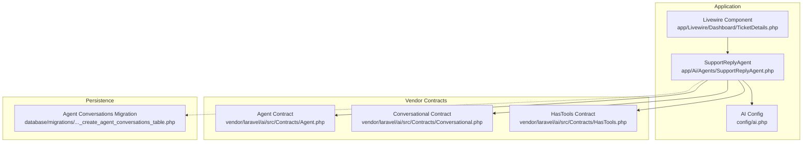
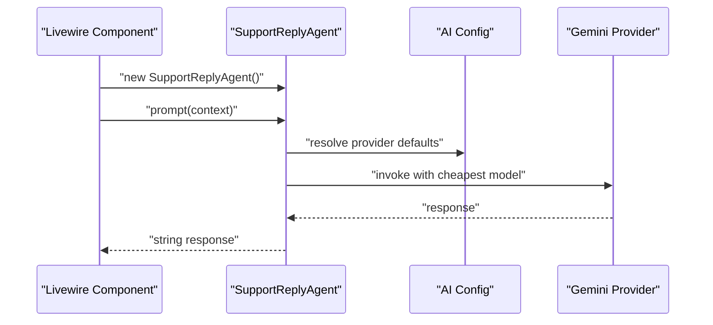
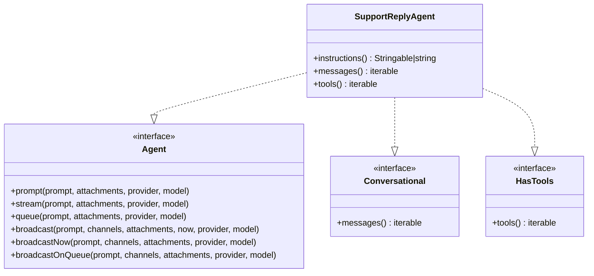
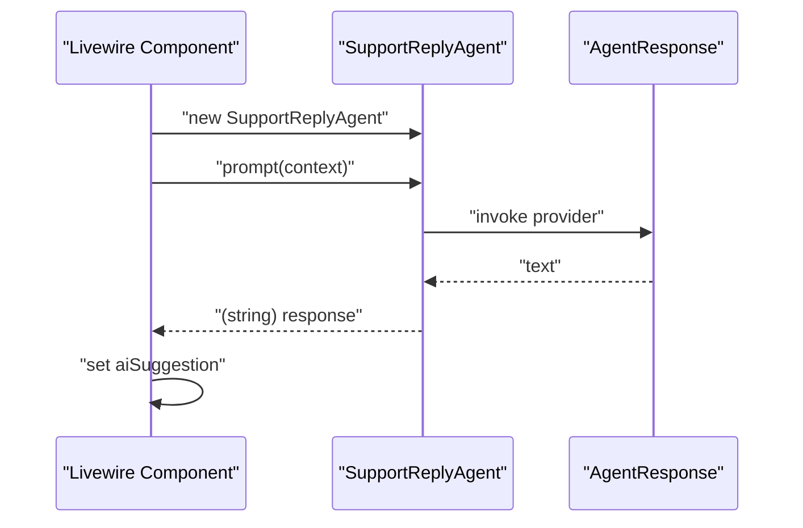
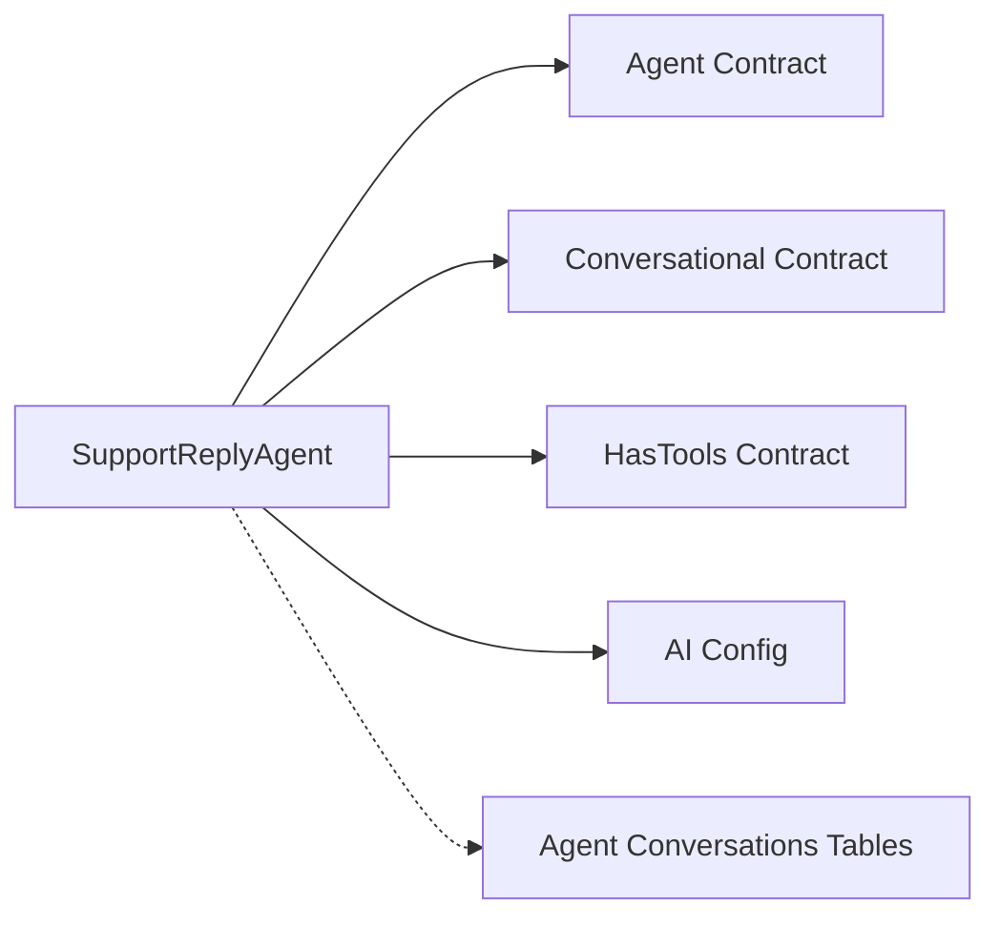

# AI Agent Configuration

<cite>
**Referenced Files in This Document**
- [SupportReplyAgent.php](file://app/Ai/Agents/SupportReplyAgent.php)
- [ai.php](file://config/ai.php)
- [Agent.php](file://vendor/laravel/ai/src/Contracts/Agent.php)
- [Conversational.php](file://vendor/laravel/ai/src/Contracts/Conversational.php)
- [HasTools.php](file://vendor/laravel/ai/src/Contracts/HasTools.php)
- [TicketDetails.php](file://app/Livewire/Dashboard/TicketDetails.php)
- [LaravelAISDKdocs.txt](file://LaravelAISDKdocs.txt)
- [2026_03_10_065534_create_agent_conversations_table.php](file://database/migrations/2026_03_10_065534_create_agent_conversations_table.php)
</cite>

## Table of Contents
1. [Introduction](#introduction)
2. [Project Structure](#project-structure)
3. [Core Components](#core-components)
4. [Architecture Overview](#architecture-overview)
5. [Detailed Component Analysis](#detailed-component-analysis)
6. [Dependency Analysis](#dependency-analysis)
7. [Performance Considerations](#performance-considerations)
8. [Troubleshooting Guide](#troubleshooting-guide)
9. [Conclusion](#conclusion)
10. [Appendices](#appendices)

## Introduction
This document explains how AI agents are configured and used in the helpdesk system, with a focus on the SupportReplyAgent. It details provider selection (Google Gemini), model configuration, and pricing optimization settings via attributes. It also documents the agent’s contract implementations (Agent, Conversational, HasTools), shows how to configure multiple providers, and provides examples and troubleshooting guidance for reliable deployments.

## Project Structure
The AI agent configuration centers around:
- The agent class under app/Ai/Agents
- The AI configuration under config/ai.php
- Vendor-provided contracts under vendor/laravel/ai/src/Contracts
- A Livewire component that invokes the agent
- Migrations for persistent conversation storage

**Diagram sources**
- [SupportReplyAgent.php:16-18](file://app/Ai/Agents/SupportReplyAgent.php#L16-L18)
- [ai.php:16](file://config/ai.php#L16)
- [TicketDetails.php:371-378](file://app/Livewire/Dashboard/TicketDetails.php#L371-L378)
- [Agent.php:12-82](file://vendor/laravel/ai/src/Contracts/Agent.php#L12-L82)
- [Conversational.php:7-15](file://vendor/laravel/ai/src/Contracts/Conversational.php#L7-L15)
- [HasTools.php:5-13](file://vendor/laravel/ai/src/Contracts/HasTools.php#L5-L13)
- [2026_03_10_065534_create_agent_conversations_table.php:14-39](file://database/migrations/2026_03_10_065534_create_agent_conversations_table.php#L14-L39)

**Section sources**
- [SupportReplyAgent.php:16-18](file://app/Ai/Agents/SupportReplyAgent.php#L16-L18)
- [ai.php:16](file://config/ai.php#L16)
- [TicketDetails.php:371-378](file://app/Livewire/Dashboard/TicketDetails.php#L371-L378)
- [Agent.php:12-82](file://vendor/laravel/ai/src/Contracts/Agent.php#L12-L82)
- [Conversational.php:7-15](file://vendor/laravel/ai/src/Contracts/Conversational.php#L7-L15)
- [HasTools.php:5-13](file://vendor/laravel/ai/src/Contracts/HasTools.php#L5-L13)
- [2026_03_10_065534_create_agent_conversations_table.php:14-39](file://database/migrations/2026_03_10_065534_create_agent_conversations_table.php#L14-L39)

## Core Components
- SupportReplyAgent: Implements Agent, Conversational, and HasTools. It selects Google Gemini as the provider and uses the cheapest model for cost optimization. It defines concise instructions for generating customer support replies.
- AI Configuration: Defines default providers and provider credentials for multiple AI services.
- Contracts: Define the capabilities exposed by agents (invocation, streaming, queuing, broadcasting) and optional conversation and tooling behaviors.
- Livewire Integration: Demonstrates invoking the agent from a UI component and handling errors gracefully.

Key implementation references:
- Agent class declaration and attributes: [SupportReplyAgent.php:16-18](file://app/Ai/Agents/SupportReplyAgent.php#L16-L18)
- Instructions and empty conversation/tools: [SupportReplyAgent.php:25-48](file://app/Ai/Agents/SupportReplyAgent.php#L25-L48)
- AI defaults and provider registry: [ai.php:16](file://config/ai.php#L16), [ai.php:52-127](file://config/ai.php#L52-L127)
- Agent contract methods: [Agent.php:12-82](file://vendor/laravel/ai/src/Contracts/Agent.php#L12-L82)
- Conversational contract: [Conversational.php:7-15](file://vendor/laravel/ai/src/Contracts/Conversational.php#L7-L15)
- HasTools contract: [HasTools.php:5-13](file://vendor/laravel/ai/src/Contracts/HasTools.php#L5-L13)
- Invocation from Livewire: [TicketDetails.php:371-378](file://app/Livewire/Dashboard/TicketDetails.php#L371-L378)

**Section sources**
- [SupportReplyAgent.php:16-48](file://app/Ai/Agents/SupportReplyAgent.php#L16-L48)
- [ai.php:16](file://config/ai.php#L16)
- [ai.php:52-127](file://config/ai.php#L52-L127)
- [Agent.php:12-82](file://vendor/laravel/ai/src/Contracts/Agent.php#L12-L82)
- [Conversational.php:7-15](file://vendor/laravel/ai/src/Contracts/Conversational.php#L7-L15)
- [HasTools.php:5-13](file://vendor/laravel/ai/src/Contracts/HasTools.php#L5-L13)
- [TicketDetails.php:371-378](file://app/Livewire/Dashboard/TicketDetails.php#L371-L378)

## Architecture Overview
The agent architecture integrates configuration, contracts, and invocation:

**Diagram sources**
- [TicketDetails.php:371-378](file://app/Livewire/Dashboard/TicketDetails.php#L371-L378)
- [SupportReplyAgent.php:16-18](file://app/Ai/Agents/SupportReplyAgent.php#L16-L18)
- [ai.php:16](file://config/ai.php#L16)

## Detailed Component Analysis

### SupportReplyAgent Implementation
- Provider selection: Uses the Provider attribute with Google Gemini.
- Pricing optimization: Applies UseCheapestModel to minimize cost.
- Contract implementations:
  - Agent: Provides instructions and exposes prompt/stream/queue/broadcast methods.
  - Conversational: Returns an empty message list (no prior context).
  - HasTools: Returns an empty tool list (no external tools).
- Behavior: Generates concise, direct replies suitable for customer support.

**Diagram sources**
- [SupportReplyAgent.php:16-48](file://app/Ai/Agents/SupportReplyAgent.php#L16-L48)
- [Agent.php:12-82](file://vendor/laravel/ai/src/Contracts/Agent.php#L12-L82)
- [Conversational.php:7-15](file://vendor/laravel/ai/src/Contracts/Conversational.php#L7-L15)
- [HasTools.php:5-13](file://vendor/laravel/ai/src/Contracts/HasTools.php#L5-L13)

**Section sources**
- [SupportReplyAgent.php:16-48](file://app/Ai/Agents/SupportReplyAgent.php#L16-L48)
- [Agent.php:12-82](file://vendor/laravel/ai/src/Contracts/Agent.php#L12-L82)
- [Conversational.php:7-15](file://vendor/laravel/ai/src/Contracts/Conversational.php#L7-L15)
- [HasTools.php:5-13](file://vendor/laravel/ai/src/Contracts/HasTools.php#L5-L13)

### AI Configuration and Provider Selection
- Defaults: The config sets default providers for text, images, audio, transcription, embeddings, and reranking.
- Provider registry: Includes Google Gemini and many others, each with driver and key entries.
- Environment-driven keys: Keys are read from environment variables.

Examples of configuration references:
- Default provider selection: [ai.php:16](file://config/ai.php#L16)
- Provider registry (including Gemini): [ai.php:52-127](file://config/ai.php#L52-L127)

**Section sources**
- [ai.php:16](file://config/ai.php#L16)
- [ai.php:52-127](file://config/ai.php#L52-L127)

### Agent Invocation Flow
- Livewire component creates the agent and calls prompt with contextual text.
- Errors are caught and surfaced to the UI.

**Diagram sources**
- [TicketDetails.php:371-378](file://app/Livewire/Dashboard/TicketDetails.php#L371-L378)
- [SupportReplyAgent.php:16-18](file://app/Ai/Agents/SupportReplyAgent.php#L16-L18)

**Section sources**
- [TicketDetails.php:371-378](file://app/Livewire/Dashboard/TicketDetails.php#L371-L378)

### Pricing Optimization Attributes
- UseCheapestModel: Automatically selects the provider’s cheapest text model for cost optimization.
- UseSmartestModel: Selects the most capable model for complex tasks.
- Additional attributes for tuning: MaxSteps, MaxTokens, Model, Provider, Temperature, Timeout.

References:
- Attribute documentation: [LaravelAISDKdocs.txt:672-731](file://LaravelAISDKdocs.txt#L672-L731)

**Section sources**
- [LaravelAISDKdocs.txt:672-731](file://LaravelAISDKdocs.txt#L672-L731)

### Examples: Configuring Different Providers and Models
- Provider override: Pass provider to prompt to override defaults.
- Model override: Pass model to prompt to select a specific model.
- Timeout override: Pass timeout to prompt for long-running generations.

References:
- Prompt overrides: [LaravelAISDKdocs.txt:172-179](file://LaravelAISDKdocs.txt#L172-L179)

**Section sources**
- [LaravelAISDKdocs.txt:172-179](file://LaravelAISDKdocs.txt#L172-L179)

### Implementing Custom Agent Behaviors
- Implement additional tools by returning Tool instances from tools().
- Provide structured output by implementing HasStructuredOutput (not used by SupportReplyAgent).
- Add conversation context by implementing messages().

References:
- Tools and structured output examples: [LaravelAISDKdocs.txt:88-155](file://LaravelAISDKdocs.txt#L88-L155), [LaravelAISDKdocs.txt:245-279](file://LaravelAISDKdocs.txt#L245-L279)
- Stub templates for agents and tools: [agent.stub](file://stubs/agent.stub), [tool.stub](file://stubs/tool.stub)

**Section sources**
- [LaravelAISDKdocs.txt:88-155](file://LaravelAISDKdocs.txt#L88-L155)
- [LaravelAISDKdocs.txt:245-279](file://LaravelAISDKdocs.txt#L245-L279)
- [agent.stub:13-44](file://stubs/agent.stub#L13-L44)
- [tool.stub:10-37](file://stubs/tool.stub#L10-L37)

## Dependency Analysis
- SupportReplyAgent depends on:
  - Laravel AI contracts for behavior
  - AI configuration for provider resolution
  - Optional persistence via agent conversations tables

**Diagram sources**
- [SupportReplyAgent.php:16-48](file://app/Ai/Agents/SupportReplyAgent.php#L16-L48)
- [Agent.php:12-82](file://vendor/laravel/ai/src/Contracts/Agent.php#L12-L82)
- [Conversational.php:7-15](file://vendor/laravel/ai/src/Contracts/Conversational.php#L7-L15)
- [HasTools.php:5-13](file://vendor/laravel/ai/src/Contracts/HasTools.php#L5-L13)
- [ai.php:16](file://config/ai.php#L16)
- [2026_03_10_065534_create_agent_conversations_table.php:14-39](file://database/migrations/2026_03_10_065534_create_agent_conversations_table.php#L14-L39)

**Section sources**
- [SupportReplyAgent.php:16-48](file://app/Ai/Agents/SupportReplyAgent.php#L16-L48)
- [Agent.php:12-82](file://vendor/laravel/ai/src/Contracts/Agent.php#L12-L82)
- [Conversational.php:7-15](file://vendor/laravel/ai/src/Contracts/Conversational.php#L7-L15)
- [HasTools.php:5-13](file://vendor/laravel/ai/src/Contracts/HasTools.php#L5-L13)
- [ai.php:16](file://config/ai.php#L16)
- [2026_03_10_065534_create_agent_conversations_table.php:14-39](file://database/migrations/2026_03_10_065534_create_agent_conversations_table.php#L14-L39)

## Performance Considerations
- Cost optimization: Use UseCheapestModel to reduce expenses when high speed or simplicity suffices.
- Capability vs. cost: Use UseSmartestModel for complex reasoning or nuanced outputs when budget allows.
- Token limits: Configure MaxTokens to control output length and cost.
- Streaming and queuing: Prefer stream() or queue() for long-running prompts to improve responsiveness and throughput.
- Attachments: Limit attachment sizes and counts to reduce latency and cost.

[No sources needed since this section provides general guidance]

## Troubleshooting Guide
Common issues and resolutions:
- Missing API key: Ensure the Gemini API key is set in the environment and reflected in the AI config.
  - Reference: [ai.php:82-85](file://config/ai.php#L82-L85)
- Provider mismatch: Confirm the Provider attribute matches a configured provider.
  - Reference: [SupportReplyAgent.php:16](file://app/Ai/Agents/SupportReplyAgent.php#L16)
- No response or slow response: Adjust Timeout or switch to UseCheapestModel for faster, cheaper runs.
  - References: [LaravelAISDKdocs.txt:672-731](file://LaravelAISDKdocs.txt#L672-L731)
- Unexpected output: Tune Temperature or restrict model via Model attribute.
  - References: [LaravelAISDKdocs.txt:672-731](file://LaravelAISDKdocs.txt#L672-L731)
- Conversation persistence: Verify agent conversations tables exist and migrations have run.
  - Reference: [2026_03_10_065534_create_agent_conversations_table.php:14-39](file://database/migrations/2026_03_10_065534_create_agent_conversations_table.php#L14-L39)
- UI errors: Wrap agent invocations in try/catch and surface user-friendly messages.
  - Reference: [TicketDetails.php:371-378](file://app/Livewire/Dashboard/TicketDetails.php#L371-L378)

**Section sources**
- [ai.php:82-85](file://config/ai.php#L82-L85)
- [SupportReplyAgent.php:16](file://app/Ai/Agents/SupportReplyAgent.php#L16)
- [LaravelAISDKdocs.txt:672-731](file://LaravelAISDKdocs.txt#L672-L731)
- [2026_03_10_065534_create_agent_conversations_table.php:14-39](file://database/migrations/2026_03_10_065534_create_agent_conversations_table.php#L14-L39)
- [TicketDetails.php:371-378](file://app/Livewire/Dashboard/TicketDetails.php#L371-L378)

## Conclusion
The SupportReplyAgent demonstrates a clean, cost-conscious AI integration for helpdesk reply suggestions. By leveraging the Provider and UseCheapestModel attributes, it aligns with budget constraints while remaining compatible with the broader Laravel AI SDK ecosystem. The AI configuration supports multiple providers, and Livewire integration enables responsive, user-friendly agent invocation. Extending the agent with tools, structured outputs, and richer conversation context follows established patterns in the codebase.

[No sources needed since this section summarizes without analyzing specific files]

## Appendices

### Best Practices for Agent Deployment
- Centralize provider credentials in config/ai.php and environment variables.
- Use UseCheapestModel for routine tasks; reserve UseSmartestModel for complex scenarios.
- Implement streaming or queuing for long prompts to maintain UI responsiveness.
- Persist conversations using the provided agent_conversations tables for auditability and continuity.
- Validate prompts and handle exceptions gracefully in UI components.

[No sources needed since this section provides general guidance]