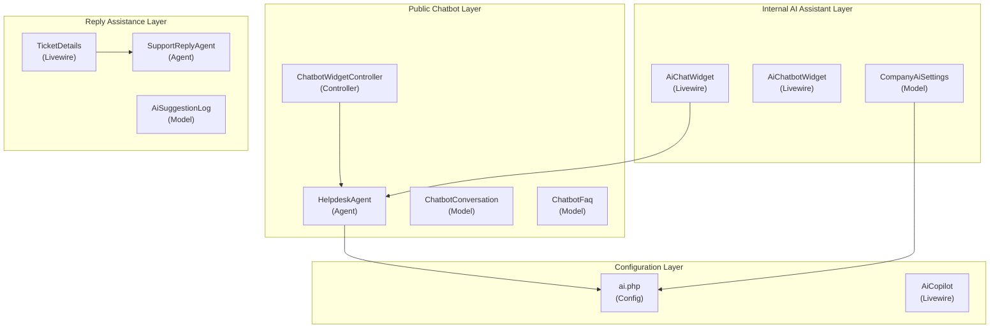
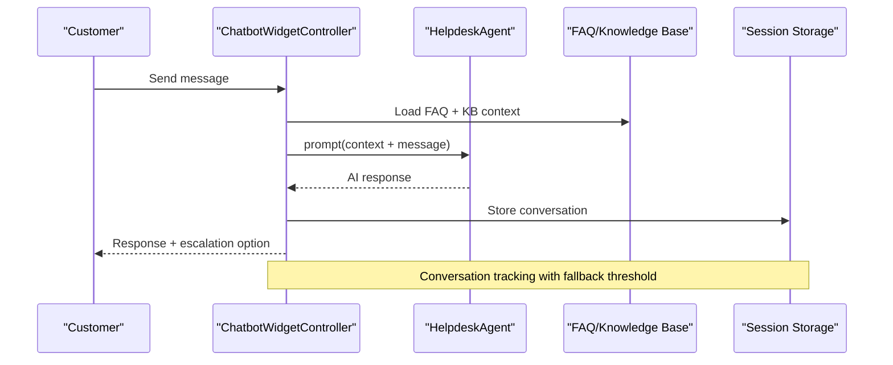
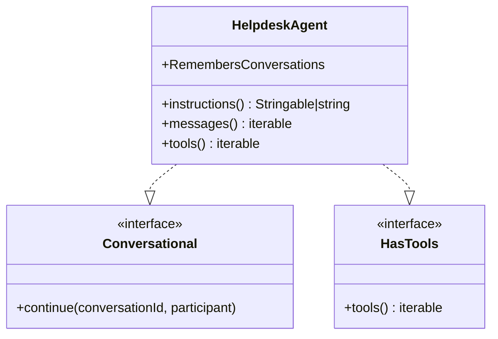
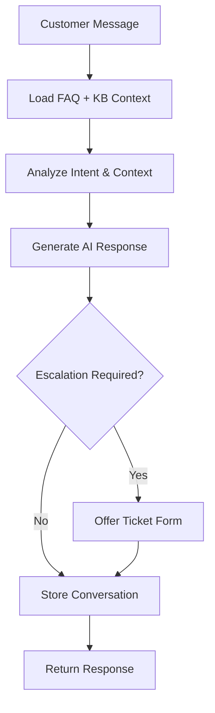
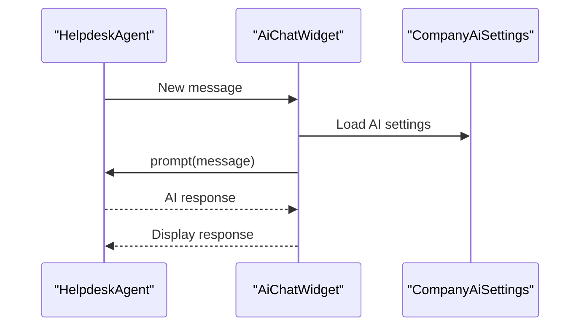
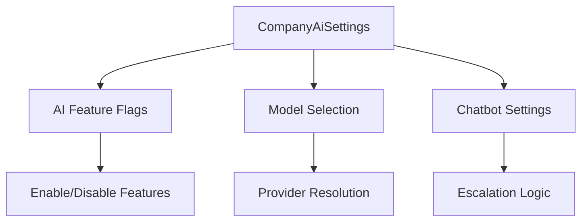
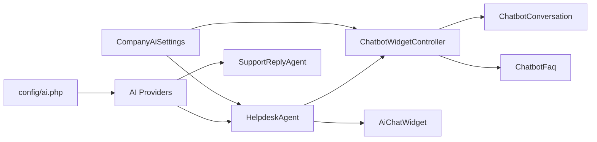
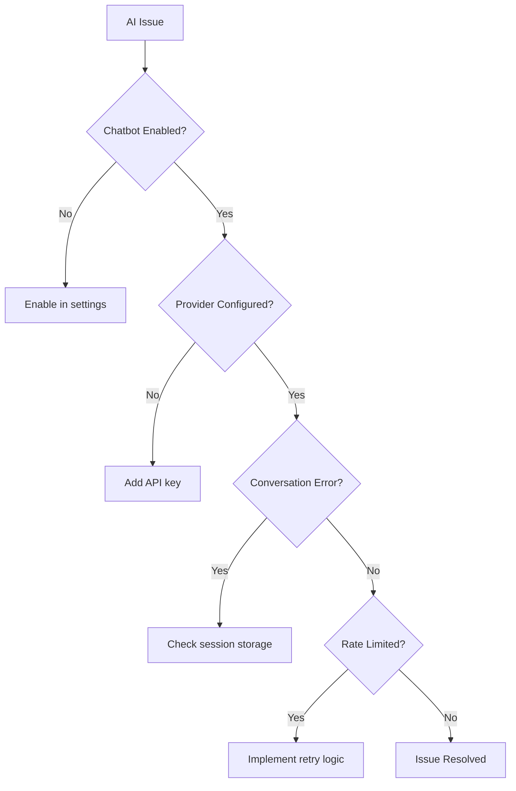

# AI Integration

<cite>
**Referenced Files in This Document**
- [SupportReplyAgent.php](file://app/Ai/Agents/SupportReplyAgent.php)
- [HelpdeskAgent.php](file://app/Ai/Agents/HelpdeskAgent.php)
- [ChatbotWidgetController.php](file://app/Http/Controllers/ChatbotWidgetController.php)
- [AiChatWidget.php](file://app/Livewire/AiChatWidget.php)
- [AiChatbotWidget.php](file://app/Livewire/Channels/AiChatbotWidget.php)
- [AiCopilot.php](file://app/Livewire/Settings/AiCopilot.php)
- [ai.php](file://config/ai.php)
- [TicketDetails.php](file://app/Livewire/Dashboard/TicketDetails.php)
- [ticket-details.blade.php](file://resources/views/livewire/dashboard/ticket-details.blade.php)
- [ai-chat-widget.blade.php](file://resources/views/livewire/ai-chat-widget.blade.php)
- [ai-chatbot-widget.blade.php](file://resources/views/livewire/channels/ai-chatbot-widget.blade.php)
- [LaravelAISDKdocs.txt](file://LaravelAISDKdocs.txt)
- [Ticket.php](file://app/Models/Ticket.php)
- [TicketReply.php](file://app/Models/TicketReply.php)
- [TicketsController.php](file://app/Http/Controllers/TicketsController.php)
- [CompanyAiSettings.php](file://app/Models/CompanyAiSettings.php)
- [ChatbotConversation.php](file://app/Models/ChatbotConversation.php)
- [ChatbotFaq.php](file://app/Models/ChatbotFaq.php)
- [AiSuggestionLog.php](file://app/Models/AiSuggestionLog.php)
</cite>

## Update Summary
**Changes Made**
- Added comprehensive AI chatbot system with HelpdeskAgent implementation
- Integrated ChatbotWidgetController for public-facing customer chatbot
- Enhanced internal AI assistance with AiChatWidget for agent-only conversations
- Expanded AI copilot settings with model selection and feature toggles
- Added AI suggestion training and golden response management
- Implemented conversation persistence and escalation handling

## Table of Contents
1. [Introduction](#introduction)
2. [Project Structure](#project-structure)
3. [Core Components](#core-components)
4. [Architecture Overview](#architecture-overview)
5. [Detailed Component Analysis](#detailed-component-analysis)
6. [Dependency Analysis](#dependency-analysis)
7. [Performance Considerations](#performance-considerations)
8. [Troubleshooting Guide](#troubleshooting-guide)
9. [Conclusion](#conclusion)

## Introduction
This document explains the comprehensive AI integration system powered by Google Gemini and other AI providers within the Helpdesk System. The system now features three distinct AI implementations: SupportReplyAgent for ticket-based reply suggestions, HelpdeskAgent for both public customer chatbot and internal agent assistance, and an expanded AI copilot system with advanced configuration options. The system supports customer-facing chatbot widgets, internal agent AI assistants, automated reply suggestions, and comprehensive AI training capabilities.

## Project Structure
The AI integration spans multiple layers with distinct components for different use cases:
- Agent implementations under the AI Agents namespace (SupportReplyAgent, HelpdeskAgent)
- Public chatbot controllers and widgets for customer interactions
- Internal AI assistant for agent-only conversations
- Comprehensive AI settings and configuration management
- Training and feedback systems for AI improvement
- Conversation persistence and escalation handling

**Diagram sources**
- [HelpdeskAgent.php:16-42](file://app/Ai/Agents/HelpdeskAgent.php#L16-L42)
- [ChatbotWidgetController.php:16-337](file://app/Http/Controllers/ChatbotWidgetController.php#L16-L337)
- [AiChatWidget.php:13-275](file://app/Livewire/AiChatWidget.php#L13-L275)
- [AiChatbotWidget.php:13-211](file://app/Livewire/Channels/AiChatbotWidget.php#L13-L211)
- [SupportReplyAgent.php:16-49](file://app/Ai/Agents/SupportReplyAgent.php#L16-L49)
- [ai.php:82-85](file://config/ai.php#L82-L85)

**Section sources**
- [HelpdeskAgent.php:16-42](file://app/Ai/Agents/HelpdeskAgent.php#L16-L42)
- [ChatbotWidgetController.php:16-337](file://app/Http/Controllers/ChatbotWidgetController.php#L16-L337)
- [AiChatWidget.php:13-275](file://app/Livewire/AiChatWidget.php#L13-L275)
- [AiChatbotWidget.php:13-211](file://app/Livewire/Channels/AiChatbotWidget.php#L13-L211)
- [SupportReplyAgent.php:16-49](file://app/Ai/Agents/SupportReplyAgent.php#L16-L49)
- [ai.php:82-85](file://config/ai.php#L82-L85)

## Core Components
- **HelpdeskAgent**: Advanced conversational AI agent with memory retention, supporting both public chatbot interactions and internal agent assistance with model selection and provider configuration.
- **ChatbotWidgetController**: Handles public customer chatbot interactions, including FAQ integration, knowledge base context, escalation handling, and conversation persistence.
- **AiChatWidget**: Internal AI assistant for agents with conversation history, quick replies, and seamless integration with the HelpdeskAgent.
- **AiChatbotWidget**: Configuration interface for enabling/disabling chatbot, setting greeting messages, fallback thresholds, and escalation URLs.
- **CompanyAiSettings**: Centralized AI configuration management with provider resolution and model selection.
- **Enhanced SupportReplyAgent**: Improved reply suggestion system with better context injection and tone control.

**Section sources**
- [HelpdeskAgent.php:16-42](file://app/Ai/Agents/HelpdeskAgent.php#L16-L42)
- [ChatbotWidgetController.php:16-337](file://app/Http/Controllers/ChatbotWidgetController.php#L16-L337)
- [AiChatWidget.php:13-275](file://app/Livewire/AiChatWidget.php#L13-L275)
- [AiChatbotWidget.php:13-211](file://app/Livewire/Channels/AiChatbotWidget.php#L13-L211)
- [CompanyAiSettings.php:14-58](file://app/Models/CompanyAiSettings.php#L14-L58)
- [SupportReplyAgent.php:16-49](file://app/Ai/Agents/SupportReplyAgent.php#L16-L49)

## Architecture Overview
The AI system now operates across three distinct interaction modes with sophisticated escalation handling and conversation management:

**Diagram sources**
- [ChatbotWidgetController.php:77-223](file://app/Http/Controllers/ChatbotWidgetController.php#L77-L223)
- [HelpdeskAgent.php:25-28](file://app/Ai/Agents/HelpdeskAgent.php#L25-L28)

## Detailed Component Analysis

### HelpdeskAgent Implementation
The HelpdeskAgent serves as the core conversational AI component supporting both public chatbot and internal agent assistance:

- **Provider and Model Configuration**: Uses Google Gemini with the `gemini-2.5-flash` model for optimal balance of speed and cost
- **Conversational Memory**: Implements `RemembersConversations` trait for automatic conversation history management
- **Instructions**: Provides comprehensive guidance for customer support scenarios including billing, integrations, and ticketing interface
- **Plain Text Responses**: Enforces plain text formatting without markdown for consistent presentation

**Diagram sources**
- [HelpdeskAgent.php:18-41](file://app/Ai/Agents/HelpdeskAgent.php#L18-L41)

**Section sources**
- [HelpdeskAgent.php:16-42](file://app/Ai/Agents/HelpdeskAgent.php#L16-L42)

### Public Chatbot System
The ChatbotWidgetController provides a complete customer-facing chatbot solution with intelligent escalation handling:

- **Context Management**: Integrates FAQ database and knowledge base articles for informed responses
- **Escalation Logic**: Implements sophisticated escalation detection based on conversation patterns and fallback thresholds
- **Session Persistence**: Maintains conversation state across requests with outcome tracking (active, resolved, escalated)
- **Fallback Handling**: Automatically offers ticket form access when AI cannot answer customer queries

**Diagram sources**
- [ChatbotWidgetController.php:123-144](file://app/Http/Controllers/ChatbotWidgetController.php#L123-L144)
- [ChatbotWidgetController.php:165-188](file://app/Http/Controllers/ChatbotWidgetController.php#L165-L188)

**Section sources**
- [ChatbotWidgetController.php:77-223](file://app/Http/Controllers/ChatbotWidgetController.php#L77-L223)

### Internal AI Assistant for Agents
The AiChatWidget provides an integrated AI assistant within the Helpdesk system for agent use:

- **Conversation Management**: Supports multiple concurrent conversations with history persistence
- **Quick Replies**: Predefined response suggestions for common scenarios
- **Provider Flexibility**: Dynamic provider selection based on company AI settings
- **Error Handling**: Graceful degradation with informative error messages

**Diagram sources**
- [AiChatWidget.php:179-268](file://app/Livewire/AiChatWidget.php#L179-L268)

**Section sources**
- [AiChatWidget.php:13-275](file://app/Livewire/AiChatWidget.php#L13-L275)

### AI Configuration and Settings
Comprehensive AI configuration management through CompanyAiSettings:

- **Feature Toggles**: Enable/disable AI suggestions, summaries, chatbot, and auto-triage
- **Model Selection**: Support for multiple providers (Gemini, OpenAI, Anthropic) with automatic provider resolution
- **Chatbot Configuration**: Greeting messages, fallback thresholds, and escalation URL types
- **Provider Resolution**: Automatic provider selection based on model naming conventions

**Diagram sources**
- [CompanyAiSettings.php:14-58](file://app/Models/CompanyAiSettings.php#L14-L58)
- [AiCopilot.php:30-49](file://app/Livewire/Settings/AiCopilot.php#L30-L49)

**Section sources**
- [CompanyAiSettings.php:14-58](file://app/Models/CompanyAiSettings.php#L14-L58)
- [AiCopilot.php:9-81](file://app/Livewire/Settings/AiCopilot.php#L9-L81)

### Enhanced Reply Suggestion System
Improved SupportReplyAgent with advanced context injection and quality controls:

- **Context Enhancement**: Rich ticket context including category, priority, customer details, and full conversation history
- **Tone Control**: Multiple tone options (professional, friendly, formal) with dynamic regeneration
- **Quality Assurance**: Plain text formatting, character limits, and validation
- **Approval Workflow**: Seamless integration with existing ticket reply system

**Section sources**
- [SupportReplyAgent.php:16-49](file://app/Ai/Agents/SupportReplyAgent.php#L16-L49)
- [TicketDetails.php:345-444](file://app/Livewire/Dashboard/TicketDetails.php#L345-L444)

### AI Training and Feedback System
Comprehensive system for AI improvement through training data:

- **Suggestion Logging**: Tracks AI suggestions, user actions, and edited responses
- **Golden Response Management**: Curated responses for training and quality assurance
- **Training Interface**: Dedicated UI for managing training data and monitoring performance
- **Feedback Loop**: Continuous improvement through user interactions and agent approvals

**Section sources**
- [AiSuggestionLog.php:11-39](file://app/Models/AiSuggestionLog.php#L11-L39)
- [SuggestedRepliesTraining.php:16-107](file://app/Livewire/Ai/SuggestedRepliesTraining.php#L16-L107)

## Dependency Analysis
The AI system exhibits layered dependencies with clear separation of concerns:

**Diagram sources**
- [ai.php:52-127](file://config/ai.php#L52-L127)
- [HelpdeskAgent.php:16-17](file://app/Ai/Agents/HelpdeskAgent.php#L16-L17)
- [ChatbotWidgetController.php:5-14](file://app/Http/Controllers/ChatbotWidgetController.php#L5-L14)
- [CompanyAiSettings.php:51-58](file://app/Models/CompanyAiSettings.php#L51-L58)

**Section sources**
- [ai.php:52-127](file://config/ai.php#L52-L127)
- [HelpdeskAgent.php:16-17](file://app/Ai/Agents/HelpdeskAgent.php#L16-L17)
- [ChatbotWidgetController.php:5-14](file://app/Http/Controllers/ChatbotWidgetController.php#L5-L14)
- [CompanyAiSettings.php:51-58](file://app/Models/CompanyAiSettings.php#L51-L58)

## Performance Considerations
- **Cost Optimization**: Strategic use of `gemini-2.5-flash` model for balanced performance and cost
- **Provider Selection**: Automatic provider resolution reduces configuration overhead
- **Conversation Persistence**: Efficient session storage with outcome tracking minimizes redundant processing
- **Rate Limiting**: Built-in error handling for rate limit exceeded scenarios
- **Caching Strategy**: Configurable embedding caching for improved response times

**Section sources**
- [HelpdeskAgent.php:17](file://app/Ai/Agents/HelpdeskAgent.php#L17)
- [CompanyAiSettings.php:51-58](file://app/Models/CompanyAiSettings.php#L51-L58)
- [AiChatWidget.php:251-264](file://app/Livewire/AiChatWidget.php#L251-L264)

## Troubleshooting Guide
- **Chatbot Disabled**: Check CompanyAiSettings for `ai_chatbot_enabled` flag
- **Provider Configuration**: Verify API keys in config/ai.php for selected provider
- **Conversation Issues**: Review ChatbotConversation model for proper session handling
- **Rate Limiting**: Monitor error messages and implement retry logic for 429 responses
- **Escalation Problems**: Verify escalation URL configuration in CompanyAiSettings

**Diagram sources**
- [AiChatWidget.php:189-200](file://app/Livewire/AiChatWidget.php#L189-L200)
- [ChatbotWidgetController.php:94-96](file://app/Http/Controllers/ChatbotWidgetController.php#L94-L96)

**Section sources**
- [AiChatWidget.php:189-200](file://app/Livewire/AiChatWidget.php#L189-L200)
- [ChatbotWidgetController.php:94-96](file://app/Http/Controllers/ChatbotWidgetController.php#L94-L96)

## Conclusion
The enhanced AI integration system provides comprehensive artificial intelligence capabilities across multiple touchpoints within the Helpdesk ecosystem. The addition of HelpdeskAgent, ChatbotWidgetController, and internal AI assistance creates a robust foundation for customer support automation while maintaining flexibility for agent assistance and training. The system's modular architecture supports easy configuration, provider switching, and continuous improvement through user feedback and training data management.