# AI Integration

<cite>
**Referenced Files in This Document**
- [SupportReplyAgent.php](file://app/Ai/Agents/SupportReplyAgent.php)
- [HelpdeskAgent.php](file://app/Ai/Agents/HelpdeskAgent.php)
- [ChatbotWidgetController.php](file://app/Http/Controllers/ChatbotWidgetController.php)
- [AiChatWidget.php](file://app/Livewire/AiChatWidget.php)
- [AiChatbotWidget.php](file://app/Livewire/Channels/AiChatbotWidget.php)
- [AiCopilot.php](file://app/Livewire/Settings/AiCopilot.php)
- [UsageStats.php](file://app/Livewire/Ai/UsageStats.php)
- [ChatHistory.php](file://app/Livewire/Ai/ChatHistory.php)
- [SuggestedRepliesTraining.php](file://app/Livewire/Ai/SuggestedRepliesTraining.php)
- [ai.php](file://config/ai.php)
- [TicketDetails.php](file://app/Livewire/Dashboard/TicketDetails.php)
- [ticket-details.blade.php](file://resources/views/livewire/dashboard/ticket-details.blade.php)
- [ai-chat-widget.blade.php](file://resources/views/livewire/ai-chat-widget.blade.php)
- [ai-chatbot-widget.blade.php](file://resources/views/livewire/channels/ai-chatbot-widget.blade.php)
- [LaravelAISDKdocs.txt](file://LaravelAISDKdocs.txt)
- [Ticket.php](file://app/Models/Ticket.php)
- [TicketReply.php](file://app/Models/TicketReply.php)
- [TicketsController.php](file://app/Http/Controllers/TicketsController.php)
- [CompanyAiSettings.php](file://app/Models/CompanyAiSettings.php)
- [ChatbotConversation.php](file://app/Models/ChatbotConversation.php)
- [ChatbotFaq.php](file://app/Models/ChatbotFaq.php)
- [AiSuggestionLog.php](file://app/Models/AiSuggestionLog.php)
- [GoldenResponse.php](file://app/Models/GoldenResponse.php)
</cite>

## Update Summary
**Changes Made**
- Enhanced AI chatbot system with comprehensive knowledge base integration and intelligent context injection
- Implemented sophisticated escalation handling with automatic ticket form escalation and outcome tracking
- Added conversation persistence layer with session-based storage and lifecycle management
- Introduced centralized AI Copilot system for unified AI configuration and provider management
- Deployed usage statistics tracking with acceptance rates, deflection metrics, and time savings calculations
- Established chat history management with outcome classification and abandonment detection
- Created suggested replies training system with golden response curation and suggestion feed monitoring
- Expanded provider integrations to support 14+ AI providers including Anthropic, Azure OpenAI, and specialized providers

## Table of Contents
1. [Introduction](#introduction)
2. [Project Structure](#project-structure)
3. [Core Components](#core-components)
4. [Architecture Overview](#architecture-overview)
5. [Detailed Component Analysis](#detailed-component-analysis)
6. [AI Copilot System](#ai-copilot-system)
7. [Usage Statistics and Analytics](#usage-statistics-and-analytics)
8. [Chat History Management](#chat-history-management)
9. [Suggested Replies Training](#suggested-replies-training)
10. [Enhanced Provider Integrations](#enhanced-provider-integrations)
11. [Knowledge Base Integration](#knowledge-base-integration)
12. [Escalation Handling System](#escalation-handling-system)
13. [Conversation Persistence Layer](#conversation-persistence-layer)
14. [Dependency Analysis](#dependency-analysis)
15. [Performance Considerations](#performance-considerations)
16. [Troubleshooting Guide](#troubleshooting-guide)
17. [Conclusion](#conclusion)

## Introduction
This document explains the comprehensive AI integration system powered by Google Gemini and multiple AI providers within the Helpdesk System. The system features three distinct AI implementations: SupportReplyAgent for ticket-based reply suggestions, HelpdeskAgent for both public customer chatbot and internal agent assistance, and an expanded AI copilot system with advanced configuration options. The system now includes centralized AI configuration management, usage statistics tracking, chat history management, and suggested replies training capabilities. The enhanced system supports customer-facing chatbot widgets, internal agent AI assistants, automated reply suggestions, and comprehensive AI training and analytics.

## Project Structure
The AI integration spans multiple layers with distinct components for different use cases:
- Agent implementations under the AI Agents namespace (SupportReplyAgent, HelpdeskAgent)
- Public chatbot controllers and widgets for customer interactions
- Internal AI assistant for agent-only conversations
- Comprehensive AI settings and configuration management through AI Copilot
- Usage statistics and analytics tracking
- Chat history management with lifecycle tracking
- Training and feedback systems for AI improvement
- Conversation persistence and escalation handling
- Enhanced provider integrations with 14+ AI providers

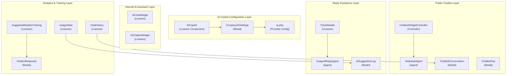

**Diagram sources**
- [AiCopilot.php:17-34](file://app/Livewire/Settings/AiCopilot.php#L17-L34)
- [CompanyAiSettings.php:49-56](file://app/Models/CompanyAiSettings.php#L49-L56)
- [ai.php:52-127](file://config/ai.php#L52-L127)
- [HelpdeskAgent.php:16-17](file://app/Ai/Agents/HelpdeskAgent.php#L16-L17)
- [ChatbotWidgetController.php:5-14](file://app/Http/Controllers/ChatbotWidgetController.php#L5-L14)
- [UsageStats.php:15-51](file://app/Livewire/Ai/UsageStats.php#L15-L51)
- [ChatHistory.php:38-46](file://app/Livewire/Ai/ChatHistory.php#L38-L46)
- [SuggestedRepliesTraining.php:36-54](file://app/Livewire/Ai/SuggestedRepliesTraining.php#L36-L54)

**Section sources**
- [AiCopilot.php:17-34](file://app/Livewire/Settings/AiCopilot.php#L17-L34)
- [CompanyAiSettings.php:49-56](file://app/Models/CompanyAiSettings.php#L49-L56)
- [ai.php:52-127](file://config/ai.php#L52-L127)
- [HelpdeskAgent.php:16-17](file://app/Ai/Agents/HelpdeskAgent.php#L16-L17)
- [ChatbotWidgetController.php:5-14](file://app/Http/Controllers/ChatbotWidgetController.php#L5-L14)
- [UsageStats.php:15-51](file://app/Livewire/Ai/UsageStats.php#L15-L51)
- [ChatHistory.php:38-46](file://app/Livewire/Ai/ChatHistory.php#L38-L46)
- [SuggestedRepliesTraining.php:36-54](file://app/Livewire/Ai/SuggestedRepliesTraining.php#L36-L54)

## Core Components
- **HelpdeskAgent**: Advanced conversational AI agent with memory retention, supporting both public chatbot interactions and internal agent assistance with model selection and provider configuration.
- **ChatbotWidgetController**: Handles public customer chatbot interactions, including FAQ integration, knowledge base context, escalation handling, and conversation persistence.
- **AiChatWidget**: Internal AI assistant for agents with conversation history, quick replies, and seamless integration with the HelpdeskAgent.
- **AiChatbotWidget**: Configuration interface for enabling/disabling chatbot, setting greeting messages, fallback thresholds, and escalation URLs.
- **CompanyAiSettings**: Centralized AI configuration management with provider resolution and model selection.
- **Enhanced SupportReplyAgent**: Improved reply suggestion system with better context injection and tone control.
- **AiCopilot**: Centralized AI configuration system with provider management, model selection, and feature toggles.
- **UsageStats**: Comprehensive analytics dashboard for AI usage metrics and performance tracking.
- **ChatHistory**: Conversation lifecycle management with outcome tracking and abandonment handling.
- **SuggestedRepliesTraining**: Training system for AI suggestions with golden response management.
- **Enhanced Provider Integrations**: Support for 14+ AI providers including Anthropic, Azure OpenAI, Cohere, DeepSeek, ElevenLabs, Groq, Jina, Mistral, Ollama, OpenRouter, VoyageAI, and XAI.

**Section sources**
- [HelpdeskAgent.php:16-42](file://app/Ai/Agents/HelpdeskAgent.php#L16-L42)
- [ChatbotWidgetController.php:16-337](file://app/Http/Controllers/ChatbotWidgetController.php#L16-L337)
- [AiChatWidget.php:13-275](file://app/Livewire/AiChatWidget.php#L13-L275)
- [AiChatbotWidget.php:13-211](file://app/Livewire/Channels/AiChatbotWidget.php#L13-L211)
- [CompanyAiSettings.php:14-58](file://app/Models/CompanyAiSettings.php#L14-L58)
- [SupportReplyAgent.php:16-50](file://app/Ai/Agents/SupportReplyAgent.php#L16-L50)
- [AiCopilot.php:9-142](file://app/Livewire/Settings/AiCopilot.php#L9-L142)
- [UsageStats.php:12-102](file://app/Livewire/Ai/UsageStats.php#L12-102)
- [ChatHistory.php:14-78](file://app/Livewire/Ai/ChatHistory.php#L14-L78)
- [SuggestedRepliesTraining.php:16-107](file://app/Livewire/Ai/SuggestedRepliesTraining.php#L16-L107)
- [ai.php:52-127](file://config/ai.php#L52-L127)

## Architecture Overview
The AI system now operates across four distinct interaction modes with sophisticated escalation handling, conversation management, and comprehensive analytics:

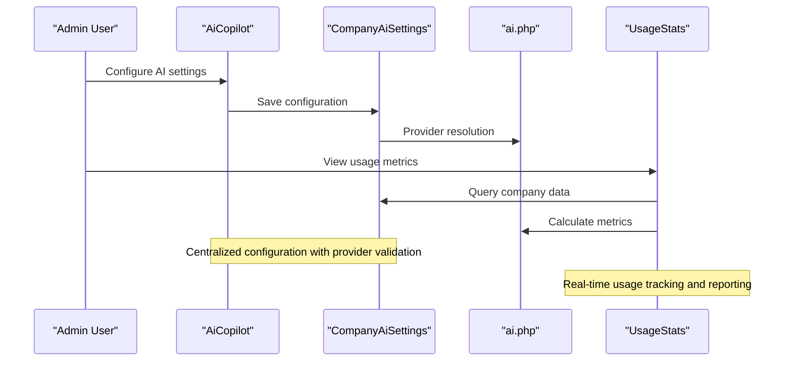

**Diagram sources**
- [AiCopilot.php:36-55](file://app/Livewire/Settings/AiCopilot.php#L36-L55)
- [CompanyAiSettings.php:49-56](file://app/Models/CompanyAiSettings.php#L49-L56)
- [ai.php:52-127](file://config/ai.php#L52-L127)
- [UsageStats.php:15-51](file://app/Livewire/Ai/UsageStats.php#L15-L51)

## Detailed Component Analysis

### HelpdeskAgent Implementation
The HelpdeskAgent serves as the core conversational AI component supporting both public chatbot and internal agent assistance:

- **Provider and Model Configuration**: Uses Google Gemini with the `gemini-2.5-flash` model for optimal balance of speed and cost
- **Conversational Memory**: Implements `RemembersConversations` trait for automatic conversation history management
- **Instructions**: Provides comprehensive guidance for customer support scenarios including billing, integrations, and ticketing interface
- **Plain Text Responses**: Enforces plain text formatting without markdown for consistent presentation

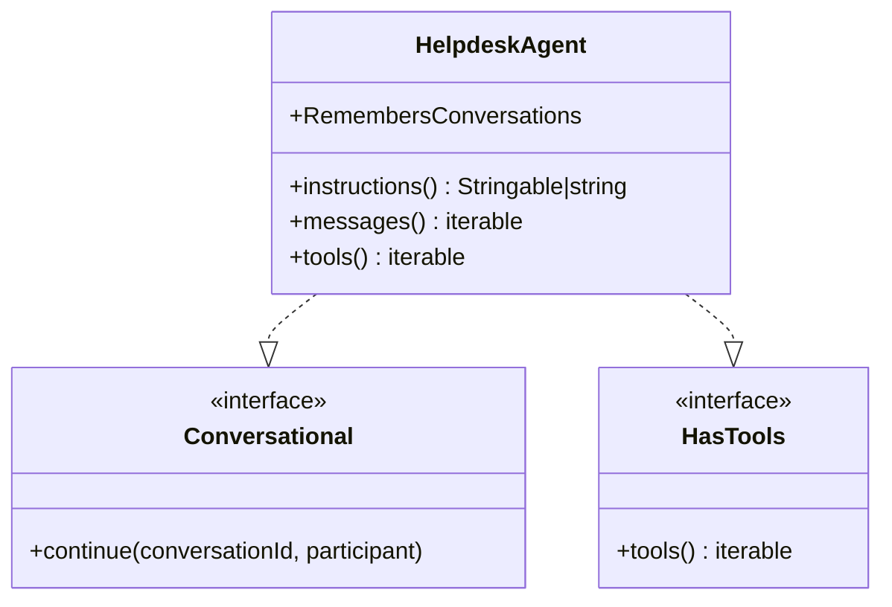

**Diagram sources**
- [HelpdeskAgent.php:18-41](file://app/Ai/Agents/HelpdeskAgent.php#L18-L41)

**Section sources**
- [HelpdeskAgent.php:16-42](file://app/Ai/Agents/HelpdeskAgent.php#L16-L42)

### Public Chatbot System
The ChatbotWidgetController provides a complete customer-facing chatbot solution with intelligent escalation handling:

- **Context Management**: Integrates FAQ database and knowledge base articles for informed responses
- **Escalation Logic**: Implements sophisticated escalation detection based on conversation patterns and fallback thresholds
- **Session Persistence**: Maintains conversation state across requests with outcome tracking (active, resolved, escalated, abandoned)
- **Fallback Handling**: Automatically offers ticket form access when AI cannot answer customer queries

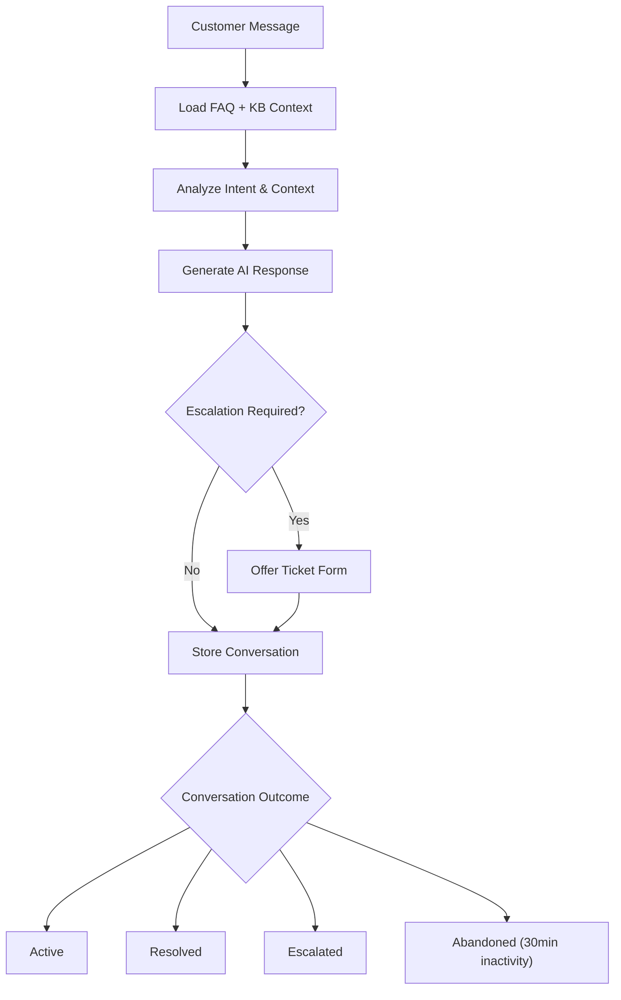

**Diagram sources**
- [ChatbotWidgetController.php:123-144](file://app/Http/Controllers/ChatbotWidgetController.php#L123-L144)
- [ChatbotWidgetController.php:165-188](file://app/Http/Controllers/ChatbotWidgetController.php#L165-L188)
- [ChatHistory.php:29-36](file://app/Livewire/Ai/ChatHistory.php#L29-L36)

**Section sources**
- [ChatbotWidgetController.php:77-223](file://app/Http/Controllers/ChatbotWidgetController.php#L77-L223)

### Internal AI Assistant for Agents
The AiChatWidget provides an integrated AI assistant within the Helpdesk system for agent use:

- **Conversation Management**: Supports multiple concurrent conversations with history persistence
- **Quick Replies**: Predefined response suggestions for common scenarios
- **Provider Flexibility**: Dynamic provider selection based on company AI settings
- **Error Handling**: Graceful degradation with informative error messages

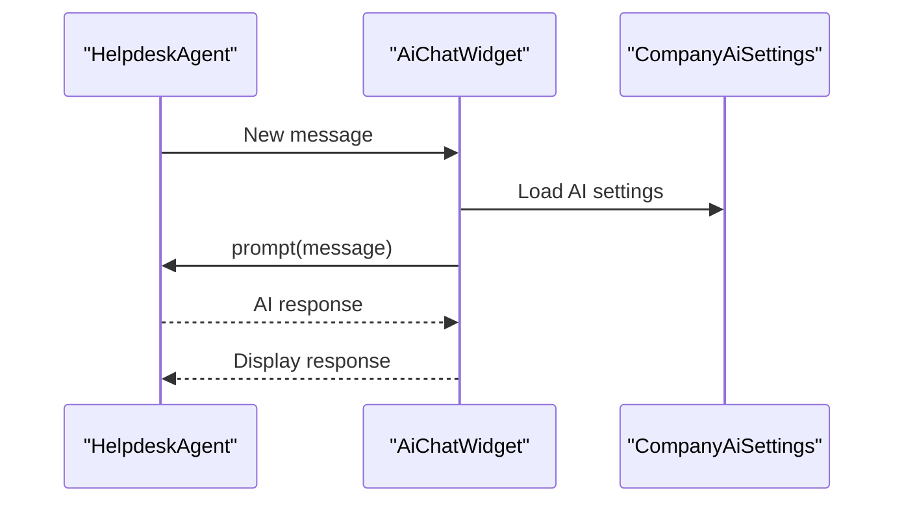

**Diagram sources**
- [AiChatWidget.php:179-268](file://app/Livewire/AiChatWidget.php#L179-L268)

**Section sources**
- [AiChatWidget.php:13-275](file://app/Livewire/AiChatWidget.php#L13-L275)

### Enhanced Reply Suggestion System
Improved SupportReplyAgent with advanced context injection and quality controls:

- **Context Enhancement**: Rich ticket context including category, priority, customer details, and full conversation history
- **Tone Control**: Multiple tone options (professional, friendly, formal) with dynamic regeneration
- **Quality Assurance**: Plain text formatting, character limits, and validation
- **Approval Workflow**: Seamless integration with existing ticket reply system

**Section sources**
- [SupportReplyAgent.php:16-50](file://app/Ai/Agents/SupportReplyAgent.php#L16-L50)
- [TicketDetails.php:345-444](file://app/Livewire/Dashboard/TicketDetails.php#L345-L444)

## AI Copilot System
The AI Copilot system provides centralized configuration and management for all AI features:

- **Feature Management**: Enable/disable AI suggestions, summaries, chatbot, and auto-triage functionality
- **Model Selection**: Comprehensive model options including Gemini 2.5 Flash/Pro, GPT-4o Mini/4o, and Claude Sonnet 4
- **Provider Validation**: Automatic validation of API keys and provider availability
- **Configuration Persistence**: Centralized settings stored per company with default fallbacks
- **Real-time Updates**: Live configuration updates with immediate effect on AI operations

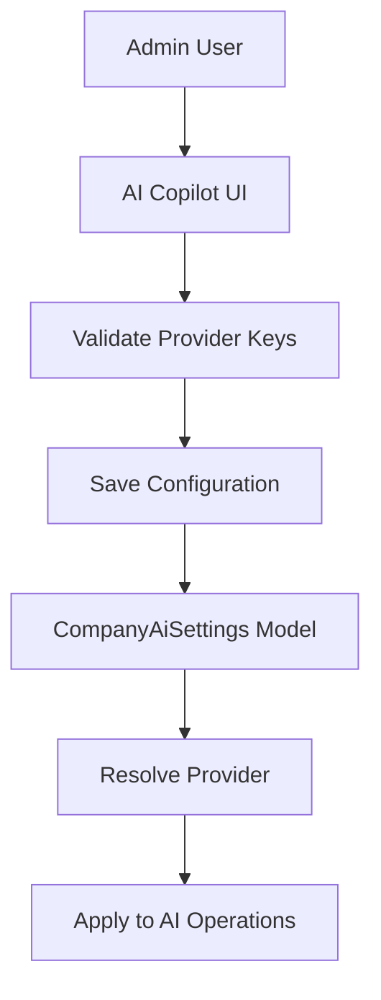

**Diagram sources**
- [AiCopilot.php:36-55](file://app/Livewire/Settings/AiCopilot.php#L36-L55)
- [AiCopilot.php:95-100](file://app/Livewire/Settings/AiCopilot.php#L95-L100)
- [CompanyAiSettings.php:49-56](file://app/Models/CompanyAiSettings.php#L49-L56)

**Section sources**
- [AiCopilot.php:9-142](file://app/Livewire/Settings/AiCopilot.php#L9-L142)
- [CompanyAiSettings.php:14-58](file://app/Models/CompanyAiSettings.php#L14-L58)

## Usage Statistics and Analytics
Comprehensive analytics system for tracking AI usage and performance:

- **Suggestion Metrics**: Generated, accepted, and dismissed AI suggestions with 30-day rolling window
- **Acceptance Rate Calculation**: Percentage of suggestions successfully used vs. dismissed
- **Chatbot Analytics**: Monthly conversation counts, deflection rates, and escalation tracking
- **Time Savings Estimation**: Quantified time savings calculation (3 minutes per accepted suggestion, 8 minutes per deflected ticket)
- **Real-time Dashboard**: Live metrics with computed properties for efficient data retrieval

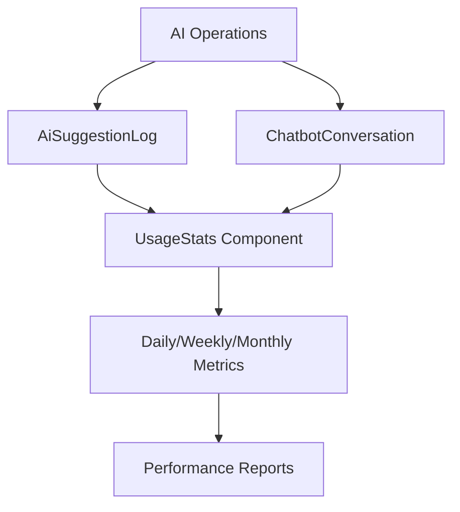

**Diagram sources**
- [UsageStats.php:15-51](file://app/Livewire/Ai/UsageStats.php#L15-L51)
- [UsageStats.php:82-88](file://app/Livewire/Ai/UsageStats.php#L82-L88)

**Section sources**
- [UsageStats.php:12-102](file://app/Livewire/Ai/UsageStats.php#L12-102)
- [AiSuggestionLog.php:11-39](file://app/Models/AiSuggestionLog.php#L11-L39)
- [ChatbotConversation.php:11-39](file://app/Models/ChatbotConversation.php#L11-L39)

## Chat History Management
Advanced conversation lifecycle management with comprehensive tracking:

- **Outcome Tracking**: Automatic classification of conversations as active, resolved, escalated, or abandoned
- **Inactivity Detection**: 30-minute timeout for inactive conversations with automatic abandonment marking
- **Pagination Support**: Efficient pagination for large conversation datasets
- **Filtering Capabilities**: Outcome-based filtering for focused analysis
- **Detail View**: Individual conversation inspection with full message history

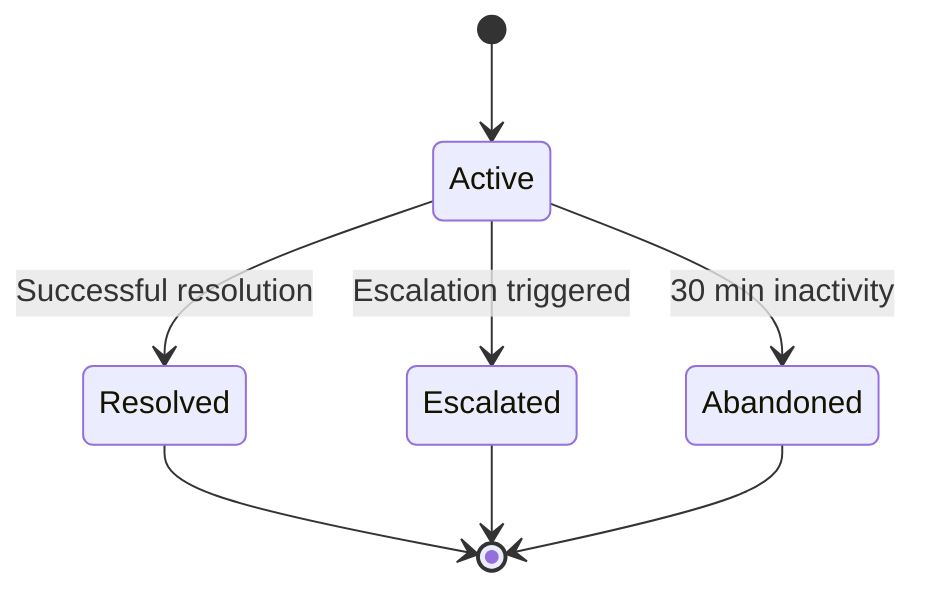

**Diagram sources**
- [ChatHistory.php:29-36](file://app/Livewire/Ai/ChatHistory.php#L29-L36)
- [ChatbotConversation.php:11-39](file://app/Models/ChatbotConversation.php#L11-L39)

**Section sources**
- [ChatHistory.php:14-78](file://app/Livewire/Ai/ChatHistory.php#L14-L78)
- [ChatbotConversation.php:11-41](file://app/Models/ChatbotConversation.php#L11-L41)

## Suggested Replies Training
Comprehensive training system for improving AI suggestion quality:

- **Golden Response Management**: Curated collection of high-quality responses for training
- **Suggestion Feed**: Real-time monitoring of AI suggestions with user actions
- **Category Association**: Optional categorization of training responses for context-specific learning
- **Quality Assurance**: User-driven refinement of AI suggestions through editing and approval
- **Training Data Pipeline**: Systematic approach to AI improvement through human feedback

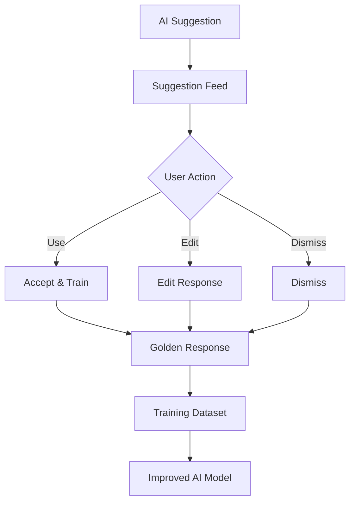

**Diagram sources**
- [SuggestedRepliesTraining.php:36-54](file://app/Livewire/Ai/SuggestedRepliesTraining.php#L36-L54)
- [AiSuggestionLog.php:11-39](file://app/Models/AiSuggestionLog.php#L11-L39)
- [GoldenResponse.php:14-51](file://app/Models/GoldenResponse.php#L14-L51)

**Section sources**
- [SuggestedRepliesTraining.php:16-107](file://app/Livewire/Ai/SuggestedRepliesTraining.php#L16-L107)
- [AiSuggestionLog.php:11-39](file://app/Models/AiSuggestionLog.php#L11-L39)
- [GoldenResponse.php:14-53](file://app/Models/GoldenResponse.php#L14-L53)

## Enhanced Provider Integrations
Expanded AI provider ecosystem with 14+ supported providers:

- **Multi-Provider Architecture**: Support for Anthropic, Azure OpenAI, Cohere, DeepSeek, ElevenLabs, Groq, Jina, Mistral, Ollama, OpenRouter, VoyageAI, and XAI
- **Unified Configuration**: Centralized provider management through ai.php configuration
- **Provider Resolution**: Automatic provider selection based on model naming conventions
- **API Key Management**: Secure handling of multiple provider API keys
- **Fallback Strategies**: Intelligent fallback between providers for reliability

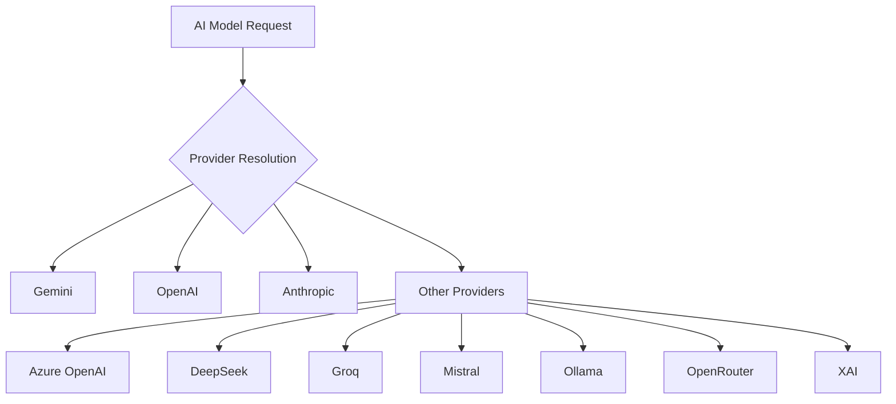

**Diagram sources**
- [CompanyAiSettings.php:49-56](file://app/Models/CompanyAiSettings.php#L49-L56)
- [ai.php:52-127](file://config/ai.php#L52-L127)

**Section sources**
- [CompanyAiSettings.php:49-56](file://app/Models/CompanyAiSettings.php#L49-L56)
- [ai.php:52-127](file://config/ai.php#L52-L127)

## Knowledge Base Integration
The enhanced chatbot system now features comprehensive knowledge base integration:

- **Dynamic Context Injection**: Automatic retrieval and injection of relevant knowledge base articles based on conversation context
- **FAQ Integration**: Seamless integration with structured FAQ database for common query resolution
- **Contextual Relevance**: Intelligent ranking and filtering of knowledge base content for optimal response quality
- **Content Processing**: Automatic truncation and summarization of knowledge base content to fit response constraints
- **Fallback Mechanisms**: Graceful degradation when knowledge base content is unavailable or insufficient

**Section sources**
- [ChatbotWidgetController.php:107-119](file://app/Http/Controllers/ChatbotWidgetController.php#L107-L119)
- [ChatbotFaq.php:14-23](file://app/Models/ChatbotFaq.php#L14-L23)

## Escalation Handling System
Sophisticated escalation handling with automatic ticket form integration:

- **Intent Detection**: Advanced natural language processing to detect escalation intent in customer messages
- **Escalation Thresholds**: Configurable fallback thresholds with session-based tracking
- **Automatic Ticket Form**: Seamless integration with standalone ticket form or custom escalation URLs
- **Outcome Classification**: Automatic classification of conversation outcomes (active, resolved, escalated, abandoned)
- **Resolution Signals**: Intelligent detection of conversation closure signals for accurate outcome tracking

**Section sources**
- [ChatbotWidgetController.php:165-188](file://app/Http/Controllers/ChatbotWidgetController.php#L165-L188)
- [ChatbotWidgetController.php:225-235](file://app/Http/Controllers/ChatbotWidgetController.php#L225-L235)
- [ChatbotWidgetController.php:260-275](file://app/Http/Controllers/ChatbotWidgetController.php#L260-L275)

## Conversation Persistence Layer
Comprehensive conversation lifecycle management:

- **Session-Based Storage**: Persistent conversation storage using session IDs for cross-request continuity
- **Message Serialization**: Structured message storage with role, content, and timestamp metadata
- **Outcome Tracking**: Automatic outcome classification with real-time status updates
- **Inactivity Monitoring**: Automated detection and marking of abandoned conversations after 30 minutes
- **Ticket Association**: Optional association with support tickets for comprehensive case management

**Section sources**
- [ChatbotConversation.php:11-24](file://app/Models/ChatbotConversation.php#L11-L24)
- [ChatbotConversation.php:36-39](file://app/Models/ChatbotConversation.php#L36-L39)
- [ChatHistory.php:29-36](file://app/Livewire/Ai/ChatHistory.php#L29-L36)

## Dependency Analysis
The AI system exhibits layered dependencies with clear separation of concerns and centralized configuration:

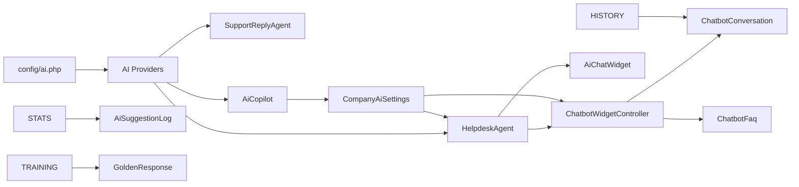

**Diagram sources**
- [ai.php:52-127](file://config/ai.php#L52-L127)
- [HelpdeskAgent.php:16-17](file://app/Ai/Agents/HelpdeskAgent.php#L16-L17)
- [ChatbotWidgetController.php:5-14](file://app/Http/Controllers/ChatbotWidgetController.php#L5-L14)
- [CompanyAiSettings.php:51-58](file://app/Models/CompanyAiSettings.php#L51-L58)
- [UsageStats.php:15-51](file://app/Livewire/Ai/UsageStats.php#L15-L51)
- [ChatHistory.php:38-46](file://app/Livewire/Ai/ChatHistory.php#L38-L46)
- [SuggestedRepliesTraining.php:36-54](file://app/Livewire/Ai/SuggestedRepliesTraining.php#L36-L54)

**Section sources**
- [ai.php:52-127](file://config/ai.php#L52-L127)
- [HelpdeskAgent.php:16-17](file://app/Ai/Agents/HelpdeskAgent.php#L16-L17)
- [ChatbotWidgetController.php:5-14](file://app/Http/Controllers/ChatbotWidgetController.php#L5-L14)
- [CompanyAiSettings.php:51-58](file://app/Models/CompanyAiSettings.php#L51-L58)
- [UsageStats.php:15-51](file://app/Livewire/Ai/UsageStats.php#L15-L51)
- [ChatHistory.php:38-46](file://app/Livewire/Ai/ChatHistory.php#L38-L46)
- [SuggestedRepliesTraining.php:36-54](file://app/Livewire/Ai/SuggestedRepliesTraining.php#L36-L54)

## Performance Considerations
- **Cost Optimization**: Strategic use of `gemini-2.5-flash` model for balanced performance and cost
- **Provider Selection**: Automatic provider resolution reduces configuration overhead
- **Conversation Persistence**: Efficient session storage with outcome tracking minimizes redundant processing
- **Rate Limiting**: Built-in error handling for rate limit exceeded scenarios
- **Caching Strategy**: Configurable embedding caching for improved response times
- **Analytics Efficiency**: Computed properties in Livewire components for optimized data retrieval
- **Provider Validation**: Pre-save validation prevents failed API calls and improves reliability

**Section sources**
- [HelpdeskAgent.php:17](file://app/Ai/Agents/HelpdeskAgent.php#L17)
- [CompanyAiSettings.php:51-58](file://app/Models/CompanyAiSettings.php#L51-L58)
- [AiChatWidget.php:251-264](file://app/Livewire/AiChatWidget.php#L251-L264)
- [UsageStats.php:15-51](file://app/Livewire/Ai/UsageStats.php#L15-L51)

## Troubleshooting Guide
- **Chatbot Disabled**: Check CompanyAiSettings for `ai_chatbot_enabled` flag
- **Provider Configuration**: Verify API keys in config/ai.php for selected provider
- **Conversation Issues**: Review ChatbotConversation model for proper session handling
- **Rate Limiting**: Monitor error messages and implement retry logic for 429 responses
- **Escalation Problems**: Verify escalation URL configuration in CompanyAiSettings
- **AI Copilot Issues**: Check provider validation and model availability in AiCopilot component
- **Analytics Data**: Verify AiSuggestionLog and ChatbotConversation records for accurate metrics
- **Training Data**: Ensure GoldenResponse entries are properly categorized and accessible

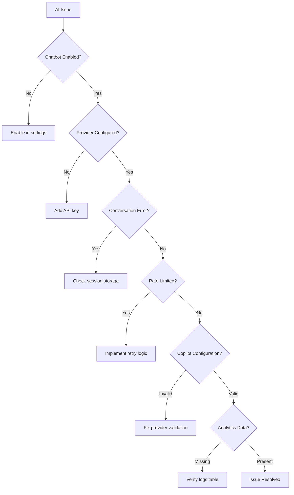

**Diagram sources**
- [AiChatWidget.php:189-200](file://app/Livewire/AiChatWidget.php#L189-L200)
- [ChatbotWidgetController.php:94-96](file://app/Http/Controllers/ChatbotWidgetController.php#L94-L96)
- [AiCopilot.php:95-100](file://app/Livewire/Settings/AiCopilot.php#L95-L100)
- [UsageStats.php:15-51](file://app/Livewire/Ai/UsageStats.php#L15-L51)

**Section sources**
- [AiChatWidget.php:189-200](file://app/Livewire/AiChatWidget.php#L189-L200)
- [ChatbotWidgetController.php:94-96](file://app/Http/Controllers/ChatbotWidgetController.php#L94-L96)
- [AiCopilot.php:95-100](file://app/Livewire/Settings/AiCopilot.php#L95-L100)
- [UsageStats.php:15-51](file://app/Livewire/Ai/UsageStats.php#L15-L51)

## Conclusion
The enhanced AI integration system provides comprehensive artificial intelligence capabilities across multiple touchpoints within the Helpdesk ecosystem. The addition of HelpdeskAgent, ChatbotWidgetController, internal AI assistance, AI Copilot configuration, usage statistics tracking, chat history management, and suggested replies training creates a robust foundation for customer support automation while maintaining flexibility for agent assistance and continuous AI improvement. The system's modular architecture with centralized configuration, comprehensive analytics, and extensive provider integrations supports easy deployment, provider switching, and continuous enhancement through user feedback and training data management. The new AI Copilot system particularly strengthens the platform's enterprise capabilities with professional-grade configuration management and monitoring tools.