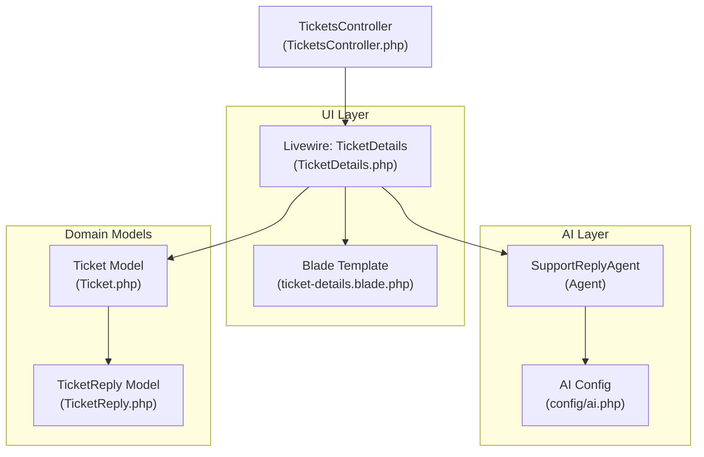
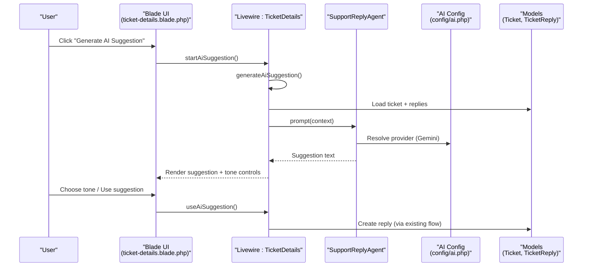
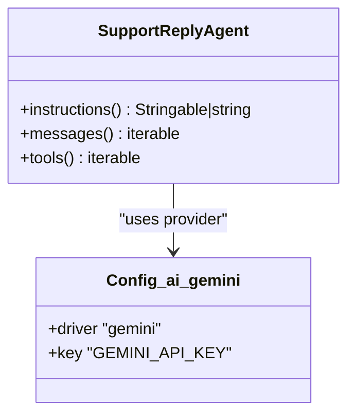
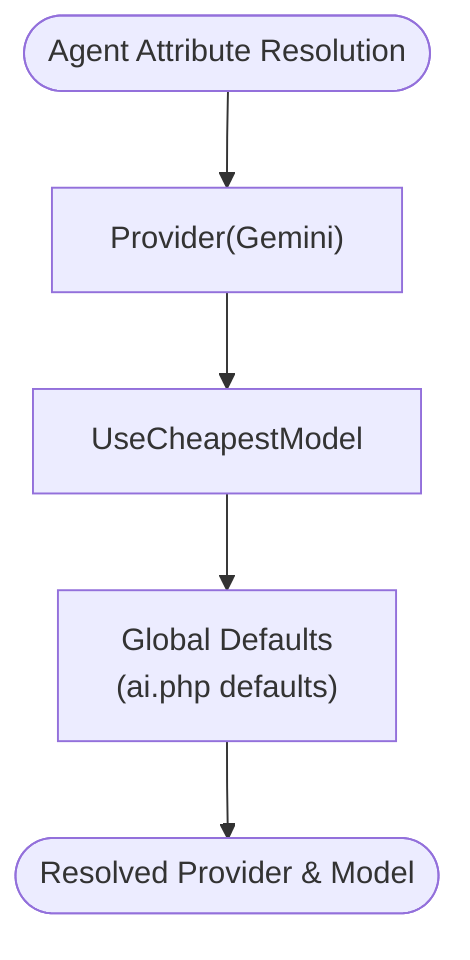
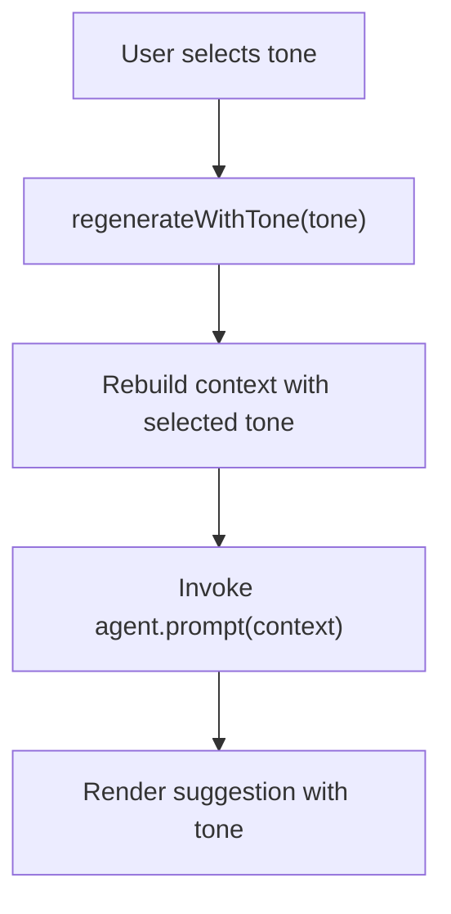
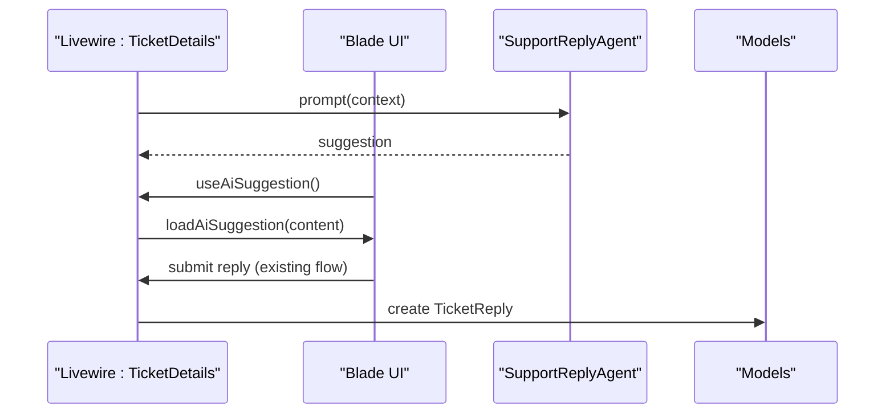
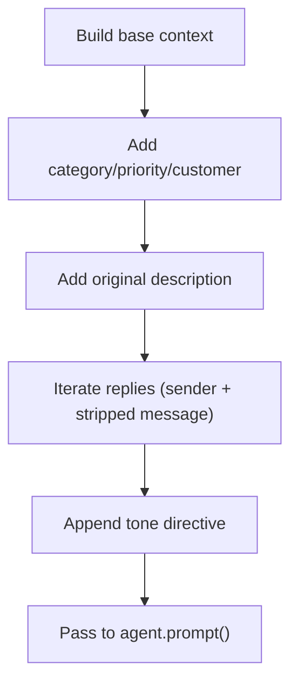
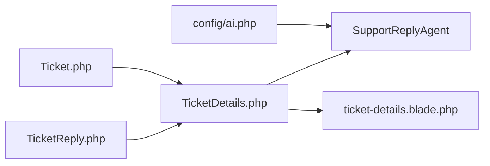
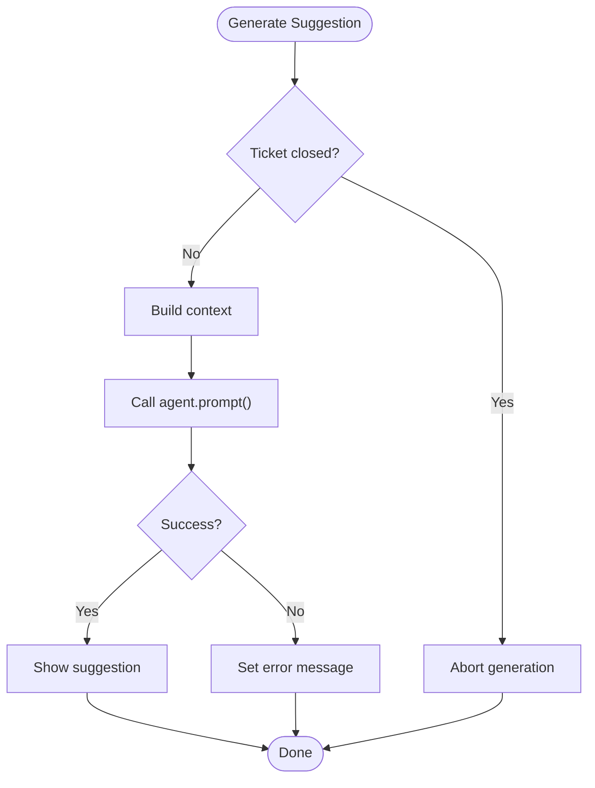

# AI Integration

<cite>
**Referenced Files in This Document**
- [SupportReplyAgent.php](file://app/Ai/Agents/SupportReplyAgent.php)
- [ai.php](file://config/ai.php)
- [TicketDetails.php](file://app/Livewire/Dashboard/TicketDetails.php)
- [ticket-details.blade.php](file://resources/views/livewire/dashboard/ticket-details.blade.php)
- [LaravelAISDKdocs.txt](file://LaravelAISDKdocs.txt)
- [Ticket.php](file://app/Models/Ticket.php)
- [TicketReply.php](file://app/Models/TicketReply.php)
- [TicketsController.php](file://app/Http/Controllers/TicketsController.php)
</cite>

## Table of Contents
1. [Introduction](#introduction)
2. [Project Structure](#project-structure)
3. [Core Components](#core-components)
4. [Architecture Overview](#architecture-overview)
5. [Detailed Component Analysis](#detailed-component-analysis)
6. [Dependency Analysis](#dependency-analysis)
7. [Performance Considerations](#performance-considerations)
8. [Troubleshooting Guide](#troubleshooting-guide)
9. [Conclusion](#conclusion)

## Introduction
This document explains the AI integration system powered by Google Gemini within the Helpdesk System. It focuses on the SupportReplyAgent implementation that analyzes ticket context and suggests appropriate responses, the AI agent configuration, tone control mechanisms, and how AI suggestions integrate with the ticket reply system and the agent approval workflow. It also covers prompt engineering, context injection from ticket history, response quality assessment, fallback mechanisms during service unavailability, and cost optimization strategies.

## Project Structure
The AI integration spans several layers:
- Agent definition under the AI Agents namespace
- Configuration for AI providers and defaults
- Livewire component orchestrating AI suggestions and reply submission
- Blade templates rendering the AI suggestion UI and controls
- Models representing tickets and replies for context injection
- Controller exposing ticket views

**Diagram sources**
- [SupportReplyAgent.php:16-49](file://app/Ai/Agents/SupportReplyAgent.php#L16-L49)
- [ai.php:82-85](file://config/ai.php#L82-L85)
- [TicketDetails.php:324-381](file://app/Livewire/Dashboard/TicketDetails.php#L324-L381)
- [ticket-details.blade.php:520-589](file://resources/views/livewire/dashboard/ticket-details.blade.php#L520-L589)
- [Ticket.php:36-39](file://app/Models/Ticket.php#L36-L39)
- [TicketReply.php:29-37](file://app/Models/TicketReply.php#L29-L37)
- [TicketsController.php:12-17](file://app/Http/Controllers/TicketsController.php#L12-L17)

**Section sources**
- [SupportReplyAgent.php:16-49](file://app/Ai/Agents/SupportReplyAgent.php#L16-L49)
- [ai.php:82-85](file://config/ai.php#L82-L85)
- [TicketDetails.php:324-381](file://app/Livewire/Dashboard/TicketDetails.php#L324-L381)
- [ticket-details.blade.php:520-589](file://resources/views/livewire/dashboard/ticket-details.blade.php#L520-L589)
- [Ticket.php:36-39](file://app/Models/Ticket.php#L36-L39)
- [TicketReply.php:29-37](file://app/Models/TicketReply.php#L29-L37)
- [TicketsController.php:12-17](file://app/Http/Controllers/TicketsController.php#L12-L17)

## Core Components
- SupportReplyAgent: Defines the agent behavior for generating reply suggestions using the Google Gemini provider, with cost-conscious model selection and conversational context hooks.
- AI configuration: Declares the Gemini provider and default provider selections for various modalities.
- TicketDetails Livewire component: Generates context from the ticket and conversation history, invokes the agent, manages suggestion UI, and integrates with the reply submission flow.
- Blade template: Presents the AI suggestion panel, tone controls, and actions to use or dismiss suggestions.
- Models: Provide the ticket metadata, category, and replies used to construct the context.

**Section sources**
- [SupportReplyAgent.php:25-28](file://app/Ai/Agents/SupportReplyAgent.php#L25-L28)
- [SupportReplyAgent.php:35-38](file://app/Ai/Agents/SupportReplyAgent.php#L35-L38)
- [SupportReplyAgent.php:45-48](file://app/Ai/Agents/SupportReplyAgent.php#L45-L48)
- [ai.php:16](file://config/ai.php#L16)
- [ai.php:82-85](file://config/ai.php#L82-L85)
- [TicketDetails.php:345-371](file://app/Livewire/Dashboard/TicketDetails.php#L345-L371)
- [TicketDetails.php:372-381](file://app/Livewire/Dashboard/TicketDetails.php#L372-L381)
- [ticket-details.blade.php:544-589](file://resources/views/livewire/dashboard/ticket-details.blade.php#L544-L589)
- [Ticket.php:36-39](file://app/Models/Ticket.php#L36-L39)
- [TicketReply.php:29-37](file://app/Models/TicketReply.php#L29-L37)

## Architecture Overview
The AI suggestion pipeline follows a clear flow:
- The UI triggers generation via Livewire
- Context is built from the ticket and replies
- The agent is invoked with the constructed prompt
- The suggestion is rendered in the UI with tone controls
- The agent’s reply is submitted through the existing reply mechanism

**Diagram sources**
- [TicketDetails.php:324-381](file://app/Livewire/Dashboard/TicketDetails.php#L324-L381)
- [SupportReplyAgent.php:16-18](file://app/Ai/Agents/SupportReplyAgent.php#L16-L18)
- [ai.php:82-85](file://config/ai.php#L82-L85)
- [Ticket.php:36-39](file://app/Models/Ticket.php#L36-L39)
- [TicketReply.php:29-37](file://app/Models/TicketReply.php#L29-L37)
- [ticket-details.blade.php:544-589](file://resources/views/livewire/dashboard/ticket-details.blade.php#L544-L589)

## Detailed Component Analysis

### SupportReplyAgent
- Provider selection: Uses the Google Gemini provider via a dedicated attribute.
- Model selection: Uses the cheapest available model attribute for cost optimization.
- Instructions: Provides a concise instruction set guiding the agent to analyze context and produce a reply without preamble.
- Messages: Returns an empty conversation list; context is injected externally via the prompt method.
- Tools: No tools are exposed by this agent.

**Diagram sources**
- [SupportReplyAgent.php:16-49](file://app/Ai/Agents/SupportReplyAgent.php#L16-L49)
- [ai.php:82-85](file://config/ai.php#L82-L85)

**Section sources**
- [SupportReplyAgent.php:16-18](file://app/Ai/Agents/SupportReplyAgent.php#L16-L18)
- [SupportReplyAgent.php:25-28](file://app/Ai/Agents/SupportReplyAgent.php#L25-L28)
- [SupportReplyAgent.php:35-38](file://app/Ai/Agents/SupportReplyAgent.php#L35-L38)
- [SupportReplyAgent.php:45-48](file://app/Ai/Agents/SupportReplyAgent.php#L45-L48)
- [ai.php:82-85](file://config/ai.php#L82-L85)

### AI Agent Configuration (Provider Selection, Model Parameters, Safety Controls)
- Provider selection: The Gemini provider is defined with driver and API key.
- Defaults: The application sets defaults for general and specialized tasks; while the agent itself selects Gemini via its attribute, the global defaults influence other parts of the system.
- Model parameters: The agent leverages the cheapest model attribute for cost optimization.
- Safety controls: The agent does not declare explicit safety attributes in this implementation; safety is managed by provider policies and the prompt instructions.

**Diagram sources**
- [SupportReplyAgent.php:16-18](file://app/Ai/Agents/SupportReplyAgent.php#L16-L18)
- [SupportReplyAgent.php:17](file://app/Ai/Agents/SupportReplyAgent.php#L17)
- [ai.php:16](file://config/ai.php#L16)

**Section sources**
- [ai.php:82-85](file://config/ai.php#L82-L85)
- [SupportReplyAgent.php:16-18](file://app/Ai/Agents/SupportReplyAgent.php#L16-L18)
- [SupportReplyAgent.php:17](file://app/Ai/Agents/SupportReplyAgent.php#L17)
- [ai.php:16](file://config/ai.php#L16)

### Tone Control Mechanisms
- Tone options: Professional, friendly, and formal tones are selectable in the UI.
- Dynamic regeneration: Changing the tone triggers regeneration of the suggestion using the same context plus a tone directive.
- UI feedback: Loading states and regeneration controls provide responsive feedback.

**Diagram sources**
- [TicketDetails.php:383-395](file://app/Livewire/Dashboard/TicketDetails.php#L383-L395)
- [ticket-details.blade.php:544-559](file://resources/views/livewire/dashboard/ticket-details.blade.php#L544-L559)

**Section sources**
- [TicketDetails.php:357-369](file://app/Livewire/Dashboard/TicketDetails.php#L357-L369)
- [TicketDetails.php:383-395](file://app/Livewire/Dashboard/TicketDetails.php#L383-L395)
- [ticket-details.blade.php:544-559](file://resources/views/livewire/dashboard/ticket-details.blade.php#L544-L559)

### AI Suggestions Integration with Ticket Reply System and Approval Workflow
- Generation lifecycle: The Livewire component builds context, invokes the agent, and displays the suggestion with controls to use or dismiss.
- Approval workflow: The “Use this” action dispatches the suggestion content to the editor, allowing manual review and edits before submission.
- Submission: The reply submission uses the existing reply creation flow, preserving agent assignment, attachments, and notifications.

**Diagram sources**
- [TicketDetails.php:372-373](file://app/Livewire/Dashboard/TicketDetails.php#L372-L373)
- [TicketDetails.php:458-462](file://app/Livewire/Dashboard/TicketDetails.php#L458-L462)
- [ticket-details.blade.php:563-567](file://resources/views/livewire/dashboard/ticket-details.blade.php#L563-L567)
- [TicketReply.php:8-18](file://app/Models/TicketReply.php#L8-L18)

**Section sources**
- [TicketDetails.php:372-373](file://app/Livewire/Dashboard/TicketDetails.php#L372-L373)
- [TicketDetails.php:458-462](file://app/Livewire/Dashboard/TicketDetails.php#L458-L462)
- [ticket-details.blade.php:563-567](file://resources/views/livewire/dashboard/ticket-details.blade.php#L563-L567)
- [TicketReply.php:8-18](file://app/Models/TicketReply.php#L8-L18)

### Examples of AI Prompt Engineering and Context Injection
- Context composition: The component constructs a structured context including company, category, priority, customer, original description, and full conversation history.
- Tone injection: A tone directive is appended to the context to steer the agent’s style.
- Summary prompt: A separate prompt is used for generating a concise ticket summary with explicit formatting requirements.

**Diagram sources**
- [TicketDetails.php:345-369](file://app/Livewire/Dashboard/TicketDetails.php#L345-L369)
- [TicketDetails.php:398-444](file://app/Livewire/Dashboard/TicketDetails.php#L398-L444)
- [Ticket.php:36-39](file://app/Models/Ticket.php#L36-L39)
- [TicketReply.php:29-37](file://app/Models/TicketReply.php#L29-L37)

**Section sources**
- [TicketDetails.php:345-369](file://app/Livewire/Dashboard/TicketDetails.php#L345-L369)
- [TicketDetails.php:398-444](file://app/Livewire/Dashboard/TicketDetails.php#L398-L444)
- [Ticket.php:36-39](file://app/Models/Ticket.php#L36-L39)
- [TicketReply.php:29-37](file://app/Models/TicketReply.php#L29-L37)

### Response Quality Assessment
- Validation: The suggestion is treated as raw text; the UI allows editing prior to submission.
- Formatting: The summary prompt enforces a strict format to aid readability and downstream processing.
- Error handling: Exceptions during generation are caught and surfaced to the UI.

**Section sources**
- [TicketDetails.php:435-441](file://app/Livewire/Dashboard/TicketDetails.php#L435-L441)
- [TicketDetails.php:376-378](file://app/Livewire/Dashboard/TicketDetails.php#L376-L378)

## Dependency Analysis
- Agent depends on the AI SDK attributes and configuration to select the provider and model.
- Livewire component depends on models to assemble context and on the agent to generate suggestions.
- Blade template depends on Livewire state to render controls and suggestion content.

**Diagram sources**
- [ai.php:82-85](file://config/ai.php#L82-L85)
- [SupportReplyAgent.php:16-18](file://app/Ai/Agents/SupportReplyAgent.php#L16-L18)
- [TicketDetails.php:345-371](file://app/Livewire/Dashboard/TicketDetails.php#L345-L371)
- [Ticket.php:36-39](file://app/Models/Ticket.php#L36-L39)
- [TicketReply.php:29-37](file://app/Models/TicketReply.php#L29-L37)
- [ticket-details.blade.php:520-589](file://resources/views/livewire/dashboard/ticket-details.blade.php#L520-L589)

**Section sources**
- [ai.php:82-85](file://config/ai.php#L82-L85)
- [SupportReplyAgent.php:16-18](file://app/Ai/Agents/SupportReplyAgent.php#L16-L18)
- [TicketDetails.php:345-371](file://app/Livewire/Dashboard/TicketDetails.php#L345-L371)
- [Ticket.php:36-39](file://app/Models/Ticket.php#L36-L39)
- [TicketReply.php:29-37](file://app/Models/TicketReply.php#L29-L37)
- [ticket-details.blade.php:520-589](file://resources/views/livewire/dashboard/ticket-details.blade.php#L520-L589)

## Performance Considerations
- Cost optimization: The agent uses the cheapest model attribute to reduce costs.
- Caching: Embedding caching is configurable; while not directly used by the reply agent, it can be leveraged elsewhere in the system.
- Network latency: UI provides loading indicators; consider debouncing repeated regenerations and avoiding unnecessary model switches.

**Section sources**
- [SupportReplyAgent.php:17](file://app/Ai/Agents/SupportReplyAgent.php#L17)
- [ai.php:34-39](file://config/ai.php#L34-L39)

## Troubleshooting Guide
- AI service unavailability: The component catches exceptions and surfaces an error message in the suggestion field.
- Closed ticket state: Generation is blocked when the ticket is closed to prevent invalid operations.
- Provider misconfiguration: Ensure the Gemini provider key is set; the agent relies on the provider attribute and configuration.

**Diagram sources**
- [TicketDetails.php:336-381](file://app/Livewire/Dashboard/TicketDetails.php#L336-L381)

**Section sources**
- [TicketDetails.php:336-381](file://app/Livewire/Dashboard/TicketDetails.php#L336-L381)

## Conclusion
The AI integration centers on a focused agent that leverages Google Gemini to suggest replies based on rich ticket context and tone preferences. The Livewire component orchestrates context assembly, suggestion generation, and UI controls, while the existing reply flow preserves agent approvals and notifications. Configuration supports cost-conscious model selection and provider setup, and the system includes basic fallback behavior for errors and closed tickets.