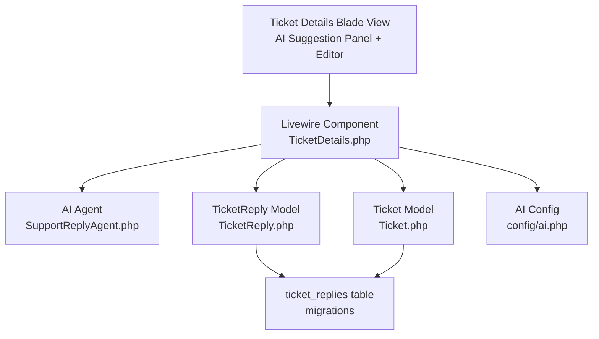
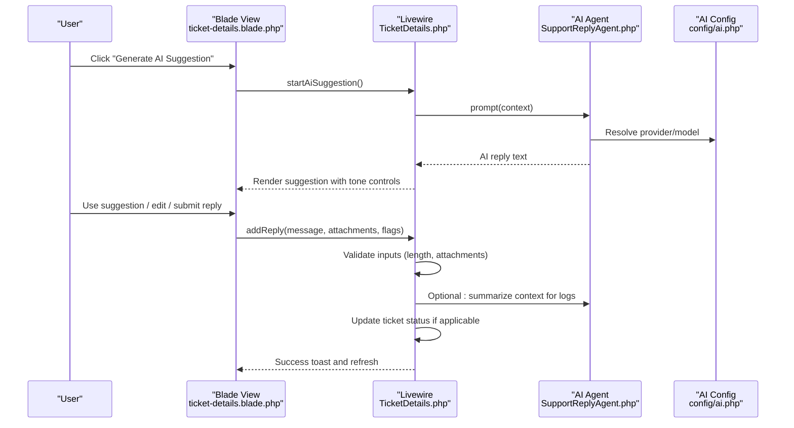
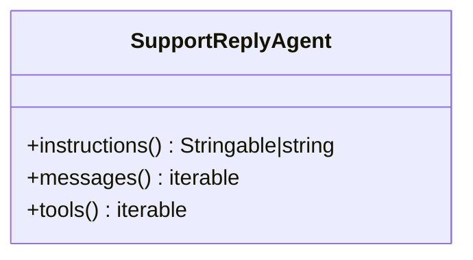
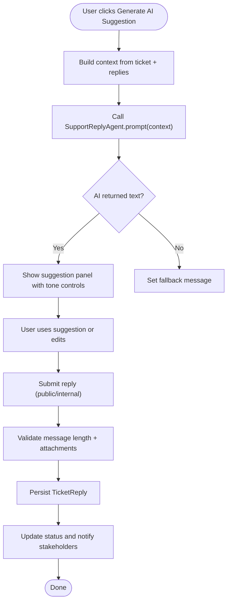
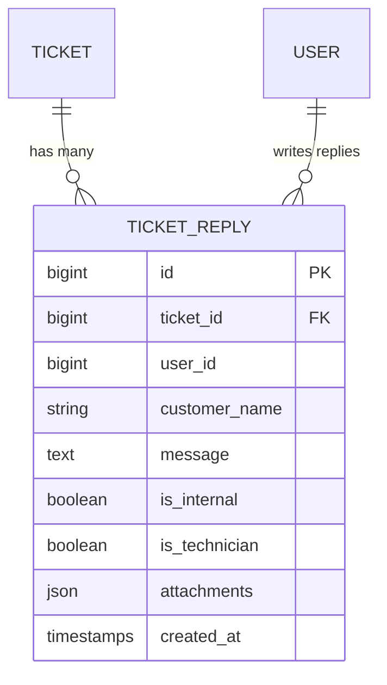
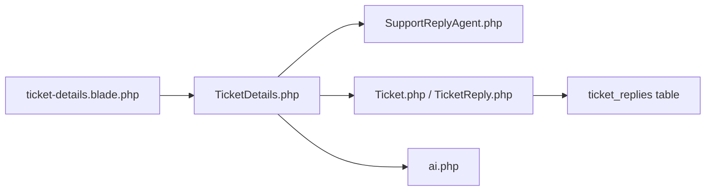

# AI Response Processing & Integration

<cite>
**Referenced Files in This Document**
- [SupportReplyAgent.php](file://app/Ai/Agents/SupportReplyAgent.php)
- [TicketDetails.php](file://app/Livewire/Dashboard/TicketDetails.php)
- [ticket-details.blade.php](file://resources/views/livewire/dashboard/ticket-details.blade.php)
- [TicketReply.php](file://app/Models/TicketReply.php)
- [2026_02_01_224225_create_ticket_replies_table.php](file://database/migrations/2026_02_01_224225_create_ticket_replies_table.php)
- [2026_03_10_045512_add_attachments_to_ticket_replies_table.php](file://database/migrations/2026_03_10_045512_add_attachments_to_ticket_replies_table.php)
- [Ticket.php](file://app/Models/Ticket.php)
- [AutoReplyRule.php](file://app/Services/Automation/Rules/AutoReplyRule.php)
- [ai.php](file://config/ai.php)
- [User.php](file://app/Models/User.php)
</cite>

## Table of Contents
1. [Introduction](#introduction)
2. [Project Structure](#project-structure)
3. [Core Components](#core-components)
4. [Architecture Overview](#architecture-overview)
5. [Detailed Component Analysis](#detailed-component-analysis)
6. [Dependency Analysis](#dependency-analysis)
7. [Performance Considerations](#performance-considerations)
8. [Troubleshooting Guide](#troubleshooting-guide)
9. [Conclusion](#conclusion)
10. [Appendices](#appendices)

## Introduction
This document explains how AI-generated responses are generated, validated, formatted, and integrated into the ticket system. It covers:
- How AI suggestions are produced from ticket context
- Validation and sanitization of AI output
- Internal vs public reply handling and approval workflows
- Formatting requirements, character limits, and attachment policies
- Examples of response validation and fallback handling
- Monitoring and feedback loops for continuous improvement

## Project Structure
The AI response pipeline spans front-end UI, Livewire components, AI agent configuration, and persistence models:
- Front-end: a rich editor with AI suggestion panel and reply form
- Back-end: Livewire component orchestrating AI generation and reply submission
- AI agent: a prompt-driven agent configured via attributes
- Persistence: ticket replies with internal/public flags and optional attachments

**Diagram sources**
- [ticket-details.blade.php](file://resources/views/livewire/dashboard/ticket-details.blade.php)
- [TicketDetails.php](file://app/Livewire/Dashboard/TicketDetails.php)
- [SupportReplyAgent.php](file://app/Ai/Agents/SupportReplyAgent.php)
- [TicketReply.php](file://app/Models/TicketReply.php)
- [Ticket.php](file://app/Models/Ticket.php)
- [ai.php](file://config/ai.php)
- [2026_02_01_224225_create_ticket_replies_table.php](file://database/migrations/2026_02_01_224225_create_ticket_replies_table.php)

**Section sources**
- [ticket-details.blade.php](file://resources/views/livewire/dashboard/ticket-details.blade.php)
- [TicketDetails.php](file://app/Livewire/Dashboard/TicketDetails.php)
- [SupportReplyAgent.php](file://app/Ai/Agents/SupportReplyAgent.php)
- [TicketReply.php](file://app/Models/TicketReply.php)
- [Ticket.php](file://app/Models/Ticket.php)
- [ai.php](file://config/ai.php)

## Core Components
- AI Agent: A promptable agent that generates concise, preamble-free replies for customer support.
- Livewire Component: Orchestrates AI suggestion generation, tone selection, and reply submission.
- TicketReply Model: Stores replies with flags for internal vs public visibility and technician replies.
- Ticket Model: Provides context (subject, description, category, priority, status) for AI prompts.
- AI Configuration: Defines default providers and keys for AI operations.

**Section sources**
- [SupportReplyAgent.php](file://app/Ai/Agents/SupportReplyAgent.php)
- [TicketDetails.php](file://app/Livewire/Dashboard/TicketDetails.php)
- [TicketReply.php](file://app/Models/TicketReply.php)
- [Ticket.php](file://app/Models/Ticket.php)
- [ai.php](file://config/ai.php)

## Architecture Overview
The AI response flow integrates UI, AI prompting, and persistence:

**Diagram sources**
- [ticket-details.blade.php](file://resources/views/livewire/dashboard/ticket-details.blade.php)
- [TicketDetails.php](file://app/Livewire/Dashboard/TicketDetails.php)
- [SupportReplyAgent.php](file://app/Ai/Agents/SupportReplyAgent.php)
- [ai.php](file://config/ai.php)

## Detailed Component Analysis

### AI Agent: SupportReplyAgent
- Purpose: Generate concise, customer-facing reply text from ticket context.
- Behavior:
  - Returns a plain-text reply without preamble, signature, or quotes.
  - Keeps replies short; asks one clarifying question if more info is needed.
- Provider configuration:
  - Uses a specific AI provider and model via attributes.
  - Default provider/model can be overridden per deployment.

**Diagram sources**
- [SupportReplyAgent.php](file://app/Ai/Agents/SupportReplyAgent.php)

**Section sources**
- [SupportReplyAgent.php](file://app/Ai/Agents/SupportReplyAgent.php)
- [ai.php](file://config/ai.php)

### Livewire Component: TicketDetails
- Responsibilities:
  - Manage AI suggestion lifecycle: generate, regenerate with tone, dismiss, and use suggestion.
  - Build context for AI prompts from the ticket and existing replies.
  - Validate reply inputs and persist replies to the database.
  - Update ticket state and notify stakeholders.
- Key validations:
  - Reply length constrained to a maximum (validated in the component).
  - Attachment size limit enforced per upload.
- Tone control:
  - Supports multiple tones; regenerating suggestion adapts to selected tone.
- AI Summary:
  - Generates a structured summary for agent review with three sections.

**Diagram sources**
- [TicketDetails.php](file://app/Livewire/Dashboard/TicketDetails.php)
- [SupportReplyAgent.php](file://app/Ai/Agents/SupportReplyAgent.php)

**Section sources**
- [TicketDetails.php](file://app/Livewire/Dashboard/TicketDetails.php)
- [ticket-details.blade.php](file://resources/views/livewire/dashboard/ticket-details.blade.php)

### TicketReply Model and Database Schema
- Fields:
  - ticket_id, user_id or customer_name, message, is_internal, is_technician, attachments.
- Flags:
  - is_internal: internal note (not visible to customer).
  - is_technician: technician reply flag.
  - attachments: JSON array of uploaded files.
- Indexes:
  - Efficient querying by ticket_id, user_id, created_at.

**Diagram sources**
- [TicketReply.php](file://app/Models/TicketReply.php)
- [2026_02_01_224225_create_ticket_replies_table.php](file://database/migrations/2026_02_01_224225_create_ticket_replies_table.php)
- [2026_03_10_045512_add_attachments_to_ticket_replies_table.php](file://database/migrations/2026_03_10_045512_add_attachments_to_ticket_replies_table.php)

**Section sources**
- [TicketReply.php](file://app/Models/TicketReply.php)
- [2026_02_01_224225_create_ticket_replies_table.php](file://database/migrations/2026_02_01_224225_create_ticket_replies_table.php)
- [2026_03_10_045512_add_attachments_to_ticket_replies_table.php](file://database/migrations/2026_03_10_045512_add_attachments_to_ticket_replies_table.php)

### Ticket Model and Context for AI
- Provides:
  - Subject, description, category, priority, status, and replies relationship.
- Used to construct AI prompts for both suggestions and summaries.

**Section sources**
- [Ticket.php](file://app/Models/Ticket.php)

### AI Configuration
- Centralized provider configuration supports multiple AI backends.
- Default providers for text, images, audio, transcription, embeddings, and reranking.

**Section sources**
- [ai.php](file://config/ai.php)

### Auto-Reply Automation (Context for Approval Workflows)
- AutoReplyRule evaluates conditions (verification, category, priority) and sends automated replies.
- Useful as a baseline for customer communication while agent approvals remain manual.

**Section sources**
- [AutoReplyRule.php](file://app/Services/Automation/Rules/AutoReplyRule.php)

## Dependency Analysis
- UI depends on Livewire for dynamic behavior and Alpine for lightweight interactivity.
- Livewire depends on:
  - AI agent for text generation
  - Ticket and TicketReply models for context and persistence
  - AI configuration for provider resolution
- Models define the schema and relationships used by the Livewire component.

**Diagram sources**
- [ticket-details.blade.php](file://resources/views/livewire/dashboard/ticket-details.blade.php)
- [TicketDetails.php](file://app/Livewire/Dashboard/TicketDetails.php)
- [SupportReplyAgent.php](file://app/Ai/Agents/SupportReplyAgent.php)
- [Ticket.php](file://app/Models/Ticket.php)
- [TicketReply.php](file://app/Models/TicketReply.php)
- [ai.php](file://config/ai.php)

**Section sources**
- [ticket-details.blade.php](file://resources/views/livewire/dashboard/ticket-details.blade.php)
- [TicketDetails.php](file://app/Livewire/Dashboard/TicketDetails.php)
- [SupportReplyAgent.php](file://app/Ai/Agents/SupportReplyAgent.php)
- [Ticket.php](file://app/Models/Ticket.php)
- [TicketReply.php](file://app/Models/TicketReply.php)
- [ai.php](file://config/ai.php)

## Performance Considerations
- AI prompt construction:
  - Load ticket context and eager-load replies to minimize N+1 queries.
  - Limit prompt size by summarizing recent replies and stripping HTML tags.
- UI responsiveness:
  - Debounce agent search input and tone changes to avoid excessive regeneration.
  - Use skeleton loaders during AI generation and attachment uploads.
- Database:
  - Leverage indexes on ticket_id, user_id, and created_at for fast reply retrieval.
- Caching:
  - Consider caching frequently accessed agent prompts or summaries if traffic warrants.

[No sources needed since this section provides general guidance]

## Troubleshooting Guide
Common issues and remedies:
- AI suggestion fails to generate:
  - The Livewire component catches exceptions and displays a user-friendly message; check AI provider credentials and network connectivity.
- Excessive or inappropriate content:
  - The agent’s instruction explicitly requests concise, preamble-free replies. If content is unsuitable, regenerate with a different tone or manually edit before submitting.
- Attachment upload errors:
  - Ensure file sizes adhere to the per-upload limit and supported MIME types.
- Internal vs public reply confusion:
  - Confirm the is_internal flag and sender identity before publishing. Internal notes remain invisible to customers.
- Status transitions:
  - Public replies may update ticket status depending on current state; verify intended behavior.

**Section sources**
- [TicketDetails.php](file://app/Livewire/Dashboard/TicketDetails.php)
- [ticket-details.blade.php](file://resources/views/livewire/dashboard/ticket-details.blade.php)
- [TicketReply.php](file://app/Models/TicketReply.php)

## Conclusion
The AI response pipeline integrates a prompt-driven agent with a robust UI and strict validation rules. By leveraging internal/public flags, attachment support, and tone controls, agents can efficiently review, refine, and approve AI suggestions before publishing. Automated summaries further aid triage and decision-making.

[No sources needed since this section summarizes without analyzing specific files]

## Appendices

### Response Formatting Requirements
- AI reply text:
  - Plain text only; no preamble, signature, or quotes.
  - Keep concise; ask one clarifying question if more information is needed.
- Editor formatting:
  - Supports bold, italic, underline, lists, code blocks, and links.
  - Paste HTML is allowed; ensure readability and accessibility.
- Character limits:
  - Reply length is validated server-side to prevent oversized submissions.
- Attachments:
  - Supported image and document types with per-file size limits.
  - Attachments stored as JSON metadata with name, path, and MIME type.

**Section sources**
- [SupportReplyAgent.php](file://app/Ai/Agents/SupportReplyAgent.php)
- [TicketDetails.php](file://app/Livewire/Dashboard/TicketDetails.php)
- [ticket-details.blade.php](file://resources/views/livewire/dashboard/ticket-details.blade.php)
- [2026_03_10_045512_add_attachments_to_ticket_replies_table.php](file://database/migrations/2026_03_10_045512_add_attachments_to_ticket_replies_table.php)

### Internal vs Public Reply Handling
- Internal notes:
  - Marked with is_internal; not visible to customers.
  - Useful for agent-only context and approvals.
- Public replies:
  - Visible to customers; may trigger notifications and status updates.
- Technician replies:
  - Optional is_technician flag for specialized replies.

**Section sources**
- [TicketReply.php](file://app/Models/TicketReply.php)
- [2026_03_10_045512_add_attachments_to_ticket_replies_table.php](file://database/migrations/2026_03_10_045512_add_attachments_to_ticket_replies_table.php)

### Approval Workflows
- AI suggestion review:
  - Agents can use, edit, or dismiss suggestions before submission.
- Manual approval:
  - For sensitive or complex cases, require supervisor approval prior to publishing.
- Auto-reply baseline:
  - Automated replies can be sent immediately upon ticket creation for verified customers, while agent approvals remain required for public replies.

**Section sources**
- [TicketDetails.php](file://app/Livewire/Dashboard/TicketDetails.php)
- [AutoReplyRule.php](file://app/Services/Automation/Rules/AutoReplyRule.php)

### Monitoring and Feedback Loops
- Metrics:
  - Track average response time, resolution time, and agent satisfaction with AI suggestions.
- Feedback:
  - Allow agents to rate suggestions and tag reasons for rejection.
- Continuous improvement:
  - Periodically re-train or adjust agent instructions based on feedback and performance trends.

[No sources needed since this section provides general guidance]