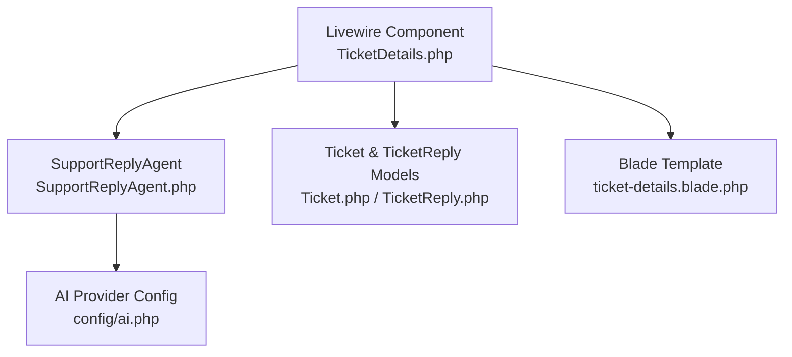
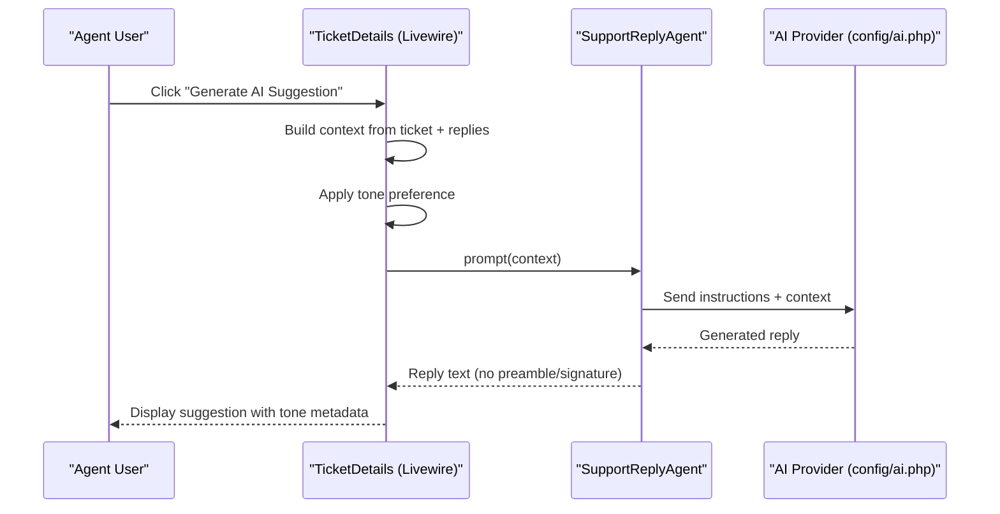
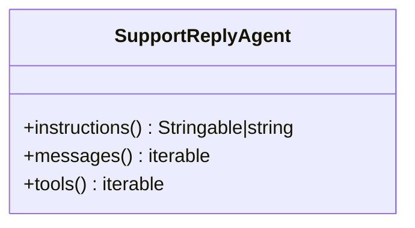
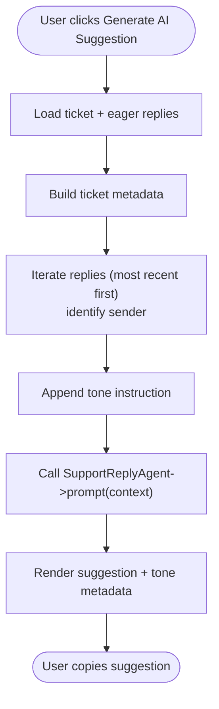
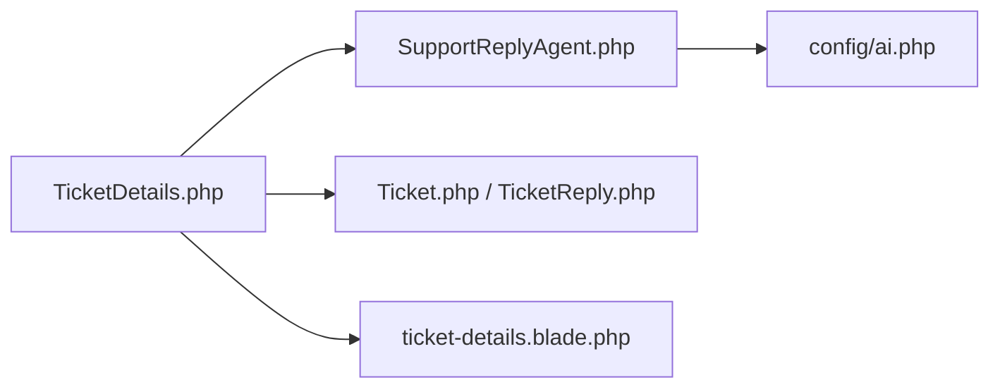

# Prompt Engineering & Context Management

<cite>
**Referenced Files in This Document**
- [SupportReplyAgent.php](file://app/Ai/Agents/SupportReplyAgent.php)
- [TicketDetails.php](file://app/Livewire/Dashboard/TicketDetails.php)
- [ai.php](file://config/ai.php)
- [LaravelAISDKdocs.txt](file://LaravelAISDKdocs.txt)
- [Ticket.php](file://app/Models/Ticket.php)
- [TicketReply.php](file://app/Models/TicketReply.php)
- [ticket-details.blade.php](file://resources/views/livewire/dashboard/ticket-details.blade.php)
</cite>

## Table of Contents
1. [Introduction](#introduction)
2. [Project Structure](#project-structure)
3. [Core Components](#core-components)
4. [Architecture Overview](#architecture-overview)
5. [Detailed Component Analysis](#detailed-component-analysis)
6. [Dependency Analysis](#dependency-analysis)
7. [Performance Considerations](#performance-considerations)
8. [Troubleshooting Guide](#troubleshooting-guide)
9. [Conclusion](#conclusion)

## Introduction
This document explains how the support reply system constructs AI prompts and manages context for generating accurate, branded, and efficient responses. It focuses on the SupportReplyAgent, the prompt construction pipeline in the UI, and the integration of ticket metadata, conversation history, and optional tone controls. It also covers instruction templates, context injection mechanisms, response formatting requirements, and practical guidance for optimizing context window usage and response quality.

## Project Structure
The prompt engineering and context management spans several layers:
- UI layer: builds the prompt context and triggers AI suggestions
- Agent layer: defines the AI agent’s instructions and behavior
- Configuration layer: selects provider and model defaults
- Data models: provide ticket metadata and conversation history

**Diagram sources**
- [TicketDetails.php:336-381](file://app/Livewire/Dashboard/TicketDetails.php#L336-L381)
- [SupportReplyAgent.php:16-28](file://app/Ai/Agents/SupportReplyAgent.php#L16-L28)
- [ai.php:16-127](file://config/ai.php#L16-L127)
- [Ticket.php:16-39](file://app/Models/Ticket.php#L16-L39)
- [TicketReply.php:10-37](file://app/Models/TicketReply.php#L10-L37)
- [ticket-details.blade.php:507-517](file://resources/views/livewire/dashboard/ticket-details.blade.php#L507-L517)

**Section sources**
- [TicketDetails.php:336-381](file://app/Livewire/Dashboard/TicketDetails.php#L336-L381)
- [SupportReplyAgent.php:16-28](file://app/Ai/Agents/SupportReplyAgent.php#L16-L28)
- [ai.php:16-127](file://config/ai.php#L16-L127)
- [Ticket.php:16-39](file://app/Models/Ticket.php#L16-L39)
- [TicketReply.php:10-37](file://app/Models/TicketReply.php#L10-L37)
- [ticket-details.blade.php:507-517](file://resources/views/livewire/dashboard/ticket-details.blade.php#L507-L517)

## Core Components
- SupportReplyAgent: Defines the AI agent’s instructions and behavior. It currently returns a minimal conversation context and no tools, selecting a provider and a cost-optimized model via attributes.
- TicketDetails (Livewire): Builds the prompt context from ticket metadata and conversation history, applies tone preferences, and invokes the agent to generate a reply suggestion.
- AI Provider Configuration: Centralizes provider selection and defaults for text generation.
- Ticket and TicketReply Models: Supply the structured data used to populate the prompt.

Key responsibilities:
- Prompt construction: compile ticket subject, customer, category, priority, original description, and conversation history.
- Tone control: inject a single instruction to align the reply tone.
- Response formatting: enforce concise, preamble-free output suitable for copy-paste into the reply editor.
- Context window management: order and trim history to fit within model limits.

**Section sources**
- [SupportReplyAgent.php:16-49](file://app/Ai/Agents/SupportReplyAgent.php#L16-L49)
- [TicketDetails.php:336-381](file://app/Livewire/Dashboard/TicketDetails.php#L336-L381)
- [ai.php:16-127](file://config/ai.php#L16-L127)
- [Ticket.php:16-39](file://app/Models/Ticket.php#L16-L39)
- [TicketReply.php:10-37](file://app/Models/TicketReply.php#L10-L37)

## Architecture Overview
The system orchestrates prompt construction in the UI and delegates reasoning to the AI agent. The agent’s instructions and provider/model selection are centralized, while the UI composes the context and enforces formatting.

**Diagram sources**
- [TicketDetails.php:336-381](file://app/Livewire/Dashboard/TicketDetails.php#L336-L381)
- [SupportReplyAgent.php:25-28](file://app/Ai/Agents/SupportReplyAgent.php#L25-L28)
- [ai.php:16-127](file://config/ai.php#L16-L127)

## Detailed Component Analysis

### SupportReplyAgent
- Purpose: Provides a concise system prompt instructing the model to use ticket context and conversation history to craft a helpful, brief reply. It also directs the model to ask a single clarifying question if more information is needed.
- Provider and model: Selected via attributes to use a provider and a cost-optimized model.
- Conversation context: Returns an empty list, meaning the UI supplies the full context.
- Tools: No tools are provided by default.

**Diagram sources**
- [SupportReplyAgent.php:16-49](file://app/Ai/Agents/SupportReplyAgent.php#L16-L49)

**Section sources**
- [SupportReplyAgent.php:16-49](file://app/Ai/Agents/SupportReplyAgent.php#L16-L49)

### Prompt Construction Pipeline (TicketDetails)
The Livewire component constructs a structured prompt that includes:
- Ticket metadata: subject, customer, category, priority, status, and original description.
- Conversation history: ordered most recent first, with sender identification (agent/customer/internal note).
- Tone directive: a single instruction to align the reply tone (friendly, formal, professional).
- Formatting requirement: instructs the model to return only the reply text, no preamble, signature, or quotes.

It then invokes the agent with this context and displays the suggestion alongside tone metadata.

**Diagram sources**
- [TicketDetails.php:336-381](file://app/Livewire/Dashboard/TicketDetails.php#L336-L381)

**Section sources**
- [TicketDetails.php:336-381](file://app/Livewire/Dashboard/TicketDetails.php#L336-L381)
- [ticket-details.blade.php:507-517](file://resources/views/livewire/dashboard/ticket-details.blade.php#L507-L517)

### AI Provider Configuration
The configuration file defines default providers and models for various operations, including text generation. This affects which provider the agent uses unless overridden during prompting.

- Defaults: default for text generation, images, audio, transcription, embeddings, reranking.
- Providers: a comprehensive list of supported providers with driver and key configuration.

Practical impact:
- The agent’s provider attribute and model attribute determine the runtime provider/model.
- The configuration file ensures keys and endpoints are available for the selected provider.

**Section sources**
- [ai.php:16-127](file://config/ai.php#L16-L127)

### Data Models and Context Injection
- Ticket model: provides relationships to company, category, assigned user, and replies/logs. The UI loads these eagerly to avoid N+1 queries and to construct the prompt.
- TicketReply model: captures message content, sender identity (user_id, customer_name), internal vs external flag, and technician designation.

Context injection mechanism:
- The UI pulls ticket metadata and iterates replies to build a chronological context string.
- Sender identification distinguishes internal notes, agents, and customers.

**Section sources**
- [Ticket.php:16-39](file://app/Models/Ticket.php#L16-L39)
- [TicketReply.php:10-37](file://app/Models/TicketReply.php#L10-L37)
- [TicketDetails.php:336-381](file://app/Livewire/Dashboard/TicketDetails.php#L336-L381)

### Response Formatting Requirements
- The agent’s instructions explicitly require the model to return only the reply text, without preamble, signature, or quotes.
- The UI enforces this by displaying the raw string response and providing a “Use AI Suggestion” action to load the text into the reply editor.

Best practices:
- Keep the initial instructions concise and task-focused.
- Provide a strict response format to minimize post-processing.
- Avoid extraneous formatting in the UI to preserve clean copy-paste.

**Section sources**
- [SupportReplyAgent.php:25-28](file://app/Ai/Agents/SupportReplyAgent.php#L25-L28)
- [TicketDetails.php:461-465](file://app/Livewire/Dashboard/TicketDetails.php#L461-L465)

## Dependency Analysis
The prompt engineering pipeline depends on:
- UI component for context assembly and tone control
- Agent for instruction enforcement and provider/model selection
- Configuration for provider availability and defaults
- Models for data access and eager loading

**Diagram sources**
- [TicketDetails.php:336-381](file://app/Livewire/Dashboard/TicketDetails.php#L336-L381)
- [SupportReplyAgent.php:16-28](file://app/Ai/Agents/SupportReplyAgent.php#L16-L28)
- [ai.php:16-127](file://config/ai.php#L16-L127)
- [Ticket.php:16-39](file://app/Models/Ticket.php#L16-L39)
- [TicketReply.php:10-37](file://app/Models/TicketReply.php#L10-L37)
- [ticket-details.blade.php:507-517](file://resources/views/livewire/dashboard/ticket-details.blade.php#L507-L517)

**Section sources**
- [TicketDetails.php:336-381](file://app/Livewire/Dashboard/TicketDetails.php#L336-L381)
- [SupportReplyAgent.php:16-49](file://app/Ai/Agents/SupportReplyAgent.php#L16-L49)
- [ai.php:16-127](file://config/ai.php#L16-L127)
- [Ticket.php:16-39](file://app/Models/Ticket.php#L16-L39)
- [TicketReply.php:10-37](file://app/Models/TicketReply.php#L10-L37)
- [ticket-details.blade.php:507-517](file://resources/views/livewire/dashboard/ticket-details.blade.php#L507-L517)

## Performance Considerations
- Eager loading: The UI loads ticket relations (user, category, replies.user) to avoid repeated queries and to assemble the prompt efficiently.
- Conversation ordering: History is sorted by created_at descending to emphasize recent context, reducing irrelevant older entries.
- Token efficiency: Keep the prompt compact by trimming long excerpts and focusing on the most relevant parts of the conversation.
- Provider/model selection: The agent uses a cost-optimized model attribute, balancing cost and capability for routine support replies.

Recommendations:
- Limit the number of historical messages included to fit within the model’s context window.
- Consider summarizing very long histories when necessary.
- Monitor provider quotas and adjust timeouts as needed.

**Section sources**
- [TicketDetails.php:63](file://app/Livewire/Dashboard/TicketDetails.php#L63)
- [TicketDetails.php:418](file://app/Livewire/Dashboard/TicketDetails.php#L418)
- [SupportReplyAgent.php:16-18](file://app/Ai/Agents/SupportReplyAgent.php#L16-L18)

## Troubleshooting Guide
Common issues and resolutions:
- Empty or stale suggestions:
  - Ensure the ticket has replies or a description to provide sufficient context.
  - Confirm the agent is invoked with the constructed context string.
- Tone mismatch:
  - Verify the tone switch updates the context before prompting.
  - Check that the UI passes the tone instruction to the agent.
- Provider errors:
  - Confirm the provider key and endpoint are configured correctly.
  - Review the agent’s provider/model attributes and defaults.
- Formatting artifacts:
  - Ensure the agent’s instructions require plain reply text.
  - Avoid adding extra formatting in the UI around the suggestion.

Operational checks:
- Validate that the prompt includes ticket metadata and conversation history.
- Confirm the UI catches exceptions and surfaces a user-friendly message.
- Test with different providers/models to isolate configuration issues.

**Section sources**
- [TicketDetails.php:371-378](file://app/Livewire/Dashboard/TicketDetails.php#L371-L378)
- [TicketDetails.php:442-444](file://app/Livewire/Dashboard/TicketDetails.php#L442-L444)
- [ai.php:16-127](file://config/ai.php#L16-L127)
- [SupportReplyAgent.php:25-28](file://app/Ai/Agents/SupportReplyAgent.php#L25-L28)

## Conclusion
The support reply system integrates structured prompt engineering with robust context management. The UI composes a concise, tone-aware prompt from ticket metadata and conversation history, while the agent enforces a clear response format and leverages a cost-optimized provider/model. By following the guidelines in this document—especially around context window management, instruction clarity, and formatting—the system can consistently produce high-quality, brand-aligned reply suggestions.