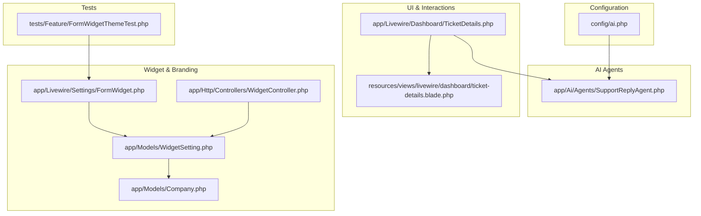
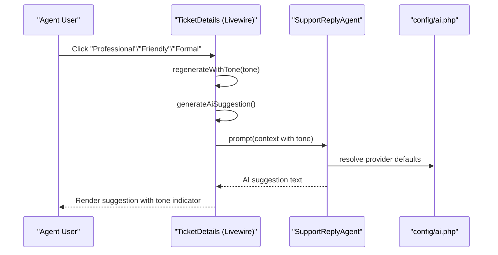
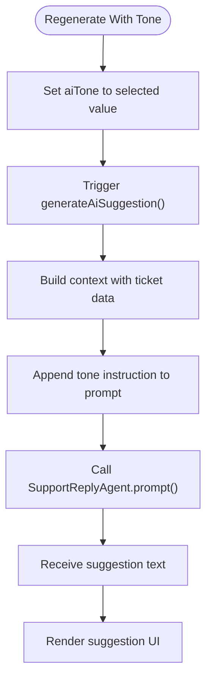
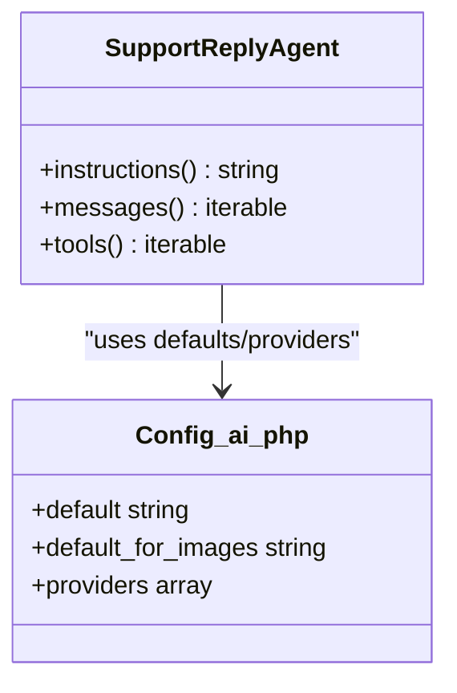
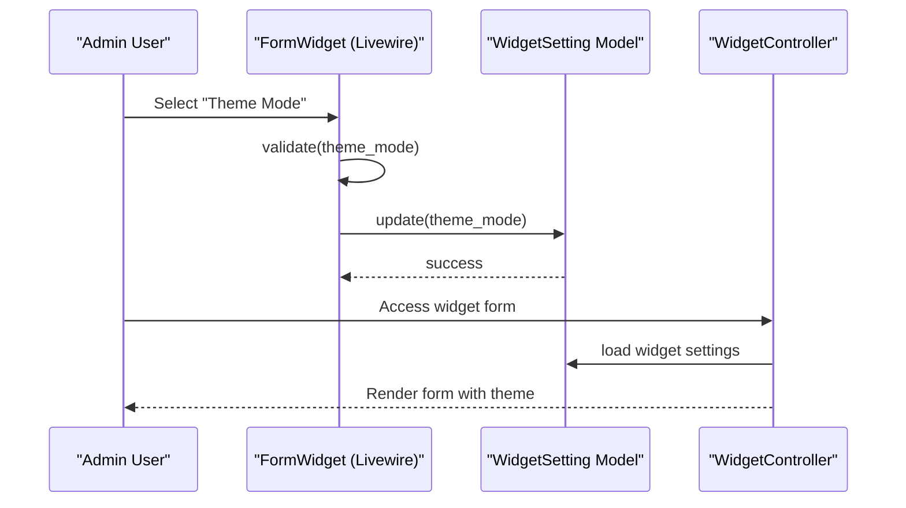
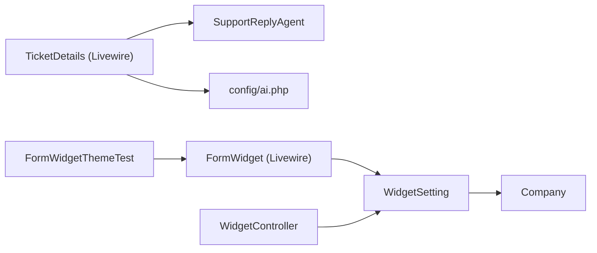

# Tone Control & Personalization

<cite>
**Referenced Files in This Document**
- [config/ai.php](file://config/ai.php)
- [app/Ai/Agents/SupportReplyAgent.php](file://app/Ai/Agents/SupportReplyAgent.php)
- [app/Livewire/Dashboard/TicketDetails.php](file://app/Livewire/Dashboard/TicketDetails.php)
- [resources/views/livewire/dashboard/ticket-details.blade.php](file://resources/views/livewire/dashboard/ticket-details.blade.php)
- [app/Livewire/Settings/FormWidget.php](file://app/Livewire/Settings/FormWidget.php)
- [app/Models/WidgetSetting.php](file://app/Models/WidgetSetting.php)
- [app/Models/Company.php](file://app/Models/Company.php)
- [app/Http/Controllers/WidgetController.php](file://app/Http/Controllers/WidgetController.php)
- [database/migrations/2026_03_07_173715_rename_primary_color_to_theme_mode_in_widget_settings.php](file://database/migrations/2026_03_07_173715_rename_primary_color_to_theme_mode_in_widget_settings.php)
- [tests/Feature/FormWidgetThemeTest.php](file://tests/Feature/FormWidgetThemeTest.php)
- [LaravelAISDKdocs.txt](file://LaravelAISDKdocs.txt)
- [composer.json](file://composer.json)
</cite>

## Table of Contents
1. [Introduction](#introduction)
2. [Project Structure](#project-structure)
3. [Core Components](#core-components)
4. [Architecture Overview](#architecture-overview)
5. [Detailed Component Analysis](#detailed-component-analysis)
6. [Dependency Analysis](#dependency-analysis)
7. [Performance Considerations](#performance-considerations)
8. [Troubleshooting Guide](#troubleshooting-guide)
9. [Conclusion](#conclusion)
10. [Appendices](#appendices)

## Introduction
This document explains how the system implements AI tone control and personalization for customer-facing interactions. It covers how company branding and customer preferences influence AI response style and tone, how tone adjustments are integrated into the agent prompts, and how widget themes and company-specific configurations affect AI behavior. It also provides practical examples for different customer segments, cultural considerations, and brand voice consistency, along with guidelines for implementing tone controls, testing response styles, and maintaining brand alignment across AI interactions.

## Project Structure
The tone control and personalization features span configuration, agents, Livewire components, Blade templates, models, controllers, and tests. The Laravel AI SDK powers agent interactions, while Livewire manages interactive UI controls for tone selection and AI suggestions.

**Diagram sources**
- [config/ai.php:1-130](file://config/ai.php#L1-L130)
- [app/Ai/Agents/SupportReplyAgent.php:1-50](file://app/Ai/Agents/SupportReplyAgent.php#L1-L50)
- [app/Livewire/Dashboard/TicketDetails.php:1-532](file://app/Livewire/Dashboard/TicketDetails.php#L1-L532)
- [resources/views/livewire/dashboard/ticket-details.blade.php:544-580](file://resources/views/livewire/dashboard/ticket-details.blade.php#L544-L580)
- [app/Livewire/Settings/FormWidget.php:1-157](file://app/Livewire/Settings/FormWidget.php#L1-L157)
- [app/Models/WidgetSetting.php:1-71](file://app/Models/WidgetSetting.php#L1-L71)
- [app/Models/Company.php:1-47](file://app/Models/Company.php#L1-L47)
- [app/Http/Controllers/WidgetController.php:1-197](file://app/Http/Controllers/WidgetController.php#L1-L197)
- [tests/Feature/FormWidgetThemeTest.php:1-47](file://tests/Feature/FormWidgetThemeTest.php#L1-L47)

**Section sources**
- [config/ai.php:1-130](file://config/ai.php#L1-L130)
- [app/Livewire/Dashboard/TicketDetails.php:324-395](file://app/Livewire/Dashboard/TicketDetails.php#L324-L395)
- [resources/views/livewire/dashboard/ticket-details.blade.php:544-580](file://resources/views/livewire/dashboard/ticket-details.blade.php#L544-L580)
- [app/Livewire/Settings/FormWidget.php:14-70](file://app/Livewire/Settings/FormWidget.php#L14-L70)
- [app/Models/WidgetSetting.php:37-45](file://app/Models/WidgetSetting.php#L37-L45)
- [app/Http/Controllers/WidgetController.php:24-36](file://app/Http/Controllers/WidgetController.php#L24-L36)
- [tests/Feature/FormWidgetThemeTest.php:11-47](file://tests/Feature/FormWidgetThemeTest.php#L11-L47)

## Core Components
- AI configuration and providers: Centralized provider credentials and defaults for AI operations.
- SupportReplyAgent: Defines the agent’s instructions and how it interacts with the selected provider.
- TicketDetails Livewire component: Manages AI suggestion generation, tone selection, and rendering.
- Blade template: Provides interactive tone buttons and suggestion UI.
- FormWidget Livewire component and WidgetSetting model: Manage widget theme mode and related settings.
- Company model: Links widgets and categories to companies.
- WidgetController: Handles widget form submission and related flows.
- Tests: Validate theme mode selection and persistence.

**Section sources**
- [config/ai.php:16-127](file://config/ai.php#L16-L127)
- [app/Ai/Agents/SupportReplyAgent.php:25-28](file://app/Ai/Agents/SupportReplyAgent.php#L25-L28)
- [app/Livewire/Dashboard/TicketDetails.php:38, 336-395:38-395](file://app/Livewire/Dashboard/TicketDetails.php#L38-L395)
- [resources/views/livewire/dashboard/ticket-details.blade.php:544-580](file://resources/views/livewire/dashboard/ticket-details.blade.php#L544-L580)
- [app/Livewire/Settings/FormWidget.php:14-70](file://app/Livewire/Settings/FormWidget.php#L14-L70)
- [app/Models/WidgetSetting.php:37-45](file://app/Models/WidgetSetting.php#L37-L45)
- [app/Models/Company.php:34-37](file://app/Models/Company.php#L34-L37)
- [app/Http/Controllers/WidgetController.php:24-36](file://app/Http/Controllers/WidgetController.php#L24-L36)
- [tests/Feature/FormWidgetThemeTest.php:11-47](file://tests/Feature/FormWidgetThemeTest.php#L11-L47)

## Architecture Overview
The system composes a prompt with contextual ticket data and the selected tone, then delegates to the SupportReplyAgent. The agent uses the configured provider to generate a response tailored to the requested tone. The UI exposes tone controls and suggestion previews, while widget settings influence the broader brand presentation.

**Diagram sources**
- [app/Livewire/Dashboard/TicketDetails.php:383-395](file://app/Livewire/Dashboard/TicketDetails.php#L383-L395)
- [app/Livewire/Dashboard/TicketDetails.php:336-381](file://app/Livewire/Dashboard/TicketDetails.php#L336-L381)
- [app/Ai/Agents/SupportReplyAgent.php:25-28](file://app/Ai/Agents/SupportReplyAgent.php#L25-L28)
- [config/ai.php:16-21](file://config/ai.php#L16-L21)

## Detailed Component Analysis

### AI Tone Controls in Ticket Details
- State and defaults: The component initializes a default tone and toggles suggestion visibility and loading states.
- Prompt construction: The suggestion prompt includes ticket metadata and a tone instruction appended at the end.
- Tone regeneration: Selecting a tone updates the current tone and triggers regeneration without clearing prior suggestions.

**Diagram sources**
- [app/Livewire/Dashboard/TicketDetails.php:383-395](file://app/Livewire/Dashboard/TicketDetails.php#L383-L395)
- [app/Livewire/Dashboard/TicketDetails.php:336-381](file://app/Livewire/Dashboard/TicketDetails.php#L336-L381)

**Section sources**
- [app/Livewire/Dashboard/TicketDetails.php:38, 336-395:38-395](file://app/Livewire/Dashboard/TicketDetails.php#L38-L395)
- [resources/views/livewire/dashboard/ticket-details.blade.php:544-580](file://resources/views/livewire/dashboard/ticket-details.blade.php#L544-L580)

### Agent Instructions and Provider Integration
- Instructions: The agent’s instructions define the role and response constraints.
- Provider defaults: The configuration defines default providers for various operations, ensuring consistent provider selection unless overridden.

**Diagram sources**
- [app/Ai/Agents/SupportReplyAgent.php:25-28](file://app/Ai/Agents/SupportReplyAgent.php#L25-L28)
- [config/ai.php:16-127](file://config/ai.php#L16-L127)

**Section sources**
- [app/Ai/Agents/SupportReplyAgent.php:25-28](file://app/Ai/Agents/SupportReplyAgent.php#L25-L28)
- [config/ai.php:16-21](file://config/ai.php#L16-L21)

### Widget Theme and Branding Integration
- Theme mode: The widget settings expose a theme mode (dark/light) that influences the widget’s visual presentation.
- Persistence and migration: Theme mode replaces a previous primary color field, with existing records migrated to a default theme mode.
- Validation and saving: The FormWidget component validates and persists theme mode and other widget settings.
- Controller integration: WidgetController loads widget settings for rendering and form submission.

**Diagram sources**
- [app/Livewire/Settings/FormWidget.php:89-118](file://app/Livewire/Settings/FormWidget.php#L89-L118)
- [app/Models/WidgetSetting.php:37-45](file://app/Models/WidgetSetting.php#L37-L45)
- [app/Http/Controllers/WidgetController.php:24-36](file://app/Http/Controllers/WidgetController.php#L24-L36)
- [database/migrations/2026_03_07_173715_rename_primary_color_to_theme_mode_in_widget_settings.php:9-26](file://database/migrations/2026_03_07_173715_rename_primary_color_to_theme_mode_in_widget_settings.php#L9-L26)

**Section sources**
- [app/Livewire/Settings/FormWidget.php:14-70](file://app/Livewire/Settings/FormWidget.php#L14-L70)
- [app/Models/WidgetSetting.php:37-45](file://app/Models/WidgetSetting.php#L37-L45)
- [database/migrations/2026_03_07_173715_rename_primary_color_to_theme_mode_in_widget_settings.php:9-26](file://database/migrations/2026_03_07_173715_rename_primary_color_to_theme_mode_in_widget_settings.php#L9-L26)
- [app/Http/Controllers/WidgetController.php:24-36](file://app/Http/Controllers/WidgetController.php#L24-L36)
- [tests/Feature/FormWidgetThemeTest.php:11-47](file://tests/Feature/FormWidgetThemeTest.php#L11-L47)

### Company Branding and Categories
- Company relationships: WidgetSetting belongs to a Company, enabling per-company widget configuration.
- Categories linkage: Companies maintain categories used by widgets and tickets.

**Section sources**
- [app/Models/WidgetSetting.php:37-45](file://app/Models/WidgetSetting.php#L37-L45)
- [app/Models/Company.php:34-37](file://app/Models/Company.php#L34-L37)

## Dependency Analysis
The tone control pipeline depends on Livewire for UI interactivity, the AI agent for text generation, and configuration for provider defaults. Widget branding depends on Livewire settings and the model relationships.

**Diagram sources**
- [app/Livewire/Dashboard/TicketDetails.php:336-395](file://app/Livewire/Dashboard/TicketDetails.php#L336-L395)
- [app/Ai/Agents/SupportReplyAgent.php:25-28](file://app/Ai/Agents/SupportReplyAgent.php#L25-L28)
- [config/ai.php:16-127](file://config/ai.php#L16-L127)
- [app/Livewire/Settings/FormWidget.php:89-118](file://app/Livewire/Settings/FormWidget.php#L89-L118)
- [app/Models/WidgetSetting.php:37-45](file://app/Models/WidgetSetting.php#L37-L45)
- [app/Models/Company.php:34-37](file://app/Models/Company.php#L34-L37)
- [app/Http/Controllers/WidgetController.php:24-36](file://app/Http/Controllers/WidgetController.php#L24-L36)
- [tests/Feature/FormWidgetThemeTest.php:11-47](file://tests/Feature/FormWidgetThemeTest.php#L11-L47)

**Section sources**
- [composer.json:11-22](file://composer.json#L11-L22)
- [LaravelAISDKdocs.txt:1-86](file://LaravelAISDKdocs.txt#L1-L86)

## Performance Considerations
- Prompt size: Keep contextual data concise; include only essential ticket metadata and conversation excerpts to reduce latency and cost.
- Caching: Enable provider-side caching for repeated prompts when appropriate to reduce latency and API costs.
- Asynchronous UI: Use Livewire’s reactive properties to avoid blocking the UI during AI generation; the current implementation already sets loading states.
- Provider selection: Choose providers aligned with your latency and quality targets; defaults in configuration can be tuned per environment.

[No sources needed since this section provides general guidance]

## Troubleshooting Guide
- Tone not changing: Ensure the Livewire event handlers are invoked and that the component’s tone property is updated before regenerating suggestions.
- Suggestions fail to load: Confirm the agent prompt method is reachable and that provider credentials are configured correctly.
- Theme mode not persisting: Verify validation rules and that the model updates are committed; tests demonstrate successful persistence.
- Widget not rendering with expected theme: Confirm the controller loads widget settings and that the view receives the correct theme mode.

**Section sources**
- [app/Livewire/Dashboard/TicketDetails.php:383-395](file://app/Livewire/Dashboard/TicketDetails.php#L383-L395)
- [app/Livewire/Dashboard/TicketDetails.php:336-381](file://app/Livewire/Dashboard/TicketDetails.php#L336-L381)
- [app/Livewire/Settings/FormWidget.php:89-118](file://app/Livewire/Settings/FormWidget.php#L89-L118)
- [tests/Feature/FormWidgetThemeTest.php:24-47](file://tests/Feature/FormWidgetThemeTest.php#L24-L47)

## Conclusion
The system integrates AI tone control through a clear pipeline: UI-driven tone selection, composed prompts with contextual data, and agent-driven generation using configurable providers. Widget theme mode and company-linked settings further personalize the customer experience. By following the guidelines below, teams can implement robust tone controls, validate response styles, and maintain brand alignment across AI interactions.

## Appendices

### Implementation Guidelines for Tone Controls
- Define tone options: Use a controlled vocabulary (e.g., professional, friendly, formal) and map each to a concise instruction appended to the prompt.
- Compose prompts: Include ticket metadata and conversation history, then append the tone instruction last to maximize impact.
- Persist user intent: Store the selected tone alongside suggestions to enable regeneration with the same tone.
- Test iteratively: Validate tone effects across representative tickets and customer segments.

[No sources needed since this section provides general guidance]

### Testing Response Styles
- UI tests: Confirm tone buttons render and update the component state.
- Behavior tests: Verify that selecting a tone triggers regeneration and that the suggestion reflects the chosen tone.
- Regression tests: Ensure theme mode changes do not interfere with tone controls.

**Section sources**
- [tests/Feature/FormWidgetThemeTest.php:11-47](file://tests/Feature/FormWidgetThemeTest.php#L11-L47)

### Maintaining Brand Alignment Across AI Interactions
- Tone consistency: Standardize tone instructions and review suggestions against brand guidelines.
- Cultural considerations: Localize tone instructions and examples where applicable; consider regional communication norms.
- Customer segmentation: Offer segment-specific tone presets (e.g., enterprise vs. consumer) and track effectiveness.

[No sources needed since this section provides general guidance]