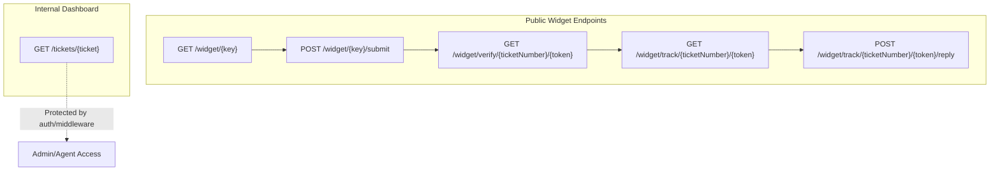
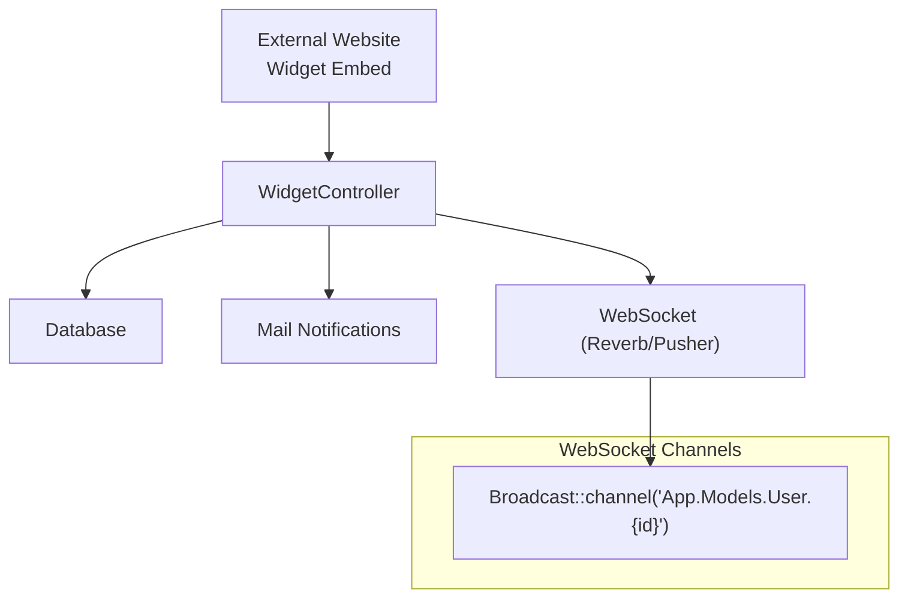
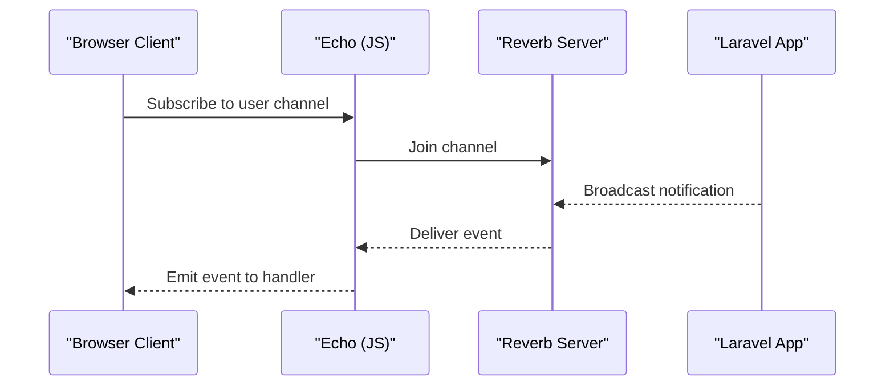
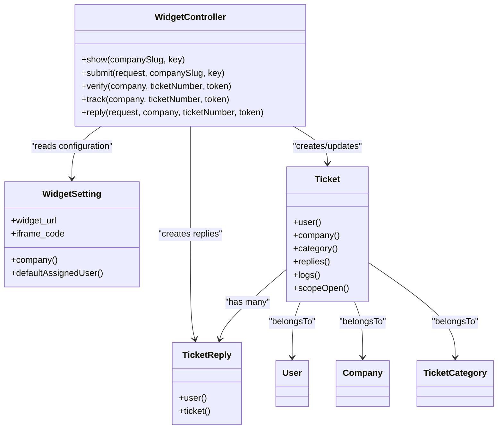
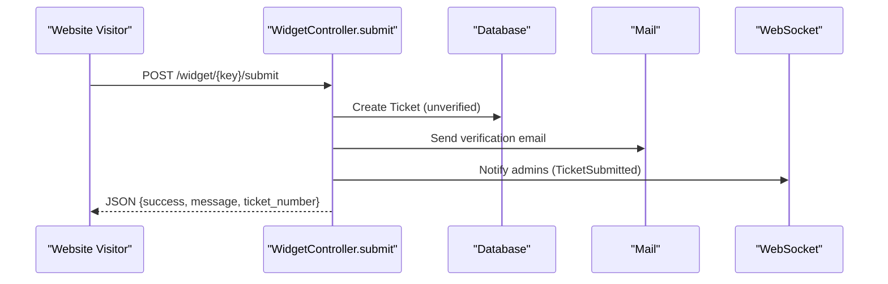
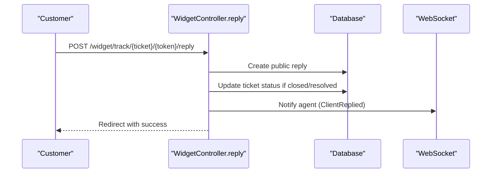

# API Reference

<cite>
**Referenced Files in This Document**
- [routes/web.php](file://routes/web.php)
- [routes/settings.php](file://routes/settings.php)
- [routes/channels.php](file://routes/channels.php)
- [app/Http/Controllers/WidgetController.php](file://app/Http/Controllers/WidgetController.php)
- [app/Http/Controllers/TicketsController.php](file://app/Http/Controllers/TicketsController.php)
- [app/Models/Ticket.php](file://app/Models/Ticket.php)
- [app/Models/TicketReply.php](file://app/Models/TicketReply.php)
- [app/Models/WidgetSetting.php](file://app/Models/WidgetSetting.php)
- [app/Notifications/TicketSubmitted.php](file://app/Notifications/TicketSubmitted.php)
- [app/Notifications/TicketStatusChanged.php](file://app/Notifications/TicketStatusChanged.php)
- [app/Notifications/ClientReplied.php](file://app/Notifications/ClientReplied.php)
- [config/broadcasting.php](file://config/broadcasting.php)
- [config/reverb.php](file://config/reverb.php)
- [resources/js/echo.js](file://resources/js/echo.js)
</cite>

## Table of Contents
1. [Introduction](#introduction)
2. [Project Structure](#project-structure)
3. [Core Components](#core-components)
4. [Architecture Overview](#architecture-overview)
5. [Detailed Component Analysis](#detailed-component-analysis)
6. [Dependency Analysis](#dependency-analysis)
7. [Performance Considerations](#performance-considerations)
8. [Troubleshooting Guide](#troubleshooting-guide)
9. [Conclusion](#conclusion)
10. [Appendices](#appendices)

## Introduction
This document provides a comprehensive API reference for the Helpdesk System’s RESTful endpoints and WebSocket interfaces. It covers:
- Public widget endpoints for external website integration (form submission, verification, tracking, and replies)
- Internal dashboard endpoints for ticket viewing
- Real-time notifications via WebSocket (Reverb/Pusher) for ticket updates, status changes, and client replies
- Request/response schemas, authentication requirements, and error handling patterns
- Security considerations, rate limiting guidance, and client integration patterns

## Project Structure
The API surface is organized under company subdomains. Public endpoints are exposed under the widget namespace, while internal dashboards are protected and role-scoped.

**Diagram sources**
- [routes/settings.php:12-19](file://routes/settings.php#L12-L19)
- [routes/web.php:94-96](file://routes/web.php#L94-L96)

**Section sources**
- [routes/settings.php:12-19](file://routes/settings.php#L12-L19)
- [routes/web.php:94-96](file://routes/web.php#L94-L96)

## Core Components
- WidgetController: Implements all public widget endpoints, including form submission, verification, tracking, and customer replies.
- Ticket model: Core entity with route binding by ticket_number and relationships to company, user, category, replies, and logs.
- TicketReply model: Stores replies with flags for internal/technician visibility and attachments casting.
- WidgetSetting model: Manages per-company widget configuration, keys, defaults, and generated iframe code.
- Notifications: Event-driven notifications for ticket submission, status change, and client replies, broadcast over WebSocket.

**Section sources**
- [app/Http/Controllers/WidgetController.php:19-196](file://app/Http/Controllers/WidgetController.php#L19-L196)
- [app/Models/Ticket.php:9-64](file://app/Models/Ticket.php#L9-L64)
- [app/Models/TicketReply.php:8-39](file://app/Models/TicketReply.php#L8-L39)
- [app/Models/WidgetSetting.php:9-71](file://app/Models/WidgetSetting.php#L9-L71)
- [app/Notifications/TicketSubmitted.php:9-49](file://app/Notifications/TicketSubmitted.php#L9-L49)
- [app/Notifications/TicketStatusChanged.php:9-55](file://app/Notifications/TicketStatusChanged.php#L9-L55)
- [app/Notifications/ClientReplied.php:9-49](file://app/Notifications/ClientReplied.php#L9-L49)

## Architecture Overview
The system uses a subdomain-per-company pattern. Public endpoints are accessible without authentication but require a valid widget key and enforce verification tokens for sensitive actions. Real-time updates are delivered via WebSocket using Reverb/Pusher.

**Diagram sources**
- [routes/settings.php:12-19](file://routes/settings.php#L12-L19)
- [routes/channels.php:5-7](file://routes/channels.php#L5-L7)
- [config/broadcasting.php:31-80](file://config/broadcasting.php#L31-L80)
- [config/reverb.php:29-94](file://config/reverb.php#L29-L94)

## Detailed Component Analysis

### Public Widget Endpoints

#### GET /widget/{key}
- Purpose: Render the widget form for a given company and widget key.
- Authentication: None.
- Authorization: Requires active widget configuration matching company and key.
- Response: HTML form view.
- Errors: 404 Not Found if widget is inactive or mismatched.

**Section sources**
- [routes/settings.php:14](file://routes/settings.php#L14)
- [app/Http/Controllers/WidgetController.php:24-36](file://app/Http/Controllers/WidgetController.php#L24-L36)

#### POST /widget/{key}/submit
- Purpose: Submit a new ticket via the widget.
- Authentication: None.
- Request body:
  - customer_name (string, required)
  - customer_email (string, required)
  - customer_phone (string, optional; required if widget requires phone)
  - subject (string, required)
  - description (string, required)
  - category_id (integer, optional; required if widget shows categories)
- Validation: Enforced by controller rules.
- Behavior:
  - Generates unique ticket_number and verification_token.
  - Creates ticket with defaults from WidgetSetting (priority, status, assignment).
  - Sends verification email.
  - Notifies admins and unassigned tickets.
- Response: JSON with success flag, message, and ticket_number.
- Errors: 422 Unprocessable Entity for validation failures; 404 Not Found if widget invalid.

**Section sources**
- [routes/settings.php:15](file://routes/settings.php#L15)
- [app/Http/Controllers/WidgetController.php:41-109](file://app/Http/Controllers/WidgetController.php#L41-L109)
- [app/Models/WidgetSetting.php:13-17](file://app/Models/WidgetSetting.php#L13-L17)

#### GET /widget/verify/{ticketNumber}/{token}
- Purpose: Verify a ticket via email link.
- Authentication: None.
- Behavior:
  - Marks ticket as verified and clears verification_token.
  - Generates a tracking token for subsequent operations.
  - Sends tracking email.
- Response: HTML “verified” view.
- Errors: 404 Not Found if ticket/token/company mismatch or already verified.

**Section sources**
- [routes/settings.php:16](file://routes/settings.php#L16)
- [app/Http/Controllers/WidgetController.php:114-136](file://app/Http/Controllers/WidgetController.php#L114-L136)

#### GET /widget/track/{ticketNumber}/{token}
- Purpose: View public replies and ticket details for tracking.
- Authentication: None.
- Behavior:
  - Validates ticket ownership via company and token.
  - Returns ticket and public replies ordered by creation time.
- Response: HTML tracking view.
- Errors: 404 Not Found if invalid.

**Section sources**
- [routes/settings.php:17](file://routes/settings.php#L17)
- [app/Http/Controllers/WidgetController.php:141-158](file://app/Http/Controllers/WidgetController.php#L141-L158)

#### POST /widget/track/{ticketNumber}/{token}/reply
- Purpose: Submit a customer reply to an existing ticket.
- Authentication: None.
- Request body:
  - message (string, required)
- Behavior:
  - Validates ticket and token.
  - Creates public reply.
  - Reopens ticket if previously closed/resolved.
  - Notifies assigned agent.
- Response: Redirect with success message.
- Errors: 422 Unprocessable Entity for validation; 404 Not Found if invalid.

**Section sources**
- [routes/settings.php:18](file://routes/settings.php#L18)
- [app/Http/Controllers/WidgetController.php:163-195](file://app/Http/Controllers/WidgetController.php#L163-L195)

### Internal Dashboard Endpoint

#### GET /tickets/{ticket}
- Purpose: View ticket details for authorized users.
- Authentication: Required.
- Authorization: Depends on middleware and user role.
- Route model binding: Uses ticket_number as route key.
- Response: HTML ticket details view.

**Section sources**
- [routes/web.php:95](file://routes/web.php#L95)
- [app/Http/Controllers/TicketsController.php:12-17](file://app/Http/Controllers/TicketsController.php#L12-L17)
- [app/Models/Ticket.php:31-34](file://app/Models/Ticket.php#L31-L34)

### WebSocket Interfaces and Real-Time Notifications

#### Broadcasting Configuration
- Default driver: Reverb or Pusher (via environment).
- Reverb server options include host, port, TLS, scaling via Redis, and limits.
- Allowed origins and ping/activity timeouts configurable per app.

**Section sources**
- [config/broadcasting.php:18](file://config/broadcasting.php#L18)
- [config/broadcasting.php:31-80](file://config/broadcasting.php#L31-L80)
- [config/reverb.php:16](file://config/reverb.php#L16)
- [config/reverb.php:29-94](file://config/reverb.php#L29-L94)

#### Channel Definition
- Private user channel: Broadcast::channel('App.Models.User.{id}') validates identity.

**Section sources**
- [routes/channels.php:5-7](file://routes/channels.php#L5-L7)

#### Client Setup (JavaScript)
- Echo configured to connect to Reverb with environment variables for host/port/scheme/TLS and transport selection.

**Section sources**
- [resources/js/echo.js:6-14](file://resources/js/echo.js#L6-L14)

#### Event Types and Payloads
- TicketSubmitted
  - via: database, broadcast
  - payload keys: ticket_id, ticket_number, subject, type ("ticket_submitted"), message
- TicketStatusChanged
  - via: database, broadcast
  - payload keys: ticket_id, ticket_number, subject, type ("status_changed"), message
- ClientReplied
  - via: database, broadcast
  - payload keys: ticket_id, ticket_number, subject, type ("client_replied"), message

**Diagram sources**
- [resources/js/echo.js:6-14](file://resources/js/echo.js#L6-L14)
- [routes/channels.php:5-7](file://routes/channels.php#L5-L7)
- [app/Notifications/TicketSubmitted.php:28-47](file://app/Notifications/TicketSubmitted.php#L28-L47)
- [app/Notifications/TicketStatusChanged.php:34-53](file://app/Notifications/TicketStatusChanged.php#L34-L53)
- [app/Notifications/ClientReplied.php:28-47](file://app/Notifications/ClientReplied.php#L28-L47)

## Dependency Analysis
- WidgetController depends on:
  - WidgetSetting for configuration and defaults
  - Ticket and TicketReply for persistence
  - Mail for verification/confirmation
  - Notifications for real-time updates
- Ticket model depends on:
  - User (assigned_to), Company, Category, TicketReply, TicketLog
- Notifications depend on:
  - Ticket model and Laravel’s broadcast/database channels

**Diagram sources**
- [app/Http/Controllers/WidgetController.php:19-196](file://app/Http/Controllers/WidgetController.php#L19-L196)
- [app/Models/WidgetSetting.php:37-45](file://app/Models/WidgetSetting.php#L37-L45)
- [app/Models/Ticket.php:16-54](file://app/Models/Ticket.php#L16-L54)
- [app/Models/TicketReply.php:29-37](file://app/Models/TicketReply.php#L29-L37)

**Section sources**
- [app/Http/Controllers/WidgetController.php:19-196](file://app/Http/Controllers/WidgetController.php#L19-L196)
- [app/Models/WidgetSetting.php:37-45](file://app/Models/WidgetSetting.php#L37-L45)
- [app/Models/Ticket.php:16-54](file://app/Models/Ticket.php#L16-L54)
- [app/Models/TicketReply.php:29-37](file://app/Models/TicketReply.php#L29-L37)

## Performance Considerations
- Prefer pagination for listing replies in tracking views if scale grows.
- Cache frequently accessed widget configurations per company/key.
- Use database indexing on ticket_number, verification_token, and company_id for fast lookups.
- Limit WebSocket message sizes and enable compression at the Reverb server level.
- Offload email sending to queued jobs to avoid blocking requests.

## Troubleshooting Guide
- 404 Not Found on widget endpoints:
  - Verify widget_key is active and belongs to the requested company.
  - Confirm ticket_number and token combinations match expectations.
- 422 Unprocessable Entity on submit/reply:
  - Check required fields and optional constraints (phone/category based on widget settings).
- Verification/Tracking links fail:
  - Ensure the correct company subdomain and token are used.
  - Confirm ticket is unverified for verification endpoint and verified for tracking.
- WebSocket notifications not received:
  - Verify environment variables for Reverb/Pusher are set.
  - Ensure client connects to the correct user channel and origin is allowed.

**Section sources**
- [app/Http/Controllers/WidgetController.php:44-47](file://app/Http/Controllers/WidgetController.php#L44-L47)
- [app/Http/Controllers/WidgetController.php:116-120](file://app/Http/Controllers/WidgetController.php#L116-L120)
- [app/Http/Controllers/WidgetController.php:143-148](file://app/Http/Controllers/WidgetController.php#L143-L148)
- [config/broadcasting.php:18](file://config/broadcasting.php#L18)
- [config/reverb.php:80-89](file://config/reverb.php#L80-L89)

## Conclusion
The Helpdesk System exposes a clean, subdomain-per-company API surface. Public widget endpoints enable external integration with robust verification and tracking flows. Internal dashboards remain protected and role-aware. Real-time updates are powered by WebSocket broadcasting, enabling responsive agent and client experiences.

## Appendices

### Authentication and Authorization
- Public widget endpoints:
  - No authentication required.
  - Authorization via widget_key and verification tokens.
- Internal dashboard endpoints:
  - Require authenticated session and appropriate middleware/roles.

**Section sources**
- [routes/settings.php:12-19](file://routes/settings.php#L12-L19)
- [routes/web.php:71-114](file://routes/web.php#L71-L114)

### Rate Limiting Policies
- Not explicitly implemented in the examined code.
- Recommended: Apply per-endpoint limits (e.g., 60/minute for submit and reply) with token bucket or sliding window strategies. Consider IP-based quotas and CAPTCHA for bot mitigation.

### Security Considerations
- Tokens:
  - verification_token is single-use for verification; tracking uses a separate token stored in the same field after verification.
- CORS and Origins:
  - Configure allowed origins for Reverb apps and ensure HTTPS/TLS is enforced.
- Input Sanitization:
  - Validate and sanitize all inputs; consider content security policies for embedded widgets.

**Section sources**
- [app/Http/Controllers/WidgetController.php:66](file://app/Http/Controllers/WidgetController.php#L66)
- [app/Http/Controllers/WidgetController.php:129](file://app/Http/Controllers/WidgetController.php#L129)
- [config/reverb.php:85](file://config/reverb.php#L85)

### Example Workflows

#### New Ticket Submission (Widget)

**Diagram sources**
- [app/Http/Controllers/WidgetController.php:41-109](file://app/Http/Controllers/WidgetController.php#L41-L109)
- [app/Notifications/TicketSubmitted.php:28-47](file://app/Notifications/TicketSubmitted.php#L28-L47)

#### Customer Reply and Agent Notification

**Diagram sources**
- [app/Http/Controllers/WidgetController.php:163-195](file://app/Http/Controllers/WidgetController.php#L163-L195)
- [app/Notifications/ClientReplied.php:28-47](file://app/Notifications/ClientReplied.php#L28-L47)

### Request/Response Schemas

- POST /widget/{key}/submit
  - Request: customer_name, customer_email, customer_phone?, subject, description, category_id?
  - Response: success (boolean), message (string), ticket_number (string)

- POST /widget/track/{ticket}/{token}/reply
  - Request: message (string)
  - Response: Redirect with success message

- GET /widget/track/{ticket}/{token}
  - Response: HTML tracking view with ticket and public replies

**Section sources**
- [app/Http/Controllers/WidgetController.php:49-58](file://app/Http/Controllers/WidgetController.php#L49-L58)
- [app/Http/Controllers/WidgetController.php:171-173](file://app/Http/Controllers/WidgetController.php#L171-L173)
- [app/Http/Controllers/WidgetController.php:104-108](file://app/Http/Controllers/WidgetController.php#L104-L108)