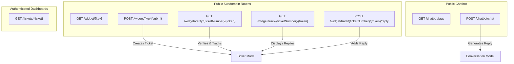
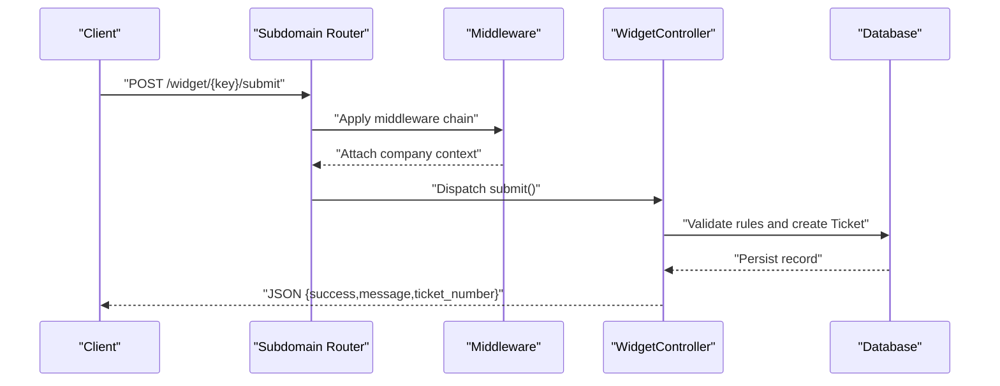
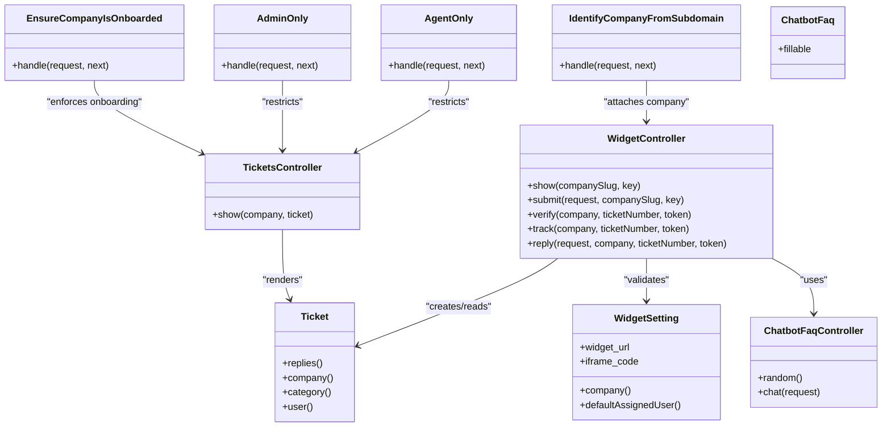

# REST Endpoints

<cite>
**Referenced Files in This Document**
- [routes/web.php](file://routes/web.php)
- [routes/settings.php](file://routes/settings.php)
- [app/Http/Controllers/WidgetController.php](file://app/Http/Controllers/WidgetController.php)
- [app/Http/Controllers/ChatbotFaqController.php](file://app/Http/Controllers/ChatbotFaqController.php)
- [app/Http/Controllers/TicketsController.php](file://app/Http/Controllers/TicketsController.php)
- [app/Http/Middleware/AdminOnly.php](file://app/Http/Middleware/AdminOnly.php)
- [app/Http/Middleware/AgentOnly.php](file://app/Http/Middleware/AgentOnly.php)
- [app/Http/Middleware/IdentifyCompanyFromSubdomain.php](file://app/Http/Middleware/IdentifyCompanyFromSubdomain.php)
- [app/Http/Middleware/EnsureCompanyIsOnboarded.php](file://app/Http/Middleware/EnsureCompanyIsOnboarded.php)
- [app/Models/Ticket.php](file://app/Models/Ticket.php)
- [app/Models/WidgetSetting.php](file://app/Models/WidgetSetting.php)
- [app/Models/ChatbotFaq.php](file://app/Models/ChatbotFaq.php)
- [config/auth.php](file://config/auth.php)
</cite>

## Table of Contents
1. [Introduction](#introduction)
2. [Project Structure](#project-structure)
3. [Core Components](#core-components)
4. [Architecture Overview](#architecture-overview)
5. [Detailed Component Analysis](#detailed-component-analysis)
6. [Dependency Analysis](#dependency-analysis)
7. [Performance Considerations](#performance-considerations)
8. [Troubleshooting Guide](#troubleshooting-guide)
9. [Conclusion](#conclusion)

## Introduction
This document provides comprehensive REST API documentation for the Helpdesk System. It covers:
- Public widget endpoints for form submission, verification, tracking, and customer replies
- Chatbot FAQ endpoints for random FAQs and chat interactions
- Ticket detail exposure via subdomain routes
- Authentication and authorization requirements
- Request/response schemas, parameters, and status codes
- Security headers, CORS configuration, and rate limiting policy notes
- Access control patterns and middleware enforcement

Important note: The current routing structure exposes primarily web routes and does not define dedicated REST endpoints under a separate API namespace. The documented endpoints reflect the existing public and authenticated routes grouped by subdomain and controller responsibilities.

## Project Structure
The API surface is organized around subdomain-based routing and controller actions:
- Public widget endpoints under the company subdomain
- Authenticated internal dashboards and settings
- Chatbot endpoints exposed publicly
- Ticket detail pages accessed via subdomain routes

**Diagram sources**
- [routes/settings.php:12-19](file://routes/settings.php#L12-L19)
- [routes/web.php:16-18](file://routes/web.php#L16-L18)
- [routes/web.php:95-95](file://routes/web.php#L95-L95)
- [app/Http/Controllers/WidgetController.php:41-109](file://app/Http/Controllers/WidgetController.php#L41-L109)
- [app/Http/Controllers/WidgetController.php:114-136](file://app/Http/Controllers/WidgetController.php#L114-L136)
- [app/Http/Controllers/WidgetController.php:141-158](file://app/Http/Controllers/WidgetController.php#L141-L158)
- [app/Http/Controllers/WidgetController.php:163-195](file://app/Http/Controllers/WidgetController.php#L163-L195)
- [app/Http/Controllers/ChatbotFaqController.php:12-36](file://app/Http/Controllers/ChatbotFaqController.php#L12-L36)
- [app/Models/Ticket.php:36-39](file://app/Models/Ticket.php#L36-L39)

**Section sources**
- [routes/settings.php:12-19](file://routes/settings.php#L12-L19)
- [routes/web.php:16-18](file://routes/web.php#L16-L18)
- [routes/web.php:95-95](file://routes/web.php#L95-L95)

## Core Components
- WidgetController: Handles widget form submission, verification, tracking, and customer replies
- ChatbotFaqController: Provides random FAQs and chat interactions
- TicketsController: Exposes ticket detail page under subdomain routes
- Middleware: Enforces company identification, onboard status, admin/agent roles, and authentication
- Models: Ticket, WidgetSetting, ChatbotFaq

**Section sources**
- [app/Http/Controllers/WidgetController.php:19-197](file://app/Http/Controllers/WidgetController.php#L19-L197)
- [app/Http/Controllers/ChatbotFaqController.php:10-67](file://app/Http/Controllers/ChatbotFaqController.php#L10-L67)
- [app/Http/Controllers/TicketsController.php:7-18](file://app/Http/Controllers/TicketsController.php#L7-L18)
- [app/Http/Middleware/IdentifyCompanyFromSubdomain.php:10-54](file://app/Http/Middleware/IdentifyCompanyFromSubdomain.php#L10-L54)
- [app/Http/Middleware/EnsureCompanyIsOnboarded.php:9-28](file://app/Http/Middleware/EnsureCompanyIsOnboarded.php#L9-L28)
- [app/Http/Middleware/AdminOnly.php:9-25](file://app/Http/Middleware/AdminOnly.php#L9-L25)
- [app/Http/Middleware/AgentOnly.php:9-25](file://app/Http/Middleware/AgentOnly.php#L9-L25)
- [app/Models/Ticket.php:9-64](file://app/Models/Ticket.php#L9-L64)
- [app/Models/WidgetSetting.php:9-71](file://app/Models/WidgetSetting.php#L9-L71)
- [app/Models/ChatbotFaq.php:8-18](file://app/Models/ChatbotFaq.php#L8-L18)

## Architecture Overview
The system uses subdomain-based routing to isolate company contexts. Public routes are available under the company subdomain for widget integrations. Authenticated routes under the same subdomain expose dashboards and settings. Middleware ensures company identification and access control.

**Diagram sources**
- [routes/settings.php:13-19](file://routes/settings.php#L13-L19)
- [app/Http/Middleware/IdentifyCompanyFromSubdomain.php:12-36](file://app/Http/Middleware/IdentifyCompanyFromSubdomain.php#L12-L36)
- [app/Http/Controllers/WidgetController.php:41-109](file://app/Http/Controllers/WidgetController.php#L41-L109)

## Detailed Component Analysis

### Widget Integration Endpoints
These endpoints are public and operate under the company subdomain. They enable form submissions, verification, tracking, and customer replies.

- Base Path: /widget/{key}
- Subdomain: {company}.{domain}

Endpoints:
- GET /widget/{key}
  - Description: Render the widget form for the given key
  - Authentication: None
  - Response: HTML form view
  - Notes: Validates active widget settings and associated company/category visibility

- POST /widget/{key}/submit
  - Description: Submit a new ticket via widget
  - Authentication: None
  - Request JSON:
    - customer_name: string, required
    - customer_email: string, required, email
    - customer_phone: string, optional (required if widget requires phone)
    - subject: string, required
    - description: string, required
    - category_id: integer, optional (if categories are shown)
  - Response JSON:
    - success: boolean
    - message: string
    - ticket_number: string
  - Validation:
    - Uses widget configuration to adjust required fields
    - Generates unique ticket number and verification token
    - Creates ticket with defaults from widget settings
  - Side effects:
    - Sends verification email
    - Notifies admins and unassigned tickets

- GET /widget/verify/{ticketNumber}/{token}
  - Description: Verify ticket via email link
  - Authentication: None
  - Response: HTML verification success page
  - Behavior:
    - Marks ticket as verified
    - Generates a tracking token for subsequent operations

- GET /widget/track/{ticketNumber}/{token}
  - Description: Track ticket status and public replies
  - Authentication: None
  - Response: HTML tracking page
  - Behavior:
    - Filters replies by is_internal=false
    - Loads ticket with category and company relations

- POST /widget/track/{ticketNumber}/{token}/reply
  - Description: Submit a customer reply to an open or reopened ticket
  - Authentication: None
  - Request JSON:
    - message: string, required, max length
  - Response: Redirect with success message
  - Behavior:
    - Reopens resolved/closed tickets automatically
    - Notifies assigned agent if present

Security and Access Control:
- Company identification is attached to the request via subdomain middleware
- Widget must be active and match the company context
- Verification/tracking tokens are validated per operation

Rate Limiting and CORS:
- No explicit rate limiting is configured in the current routing/middleware
- CORS is not explicitly configured in the provided files; defaults apply

Example Requests and Responses:
- Submit Ticket (POST /widget/{key}/submit)
  - Request: JSON with customer_name, customer_email, subject, description, optional category_id and phone
  - Response: JSON with success, message, ticket_number

- Track Ticket (GET /widget/track/{ticketNumber}/{token})
  - Request: Query parameters for ticketNumber and token
  - Response: HTML page with ticket details and public replies

**Section sources**
- [routes/settings.php:13-19](file://routes/settings.php#L13-L19)
- [app/Http/Controllers/WidgetController.php:24-36](file://app/Http/Controllers/WidgetController.php#L24-L36)
- [app/Http/Controllers/WidgetController.php:41-109](file://app/Http/Controllers/WidgetController.php#L41-L109)
- [app/Http/Controllers/WidgetController.php:114-136](file://app/Http/Controllers/WidgetController.php#L114-L136)
- [app/Http/Controllers/WidgetController.php:141-158](file://app/Http/Controllers/WidgetController.php#L141-L158)
- [app/Http/Controllers/WidgetController.php:163-195](file://app/Http/Controllers/WidgetController.php#L163-L195)
- [app/Http/Middleware/IdentifyCompanyFromSubdomain.php:12-36](file://app/Http/Middleware/IdentifyCompanyFromSubdomain.php#L12-L36)
- [app/Models/WidgetSetting.php:13-17](file://app/Models/WidgetSetting.php#L13-L17)

### Chatbot FAQ Endpoints
Public endpoints for chatbot interactions.

- GET /chatbot/faqs
  - Description: Retrieve random FAQs
  - Authentication: None
  - Response: JSON array of FAQs with fields: id, question, answer

- POST /chatbot/chat
  - Description: Send a message to the chatbot
  - Authentication: None
  - Request JSON:
    - message: string, required, max length
  - Response JSON:
    - reply: string
  - Behavior:
    - Performs keyword matching against predefined responses
    - Stores conversation record

Example Requests and Responses:
- Random FAQs (GET /chatbot/faqs)
  - Response: Array of FAQ objects

- Chat Interaction (POST /chatbot/chat)
  - Request: JSON with message
  - Response: JSON with reply

**Section sources**
- [routes/web.php:16-18](file://routes/web.php#L16-L18)
- [app/Http/Controllers/ChatbotFaqController.php:12-20](file://app/Http/Controllers/ChatbotFaqController.php#L12-L20)
- [app/Http/Controllers/ChatbotFaqController.php:22-36](file://app/Http/Controllers/ChatbotFaqController.php#L22-L36)
- [app/Models/ChatbotFaq.php:13-16](file://app/Models/ChatbotFaq.php#L13-L16)

### Ticket Detail Exposure
- GET /tickets/{ticket}
  - Description: View ticket details
  - Authentication: Requires auth, verified, and company access
  - Response: HTML ticket detail page
  - Notes: Ticket ID uses ticket_number route key

Access Control:
- Requires authenticated session
- Requires email verification
- Requires company access via subdomain middleware
- Requires onboarding completion

**Section sources**
- [routes/web.php:95-95](file://routes/web.php#L95-L95)
- [app/Http/Middleware/IdentifyCompanyFromSubdomain.php:12-36](file://app/Http/Middleware/IdentifyCompanyFromSubdomain.php#L12-L36)
- [app/Http/Middleware/EnsureCompanyIsOnboarded.php:16-25](file://app/Http/Middleware/EnsureCompanyIsOnboarded.php#L16-L25)
- [app/Models/Ticket.php:31-34](file://app/Models/Ticket.php#L31-L34)

## Dependency Analysis
The following diagram shows key dependencies among controllers, middleware, and models involved in the documented endpoints.

**Diagram sources**
- [app/Http/Controllers/WidgetController.php:19-197](file://app/Http/Controllers/WidgetController.php#L19-L197)
- [app/Http/Controllers/ChatbotFaqController.php:10-67](file://app/Http/Controllers/ChatbotFaqController.php#L10-L67)
- [app/Http/Controllers/TicketsController.php:7-18](file://app/Http/Controllers/TicketsController.php#L7-L18)
- [app/Http/Middleware/IdentifyCompanyFromSubdomain.php:10-54](file://app/Http/Middleware/IdentifyCompanyFromSubdomain.php#L10-L54)
- [app/Http/Middleware/EnsureCompanyIsOnboarded.php:9-28](file://app/Http/Middleware/EnsureCompanyIsOnboarded.php#L9-L28)
- [app/Http/Middleware/AdminOnly.php:9-25](file://app/Http/Middleware/AdminOnly.php#L9-L25)
- [app/Http/Middleware/AgentOnly.php:9-25](file://app/Http/Middleware/AgentOnly.php#L9-L25)
- [app/Models/Ticket.php:9-64](file://app/Models/Ticket.php#L9-L64)
- [app/Models/WidgetSetting.php:9-71](file://app/Models/WidgetSetting.php#L9-L71)
- [app/Models/ChatbotFaq.php:8-18](file://app/Models/ChatbotFaq.php#L8-L18)

**Section sources**
- [app/Http/Controllers/WidgetController.php:19-197](file://app/Http/Controllers/WidgetController.php#L19-L197)
- [app/Http/Controllers/ChatbotFaqController.php:10-67](file://app/Http/Controllers/ChatbotFaqController.php#L10-L67)
- [app/Http/Controllers/TicketsController.php:7-18](file://app/Http/Controllers/TicketsController.php#L7-L18)
- [app/Http/Middleware/IdentifyCompanyFromSubdomain.php:10-54](file://app/Http/Middleware/IdentifyCompanyFromSubdomain.php#L10-L54)
- [app/Http/Middleware/EnsureCompanyIsOnboarded.php:9-28](file://app/Http/Middleware/EnsureCompanyIsOnboarded.php#L9-L28)
- [app/Http/Middleware/AdminOnly.php:9-25](file://app/Http/Middleware/AdminOnly.php#L9-L25)
- [app/Http/Middleware/AgentOnly.php:9-25](file://app/Http/Middleware/AgentOnly.php#L9-L25)
- [app/Models/Ticket.php:9-64](file://app/Models/Ticket.php#L9-L64)
- [app/Models/WidgetSetting.php:9-71](file://app/Models/WidgetSetting.php#L9-L71)
- [app/Models/ChatbotFaq.php:8-18](file://app/Models/ChatbotFaq.php#L8-L18)

## Performance Considerations
- Widget form submission performs:
  - Unique ticket number generation with collision check
  - Email sending and notification dispatch
  - Database writes for ticket and conversation records
- Chatbot chat endpoint:
  - Keyword matching is O(n) over predefined keywords
  - Consider caching frequently used responses if traffic increases
- Tracking page:
  - Public replies are filtered by is_internal=false and ordered by creation time
  - Pagination is not implemented; consider adding limits for large reply sets

[No sources needed since this section provides general guidance]

## Troubleshooting Guide
Common issues and resolutions:
- 404 Company Not Found
  - Cause: Subdomain does not correspond to an existing company
  - Resolution: Verify company slug and DNS configuration
  - Section sources
    - [app/Http/Middleware/IdentifyCompanyFromSubdomain.php:24-29](file://app/Http/Middleware/IdentifyCompanyFromSubdomain.php#L24-L29)

- Widget Key Invalid or Inactive
  - Cause: Widget key not found, company mismatch, or inactive
  - Resolution: Confirm widget_key and company association; ensure widget is active
  - Section sources
    - [app/Http/Controllers/WidgetController.php:29-33](file://app/Http/Controllers/WidgetController.php#L29-L33)

- Ticket Already Verified or Expired Token
  - Cause: Verification token mismatch or expired
  - Resolution: Ensure correct ticketNumber and token; regenerate verification link if needed
  - Section sources
    - [app/Http/Controllers/WidgetController.php:116-120](file://app/Http/Controllers/WidgetController.php#L116-L120)

- Missing Required Fields in Submission
  - Cause: Missing required fields per widget configuration
  - Resolution: Include customer_name, customer_email, subject, description; optionally phone and category_id if required
  - Section sources
    - [app/Http/Controllers/WidgetController.php:49-58](file://app/Http/Controllers/WidgetController.php#L49-L58)

- Unauthorized Access to Dashboards
  - Cause: Missing auth, verification, or company access middleware
  - Resolution: Ensure user is authenticated, email is verified, and accessing correct subdomain
  - Section sources
    - [routes/web.php:71-114](file://routes/web.php#L71-L114)
    - [app/Http/Middleware/IdentifyCompanyFromSubdomain.php:12-36](file://app/Http/Middleware/IdentifyCompanyFromSubdomain.php#L12-L36)

- Role-Based Access Denied
  - Cause: Non-admin or non-agent attempting admin/agent routes
  - Resolution: Ensure user role is admin or agent
  - Section sources
    - [app/Http/Middleware/AdminOnly.php:18-20](file://app/Http/Middleware/AdminOnly.php#L18-L20)
    - [app/Http/Middleware/AgentOnly.php:18-20](file://app/Http/Middleware/AgentOnly.php#L18-L20)

## Conclusion
The Helpdesk System exposes a focused set of public and authenticated endpoints:
- Public widget endpoints for form submission, verification, tracking, and customer replies
- Public chatbot endpoints for FAQs and messaging
- Authenticated dashboards for ticket management and settings

Security is enforced via subdomain-based company identification, authentication, verification, and role-based middleware. Rate limiting, CORS, and security headers are not explicitly configured in the provided files and should be considered for production hardening.