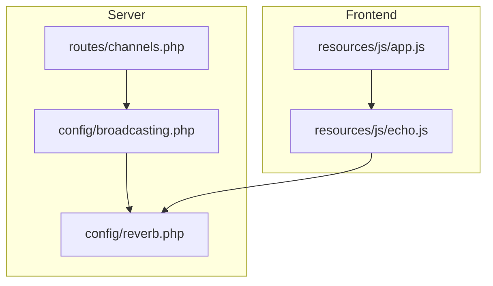
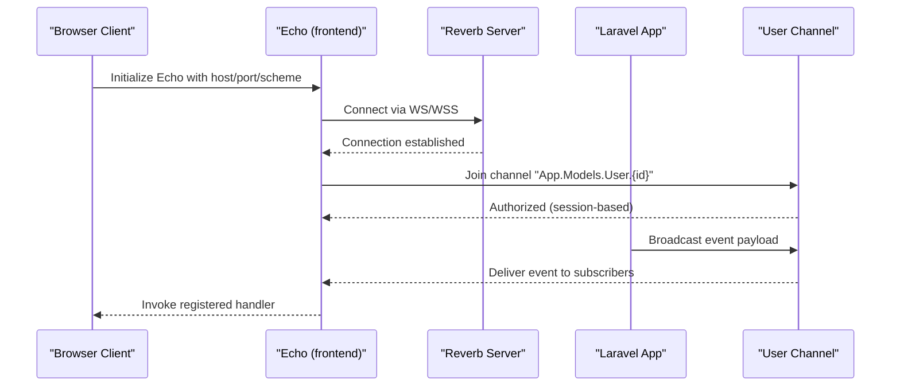
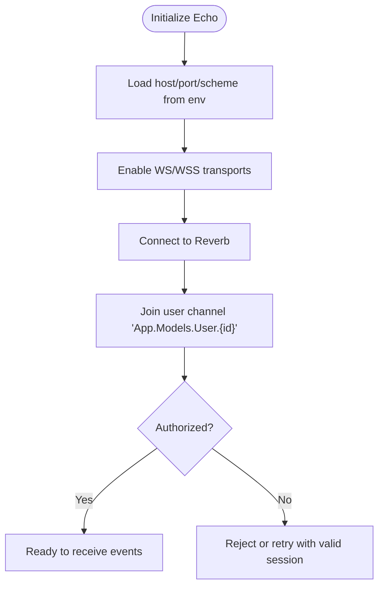
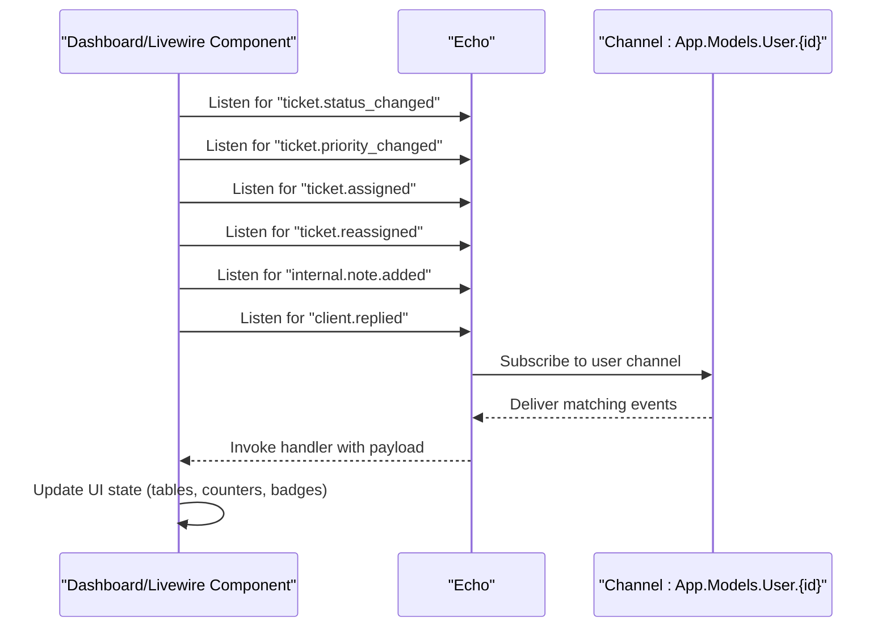
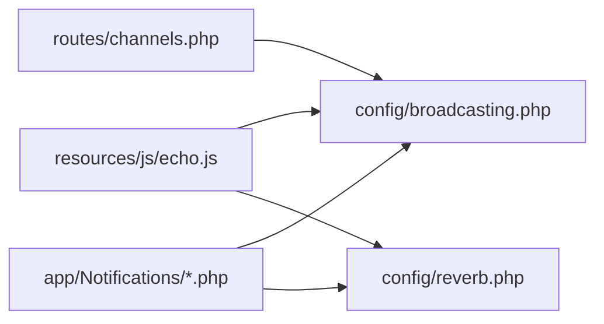

# WebSocket Interface

<cite>
**Referenced Files in This Document**
- [broadcasting.php](file://config/broadcasting.php)
- [reverb.php](file://config/reverb.php)
- [channels.php](file://routes/channels.php)
- [echo.js](file://resources/js/echo.js)
- [app.js](file://resources/js/app.js)
- [TicketStatusChanged.php](file://app/Notifications/TicketStatusChanged.php)
- [TicketPriorityChanged.php](file://app/Notifications/TicketPriorityChanged.php)
- [TicketAssigned.php](file://app/Notifications/TicketAssigned.php)
- [TicketReassigned.php](file://app/Notifications/TicketReassigned.php)
- [InternalNoteAdded.php](file://app/Notifications/InternalNoteAdded.php)
- [ClientReplied.php](file://app/Notifications/ClientReplied.php)
</cite>

## Table of Contents
1. [Introduction](#introduction)
2. [Project Structure](#project-structure)
3. [Core Components](#core-components)
4. [Architecture Overview](#architecture-overview)
5. [Detailed Component Analysis](#detailed-component-analysis)
6. [Dependency Analysis](#dependency-analysis)
7. [Performance Considerations](#performance-considerations)
8. [Troubleshooting Guide](#troubleshooting-guide)
9. [Conclusion](#conclusion)

## Introduction
This document describes the WebSocket interface used by the Helpdesk System for real-time communication. It covers connection establishment, authentication via token-based sessions, event subscription patterns, and the message formats used for live updates across the application. It also documents event types (ticket updates, reply notifications, system alerts, and user presence indicators), client-side handling, connection lifecycle management, reconnection strategies, error handling, event filtering, channel subscriptions, and real-time dashboard synchronization.

## Project Structure
The WebSocket stack is configured and wired through Laravel’s broadcasting layer and the Reverb server. Frontend clients subscribe to channels and listen for broadcast events using Laravel Echo.

**Diagram sources**
- [broadcasting.php:1-83](file://config/broadcasting.php#L1-L83)
- [reverb.php:1-97](file://config/reverb.php#L1-L97)
- [channels.php:1-8](file://routes/channels.php#L1-L8)
- [echo.js:1-14](file://resources/js/echo.js#L1-L14)
- [app.js:304-310](file://resources/js/app.js#L304-L310)

**Section sources**
- [broadcasting.php:1-83](file://config/broadcasting.php#L1-L83)
- [reverb.php:1-97](file://config/reverb.php#L1-L97)
- [channels.php:1-8](file://routes/channels.php#L1-L8)
- [echo.js:1-14](file://resources/js/echo.js#L1-L14)
- [app.js:304-310](file://resources/js/app.js#L304-L310)

## Core Components
- Broadcasting configuration: Defines the default broadcaster and connection options for Reverb/Pusher/Ably/Redis/log/null.
- Reverb server configuration: Controls the Reverb server runtime, scaling, TLS, and application credentials.
- Channel authorization: Secures per-user channels so only authorized users can subscribe.
- Frontend Echo client: Initializes the WebSocket client with host/port/scheme and enables WS/WSS transports.
- Event notifications: Laravel notifications that are broadcast to subscribed clients alongside database storage.

Key responsibilities:
- Connection establishment and transport selection (WS/WSS).
- Token-based authentication via session-based authorization on channels.
- Event publishing to channels and dispatching to clients.
- Client-side subscription and event handling.

**Section sources**
- [broadcasting.php:18](file://config/broadcasting.php#L18)
- [broadcasting.php:31-83](file://config/broadcasting.php#L31-L83)
- [reverb.php:16](file://config/reverb.php#L16)
- [reverb.php:29-57](file://config/reverb.php#L29-L57)
- [channels.php:5-7](file://routes/channels.php#L5-L7)
- [echo.js:6-14](file://resources/js/echo.js#L6-L14)

## Architecture Overview
The system uses Laravel Echo on the frontend and a Reverb server on the backend. Clients connect to the Reverb server using WS/WSS, subscribe to user-specific channels, and receive broadcast events published by the application.

**Diagram sources**
- [echo.js:6-14](file://resources/js/echo.js#L6-L14)
- [channels.php:5-7](file://routes/channels.php#L5-L7)
- [broadcasting.php:31-83](file://config/broadcasting.php#L31-L83)
- [reverb.php:29-57](file://config/reverb.php#L29-L57)

## Detailed Component Analysis

### Connection Establishment and Authentication
- The frontend initializes Echo with environment-driven host, port, scheme, and enabled transports.
- Channels are authorized using a route model binding pattern that compares the authenticated user ID with the channel parameter.
- Authentication relies on the current session-based identity; Echo uses the browser session to authorize channel access.

**Diagram sources**
- [echo.js:6-14](file://resources/js/echo.js#L6-L14)
- [channels.php:5-7](file://routes/channels.php#L5-L7)

**Section sources**
- [echo.js:6-14](file://resources/js/echo.js#L6-L14)
- [channels.php:5-7](file://routes/channels.php#L5-L7)

### Event Subscription Patterns
- Per-user channels: Subscribed to via Echo after successful connection and authorization.
- Event handlers: Registered on the frontend to process incoming broadcast events.
- Real-time dashboard synchronization: Components update in response to received events.

**Diagram sources**
- [echo.js:6-14](file://resources/js/echo.js#L6-L14)
- [channels.php:5-7](file://routes/channels.php#L5-L7)

**Section sources**
- [echo.js:6-14](file://resources/js/echo.js#L6-L14)
- [channels.php:5-7](file://routes/channels.php#L5-L7)

### Event Types and Payloads
Events are defined as Laravel notifications that are broadcast to subscribed clients. Each notification includes a compact payload with identifying fields and a type discriminator.

- Ticket status change
  - Type: status_changed
  - Fields: ticket_id, ticket_number, subject, type, message
  - Source: [TicketStatusChanged.php:44-53](file://app/Notifications/TicketStatusChanged.php#L44-L53)

- Ticket priority change
  - Type: priority_changed
  - Fields: ticket_id, ticket_number, subject, type, message
  - Source: [TicketPriorityChanged.php:44-53](file://app/Notifications/TicketPriorityChanged.php#L44-L53)

- Ticket assignment
  - Type: assigned
  - Fields: ticket_id, ticket_number, subject, type, message
  - Source: [TicketAssigned.php:38-47](file://app/Notifications/TicketAssigned.php#L38-L47)

- Ticket reassignment
  - Type: reassigned
  - Fields: ticket_id, ticket_number, subject, type, message
  - Source: [TicketReassigned.php:38-47](file://app/Notifications/TicketReassigned.php#L38-L47)

- Internal note added
  - Type: internal_note
  - Fields: ticket_id, ticket_number, subject, type, message
  - Source: [InternalNoteAdded.php:38-47](file://app/Notifications/InternalNoteAdded.php#L38-L47)

- Client reply
  - Type: client_replied
  - Fields: ticket_id, ticket_number, subject, type, message
  - Source: [ClientReplied.php:38-47](file://app/Notifications/ClientReplied.php#L38-L47)

Message format summary:
- All payloads include ticket metadata (id, number, subject) and a concise message.
- The type field allows the client to route and render events appropriately.

**Section sources**
- [TicketStatusChanged.php:44-53](file://app/Notifications/TicketStatusChanged.php#L44-L53)
- [TicketPriorityChanged.php:44-53](file://app/Notifications/TicketPriorityChanged.php#L44-L53)
- [TicketAssigned.php:38-47](file://app/Notifications/TicketAssigned.php#L38-L47)
- [TicketReassigned.php:38-47](file://app/Notifications/TicketReassigned.php#L38-L47)
- [InternalNoteAdded.php:38-47](file://app/Notifications/InternalNoteAdded.php#L38-L47)
- [ClientReplied.php:38-47](file://app/Notifications/ClientReplied.php#L38-L47)

### Client-Side Event Handling
- Echo initialization sets up the broadcaster and transport options.
- The application imports Echo to enable global access for components.
- Handlers should be registered for each event type to update UI state (e.g., dashboards, tables, notification indicators).

Implementation pointers:
- Echo client setup: [echo.js:6-14](file://resources/js/echo.js#L6-L14)
- Application import of Echo: [app.js:304-310](file://resources/js/app.js#L304-L310)

**Section sources**
- [echo.js:6-14](file://resources/js/echo.js#L6-L14)
- [app.js:304-310](file://resources/js/app.js#L304-L310)

### Connection Lifecycle Management
- Transport selection: WS for HTTP, WSS for HTTPS based on scheme.
- TLS enforcement: Controlled by scheme; WSS is forced when scheme is HTTPS.
- Connection persistence: Reverb maintains persistent connections; clients should handle disconnections and reconnect automatically.

Operational notes:
- Host, port, and scheme are loaded from environment variables.
- Enabled transports are ws and wss.

**Section sources**
- [echo.js:8-13](file://resources/js/echo.js#L8-L13)
- [reverb.php:32-54](file://config/reverb.php#L32-L54)

### Reconnection Strategies
- Automatic reconnection: Echo attempts to reconnect on disconnect when transports are available.
- Backoff and retry: Configure Echo options to control retry behavior and backoff timing.
- Graceful degradation: If TLS is enforced but not available, fallback to WS or adjust scheme accordingly.

[No sources needed since this section provides general guidance]

### Error Handling
- Authorization failures: If the user is not authorized to join a channel, Echo will not receive events; ensure the session is valid.
- Transport errors: Echo emits connection errors; log and surface to users if needed.
- Payload parsing: Validate payload shape before rendering; guard against missing fields.

[No sources needed since this section provides general guidance]

### Event Filtering and Channel Subscriptions
- Per-user channel: Subscribing to App.Models.User.{id} ensures only the authenticated user receives events.
- Event routing: Use the type field to filter and route events to appropriate UI components.
- Dashboard synchronization: Components can listen for multiple event types and update tables, counters, and badges.

**Section sources**
- [channels.php:5-7](file://routes/channels.php#L5-L7)

### Real-Time Dashboard Synchronization
- Livewire components can react to incoming events to refresh lists, counts, and highlights.
- Charts and analytics panels can listen for reports-charts-refresh events to re-render visualizations.
- Presence indicators: User avatars include online indicators rendered in templates.

**Section sources**
- [app.js:10-19](file://resources/js/app.js#L10-L19)

## Dependency Analysis
The WebSocket interface depends on the following configuration and runtime components:

**Diagram sources**
- [echo.js:6-14](file://resources/js/echo.js#L6-L14)
- [broadcasting.php:31-83](file://config/broadcasting.php#L31-L83)
- [reverb.php:29-57](file://config/reverb.php#L29-L57)
- [channels.php:5-7](file://routes/channels.php#L5-L7)

**Section sources**
- [broadcasting.php:18](file://config/broadcasting.php#L18)
- [broadcasting.php:31-83](file://config/broadcasting.php#L31-L83)
- [reverb.php:16](file://config/reverb.php#L16)
- [reverb.php:29-57](file://config/reverb.php#L29-L57)
- [channels.php:5-7](file://routes/channels.php#L5-L7)

## Performance Considerations
- Keep payloads minimal: Notifications include only essential fields to reduce bandwidth.
- Batch UI updates: Debounce frequent updates in dashboards to avoid excessive re-renders.
- Optimize transport: Prefer WSS in production for security; ensure certificates are valid to avoid handshake delays.
- Monitor Reverb scaling: Enable Redis-backed scaling for multi-instance deployments.

[No sources needed since this section provides general guidance]

## Troubleshooting Guide
- Connection fails:
  - Verify REVERB_HOST, REVERB_PORT, and REVERB_SCHEME environment variables.
  - Confirm TLS settings match deployment (forceTLS when scheme is https).
- Unauthorized channel:
  - Ensure the user is authenticated and the channel ID matches the logged-in user ID.
- No events received:
  - Confirm Echo is initialized and subscribed to the correct user channel.
  - Check that notifications are broadcasting (via database and broadcast channels).
- Reverb server issues:
  - Review Reverb server logs and scaling configuration.
  - Validate allowed origins and ping/activity timeouts.

**Section sources**
- [echo.js:8-13](file://resources/js/echo.js#L8-L13)
- [channels.php:5-7](file://routes/channels.php#L5-L7)
- [broadcasting.php:31-83](file://config/broadcasting.php#L31-L83)
- [reverb.php:70-94](file://config/reverb.php#L70-L94)

## Conclusion
The Helpdesk System’s WebSocket interface leverages Laravel Echo and Reverb to deliver real-time updates securely and efficiently. Events are broadcast to per-user channels, enabling precise targeting and reducing overhead. The documented patterns for connection, authentication, subscription, and payload handling provide a clear blueprint for extending real-time capabilities across dashboards, notifications, and collaborative features.