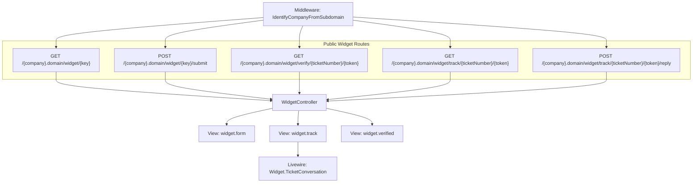
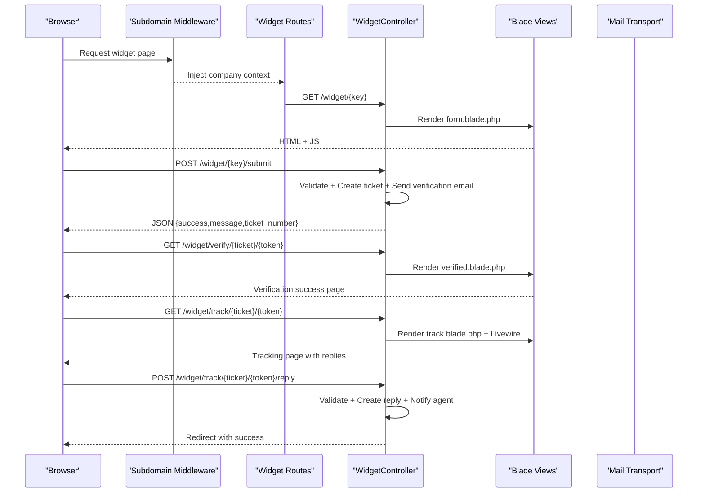
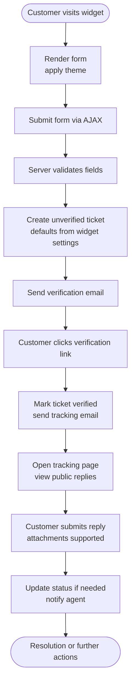
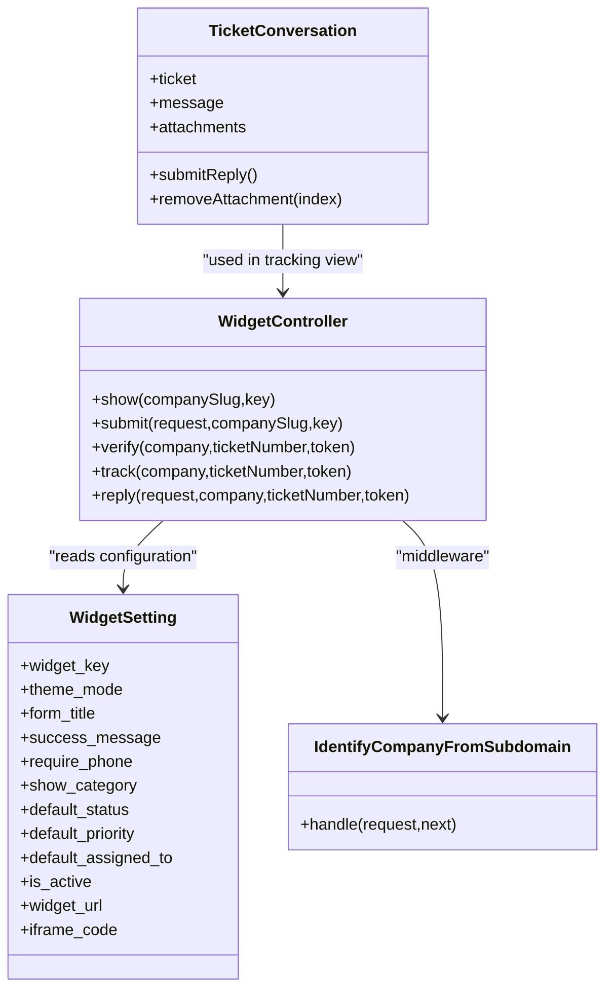

# Widget API

<cite>
**Referenced Files in This Document**
- [WidgetController.php](file://app/Http/Controllers/WidgetController.php)
- [web.php](file://routes/web.php)
- [settings.php](file://routes/settings.php)
- [WidgetSetting.php](file://app/Models/WidgetSetting.php)
- [IdentifyCompanyFromSubdomain.php](file://app/Http/Middleware/IdentifyCompanyFromSubdomain.php)
- [TicketConversation.php](file://app/Livewire/Widget/TicketConversation.php)
- [form.blade.php](file://resources/views/widget/form.blade.php)
- [track.blade.php](file://resources/views/widget/track.blade.php)
- [verified.blade.php](file://resources/views/widget/verified.blade.php)
- [2026_02_06_154114_create_widget_settings_table.php](file://database/migrations/2026_02_06_154114_create_widget_settings_table.php)
- [2026_03_07_173715_rename_primary_color_to_theme_mode_in_widget_settings.php](file://database/migrations/2026_03_07_173715_rename_primary_color_to_theme_mode_in_widget_settings.php)
- [FormWidget.php](file://app/Livewire/Settings/FormWidget.php)
- [security-issues.md](file://security-issues.md)
</cite>

## Table of Contents
1. [Introduction](#introduction)
2. [Project Structure](#project-structure)
3. [Core Components](#core-components)
4. [Architecture Overview](#architecture-overview)
5. [Detailed Component Analysis](#detailed-component-analysis)
6. [Dependency Analysis](#dependency-analysis)
7. [Performance Considerations](#performance-considerations)
8. [Troubleshooting Guide](#troubleshooting-guide)
9. [Conclusion](#conclusion)
10. [Appendices](#appendices)

## Introduction
This document provides comprehensive Widget API documentation for external website integration. It covers:
- Embedded form submission endpoints and verification workflow APIs
- Customer tracking interfaces and public reply endpoints
- Widget configuration parameters, theme customization, and brand integration
- Complete customer journey from form submission to ticket resolution
- Widget authentication and security considerations
- Integration examples and embed code generation
- JavaScript API methods and callback handling patterns

## Project Structure
The Widget API is exposed under company subdomains and consists of:
- Public routes for widget rendering, submission, verification, tracking, and replies
- Blade templates for the form, tracking, and verification views
- A controller orchestrating business logic
- A Livewire component for the customer conversation thread
- A model and migration defining widget settings and configuration

**Diagram sources**
- [settings.php:12-19](file://routes/settings.php#L12-L19)
- [web.php:71-114](file://routes/web.php#L71-L114)
- [WidgetController.php:24-196](file://app/Http/Controllers/WidgetController.php#L24-L196)
- [IdentifyCompanyFromSubdomain.php:10-36](file://app/Http/Middleware/IdentifyCompanyFromSubdomain.php#L10-L36)
- [form.blade.php:1-250](file://resources/views/widget/form.blade.php#L1-L250)
- [track.blade.php:1-90](file://resources/views/widget/track.blade.php#L1-L90)
- [verified.blade.php:1-85](file://resources/views/widget/verified.blade.php#L1-L85)
- [TicketConversation.php:12-99](file://app/Livewire/Widget/TicketConversation.php#L12-L99)

**Section sources**
- [settings.php:12-19](file://routes/settings.php#L12-L19)
- [web.php:71-114](file://routes/web.php#L71-L114)
- [IdentifyCompanyFromSubdomain.php:10-36](file://app/Http/Middleware/IdentifyCompanyFromSubdomain.php#L10-L36)

## Core Components
- WidgetController: Handles widget rendering, form submission, email verification, tracking, and customer replies.
- WidgetSetting: Stores per-company widget configuration, including theme mode, form messages, field visibility, defaults, and embed metadata.
- Widget routes: Public endpoints under company subdomains.
- Middleware: Subdomain identification to bind company context.
- Views: Blade templates for the form, tracking, and verification pages.
- Livewire component: Manages the customer-side conversation and attachments.

**Section sources**
- [WidgetController.php:19-196](file://app/Http/Controllers/WidgetController.php#L19-L196)
- [WidgetSetting.php:9-71](file://app/Models/WidgetSetting.php#L9-L71)
- [settings.php:12-19](file://routes/settings.php#L12-L19)
- [IdentifyCompanyFromSubdomain.php:10-36](file://app/Http/Middleware/IdentifyCompanyFromSubdomain.php#L10-L36)
- [form.blade.php:1-250](file://resources/views/widget/form.blade.php#L1-L250)
- [track.blade.php:1-90](file://resources/views/widget/track.blade.php#L1-L90)
- [verified.blade.php:1-85](file://resources/views/widget/verified.blade.php#L1-L85)
- [TicketConversation.php:12-99](file://app/Livewire/Widget/TicketConversation.php#L12-L99)

## Architecture Overview
The Widget API follows a subdomain-per-company pattern. Requests are intercepted by middleware to resolve the company, then routed to the controller. The controller interacts with models and notifications, and renders Blade views. The customer’s browser performs asynchronous submissions via JavaScript.

**Diagram sources**
- [settings.php:12-19](file://routes/settings.php#L12-L19)
- [WidgetController.php:24-196](file://app/Http/Controllers/WidgetController.php#L24-L196)
- [form.blade.php:186-248](file://resources/views/widget/form.blade.php#L186-L248)
- [verified.blade.php:1-85](file://resources/views/widget/verified.blade.php#L1-L85)
- [track.blade.php:1-90](file://resources/views/widget/track.blade.php#L1-L90)
- [TicketConversation.php:30-82](file://app/Livewire/Widget/TicketConversation.php#L30-L82)

## Detailed Component Analysis

### Widget Endpoints and Workflows
- Widget form rendering
  - Endpoint: GET /{company}.domain/widget/{key}
  - Behavior: Validates widget key, company, and activation; renders the form with theme and copy.
  - Notes: Uses CSRF meta tag and Tailwind CDN; includes inline dark mode class based on theme.

- Form submission
  - Endpoint: POST /{company}.domain/widget/{key}/submit
  - Behavior: Validates fields, creates an unverified ticket with defaults from widget settings, sends verification email, notifies admins, and returns JSON success with message and ticket number.

- Email verification
  - Endpoint: GET /{company}.domain/widget/verify/{ticketNumber}/{token}
  - Behavior: Verifies token, marks ticket as verified, generates a tracking token, sends tracking email, and renders verification success.

- Ticket tracking
  - Endpoint: GET /{company}.domain/widget/track/{ticketNumber}/{token}
  - Behavior: Requires verified=true and matching token; loads public replies and renders tracking page with Livewire conversation component.

- Public reply submission
  - Endpoint: POST /{company}.domain/widget/track/{ticketNumber}/{token}/reply
  - Behavior: Validates message, creates customer reply, resets internal state, updates status if needed, and notifies the assigned agent.

**Section sources**
- [WidgetController.php:24-196](file://app/Http/Controllers/WidgetController.php#L24-L196)
- [settings.php:12-19](file://routes/settings.php#L12-L19)
- [form.blade.php:186-248](file://resources/views/widget/form.blade.php#L186-L248)
- [track.blade.php:1-90](file://resources/views/widget/track.blade.php#L1-L90)
- [verified.blade.php:1-85](file://resources/views/widget/verified.blade.php#L1-L85)
- [TicketConversation.php:30-82](file://app/Livewire/Widget/TicketConversation.php#L30-L82)

### Widget Configuration Parameters
Widget settings are stored per company and include:
- Appearance
  - Theme mode: light/dark
  - Form title, welcome message, success message
- Form fields
  - Require phone number
  - Show category selector
- Defaults
  - Default assigned user
  - Default status (pending/open)
  - Default priority (low/medium/high/urgent)
- Activation and keys
  - Active flag
  - Unique widget key
  - Generated iframe embed code

These settings are managed via a Livewire component and persisted in the widget_settings table.

**Section sources**
- [WidgetSetting.php:9-71](file://app/Models/WidgetSetting.php#L9-L71)
- [2026_02_06_154114_create_widget_settings_table.php:11-38](file://database/migrations/2026_02_06_154114_create_widget_settings_table.php#L11-L38)
- [2026_03_07_173715_rename_primary_color_to_theme_mode_in_widget_settings.php:9-27](file://database/migrations/2026_03_07_173715_rename_primary_color_to_theme_mode_in_widget_settings.php#L9-L27)
- [FormWidget.php:10-55](file://app/Livewire/Settings/FormWidget.php#L10-L55)

### Theme Customization and Brand Integration
- Theme mode: controlled by a single setting; the form template applies a dark class when enabled.
- Branding: footer displays the company name; success message and form title are configurable.
- Embedding: iframe embed code is generated and can be copied directly.

**Section sources**
- [form.blade.php:1-250](file://resources/views/widget/form.blade.php#L1-L250)
- [WidgetSetting.php:47-71](file://app/Models/WidgetSetting.php#L47-L71)
- [FormWidget.php:10-55](file://app/Livewire/Settings/FormWidget.php#L10-L55)

### Customer Journey: From Submission to Resolution

**Diagram sources**
- [WidgetController.php:41-196](file://app/Http/Controllers/WidgetController.php#L41-L196)
- [TicketConversation.php:30-82](file://app/Livewire/Widget/TicketConversation.php#L30-L82)
- [form.blade.php:186-248](file://resources/views/widget/form.blade.php#L186-L248)
- [track.blade.php:1-90](file://resources/views/widget/track.blade.php#L1-L90)
- [verified.blade.php:1-85](file://resources/views/widget/verified.blade.php#L1-L85)

### JavaScript API Methods and Callback Handling
The widget form uses a simple fetch-based submission flow:
- On submit, it serializes form data, sets JSON headers, includes CSRF token, and posts to the submission endpoint.
- On success, it hides the form, shows a success message with the ticket number, and scrolls to top.
- On error, it displays an error alert and restores the submit button.

Callback patterns:
- Success: update UI with ticket number and message
- Error: surface user-friendly error message
- Optional: integrate with external analytics or conversion tracking after success

**Section sources**
- [form.blade.php:186-248](file://resources/views/widget/form.blade.php#L186-L248)

### Widget Authentication and Security
- Subdomain binding: middleware resolves company by subdomain and attaches it to the request.
- Widget key validation: all widget endpoints require a valid, active widget key bound to the company.
- CSRF protection: frontend includes a CSRF meta tag; submission requests include X-CSRF-TOKEN.
- Token reuse: the verification token is cleared post-verification and reused for tracking; this is flagged as a potential vulnerability and should be addressed by using a separate tracking token column.

Recommended mitigations:
- Add a dedicated tracking_token column and clear verification_token after verification.
- Enforce HTTPS for all redirects and links.
- Implement rate limiting for submission endpoints.

**Section sources**
- [IdentifyCompanyFromSubdomain.php:10-36](file://app/Http/Middleware/IdentifyCompanyFromSubdomain.php#L10-L36)
- [WidgetController.php:24-196](file://app/Http/Controllers/WidgetController.php#L24-L196)
- [security-issues.md:132-151](file://security-issues.md#L132-L151)

### Integration Examples
- iFrame embedding: Use the generated iframe embed code from the settings page.
- Custom websites: Place the iframe in your page HTML; customize widget settings (title, messages, theme) in the settings panel.
- CMS platforms: Insert the iframe into page builder blocks or custom HTML fields. For WordPress or similar, use an “insert HTML” block or a plugin that allows raw HTML injection.

Notes:
- The embed code is generated server-side and includes the widget URL derived from the company slug and configured domain.
- The widget respects theme mode and displays the configured success message after submission.

**Section sources**
- [WidgetSetting.php:55-71](file://app/Models/WidgetSetting.php#L55-L71)
- [FormWidget.php:10-55](file://app/Livewire/Settings/FormWidget.php#L10-L55)
- [settings.php:12-19](file://routes/settings.php#L12-L19)

## Dependency Analysis

**Diagram sources**
- [WidgetController.php:19-196](file://app/Http/Controllers/WidgetController.php#L19-L196)
- [WidgetSetting.php:9-71](file://app/Models/WidgetSetting.php#L9-L71)
- [IdentifyCompanyFromSubdomain.php:10-36](file://app/Http/Middleware/IdentifyCompanyFromSubdomain.php#L10-L36)
- [TicketConversation.php:12-99](file://app/Livewire/Widget/TicketConversation.php#L12-L99)

**Section sources**
- [WidgetController.php:19-196](file://app/Http/Controllers/WidgetController.php#L19-L196)
- [WidgetSetting.php:9-71](file://app/Models/WidgetSetting.php#L9-L71)
- [IdentifyCompanyFromSubdomain.php:10-36](file://app/Http/Middleware/IdentifyCompanyFromSubdomain.php#L10-L36)
- [TicketConversation.php:12-99](file://app/Livewire/Widget/TicketConversation.php#L12-L99)

## Performance Considerations
- Minimize DOM operations during submission; the form disables the submit button and updates innerHTML to reflect loading state.
- Use lightweight validation on the client side to reduce unnecessary network requests.
- Attachments are validated server-side with limits; keep uploads small to improve throughput.
- Consider caching frequently accessed widget settings per company slug if traffic increases.

## Troubleshooting Guide
Common issues and resolutions:
- Widget not rendering
  - Ensure the widget key is valid and active for the company subdomain.
  - Confirm the subdomain resolves to the company slug and middleware attaches the company context.
- Submission fails
  - Verify CSRF meta tag is present and X-CSRF-TOKEN is included in the request headers.
  - Check required fields match widget settings (phone requirement, category visibility).
- Verification link invalid
  - Tokens are single-use; ensure the customer clicked the latest link.
  - Review token reuse concerns and consider migrating to a separate tracking token column.
- Tracking page shows no replies
  - Confirm the ticket is verified and the token matches.
  - Ensure replies are marked as public (not internal) and ordered chronologically.

**Section sources**
- [WidgetController.php:24-196](file://app/Http/Controllers/WidgetController.php#L24-L196)
- [security-issues.md:132-151](file://security-issues.md#L132-L151)

## Conclusion
The Widget API provides a secure, configurable, and embeddable support intake solution. By leveraging subdomain scoping, robust validation, and clear customer workflows—from submission to tracking—organizations can integrate a professional helpdesk experience into any website. Applying the recommended security improvements and rate-limiting strategies will further strengthen the system against abuse.

## Appendices

### API Reference Summary
- GET /{company}.domain/widget/{key}
  - Purpose: Render the widget form
  - Auth: Widget key and active status
- POST /{company}.domain/widget/{key}/submit
  - Purpose: Submit ticket
  - Auth: Widget key and active status
  - Body: customer_name, customer_email, customer_phone?, subject, description, category_id?
  - Response: {success, message, ticket_number}
- GET /{company}.domain/widget/verify/{ticketNumber}/{token}
  - Purpose: Verify ticket via email link
  - Auth: Matching verification token
- GET /{company}.domain/widget/track/{ticketNumber}/{token}
  - Purpose: View public replies and status
  - Auth: Verified=true and matching token
- POST /{company}.domain/widget/track/{ticketNumber}/{token}/reply
  - Purpose: Submit a public reply
  - Auth: Verified=true and matching token
  - Body: message, attachments (optional)

**Section sources**
- [settings.php:12-19](file://routes/settings.php#L12-L19)
- [WidgetController.php:24-196](file://app/Http/Controllers/WidgetController.php#L24-L196)

### Widget Configuration Options
- Appearance
  - theme_mode: light/dark
  - form_title, welcome_message, success_message
- Form fields
  - require_phone: true/false
  - show_category: true/false
- Defaults
  - default_status: pending/open
  - default_priority: low/medium/high/urgent
  - default_assigned_to: user id (nullable)
- Activation and keys
  - is_active: true/false
  - widget_key: unique string
  - widget_url: computed from company slug and domain
  - iframe_code: HTML iframe snippet

**Section sources**
- [WidgetSetting.php:47-71](file://app/Models/WidgetSetting.php#L47-L71)
- [2026_02_06_154114_create_widget_settings_table.php:11-38](file://database/migrations/2026_02_06_154114_create_widget_settings_table.php#L11-L38)
- [2026_03_07_173715_rename_primary_color_to_theme_mode_in_widget_settings.php:9-27](file://database/migrations/2026_03_07_173715_rename_primary_color_to_theme_mode_in_widget_settings.php#L9-L27)
- [FormWidget.php:10-55](file://app/Livewire/Settings/FormWidget.php#L10-L55)