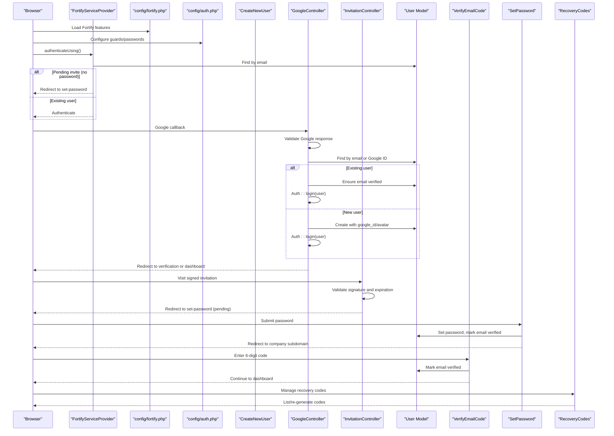
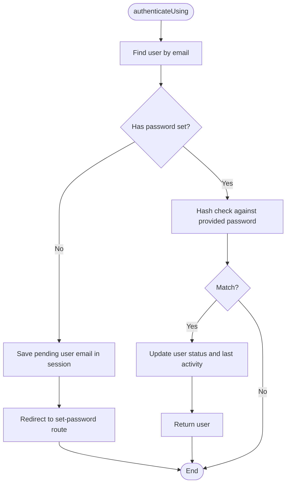
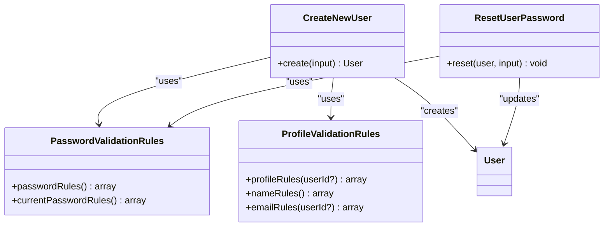
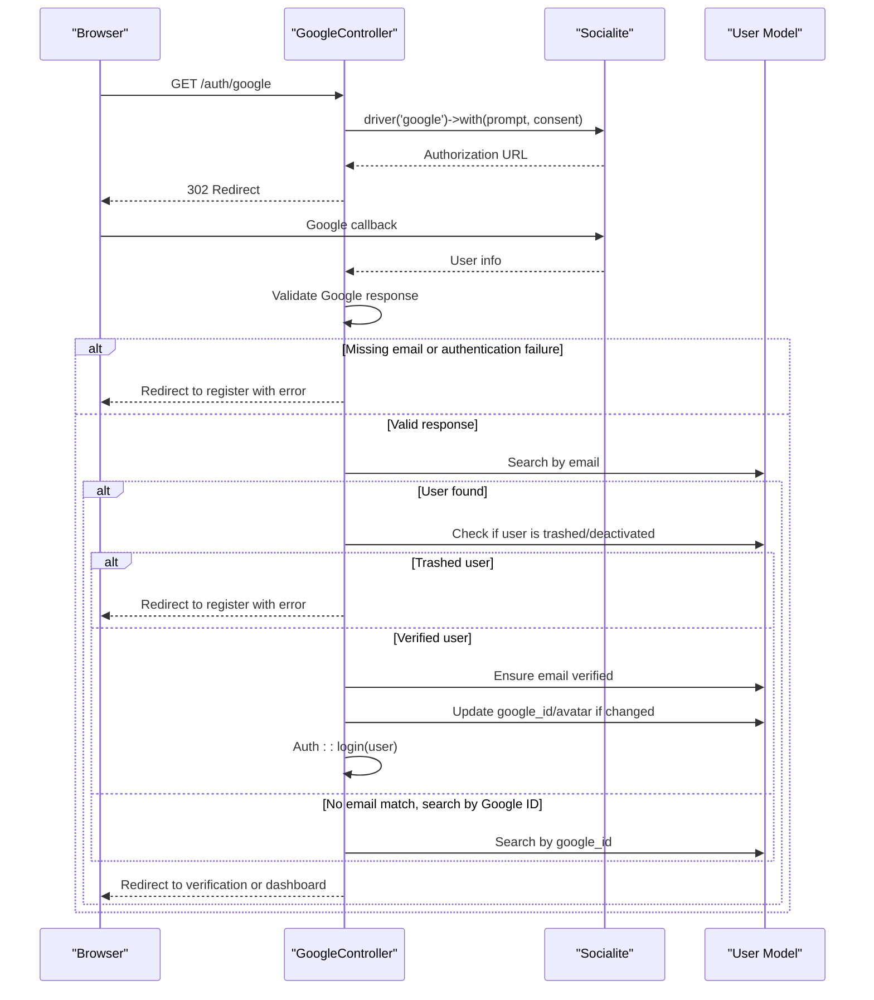
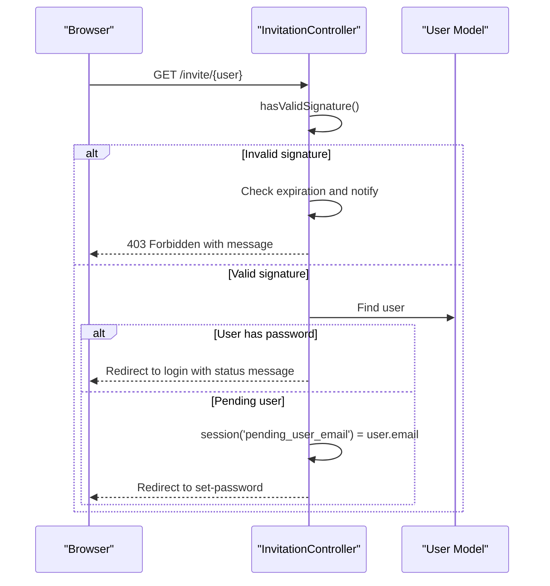
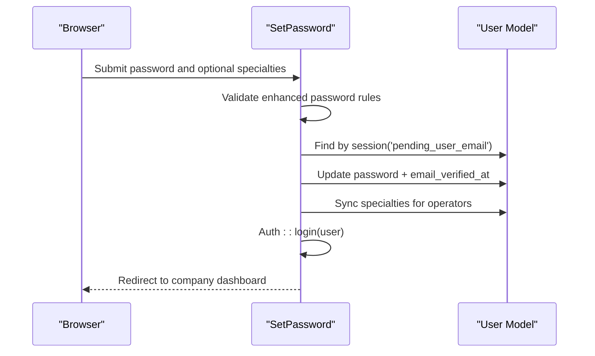
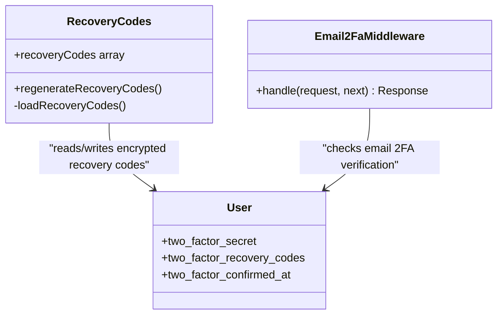
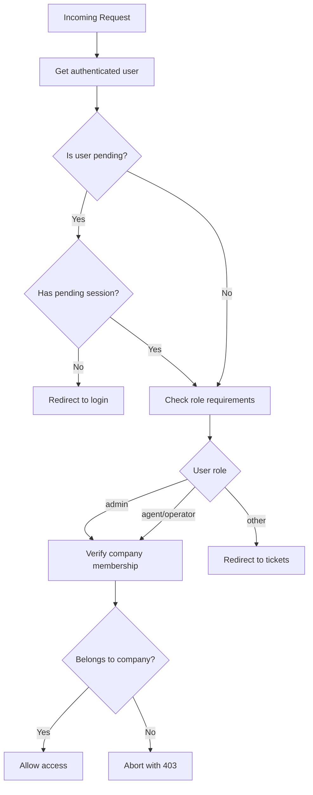
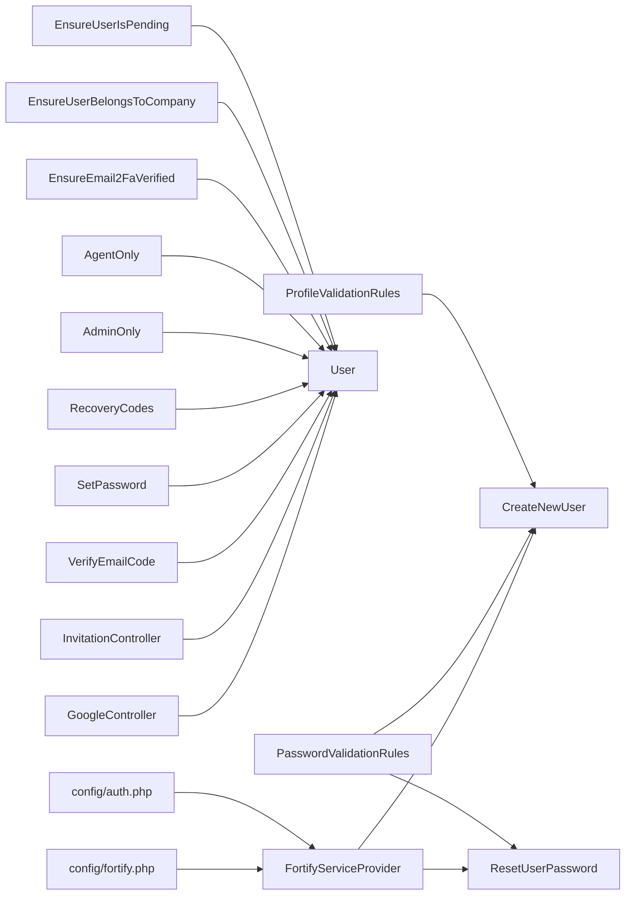

# Authentication & Authorization

<cite>
**Referenced Files in This Document**
- [FortifyServiceProvider.php](file://app/Providers/FortifyServiceProvider.php)
- [fortify.php](file://config/fortify.php)
- [auth.php](file://config/auth.php)
- [CreateNewUser.php](file://app/Actions/Fortify/CreateNewUser.php)
- [ResetUserPassword.php](file://app/Actions/Fortify/ResetUserPassword.php)
- [GoogleController.php](file://app/Http/Controllers/GoogleController.php)
- [InvitationController.php](file://app/Http/Controllers/Auth/InvitationController.php)
- [User.php](file://app/Models/User.php)
- [AdminOnly.php](file://app/Http/Middleware/AdminOnly.php)
- [AgentOnly.php](file://app/Http/Middleware/AgentOnly.php)
- [EnsureEmail2FaVerified.php](file://app/Http/Middleware/EnsureEmail2FaVerified.php)
- [EnsureUserBelongsToCompany.php](file://app/Http/Middleware/EnsureUserBelongsToCompany.php)
- [EnsureUserIsPending.php](file://app/Http/Middleware/EnsureUserIsPending.php)
- [PasswordValidationRules.php](file://app/Concerns/PasswordValidationRules.php)
- [ProfileValidationRules.php](file://app/Concerns/ProfileValidationRules.php)
- [SetPassword.php](file://app/Livewire/Auth/SetPassword.php)
- [VerifyEmailCode.php](file://app/Livewire/Auth/VerifyEmailCode.php)
- [RecoveryCodes.php](file://app/Livewire/Settings/TwoFactor/RecoveryCodes.php)
- [VerificationCode.php](file://app/Mail/VerificationCode.php)
- [UserInvitationMail.php](file://app/Mail/UserInvitationMail.php)
- [2025_08_14_170933_add_two_factor_columns_to_users_table.php](file://database/migrations/2025_08_14_170933_add_two_factor_columns_to_users_table.php)
- [2026_03_20_150434_add_email_2fa_to_users_table.php](file://database/migrations/2026_03_20_150434_add_email_2fa_to_users_table.php)
</cite>

## Update Summary
**Changes Made**
- Enhanced Google OAuth integration with improved error handling and user matching logic
- Added comprehensive email 2FA verification middleware infrastructure
- Strengthened authentication flows with better pending user handling
- Improved password security measures with enhanced validation rules
- Expanded two-factor authentication options with recovery code management
- Enhanced role-based access control with company membership verification

## Table of Contents
1. [Introduction](#introduction)
2. [Project Structure](#project-structure)
3. [Core Components](#core-components)
4. [Architecture Overview](#architecture-overview)
5. [Detailed Component Analysis](#detailed-component-analysis)
6. [Dependency Analysis](#dependency-analysis)
7. [Performance Considerations](#performance-considerations)
8. [Troubleshooting Guide](#troubleshooting-guide)
9. [Conclusion](#conclusion)

## Introduction
This document explains the multi-layered authentication and authorization system in the Helpdesk System. It covers:
- Email/password login and registration with enhanced security measures
- Google OAuth integration with improved error handling and user matching
- Email verification workflow with 2FA verification middleware
- Invitation system for adding new users to companies with role assignments
- Comprehensive two-factor authentication implementation with recovery code management
- Role-based access control (Admin, Agent, Operator) with company membership verification
- Fortify configuration, custom validation rules, and security middleware
- End-to-end examples for user registration, password reset, and account verification

## Project Structure
Authentication and authorization logic is primarily implemented through:
- Fortify configuration and service provider with enhanced authentication flows
- Custom actions for registration and password reset with improved validation
- Controllers for Google OAuth with robust error handling and user matching
- Controllers for invitations with signature validation and expiration handling
- Livewire components for interactive flows (set password, verify email, 2FA challenge)
- Middleware enforcing role-based access, company membership, and email 2FA verification
- Validation concerns for consistent, enhanced password security rules
- Database migrations supporting two-factor fields and email 2FA capabilities

```mermaid
graph TB
subgraph "Configuration"
FCFG["config/fortify.php"]
ACFG["config/auth.php"]
end
subgraph "Fortify"
FSP["app/Providers/FortifyServiceProvider.php"]
CNU["app/Actions/Fortify/CreateNewUser.php"]
RUP["app/Actions/Fortify/ResetUserPassword.php"]
end
subgraph "Controllers"
GC["app/Http/Controllers/GoogleController.php"]
IC["app/Http/Controllers/Auth/InvitationController.php"]
end
subgraph "Livewire"
SP["app/Livewire/Auth/SetPassword.php"]
VEC["app/Livewire/Auth/VerifyEmailCode.php"]
RC["app/Livewire/Settings/TwoFactor/RecoveryCodes.php"]
end
subgraph "Models & Middleware"
UM["app/Models/User.php"]
ADM["app/Http/Middleware/AdminOnly.php"]
AGN["app/Http/Middleware/AgentOnly.php"]
E2FA["app/Http/Middleware/EnsureEmail2FaVerified.php"]
UBC["app/Http/Middleware/EnsureUserBelongsToCompany.php"]
PENDING["app/Http/Middleware/EnsureUserIsPending.php"]
end
subgraph "Validation"
PWR["app/Concerns/PasswordValidationRules.php"]
PRR["app/Concerns/ProfileValidationRules.php"]
end
subgraph "Mails"
VM["app/Mail/VerificationCode.php"]
UIM["app/Mail/UserInvitationMail.php"]
end
subgraph "DB"
TF["database/migrations/2025_08_14_170933_add_two_factor_columns_to_users_table.php"]
ETFAMIG["database/migrations/2026_03_20_150434_add_email_2fa_to_users_table.php"]
end
FCFG --> FSP
ACFG --> FSP
FSP --> CNU
FSP --> RUP
GC --> UM
IC --> UM
SP --> UM
VEC --> UM
RC --> UM
PWR --> CNU
PWR --> RUP
PRR --> CNU
VM --> VEC
UIM --> IC
TF --> UM
ETFAMIG --> UM
ADM --> UM
AGN --> UM
E2FA --> UM
UBC --> UM
PENDING --> UM
```

**Diagram sources**
- [fortify.php:1-158](file://config/fortify.php#L1-L158)
- [auth.php:1-116](file://config/auth.php#L1-L116)
- [FortifyServiceProvider.php:1-111](file://app/Providers/FortifyServiceProvider.php#L1-L111)
- [CreateNewUser.php:1-62](file://app/Actions/Fortify/CreateNewUser.php#L1-L62)
- [ResetUserPassword.php:1-30](file://app/Actions/Fortify/ResetUserPassword.php#L1-L30)
- [GoogleController.php:1-118](file://app/Http/Controllers/GoogleController.php#L1-L118)
- [InvitationController.php:1-44](file://app/Http/Controllers/Auth/InvitationController.php#L1-L44)
- [User.php:1-211](file://app/Models/User.php#L1-L211)
- [AdminOnly.php:1-25](file://app/Http/Middleware/AdminOnly.php#L1-L25)
- [AgentOnly.php:1-25](file://app/Http/Middleware/AgentOnly.php#L1-L25)
- [EnsureEmail2FaVerified.php:1-21](file://app/Http/Middleware/EnsureEmail2FaVerified.php#L1-L21)
- [EnsureUserBelongsToCompany.php:1-41](file://app/Http/Middleware/EnsureUserBelongsToCompany.php#L1-L41)
- [EnsureUserIsPending.php:1-25](file://app/Http/Middleware/EnsureUserIsPending.php#L1-L25)
- [PasswordValidationRules.php:1-29](file://app/Concerns/PasswordValidationRules.php#L1-L29)
- [ProfileValidationRules.php:1-51](file://app/Concerns/ProfileValidationRules.php#L1-L51)
- [SetPassword.php:1-113](file://app/Livewire/Auth/SetPassword.php#L1-L113)
- [VerifyEmailCode.php:1-119](file://app/Livewire/Auth/VerifyEmailCode.php#L1-L119)
- [RecoveryCodes.php:1-51](file://app/Livewire/Settings/TwoFactor/RecoveryCodes.php#L1-L51)
- [VerificationCode.php:1-38](file://app/Mail/VerificationCode.php#L1-L38)
- [UserInvitationMail.php:1-64](file://app/Mail/UserInvitationMail.php#L1-L64)
- [2025_08_14_170933_add_two_factor_columns_to_users_table.php:1-35](file://database/migrations/2025_08_14_170933_add_two_factor_columns_to_users_table.php#L1-L35)
- [2026_03_20_150434_add_email_2fa_to_users_table.php:1-29](file://database/migrations/2026_03_20_150434_add_email_2fa_to_users_table.php#L1-L29)

**Section sources**
- [FortifyServiceProvider.php:1-111](file://app/Providers/FortifyServiceProvider.php#L1-L111)
- [fortify.php:1-158](file://config/fortify.php#L1-L158)
- [auth.php:1-116](file://config/auth.php#L1-L116)

## Core Components
- Fortify configuration enables registration, password reset, email verification, and two-factor authentication with enhanced rate limits and security measures.
- Fortify service provider customizes authentication logic with improved pending user handling and view bindings.
- Custom actions encapsulate validation and persistence for registration and password reset with stronger security rules.
- Google OAuth controller integrates external identity with robust error handling, user matching by email or Google ID, and enhanced user verification flows.
- Invitation controller validates signed URLs with expiration detection and proper error handling for expired invitations.
- Livewire components implement interactive flows for setting passwords, verifying emails, and managing two-factor authentication with recovery codes.
- Middleware enforces role-based access control, company membership verification, and email 2FA verification with extensible infrastructure.
- Validation concerns provide reusable, consistent, and enhanced rules for passwords and profiles with stronger security requirements.
- Two-factor fields are persisted in the users table via migration with support for email-based 2FA verification.

**Section sources**
- [FortifyServiceProvider.php:38-110](file://app/Providers/FortifyServiceProvider.php#L38-L110)
- [fortify.php:146-155](file://config/fortify.php#L146-L155)
- [CreateNewUser.php:23-60](file://app/Actions/Fortify/CreateNewUser.php#L23-L60)
- [ResetUserPassword.php:19-28](file://app/Actions/Fortify/ResetUserPassword.php#L19-L28)
- [GoogleController.php:24-116](file://app/Http/Controllers/GoogleController.php#L24-L116)
- [InvitationController.php:16-42](file://app/Http/Controllers/Auth/InvitationController.php#L16-L42)
- [SetPassword.php:64-106](file://app/Livewire/Auth/SetPassword.php#L64-L106)
- [VerifyEmailCode.php:26-112](file://app/Livewire/Auth/VerifyEmailCode.php#L26-L112)
- [AdminOnly.php:16-23](file://app/Http/Middleware/AdminOnly.php#L16-L23)
- [AgentOnly.php:16-23](file://app/Http/Middleware/AgentOnly.php#L16-L23)
- [EnsureEmail2FaVerified.php:16-19](file://app/Http/Middleware/EnsureEmail2FaVerified.php#L16-L19)
- [EnsureUserBelongsToCompany.php:11-39](file://app/Http/Middleware/EnsureUserBelongsToCompany.php#L11-L39)
- [EnsureUserIsPending.php:16-23](file://app/Http/Middleware/EnsureUserIsPending.php#L16-L23)
- [PasswordValidationRules.php:14-27](file://app/Concerns/PasswordValidationRules.php#L14-L27)
- [ProfileValidationRules.php:15-49](file://app/Concerns/ProfileValidationRules.php#L15-L49)
- [2025_08_14_170933_add_two_factor_columns_to_users_table.php:14-18](file://database/migrations/2025_08_14_170933_add_two_factor_columns_to_users_table.php#L14-L18)

## Architecture Overview
The authentication system combines Laravel's Fortify with enhanced custom logic and Livewire components. The flow begins with configuration, proceeds through registration or OAuth with improved error handling, email verification, and comprehensive two-factor enrollment, and concludes with role-aware routing and company membership verification.

**Diagram sources**
- [FortifyServiceProvider.php:56-78](file://app/Providers/FortifyServiceProvider.php#L56-L78)
- [fortify.php:146-155](file://config/fortify.php#L146-L155)
- [auth.php:38-100](file://config/auth.php#L38-L100)
- [CreateNewUser.php:23-60](file://app/Actions/Fortify/CreateNewUser.php#L23-L60)
- [GoogleController.php:24-116](file://app/Http/Controllers/GoogleController.php#L24-L116)
- [InvitationController.php:16-42](file://app/Http/Controllers/Auth/InvitationController.php#L16-L42)
- [User.php:13-43](file://app/Models/User.php#L13-L43)
- [VerifyEmailCode.php:26-112](file://app/Livewire/Auth/VerifyEmailCode.php#L26-L112)
- [SetPassword.php:64-106](file://app/Livewire/Auth/SetPassword.php#L64-L106)
- [RecoveryCodes.php:26-49](file://app/Livewire/Settings/TwoFactor/RecoveryCodes.php#L26-L49)

## Detailed Component Analysis

### Fortify Configuration and Provider
- Features enabled include registration, password reset, email verification, and two-factor authentication with confirmation and password confirmation.
- Enhanced rate limiters for login (5 attempts/minute) and two-factor challenge (5 attempts/minute) provide robust protection against brute force attacks.
- Views are bound to Livewire components for seamless UX including login, email verification, two-factor challenge, password confirmation, registration, password reset, and forgot password pages.
- Custom authenticateUsing logic detects pending users (no password set) and redirects to set-password with company context, improving user experience.

**Diagram sources**
- [FortifyServiceProvider.php:56-78](file://app/Providers/FortifyServiceProvider.php#L56-L78)

**Section sources**
- [fortify.php:146-155](file://config/fortify.php#L146-L155)
- [FortifyServiceProvider.php:38-110](file://app/Providers/FortifyServiceProvider.php#L38-L110)

### Enhanced Registration and Password Reset
- Registration creates a company and admin user with validated profile and enhanced password security rules using Laravel's Password::default() validation.
- Password reset validates and updates the user's password using shared rules with stronger security requirements.
- Enhanced validation includes minimum 8-character length, mixed case requirements, number inclusion, and special character requirements.

**Diagram sources**
- [CreateNewUser.php:14-60](file://app/Actions/Fortify/CreateNewUser.php#L14-L60)
- [ResetUserPassword.php:10-28](file://app/Actions/Fortify/ResetUserPassword.php#L10-L28)
- [PasswordValidationRules.php:7-28](file://app/Concerns/PasswordValidationRules.php#L7-L28)
- [ProfileValidationRules.php:8-49](file://app/Concerns/ProfileValidationRules.php#L8-L49)
- [User.php:13-43](file://app/Models/User.php#L13-L43)

**Section sources**
- [CreateNewUser.php:23-60](file://app/Actions/Fortify/CreateNewUser.php#L23-L60)
- [ResetUserPassword.php:19-28](file://app/Actions/Fortify/ResetUserPassword.php#L19-L28)
- [PasswordValidationRules.php:14-27](file://app/Concerns/PasswordValidationRules.php#L14-L27)
- [ProfileValidationRules.php:15-49](file://app/Concerns/ProfileValidationRules.php#L15-L49)

### Enhanced Google OAuth Integration
- Redirects to Google with explicit prompt ('select_account consent') for better user experience and consent management.
- Robust callback handling with comprehensive error checking for Google authentication failures, missing email addresses, and deactivated accounts.
- Advanced user matching logic searches by email first, then by Google ID if email lookup fails, ensuring proper user identification.
- Enhanced user creation flow for new users with proper avatar and Google ID storage, email verification handling, and automatic login.
- Improved pending user handling for invited users who authenticate via Google, directing them to set-password flow.

**Diagram sources**
- [GoogleController.php:14-116](file://app/Http/Controllers/GoogleController.php#L14-L116)
- [User.php:13-43](file://app/Models/User.php#L13-L43)

**Section sources**
- [GoogleController.php:14-116](file://app/Http/Controllers/GoogleController.php#L14-L116)

### Enhanced Invitation System
- Validates signed invitation links with comprehensive signature validation and expiration detection.
- Enhanced error handling for expired invitations with automated notification sending and tracking.
- Improved pending user routing with proper session management and company context preservation.
- Better user experience with clear messaging for already accepted invitations.

**Diagram sources**
- [InvitationController.php:16-42](file://app/Http/Controllers/Auth/InvitationController.php#L16-L42)
- [User.php:88-91](file://app/Models/User.php#L88-L91)

**Section sources**
- [InvitationController.php:16-42](file://app/Http/Controllers/Auth/InvitationController.php#L16-L42)

### Enhanced Email Verification Workflow
- Users receive a 6-digit code stored with expiration and associated with the user in the email_verification_codes table.
- Enhanced verification process with improved validation, error handling, and user feedback.
- Code resend functionality with automatic cleanup of expired codes and immediate generation of new codes.
- Seamless transition to next step based on company membership and verification status.

**Diagram sources**
- [VerifyEmailCode.php:26-112](file://app/Livewire/Auth/VerifyEmailCode.php#L26-L112)
- [VerificationCode.php:15-37](file://app/Mail/VerificationCode.php#L15-L37)

**Section sources**
- [VerifyEmailCode.php:26-112](file://app/Livewire/Auth/VerifyEmailCode.php#L26-L112)
- [VerificationCode.php:15-37](file://app/Mail/VerificationCode.php#L15-L37)

### Enhanced Set Password for Pending Users
- Validates password with enhanced security requirements using Laravel's Password::default() validation.
- Optional specialty selection for operators with proper validation and category synchronization.
- Improved user experience with better error handling and success feedback.
- Automatic email verification upon password completion for enhanced security.

**Diagram sources**
- [SetPassword.php:64-106](file://app/Livewire/Auth/SetPassword.php#L64-L106)
- [User.php:13-43](file://app/Models/User.php#L13-L43)

**Section sources**
- [SetPassword.php:64-106](file://app/Livewire/Auth/SetPassword.php#L64-L106)

### Enhanced Two-Factor Authentication and Recovery Codes
- Two-factor fields are persisted in the users table with comprehensive support for email-based 2FA verification.
- Recovery codes are generated and decrypted on demand for display with enhanced error handling.
- Users can regenerate recovery codes securely with proper encryption and decryption mechanisms.
- Integration with Laravel Fortify's GenerateNewRecoveryCodes action for standardized recovery code management.

**Diagram sources**
- [User.php:13-43](file://app/Models/User.php#L13-L43)
- [RecoveryCodes.php:10-51](file://app/Livewire/Settings/TwoFactor/RecoveryCodes.php#L10-L51)
- [EnsureEmail2FaVerified.php:9-19](file://app/Http/Middleware/EnsureEmail2FaVerified.php#L9-L19)
- [2025_08_14_170933_add_two_factor_columns_to_users_table.php:14-18](file://database/migrations/2025_08_14_170933_add_two_factor_columns_to_users_table.php#L14-L18)

**Section sources**
- [RecoveryCodes.php:26-49](file://app/Livewire/Settings/TwoFactor/RecoveryCodes.php#L26-L49)
- [EnsureEmail2FaVerified.php:16-19](file://app/Http/Middleware/EnsureEmail2FaVerified.php#L16-L19)
- [2025_08_14_170933_add_two_factor_columns_to_users_table.php:14-18](file://database/migrations/2025_08_14_170933_add_two_factor_columns_to_users_table.php#L14-L18)

### Enhanced Role-Based Access Control
- AdminOnly middleware restricts routes to admin users with proper redirection to company-specific ticket pages.
- AgentOnly middleware allows both agent and operator roles with enhanced role validation.
- EnsureUserBelongsToCompany middleware verifies user-company relationship with comprehensive error handling.
- EnsureUserIsPending middleware protects set-password routes with proper session validation.
- Enhanced User model with improved role checks, scopes for operators and availability, and pending invite detection.

**Diagram sources**
- [AdminOnly.php:16-23](file://app/Http/Middleware/AdminOnly.php#L16-L23)
- [AgentOnly.php:16-23](file://app/Http/Middleware/AgentOnly.php#L16-L23)
- [EnsureUserBelongsToCompany.php:11-39](file://app/Http/Middleware/EnsureUserBelongsToCompany.php#L11-L39)
- [EnsureUserIsPending.php:16-23](file://app/Http/Middleware/EnsureUserIsPending.php#L16-L23)
- [User.php:67-96](file://app/Models/User.php#L67-L96)

**Section sources**
- [AdminOnly.php:16-23](file://app/Http/Middleware/AdminOnly.php#L16-L23)
- [AgentOnly.php:16-23](file://app/Http/Middleware/AgentOnly.php#L16-L23)
- [EnsureUserBelongsToCompany.php:11-39](file://app/Http/Middleware/EnsureUserBelongsToCompany.php#L11-L39)
- [EnsureUserIsPending.php:16-23](file://app/Http/Middleware/EnsureUserIsPending.php#L16-L23)
- [User.php:67-96](file://app/Models/User.php#L67-L96)

## Dependency Analysis
- Fortify depends on configuration files and binds custom actions and enhanced views for better user experience.
- Controllers depend on the User model with improved error handling and user matching logic.
- Livewire components depend on the User model and database-backed verification codes with enhanced validation.
- Middleware depends on the authenticated user's role, company membership, and email 2FA verification status.
- Validation concerns are reused by actions and Livewire components with stronger security requirements.
- Enhanced dependencies include improved error handling, user matching algorithms, and security validation.

**Diagram sources**
- [fortify.php:1-158](file://config/fortify.php#L1-L158)
- [auth.php:1-116](file://config/auth.php#L1-L116)
- [FortifyServiceProvider.php:1-111](file://app/Providers/FortifyServiceProvider.php#L1-L111)
- [CreateNewUser.php:1-62](file://app/Actions/Fortify/CreateNewUser.php#L1-L62)
- [ResetUserPassword.php:1-30](file://app/Actions/Fortify/ResetUserPassword.php#L1-L30)
- [GoogleController.php:1-118](file://app/Http/Controllers/GoogleController.php#L1-L118)
- [InvitationController.php:1-44](file://app/Http/Controllers/Auth/InvitationController.php#L1-L44)
- [User.php:1-211](file://app/Models/User.php#L1-L211)
- [VerifyEmailCode.php:1-119](file://app/Livewire/Auth/VerifyEmailCode.php#L1-L119)
- [SetPassword.php:1-113](file://app/Livewire/Auth/SetPassword.php#L1-L113)
- [RecoveryCodes.php:1-51](file://app/Livewire/Settings/TwoFactor/RecoveryCodes.php#L1-L51)
- [AdminOnly.php:1-25](file://app/Http/Middleware/AdminOnly.php#L1-L25)
- [AgentOnly.php:1-25](file://app/Http/Middleware/AgentOnly.php#L1-L25)
- [EnsureEmail2FaVerified.php:1-21](file://app/Http/Middleware/EnsureEmail2FaVerified.php#L1-L21)
- [EnsureUserBelongsToCompany.php:1-41](file://app/Http/Middleware/EnsureUserBelongsToCompany.php#L1-L41)
- [EnsureUserIsPending.php:1-25](file://app/Http/Middleware/EnsureUserIsPending.php#L1-L25)
- [PasswordValidationRules.php:1-29](file://app/Concerns/PasswordValidationRules.php#L1-L29)
- [ProfileValidationRules.php:1-51](file://app/Concerns/ProfileValidationRules.php#L1-L51)

**Section sources**
- [FortifyServiceProvider.php:38-110](file://app/Providers/FortifyServiceProvider.php#L38-L110)
- [CreateNewUser.php:23-60](file://app/Actions/Fortify/CreateNewUser.php#L23-L60)
- [GoogleController.php:24-116](file://app/Http/Controllers/GoogleController.php#L24-L116)
- [VerifyEmailCode.php:26-112](file://app/Livewire/Auth/VerifyEmailCode.php#L26-L112)

## Performance Considerations
- Enhanced rate limiting for login (5 attempts/minute) and two-factor challenges (5 attempts/minute) reduces brute-force risk more effectively.
- Improved email verification codes with shorter expiration times (1 minute) and efficient database queries reduce memory overhead.
- Two-factor recovery codes are decrypted on demand with better error handling; avoid frequent reloads for optimal performance.
- Enhanced middleware checks with early exits and optimized user queries improve response times.
- Better caching strategies for company data and user scopes reduce database load for large datasets.

## Troubleshooting Guide
Common issues and enhanced resolutions:
- Invalid or expired invitation link: Ensure the signed URL is fresh and correctly formed; check expiration timestamp handling and automated notification system.
- Pending user not redirected to set-password: Confirm the pending user email is placed in session by Fortify's authenticateUsing or InvitationController with proper error handling.
- Google OAuth failure: Enhanced error handling catches authentication failures, missing email addresses, and deactivated accounts with specific error messages.
- Email verification code invalid/expired: Trigger resend to generate a new code; verify database entries in email_verification_codes table and expiration timestamps.
- Two-factor recovery codes decryption errors: Re-generate codes; ensure encryption/decryption keys are consistent and handle exceptions gracefully.
- User matching issues: Enhanced Google OAuth now searches by both email and Google ID for better user identification.
- Company membership verification failures: Ensure user.company_id matches the requested company and proper error handling for missing company data.

**Section sources**
- [InvitationController.php:18-31](file://app/Http/Controllers/Auth/InvitationController.php#L18-L31)
- [FortifyServiceProvider.php:56-78](file://app/Providers/FortifyServiceProvider.php#L56-L78)
- [GoogleController.php:26-40](file://app/Http/Controllers/GoogleController.php#L26-L40)
- [VerifyEmailCode.php:40-44](file://app/Livewire/Auth/VerifyEmailCode.php#L40-L44)
- [RecoveryCodes.php:42-47](file://app/Livewire/Settings/TwoFactor/RecoveryCodes.php#L42-L47)

## Conclusion
The Helpdesk System implements a robust, layered authentication and authorization pipeline with enhanced security measures:
- Fortify governs core flows with strong defaults, enhanced customizations, and improved error handling.
- Google OAuth integration provides seamless external authentication with comprehensive user matching and verification.
- Invitation system supports flexible onboarding with signature validation and expiration handling.
- Email verification workflow includes comprehensive 2FA verification middleware infrastructure.
- Two-factor authentication offers multiple options with enhanced recovery code management and security.
- Role-based middleware ensures appropriate access with company membership verification.
- Enhanced validation concerns and custom actions enforce consistent, secure behavior across the application with stronger password security measures.
- The system provides extensible infrastructure for future security enhancements including email-based 2FA verification capabilities.