# Authentication & Authorization

<cite>
**Referenced Files in This Document**
- [FortifyServiceProvider.php](file://app/Providers/FortifyServiceProvider.php)
- [fortify.php](file://config/fortify.php)
- [auth.php](file://config/auth.php)
- [CreateNewUser.php](file://app/Actions/Fortify/CreateNewUser.php)
- [ResetUserPassword.php](file://app/Actions/Fortify/ResetUserPassword.php)
- [GoogleController.php](file://app/Http/Controllers/GoogleController.php)
- [InvitationController.php](file://app/Http/Controllers/Auth/InvitationController.php)
- [User.php](file://app/Models/User.php)
- [AdminOnly.php](file://app/Http/Middleware/AdminOnly.php)
- [AgentOnly.php](file://app/Http/Middleware/AgentOnly.php)
- [PasswordValidationRules.php](file://app/Concerns/PasswordValidationRules.php)
- [ProfileValidationRules.php](file://app/Concerns/ProfileValidationRules.php)
- [SetPassword.php](file://app/Livewire/Auth/SetPassword.php)
- [VerifyEmailCode.php](file://app/Livewire/Auth/VerifyEmailCode.php)
- [RecoveryCodes.php](file://app/Livewire/Settings/TwoFactor/RecoveryCodes.php)
- [VerificationCode.php](file://app/Mail/VerificationCode.php)
- [UserInvitationMail.php](file://app/Mail/UserInvitationMail.php)
- [2025_08_14_170933_add_two_factor_columns_to_users_table.php](file://database/migrations/2025_08_14_170933_add_two_factor_columns_to_users_table.php)
</cite>

## Table of Contents
1. [Introduction](#introduction)
2. [Project Structure](#project-structure)
3. [Core Components](#core-components)
4. [Architecture Overview](#architecture-overview)
5. [Detailed Component Analysis](#detailed-component-analysis)
6. [Dependency Analysis](#dependency-analysis)
7. [Performance Considerations](#performance-considerations)
8. [Troubleshooting Guide](#troubleshooting-guide)
9. [Conclusion](#conclusion)

## Introduction
This document explains the multi-layered authentication and authorization system in the Helpdesk System. It covers:
- Email/password login and registration
- Google OAuth integration
- Email verification workflow
- Invitation system for adding new users to companies with role assignments
- Two-factor authentication and recovery code management
- Role-based access control (Admin, Agent, Operator)
- Fortify configuration, custom validation rules, and security middleware
- End-to-end examples for user registration, password reset, and account verification

## Project Structure
Authentication and authorization logic is primarily implemented through:
- Fortify configuration and service provider
- Custom actions for registration and password reset
- Controllers for Google OAuth and invitations
- Livewire components for interactive flows (set password, verify email)
- Middleware enforcing role-based access
- Validation concerns for consistent rules
- Database migration enabling two-factor fields

```mermaid
graph TB
subgraph "Configuration"
FCFG["config/fortify.php"]
ACFG["config/auth.php"]
end
subgraph "Fortify"
FSP["app/Providers/FortifyServiceProvider.php"]
CNU["app/Actions/Fortify/CreateNewUser.php"]
RUP["app/Actions/Fortify/ResetUserPassword.php"]
end
subgraph "Controllers"
GC["app/Http/Controllers/GoogleController.php"]
IC["app/Http/Controllers/Auth/InvitationController.php"]
end
subgraph "Livewire"
SP["app/Livewire/Auth/SetPassword.php"]
VEC["app/Livewire/Auth/VerifyEmailCode.php"]
RC["app/Livewire/Settings/TwoFactor/RecoveryCodes.php"]
end
subgraph "Models & Middleware"
UM["app/Models/User.php"]
ADM["app/Http/Middleware/AdminOnly.php"]
AGN["app/Http/Middleware/AgentOnly.php"]
end
subgraph "Validation"
PWR["app/Concerns/PasswordValidationRules.php"]
PRR["app/Concerns/ProfileValidationRules.php"]
end
subgraph "Mails"
VM["app/Mail/VerificationCode.php"]
UIM["app/Mail/UserInvitationMail.php"]
end
subgraph "DB"
TF["database/migrations/2025_08_14_170933_add_two_factor_columns_to_users_table.php"]
end
FCFG --> FSP
ACFG --> FSP
FSP --> CNU
FSP --> RUP
GC --> UM
IC --> UM
SP --> UM
VEC --> UM
RC --> UM
PWR --> CNU
PWR --> RUP
PRR --> CNU
VM --> VEC
UIM --> IC
TF --> UM
ADM --> UM
AGN --> UM
```

**Diagram sources**
- [fortify.php:1-158](file://config/fortify.php#L1-L158)
- [auth.php:1-116](file://config/auth.php#L1-L116)
- [FortifyServiceProvider.php:1-106](file://app/Providers/FortifyServiceProvider.php#L1-L106)
- [CreateNewUser.php:1-62](file://app/Actions/Fortify/CreateNewUser.php#L1-L62)
- [ResetUserPassword.php:1-30](file://app/Actions/Fortify/ResetUserPassword.php#L1-L30)
- [GoogleController.php:1-78](file://app/Http/Controllers/GoogleController.php#L1-L78)
- [InvitationController.php:1-31](file://app/Http/Controllers/Auth/InvitationController.php#L1-L31)
- [User.php:1-137](file://app/Models/User.php#L1-L137)
- [AdminOnly.php:1-25](file://app/Http/Middleware/AdminOnly.php#L1-L25)
- [AgentOnly.php:1-25](file://app/Http/Middleware/AgentOnly.php#L1-L25)
- [PasswordValidationRules.php:1-29](file://app/Concerns/PasswordValidationRules.php#L1-L29)
- [ProfileValidationRules.php:1-51](file://app/Concerns/ProfileValidationRules.php#L1-L51)
- [SetPassword.php:1-104](file://app/Livewire/Auth/SetPassword.php#L1-L104)
- [VerifyEmailCode.php:1-119](file://app/Livewire/Auth/VerifyEmailCode.php#L1-L119)
- [RecoveryCodes.php:1-51](file://app/Livewire/Settings/TwoFactor/RecoveryCodes.php#L1-L51)
- [VerificationCode.php:1-38](file://app/Mail/VerificationCode.php#L1-L38)
- [UserInvitationMail.php:1-64](file://app/Mail/UserInvitationMail.php#L1-L64)
- [2025_08_14_170933_add_two_factor_columns_to_users_table.php:1-35](file://database/migrations/2025_08_14_170933_add_two_factor_columns_to_users_table.php#L1-L35)

**Section sources**
- [FortifyServiceProvider.php:1-106](file://app/Providers/FortifyServiceProvider.php#L1-L106)
- [fortify.php:1-158](file://config/fortify.php#L1-L158)
- [auth.php:1-116](file://config/auth.php#L1-L116)

## Core Components
- Fortify configuration enables registration, password reset, email verification, and two-factor authentication with rate limits.
- Fortify service provider customizes authentication logic, view bindings, and rate limiters.
- Custom actions encapsulate validation and persistence for registration and password reset.
- Google OAuth controller integrates external identity and handles verified/unverified users.
- Invitation controller validates signed URLs and routes pending users to set password.
- Livewire components implement interactive flows for setting passwords and verifying emails.
- Middleware enforces role-based access control for Admin and Agent/Operator routes.
- Validation concerns provide reusable, consistent rules for passwords and profiles.
- Two-factor fields are persisted in the users table via migration.

**Section sources**
- [FortifyServiceProvider.php:38-105](file://app/Providers/FortifyServiceProvider.php#L38-L105)
- [fortify.php:146-155](file://config/fortify.php#L146-L155)
- [CreateNewUser.php:23-60](file://app/Actions/Fortify/CreateNewUser.php#L23-L60)
- [ResetUserPassword.php:19-28](file://app/Actions/Fortify/ResetUserPassword.php#L19-L28)
- [GoogleController.php:24-76](file://app/Http/Controllers/GoogleController.php#L24-L76)
- [InvitationController.php:14-29](file://app/Http/Controllers/Auth/InvitationController.php#L14-L29)
- [SetPassword.php:62-97](file://app/Livewire/Auth/SetPassword.php#L62-L97)
- [VerifyEmailCode.php:26-55](file://app/Livewire/Auth/VerifyEmailCode.php#L26-L55)
- [AdminOnly.php:16-23](file://app/Http/Middleware/AdminOnly.php#L16-L23)
- [AgentOnly.php:16-23](file://app/Http/Middleware/AgentOnly.php#L16-L23)
- [PasswordValidationRules.php:14-27](file://app/Concerns/PasswordValidationRules.php#L14-L27)
- [ProfileValidationRules.php:15-49](file://app/Concerns/ProfileValidationRules.php#L15-L49)
- [2025_08_14_170933_add_two_factor_columns_to_users_table.php:14-18](file://database/migrations/2025_08_14_170933_add_two_factor_columns_to_users_table.php#L14-L18)

## Architecture Overview
The authentication system combines Laravel’s Fortify with custom logic and Livewire components. The flow begins with configuration, proceeds through registration or OAuth, email verification, and optional two-factor enrollment, and concludes with role-aware routing.

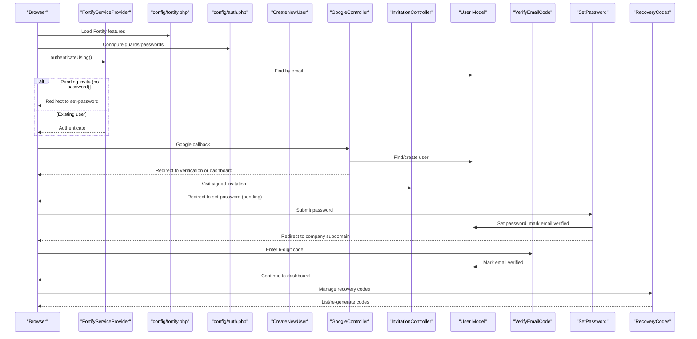

**Diagram sources**
- [FortifyServiceProvider.php:56-73](file://app/Providers/FortifyServiceProvider.php#L56-L73)
- [fortify.php:146-155](file://config/fortify.php#L146-L155)
- [auth.php:38-100](file://config/auth.php#L38-L100)
- [CreateNewUser.php:23-60](file://app/Actions/Fortify/CreateNewUser.php#L23-L60)
- [GoogleController.php:24-76](file://app/Http/Controllers/GoogleController.php#L24-L76)
- [InvitationController.php:14-29](file://app/Http/Controllers/Auth/InvitationController.php#L14-L29)
- [User.php:13-43](file://app/Models/User.php#L13-L43)
- [VerifyEmailCode.php:26-55](file://app/Livewire/Auth/VerifyEmailCode.php#L26-L55)
- [SetPassword.php:62-97](file://app/Livewire/Auth/SetPassword.php#L62-L97)
- [RecoveryCodes.php:26-49](file://app/Livewire/Settings/TwoFactor/RecoveryCodes.php#L26-L49)

## Detailed Component Analysis

### Fortify Configuration and Provider
- Features enabled include registration, password reset, email verification, and two-factor authentication with confirmation and password confirmation.
- Rate limiters for login and two-factor challenge are configured.
- Views are bound to Livewire components for seamless UX.
- Custom authenticateUsing logic detects pending users (no password set) and redirects to set-password with company context.

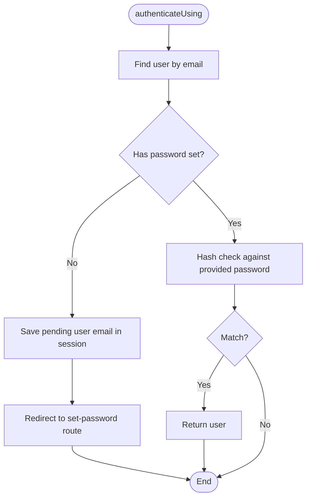

**Diagram sources**
- [FortifyServiceProvider.php:56-73](file://app/Providers/FortifyServiceProvider.php#L56-L73)

**Section sources**
- [fortify.php:146-155](file://config/fortify.php#L146-L155)
- [FortifyServiceProvider.php:38-105](file://app/Providers/FortifyServiceProvider.php#L38-L105)

### Registration and Password Reset
- Registration creates a company and admin user with validated profile and password rules.
- Password reset validates and updates the user’s password using shared rules.

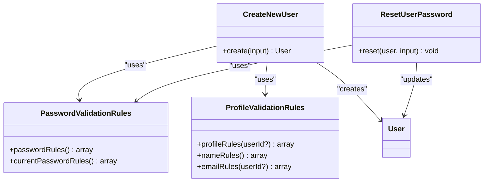

**Diagram sources**
- [CreateNewUser.php:14-60](file://app/Actions/Fortify/CreateNewUser.php#L14-L60)
- [ResetUserPassword.php:10-28](file://app/Actions/Fortify/ResetUserPassword.php#L10-L28)
- [PasswordValidationRules.php:7-28](file://app/Concerns/PasswordValidationRules.php#L7-L28)
- [ProfileValidationRules.php:8-49](file://app/Concerns/ProfileValidationRules.php#L8-L49)
- [User.php:13-43](file://app/Models/User.php#L13-L43)

**Section sources**
- [CreateNewUser.php:23-60](file://app/Actions/Fortify/CreateNewUser.php#L23-L60)
- [ResetUserPassword.php:19-28](file://app/Actions/Fortify/ResetUserPassword.php#L19-L28)
- [PasswordValidationRules.php:14-27](file://app/Concerns/PasswordValidationRules.php#L14-L27)
- [ProfileValidationRules.php:15-49](file://app/Concerns/ProfileValidationRules.php#L15-L49)

### Google OAuth Integration
- Redirects to Google with explicit prompt and consent scopes.
- On callback, either logs in existing users (verifying email if needed) or creates a new user (unverified).
- Redirects to verification flow if email is unverified, otherwise to company subdomain or setup company.

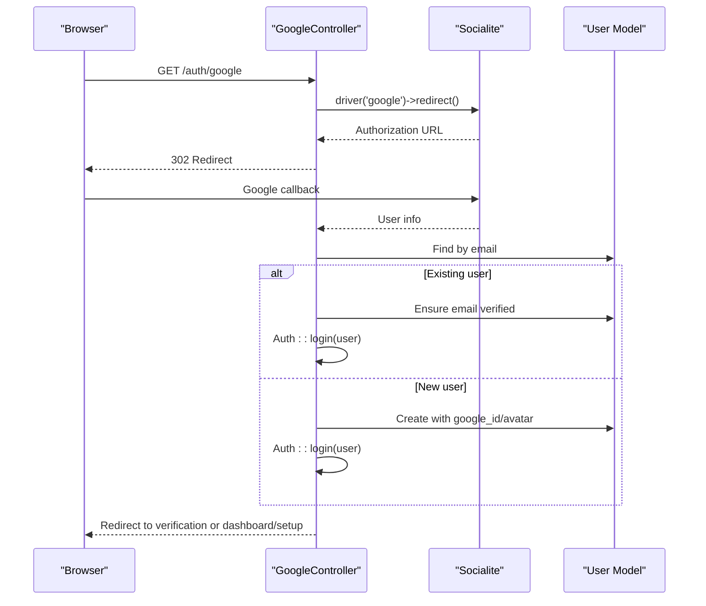

**Diagram sources**
- [GoogleController.php:14-76](file://app/Http/Controllers/GoogleController.php#L14-L76)
- [User.php:13-43](file://app/Models/User.php#L13-L43)

**Section sources**
- [GoogleController.php:14-76](file://app/Http/Controllers/GoogleController.php#L14-L76)

### Invitation System
- Validates signed invitation links; invalid/expired links are rejected.
- Pending users (no password, no Google ID) are routed to set-password after placing their email in session.
- Already-accepted invitations redirect to login.

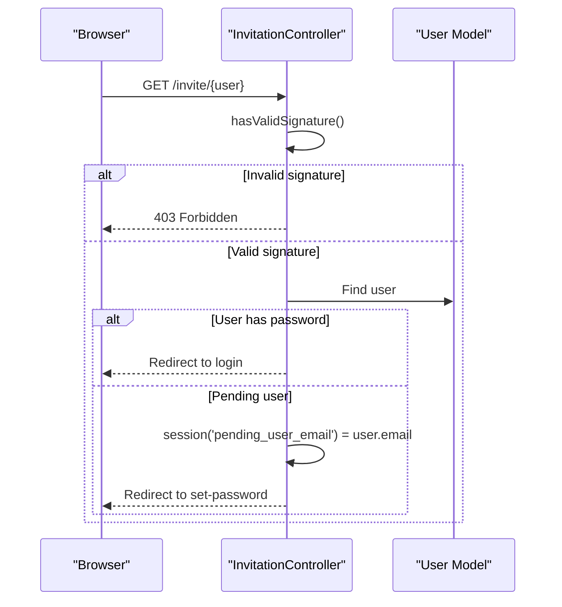

**Diagram sources**
- [InvitationController.php:14-29](file://app/Http/Controllers/Auth/InvitationController.php#L14-L29)
- [User.php:64-72](file://app/Models/User.php#L64-L72)

**Section sources**
- [InvitationController.php:14-29](file://app/Http/Controllers/Auth/InvitationController.php#L14-L29)

### Email Verification Workflow
- Users receive a 6-digit code stored with expiration and associated with the user.
- They enter the code on the verification page; if valid, their email is marked verified and they continue to the dashboard or company setup.
- Codes can be resent and expire quickly.

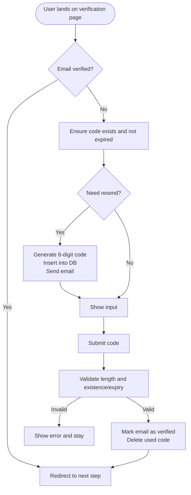

**Diagram sources**
- [VerifyEmailCode.php:26-101](file://app/Livewire/Auth/VerifyEmailCode.php#L26-L101)
- [VerificationCode.php:15-37](file://app/Mail/VerificationCode.php#L15-L37)

**Section sources**
- [VerifyEmailCode.php:26-101](file://app/Livewire/Auth/VerifyEmailCode.php#L26-L101)
- [VerificationCode.php:15-37](file://app/Mail/VerificationCode.php#L15-L37)

### Set Password for Pending Users
- Validates password and optionally specialty for operators.
- Sets password, marks email verified, and logs the user in.
- Redirects to the company’s subdomain tickets page.

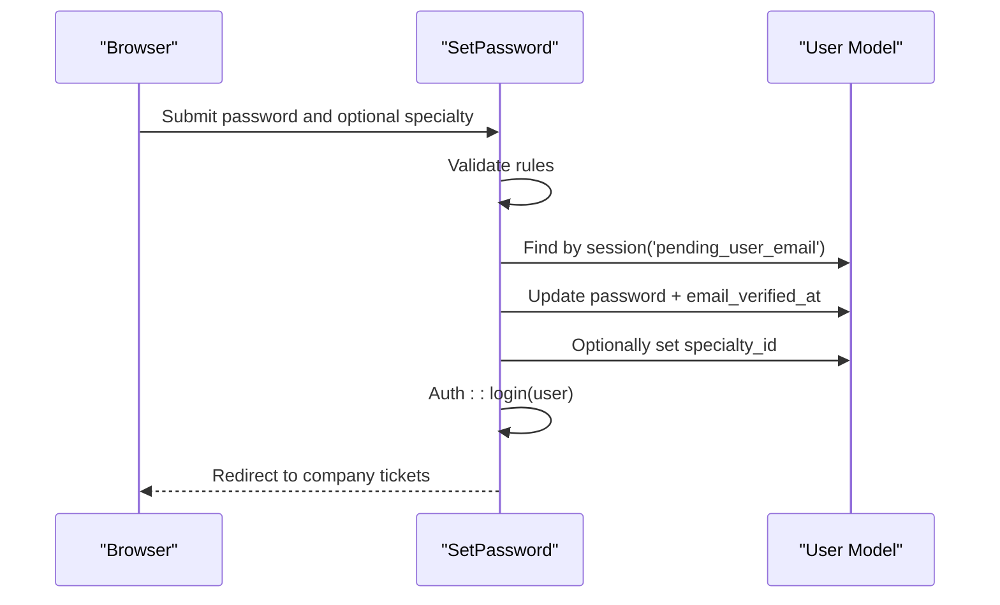

**Diagram sources**
- [SetPassword.php:62-97](file://app/Livewire/Auth/SetPassword.php#L62-L97)
- [User.php:13-43](file://app/Models/User.php#L13-L43)

**Section sources**
- [SetPassword.php:62-97](file://app/Livewire/Auth/SetPassword.php#L62-L97)

### Two-Factor Authentication and Recovery Codes
- Two-factor fields are persisted in the users table.
- Recovery codes are generated and decrypted on demand for display.
- Users can regenerate recovery codes securely.

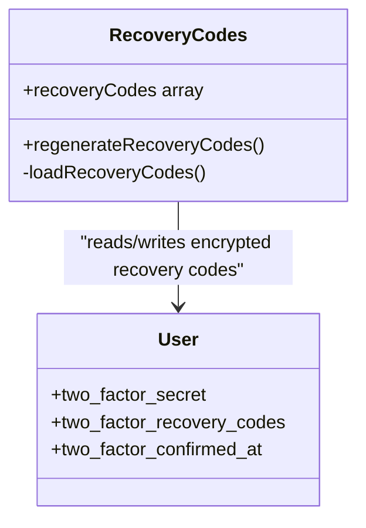

**Diagram sources**
- [User.php:13-43](file://app/Models/User.php#L13-L43)
- [RecoveryCodes.php:10-51](file://app/Livewire/Settings/TwoFactor/RecoveryCodes.php#L10-L51)
- [2025_08_14_170933_add_two_factor_columns_to_users_table.php:14-18](file://database/migrations/2025_08_14_170933_add_two_factor_columns_to_users_table.php#L14-L18)

**Section sources**
- [RecoveryCodes.php:26-49](file://app/Livewire/Settings/TwoFactor/RecoveryCodes.php#L26-L49)
- [2025_08_14_170933_add_two_factor_columns_to_users_table.php:14-18](file://database/migrations/2025_08_14_170933_add_two_factor_columns_to_users_table.php#L14-L18)

### Role-Based Access Control
- AdminOnly middleware restricts routes to admin users.
- AgentOnly middleware allows both agent and operator roles.
- User model exposes role checks and scopes for operators and availability.

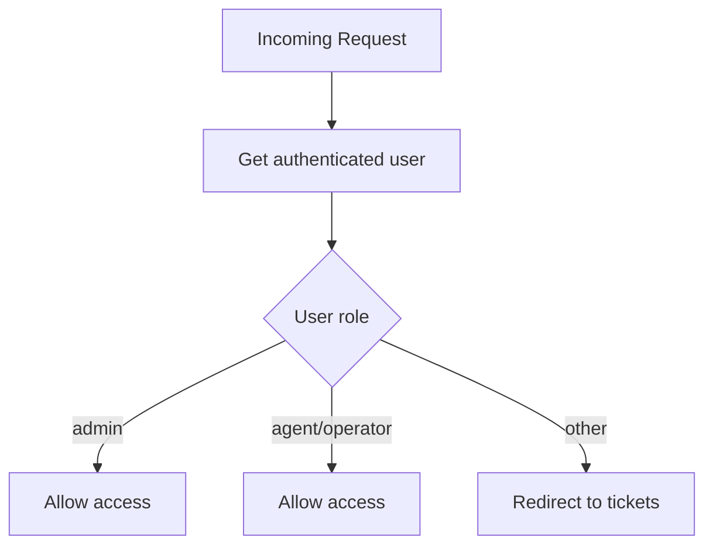

**Diagram sources**
- [AdminOnly.php:16-23](file://app/Http/Middleware/AdminOnly.php#L16-L23)
- [AgentOnly.php:16-23](file://app/Http/Middleware/AgentOnly.php#L16-L23)
- [User.php:54-72](file://app/Models/User.php#L54-L72)

**Section sources**
- [AdminOnly.php:16-23](file://app/Http/Middleware/AdminOnly.php#L16-L23)
- [AgentOnly.php:16-23](file://app/Http/Middleware/AgentOnly.php#L16-L23)
- [User.php:54-72](file://app/Models/User.php#L54-L72)

## Dependency Analysis
- Fortify depends on configuration files and binds custom actions and views.
- Controllers depend on the User model and redirect based on verification and company state.
- Livewire components depend on the User model and database-backed verification codes.
- Middleware depends on the authenticated user’s role.
- Validation concerns are reused by actions and Livewire components.

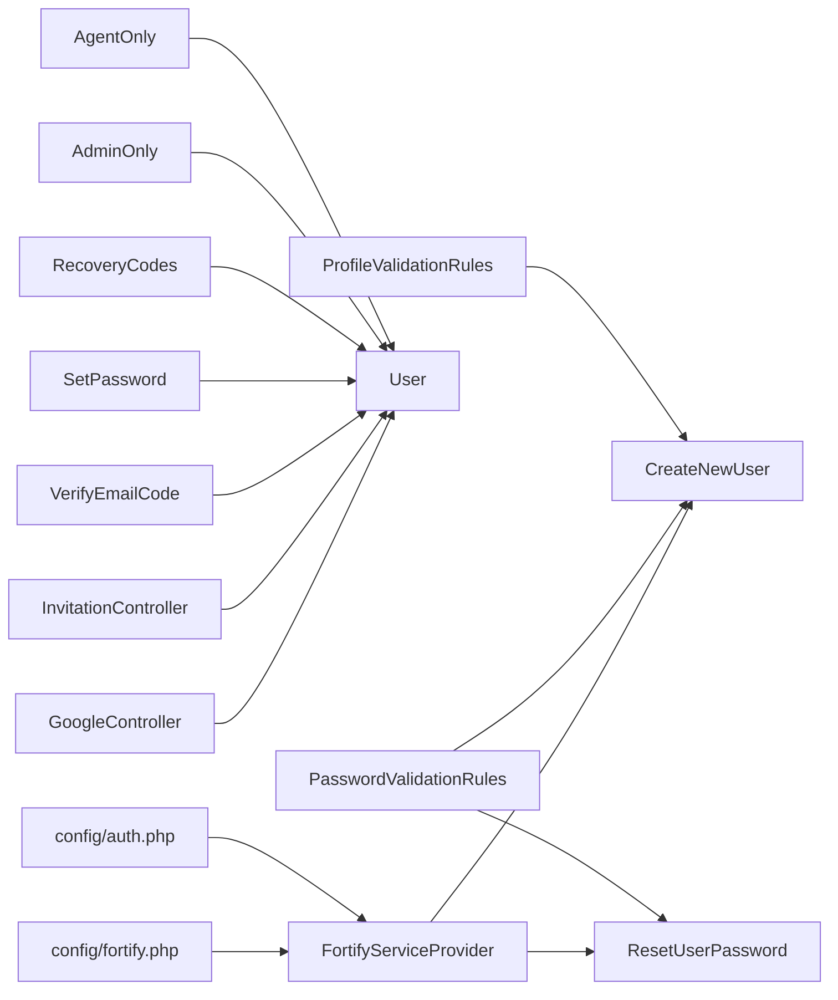

**Diagram sources**
- [fortify.php:1-158](file://config/fortify.php#L1-L158)
- [auth.php:1-116](file://config/auth.php#L1-L116)
- [FortifyServiceProvider.php:1-106](file://app/Providers/FortifyServiceProvider.php#L1-L106)
- [CreateNewUser.php:1-62](file://app/Actions/Fortify/CreateNewUser.php#L1-L62)
- [ResetUserPassword.php:1-30](file://app/Actions/Fortify/ResetUserPassword.php#L1-L30)
- [GoogleController.php:1-78](file://app/Http/Controllers/GoogleController.php#L1-L78)
- [InvitationController.php:1-31](file://app/Http/Controllers/Auth/InvitationController.php#L1-L31)
- [User.php:1-137](file://app/Models/User.php#L1-L137)
- [VerifyEmailCode.php:1-119](file://app/Livewire/Auth/VerifyEmailCode.php#L1-L119)
- [SetPassword.php:1-104](file://app/Livewire/Auth/SetPassword.php#L1-L104)
- [RecoveryCodes.php:1-51](file://app/Livewire/Settings/TwoFactor/RecoveryCodes.php#L1-L51)
- [AdminOnly.php:1-25](file://app/Http/Middleware/AdminOnly.php#L1-L25)
- [AgentOnly.php:1-25](file://app/Http/Middleware/AgentOnly.php#L1-L25)
- [PasswordValidationRules.php:1-29](file://app/Concerns/PasswordValidationRules.php#L1-L29)
- [ProfileValidationRules.php:1-51](file://app/Concerns/ProfileValidationRules.php#L1-L51)

**Section sources**
- [FortifyServiceProvider.php:38-105](file://app/Providers/FortifyServiceProvider.php#L38-L105)
- [CreateNewUser.php:23-60](file://app/Actions/Fortify/CreateNewUser.php#L23-L60)
- [GoogleController.php:24-76](file://app/Http/Controllers/GoogleController.php#L24-L76)
- [VerifyEmailCode.php:26-101](file://app/Livewire/Auth/VerifyEmailCode.php#L26-L101)

## Performance Considerations
- Rate limiting for login and two-factor attempts reduces brute-force risk.
- Email verification codes are short-lived and stored with minimal overhead.
- Two-factor recovery codes are decrypted on demand; avoid frequent reloads.
- Middleware checks are O(1) and fast; keep user scopes minimal for large datasets.

[No sources needed since this section provides general guidance]

## Troubleshooting Guide
Common issues and resolutions:
- Invalid or expired invitation link: Ensure the signed URL is fresh and correctly formed.
- Pending user not redirected to set-password: Confirm the pending user email is placed in session by Fortify’s authenticateUsing or InvitationController.
- Email verification code invalid/expired: Trigger resend to generate a new code; verify database entries and expiration timestamps.
- Google OAuth failure: Catch exceptions and guide users back to registration with an error message.
- Two-factor recovery codes decryption errors: Re-generate codes; ensure encryption/decryption keys are consistent.

**Section sources**
- [InvitationController.php:16-18](file://app/Http/Controllers/Auth/InvitationController.php#L16-L18)
- [FortifyServiceProvider.php:56-73](file://app/Providers/FortifyServiceProvider.php#L56-L73)
- [VerifyEmailCode.php:40-44](file://app/Livewire/Auth/VerifyEmailCode.php#L40-L44)
- [GoogleController.php:28-31](file://app/Http/Controllers/GoogleController.php#L28-L31)
- [RecoveryCodes.php:42-47](file://app/Livewire/Settings/TwoFactor/RecoveryCodes.php#L42-L47)

## Conclusion
The Helpdesk System implements a robust, layered authentication and authorization pipeline:
- Fortify governs core flows with strong defaults and customizations.
- Google OAuth and invitations support flexible onboarding.
- Email verification and two-factor enhance security.
- Role-based middleware ensures appropriate access.
- Validation concerns and custom actions enforce consistent, secure behavior across the application.