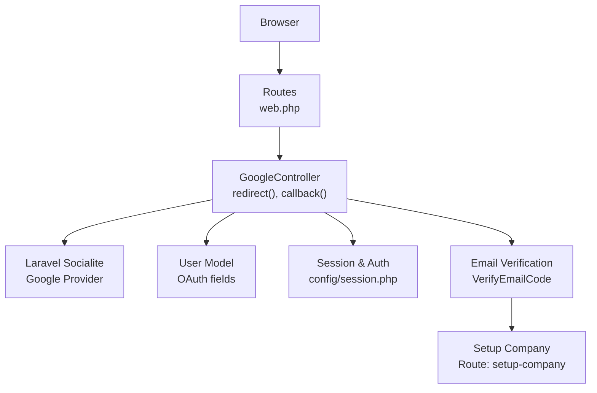
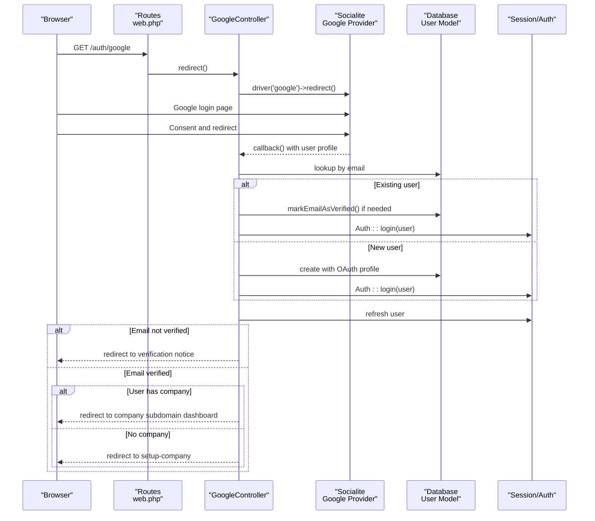
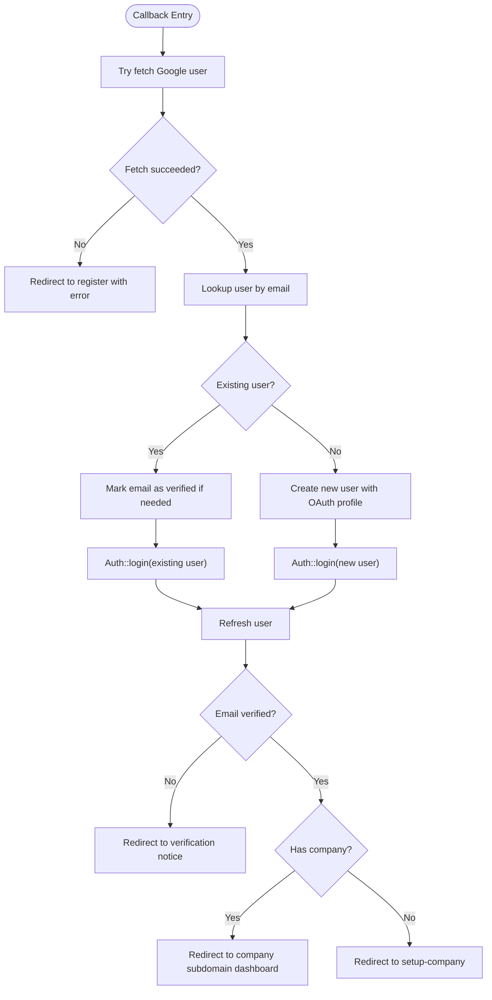
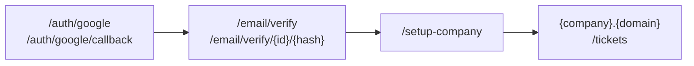
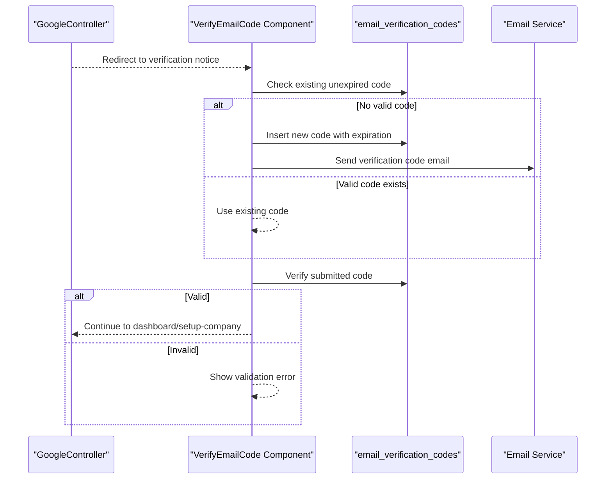
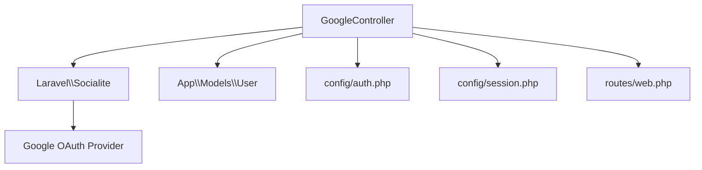

# Google OAuth Integration

<cite>
**Referenced Files in This Document**
- [GoogleController.php](file://app/Http/Controllers/GoogleController.php)
- [services.php](file://config/services.php)
- [User.php](file://app/Models/User.php)
- [web.php](file://routes/web.php)
- [auth.php](file://config/auth.php)
- [session.php](file://config/session.php)
- [services.php](file://bootstrap/cache/services.php)
- [login.blade.php](file://resources/views/livewire/auth/login.blade.php)
- [register.blade.php](file://resources/views/livewire/auth/register.blade.php)
- [VerifyEmailCode.php](file://app/Livewire/Auth/VerifyEmailCode.php)
- [verify-email-code.blade.php](file://resources/views/livewire/auth/verify-email-code.blade.php)
- [verification-code.blade.php](file://resources/views/emails/verification-code.blade.php)
- [EnsureUserBelongsToCompany.php](file://app/Http/Middleware/EnsureUserBelongsToCompany.php)
</cite>

## Table of Contents
1. [Introduction](#introduction)
2. [Project Structure](#project-structure)
3. [Core Components](#core-components)
4. [Architecture Overview](#architecture-overview)
5. [Detailed Component Analysis](#detailed-component-analysis)
6. [Dependency Analysis](#dependency-analysis)
7. [Performance Considerations](#performance-considerations)
8. [Troubleshooting Guide](#troubleshooting-guide)
9. [Security Considerations](#security-considerations)
10. [Conclusion](#conclusion)

## Introduction
This document explains the Google OAuth integration for the helpdesk system. It covers the GoogleController implementation for OAuth callbacks and user authentication flow, OAuth configuration in services.php, user lookup and creation for OAuth users, the authentication pipeline, session management, and user state handling. It also includes examples of OAuth login flow, callback processing, error handling scenarios, and security considerations for OAuth implementation and user data protection.

## Project Structure
The Google OAuth implementation spans several key areas:
- Routes define the OAuth endpoints and middleware constraints
- GoogleController handles redirect and callback logic
- services.php configures Google OAuth credentials
- User model stores OAuth-related fields and relationships
- Session configuration controls authentication persistence
- Email verification flow ensures secure user onboarding
- Middleware enforces company access and user state

**Diagram sources**
- [web.php:35-38](file://routes/web.php#L35-L38)
- [GoogleController.php:14-76](file://app/Http/Controllers/GoogleController.php#L14-L76)
- [services.php:38-42](file://config/services.php#L38-L42)
- [User.php:17-29](file://app/Models/User.php#L17-L29)
- [session.php:21-37](file://config/session.php#L21-L37)
- [VerifyEmailCode.php:54-118](file://app/Livewire/Auth/VerifyEmailCode.php#L54-L118)

**Section sources**
- [web.php:35-38](file://routes/web.php#L35-L38)
- [GoogleController.php:14-76](file://app/Http/Controllers/GoogleController.php#L14-L76)
- [services.php:38-42](file://config/services.php#L38-L42)
- [User.php:17-29](file://app/Models/User.php#L17-L29)
- [session.php:21-37](file://config/session.php#L21-L37)

## Core Components
- GoogleController: Orchestrates OAuth redirection and callback handling, user lookup/creation, and post-authentication routing
- services.php: Defines Google OAuth client credentials and redirect URI
- User model: Stores OAuth profile data and email verification state
- Routes: Expose OAuth endpoints and enforce authentication/verification middleware
- Session configuration: Controls session lifetime, encryption, and cookie attributes
- Email verification: OTP-based verification flow for OAuth users
- Middleware: Ensures company access and user state checks

**Section sources**
- [GoogleController.php:14-76](file://app/Http/Controllers/GoogleController.php#L14-L76)
- [services.php:38-42](file://config/services.php#L38-L42)
- [User.php:17-29](file://app/Models/User.php#L17-L29)
- [web.php:35-38](file://routes/web.php#L35-L38)
- [session.php:21-37](file://config/session.php#L21-L37)
- [VerifyEmailCode.php:54-118](file://app/Livewire/Auth/VerifyEmailCode.php#L54-L118)

## Architecture Overview
The OAuth flow integrates with Laravel Socialite to delegate authentication to Google. After successful callback, the system either logs in existing users (verifying email if needed) or creates new users with OAuth profile data. The controller then manages routing based on email verification and company association.

**Diagram sources**
- [web.php:35-38](file://routes/web.php#L35-L38)
- [GoogleController.php:24-76](file://app/Http/Controllers/GoogleController.php#L24-L76)
- [User.php:17-29](file://app/Models/User.php#L17-L29)
- [session.php:21-37](file://config/session.php#L21-L37)

## Detailed Component Analysis

### GoogleController Implementation
The controller exposes two primary actions:
- redirect(): Initiates OAuth with Google, requesting account selection and consent prompts
- callback(): Processes the OAuth response, performs user lookup/creation, verifies email if needed, logs in the user, and routes based on state

Key behaviors:
- Uses Socialite driver for Google
- Attempts to fetch user profile; on failure, redirects to registration with an error
- Looks up existing users by email; if found, verifies email if unverified and logs in
- If not found, creates a new user with OAuth profile data and logs in
- Refreshes user state, checks email verification, and routes accordingly

**Diagram sources**
- [GoogleController.php:24-76](file://app/Http/Controllers/GoogleController.php#L24-L76)

**Section sources**
- [GoogleController.php:14-76](file://app/Http/Controllers/GoogleController.php#L14-L76)

### OAuth Configuration in services.php
The Google OAuth configuration is centralized under the google key:
- client_id: OAuth client identifier
- client_secret: OAuth client secret
- redirect: OAuth redirect URI used by Google after consent

These values are loaded from environment variables and consumed by Socialite.

**Section sources**
- [services.php:38-42](file://config/services.php#L38-L42)

### User Lookup and Creation for OAuth Users
User data mapping during OAuth:
- Name: From Google profile (fallback to nickname or default)
- Email: From Google profile
- Password: Null for OAuth users
- google_id: Unique Google identifier
- avatar: Profile image URL
- email_verified_at: Remains null initially; email verification required

Post-lookup, the controller ensures email verification for existing users and logs them in. New users are created with OAuth profile data and logged in.

**Section sources**
- [GoogleController.php:34-58](file://app/Http/Controllers/GoogleController.php#L34-L58)
- [User.php:17-29](file://app/Models/User.php#L17-L29)

### Authentication Pipeline and Routing
The routing layer enforces:
- Guest-only OAuth endpoints
- Verified-only access to company subdomain dashboards
- Setup-company route for new users without a company
- Email verification routes for OTP-based verification

Middleware ensures company access and user state checks.

**Diagram sources**
- [web.php:35-38](file://routes/web.php#L35-L38)
- [web.php:51-68](file://routes/web.php#L51-L68)
- [web.php:46-49](file://routes/web.php#L46-L49)
- [web.php:70-114](file://routes/web.php#L70-L114)

**Section sources**
- [web.php:35-38](file://routes/web.php#L35-L38)
- [web.php:51-68](file://routes/web.php#L51-L68)
- [web.php:46-49](file://routes/web.php#L46-L49)
- [web.php:70-114](file://routes/web.php#L70-L114)
- [EnsureUserBelongsToCompany.php:9-38](file://app/Http/Middleware/EnsureUserBelongsToCompany.php#L9-L38)

### Session Management and User State Handling
Session configuration controls:
- Driver: Database by default
- Lifetime: Minutes before idle expiration
- Secure, HTTP-only, and SameSite cookie attributes
- Encryption flag

The controller relies on the session for authentication state and redirects based on user verification and company association.

**Section sources**
- [session.php:21-37](file://config/session.php#L21-L37)
- [session.php:171-202](file://config/session.php#L171-L202)
- [GoogleController.php:42-76](file://app/Http/Controllers/GoogleController.php#L42-L76)

### Email Verification Flow
OAuth users are directed to an OTP-based verification screen:
- VerifyEmailCode Livewire component generates and sends a 6-digit code
- The code is stored with an expiration time and associated with the user
- The user enters the code in the verification UI; successful verification continues the flow
- A resend mechanism clears old codes and sends a new one

**Diagram sources**
- [GoogleController.php:64-76](file://app/Http/Controllers/GoogleController.php#L64-L76)
- [VerifyEmailCode.php:54-118](file://app/Livewire/Auth/VerifyEmailCode.php#L54-L118)
- [verify-email-code.blade.php:34-65](file://resources/views/livewire/auth/verify-email-code.blade.php#L34-L65)
- [verification-code.blade.php:17-28](file://resources/views/emails/verification-code.blade.php#L17-L28)

**Section sources**
- [VerifyEmailCode.php:54-118](file://app/Livewire/Auth/VerifyEmailCode.php#L54-L118)
- [verify-email-code.blade.php:34-65](file://resources/views/livewire/auth/verify-email-code.blade.php#L34-L65)
- [verification-code.blade.php:17-28](file://resources/views/emails/verification-code.blade.php#L17-L28)

## Dependency Analysis
The OAuth integration depends on:
- Laravel Socialite provider for Google
- Eloquent User model for persistence
- Session and authentication guards
- Route middleware for access control

**Diagram sources**
- [GoogleController.php:5-7](file://app/Http/Controllers/GoogleController.php#L5-L7)
- [services.php:38-42](file://config/services.php#L38-L42)
- [auth.php:38-43](file://config/auth.php#L38-L43)
- [session.php:21-37](file://config/session.php#L21-L37)
- [web.php:35-38](file://routes/web.php#L35-L38)

**Section sources**
- [services.php:38-42](file://config/services.php#L38-L42)
- [auth.php:38-43](file://config/auth.php#L38-L43)
- [session.php:21-37](file://config/session.php#L21-L37)
- [web.php:35-38](file://routes/web.php#L35-L38)

## Performance Considerations
- Minimize database queries: The controller performs a single email lookup and optional creation per OAuth callback
- Session efficiency: Using database sessions can add overhead; consider Redis for high traffic
- Email verification caching: Avoid redundant code generation by checking existing unexpired codes before insertion
- Redirect optimization: Ensure redirect URIs are configured correctly to avoid extra hops

## Troubleshooting Guide
Common issues and resolutions:
- OAuth callback failures: The controller catches exceptions and redirects to registration with an error; verify Google OAuth credentials and redirect URI
- Unverified email handling: OAuth users are directed to verification; ensure the verification component is functioning and email delivery is configured
- Company association: If a user has no company, they are redirected to setup-company; verify company creation logic and routing
- Session and cookie issues: Confirm session driver, secure flags, and SameSite policy align with deployment environment

**Section sources**
- [GoogleController.php:26-31](file://app/Http/Controllers/GoogleController.php#L26-L31)
- [VerifyEmailCode.php:54-118](file://app/Livewire/Auth/VerifyEmailCode.php#L54-L118)
- [web.php:46-49](file://routes/web.php#L46-L49)
- [session.php:171-202](file://config/session.php#L171-L202)

## Security Considerations
- Environment variables: Store client credentials in environment variables and never commit secrets to version control
- Redirect URI: Ensure the configured redirect URI matches Google OAuth console settings
- Email verification: Require OTP verification for OAuth users to prevent unauthorized access
- Session security: Enable secure cookies, HTTP-only flags, and appropriate SameSite policies; consider encryption for sensitive sessions
- Company access: Use middleware to enforce company boundaries and prevent cross-company access
- Error handling: Fail securely on OAuth errors and avoid leaking internal details to clients

**Section sources**
- [services.php:38-42](file://config/services.php#L38-L42)
- [GoogleController.php:26-31](file://app/Http/Controllers/GoogleController.php#L26-L31)
- [VerifyEmailCode.php:54-118](file://app/Livewire/Auth/VerifyEmailCode.php#L54-L118)
- [session.php:171-202](file://config/session.php#L171-L202)
- [EnsureUserBelongsToCompany.php:9-38](file://app/Http/Middleware/EnsureUserBelongsToCompany.php#L9-L38)

## Conclusion
The Google OAuth integration leverages Laravel Socialite to authenticate users via Google, seamlessly integrating with the application’s user model, session management, and email verification flow. The GoogleController centralizes OAuth logic, while routes, middleware, and configuration ensure secure and state-appropriate user experiences. Proper environment configuration, session security, and robust error handling are essential for a secure and reliable OAuth implementation.