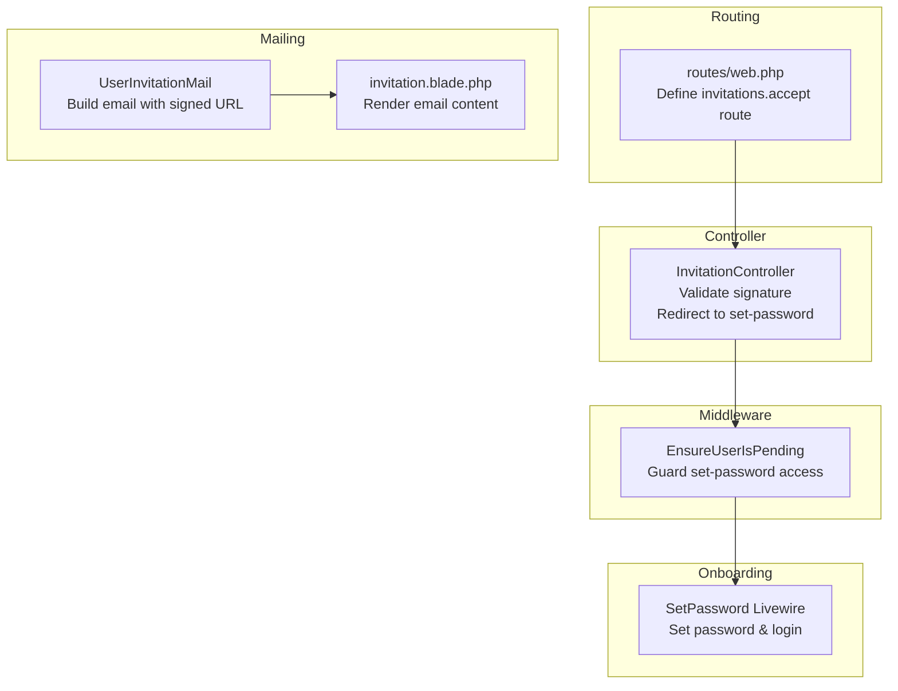
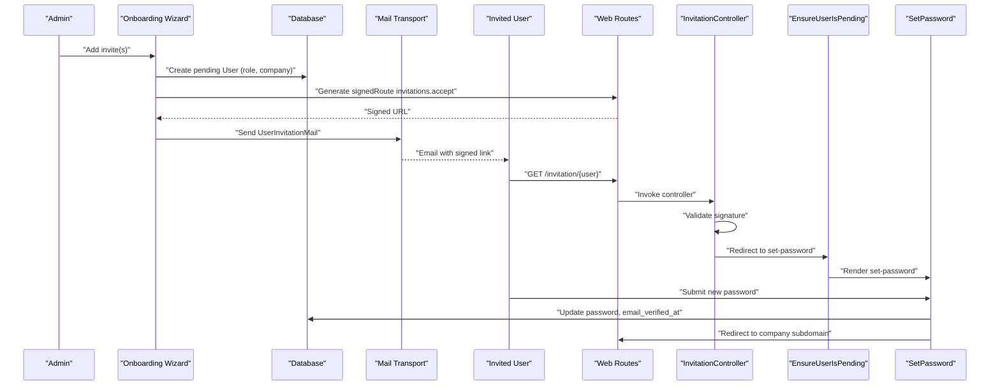
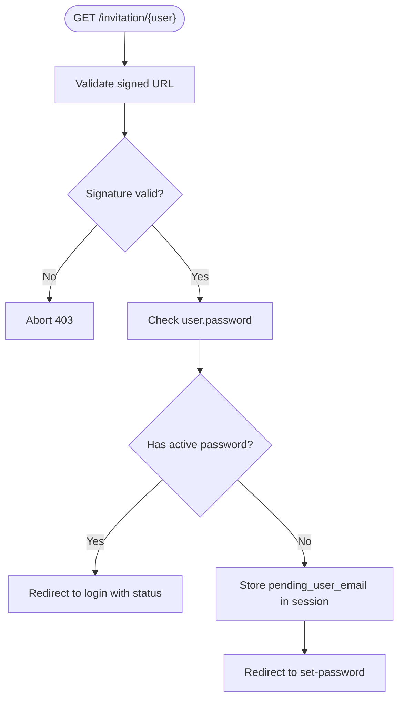
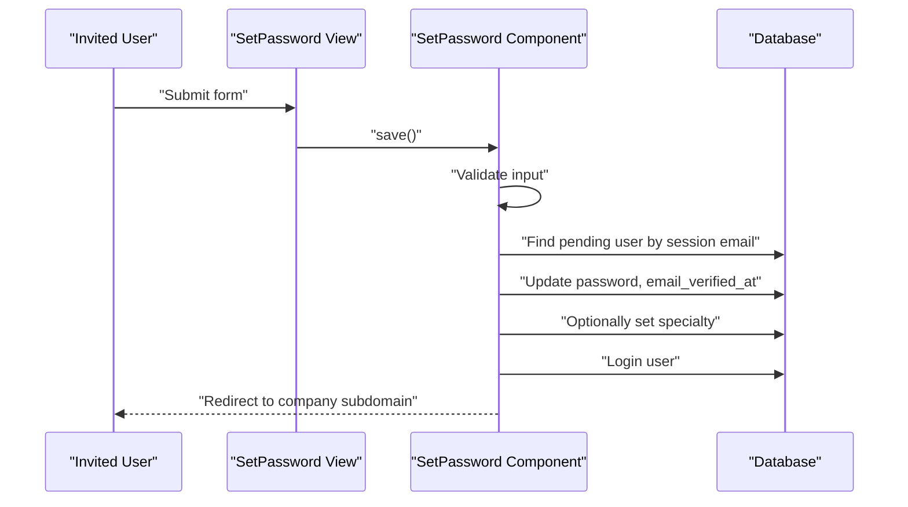
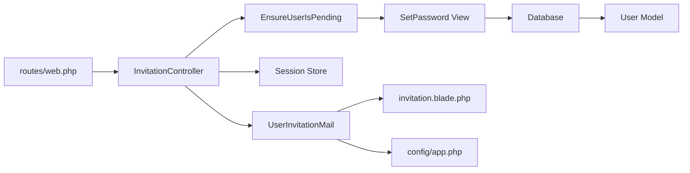

# Invitation System

<cite>
**Referenced Files in This Document**
- [InvitationController.php](file://app/Http/Controllers/Auth/InvitationController.php)
- [UserInvitationMail.php](file://app/Mail/UserInvitationMail.php)
- [invitation.blade.php](file://resources/views/emails/users/invitation.blade.php)
- [web.php](file://routes/web.php)
- [EnsureUserIsPending.php](file://app/Http/Middleware/EnsureUserIsPending.php)
- [SetPassword.php](file://app/Livewire/Auth/SetPassword.php)
- [User.php](file://app/Models/User.php)
- [Wizard.php](file://app/Livewire/Onboarding/Wizard.php)
- [app.php](file://config/app.php)
- [InvitationTest.php](file://tests/Feature/Auth/InvitationTest.php)
</cite>

## Table of Contents
1. [Introduction](#introduction)
2. [Project Structure](#project-structure)
3. [Core Components](#core-components)
4. [Architecture Overview](#architecture-overview)
5. [Detailed Component Analysis](#detailed-component-analysis)
6. [Dependency Analysis](#dependency-analysis)
7. [Performance Considerations](#performance-considerations)
8. [Troubleshooting Guide](#troubleshooting-guide)
9. [Conclusion](#conclusion)

## Introduction
This document explains the secure invitation system used to onboard new users via signed, time-limited links. It covers the complete flow from invitation creation and email delivery to acceptance, validation, and onboarding redirection. It also documents the controller logic, middleware enforcement, email templates, and integration with company membership and role assignment.

## Project Structure
The invitation system spans routing, controllers, middleware, mailables, Blade templates, Livewire components, and tests. The key elements are organized as follows:
- Routes define the invitation acceptance endpoint and apply signed URL validation.
- The InvitationController validates signatures and orchestrates user state transitions.
- Middleware ensures only pending users can access the set-password flow.
- The UserInvitationMail composes and sends the invitation email with a signed URL.
- The invitation email template renders the signed link and contextual messaging.
- The SetPassword Livewire component finalizes onboarding by setting a password and authenticating the user.
- Tests verify security and behavior for valid, invalid, and expired links.

**Diagram sources**
- [web.php:27-30](file://routes/web.php#L27-L30)
- [InvitationController.php:14-29](file://app/Http/Controllers/Auth/InvitationController.php#L14-L29)
- [EnsureUserIsPending.php:16-23](file://app/Http/Middleware/EnsureUserIsPending.php#L16-L23)
- [UserInvitationMail.php:20-52](file://app/Mail/UserInvitationMail.php#L20-L52)
- [invitation.blade.php:1-21](file://resources/views/emails/users/invitation.blade.php#L1-L21)
- [SetPassword.php:62-97](file://app/Livewire/Auth/SetPassword.php#L62-L97)

**Section sources**
- [web.php:20-38](file://routes/web.php#L20-L38)
- [InvitationController.php:9-30](file://app/Http/Controllers/Auth/InvitationController.php#L9-L30)
- [EnsureUserIsPending.php:9-24](file://app/Http/Middleware/EnsureUserIsPending.php#L9-L24)
- [UserInvitationMail.php:13-63](file://app/Mail/UserInvitationMail.php#L13-L63)
- [invitation.blade.php:1-21](file://resources/views/emails/users/invitation.blade.php#L1-L21)
- [SetPassword.php:14-103](file://app/Livewire/Auth/SetPassword.php#L14-L103)

## Core Components
- InvitationController: Validates signed URLs and redirects to set-password for pending users, or back to login for active users.
- EnsureUserIsPending middleware: Ensures only users who clicked the invitation link can access the set-password screen.
- UserInvitationMail: Builds the invitation email envelope and content, injecting a signed URL.
- invitation.blade.php: Renders the invitation email with the signed link and contextual details.
- SetPassword Livewire: Accepts a new password, optionally sets specialty for operators, updates the user, authenticates, and redirects to the company subdomain.
- User model: Tracks pending/active state and company association.
- Wizard (onboarding): Creates pending users and dispatches invitation emails with signed URLs.

**Section sources**
- [InvitationController.php:14-29](file://app/Http/Controllers/Auth/InvitationController.php#L14-L29)
- [EnsureUserIsPending.php:16-23](file://app/Http/Middleware/EnsureUserIsPending.php#L16-L23)
- [UserInvitationMail.php:20-52](file://app/Mail/UserInvitationMail.php#L20-L52)
- [invitation.blade.php:1-21](file://resources/views/emails/users/invitation.blade.php#L1-L21)
- [SetPassword.php:62-97](file://app/Livewire/Auth/SetPassword.php#L62-L97)
- [User.php:64-72](file://app/Models/User.php#L64-L72)
- [Wizard.php:182-196](file://app/Livewire/Onboarding/Wizard.php#L182-L196)

## Architecture Overview
The invitation system enforces security through signed URLs and explicit middleware gating. The flow is:

**Diagram sources**
- [Wizard.php:182-196](file://app/Livewire/Onboarding/Wizard.php#L182-L196)
- [web.php:27-30](file://routes/web.php#L27-L30)
- [InvitationController.php:14-29](file://app/Http/Controllers/Auth/InvitationController.php#L14-L29)
- [EnsureUserIsPending.php:16-23](file://app/Http/Middleware/EnsureUserIsPending.php#L16-L23)
- [SetPassword.php:62-97](file://app/Livewire/Auth/SetPassword.php#L62-L97)

## Detailed Component Analysis

### InvitationController
Responsibilities:
- Validate the signed URL signature.
- Prevent reuse by redirecting users with active passwords to login.
- Initialize a volatile session flag to unlock the set-password flow.
- Redirect to the set-password route.

Security validations:
- Uses built-in signature validation to reject tampered or expired links.
- Implicit model binding ensures the user exists; otherwise a 404 is returned.

User state transitions:
- Pending users are redirected to set-password after signature validation.
- Active users are redirected to login with a status message.

**Diagram sources**
- [InvitationController.php:14-29](file://app/Http/Controllers/Auth/InvitationController.php#L14-L29)

**Section sources**
- [InvitationController.php:14-29](file://app/Http/Controllers/Auth/InvitationController.php#L14-L29)
- [web.php:27-30](file://routes/web.php#L27-L30)

### EnsureUserIsPending Middleware
Responsibilities:
- Guards the set-password route to ensure only users who clicked the invitation link can proceed.
- Redirects unqualified requests to login.

Behavior:
- Checks for the presence of a volatile session key set by the controller.
- Allows progression if present; otherwise denies access.

**Section sources**
- [EnsureUserIsPending.php:16-23](file://app/Http/Middleware/EnsureUserIsPending.php#L16-L23)
- [web.php:23-25](file://routes/web.php#L23-L25)

### UserInvitationMail
Responsibilities:
- Construct the email subject based on company context.
- Render the email content using a Blade markdown template.
- Attach the signed URL for invitation acceptance.

Subject construction:
- Uses the application name or company name depending on user context.

Content rendering:
- Passes user and signed URL to the Blade template.

**Section sources**
- [UserInvitationMail.php:20-52](file://app/Mail/UserInvitationMail.php#L20-L52)
- [invitation.blade.php:1-21](file://resources/views/emails/users/invitation.blade.php#L1-L21)

### Invitation Email Template (Blade)
Responsibilities:
- Display a friendly greeting and role context.
- Provide a prominent button linking to the signed URL.
- Offer a plaintext alternative link.

Context injection:
- Receives user and signedUrl from the mailable.

**Section sources**
- [invitation.blade.php:1-21](file://resources/views/emails/users/invitation.blade.php#L1-L21)
- [UserInvitationMail.php:43-51](file://app/Mail/UserInvitationMail.php#L43-L51)

### SetPassword Livewire Component
Responsibilities:
- Validate and persist a new password for pending users.
- Optionally set specialty for operators.
- Authenticate the user and redirect to the company’s subdomain.

Key steps:
- Retrieve pending user from session.
- Validate input according to rules (including specialty for operators).
- Update user with hashed password and email verification timestamp.
- Clear the pending session flag and log in the user.
- Redirect to the company subdomain tickets page.

**Diagram sources**
- [SetPassword.php:32-97](file://app/Livewire/Auth/SetPassword.php#L32-L97)

**Section sources**
- [SetPassword.php:32-97](file://app/Livewire/Auth/SetPassword.php#L32-L97)

### Invitation Link Generation and Delivery
Generation:
- The onboarding wizard creates a pending user and generates a signed route URL for invitation acceptance.

Delivery:
- The UserInvitationMail is sent to the user’s email address with the signed URL.

Domain and subdomain:
- The application configuration defines the base domain used for subdomains and redirects.

**Section sources**
- [Wizard.php:182-196](file://app/Livewire/Onboarding/Wizard.php#L182-L196)
- [UserInvitationMail.php:20-52](file://app/Mail/UserInvitationMail.php#L20-L52)
- [app.php:125-128](file://config/app.php#L125-L128)

### User State Transitions and Company Membership
- Pending state: Users without a password are considered pending and require setting a password.
- Active state: After setting a password, users become active and can log in directly.
- Company membership: Pending users are associated with a company and role during creation.
- Specialty assignment: Operators may have an optional specialty set during onboarding.

**Section sources**
- [User.php:64-72](file://app/Models/User.php#L64-L72)
- [Wizard.php:186-192](file://app/Livewire/Onboarding/Wizard.php#L186-L192)
- [SetPassword.php:85-90](file://app/Livewire/Auth/SetPassword.php#L85-L90)

## Dependency Analysis
The invitation system exhibits clean separation of concerns:
- Routing depends on signed URL validation middleware.
- Controller depends on request signature validation and session management.
- Middleware depends on session state to gate access.
- Mailable depends on the user model and configuration for branding.
- Livewire component depends on the user model and authentication facilities.
- Tests validate controller behavior under normal and error conditions.

**Diagram sources**
- [web.php:27-30](file://routes/web.php#L27-L30)
- [InvitationController.php:14-29](file://app/Http/Controllers/Auth/InvitationController.php#L14-L29)
- [EnsureUserIsPending.php:16-23](file://app/Http/Middleware/EnsureUserIsPending.php#L16-L23)
- [UserInvitationMail.php:20-52](file://app/Mail/UserInvitationMail.php#L20-L52)
- [invitation.blade.php:1-21](file://resources/views/emails/users/invitation.blade.php#L1-L21)
- [app.php:125-128](file://config/app.php#L125-L128)
- [SetPassword.php:62-97](file://app/Livewire/Auth/SetPassword.php#L62-L97)
- [User.php:64-72](file://app/Models/User.php#L64-L72)

**Section sources**
- [web.php:20-38](file://routes/web.php#L20-L38)
- [InvitationController.php:9-30](file://app/Http/Controllers/Auth/InvitationController.php#L9-L30)
- [EnsureUserIsPending.php:9-24](file://app/Http/Middleware/EnsureUserIsPending.php#L9-L24)
- [UserInvitationMail.php:13-63](file://app/Mail/UserInvitationMail.php#L13-L63)
- [invitation.blade.php:1-21](file://resources/views/emails/users/invitation.blade.php#L1-L21)
- [SetPassword.php:14-103](file://app/Livewire/Auth/SetPassword.php#L14-L103)
- [User.php:13-137](file://app/Models/User.php#L13-L137)
- [app.php:125-128](file://config/app.php#L125-L128)

## Performance Considerations
- Signed URL generation and validation are lightweight; the primary cost lies in email transport and rendering.
- The set-password operation performs a single update and login, minimizing database overhead.
- Caching of company-related data is handled by model observers, indirectly supporting efficient lookups post-onboarding.

## Troubleshooting Guide
Common issues and resolutions:
- Invalid or expired invitation link:
  - Symptom: 403 Forbidden response.
  - Cause: Signature mismatch or expiration.
  - Resolution: Regenerate a new signed URL and resend the invitation.
  - Evidence: Controller aborts with an explicit message for invalid/expired links.
  
- Invalid user ID in the invitation link:
  - Symptom: 404 Not Found.
  - Cause: Implicit model binding fails due to a non-existent user ID.
  - Resolution: Ensure the user record exists and the ID matches the intended recipient.
  
- Already accepted invitation:
  - Symptom: Redirected to login with a status message.
  - Cause: User already has an active password.
  - Resolution: Direct the user to the login page; they can authenticate normally.
  
- Access denied to set-password:
  - Symptom: Redirected to login when accessing the set-password page.
  - Cause: Missing or cleared pending session flag.
  - Resolution: Ensure the user clicked the invitation link and the session flag is present.

**Section sources**
- [InvitationController.php:16-23](file://app/Http/Controllers/Auth/InvitationController.php#L16-L23)
- [web.php:27-30](file://routes/web.php#L27-L30)
- [EnsureUserIsPending.php:18-20](file://app/Http/Middleware/EnsureUserIsPending.php#L18-L20)
- [InvitationTest.php:7-30](file://tests/Feature/Auth/InvitationTest.php#L7-L30)
- [InvitationTest.php:32-45](file://tests/Feature/Auth/InvitationTest.php#L32-L45)
- [InvitationTest.php:47-62](file://tests/Feature/Auth/InvitationTest.php#L47-L62)

## Conclusion
The invitation system leverages signed URLs and middleware to securely onboard users. It cleanly separates concerns across routing, controllers, middleware, mailing, and Livewire components, while ensuring proper user state transitions and company membership. The provided tests validate core security and behavior, and the architecture supports straightforward extension for additional roles or onboarding steps.