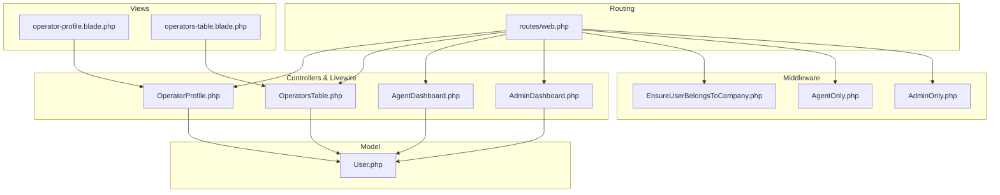
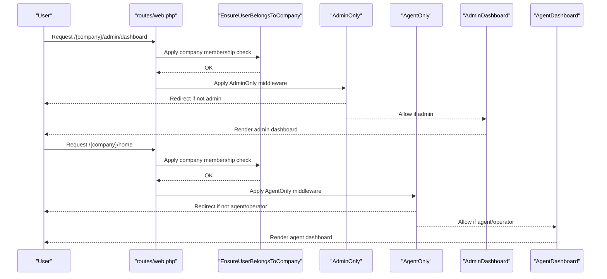
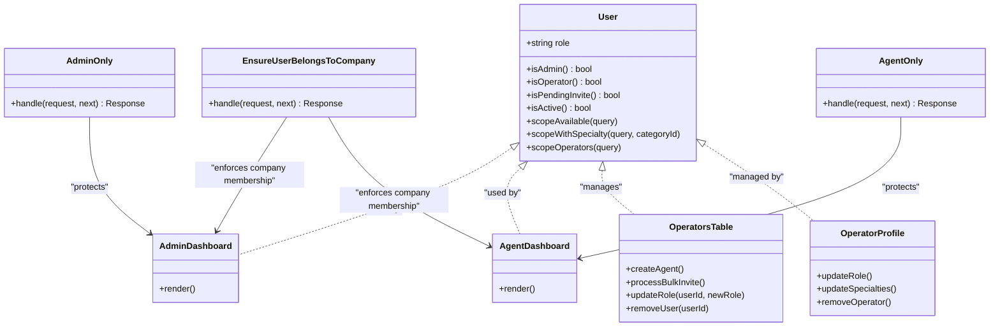
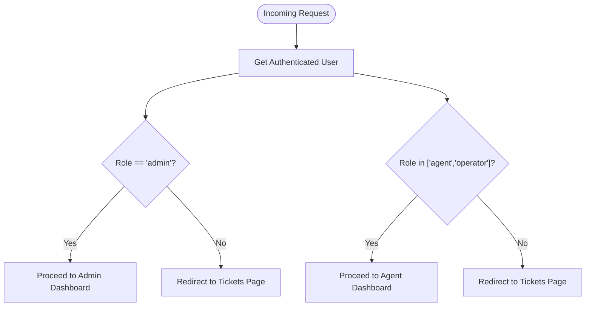
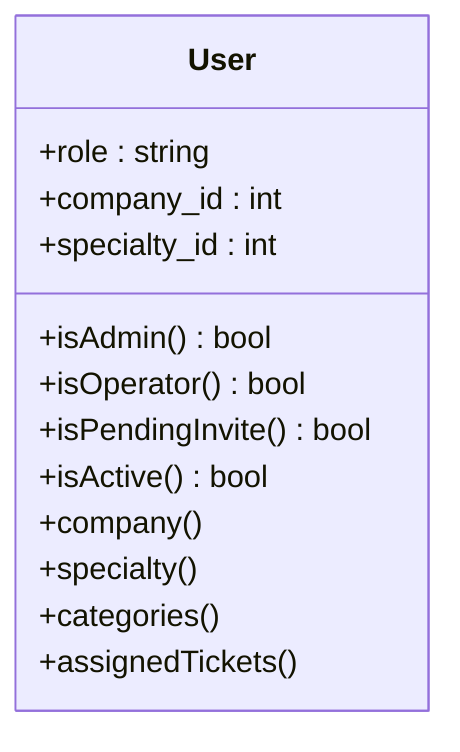
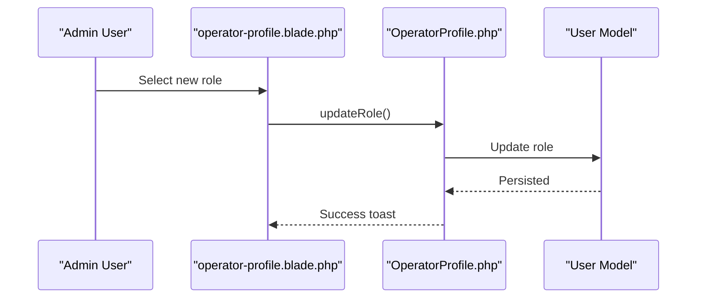
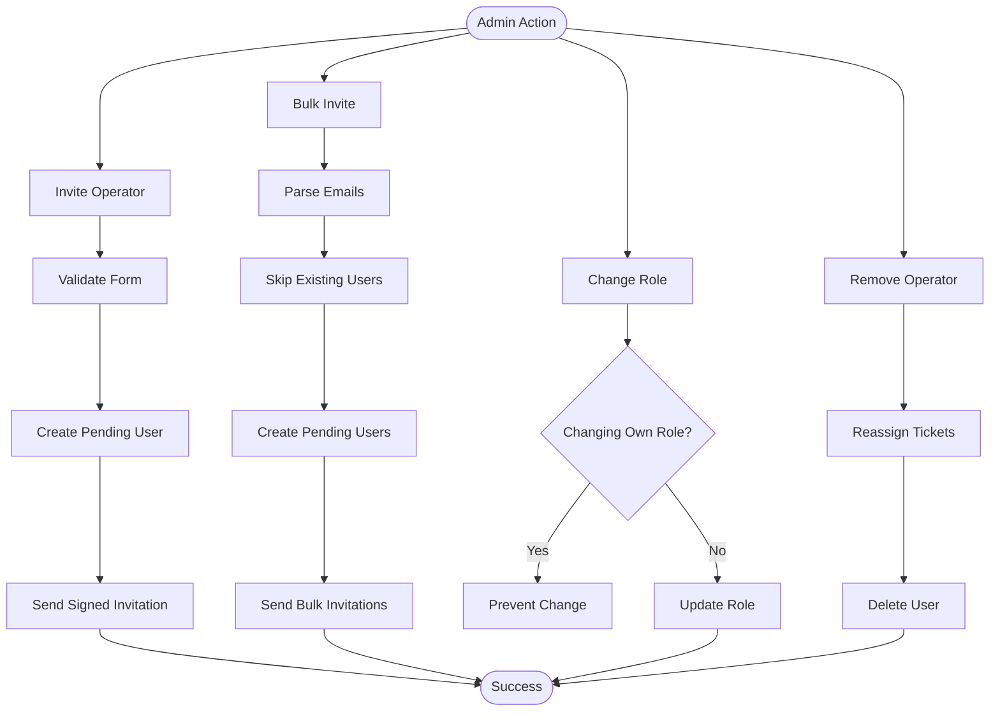
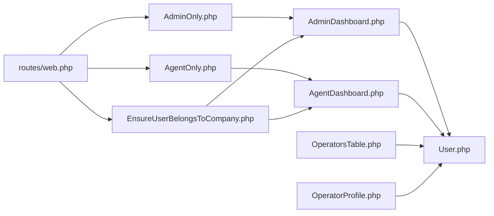

# Role-based Access Control

<cite>
**Referenced Files in This Document**
- [User.php](file://app/Models/User.php)
- [AdminOnly.php](file://app/Http/Middleware/AdminOnly.php)
- [AgentOnly.php](file://app/Http/Middleware/AgentOnly.php)
- [web.php](file://routes/web.php)
- [AdminDashboard.php](file://app/Livewire/Dashboard/AdminDashboard.php)
- [AgentDashboard.php](file://app/Livewire/Dashboard/AgentDashboard.php)
- [OperatorsTable.php](file://app/Livewire/Dashboard/OperatorsTable.php)
- [OperatorProfile.php](file://app/Livewire/Dashboard/OperatorProfile.php)
- [EnsureUserBelongsToCompany.php](file://app/Http/Middleware/EnsureUserBelongsToCompany.php)
- [ProfileValidationRules.php](file://app/Concerns/ProfileValidationRules.php)
- [create_users_table_migration.php](file://database/migrations/0001_01_01_000000_create_users_table.php)
- [operator_profile_view.blade.php](file://resources/views/livewire/dashboard/operator-profile.blade.php)
- [operators_table_view.blade.php](file://resources/views/livewire/dashboard/operators-table.blade.php)
</cite>

## Table of Contents
1. [Introduction](#introduction)
2. [Project Structure](#project-structure)
3. [Core Components](#core-components)
4. [Architecture Overview](#architecture-overview)
5. [Detailed Component Analysis](#detailed-component-analysis)
6. [Dependency Analysis](#dependency-analysis)
7. [Performance Considerations](#performance-considerations)
8. [Troubleshooting Guide](#troubleshooting-guide)
9. [Conclusion](#conclusion)

## Introduction
This document describes the role-based access control (RBAC) system that governs who can access what within the helpdesk application. The system defines a three-tier role hierarchy:
- Admin: Full administrative control over the company's dashboard, operators, categories, automation rules, and reports.
- Agent: A legacy role present in the database schema but not actively used in routing or middleware protections.
- Operator: Standard agent role with access to dashboards, tickets, and operator management features under administrative oversight.

Security boundaries are enforced via middleware, route-level protections, and company-scoped data access checks. Administrative functions such as inviting users, assigning roles, managing specialties, and removing operators are restricted to Admin users.

## Project Structure
The RBAC system spans models, middleware, routes, Livewire components, and views:
- Model layer: User model with role property and convenience methods.
- Middleware layer: AdminOnly and AgentOnly for route protection.
- Routing layer: Subdomain-based company access with role-based route groups.
- UI layer: Livewire dashboards and operator management pages with role-aware controls.
- Validation layer: Profile validation rules for user profile updates.

**Diagram sources**
- [web.php:70-114](file://routes/web.php#L70-L114)
- [AdminOnly.php:16-23](file://app/Http/Middleware/AdminOnly.php#L16-L23)
- [AgentOnly.php:16-23](file://app/Http/Middleware/AgentOnly.php#L16-L23)
- [EnsureUserBelongsToCompany.php:11-37](file://app/Http/Middleware/EnsureUserBelongsToCompany.php#L11-L37)
- [AdminDashboard.php:14-127](file://app/Livewire/Dashboard/AdminDashboard.php#L14-L127)
- [AgentDashboard.php:16-141](file://app/Livewire/Dashboard/AgentDashboard.php#L16-L141)
- [OperatorsTable.php:11-487](file://app/Livewire/Dashboard/OperatorsTable.php#L11-L487)
- [OperatorProfile.php:13-127](file://app/Livewire/Dashboard/OperatorProfile.php#L13-L127)
- [User.php:54-82](file://app/Models/User.php#L54-L82)
- [operator_profile_view.blade.php:86-102](file://resources/views/livewire/dashboard/operator-profile.blade.php#L86-L102)
- [operators_table_view.blade.php:475-488](file://resources/views/livewire/dashboard/operators-table.blade.php#L475-L488)

**Section sources**
- [web.php:70-114](file://routes/web.php#L70-L114)
- [AdminOnly.php:16-23](file://app/Http/Middleware/AdminOnly.php#L16-L23)
- [AgentOnly.php:16-23](file://app/Http/Middleware/AgentOnly.php#L16-L23)
- [EnsureUserBelongsToCompany.php:11-37](file://app/Http/Middleware/EnsureUserBelongsToCompany.php#L11-L37)
- [AdminDashboard.php:14-127](file://app/Livewire/Dashboard/AdminDashboard.php#L14-L127)
- [AgentDashboard.php:16-141](file://app/Livewire/Dashboard/AgentDashboard.php#L16-L141)
- [OperatorsTable.php:11-487](file://app/Livewire/Dashboard/OperatorsTable.php#L11-L487)
- [OperatorProfile.php:13-127](file://app/Livewire/Dashboard/OperatorProfile.php#L13-L127)
- [User.php:54-82](file://app/Models/User.php#L54-L82)
- [operator_profile_view.blade.php:86-102](file://resources/views/livewire/dashboard/operator-profile.blade.php#L86-L102)
- [operators_table_view.blade.php:475-488](file://resources/views/livewire/dashboard/operators-table.blade.php#L475-L488)

## Core Components
- User model role properties and helpers:
  - Role field supports values "admin" and "operator".
  - Convenience methods: isAdmin(), isOperator(), isPendingInvite(), isActive().
  - Scopes: scopeAvailable(), scopeWithSpecialty(), scopeOperators().
- Middleware:
  - AdminOnly: restricts access to admin-only routes; redirects non-admins to the tickets page.
  - AgentOnly: restricts access to agent/operator routes; redirects others to the tickets page.
  - EnsureUserBelongsToCompany: enforces company membership for protected routes.
- Routes:
  - Subdomain-based company access with layered middleware groups.
  - Admin dashboard requires AdminOnly middleware.
  - Agent dashboard requires AgentOnly middleware.
  - Operator management routes require authorization gates ("can:view-operators").
- Livewire dashboards and operator management:
  - AdminDashboard: aggregates company-wide metrics and lists.
  - AgentDashboard: focuses on assigned tickets and self-assignment.
  - OperatorsTable: invites, bulk operations, role updates, specialty management.
  - OperatorProfile: per-operator view with role and specialty controls.
- Validation:
  - ProfileValidationRules: shared validation rules for name and email during profile updates.

**Section sources**
- [User.php:54-82](file://app/Models/User.php#L54-L82)
- [AdminOnly.php:16-23](file://app/Http/Middleware/AdminOnly.php#L16-L23)
- [AgentOnly.php:16-23](file://app/Http/Middleware/AgentOnly.php#L16-L23)
- [EnsureUserBelongsToCompany.php:11-37](file://app/Http/Middleware/EnsureUserBelongsToCompany.php#L11-L37)
- [web.php:70-114](file://routes/web.php#L70-L114)
- [AdminDashboard.php:14-127](file://app/Livewire/Dashboard/AdminDashboard.php#L14-L127)
- [AgentDashboard.php:16-141](file://app/Livewire/Dashboard/AgentDashboard.php#L16-L141)
- [OperatorsTable.php:11-487](file://app/Livewire/Dashboard/OperatorsTable.php#L11-L487)
- [OperatorProfile.php:13-127](file://app/Livewire/Dashboard/OperatorProfile.php#L13-L127)
- [ProfileValidationRules.php:15-49](file://app/Concerns/ProfileValidationRules.php#L15-L49)

## Architecture Overview
The RBAC architecture combines route-level middleware, company-scoped access checks, and UI-driven controls to enforce security boundaries.

**Diagram sources**
- [web.php:70-114](file://routes/web.php#L70-L114)
- [EnsureUserBelongsToCompany.php:11-37](file://app/Http/Middleware/EnsureUserBelongsToCompany.php#L11-L37)
- [AdminOnly.php:16-23](file://app/Http/Middleware/AdminOnly.php#L16-L23)
- [AgentOnly.php:16-23](file://app/Http/Middleware/AgentOnly.php#L16-L23)
- [AdminDashboard.php:122-127](file://app/Livewire/Dashboard/AdminDashboard.php#L122-L127)
- [AgentDashboard.php:137-141](file://app/Livewire/Dashboard/AgentDashboard.php#L137-L141)

## Detailed Component Analysis

### Role Hierarchy and Permissions
- Roles:
  - admin: Full administrative access to admin dashboard and operator management.
  - operator: Standard agent role; can access agent dashboard and operator-related features under admin oversight.
  - agent: Legacy role present in schema; not actively used in middleware or routing protections.
- Permission matrix:
  - AdminOnly middleware protects admin routes; only users with role "admin" can access admin dashboard and related features.
  - AgentOnly middleware protects agent routes; only users with roles "agent" or "operator" can access agent dashboard and related features.
  - Operator management features (invite, bulk invite, role update, remove) are available to Admin users and enforced in Livewire components.

**Diagram sources**
- [User.php:54-121](file://app/Models/User.php#L54-L121)
- [AdminOnly.php:16-23](file://app/Http/Middleware/AdminOnly.php#L16-L23)
- [AgentOnly.php:16-23](file://app/Http/Middleware/AgentOnly.php#L16-L23)
- [EnsureUserBelongsToCompany.php:11-37](file://app/Http/Middleware/EnsureUserBelongsToCompany.php#L11-L37)
- [AdminDashboard.php:122-127](file://app/Livewire/Dashboard/AdminDashboard.php#L122-L127)
- [AgentDashboard.php:137-141](file://app/Livewire/Dashboard/AgentDashboard.php#L137-L141)
- [OperatorsTable.php:327-430](file://app/Livewire/Dashboard/OperatorsTable.php#L327-L430)
- [OperatorProfile.php:81-121](file://app/Livewire/Dashboard/OperatorProfile.php#L81-L121)

**Section sources**
- [User.php:54-121](file://app/Models/User.php#L54-L121)
- [AdminOnly.php:16-23](file://app/Http/Middleware/AdminOnly.php#L16-L23)
- [AgentOnly.php:16-23](file://app/Http/Middleware/AgentOnly.php#L16-L23)
- [EnsureUserBelongsToCompany.php:11-37](file://app/Http/Middleware/EnsureUserBelongsToCompany.php#L11-L37)
- [AdminDashboard.php:122-127](file://app/Livewire/Dashboard/AdminDashboard.php#L122-L127)
- [AgentDashboard.php:137-141](file://app/Livewire/Dashboard/AgentDashboard.php#L137-L141)
- [OperatorsTable.php:327-430](file://app/Livewire/Dashboard/OperatorsTable.php#L327-L430)
- [OperatorProfile.php:81-121](file://app/Livewire/Dashboard/OperatorProfile.php#L81-L121)

### AdminOnly and AgentOnly Middleware
- AdminOnly:
  - Checks if the authenticated user's role equals "admin".
  - Redirects to the tickets page for non-admin users.
- AgentOnly:
  - Checks if the authenticated user's role is either "agent" or "operator".
  - Redirects to the tickets page for unauthorized users.

**Diagram sources**
- [AdminOnly.php:16-23](file://app/Http/Middleware/AdminOnly.php#L16-L23)
- [AgentOnly.php:16-23](file://app/Http/Middleware/AgentOnly.php#L16-L23)

**Section sources**
- [AdminOnly.php:16-23](file://app/Http/Middleware/AdminOnly.php#L16-L23)
- [AgentOnly.php:16-23](file://app/Http/Middleware/AgentOnly.php#L16-L23)

### User Model Role Assignments and Permission Checking
- Role field:
  - Stored in the users table with enum values ["admin", "operator"].
- Helper methods:
  - isAdmin(), isOperator(), isPendingInvite(), isActive() provide concise permission checks.
- Scopes:
  - scopeAvailable(), scopeWithSpecialty(), scopeOperators() support filtering operators for availability, specialty, and role.
- Company and specialty relationships:
  - Users belong to a company and can have specialties and category associations.

**Diagram sources**
- [User.php:17-43](file://app/Models/User.php#L17-L43)
- [User.php:74-97](file://app/Models/User.php#L74-L97)
- [create_users_table_migration.php:23](file://database/migrations/0001_01_01_000000_create_users_table.php#L23)

**Section sources**
- [User.php:54-82](file://app/Models/User.php#L54-L82)
- [User.php:74-97](file://app/Models/User.php#L74-L97)
- [create_users_table_migration.php:23](file://database/migrations/0001_01_01_000000_create_users_table.php#L23)

### ProfileValidationRules for Role-Specific Validation
- Shared validation rules for profile updates:
  - Name: required, string, max length.
  - Email: required, string, email, max length, unique constraint (accounting for existing records).
- These rules ensure consistent validation across profile editing flows.

**Section sources**
- [ProfileValidationRules.php:15-49](file://app/Concerns/ProfileValidationRules.php#L15-L49)

### Role-Based Navigation and Feature Access
- Admin navigation:
  - Admin dashboard route protected by AdminOnly middleware.
  - Operator management routes (operators list, operator profile) protected by authorization gates and company membership.
- Agent navigation:
  - Agent dashboard route protected by AgentOnly middleware.
- Role-specific UI controls:
  - Operator profile view includes a role selection control for admins to change roles, with safeguards preventing self-modification.
  - Operators table includes role filters and controls for invites and bulk operations.

**Diagram sources**
- [operator_profile_view.blade.php:86-102](file://resources/views/livewire/dashboard/operator-profile.blade.php#L86-L102)
- [OperatorProfile.php:81-92](file://app/Livewire/Dashboard/OperatorProfile.php#L81-L92)

**Section sources**
- [web.php:90-111](file://routes/web.php#L90-L111)
- [operator_profile_view.blade.php:86-102](file://resources/views/livewire/dashboard/operator-profile.blade.php#L86-L102)
- [operators_table_view.blade.php:475-488](file://resources/views/livewire/dashboard/operators-table.blade.php#L475-L488)

### Administrative Functions and Workflows
- Inviting operators:
  - OperatorsTable validates invite form and creates pending users with role "operator".
  - Sends signed invitation emails for secure onboarding.
- Bulk invitations:
  - Processes multiple emails, skipping duplicates and existing users.
- Role assignment workflows:
  - Admins can change roles via OperatorProfile and OperatorsTable.
  - Self-role modification is prevented.
- Specialty management:
  - Operators can set primary specialty and associate multiple categories.
- Removal and deactivation:
  - Admins can revoke invitations or remove active operators, with proper ticket reassignment.

**Diagram sources**
- [OperatorsTable.php:327-430](file://app/Livewire/Dashboard/OperatorsTable.php#L327-L430)
- [OperatorProfile.php:81-121](file://app/Livewire/Dashboard/OperatorProfile.php#L81-L121)

**Section sources**
- [OperatorsTable.php:327-430](file://app/Livewire/Dashboard/OperatorsTable.php#L327-L430)
- [OperatorProfile.php:81-121](file://app/Livewire/Dashboard/OperatorProfile.php#L81-L121)

## Dependency Analysis
- Route dependencies:
  - Admin dashboard depends on AdminOnly middleware and company membership.
  - Agent dashboard depends on AgentOnly middleware and company membership.
  - Operator management routes depend on authorization gates and company membership.
- Component dependencies:
  - AdminDashboard and AgentDashboard depend on User model for counts and lists.
  - OperatorsTable and OperatorProfile depend on User model for invites, role updates, and specialty management.
- Security dependencies:
  - EnsureUserBelongsToCompany ensures users belong to the requested company before allowing access.

**Diagram sources**
- [web.php:70-114](file://routes/web.php#L70-L114)
- [AdminOnly.php:16-23](file://app/Http/Middleware/AdminOnly.php#L16-L23)
- [AgentOnly.php:16-23](file://app/Http/Middleware/AgentOnly.php#L16-L23)
- [EnsureUserBelongsToCompany.php:11-37](file://app/Http/Middleware/EnsureUserBelongsToCompany.php#L11-L37)
- [AdminDashboard.php:14-127](file://app/Livewire/Dashboard/AdminDashboard.php#L14-L127)
- [AgentDashboard.php:16-142](file://app/Livewire/Dashboard/AgentDashboard.php#L16-L142)
- [OperatorsTable.php:11-487](file://app/Livewire/Dashboard/OperatorsTable.php#L11-L487)
- [OperatorProfile.php:13-127](file://app/Livewire/Dashboard/OperatorProfile.php#L13-L127)
- [User.php:54-121](file://app/Models/User.php#L54-L121)

**Section sources**
- [web.php:70-114](file://routes/web.php#L70-L114)
- [AdminOnly.php:16-23](file://app/Http/Middleware/AdminOnly.php#L16-L23)
- [AgentOnly.php:16-23](file://app/Http/Middleware/AgentOnly.php#L16-L23)
- [EnsureUserBelongsToCompany.php:11-37](file://app/Http/Middleware/EnsureUserBelongsToCompany.php#L11-L37)
- [AdminDashboard.php:14-127](file://app/Livewire/Dashboard/AdminDashboard.php#L14-L127)
- [AgentDashboard.php:16-142](file://app/Livewire/Dashboard/AgentDashboard.php#L16-L142)
- [OperatorsTable.php:11-487](file://app/Livewire/Dashboard/OperatorsTable.php#L11-L487)
- [OperatorProfile.php:13-127](file://app/Livewire/Dashboard/OperatorProfile.php#L13-L127)
- [User.php:54-121](file://app/Models/User.php#L54-L121)

## Performance Considerations
- Middleware checks are lightweight and performed per request; keep additional checks in Livewire components minimal.
- Use Eloquent scopes and eager loading (as seen in components) to avoid N+1 queries.
- Pagination is already used in operators listing; maintain pagination for large datasets.

## Troubleshooting Guide
- Access denied errors:
  - Verify the user's role matches the route protection (AdminOnly vs AgentOnly).
  - Confirm company membership via EnsureUserBelongsToCompany middleware.
- Role not changing:
  - Ensure the action originates from an Admin user and is not targeting self.
  - Check Livewire event handlers and validation rules.
- Invitation issues:
  - Confirm signed URLs and email delivery; verify uniqueness constraints for emails.
- Operator removal:
  - Ensure tickets are reassigned before deletion to prevent orphaned data.

**Section sources**
- [AdminOnly.php:16-23](file://app/Http/Middleware/AdminOnly.php#L16-L23)
- [AgentOnly.php:16-23](file://app/Http/Middleware/AgentOnly.php#L16-L23)
- [EnsureUserBelongsToCompany.php:11-37](file://app/Http/Middleware/EnsureUserBelongsToCompany.php#L11-L37)
- [OperatorsTable.php:414-430](file://app/Livewire/Dashboard/OperatorsTable.php#L414-L430)
- [OperatorProfile.php:81-92](file://app/Livewire/Dashboard/OperatorProfile.php#L81-L92)

## Conclusion
The RBAC system enforces clear security boundaries through role-based middleware, company-scoped access checks, and UI-driven administrative controls. Admins manage operators and system features, while Agents and Operators access dashboards and tickets within their designated roles. The design leverages middleware, authorization gates, and validated workflows to maintain consistent and secure access across the application.