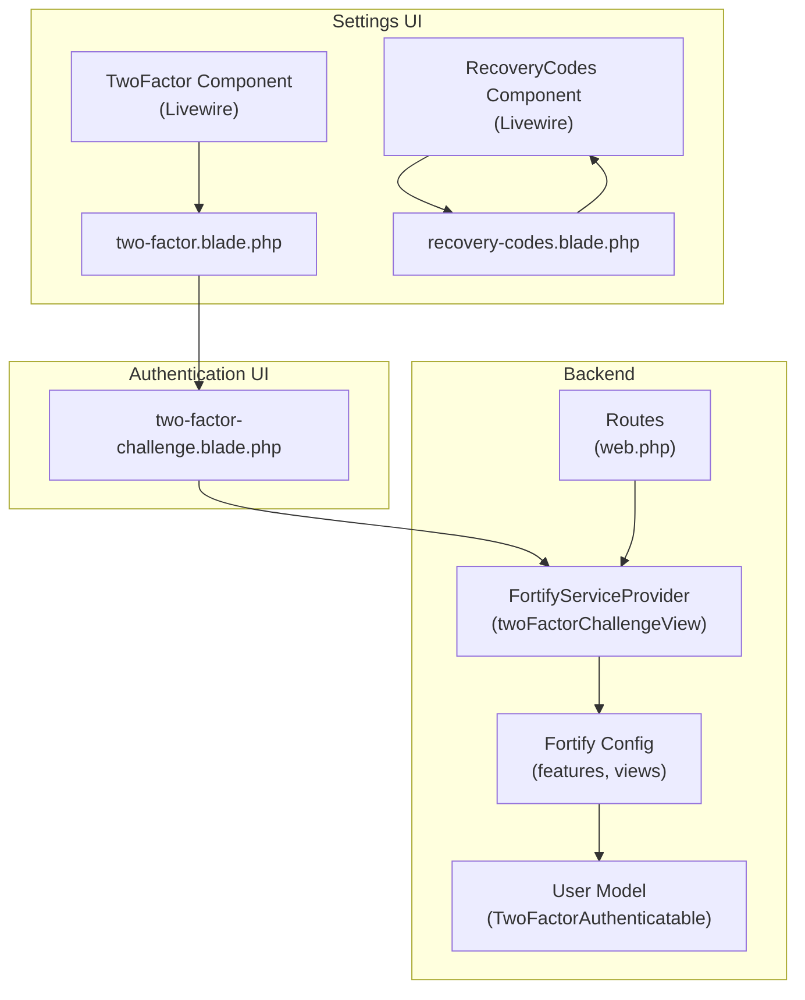
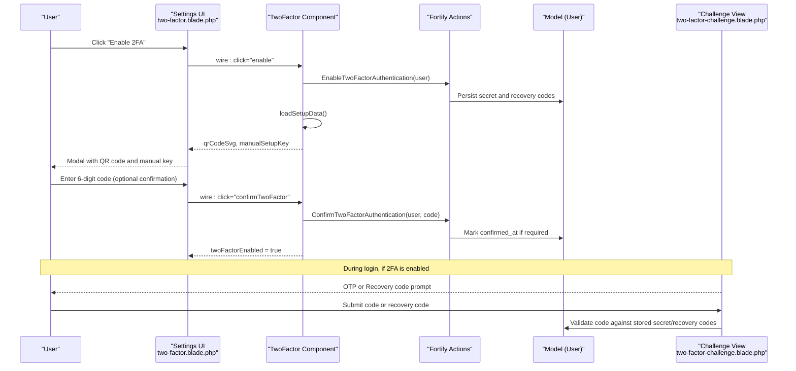
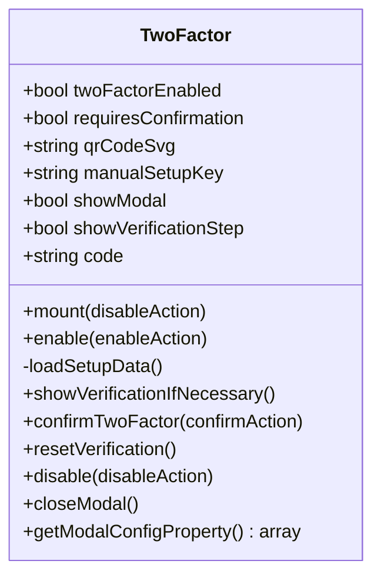
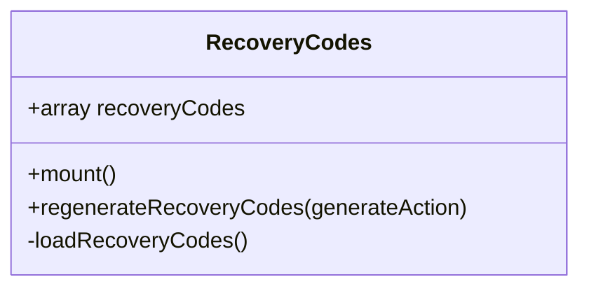
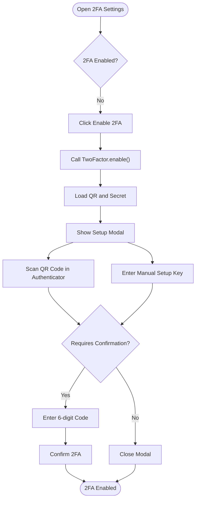
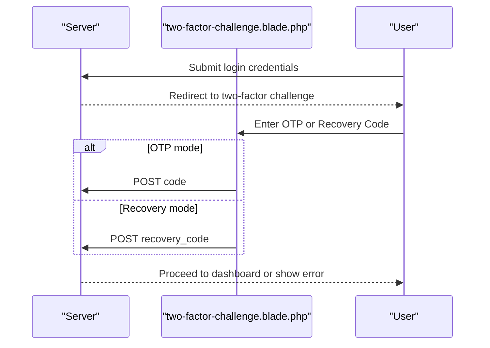
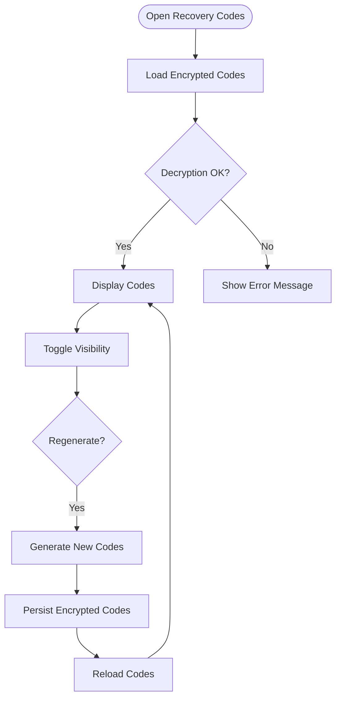
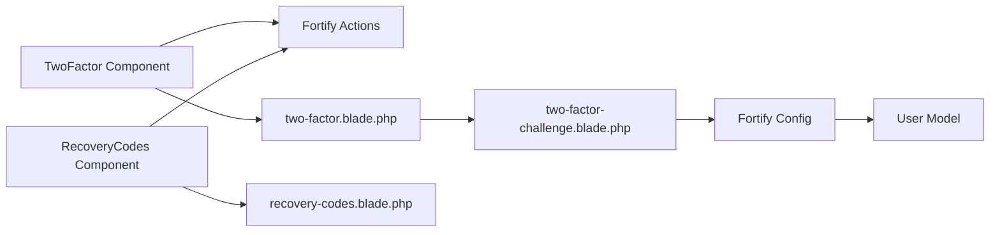

# Two-factor Authentication

<cite>
**Referenced Files in This Document**
- [TwoFactor.php](file://app/Livewire/Settings/TwoFactor.php)
- [RecoveryCodes.php](file://app/Livewire/Settings/TwoFactor/RecoveryCodes.php)
- [two-factor.blade.php](file://resources/views/livewire/settings/two-factor.blade.php)
- [recovery-codes.blade.php](file://resources/views/livewire/settings/two-factor/recovery-codes.blade.php)
- [two-factor-challenge.blade.php](file://resources/views/livewire/auth/two-factor-challenge.blade.php)
- [PasswordValidationRules.php](file://app/Concerns/PasswordValidationRules.php)
- [2025_08_14_170933_add_two_factor_columns_to_users_table.php](file://database/migrations/2025_08_14_170933_add_two_factor_columns_to_users_table.php)
- [User.php](file://app/Models/User.php)
- [FortifyServiceProvider.php](file://app/Providers/FortifyServiceProvider.php)
- [fortify.php](file://config/fortify.php)
- [web.php](file://routes/web.php)
- [TwoFactorAuthenticationTest.php](file://tests/Feature/Settings/TwoFactorAuthenticationTest.php)
- [TwoFactorChallengeTest.php](file://tests/Feature/Auth/TwoFactorChallengeTest.php)
</cite>

## Table of Contents
1. [Introduction](#introduction)
2. [Project Structure](#project-structure)
3. [Core Components](#core-components)
4. [Architecture Overview](#architecture-overview)
5. [Detailed Component Analysis](#detailed-component-analysis)
6. [Dependency Analysis](#dependency-analysis)
7. [Performance Considerations](#performance-considerations)
8. [Troubleshooting Guide](#troubleshooting-guide)
9. [Conclusion](#conclusion)
10. [Appendices](#appendices)

## Introduction
This document explains the two-factor authentication (2FA) implementation in the system. It covers the Livewire components that enable and manage 2FA, the recovery codes workflow, password validation integration, and the end-to-end authentication flow. It also documents setup steps (QR code scanning and manual setup), backup code storage, security best practices, and recovery procedures.

## Project Structure
The 2FA implementation spans Livewire components, Blade views, Fortify configuration, and the User model. The following diagram shows how the main pieces fit together.

**Diagram sources**
- [TwoFactor.php:16-182](file://app/Livewire/Settings/TwoFactor.php#L16-L182)
- [RecoveryCodes.php:10-50](file://app/Livewire/Settings/TwoFactor/RecoveryCodes.php#L10-L50)
- [two-factor.blade.php:1-211](file://resources/views/livewire/settings/two-factor.blade.php#L1-L211)
- [recovery-codes.blade.php:1-90](file://resources/views/livewire/settings/two-factor/recovery-codes.blade.php#L1-L90)
- [two-factor-challenge.blade.php:1-96](file://resources/views/livewire/auth/two-factor-challenge.blade.php#L1-L96)
- [User.php:13-15](file://app/Models/User.php#L13-L15)
- [FortifyServiceProvider.php:79-88](file://app/Providers/FortifyServiceProvider.php#L79-L88)
- [fortify.php:146-155](file://config/fortify.php#L146-L155)
- [web.php:20-38](file://routes/web.php#L20-L38)

**Section sources**
- [TwoFactor.php:16-182](file://app/Livewire/Settings/TwoFactor.php#L16-L182)
- [RecoveryCodes.php:10-50](file://app/Livewire/Settings/TwoFactor/RecoveryCodes.php#L10-L50)
- [two-factor.blade.php:1-211](file://resources/views/livewire/settings/two-factor.blade.php#L1-L211)
- [recovery-codes.blade.php:1-90](file://resources/views/livewire/settings/two-factor/recovery-codes.blade.php#L1-L90)
- [two-factor-challenge.blade.php:1-96](file://resources/views/livewire/auth/two-factor-challenge.blade.php#L1-L96)
- [User.php:13-15](file://app/Models/User.php#L13-L15)
- [FortifyServiceProvider.php:79-88](file://app/Providers/FortifyServiceProvider.php#L79-L88)
- [fortify.php:146-155](file://config/fortify.php#L146-L155)
- [web.php:20-38](file://routes/web.php#L20-L38)

## Core Components
- TwoFactor Livewire component: Manages enabling/disabling 2FA, QR code SVG rendering, manual setup key display, and optional confirmation step.
- RecoveryCodes Livewire component: Loads, displays, and regenerates backup recovery codes.
- User model: Uses Laravel Fortify’s TwoFactorAuthenticatable trait to support 2FA.
- Fortify configuration and provider: Registers the 2FA challenge view and enables 2FA features.
- Blade templates: Provide the UI for 2FA setup, verification, and recovery code management.

**Section sources**
- [TwoFactor.php:16-182](file://app/Livewire/Settings/TwoFactor.php#L16-L182)
- [RecoveryCodes.php:10-50](file://app/Livewire/Settings/TwoFactor/RecoveryCodes.php#L10-L50)
- [User.php:13-15](file://app/Models/User.php#L13-L15)
- [FortifyServiceProvider.php:79-88](file://app/Providers/FortifyServiceProvider.php#L79-L88)
- [fortify.php:146-155](file://config/fortify.php#L146-L155)

## Architecture Overview
The 2FA lifecycle integrates Livewire components, Fortify’s backend actions, and Blade views. The diagram below maps the end-to-end flow from enabling 2FA to authentication challenges and recovery.

**Diagram sources**
- [TwoFactor.php:55-113](file://app/Livewire/Settings/TwoFactor.php#L55-L113)
- [two-factor.blade.php:57-209](file://resources/views/livewire/settings/two-factor.blade.php#L57-L209)
- [two-factor-challenge.blade.php:40-92](file://resources/views/livewire/auth/two-factor-challenge.blade.php#L40-L92)
- [User.php:13-15](file://app/Models/User.php#L13-L15)

## Detailed Component Analysis

### TwoFactor Livewire Component
Responsibilities:
- Enable 2FA for the authenticated user and prepare setup data (QR SVG and manual setup key).
- Optionally require a verification step to confirm the authenticator app is working.
- Confirm the 2FA setup with a 6-digit code.
- Disable 2FA for the user.
- Manage modal UI state and configuration messages.

Key behaviors:
- Uses Fortify’s actions to enable/disable and confirm 2FA.
- Decrypts the stored secret to render QR code and display manual key.
- Supports a “confirmation” option via Fortify features.

**Diagram sources**
- [TwoFactor.php:16-182](file://app/Livewire/Settings/TwoFactor.php#L16-L182)

**Section sources**
- [TwoFactor.php:40-50](file://app/Livewire/Settings/TwoFactor.php#L40-L50)
- [TwoFactor.php:55-66](file://app/Livewire/Settings/TwoFactor.php#L55-L66)
- [TwoFactor.php:71-83](file://app/Livewire/Settings/TwoFactor.php#L71-L83)
- [TwoFactor.php:88-99](file://app/Livewire/Settings/TwoFactor.php#L88-L99)
- [TwoFactor.php:104-113](file://app/Livewire/Settings/TwoFactor.php#L104-L113)
- [TwoFactor.php:118-133](file://app/Livewire/Settings/TwoFactor.php#L118-L133)
- [TwoFactor.php:138-153](file://app/Livewire/Settings/TwoFactor.php#L138-L153)
- [TwoFactor.php:158-181](file://app/Livewire/Settings/TwoFactor.php#L158-L181)

### RecoveryCodes Livewire Component
Responsibilities:
- Load and display recovery codes for the user.
- Regenerate recovery codes when requested.
- Handle decryption and JSON parsing of stored codes.

**Diagram sources**
- [RecoveryCodes.php:10-50](file://app/Livewire/Settings/TwoFactor/RecoveryCodes.php#L10-L50)

**Section sources**
- [RecoveryCodes.php:18-21](file://app/Livewire/Settings/TwoFactor/RecoveryCodes.php#L18-L21)
- [RecoveryCodes.php:26-31](file://app/Livewire/Settings/TwoFactor/RecoveryCodes.php#L26-L31)
- [RecoveryCodes.php:36-49](file://app/Livewire/Settings/TwoFactor/RecoveryCodes.php#L36-L49)

### Password Validation Integration
The PasswordValidationRules trait centralizes password validation rules used across the application. While not directly part of 2FA, it ensures secure password handling during registration, updates, and related flows.

**Section sources**
- [PasswordValidationRules.php:14-27](file://app/Concerns/PasswordValidationRules.php#L14-L27)

### 2FA Setup Flow (QR Code and Manual Setup)
The setup modal renders:
- A QR code SVG generated from the user’s 2FA secret.
- A manual setup key that can be copied.
- An optional OTP verification step when confirmation is enabled.

**Diagram sources**
- [TwoFactor.php:55-66](file://app/Livewire/Settings/TwoFactor.php#L55-L66)
- [TwoFactor.php:71-83](file://app/Livewire/Settings/TwoFactor.php#L71-L83)
- [TwoFactor.php:88-99](file://app/Livewire/Settings/TwoFactor.php#L88-L99)
- [TwoFactor.php:104-113](file://app/Livewire/Settings/TwoFactor.php#L104-L113)
- [two-factor.blade.php:57-209](file://resources/views/livewire/settings/two-factor.blade.php#L57-L209)

**Section sources**
- [two-factor.blade.php:126-154](file://resources/views/livewire/settings/two-factor.blade.php#L126-L154)
- [two-factor.blade.php:164-206](file://resources/views/livewire/settings/two-factor.blade.php#L164-L206)

### 2FA Authentication Challenge and Recovery
During login, if 2FA is enabled, users are presented with:
- An OTP input for the current code.
- A toggle to switch to recovery code input.
- Submission to validate either the OTP or a recovery code.

**Diagram sources**
- [two-factor-challenge.blade.php:40-92](file://resources/views/livewire/auth/two-factor-challenge.blade.php#L40-L92)

**Section sources**
- [two-factor-challenge.blade.php:26-38](file://resources/views/livewire/auth/two-factor-challenge.blade.php#L26-L38)
- [two-factor-challenge.blade.php:44-74](file://resources/views/livewire/auth/two-factor-challenge.blade.php#L44-L74)

### Backup Code Management
Recovery codes are:
- Stored encrypted in the database.
- Decrypted and displayed in the UI when requested.
- Regenerated to invalidate previous codes and issue new ones.

**Diagram sources**
- [RecoveryCodes.php:26-31](file://app/Livewire/Settings/TwoFactor/RecoveryCodes.php#L26-L31)
- [RecoveryCodes.php:36-49](file://app/Livewire/Settings/TwoFactor/RecoveryCodes.php#L36-L49)
- [recovery-codes.blade.php:16-52](file://resources/views/livewire/settings/two-factor/recovery-codes.blade.php#L16-L52)

**Section sources**
- [recovery-codes.blade.php:16-52](file://resources/views/livewire/settings/two-factor/recovery-codes.blade.php#L16-L52)
- [recovery-codes.blade.php:66-85](file://resources/views/livewire/settings/two-factor/recovery-codes.blade.php#L66-L85)

## Dependency Analysis
- TwoFactor component depends on Fortify actions for enabling, confirming, and disabling 2FA.
- RecoveryCodes component depends on Fortify’s recovery code regeneration action.
- Views depend on Livewire component state and actions.
- Fortify configuration enables 2FA features and sets the challenge view.
- The User model uses the TwoFactorAuthenticatable trait to integrate with Fortify.

**Diagram sources**
- [TwoFactor.php:55-113](file://app/Livewire/Settings/TwoFactor.php#L55-L113)
- [RecoveryCodes.php:26-31](file://app/Livewire/Settings/TwoFactor/RecoveryCodes.php#L26-L31)
- [two-factor.blade.php:57-209](file://resources/views/livewire/settings/two-factor.blade.php#L57-L209)
- [recovery-codes.blade.php:16-52](file://resources/views/livewire/settings/two-factor/recovery-codes.blade.php#L16-L52)
- [two-factor-challenge.blade.php:40-92](file://resources/views/livewire/auth/two-factor-challenge.blade.php#L40-L92)
- [fortify.php:146-155](file://config/fortify.php#L146-L155)
- [User.php:13-15](file://app/Models/User.php#L13-L15)

**Section sources**
- [FortifyServiceProvider.php:79-88](file://app/Providers/FortifyServiceProvider.php#L79-L88)
- [fortify.php:146-155](file://config/fortify.php#L146-L155)
- [User.php:13-15](file://app/Models/User.php#L13-L15)

## Performance Considerations
- QR code rendering is client-side SVG; avoid unnecessary reloads by caching the SVG and secret within the component lifecycle.
- Recovery code decryption occurs on demand; ensure minimal re-decryption by persisting decrypted arrays only when visible.
- Rate limiting for 2FA attempts is configured via Fortify; keep default limits unless customizing for your deployment.

[No sources needed since this section provides general guidance]

## Troubleshooting Guide
Common issues and resolutions:
- Setup data loading failures: The component catches exceptions and resets QR/manual fields; verify encryption/decryption keys and that the user has a valid 2FA secret.
- Recovery codes not loading: Decryption errors result in an empty list and an error message; ensure the stored recovery codes are present and properly encrypted.
- 2FA challenge submission errors: The challenge view supports toggling between OTP and recovery code modes; ensure the correct field is submitted based on user selection.
- Feature disabled: If 2FA is not enabled in Fortify features, the settings page returns forbidden; enable the feature in configuration.

**Section sources**
- [TwoFactor.php:75-82](file://app/Livewire/Settings/TwoFactor.php#L75-L82)
- [RecoveryCodes.php:40-48](file://app/Livewire/Settings/TwoFactor/RecoveryCodes.php#L40-L48)
- [two-factor-challenge.blade.php:7,24-24:7-24](file://resources/views/livewire/auth/two-factor-challenge.blade.php#L7-L24)
- [TwoFactorAuthenticationTest.php:38-48](file://tests/Feature/Settings/TwoFactorAuthenticationTest.php#L38-L48)

## Conclusion
The 2FA implementation leverages Livewire components and Blade views to provide a seamless user experience for enabling 2FA, verifying authenticator codes, and managing recovery codes. Fortify handles the cryptographic secrets and challenge flows, while the User model integrates with TwoFactorAuthenticatable. The design emphasizes usability (QR code and manual setup) and resilience (recovery codes) with clear UI feedback and robust error handling.

[No sources needed since this section summarizes without analyzing specific files]

## Appendices

### Security Best Practices
- Store 2FA secrets and recovery codes encrypted at rest.
- Treat recovery codes as single-use; regenerate codes after use or compromise.
- Educate users to store recovery codes securely (password managers).
- Monitor and rate-limit 2FA attempts to prevent brute-force attacks.
- Keep Fortify features and rate limiters enabled and up to date.

[No sources needed since this section provides general guidance]

### Database Schema Notes
- Two-factor columns are added to the users table to store the secret, recovery codes, and confirmation timestamp.

**Section sources**
- [2025_08_14_170933_add_two_factor_columns_to_users_table.php:14-18](file://database/migrations/2025_08_14_170933_add_two_factor_columns_to_users_table.php#L14-L18)

### Related Tests
- Two-factor settings page rendering and password confirmation requirements.
- Two-factor challenge view rendering and redirection behavior.

**Section sources**
- [TwoFactorAuthenticationTest.php:18-36](file://tests/Feature/Settings/TwoFactorAuthenticationTest.php#L18-L36)
- [TwoFactorChallengeTest.php:6-32](file://tests/Feature/Auth/TwoFactorChallengeTest.php#L6-L32)