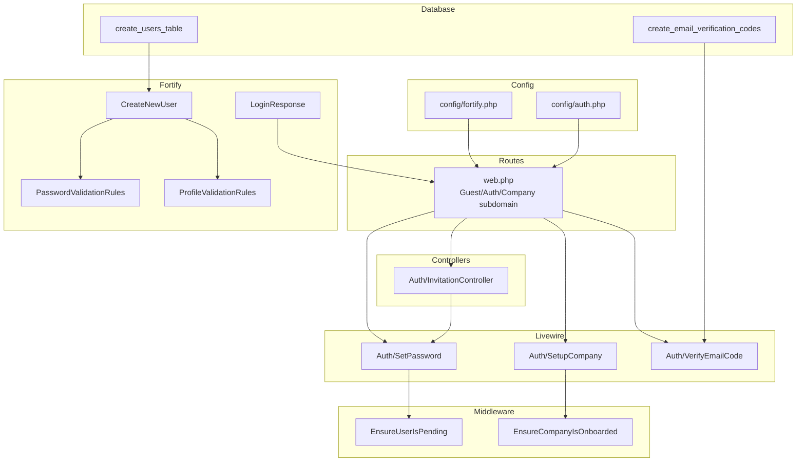
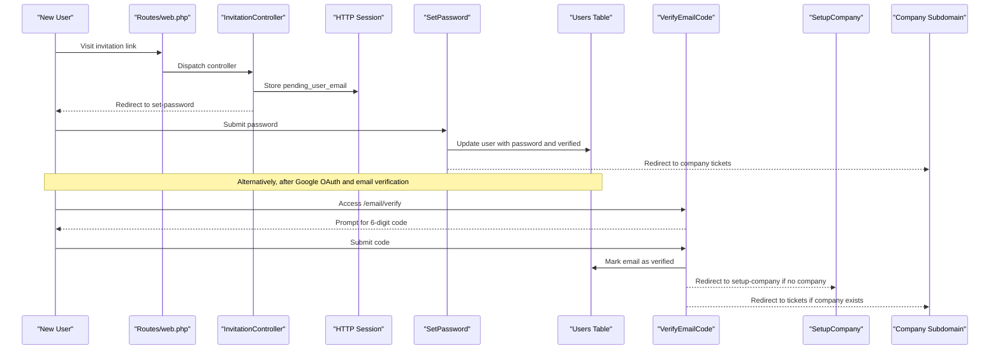
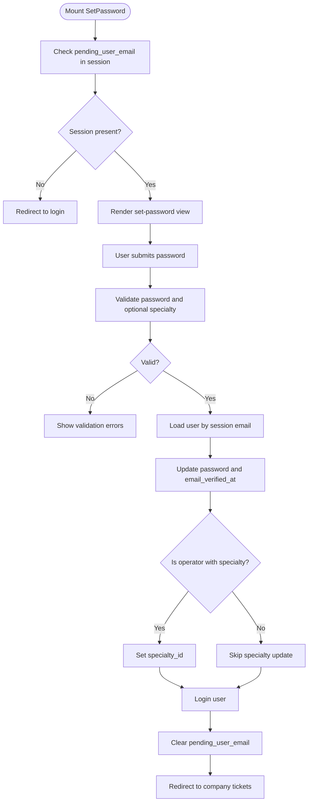
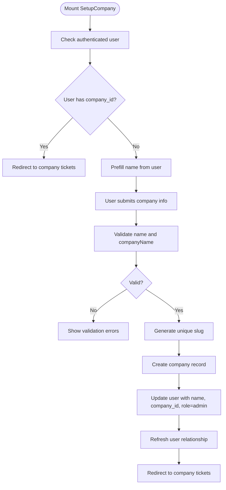
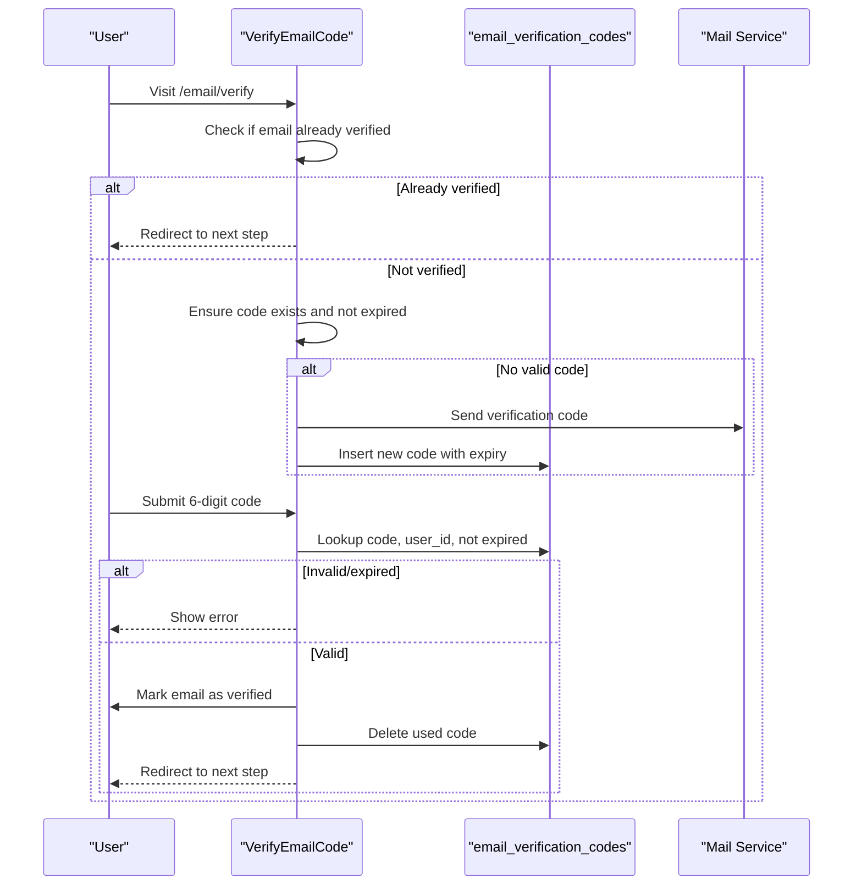
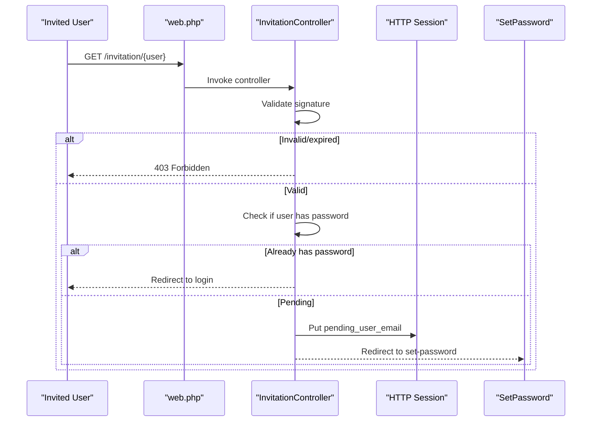
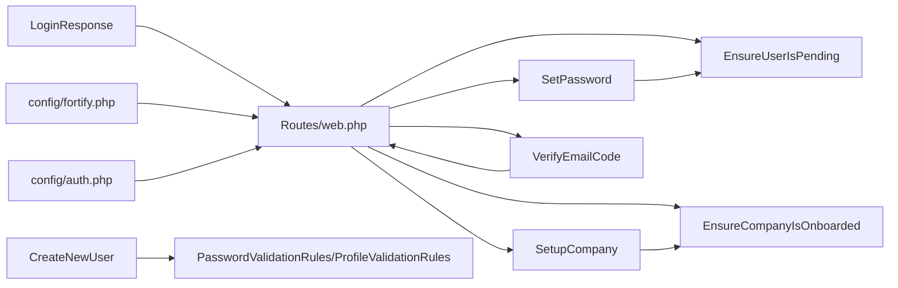

# User Registration & Login

<cite>
**Referenced Files in This Document**
- [SetPassword.php](file://app/Livewire/Auth/SetPassword.php)
- [SetupCompany.php](file://app/Livewire/Auth/SetupCompany.php)
- [VerifyEmailCode.php](file://app/Livewire/Auth/VerifyEmailCode.php)
- [InvitationController.php](file://app/Http/Controllers/Auth/InvitationController.php)
- [EnsureUserIsPending.php](file://app/Http/Middleware/EnsureUserIsPending.php)
- [EnsureCompanyIsOnboarded.php](file://app/Http/Middleware/EnsureCompanyIsOnboarded.php)
- [LoginResponse.php](file://app/Http/Responses/LoginResponse.php)
- [CreateNewUser.php](file://app/Actions/Fortify/CreateNewUser.php)
- [PasswordValidationRules.php](file://app/Concerns/PasswordValidationRules.php)
- [ProfileValidationRules.php](file://app/Concerns/ProfileValidationRules.php)
- [fortify.php](file://config/fortify.php)
- [auth.php](file://config/auth.php)
- [0001_01_01_000000_create_users_table.php](file://database/migrations/0001_01_01_000000_create_users_table.php)
- [2026_03_07_022013_create_email_verification_codes_table.php](file://database/migrations/2026_03_07_022013_create_email_verification_codes_table.php)
- [web.php](file://routes/web.php)
</cite>

## Table of Contents
1. [Introduction](#introduction)
2. [Project Structure](#project-structure)
3. [Core Components](#core-components)
4. [Architecture Overview](#architecture-overview)
5. [Detailed Component Analysis](#detailed-component-analysis)
6. [Dependency Analysis](#dependency-analysis)
7. [Performance Considerations](#performance-considerations)
8. [Troubleshooting Guide](#troubleshooting-guide)
9. [Conclusion](#conclusion)

## Introduction
This document explains the complete user registration and login flow, including initial company setup, email verification, and password creation. It covers the SetPassword Livewire component for setting initial passwords, the SetupCompany component for new company creation, and the email verification workflow with code-based verification and session management. It also documents Fortify configuration options, custom validation rules, and login response handling. Examples of registration flows, password reset procedures, and account activation processes are included, along with security measures such as rate limiting and session management.

## Project Structure
The authentication and onboarding logic spans Livewire components, controllers, middleware, configuration, migrations, and routes. The key areas are:
- Livewire components for onboarding and verification
- Fortify actions and validation traits
- Middleware enforcing pending and onboarding states
- Route groups for guest, authenticated, and subdomain company access
- Database migrations supporting users, sessions, and email verification codes

**Diagram sources**
- [web.php:1-117](file://routes/web.php#L1-L117)
- [SetPassword.php:1-104](file://app/Livewire/Auth/SetPassword.php#L1-L104)
- [SetupCompany.php:1-90](file://app/Livewire/Auth/SetupCompany.php#L1-L90)
- [VerifyEmailCode.php:1-119](file://app/Livewire/Auth/VerifyEmailCode.php#L1-L119)
- [InvitationController.php:1-31](file://app/Http/Controllers/Auth/InvitationController.php#L1-L31)
- [EnsureUserIsPending.php:1-25](file://app/Http/Middleware/EnsureUserIsPending.php#L1-L25)
- [EnsureCompanyIsOnboarded.php:1-28](file://app/Http/Middleware/EnsureCompanyIsOnboarded.php#L1-L28)
- [CreateNewUser.php:1-62](file://app/Actions/Fortify/CreateNewUser.php#L1-L62)
- [PasswordValidationRules.php:1-29](file://app/Concerns/PasswordValidationRules.php#L1-L29)
- [ProfileValidationRules.php:1-51](file://app/Concerns/ProfileValidationRules.php#L1-L51)
- [LoginResponse.php:1-21](file://app/Http/Responses/LoginResponse.php#L1-L21)
- [fortify.php:1-158](file://config/fortify.php#L1-L158)
- [auth.php:1-116](file://config/auth.php#L1-L116)
- [0001_01_01_000000_create_users_table.php:1-59](file://database/migrations/0001_01_01_000000_create_users_table.php#L1-L59)
- [2026_03_07_022013_create_email_verification_codes_table.php:1-31](file://database/migrations/2026_03_07_022013_create_email_verification_codes_table.php#L1-L31)

**Section sources**
- [web.php:1-117](file://routes/web.php#L1-L117)
- [fortify.php:1-158](file://config/fortify.php#L1-L158)
- [auth.php:1-116](file://config/auth.php#L1-L116)

## Core Components
- SetPassword: Handles initial password setting for pending users, validates password and optional specialty for operators, marks email as verified, logs the user in, and redirects to the company’s subdomain tickets page.
- SetupCompany: Creates a new company for a logged-in user, assigns admin role, and redirects to the company’s subdomain tickets page.
- VerifyEmailCode: Manages code-based email verification, resends verification codes, and routes users to either setup-company or the tickets dashboard depending on company association.
- InvitationController: Validates signed invitation links, sets a volatile session flag to unlock SetPassword, and redirects to the password setup flow.
- EnsureUserIsPending: Middleware ensuring only pending users (via session) can access SetPassword.
- EnsureCompanyIsOnboarded: Middleware redirecting users to the onboarding wizard if company onboarding is incomplete.
- LoginResponse: Custom response after login to redirect to the company dashboard or home.
- CreateNewUser: Fortify action that creates a company and admin user during registration.
- Validation traits: Centralized password and profile validation rules.
- Fortify and Auth configs: Define guards, rate limiters, features, and home redirection.

**Section sources**
- [SetPassword.php:1-104](file://app/Livewire/Auth/SetPassword.php#L1-L104)
- [SetupCompany.php:1-90](file://app/Livewire/Auth/SetupCompany.php#L1-L90)
- [VerifyEmailCode.php:1-119](file://app/Livewire/Auth/VerifyEmailCode.php#L1-L119)
- [InvitationController.php:1-31](file://app/Http/Controllers/Auth/InvitationController.php#L1-L31)
- [EnsureUserIsPending.php:1-25](file://app/Http/Middleware/EnsureUserIsPending.php#L1-L25)
- [EnsureCompanyIsOnboarded.php:1-28](file://app/Http/Middleware/EnsureCompanyIsOnboarded.php#L1-L28)
- [LoginResponse.php:1-21](file://app/Http/Responses/LoginResponse.php#L1-L21)
- [CreateNewUser.php:1-62](file://app/Actions/Fortify/CreateNewUser.php#L1-L62)
- [PasswordValidationRules.php:1-29](file://app/Concerns/PasswordValidationRules.php#L1-L29)
- [ProfileValidationRules.php:1-51](file://app/Concerns/ProfileValidationRules.php#L1-L51)
- [fortify.php:1-158](file://config/fortify.php#L1-L158)
- [auth.php:1-116](file://config/auth.php#L1-L116)

## Architecture Overview
The system integrates Fortify for core authentication features, custom Livewire components for onboarding, and middleware to enforce state transitions. Users arrive via invitation or registration, are marked as pending until they set a password, verify their email via code, optionally create a company, and finally land on the company subdomain dashboard.

**Diagram sources**
- [web.php:20-68](file://routes/web.php#L20-L68)
- [InvitationController.php:14-29](file://app/Http/Controllers/Auth/InvitationController.php#L14-L29)
- [SetPassword.php:62-97](file://app/Livewire/Auth/SetPassword.php#L62-L97)
- [VerifyEmailCode.php:26-55](file://app/Livewire/Auth/VerifyEmailCode.php#L26-L55)
- [SetupCompany.php:40-82](file://app/Livewire/Auth/SetupCompany.php#L40-L82)

## Detailed Component Analysis

### SetPassword Component
Purpose: Allow pending users (invited or newly registered) to set their password, optionally select a specialty for operators, mark email as verified, and log in.

Key behaviors:
- Uses a pending user session flag to restrict access.
- Validates password length and confirmation; conditionally validates specialty for operators.
- Updates user with hashed password and email verification timestamp.
- Logs in the user and clears the pending session flag.
- Redirects to the company’s subdomain tickets page.

**Diagram sources**
- [SetPassword.php:27-97](file://app/Livewire/Auth/SetPassword.php#L27-L97)
- [EnsureUserIsPending.php:16-23](file://app/Http/Middleware/EnsureUserIsPending.php#L16-L23)

**Section sources**
- [SetPassword.php:1-104](file://app/Livewire/Auth/SetPassword.php#L1-L104)
- [EnsureUserIsPending.php:1-25](file://app/Http/Middleware/EnsureUserIsPending.php#L1-L25)

### SetupCompany Component
Purpose: Create a company for a logged-in user who does not yet belong to a company, assign admin role, and redirect to the company’s subdomain.

Key behaviors:
- Redirects if the user already belongs to a company.
- Generates a unique slug for the company name.
- Creates the company and updates the user’s name, company_id, and role.
- Redirects to the company subdomain tickets page.

**Diagram sources**
- [SetupCompany.php:25-82](file://app/Livewire/Auth/SetupCompany.php#L25-L82)

**Section sources**
- [SetupCompany.php:1-90](file://app/Livewire/Auth/SetupCompany.php#L1-L90)

### VerifyEmailCode Component
Purpose: Enforce email verification via a 6-digit code with expiration, resend capability, and post-verification routing.

Key behaviors:
- Ensures the user has not already verified their email.
- Sends a code if none exists or is expired.
- Verifies the submitted code against the database with expiration check.
- Marks the email as verified and deletes the used code.
- Redirects to the company’s tickets page if a company exists, otherwise to setup-company.

**Diagram sources**
- [VerifyEmailCode.php:16-112](file://app/Livewire/Auth/VerifyEmailCode.php#L16-L112)
- [2026_03_07_022013_create_email_verification_codes_table.php:14-20](file://database/migrations/2026_03_07_022013_create_email_verification_codes_table.php#L14-L20)

**Section sources**
- [VerifyEmailCode.php:1-119](file://app/Livewire/Auth/VerifyEmailCode.php#L1-L119)
- [2026_03_07_022013_create_email_verification_codes_table.php:1-31](file://database/migrations/2026_03_07_022013_create_email_verification_codes_table.php#L1-L31)

### InvitationController
Purpose: Validate signed invitation links and unlock the SetPassword flow for pending users.

Key behaviors:
- Rejects invalid or expired signatures.
- If the user already has a password, redirects to login with a message.
- Stores the user’s email in a volatile session to enable SetPassword access.
- Redirects to the SetPassword route.

**Diagram sources**
- [web.php:27-30](file://routes/web.php#L27-L30)
- [InvitationController.php:14-29](file://app/Http/Controllers/Auth/InvitationController.php#L14-L29)

**Section sources**
- [InvitationController.php:1-31](file://app/Http/Controllers/Auth/InvitationController.php#L1-L31)
- [web.php:20-38](file://routes/web.php#L20-L38)

### Middleware: EnsureUserIsPending
Purpose: Restrict access to SetPassword to users whose session contains a pending email.

Behavior:
- If the pending session flag is missing, redirect to login.
- Otherwise, allow the request to proceed.

**Section sources**
- [EnsureUserIsPending.php:1-25](file://app/Http/Middleware/EnsureUserIsPending.php#L1-L25)

### Middleware: EnsureCompanyIsOnboarded
Purpose: Redirect users to the onboarding wizard if company onboarding is incomplete.

Behavior:
- If the user’s company exists but onboarding is incomplete, and the current route is not part of onboarding, redirect to the onboarding wizard.
- Otherwise, allow the request to proceed.

**Section sources**
- [EnsureCompanyIsOnboarded.php:1-28](file://app/Http/Middleware/EnsureCompanyIsOnboarded.php#L1-L28)

### LoginResponse
Purpose: Customize post-login redirection.

Behavior:
- If the user belongs to a company, redirect to the company dashboard.
- Otherwise, redirect to the home page.

**Section sources**
- [LoginResponse.php:1-21](file://app/Http/Responses/LoginResponse.php#L1-L21)

### Fortify Configuration and Custom Validation
- Fortify features include registration, password reset, email verification, and two-factor authentication with confirmation.
- Rate limiters for login and two-factor are defined.
- Home path is set to email verification.
- Auth configuration defines guards, providers, and password reset policies.

Custom validation rules:
- PasswordValidationRules: Centralized password rules including confirmation.
- ProfileValidationRules: Name and email uniqueness rules, with optional ignore for updates.

**Section sources**
- [fortify.php:1-158](file://config/fortify.php#L1-L158)
- [auth.php:1-116](file://config/auth.php#L1-L116)
- [PasswordValidationRules.php:1-29](file://app/Concerns/PasswordValidationRules.php#L1-L29)
- [ProfileValidationRules.php:1-51](file://app/Concerns/ProfileValidationRules.php#L1-L51)

### Database Schema Supporting Authentication
- Users table includes company foreign key, email verification timestamp, roles, and indexes.
- Sessions table supports Laravel session driver.
- Email verification codes table stores user-bound codes with expiry.

**Section sources**
- [0001_01_01_000000_create_users_table.php:14-46](file://database/migrations/0001_01_01_000000_create_users_table.php#L14-L46)
- [2026_03_07_022013_create_email_verification_codes_table.php:14-20](file://database/migrations/2026_03_07_022013_create_email_verification_codes_table.php#L14-L20)

## Dependency Analysis
The authentication flow depends on:
- Routes grouping for guest, authenticated, and company subdomains.
- Middleware enforcing pending and onboarding states.
- Livewire components orchestrating user actions.
- Fortify actions and validation traits for secure creation and validation.
- Configurations controlling guards, rate limits, and features.

**Diagram sources**
- [web.php:1-117](file://routes/web.php#L1-L117)
- [EnsureUserIsPending.php:1-25](file://app/Http/Middleware/EnsureUserIsPending.php#L1-L25)
- [EnsureCompanyIsOnboarded.php:1-28](file://app/Http/Middleware/EnsureCompanyIsOnboarded.php#L1-L28)
- [SetPassword.php:1-104](file://app/Livewire/Auth/SetPassword.php#L1-L104)
- [SetupCompany.php:1-90](file://app/Livewire/Auth/SetupCompany.php#L1-L90)
- [VerifyEmailCode.php:1-119](file://app/Livewire/Auth/VerifyEmailCode.php#L1-L119)
- [CreateNewUser.php:1-62](file://app/Actions/Fortify/CreateNewUser.php#L1-L62)
- [PasswordValidationRules.php:1-29](file://app/Concerns/PasswordValidationRules.php#L1-L29)
- [ProfileValidationRules.php:1-51](file://app/Concerns/ProfileValidationRules.php#L1-L51)
- [LoginResponse.php:1-21](file://app/Http/Responses/LoginResponse.php#L1-L21)
- [fortify.php:1-158](file://config/fortify.php#L1-L158)
- [auth.php:1-116](file://config/auth.php#L1-L116)

**Section sources**
- [web.php:1-117](file://routes/web.php#L1-L117)
- [CreateNewUser.php:1-62](file://app/Actions/Fortify/CreateNewUser.php#L1-L62)
- [PasswordValidationRules.php:1-29](file://app/Concerns/PasswordValidationRules.php#L1-L29)
- [ProfileValidationRules.php:1-51](file://app/Concerns/ProfileValidationRules.php#L1-L51)
- [LoginResponse.php:1-21](file://app/Http/Responses/LoginResponse.php#L1-L21)
- [fortify.php:1-158](file://config/fortify.php#L1-L158)
- [auth.php:1-116](file://config/auth.php#L1-L116)

## Performance Considerations
- Use database indexes on user email and company_id to speed up lookups during verification and onboarding.
- Keep rate limiters tuned to prevent brute force attempts on login and verification endpoints.
- Minimize heavy operations in Livewire components; defer to queued jobs when appropriate.
- Cache frequently accessed lists (e.g., ticket categories) for operators to reduce database queries.

[No sources needed since this section provides general guidance]

## Troubleshooting Guide
Common issues and resolutions:
- SetPassword access denied: Ensure the pending user session flag is present; verify the EnsureUserIsPending middleware is applied.
- Email verification failures: Confirm the code exists, is not expired, and matches the user’s record; check mail delivery and database inserts.
- Company setup redirect loop: Verify EnsureCompanyIsOnboarded middleware is not redirecting to onboarding unintentionally; ensure onboarding is completed.
- Login redirect unexpected: Review LoginResponse to ensure company association is correct; confirm guard and provider configurations.
- Registration validation errors: Check centralized validation rules for password and profile fields.

**Section sources**
- [EnsureUserIsPending.php:16-23](file://app/Http/Middleware/EnsureUserIsPending.php#L16-L23)
- [VerifyEmailCode.php:26-55](file://app/Livewire/Auth/VerifyEmailCode.php#L26-L55)
- [EnsureCompanyIsOnboarded.php:16-25](file://app/Http/Middleware/EnsureCompanyIsOnboarded.php#L16-L25)
- [LoginResponse.php:10-19](file://app/Http/Responses/LoginResponse.php#L10-L19)
- [PasswordValidationRules.php:14-17](file://app/Concerns/PasswordValidationRules.php#L14-L17)
- [ProfileValidationRules.php:38-49](file://app/Concerns/ProfileValidationRules.php#L38-L49)

## Conclusion
The system provides a robust, multi-step onboarding experience: invitation acceptance, password setting, email verification, optional company creation, and final redirection to the company subdomain. Fortify handles core authentication features with customizable validation and response handling, while middleware and Livewire components orchestrate state transitions securely and efficiently.

[No sources needed since this section summarizes without analyzing specific files]