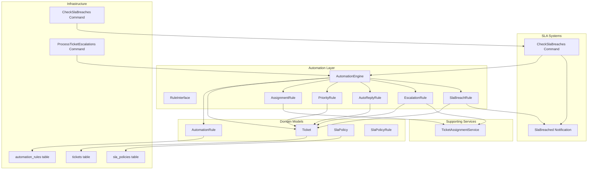
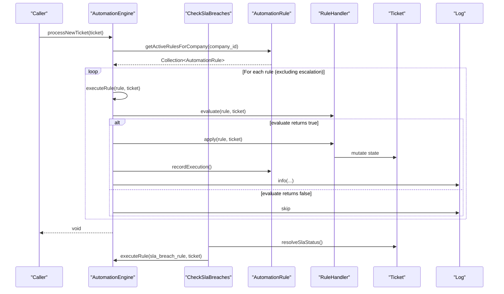
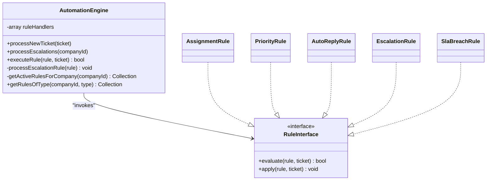
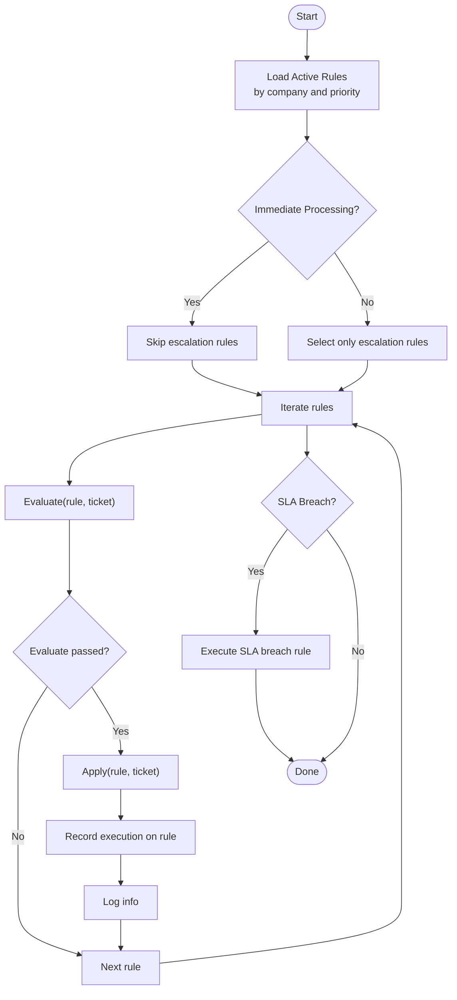
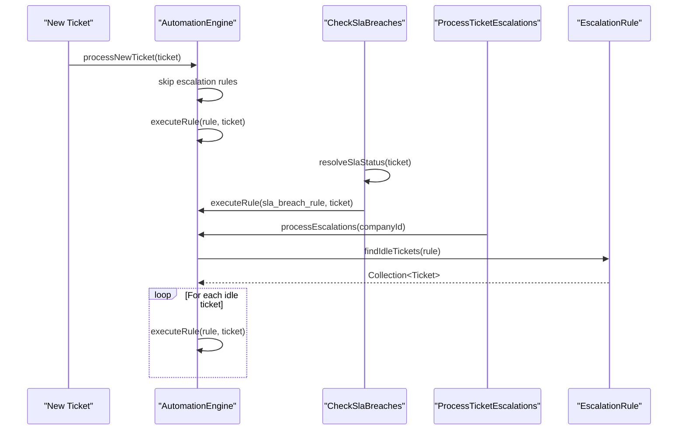
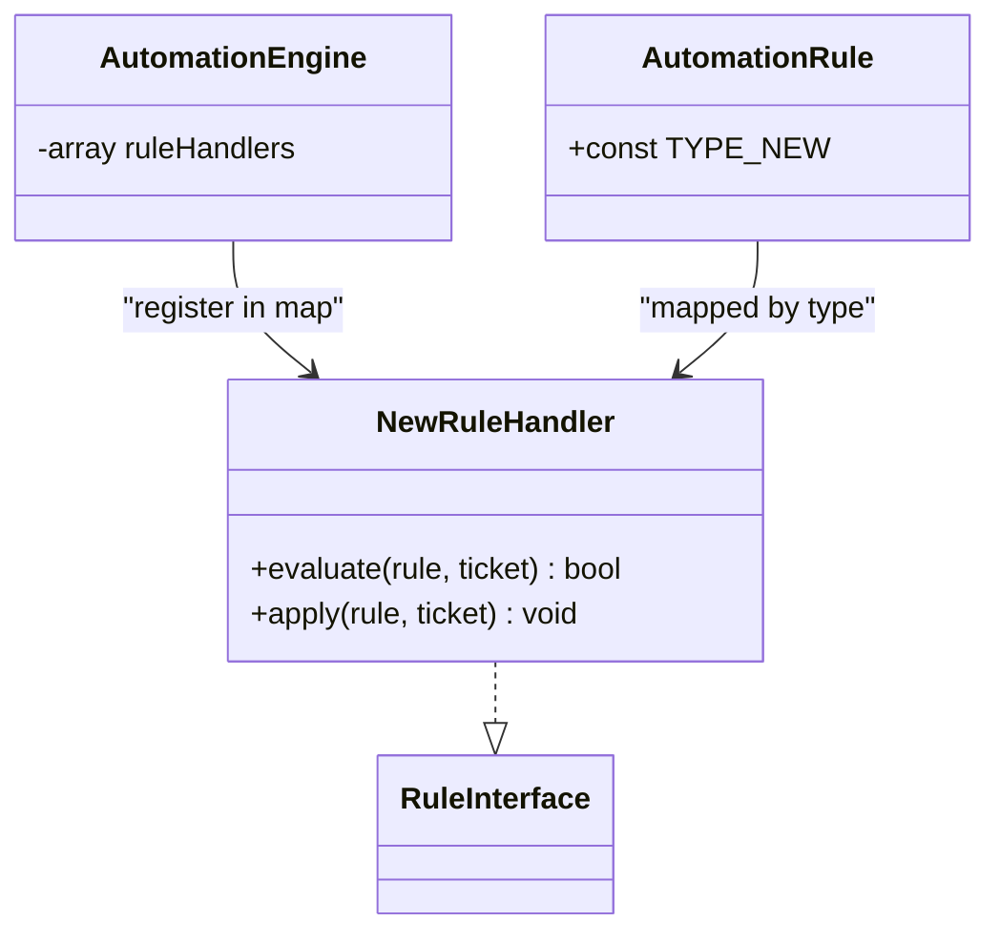
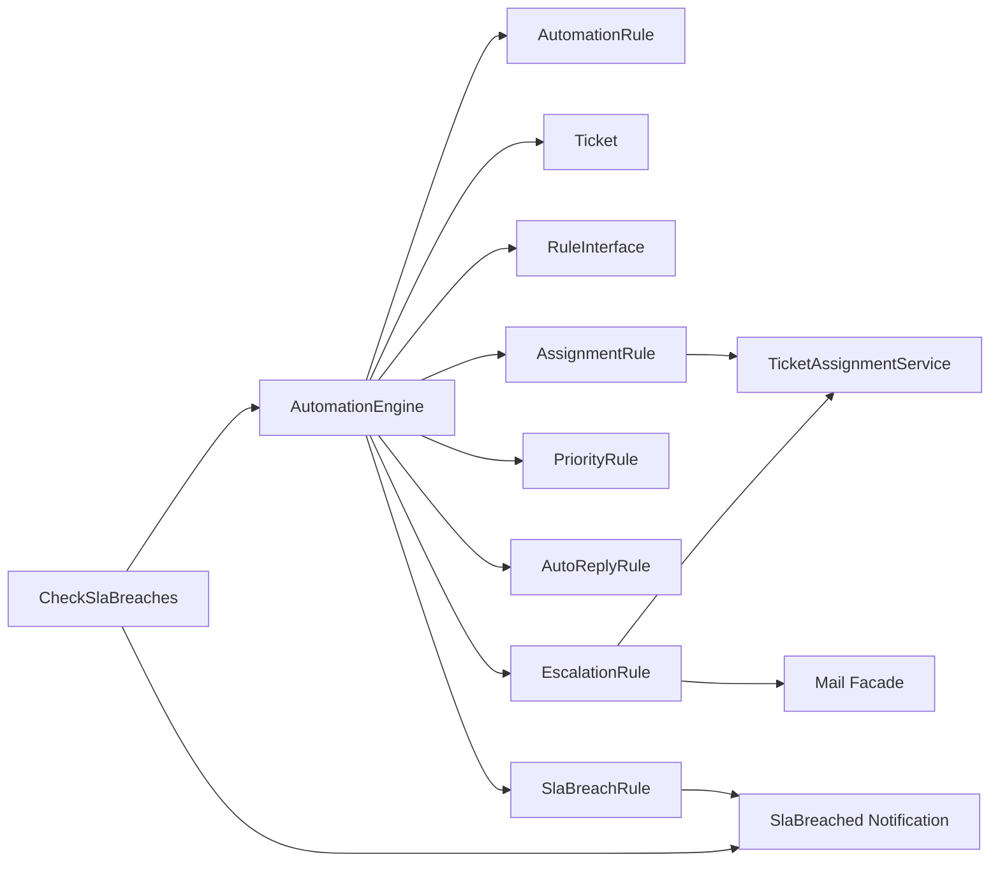
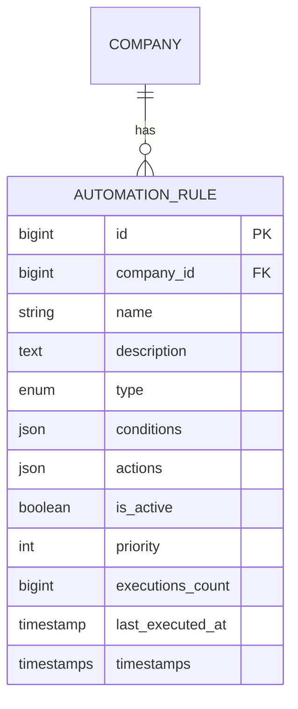
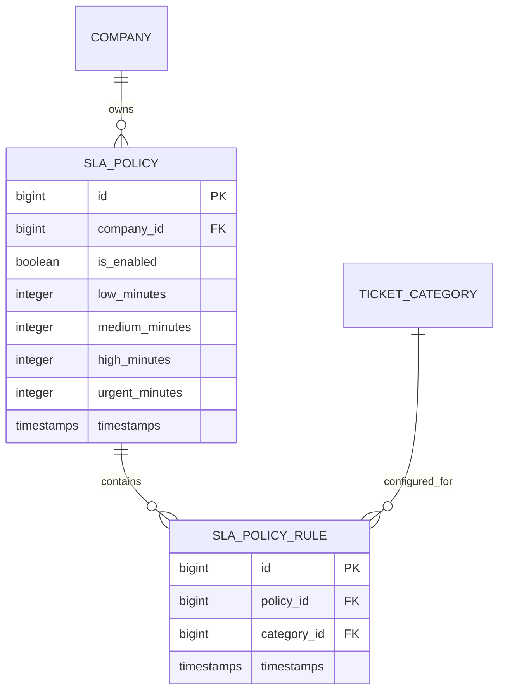

# Automation Engine Overview

<cite>
**Referenced Files in This Document**
- [AutomationEngine.php](file://app/Services/Automation/AutomationEngine.php)
- [RuleInterface.php](file://app/Services/Automation/Rules/RuleInterface.php)
- [AssignmentRule.php](file://app/Services/Automation/Rules/AssignmentRule.php)
- [PriorityRule.php](file://app/Services/Automation/Rules/PriorityRule.php)
- [AutoReplyRule.php](file://app/Services/Automation/Rules/AutoReplyRule.php)
- [EscalationRule.php](file://app/Services/Automation/Rules/EscalationRule.php)
- [SlaBreachRule.php](file://app/Services/Automation/Rules/SlaBreachRule.php)
- [AutomationRule.php](file://app/Models/AutomationRule.php)
- [Ticket.php](file://app/Models/Ticket.php)
- [TicketAssignmentService.php](file://app/Services/TicketAssignmentService.php)
- [CheckSlaBreaches.php](file://app/Console/Commands/CheckSlaBreaches.php)
- [ProcessTicketEscalations.php](file://app/Console/Commands/ProcessTicketEscalations.php)
- [SlaPolicy.php](file://app/Models/SlaPolicy.php)
- [SlaPolicyRule.php](file://app/Models/SlaPolicyRule.php)
- [SlaBreached.php](file://app/Notifications/SlaBreached.php)
- [2026_03_09_104729_create_automation_rules_table.php](file://database/migrations/2026_03_09_104729_create_automation_rules_table.php)
- [2026_03_10_224411_create_sla_policies_table.php](file://database/migrations/2026_03_10_224411_create_sla_policies_table.php)
- [2026_03_10_224414_add_sla_fields_to_tickets_table.php](file://database/migrations/2026_03_10_224414_add_sla_fields_to_tickets_table.php)
- [AutomationEngineTest.php](file://tests/Feature/Services/AutomationEngineTest.php)
</cite>

## Update Summary
**Changes Made**
- Added comprehensive SLA policy integration with new SlaBreachRule
- Enhanced assignment logic with improved team-based assignment and category hierarchy support
- Updated rule processing workflow to handle SLA breach detection and automation
- Added new SLA monitoring command and notification system
- Extended automation rule types with SLA Breach capability

## Table of Contents
1. [Introduction](#introduction)
2. [Project Structure](#project-structure)
3. [Core Components](#core-components)
4. [Architecture Overview](#architecture-overview)
5. [Detailed Component Analysis](#detailed-component-analysis)
6. [Dependency Analysis](#dependency-analysis)
7. [Performance Considerations](#performance-considerations)
8. [Troubleshooting Guide](#troubleshooting-guide)
9. [Conclusion](#conclusion)
10. [Appendices](#appendices)

## Introduction
This document explains the automation engine architecture that powers rule-driven ticket processing in the helpdesk system. It focuses on the central AutomationEngine orchestrator, the RuleInterface contract, the rule handler registration system, and how different rule types are mapped to their handlers. It also covers the rule evaluation lifecycle, separation between immediate and scheduled processing, logging and error handling, performance considerations, and extensibility points for adding new rule types. The system now includes comprehensive SLA policy integration with automatic breach detection and escalation capabilities.

## Project Structure
The automation engine lives under Services/Automation and is composed of:
- A central orchestrator (AutomationEngine)
- A shared interface for rule handlers (RuleInterface)
- Concrete rule handlers (AssignmentRule, PriorityRule, AutoReplyRule, EscalationRule, SlaBreachRule)
- Supporting models (AutomationRule, Ticket, SlaPolicy, SlaPolicyRule)
- A dedicated service for assignment logic (TicketAssignmentService)
- SLA monitoring and breach detection systems
- Console commands for escalation and SLA processing
- Database schema for automation rules and SLA policies

**Diagram sources**
- [AutomationEngine.php:15-144](file://app/Services/Automation/AutomationEngine.php#L15-L144)
- [RuleInterface.php:8-19](file://app/Services/Automation/Rules/RuleInterface.php#L8-L19)
- [AssignmentRule.php:9-66](file://app/Services/Automation/Rules/AssignmentRule.php#L9-L66)
- [PriorityRule.php:9-68](file://app/Services/Automation/Rules/PriorityRule.php#L9-L68)
- [AutoReplyRule.php:10-64](file://app/Services/Automation/Rules/AutoReplyRule.php#L10-L64)
- [EscalationRule.php:12-156](file://app/Services/Automation/Rules/EscalationRule.php#L12-L156)
- [SlaBreachRule.php:12-78](file://app/Services/Automation/Rules/SlaBreachRule.php#L12-L78)
- [AutomationRule.php:22-126](file://app/Models/AutomationRule.php#L22-L126)
- [Ticket.php:9-121](file://app/Models/Ticket.php#L9-L121)
- [TicketAssignmentService.php:12-331](file://app/Services/TicketAssignmentService.php#L12-L331)
- [CheckSlaBreaches.php:13-132](file://app/Console/Commands/CheckSlaBreaches.php#L13-L132)
- [ProcessTicketEscalations.php:9-54](file://app/Console/Commands/ProcessTicketEscalations.php#L9-L54)
- [SlaPolicy.php:8-43](file://app/Models/SlaPolicy.php#L8-L43)
- [SlaPolicyRule.php:8-21](file://app/Models/SlaPolicyRule.php#L8-L21)
- [SlaBreached.php:9-49](file://app/Notifications/SlaBreached.php#L9-L49)
- [2026_03_09_104729_create_automation_rules_table.php:14-42](file://database/migrations/2026_03_09_104729_create_automation_rules_table.php#L14-L42)
- [2026_03_10_224411_create_sla_policies_table.php:14-33](file://database/migrations/2026_03_10_224411_create_sla_policies_table.php#L14-L33)
- [2026_03_10_224414_add_sla_fields_to_tickets_table.php:14-19](file://database/migrations/2026_03_10_224414_add_sla_fields_to_tickets_table.php#L14-L19)

**Section sources**
- [AutomationEngine.php:15-144](file://app/Services/Automation/AutomationEngine.php#L15-L144)
- [RuleInterface.php:8-19](file://app/Services/Automation/Rules/RuleInterface.php#L8-L19)
- [AutomationRule.php:22-126](file://app/Models/AutomationRule.php#L22-L126)
- [Ticket.php:9-121](file://app/Models/Ticket.php#L9-L121)
- [TicketAssignmentService.php:12-331](file://app/Services/TicketAssignmentService.php#L12-L331)
- [ProcessTicketEscalations.php:9-54](file://app/Console/Commands/ProcessTicketEscalations.php#L9-L54)
- [CheckSlaBreaches.php:13-132](file://app/Console/Commands/CheckSlaBreaches.php#L13-L132)
- [SlaPolicy.php:8-43](file://app/Models/SlaPolicy.php#L8-L43)
- [SlaPolicyRule.php:8-21](file://app/Models/SlaPolicyRule.php#L8-L21)
- [SlaBreached.php:9-49](file://app/Notifications/SlaBreached.php#L9-L49)
- [2026_03_09_104729_create_automation_rules_table.php:14-42](file://database/migrations/2026_03_09_104729_create_automation_rules_table.php#L14-L42)
- [2026_03_10_224411_create_sla_policies_table.php:14-33](file://database/migrations/2026_03_10_224411_create_sla_policies_table.php#L14-L33)
- [2026_03_10_224414_add_sla_fields_to_tickets_table.php:14-19](file://database/migrations/2026_03_10_224414_add_sla_fields_to_tickets_table.php#L14-L19)

## Core Components
- AutomationEngine: Central orchestrator that discovers, filters, evaluates, and executes rules. It separates immediate processing (for new tickets) from scheduled processing (for escalation rules) and now includes SLA breach rule processing.
- RuleInterface: Contract defining evaluate(rule, ticket) and apply(rule, ticket) for all rule handlers.
- Rule Handlers: Concrete implementations for assignment, priority change, auto reply, escalation, and SLA breach detection.
- AutomationRule: Eloquent model representing persisted rules with conditions, actions, activation, priority, and execution tracking.
- Ticket: Domain model for tickets with SLA fields (due_time, sla_status) used by rules.
- TicketAssignmentService: Service encapsulating enhanced assignment logic including specialists vs generalists, team assignment, and category hierarchy support.
- SLA Systems: Comprehensive SLA policy management with breach detection, notification system, and monitoring command.
- ProcessTicketEscalations: Artisan command to trigger escalation processing across companies.
- CheckSlaBreaches: Artisan command to monitor SLA status and trigger SLA breach automation rules.

**Section sources**
- [AutomationEngine.php:15-144](file://app/Services/Automation/AutomationEngine.php#L15-L144)
- [RuleInterface.php:8-19](file://app/Services/Automation/Rules/RuleInterface.php#L8-L19)
- [AutomationRule.php:22-126](file://app/Models/AutomationRule.php#L22-L126)
- [Ticket.php:9-121](file://app/Models/Ticket.php#L9-L121)
- [TicketAssignmentService.php:12-331](file://app/Services/TicketAssignmentService.php#L12-L331)
- [ProcessTicketEscalations.php:9-54](file://app/Console/Commands/ProcessTicketEscalations.php#L9-L54)
- [CheckSlaBreaches.php:13-132](file://app/Console/Commands/CheckSlaBreaches.php#L13-L132)
- [SlaPolicy.php:8-43](file://app/Models/SlaPolicy.php#L8-L43)
- [SlaBreached.php:9-49](file://app/Notifications/SlaBreached.php#L9-L49)

## Architecture Overview
The automation engine follows a handler registry pattern with enhanced SLA integration:
- A typed map associates rule types to handler classes, including the new SlaBreachRule.
- Immediate processing (new tickets) excludes escalation rules and runs inline.
- Scheduled processing (escalations) is invoked via a console command and scans idle tickets.
- SLA monitoring runs independently to detect breaches and trigger appropriate automation rules.
- Enhanced assignment logic supports category hierarchy, team-based assignment, and improved load balancing.

**Diagram sources**
- [AutomationEngine.php:28-98](file://app/Services/Automation/AutomationEngine.php#L28-L98)
- [CheckSlaBreaches.php:32-89](file://app/Console/Commands/CheckSlaBreaches.php#L32-L89)
- [AutomationRule.php:66-91](file://app/Models/AutomationRule.php#L66-L91)
- [AssignmentRule.php:15-48](file://app/Services/Automation/Rules/AssignmentRule.php#L15-L48)
- [PriorityRule.php:11-52](file://app/Services/Automation/Rules/PriorityRule.php#L11-L52)
- [AutoReplyRule.php:12-48](file://app/Services/Automation/Rules/AutoReplyRule.php#L12-L48)
- [EscalationRule.php:24-60](file://app/Services/Automation/Rules/EscalationRule.php#L24-L60)
- [SlaBreachRule.php:17-26](file://app/Services/Automation/Rules/SlaBreachRule.php#L17-L26)

## Detailed Component Analysis

### AutomationEngine
Responsibilities:
- Register rule handlers via a type-to-class map, including SlaBreachRule.
- Immediate processing: fetch active rules for a company, filter out escalations, and execute each rule against the ticket.
- Scheduled processing: fetch only escalation rules and process idle tickets.
- SLA breach processing: integrate with CheckSlaBreaches command for breach detection.
- Centralized execution: evaluate then apply, with robust logging and error handling.
- Utility methods to fetch rules by type and company, and to order by priority.

Key behaviors:
- Immediate processing excludes escalation rules to prevent redundant processing.
- Execution tracking updates rule metrics after successful apply.
- Logging provides visibility for rule execution and failures.
- Enhanced handler registration supports all rule types including SLA breach rules.

**Diagram sources**
- [AutomationEngine.php:15-144](file://app/Services/Automation/AutomationEngine.php#L15-L144)
- [RuleInterface.php:8-19](file://app/Services/Automation/Rules/RuleInterface.php#L8-L19)
- [AssignmentRule.php:9-66](file://app/Services/Automation/Rules/AssignmentRule.php#L9-L66)
- [PriorityRule.php:9-68](file://app/Services/Automation/Rules/PriorityRule.php#L9-L68)
- [AutoReplyRule.php:10-64](file://app/Services/Automation/Rules/AutoReplyRule.php#L10-L64)
- [EscalationRule.php:12-156](file://app/Services/Automation/Rules/EscalationRule.php#L12-L156)
- [SlaBreachRule.php:12-78](file://app/Services/Automation/Rules/SlaBreachRule.php#L12-L78)

**Section sources**
- [AutomationEngine.php:15-144](file://app/Services/Automation/AutomationEngine.php#L15-L144)

### RuleInterface
Contract:
- evaluate(rule, ticket): returns true if conditions match for the given ticket.
- apply(rule, ticket): performs the action(s) defined by the rule.

This ensures all rule handlers implement a consistent evaluation and application lifecycle, including the new SlaBreachRule.

**Section sources**
- [RuleInterface.php:8-19](file://app/Services/Automation/Rules/RuleInterface.php#L8-L19)

### Rule Handler Registration System
AutomationEngine maintains a type-to-handler map:
- assignment -> AssignmentRule
- priority -> PriorityRule
- auto_reply -> AutoReplyRule
- escalation -> EscalationRule
- sla_breach -> SlaBreachRule

This enables dynamic dispatch based on rule.type and allows easy extension by adding new entries, supporting the comprehensive SLA breach automation system.

**Section sources**
- [AutomationEngine.php:18-27](file://app/Services/Automation/AutomationEngine.php#L18-L27)

### Rule Types and Handlers

#### AssignmentRule
- Purpose: Auto-assign tickets to specialists or operators based on category and priority.
- Evaluation: Skips if ticket is already assigned or not verified; checks category and priority conditions.
- Application: Either assigns via enhanced TicketAssignmentService or directly to a specific operator.
- Enhanced: Now supports team assignment and category hierarchy matching.

**Section sources**
- [AssignmentRule.php:9-66](file://app/Services/Automation/Rules/AssignmentRule.php#L9-L66)
- [TicketAssignmentService.php:22-94](file://app/Services/TicketAssignmentService.php#L22-L94)

#### PriorityRule
- Purpose: Change ticket priority based on keywords, category, and current priority.
- Evaluation: Requires verified ticket; checks keywords and category; enforces current priority constraints.
- Application: Sets priority to a valid level if configured.

**Section sources**
- [PriorityRule.php:9-68](file://app/Services/Automation/Rules/PriorityRule.php#L9-L68)

#### AutoReplyRule
- Purpose: Send automated replies to customers upon ticket creation or based on conditions.
- Evaluation: Requires verified ticket; optionally restricts to newly created tickets; checks category and priority.
- Application: Queues an email with configurable subject/message.

**Section sources**
- [AutoReplyRule.php:10-64](file://app/Services/Automation/Rules/AutoReplyRule.php#L10-L64)

#### EscalationRule
- Purpose: Handle scheduled escalation of idle tickets.
- Evaluation: Checks status, idle duration, category; prevents escalating already urgent tickets unless notifying admins.
- Application: Escalates priority, sets specific priority, notifies admins, and optionally reassigns.
- Specialized scanning: findIdleTickets collects tickets meeting criteria for batch processing.

**Section sources**
- [EscalationRule.php:12-156](file://app/Services/Automation/Rules/EscalationRule.php#L12-L156)

#### SlaBreachRule
- Purpose: Handle SLA breach automation including priority escalation, operator reassignment, and admin notification.
- Evaluation: Checks category match and automatically applies to breached tickets from scheduler.
- Application: Supports assign_to_operator_id, escalate_priority, set_priority, and notify_admin actions.
- Integration: Works seamlessly with SLA monitoring system and existing automation rules.

**Section sources**
- [SlaBreachRule.php:12-78](file://app/Services/Automation/Rules/SlaBreachRule.php#L12-L78)

### SLA Policy Integration

#### SlaPolicy and SlaPolicyRule Models
- SlaPolicy: Manages company-wide SLA settings including low, medium, high, and urgent time thresholds.
- SlaPolicyRule: Links specific ticket categories to SLA policies for granular control.
- Enhanced: Supports lifecycle settings and comprehensive SLA configuration per company.

#### SLA Monitoring System
- CheckSlaBreaches Command: Monitors open tickets for SLA status changes and triggers automation rules.
- Status Resolution: Determines on_time, at_risk, or breached status based on due_time and SLA thresholds.
- Notification: Sends SLA breach notifications to assigned operators and administrators.

**Section sources**
- [SlaPolicy.php:8-43](file://app/Models/SlaPolicy.php#L8-L43)
- [SlaPolicyRule.php:8-21](file://app/Models/SlaPolicyRule.php#L8-L21)
- [CheckSlaBreaches.php:13-132](file://app/Console/Commands/CheckSlaBreaches.php#L13-L132)
- [SlaBreached.php:9-49](file://app/Notifications/SlaBreached.php#L9-L49)

### Rule Evaluation Lifecycle
End-to-end flow:
1. Discovery: Retrieve active rules for the company, ordered by priority.
2. Filtering: Exclude escalations during immediate processing; select escalations for scheduled processing.
3. Evaluation: Each handler's evaluate determines if the rule applies.
4. Application: If evaluate passes, apply mutates the ticket and persists execution metrics.
5. Completion Tracking: AutomationRule.recordExecution increments executions_count and updates last_executed_at.
6. Logging: Info logs successful executions; warning/error logs indicate missing handlers or exceptions.
7. SLA Integration: SLA breach rules are triggered automatically by SLA monitoring system.

**Diagram sources**
- [AutomationEngine.php:28-98](file://app/Services/Automation/AutomationEngine.php#L28-L98)
- [CheckSlaBreaches.php:32-89](file://app/Console/Commands/CheckSlaBreaches.php#L32-L89)
- [AutomationRule.php:94-100](file://app/Models/AutomationRule.php#L94-L100)
- [SlaBreachRule.php:17-26](file://app/Services/Automation/Rules/SlaBreachRule.php#L17-L26)

**Section sources**
- [AutomationEngine.php:28-98](file://app/Services/Automation/AutomationEngine.php#L28-L98)
- [CheckSlaBreaches.php:32-89](file://app/Console/Commands/CheckSlaBreaches.php#L32-L89)
- [AutomationRule.php:94-100](file://app/Models/AutomationRule.php#L94-L100)

### Separation Between Immediate and Scheduled Processing
- Immediate processing (new tickets):
  - Called from the ticket creation flow.
  - Excludes escalation rules to avoid duplication with scheduled processing.
  - Executes evaluate and apply inline for fast response.
  - Includes SLA breach rule evaluation for newly created tickets.
- Scheduled processing (escalations):
  - Triggered by a console command.
  - Loads only escalation rules and scans idle tickets.
  - Applies escalation actions and can notify administrators.
- SLA monitoring:
  - Runs independently to detect SLA status changes.
  - Triggers SLA breach automation rules automatically.

**Diagram sources**
- [AutomationEngine.php:28-54](file://app/Services/Automation/AutomationEngine.php#L28-L54)
- [CheckSlaBreaches.php:32-89](file://app/Console/Commands/CheckSlaBreaches.php#L32-L89)
- [ProcessTicketEscalations.php:29-53](file://app/Console/Commands/ProcessTicketEscalations.php#L29-L53)
- [EscalationRule.php:92-113](file://app/Services/Automation/Rules/EscalationRule.php#L92-L113)

**Section sources**
- [AutomationEngine.php:28-54](file://app/Services/Automation/AutomationEngine.php#L28-L54)
- [CheckSlaBreaches.php:32-89](file://app/Console/Commands/CheckSlaBreaches.php#L32-L89)
- [ProcessTicketEscalations.php:29-53](file://app/Console/Commands/ProcessTicketEscalations.php#L29-L53)
- [EscalationRule.php:92-113](file://app/Services/Automation/Rules/EscalationRule.php#L92-L113)

### Enhanced Assignment Logic
The TicketAssignmentService has been significantly enhanced to support:
- Category hierarchy matching: Searches for specialists in both exact category and parent category.
- Team-based assignment: Assigns tickets to team members with specialty matching.
- Improved load balancing: Considers assigned ticket counts and last_assigned_at for fair distribution.
- Enhanced fallback logic: Graceful handling when no specialists are available.
- Transaction-safe operations: Ensures consistency during assignment operations.

**Section sources**
- [TicketAssignmentService.php:23-93](file://app/Services/TicketAssignmentService.php#L23-L93)
- [TicketAssignmentService.php:159-211](file://app/Services/TicketAssignmentService.php#L159-L211)
- [TicketAssignmentService.php:216-231](file://app/Services/TicketAssignmentService.php#L216-L231)

### Logging and Error Handling
- Warning: No handler found for a rule type.
- Info: Successful rule execution with rule and ticket identifiers.
- Error: Exceptions during apply include rule and ticket identifiers plus error message.
- SLA-specific logging: Detailed SLA breach detection and notification logging.
- Logging uses the framework's logging facility.

**Section sources**
- [AutomationEngine.php:64-95](file://app/Services/Automation/AutomationEngine.php#L64-L95)
- [CheckSlaBreaches.php:71-78](file://app/Console/Commands/CheckSlaBreaches.php#L71-L78)

### Performance Considerations
- Rule ordering: Rules are fetched ordered by priority, ensuring deterministic application.
- Minimal overhead: Handlers perform lightweight checks before applying actions.
- Batch escalation: EscalationRule.findIdleTickets retrieves eligible tickets in bulk to reduce repeated queries.
- Queueing: AutoReplyRule queues emails to avoid blocking synchronous processing.
- Transaction-safe assignments: TicketAssignmentService wraps assignments in transactions to maintain consistency.
- SLA monitoring optimization: CheckSlaBreaches processes tickets in batches and caches admin users by company.
- Database indexing: SLA fields (due_time, sla_status) are indexed for efficient querying.

**Section sources**
- [AutomationEngine.php:118-125](file://app/Services/Automation/AutomationEngine.php#L118-L125)
- [EscalationRule.php:92-113](file://app/Services/Automation/Rules/EscalationRule.php#L92-L113)
- [AutoReplyRule.php:61-62](file://app/Services/Automation/Rules/AutoReplyRule.php#L61-L62)
- [TicketAssignmentService.php:101-108](file://app/Services/TicketAssignmentService.php#L101-L108)
- [CheckSlaBreaches.php:79-85](file://app/Console/Commands/CheckSlaBreaches.php#L79-L85)
- [2026_03_10_224414_add_sla_fields_to_tickets_table.php:17-18](file://database/migrations/2026_03_10_224414_add_sla_fields_to_tickets_table.php#L17-L18)

### Extensibility Points
To add a new rule type:
1. Define a new handler class implementing RuleInterface.
2. Add a new constant in AutomationRule for the rule type.
3. Register the handler in AutomationEngine's ruleHandlers map.
4. Extend the database schema if new conditions/actions require persistence.
5. Write tests verifying evaluation and application logic.
6. Integrate with SLA monitoring system if applicable.

**Diagram sources**
- [AutomationEngine.php:18-27](file://app/Services/Automation/AutomationEngine.php#L18-L27)
- [AutomationRule.php:27-33](file://app/Models/AutomationRule.php#L27-L33)
- [RuleInterface.php:8-19](file://app/Services/Automation/Rules/RuleInterface.php#L8-L19)

**Section sources**
- [AutomationEngine.php:18-27](file://app/Services/Automation/AutomationEngine.php#L18-L27)
- [AutomationRule.php:27-33](file://app/Models/AutomationRule.php#L27-L33)

## Dependency Analysis
- AutomationEngine depends on:
  - AutomationRule (persistence, scopes, execution tracking)
  - Ticket (domain model for evaluation and mutation)
  - RuleInterface implementations (AssignmentRule, PriorityRule, AutoReplyRule, EscalationRule, SlaBreachRule)
  - TicketAssignmentService (enhanced assignment logic)
  - CheckSlaBreaches (SLA monitoring)
  - Logging facility (info/warning/error)
- SlaBreachRule additionally depends on:
  - SlaBreached notification system
  - User model for admin notifications
  - Ticket model for SLA status updates
- EscalationRule additionally depends on:
  - TicketAssignmentService for reassignment
  - Mail infrastructure for notifications

**Diagram sources**
- [AutomationEngine.php:5-13](file://app/Services/Automation/AutomationEngine.php#L5-L13)
- [AssignmentRule.php:7](file://app/Services/Automation/Rules/AssignmentRule.php#L7)
- [EscalationRule.php:5-10](file://app/Services/Automation/Rules/EscalationRule.php#L5-L10)
- [SlaBreachRule.php:8](file://app/Services/Automation/Rules/SlaBreachRule.php#L8)

**Section sources**
- [AutomationEngine.php:5-13](file://app/Services/Automation/AutomationEngine.php#L5-L13)
- [AssignmentRule.php:7](file://app/Services/Automation/Rules/AssignmentRule.php#L7)
- [EscalationRule.php:5-10](file://app/Services/Automation/Rules/EscalationRule.php#L5-L10)
- [SlaBreachRule.php:8](file://app/Services/Automation/Rules/SlaBreachRule.php#L8)

## Performance Considerations
- Fetch only active rules and order by priority to minimize unnecessary evaluations.
- Use database indexes on company_id, is_active, type, and priority for efficient queries.
- Queue emails (auto reply) to avoid blocking synchronous processing.
- Batch escalation scanning reduces repeated database queries for idle tickets.
- Transactional assignments ensure consistency and prevent race conditions.
- SLA monitoring optimizes by caching admin users and processing in batches.
- SLA field indexing improves breach detection performance.
- Enhanced assignment logic minimizes database queries through efficient categorization.

**Section sources**
- [AutomationEngine.php:118-125](file://app/Services/Automation/AutomationEngine.php#L118-L125)
- [2026_03_09_104729_create_automation_rules_table.php:39-41](file://database/migrations/2026_03_09_104729_create_automation_rules_table.php#L39-L41)
- [AutoReplyRule.php:61-62](file://app/Services/Automation/Rules/AutoReplyRule.php#L61-L62)
- [EscalationRule.php:92-113](file://app/Services/Automation/Rules/EscalationRule.php#L92-L113)
- [TicketAssignmentService.php:101-108](file://app/Services/TicketAssignmentService.php#L101-L108)
- [CheckSlaBreaches.php:79-85](file://app/Console/Commands/CheckSlaBreaches.php#L79-L85)
- [2026_03_10_224414_add_sla_fields_to_tickets_table.php:17-18](file://database/migrations/2026_03_10_224414_add_sla_fields_to_tickets_table.php#L17-L18)

## Troubleshooting Guide
Common issues and diagnostics:
- No handler found for rule type:
  - Symptom: Warning logged indicating missing handler.
  - Action: Ensure the rule type is registered in AutomationEngine and the handler class exists.
- Exception during apply:
  - Symptom: Error logged with rule and ticket identifiers and error message.
  - Action: Inspect handler logic and dependencies; verify permissions and data validity.
- Escalation not triggered:
  - Symptom: Idle tickets remain unchanged.
  - Action: Confirm the console command is scheduled and executed; verify escalation rule conditions and statuses.
- Auto reply not sent:
  - Symptom: Customer did not receive an email.
  - Action: Check queue worker status and verify AutoReplyRule conditions and actions.
- SLA breach not detected:
  - Symptom: Tickets remain on_time despite being overdue.
  - Action: Verify CheckSlaBreaches command is running; check SLA policy configuration and due_time values.
- SLA breach rule not executing:
  - Symptom: SLA breach notifications sent but no priority escalation occurs.
  - Action: Check SLA breach rule actions configuration and verify ticket category matching.
- Assignment logic issues:
  - Symptom: Tickets not assigned to expected specialists or teams.
  - Action: Verify category hierarchy, team membership, and assignment service configuration.

**Section sources**
- [AutomationEngine.php:64-95](file://app/Services/Automation/AutomationEngine.php#L64-L95)
- [ProcessTicketEscalations.php:29-53](file://app/Console/Commands/ProcessTicketEscalations.php#L29-L53)
- [AutoReplyRule.php:54-63](file://app/Services/Automation/Rules/AutoReplyRule.php#L54-L63)
- [CheckSlaBreaches.php:32-89](file://app/Console/Commands/CheckSlaBreaches.php#L32-L89)
- [TicketAssignmentService.php:57-93](file://app/Services/TicketAssignmentService.php#L57-L93)

## Conclusion
The automation engine provides a clean, extensible framework for rule-driven ticket processing with comprehensive SLA integration. Its central orchestrator coordinates evaluation and application across multiple rule types while maintaining separation between immediate and scheduled processing. The enhanced assignment logic supports sophisticated category hierarchy and team-based assignment strategies. The new SLA breach detection system provides automated escalation and notification capabilities. Robust logging, error handling, and performance-conscious design enable reliable operation at scale. Adding new rule types requires minimal changes to the handler registry and a small amount of handler logic, preserving system cohesion and maintainability.

## Appendices

### Data Model for Automation Rules
The automation_rules table stores rule metadata, conditions, actions, activation, priority, and execution tracking.

**Diagram sources**
- [2026_03_09_104729_create_automation_rules_table.php:14-42](file://database/migrations/2026_03_09_104729_create_automation_rules_table.php#L14-L42)
- [AutomationRule.php:55](file://app/Models/AutomationRule.php#L55)

**Section sources**
- [2026_03_09_104729_create_automation_rules_table.php:14-42](file://database/migrations/2026_03_09_104729_create_automation_rules_table.php#L14-L42)
- [AutomationRule.php:55](file://app/Models/AutomationRule.php#L55)

### SLA Policy Data Model
The SLA policy system manages company-wide SLA settings and category-specific configurations.

**Diagram sources**
- [2026_03_10_224411_create_sla_policies_table.php:14-33](file://database/migrations/2026_03_10_224411_create_sla_policies_table.php#L14-L33)
- [SlaPolicy.php:34-43](file://app/Models/SlaPolicy.php#L34-L43)
- [SlaPolicyRule.php:12-20](file://app/Models/SlaPolicyRule.php#L12-L20)

**Section sources**
- [2026_03_10_224411_create_sla_policies_table.php:14-33](file://database/migrations/2026_03_10_224411_create_sla_policies_table.php#L14-L33)
- [SlaPolicy.php:34-43](file://app/Models/SlaPolicy.php#L34-L43)
- [SlaPolicyRule.php:12-20](file://app/Models/SlaPolicyRule.php#L12-L20)

### Test Coverage Highlights
- Assignment rule application on new tickets with enhanced logic.
- Priority rule application based on keywords.
- Auto reply email queuing.
- Escalation rule finding idle tickets and notifying admins.
- SLA breach rule escalates ticket priority and notifies admins.
- SLA monitoring detects breaches and triggers automation rules.
- Team assignment logic with category hierarchy support.
- Rule execution counting and timing.

**Section sources**
- [AutomationEngineTest.php:19-47](file://tests/Feature/Services/AutomationEngineTest.php#L19-L47)
- [AutomationEngineTest.php:49-95](file://tests/Feature/Services/AutomationEngineTest.php#L49-L95)
- [AutomationEngineTest.php:97-123](file://tests/Feature/Services/AutomationEngineTest.php#L97-L123)
- [AutomationEngineTest.php:209-241](file://tests/Feature/Services/AutomationEngineTest.php#L209-L241)
- [AutomationEngineTest.php:243-277](file://tests/Feature/Services/AutomationEngineTest.php#L243-L277)
- [AutomationEngineTest.php:619-664](file://tests/Feature/Services/AutomationEngineTest.php#L619-L664)