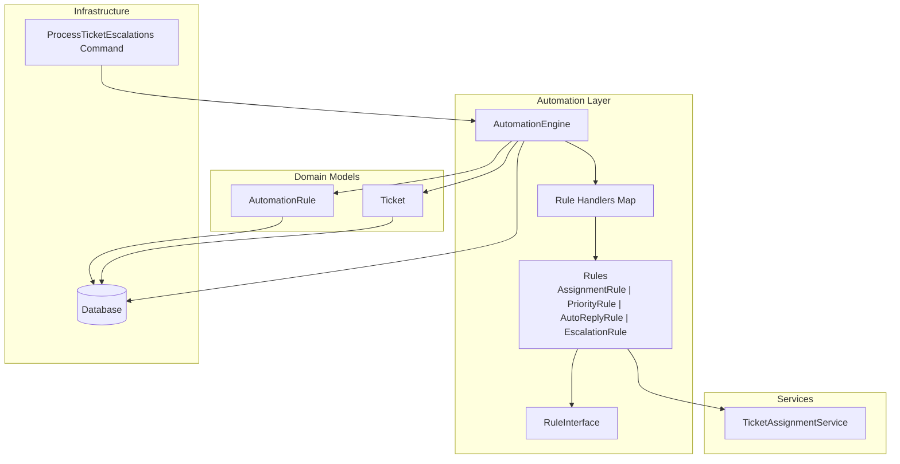
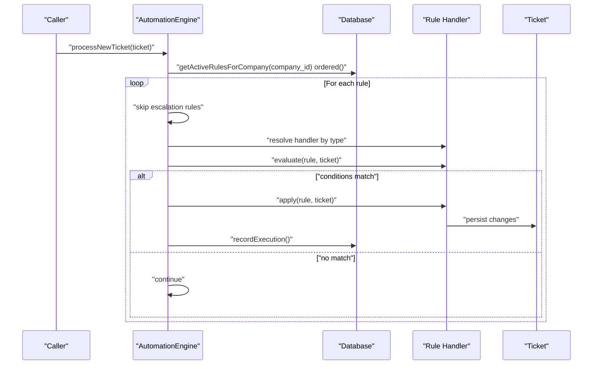
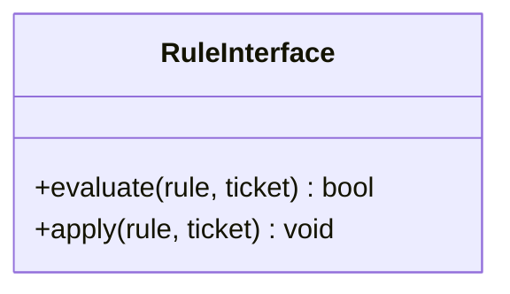
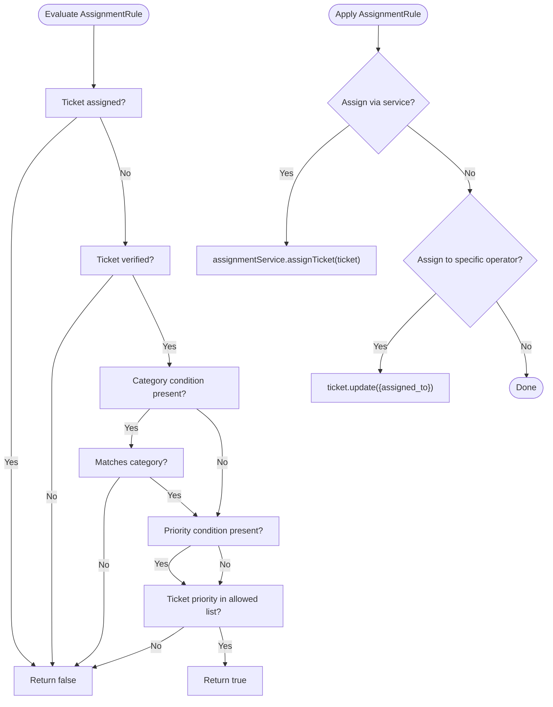
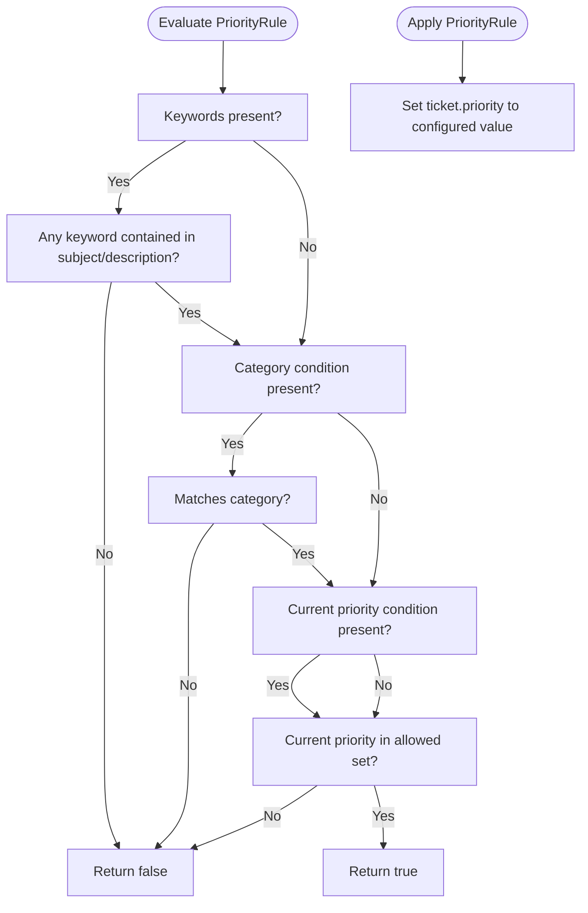
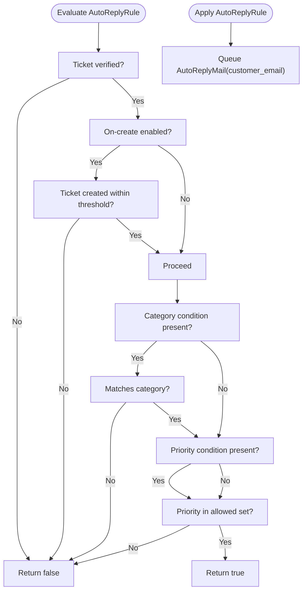
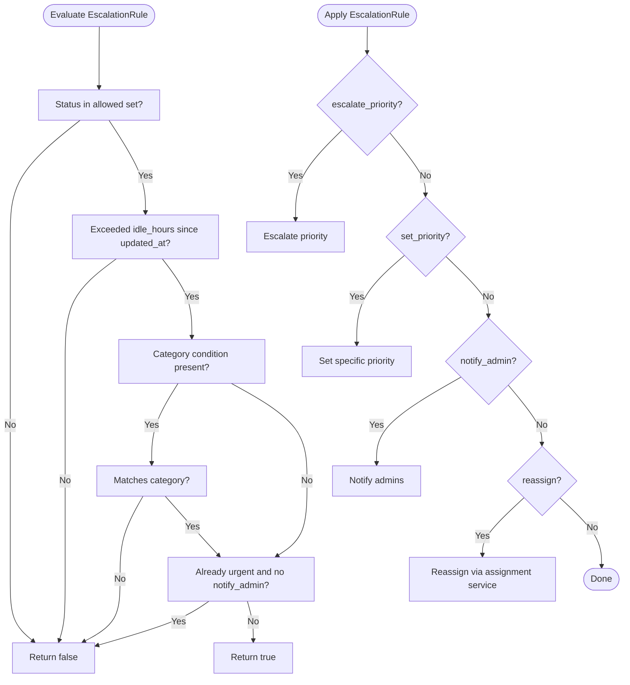
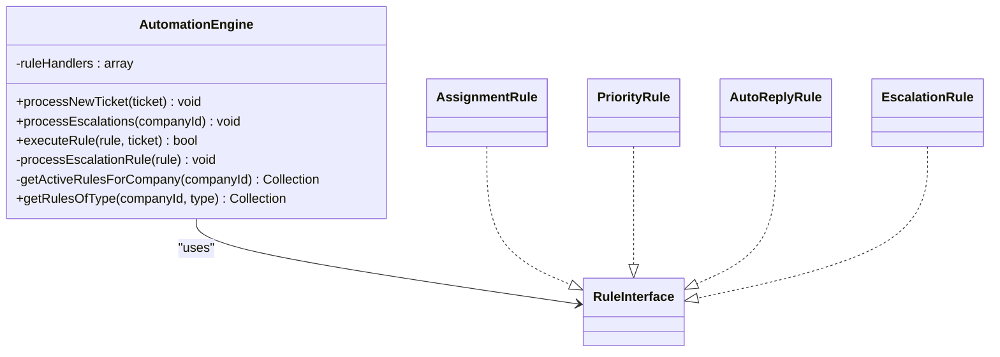
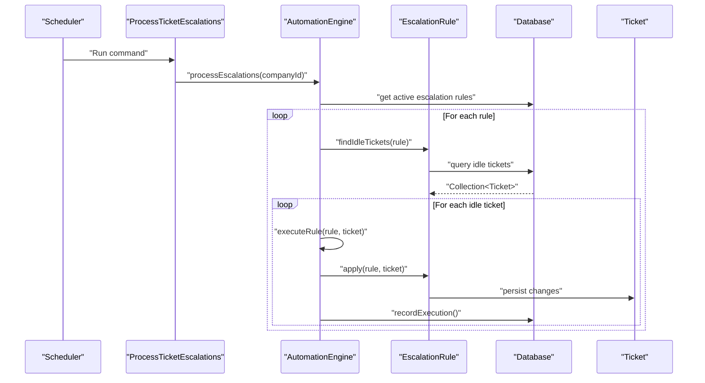
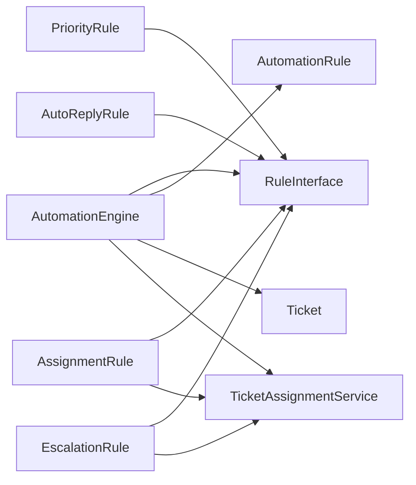

# Automation Engine

<cite>
**Referenced Files in This Document**
- [RuleInterface.php](file://app/Services/Automation/Rules/RuleInterface.php)
- [AssignmentRule.php](file://app/Services/Automation/Rules/AssignmentRule.php)
- [PriorityRule.php](file://app/Services/Automation/Rules/PriorityRule.php)
- [AutoReplyRule.php](file://app/Services/Automation/Rules/AutoReplyRule.php)
- [EscalationRule.php](file://app/Services/Automation/Rules/EscalationRule.php)
- [AutomationEngine.php](file://app/Services/Automation/AutomationEngine.php)
- [AutomationRule.php](file://app/Models/AutomationRule.php)
- [Ticket.php](file://app/Models/Ticket.php)
- [TicketAssignmentService.php](file://app/Services/TicketAssignmentService.php)
- [2026_03_09_104729_create_automation_rules_table.php](file://database/migrations/2026_03_09_104729_create_automation_rules_table.php)
- [ProcessTicketEscalations.php](file://app/Console/Commands/ProcessTicketEscalations.php)
- [AutomationEngineTest.php](file://tests/Feature/Services/AutomationEngineTest.php)
- [AutomationRulesTable.php](file://app/Livewire/Dashboard/AutomationRulesTable.php)
</cite>

## Table of Contents
1. [Introduction](#introduction)
2. [Project Structure](#project-structure)
3. [Core Components](#core-components)
4. [Architecture Overview](#architecture-overview)
5. [Detailed Component Analysis](#detailed-component-analysis)
6. [Dependency Analysis](#dependency-analysis)
7. [Performance Considerations](#performance-considerations)
8. [Troubleshooting Guide](#troubleshooting-guide)
9. [Conclusion](#conclusion)
10. [Appendices](#appendices)

## Introduction
This document explains the automation engine that powers rule-based ticket workflows. It describes how rules are evaluated against tickets, how actions are applied, and how different rule types implement specific behaviors. The engine supports four rule types:
- AssignmentRule: Automatic agent assignment
- PriorityRule: Dynamic priority adjustment
- AutoReplyRule: Instant customer response
- EscalationRule: Overdue ticket handling

It also covers the RuleInterface contract, rule evaluation and action execution, configuration examples, precedence handling, and performance considerations for large-scale deployments.

## Project Structure
The automation engine lives under the Services layer and interacts with Eloquent models and Livewire UI components. The core files are organized by responsibility:
- Rules: RuleInterface and concrete rule handlers
- Engine: Central orchestration of rule processing
- Models: AutomationRule and Ticket domain entities
- Services: TicketAssignmentService for assignment logic
- CLI: Scheduled processing of escalation rules
- Tests: Behavioral validation of rule processing
- UI: Livewire component for creating/editing rules



**Diagram sources**
- [AutomationEngine.php:15-141](file://app/Services/Automation/AutomationEngine.php#L15-L141)
- [RuleInterface.php:8-19](file://app/Services/Automation/Rules/RuleInterface.php#L8-L19)
- [AssignmentRule.php:9-66](file://app/Services/Automation/Rules/AssignmentRule.php#L9-L66)
- [PriorityRule.php:9-68](file://app/Services/Automation/Rules/PriorityRule.php#L9-L68)
- [AutoReplyRule.php:10-64](file://app/Services/Automation/Rules/AutoReplyRule.php#L10-L64)
- [EscalationRule.php:12-156](file://app/Services/Automation/Rules/EscalationRule.php#L12-L156)
- [AutomationRule.php:22-116](file://app/Models/AutomationRule.php#L22-L116)
- [Ticket.php:9-63](file://app/Models/Ticket.php#L9-L63)
- [TicketAssignmentService.php:12-178](file://app/Services/TicketAssignmentService.php#L12-L178)
- [ProcessTicketEscalations.php:9-54](file://app/Console/Commands/ProcessTicketEscalations.php#L9-L54)

**Section sources**
- [AutomationEngine.php:15-141](file://app/Services/Automation/AutomationEngine.php#L15-L141)
- [AutomationRule.php:22-116](file://app/Models/AutomationRule.php#L22-L116)
- [Ticket.php:9-63](file://app/Models/Ticket.php#L9-L63)
- [TicketAssignmentService.php:12-178](file://app/Services/TicketAssignmentService.php#L12-L178)
- [ProcessTicketEscalations.php:9-54](file://app/Console/Commands/ProcessTicketEscalations.php#L9-L54)

## Core Components
- RuleInterface defines the contract for all rule handlers with evaluate and apply methods.
- AutomationEngine orchestrates rule discovery, ordering, evaluation, and execution, and delegates escalation processing to a scheduled job.
- AutomationRule encapsulates rule metadata, conditions, actions, and execution metrics.
- Ticket models the ticket entity with relationships and scopes.
- TicketAssignmentService implements assignment logic with specialists and generalists.
- EscalationRule includes a specialized method to find idle tickets and supports multiple escalation actions.

**Section sources**
- [RuleInterface.php:8-19](file://app/Services/Automation/Rules/RuleInterface.php#L8-L19)
- [AutomationEngine.php:15-141](file://app/Services/Automation/AutomationEngine.php#L15-L141)
- [AutomationRule.php:22-116](file://app/Models/AutomationRule.php#L22-L116)
- [Ticket.php:9-63](file://app/Models/Ticket.php#L9-L63)
- [TicketAssignmentService.php:12-178](file://app/Services/TicketAssignmentService.php#L12-L178)
- [EscalationRule.php:12-156](file://app/Services/Automation/Rules/EscalationRule.php#L12-L156)

## Architecture Overview
The automation engine follows a rule-dispatch pattern:
- Discovery: Retrieve active rules per company, ordered by priority.
- Dispatch: Map rule type to a dedicated handler.
- Evaluation: Each handler checks conditions against the ticket.
- Application: If conditions pass, apply actions and record execution.

Escalation rules are excluded from immediate processing and instead scanned periodically via a console command that queries idle tickets and applies actions.



**Diagram sources**
- [AutomationEngine.php:28-96](file://app/Services/Automation/AutomationEngine.php#L28-L96)
- [AutomationEngine.php:118-125](file://app/Services/Automation/AutomationEngine.php#L118-L125)
- [AutomationRule.php:94-100](file://app/Models/AutomationRule.php#L94-L100)

**Section sources**
- [AutomationEngine.php:28-96](file://app/Services/Automation/AutomationEngine.php#L28-L96)
- [AutomationEngine.php:118-125](file://app/Services/Automation/AutomationEngine.php#L118-L125)

## Detailed Component Analysis

### RuleInterface Contract
Defines the interface that all rule handlers must implement:
- evaluate(AutomationRule, Ticket): returns true if conditions match.
- apply(AutomationRule, Ticket): executes actions against the ticket.



**Diagram sources**
- [RuleInterface.php:8-19](file://app/Services/Automation/Rules/RuleInterface.php#L8-L19)

**Section sources**
- [RuleInterface.php:8-19](file://app/Services/Automation/Rules/RuleInterface.php#L8-L19)

### AssignmentRule
Purpose: Automatically assign tickets to specialists or generalists when unassigned and verified.

Evaluation logic:
- Skip if already assigned.
- Skip if not verified.
- Optional category match.
- Optional priority inclusion.

Action logic:
- Default assignment via TicketAssignmentService.
- Optional override to assign to a specific operator.



**Diagram sources**
- [AssignmentRule.php:15-65](file://app/Services/Automation/Rules/AssignmentRule.php#L15-L65)
- [TicketAssignmentService.php:22-94](file://app/Services/TicketAssignmentService.php#L22-L94)

**Section sources**
- [AssignmentRule.php:15-65](file://app/Services/Automation/Rules/AssignmentRule.php#L15-L65)
- [TicketAssignmentService.php:22-94](file://app/Services/TicketAssignmentService.php#L22-L94)

### PriorityRule
Purpose: Dynamically adjust ticket priority based on keywords, category, and optional current priority guard.

Evaluation logic:
- Keywords in subject/description (case-insensitive).
- Optional category match.
- Optional current priority guard (only apply if current priority is within allowed set).

Action logic:
- Set priority to a predefined value if valid.



**Diagram sources**
- [PriorityRule.php:11-67](file://app/Services/Automation/Rules/PriorityRule.php#L11-L67)

**Section sources**
- [PriorityRule.php:11-67](file://app/Services/Automation/Rules/PriorityRule.php#L11-L67)

### AutoReplyRule
Purpose: Send an instant auto-reply email to customers upon ticket creation or based on conditions.

Evaluation logic:
- Only for verified tickets.
- Optional on-create gate (within a short time window).
- Optional category and priority filters.

Action logic:
- Queue an email with configurable subject/message.



**Diagram sources**
- [AutoReplyRule.php:12-63](file://app/Services/Automation/Rules/AutoReplyRule.php#L12-L63)

**Section sources**
- [AutoReplyRule.php:12-63](file://app/Services/Automation/Rules/AutoReplyRule.php#L12-L63)

### EscalationRule
Purpose: Handle overdue tickets by escalating priority, notifying admins, and optionally reassigning.

Evaluation logic:
- Status must match allowed set.
- Must exceed idle threshold since last activity.
- Optional category match.
- Guard to avoid escalating already urgent tickets unless admin notification is requested.

Action logic:
- Escalate priority (next level) or set to a specific priority.
- Notify admins.
- Optionally reassign to a specific operator using the assignment service.

Supporting capability:
- findIdleTickets(rule): Query idle tickets for a company and status set.



**Diagram sources**
- [EscalationRule.php:24-84](file://app/Services/Automation/Rules/EscalationRule.php#L24-L84)
- [EscalationRule.php:92-113](file://app/Services/Automation/Rules/EscalationRule.php#L92-L113)

**Section sources**
- [EscalationRule.php:24-84](file://app/Services/Automation/Rules/EscalationRule.php#L24-L84)
- [EscalationRule.php:92-113](file://app/Services/Automation/Rules/EscalationRule.php#L92-L113)

### AutomationEngine
Responsibilities:
- Map rule types to handlers.
- Load active rules ordered by priority.
- Execute rules on new tickets (skipping escalation).
- Execute escalation rules by scanning idle tickets via a separate process.
- Record rule executions and log outcomes.



**Diagram sources**
- [AutomationEngine.php:15-141](file://app/Services/Automation/AutomationEngine.php#L15-L141)
- [RuleInterface.php:8-19](file://app/Services/Automation/Rules/RuleInterface.php#L8-L19)
- [AssignmentRule.php:9-66](file://app/Services/Automation/Rules/AssignmentRule.php#L9-L66)
- [PriorityRule.php:9-68](file://app/Services/Automation/Rules/PriorityRule.php#L9-L68)
- [AutoReplyRule.php:10-64](file://app/Services/Automation/Rules/AutoReplyRule.php#L10-L64)
- [EscalationRule.php:12-156](file://app/Services/Automation/Rules/EscalationRule.php#L12-L156)

**Section sources**
- [AutomationEngine.php:15-141](file://app/Services/Automation/AutomationEngine.php#L15-L141)

### Rule Data Model and Persistence
AutomationRule stores:
- Identification: name, description
- Type: assignment, priority, auto_reply, escalation
- Conditions and Actions: JSON-encoded arrays
- Lifecycle: is_active, priority ordering, executions_count, last_executed_at

Schema highlights:
- Enumerated type column with indexes for company, status, and priority.
- JSON columns for conditions and actions.

```mermaid
erDiagram
AUTOMATION_RULE {
bigint id PK
bigint company_id FK
string name
text description
enum type
json conditions
json actions
boolean is_active
int priority
int executions_count
timestamp last_executed_at
timestamps
}
TICKET {
bigint id PK
bigint company_id FK
bigint category_id FK
bigint assigned_to FK
string status
string priority
boolean verified
timestamps
}
COMPANY {
bigint id PK
}
USER {
bigint id PK
bigint company_id FK
string role
}
AUTOMATION_RULE }o--|| COMPANY : "belongs to"
TICKET }o--|| COMPANY : "belongs to"
TICKET }o--|| USER : "assigned to"
```

**Diagram sources**
- [2026_03_09_104729_create_automation_rules_table.php:14-42](file://database/migrations/2026_03_09_104729_create_automation_rules_table.php#L14-L42)
- [AutomationRule.php:22-116](file://app/Models/AutomationRule.php#L22-L116)
- [Ticket.php:9-63](file://app/Models/Ticket.php#L9-L63)

**Section sources**
- [2026_03_09_104729_create_automation_rules_table.php:14-42](file://database/migrations/2026_03_09_104729_create_automation_rules_table.php#L14-L42)
- [AutomationRule.php:22-116](file://app/Models/AutomationRule.php#L22-L116)
- [Ticket.php:9-63](file://app/Models/Ticket.php#L9-L63)

### Escalation Processing Pipeline
Escalation rules are not applied immediately on ticket creation. Instead:
- A console command scans idle tickets for each company.
- For each matching rule, it applies actions to eligible tickets.



**Diagram sources**
- [ProcessTicketEscalations.php:29-53](file://app/Console/Commands/ProcessTicketEscalations.php#L29-L53)
- [AutomationEngine.php:46-111](file://app/Services/Automation/AutomationEngine.php#L46-L111)
- [EscalationRule.php:92-113](file://app/Services/Automation/Rules/EscalationRule.php#L92-L113)

**Section sources**
- [ProcessTicketEscalations.php:29-53](file://app/Console/Commands/ProcessTicketEscalations.php#L29-L53)
- [AutomationEngine.php:46-111](file://app/Services/Automation/AutomationEngine.php#L46-L111)
- [EscalationRule.php:92-113](file://app/Services/Automation/Rules/EscalationRule.php#L92-L113)

## Dependency Analysis
- AutomationEngine depends on:
  - RuleInterface implementations for evaluation and application
  - AutomationRule model for rule metadata and persistence
  - Ticket model for target entity
  - TicketAssignmentService for assignment actions
- Rule handlers depend on:
  - AutomationRule conditions/actions arrays
  - Ticket attributes and relationships
  - External services (Mail for AutoReplyRule, DB transactions for assignments)



**Diagram sources**
- [AutomationEngine.php:15-141](file://app/Services/Automation/AutomationEngine.php#L15-L141)
- [AssignmentRule.php:9-66](file://app/Services/Automation/Rules/AssignmentRule.php#L9-L66)
- [PriorityRule.php:9-68](file://app/Services/Automation/Rules/PriorityRule.php#L9-L68)
- [AutoReplyRule.php:10-64](file://app/Services/Automation/Rules/AutoReplyRule.php#L10-L64)
- [EscalationRule.php:12-156](file://app/Services/Automation/Rules/EscalationRule.php#L12-L156)
- [TicketAssignmentService.php:12-178](file://app/Services/TicketAssignmentService.php#L12-L178)

**Section sources**
- [AutomationEngine.php:15-141](file://app/Services/Automation/AutomationEngine.php#L15-L141)
- [AssignmentRule.php:9-66](file://app/Services/Automation/Rules/AssignmentRule.php#L9-L66)
- [PriorityRule.php:9-68](file://app/Services/Automation/Rules/PriorityRule.php#L9-L68)
- [AutoReplyRule.php:10-64](file://app/Services/Automation/Rules/AutoReplyRule.php#L10-L64)
- [EscalationRule.php:12-156](file://app/Services/Automation/Rules/EscalationRule.php#L12-L156)
- [TicketAssignmentService.php:12-178](file://app/Services/TicketAssignmentService.php#L12-L178)

## Performance Considerations
- Rule ordering: Rules are fetched ordered by priority ascending, ensuring predictable execution order. Keep the number of active rules reasonable to minimize loops.
- Conditional checks: Each rule performs lightweight attribute comparisons and string operations. Avoid overly broad keyword lists or frequent re-evaluation.
- Escalation scanning: EscalationRule.findIdleTickets performs a database scan. Use appropriate indexes and limit statuses to reduce query cost.
- Batch processing: Prefer queued jobs or scheduled commands for escalation processing rather than synchronous execution during request lifecycle.
- Logging and metrics: Execution counts and timestamps are recorded per rule. Monitor logs for failures and long-running handlers.
- Transactions: Assignment actions wrap updates in transactions to maintain consistency; keep actions minimal to reduce lock contention.

[No sources needed since this section provides general guidance]

## Troubleshooting Guide
Common issues and resolutions:
- Rule not applied:
  - Verify the rule is active and ordered properly.
  - Confirm conditions match the ticket’s attributes.
  - Check that the rule type handler exists and is registered.
- Auto-reply not sent:
  - Ensure the ticket is verified and created within the on-create threshold.
  - Verify the action enables sending email and includes a message.
- Escalation not triggered:
  - Confirm idle hours and status filters align with the ticket’s state.
  - Ensure the command is scheduled and running.
- Assignment fails:
  - Check availability and specialties of operators.
  - Review assignment service logs for transaction errors.

Validation references:
- Tests demonstrate rule application, priority ordering, execution recording, and escalation scanning.

**Section sources**
- [AutomationEngineTest.php:19-277](file://tests/Feature/Services/AutomationEngineTest.php#L19-L277)

## Conclusion
The automation engine provides a clean, extensible framework for rule-based ticket workflows. By adhering to the RuleInterface contract, teams can implement new rule types while maintaining consistent evaluation and execution semantics. Escalation rules are separated from immediate processing to support scalable, scheduled maintenance. With proper configuration, indexing, and monitoring, the system scales to handle high volumes of tickets and rules.

[No sources needed since this section summarizes without analyzing specific files]

## Appendices

### Rule Configuration Examples
Use the Livewire UI to define rules. The form builds conditions and actions based on selected rule type.

- AssignmentRule
  - Conditions: category_id, priority (array)
  - Actions: assign_to_specialist, fallback_to_generalist, assign_to_operator_id
- PriorityRule
  - Conditions: keywords (array), category_id, current_priority (array)
  - Actions: set_priority
- AutoReplyRule
  - Conditions: on_create, category_id, priority (array)
  - Actions: send_email, subject, message
- EscalationRule
  - Conditions: idle_hours, status (array), category_id
  - Actions: escalate_priority, set_priority, notify_admin, reassign_to_operator_id

**Section sources**
- [AutomationRulesTable.php:292-341](file://app/Livewire/Dashboard/AutomationRulesTable.php#L292-L341)

### Rule Precedence Handling
- Active rules are retrieved via a scope that filters by is_active.
- Rules are ordered by priority ascending, so lower numbers execute earlier.
- Tests confirm that higher-priority rules (lower number) take effect before lower-priority ones.

**Section sources**
- [AutomationRule.php:66-91](file://app/Models/AutomationRule.php#L66-L91)
- [AutomationEngineTest.php:148-180](file://tests/Feature/Services/AutomationEngineTest.php#L148-L180)

### Database Schema Notes
- conditions and actions are stored as JSON arrays.
- Indexes on company_id with is_active and type improve filtering.
- Priority index supports ordering.

**Section sources**
- [2026_03_09_104729_create_automation_rules_table.php:14-42](file://database/migrations/2026_03_09_104729_create_automation_rules_table.php#L14-L42)