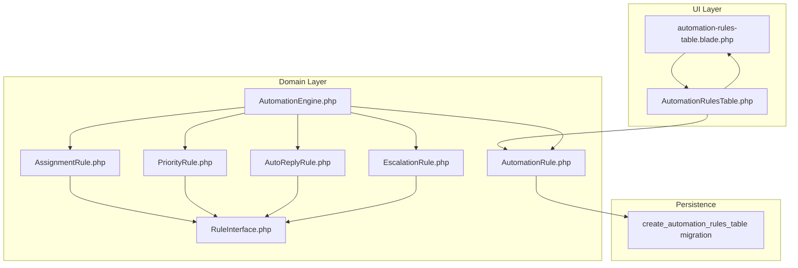
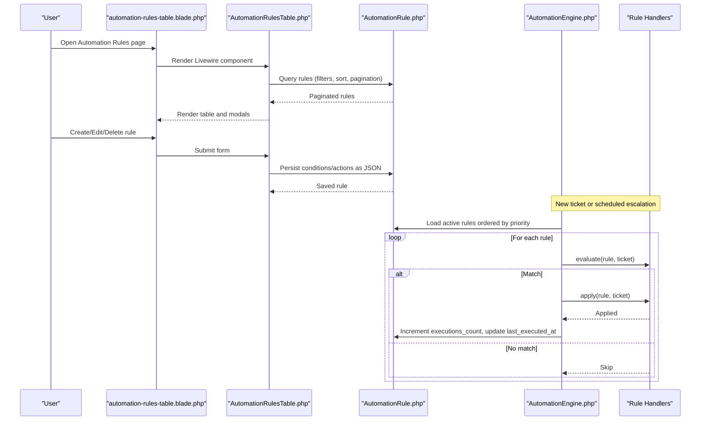
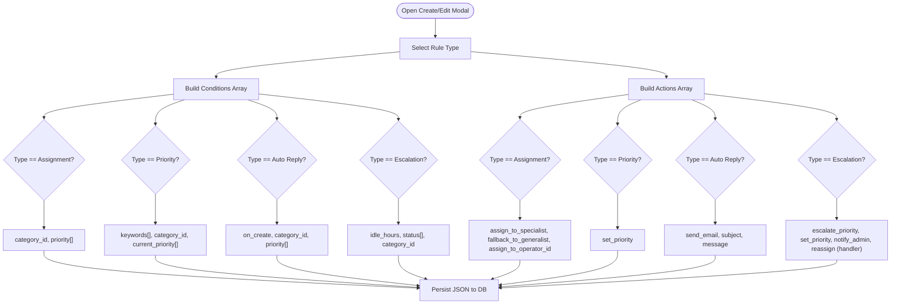
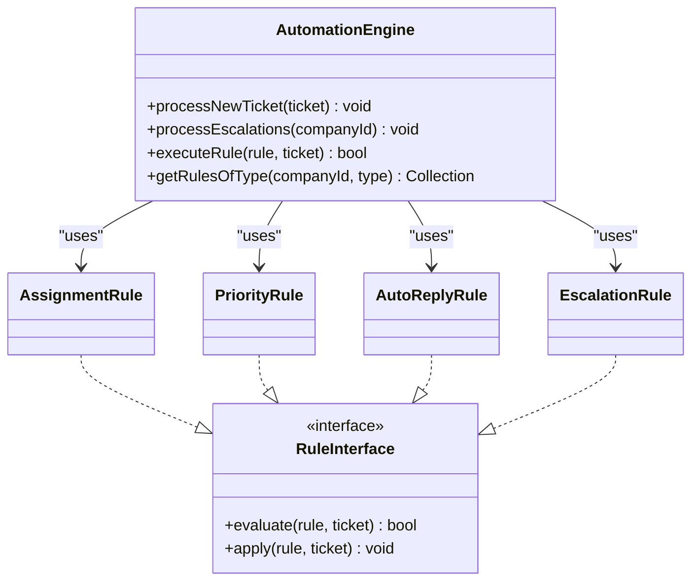
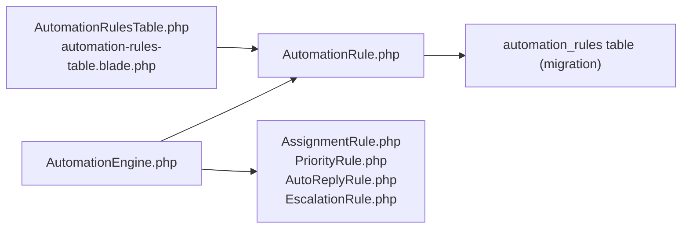

# Rule Configuration & Management

<cite>
**Referenced Files in This Document**
- [AutomationRule.php](file://app/Models/AutomationRule.php)
- [AutomationRulesTable.php](file://app/Livewire/Dashboard/AutomationRulesTable.php)
- [automation-rules-table.blade.php](file://resources/views/livewire/dashboard/automation-rules-table.blade.php)
- [AutomationEngine.php](file://app/Services/Automation/AutomationEngine.php)
- [AssignmentRule.php](file://app/Services/Automation/Rules/AssignmentRule.php)
- [PriorityRule.php](file://app/Services/Automation/Rules/PriorityRule.php)
- [AutoReplyRule.php](file://app/Services/Automation/Rules/AutoReplyRule.php)
- [EscalationRule.php](file://app/Services/Automation/Rules/EscalationRule.php)
- [RuleInterface.php](file://app/Services/Automation/Rules/RuleInterface.php)
- [2026_03_09_104729_create_automation_rules_table.php](file://database/migrations/2026_03_09_104729_create_automation_rules_table.php)
- [AutomationRulesTableTest.php](file://tests/Feature/AutomationRulesTableTest.php)
- [AutomationEngineTest.php](file://tests/Feature/Services/AutomationEngineTest.php)
- [web.php](file://routes/web.php)
</cite>

## Table of Contents
1. [Introduction](#introduction)
2. [Project Structure](#project-structure)
3. [Core Components](#core-components)
4. [Architecture Overview](#architecture-overview)
5. [Detailed Component Analysis](#detailed-component-analysis)
6. [Dependency Analysis](#dependency-analysis)
7. [Performance Considerations](#performance-considerations)
8. [Troubleshooting Guide](#troubleshooting-guide)
9. [Conclusion](#conclusion)
10. [Appendices](#appendices)

## Introduction
This document explains how to configure and manage automation rules for tickets. It covers the AutomationRule model structure, the rule creation workflow via the AutomationRulesTable Livewire component, rule evaluation and execution, rule ordering and priority, validation and conflict considerations, best practices, common rule patterns, troubleshooting, and performance optimization.

## Project Structure
Automation rules are implemented as a cohesive feature spanning models, Livewire components, Blade views, and a rule engine with specialized handlers.

**Diagram sources**
- [automation-rules-table.blade.php:1-633](file://resources/views/livewire/dashboard/automation-rules-table.blade.php#L1-L633)
- [AutomationRulesTable.php:1-397](file://app/Livewire/Dashboard/AutomationRulesTable.php#L1-L397)
- [AutomationRule.php:1-117](file://app/Models/AutomationRule.php#L1-L117)
- [AutomationEngine.php:1-142](file://app/Services/Automation/AutomationEngine.php#L1-L142)
- [RuleInterface.php:1-20](file://app/Services/Automation/Rules/RuleInterface.php#L1-L20)
- [AssignmentRule.php:1-67](file://app/Services/Automation/Rules/AssignmentRule.php#L1-L67)
- [PriorityRule.php:1-69](file://app/Services/Automation/Rules/PriorityRule.php#L1-L69)
- [AutoReplyRule.php:1-65](file://app/Services/Automation/Rules/AutoReplyRule.php#L1-L65)
- [EscalationRule.php:1-157](file://app/Services/Automation/Rules/EscalationRule.php#L1-L157)
- [2026_03_09_104729_create_automation_rules_table.php:1-53](file://database/migrations/2026_03_09_104729_create_automation_rules_table.php#L1-L53)

**Section sources**
- [web.php:106-108](file://routes/web.php#L106-L108)
- [automation-rules-table.blade.php:18-49](file://resources/views/livewire/dashboard/automation-rules-table.blade.php#L18-L49)

## Core Components
- AutomationRule model: Stores rule metadata, conditions, actions, activation status, priority, and execution metrics. Includes scopes for active rules, type filtering, and priority ordering.
- AutomationRulesTable Livewire component: Provides UI for listing, filtering, sorting, creating, editing, toggling activation, and deleting rules. Builds conditions/actions arrays per rule type and persists them as JSON.
- AutomationEngine: Orchestrates rule processing for new tickets and escalations. Executes rules in priority order, records execution statistics, and handles errors.
- Rule handlers: Specialized evaluators and applicators for assignment, priority change, auto reply, and escalation.

**Section sources**
- [AutomationRule.php:22-116](file://app/Models/AutomationRule.php#L22-L116)
- [AutomationRulesTable.php:14-397](file://app/Livewire/Dashboard/AutomationRulesTable.php#L14-L397)
- [AutomationEngine.php:15-142](file://app/Services/Automation/AutomationEngine.php#L15-L142)
- [RuleInterface.php:8-19](file://app/Services/Automation/Rules/RuleInterface.php#L8-L19)

## Architecture Overview
The system separates concerns across UI, persistence, orchestration, and rule-specific logic.

**Diagram sources**
- [automation-rules-table.blade.php:18-49](file://resources/views/livewire/dashboard/automation-rules-table.blade.php#L18-L49)
- [AutomationRulesTable.php:120-142](file://app/Livewire/Dashboard/AutomationRulesTable.php#L120-L142)
- [AutomationEngine.php:28-96](file://app/Services/Automation/AutomationEngine.php#L28-L96)
- [AutomationRule.php:66-91](file://app/Models/AutomationRule.php#L66-L91)

## Detailed Component Analysis

### AutomationRule Model
- Fields and casting:
  - Identification: name, description
  - Type: enum-like string with constants for assignment, priority, auto_reply, escalation
  - Conditions and actions: JSON arrays built by the UI component
  - Activation: is_active boolean
  - Ordering: priority integer
  - Execution metrics: executions_count integer and last_executed_at timestamp
- Scopes:
  - active: filters only enabled rules
  - ofType: filters by rule type
  - ordered: orders by priority ascending
- Methods:
  - recordExecution: increments count and updates timestamp
  - getTypes: returns human-readable labels for rule types

**Section sources**
- [AutomationRule.php:10-50](file://app/Models/AutomationRule.php#L10-L50)
- [AutomationRule.php:66-116](file://app/Models/AutomationRule.php#L66-L116)
- [2026_03_09_104729_create_automation_rules_table.php:14-42](file://database/migrations/2026_03_09_104729_create_automation_rules_table.php#L14-L42)

### AutomationRulesTable Component and UI
- Responsibilities:
  - Filtering: search by name/description, filter by type and status
  - Sorting: priority, name, executions_count
  - CRUD: create, read, update, toggle activation, delete
  - Modals: create/edit forms with dynamic sections per rule type
- Condition builder syntax (per type):
  - Assignment: category_id, priority list
  - Priority: keywords list, category_id, current_priority list
  - Auto Reply: on_create flag, category_id, priority list
  - Escalation: idle_hours, status list, category_id
- Action configuration (per type):
  - Assignment: assign_to_specialist, fallback_to_generalist, assign_to_operator_id
  - Priority: set_priority
  - Auto Reply: send_email, subject, message
  - Escalation: escalate_priority, set_priority, notify_admin, reassign (via handler)
- Validation:
  - Required fields: name, type, priority range
  - Type constrained to supported values
- Execution priority:
  - Priority field controls execution order; lower numbers execute first

**Diagram sources**
- [AutomationRulesTable.php:292-341](file://app/Livewire/Dashboard/AutomationRulesTable.php#L292-L341)
- [automation-rules-table.blade.php:229-383](file://resources/views/livewire/dashboard/automation-rules-table.blade.php#L229-L383)

**Section sources**
- [AutomationRulesTable.php:84-93](file://app/Livewire/Dashboard/AutomationRulesTable.php#L84-L93)
- [AutomationRulesTable.php:173-239](file://app/Livewire/Dashboard/AutomationRulesTable.php#L173-L239)
- [automation-rules-table.blade.php:229-383](file://resources/views/livewire/dashboard/automation-rules-table.blade.php#L229-L383)

### Rule Evaluation and Application

#### AssignmentRule
- Evaluate: skip if ticket already assigned or not verified; match category and/or priority conditions
- Apply: assign via default assignment service or assign to a specific operator

**Section sources**
- [AssignmentRule.php:15-48](file://app/Services/Automation/Rules/AssignmentRule.php#L15-L48)
- [AssignmentRule.php:50-65](file://app/Services/Automation/Rules/AssignmentRule.php#L50-L65)

#### PriorityRule
- Evaluate: match keywords in subject/description; optional category and current_priority filters
- Apply: set ticket priority to configured value if valid

**Section sources**
- [PriorityRule.php:11-52](file://app/Services/Automation/Rules/PriorityRule.php#L11-L52)
- [PriorityRule.php:54-67](file://app/Services/Automation/Rules/PriorityRule.php#L54-L67)

#### AutoReplyRule
- Evaluate: require verified ticket; optionally restrict to newly created tickets; match category/priority
- Apply: queue auto-reply email with configurable subject/message

**Section sources**
- [AutoReplyRule.php:12-48](file://app/Services/Automation/Rules/AutoReplyRule.php#L12-L48)
- [AutoReplyRule.php:50-63](file://app/Services/Automation/Rules/AutoReplyRule.php#L50-L63)

#### EscalationRule
- Evaluate: match status list and idle threshold; optional category; guard against escalating already urgent tickets unless configured otherwise
- Apply: escalate priority, set specific priority, notify admins, reassign (via handler)

**Section sources**
- [EscalationRule.php:24-60](file://app/Services/Automation/Rules/EscalationRule.php#L24-L60)
- [EscalationRule.php:62-85](file://app/Services/Automation/Rules/EscalationRule.php#L62-L85)
- [EscalationRule.php:92-113](file://app/Services/Automation/Rules/EscalationRule.php#L92-L113)

### Automation Engine
- processNewTicket: loads active rules ordered by priority and executes applicable handlers (skips escalation)
- processEscalations: runs escalation handler across idle tickets for escalation rules
- executeRule: resolves handler, evaluates, applies, records execution, logs outcomes
- getActiveRulesForCompany/getRulesOfType: leverage model scopes for efficient queries

**Diagram sources**
- [AutomationEngine.php:15-142](file://app/Services/Automation/AutomationEngine.php#L15-L142)
- [RuleInterface.php:8-19](file://app/Services/Automation/Rules/RuleInterface.php#L8-L19)
- [AssignmentRule.php:9-67](file://app/Services/Automation/Rules/AssignmentRule.php#L9-L67)
- [PriorityRule.php:9-69](file://app/Services/Automation/Rules/PriorityRule.php#L9-L69)
- [AutoReplyRule.php:10-65](file://app/Services/Automation/Rules/AutoReplyRule.php#L10-L65)
- [EscalationRule.php:12-157](file://app/Services/Automation/Rules/EscalationRule.php#L12-L157)

**Section sources**
- [AutomationEngine.php:28-140](file://app/Services/Automation/AutomationEngine.php#L28-L140)

## Dependency Analysis
- UI depends on model for data and on engine for execution context
- Engine depends on handlers and model for evaluation and persistence
- Handlers depend on domain models and services (e.g., assignment service, mail)
- Persistence relies on migration schema with appropriate indexes for company, active status, type, and priority

**Diagram sources**
- [AutomationRulesTable.php:14-397](file://app/Livewire/Dashboard/AutomationRulesTable.php#L14-L397)
- [automation-rules-table.blade.php:18-49](file://resources/views/livewire/dashboard/automation-rules-table.blade.php#L18-L49)
- [AutomationEngine.php:15-142](file://app/Services/Automation/AutomationEngine.php#L15-L142)
- [AssignmentRule.php:1-67](file://app/Services/Automation/Rules/AssignmentRule.php#L1-L67)
- [PriorityRule.php:1-69](file://app/Services/Automation/Rules/PriorityRule.php#L1-L69)
- [AutoReplyRule.php:1-65](file://app/Services/Automation/Rules/AutoReplyRule.php#L1-L65)
- [EscalationRule.php:1-157](file://app/Services/Automation/Rules/EscalationRule.php#L1-L157)
- [2026_03_09_104729_create_automation_rules_table.php:14-42](file://database/migrations/2026_03_09_104729_create_automation_rules_table.php#L14-L42)

**Section sources**
- [2026_03_09_104729_create_automation_rules_table.php:39-42](file://database/migrations/2026_03_09_104729_create_automation_rules_table.php#L39-L42)

## Performance Considerations
- Rule ordering: Engine fetches active rules ordered by priority; keep priorities dense and meaningful to avoid long chains
- Handler efficiency: Handlers perform lightweight checks and minimal writes; avoid heavy operations inside handlers
- Database indexing: Multi-column indexes on company_id with is_active and type, plus priority index, support fast filtering and ordering
- Escalation scheduling: Dedicated escalation processing avoids scanning all tickets on every event
- Execution metrics: Track executions_count and last_executed_at to monitor rule impact and tune priorities

[No sources needed since this section provides general guidance]

## Troubleshooting Guide
Common issues and resolutions:
- Rule not applying:
  - Verify is_active is true and priority is set appropriately
  - Confirm conditions match ticket attributes (category, priority, keywords)
  - Check handler preconditions (e.g., verified tickets, unassigned for assignment rules)
- Conflicts between rules:
  - Lower priority numbers execute first; design overlapping rules with distinct conditions
  - Use keywords and category filters to minimize overlap
- Escalation not triggered:
  - Ensure escalation rules are active and idle_hours align with ticket activity timestamps
  - Confirm statuses match expected values
- Execution tracking:
  - Use executions_count and last_executed_at to validate rule activity
- Testing:
  - Use provided tests as references for expected behavior and data shapes

**Section sources**
- [AutomationEngineTest.php:125-147](file://tests/Feature/Services/AutomationEngineTest.php#L125-L147)
- [AutomationEngineTest.php:148-180](file://tests/Feature/Services/AutomationEngineTest.php#L148-L180)
- [AutomationEngineTest.php:209-241](file://tests/Feature/Services/AutomationEngineTest.php#L209-L241)
- [AutomationEngineTest.php:243-277](file://tests/Feature/Services/AutomationEngineTest.php#L243-L277)

## Conclusion
The automation rule system provides a flexible, extensible framework for managing ticket workflows. The UI enables precise configuration of conditions and actions per rule type, while the engine ensures deterministic, priority-driven execution with robust logging and metrics. By following best practices—clear rule separation, explicit conditions, and careful priority planning—you can build reliable automation that scales with your support volume.

[No sources needed since this section summarizes without analyzing specific files]

## Appendices

### Rule Creation Workflow (Step-by-step)
- Navigate to the Automation Rules page and click Add Rule
- Choose a rule type; the form dynamically adjusts to show relevant conditions and actions
- Configure conditions:
  - Assignment: select category and priority(s)
  - Priority: add keywords and optionally set category and current priority filter
  - Auto Reply: enable on-create and configure category/priority filters
  - Escalation: set idle hours, status list, and category
- Configure actions:
  - Assignment: choose specialist assignment with fallback or assign to a specific operator
  - Priority: set target priority
  - Auto Reply: enable sending email and customize subject/message
  - Escalation: choose to escalate priority or set a specific priority, and enable admin notifications
- Save the rule; it appears in the table and is executed according to priority

**Section sources**
- [automation-rules-table.blade.php:191-400](file://resources/views/livewire/dashboard/automation-rules-table.blade.php#L191-L400)
- [AutomationRulesTable.php:173-239](file://app/Livewire/Dashboard/AutomationRulesTable.php#L173-L239)

### Rule Ordering and Priority
- Priority determines execution order; lower numbers run earlier
- Engine loads active rules ordered by priority ascending
- Tests demonstrate that higher-priority rules (lower number) take effect before lower-priority ones

**Section sources**
- [AutomationEngine.php:118-125](file://app/Services/Automation/AutomationEngine.php#L118-L125)
- [AutomationEngineTest.php:148-180](file://tests/Feature/Services/AutomationEngineTest.php#L148-L180)

### Validation and Conflict Detection
- UI validation enforces required fields and acceptable ranges
- Handler-level checks prevent inappropriate actions (e.g., assigning already assigned tickets)
- Conflict detection relies on explicit conditions; design rules so their conditions are mutually exclusive or clearly prioritized

**Section sources**
- [AutomationRulesTable.php:84-93](file://app/Livewire/Dashboard/AutomationRulesTable.php#L84-L93)
- [AssignmentRule.php:17-25](file://app/Services/Automation/Rules/AssignmentRule.php#L17-L25)

### Best Practices for Rule Design
- Keep conditions specific to reduce overlap
- Use keywords and category filters to narrow scope
- Separate concerns across multiple rules rather than cramming logic into one
- Prefer explicit priority values to ensure predictable sequencing
- Monitor execution metrics to validate effectiveness

[No sources needed since this section provides general guidance]

### Examples of Common Rule Patterns
- Assignment: route tickets by category to specialists; fallback to generalists if none available
- Priority: automatically raise priority for tickets containing specific keywords
- Auto Reply: send immediate acknowledgment on ticket creation
- Escalation: increase priority or notify admins after a period of inactivity

**Section sources**
- [AutomationRulesTableTest.php:64-88](file://tests/Feature/AutomationRulesTableTest.php#L64-L88)
- [AutomationRulesTableTest.php:90-110](file://tests/Feature/AutomationRulesTableTest.php#L90-L110)
- [AutomationRulesTableTest.php:112-132](file://tests/Feature/AutomationRulesTableTest.php#L112-L132)
- [AutomationRulesTableTest.php:134-153](file://tests/Feature/AutomationRulesTableTest.php#L134-L153)

### Performance Optimization Techniques
- Use indexes on company_id, is_active, type, and priority to speed up rule retrieval
- Minimize complex conditions; prefer simple filters where possible
- Batch escalation processing via scheduler to avoid real-time overhead
- Limit keyword lists to essential terms to reduce evaluation cost

**Section sources**
- [2026_03_09_104729_create_automation_rules_table.php:39-42](file://database/migrations/2026_03_09_104729_create_automation_rules_table.php#L39-L42)
- [AutomationEngine.php:46-54](file://app/Services/Automation/AutomationEngine.php#L46-L54)