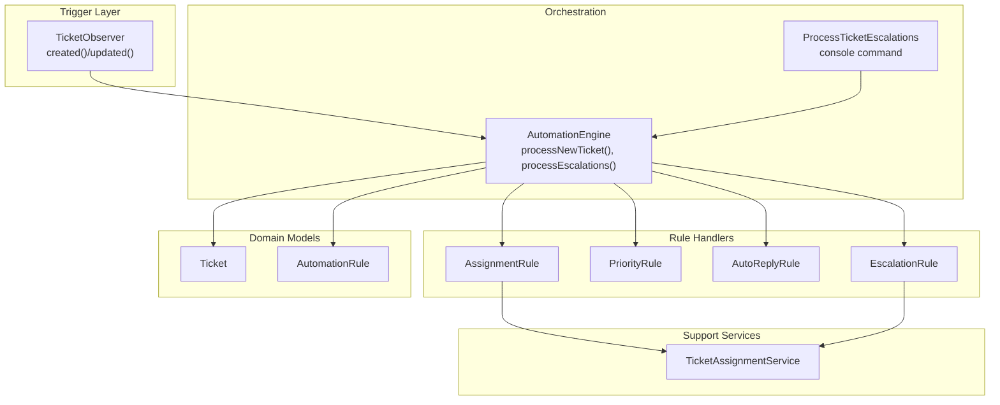
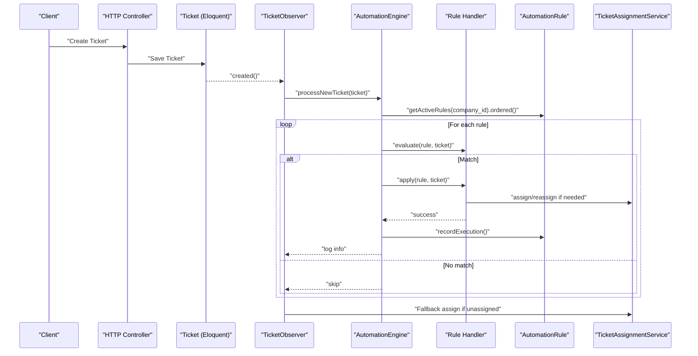
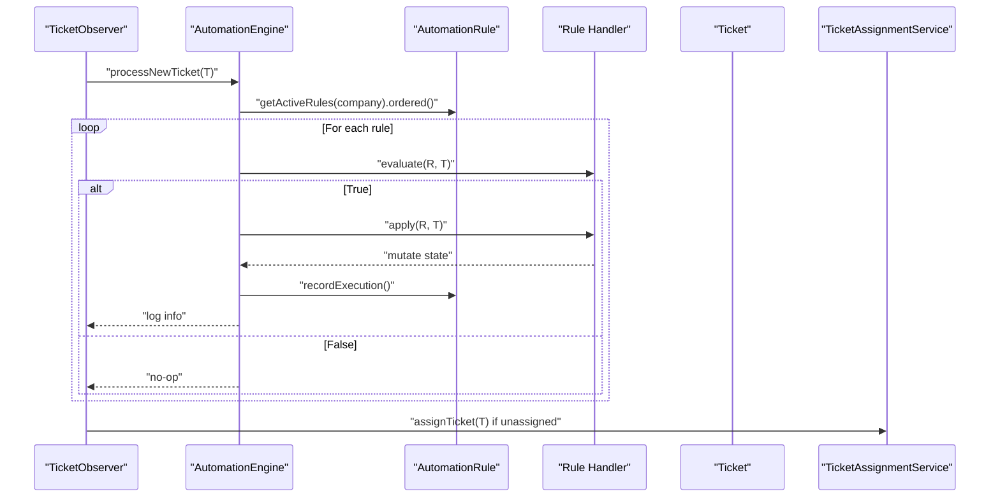
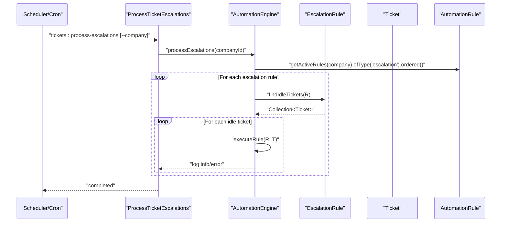
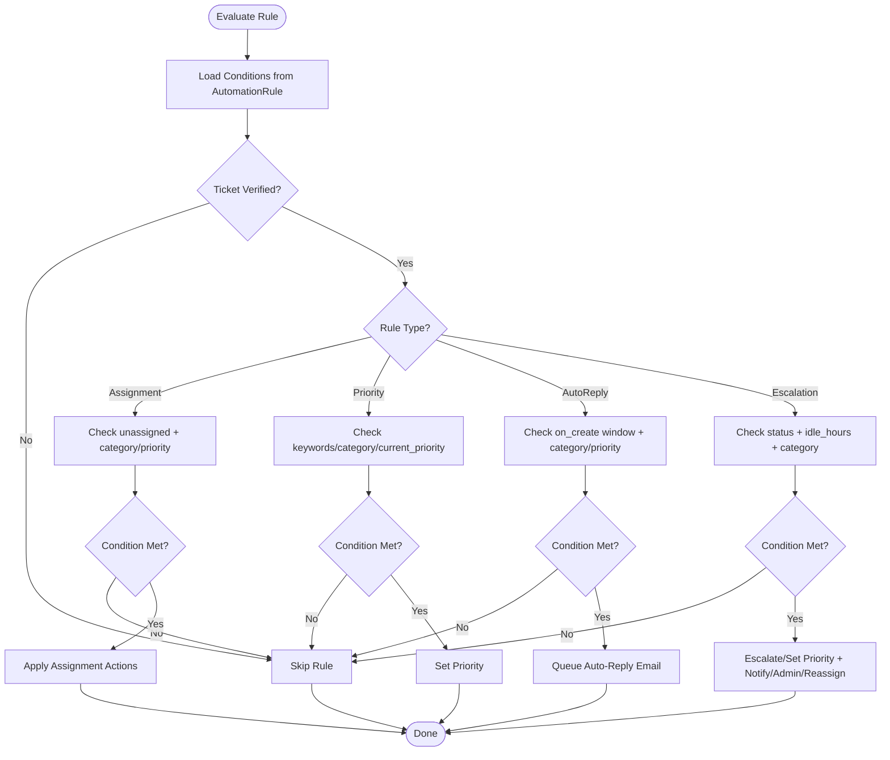
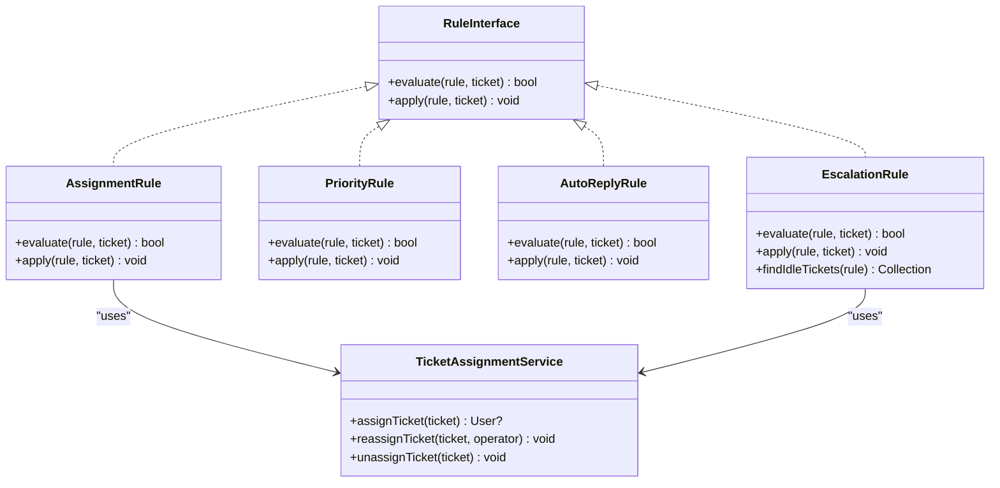
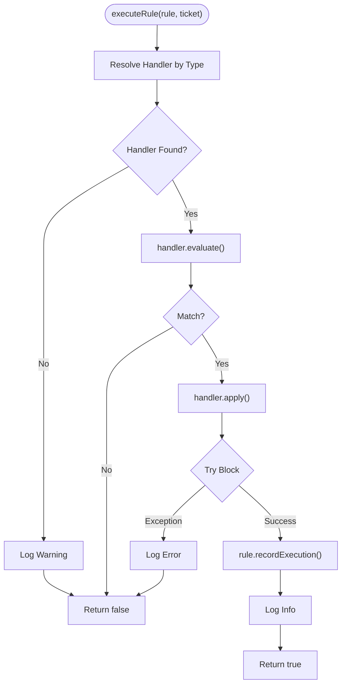
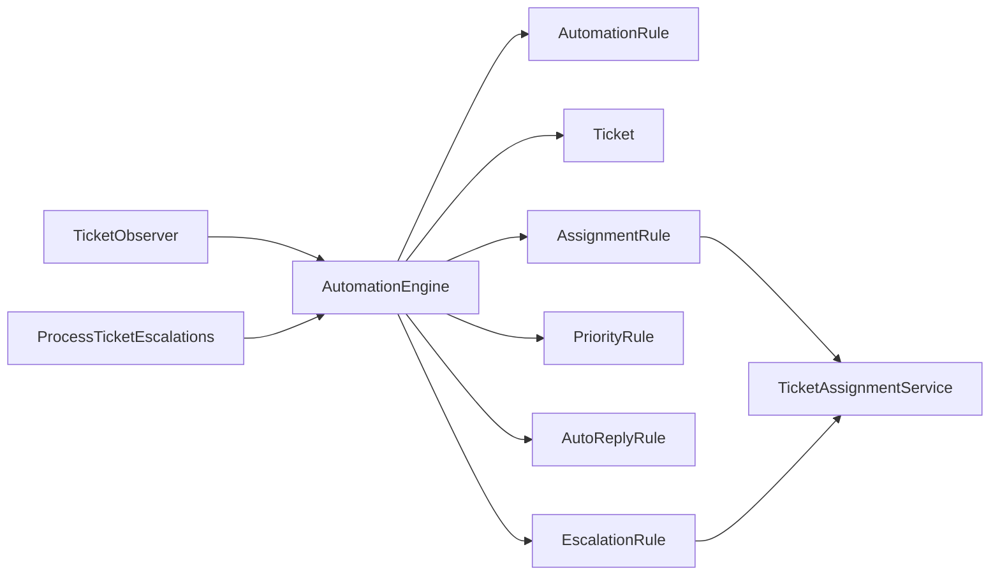

# Rule Processing Workflow

<cite>
**Referenced Files in This Document**
- [AutomationEngine.php](file://app/Services/Automation/AutomationEngine.php)
- [RuleInterface.php](file://app/Services/Automation/Rules/RuleInterface.php)
- [AssignmentRule.php](file://app/Services/Automation/Rules/AssignmentRule.php)
- [PriorityRule.php](file://app/Services/Automation/Rules/PriorityRule.php)
- [AutoReplyRule.php](file://app/Services/Automation/Rules/AutoReplyRule.php)
- [EscalationRule.php](file://app/Services/Automation/Rules/EscalationRule.php)
- [AutomationRule.php](file://app/Models/AutomationRule.php)
- [Ticket.php](file://app/Models/Ticket.php)
- [TicketObserver.php](file://app/Observers/TicketObserver.php)
- [TicketAssignmentService.php](file://app/Services/TicketAssignmentService.php)
- [ProcessTicketEscalations.php](file://app/Console/Commands/ProcessTicketEscalations.php)
- [AppServiceProvider.php](file://app/Providers/AppServiceProvider.php)
- [AutomationEngineTest.php](file://tests/Feature/Services/AutomationEngineTest.php)
</cite>

## Table of Contents
1. [Introduction](#introduction)
2. [Project Structure](#project-structure)
3. [Core Components](#core-components)
4. [Architecture Overview](#architecture-overview)
5. [Detailed Component Analysis](#detailed-component-analysis)
6. [Dependency Analysis](#dependency-analysis)
7. [Performance Considerations](#performance-considerations)
8. [Troubleshooting Guide](#troubleshooting-guide)
9. [Conclusion](#conclusion)

## Introduction
This document explains the complete rule processing workflow from trigger to completion. It covers immediate rule execution on ticket creation, scheduled escalation processing, the rule evaluation pipeline, condition matching algorithms, action application mechanisms, execution tracking, logging patterns, error handling strategies, and performance considerations for high-volume rule processing.

## Project Structure
The rule processing system is centered around a service-driven architecture:
- Trigger events (ticket creation/verification) invoke the Automation Engine.
- The engine discovers active rules per company and evaluates them sequentially.
- Rule handlers encapsulate evaluation and action logic for each rule type.
- Scheduled processing runs via a console command that scans idle tickets and applies escalation rules.
- Observers bind lifecycle events to automation triggers.
- Execution metrics and logging track outcomes.

**Diagram sources**
- [TicketObserver.php:17-33](file://app/Observers/TicketObserver.php#L17-L33)
- [AutomationEngine.php:28-54](file://app/Services/Automation/AutomationEngine.php#L28-L54)
- [ProcessTicketEscalations.php:29-53](file://app/Console/Commands/ProcessTicketEscalations.php#L29-L53)
- [AssignmentRule.php:9-67](file://app/Services/Automation/Rules/AssignmentRule.php#L9-L67)
- [PriorityRule.php:9-69](file://app/Services/Automation/Rules/PriorityRule.php#L9-L69)
- [AutoReplyRule.php:10-65](file://app/Services/Automation/Rules/AutoReplyRule.php#L10-L65)
- [EscalationRule.php:12-157](file://app/Services/Automation/Rules/EscalationRule.php#L12-L157)
- [Ticket.php:9-64](file://app/Models/Ticket.php#L9-L64)
- [AutomationRule.php:22-117](file://app/Models/AutomationRule.php#L22-L117)
- [TicketAssignmentService.php:12-179](file://app/Services/TicketAssignmentService.php#L12-L179)

**Section sources**
- [AppServiceProvider.php:29-34](file://app/Providers/AppServiceProvider.php#L29-L34)
- [AutomationEngine.php:15-142](file://app/Services/Automation/AutomationEngine.php#L15-L142)

## Core Components
- AutomationEngine orchestrates rule discovery and execution for new tickets and escalations.
- RuleInterface defines the contract for rule handlers.
- Rule handlers implement evaluation and action logic for assignment, priority, auto-reply, and escalation.
- AutomationRule persists rule metadata, conditions, actions, and execution tracking.
- TicketObserver binds lifecycle events to automation triggers.
- TicketAssignmentService performs assignment/reassignment and maintains operator counters.
- ProcessTicketEscalations console command drives batch escalation processing.

**Section sources**
- [AutomationEngine.php:15-142](file://app/Services/Automation/AutomationEngine.php#L15-L142)
- [RuleInterface.php:8-19](file://app/Services/Automation/Rules/RuleInterface.php#L8-L19)
- [AssignmentRule.php:9-67](file://app/Services/Automation/Rules/AssignmentRule.php#L9-L67)
- [PriorityRule.php:9-69](file://app/Services/Automation/Rules/PriorityRule.php#L9-L69)
- [AutoReplyRule.php:10-65](file://app/Services/Automation/Rules/AutoReplyRule.php#L10-L65)
- [EscalationRule.php:12-157](file://app/Services/Automation/Rules/EscalationRule.php#L12-L157)
- [AutomationRule.php:22-117](file://app/Models/AutomationRule.php#L22-L117)
- [TicketObserver.php:10-109](file://app/Observers/TicketObserver.php#L10-L109)
- [TicketAssignmentService.php:12-179](file://app/Services/TicketAssignmentService.php#L12-L179)
- [ProcessTicketEscalations.php:9-54](file://app/Console/Commands/ProcessTicketEscalations.php#L9-L54)

## Architecture Overview
The system follows a layered pattern:
- Event-driven triggers (observer) initiate automation.
- Engine filters active rules ordered by priority.
- Handler-specific evaluation decides applicability.
- Actions mutate domain state and emit notifications.
- Logging and execution counters track outcomes.

**Diagram sources**
- [TicketObserver.php:17-33](file://app/Observers/TicketObserver.php#L17-L33)
- [AutomationEngine.php:28-96](file://app/Services/Automation/AutomationEngine.php#L28-L96)
- [AssignmentRule.php:15-65](file://app/Services/Automation/Rules/AssignmentRule.php#L15-L65)
- [PriorityRule.php:11-67](file://app/Services/Automation/Rules/PriorityRule.php#L11-L67)
- [AutoReplyRule.php:12-63](file://app/Services/Automation/Rules/AutoReplyRule.php#L12-L63)
- [EscalationRule.php:24-85](file://app/Services/Automation/Rules/EscalationRule.php#L24-L85)
- [TicketAssignmentService.php:22-108](file://app/Services/TicketAssignmentService.php#L22-L108)

## Detailed Component Analysis

### Immediate Rule Execution on Ticket Creation
- Trigger: TicketObserver.created() checks verification and invokes AutomationEngine.processNewTicket().
- Discovery: Engine retrieves active rules for the ticket’s company, ordered by priority.
- Evaluation: Each handler evaluates conditions against the ticket.
- Application: Matching handlers apply actions; execution recorded and logged.
- Fallback: If unassigned after automation, default assignment service assigns automatically.

**Diagram sources**
- [TicketObserver.php:21-33](file://app/Observers/TicketObserver.php#L21-L33)
- [AutomationEngine.php:30-96](file://app/Services/Automation/AutomationEngine.php#L30-L96)
- [AssignmentRule.php:15-65](file://app/Services/Automation/Rules/AssignmentRule.php#L15-L65)
- [TicketAssignmentService.php:22-108](file://app/Services/TicketAssignmentService.php#L22-L108)

**Section sources**
- [TicketObserver.php:17-33](file://app/Observers/TicketObserver.php#L17-L33)
- [AutomationEngine.php:28-96](file://app/Services/Automation/AutomationEngine.php#L28-L96)
- [AutomationEngineTest.php:19-47](file://tests/Feature/Services/AutomationEngineTest.php#L19-L47)

### Scheduled Escalation Processing
- Trigger: Console command ProcessTicketEscalations runs periodically.
- Discovery: Engine fetches active escalation rules for a company or all companies.
- Idle Detection: EscalationRule.findIdleTickets() queries tickets older than idle threshold and matching statuses.
- Batch Application: Engine executes each escalation rule against matched tickets.

**Diagram sources**
- [ProcessTicketEscalations.php:29-53](file://app/Console/Commands/ProcessTicketEscalations.php#L29-L53)
- [AutomationEngine.php:46-111](file://app/Services/Automation/AutomationEngine.php#L46-L111)
- [EscalationRule.php:92-113](file://app/Services/Automation/Rules/EscalationRule.php#L92-L113)

**Section sources**
- [ProcessTicketEscalations.php:9-54](file://app/Console/Commands/ProcessTicketEscalations.php#L9-L54)
- [AutomationEngine.php:43-111](file://app/Services/Automation/AutomationEngine.php#L43-L111)
- [EscalationRule.php:87-113](file://app/Services/Automation/Rules/EscalationRule.php#L87-L113)
- [AutomationEngineTest.php:220-241](file://tests/Feature/Services/AutomationEngineTest.php#L220-L241)

### Rule Evaluation Pipeline and Condition Matching
- AssignmentRule: Requires unassigned and verified tickets; supports category/priority conditions; applies specialist/generalist assignment or explicit operator assignment.
- PriorityRule: Matches keywords in subject/description; optional category and current-priority constraints; sets target priority.
- AutoReplyRule: Requires verified tickets; optionally on-create within a short window; supports category/priority conditions; queues auto-reply email.
- EscalationRule: Validates status, idle threshold, category; guards against escalating already-urgent tickets when only notifying; escalates priority or sets specific priority; notifies admins; optionally reassigns.

**Diagram sources**
- [AssignmentRule.php:15-48](file://app/Services/Automation/Rules/AssignmentRule.php#L15-L48)
- [PriorityRule.php:11-52](file://app/Services/Automation/Rules/PriorityRule.php#L11-L52)
- [AutoReplyRule.php:12-48](file://app/Services/Automation/Rules/AutoReplyRule.php#L12-L48)
- [EscalationRule.php:24-60](file://app/Services/Automation/Rules/EscalationRule.php#L24-L60)

**Section sources**
- [AssignmentRule.php:15-65](file://app/Services/Automation/Rules/AssignmentRule.php#L15-L65)
- [PriorityRule.php:11-67](file://app/Services/Automation/Rules/PriorityRule.php#L11-L67)
- [AutoReplyRule.php:12-63](file://app/Services/Automation/Rules/AutoReplyRule.php#L12-L63)
- [EscalationRule.php:24-85](file://app/Services/Automation/Rules/EscalationRule.php#L24-L85)

### Action Application Mechanisms
- AssignmentRule delegates to TicketAssignmentService for specialist/generalist assignment or explicit operator assignment.
- PriorityRule updates ticket priority directly.
- AutoReplyRule queues an email via the mail subsystem.
- EscalationRule escalates priority by level, sets a specific priority, notifies admins, and optionally reassigns to a specified operator.

**Diagram sources**
- [RuleInterface.php:8-19](file://app/Services/Automation/Rules/RuleInterface.php#L8-L19)
- [AssignmentRule.php:9-67](file://app/Services/Automation/Rules/AssignmentRule.php#L9-L67)
- [PriorityRule.php:9-69](file://app/Services/Automation/Rules/PriorityRule.php#L9-L69)
- [AutoReplyRule.php:10-65](file://app/Services/Automation/Rules/AutoReplyRule.php#L10-L65)
- [EscalationRule.php:12-157](file://app/Services/Automation/Rules/EscalationRule.php#L12-L157)
- [TicketAssignmentService.php:12-179](file://app/Services/TicketAssignmentService.php#L12-L179)

**Section sources**
- [AssignmentRule.php:50-65](file://app/Services/Automation/Rules/AssignmentRule.php#L50-L65)
- [PriorityRule.php:54-67](file://app/Services/Automation/Rules/PriorityRule.php#L54-L67)
- [AutoReplyRule.php:50-63](file://app/Services/Automation/Rules/AutoReplyRule.php#L50-L63)
- [EscalationRule.php:62-85](file://app/Services/Automation/Rules/EscalationRule.php#L62-L85)

### Execution Tracking, Logging, and Error Handling
- Execution Tracking: AutomationRule.recordExecution() increments executions_count and updates last_executed_at.
- Logging: Engine logs successful rule execution with rule and ticket identifiers; errors are logged with context.
- Error Handling: Try/catch around handler application prevents single failures from halting subsequent rules.

**Diagram sources**
- [AutomationEngine.php:59-96](file://app/Services/Automation/AutomationEngine.php#L59-L96)
- [AutomationRule.php:94-100](file://app/Models/AutomationRule.php#L94-L100)

**Section sources**
- [AutomationEngine.php:59-96](file://app/Services/Automation/AutomationEngine.php#L59-L96)
- [AutomationRule.php:94-100](file://app/Models/AutomationRule.php#L94-L100)

## Dependency Analysis
- TicketObserver depends on AutomationEngine and TicketAssignmentService to orchestrate automation and fallback assignment.
- AutomationEngine depends on Eloquent models and rule handlers; it resolves handlers via container.
- Rule handlers depend on domain models and services (e.g., TicketAssignmentService).
- ProcessTicketEscalations depends on AutomationEngine and Company model for batch processing.

**Diagram sources**
- [TicketObserver.php:10-15](file://app/Observers/TicketObserver.php#L10-L15)
- [AutomationEngine.php:15-25](file://app/Services/Automation/AutomationEngine.php#L15-L25)
- [AssignmentRule.php:7-13](file://app/Services/Automation/Rules/AssignmentRule.php#L7-L13)
- [EscalationRule.php:5-10](file://app/Services/Automation/Rules/EscalationRule.php#L5-L10)
- [ProcessTicketEscalations.php:5-7](file://app/Console/Commands/ProcessTicketEscalations.php#L5-L7)

**Section sources**
- [TicketObserver.php:10-15](file://app/Observers/TicketObserver.php#L10-L15)
- [AutomationEngine.php:15-25](file://app/Services/Automation/AutomationEngine.php#L15-L25)
- [ProcessTicketEscalations.php:5-7](file://app/Console/Commands/ProcessTicketEscalations.php#L5-L7)

## Performance Considerations
- Rule Discovery and Ordering
  - Retrieve active rules ordered by priority once per trigger; avoid repeated queries.
  - Keep rule counts reasonable or partition by type/company to minimize scans.
- Evaluation Complexity
  - Keyword matching in PriorityRule is linear in keyword count and content length; consider indexing or precomputed flags if needed.
  - EscalationRule idle detection uses a single query with indexed updated_at and status; ensure appropriate indexes.
- Action Side Effects
  - Assignment and reassignment use transactions to maintain consistency; batching should still be mindful of lock contention.
  - Email queuing is asynchronous; ensure queue workers are scaled appropriately.
- Memory Management
  - Process tickets in batches for escalation to limit memory footprint.
  - Use chunked retrieval for large rule sets or high-volume ticket streams.
- Optimization Techniques
  - Precompute frequently accessed rule metadata (types, conditions) to reduce per-rule overhead.
  - Cache company rule sets per tick if rule churn is low.
  - Use database indexes on AutomationRule.company_id, is_active, priority, and Ticket.updated_at/status for efficient filtering.
  - Consider rule caching keyed by company/type/priority to avoid repeated Eloquent queries.

[No sources needed since this section provides general guidance]

## Troubleshooting Guide
- No Handler Found
  - Symptom: Warning logged for unknown rule type.
  - Resolution: Ensure AutomationEngine.ruleHandlers includes the type or extend with a proper handler.
- Rule Not Applied
  - Symptom: Rule appears active but no change occurs.
  - Causes: Conditions not met (e.g., unverified ticket, wrong category/priority, recent vs. on-create).
  - Resolution: Verify conditions and test with targeted fixtures; see tests for expected behavior.
- Escalation Not Triggering
  - Symptom: Idle tickets not escalated.
  - Causes: Status mismatch, insufficient idle hours, category mismatch, or urgent ticket guard.
  - Resolution: Adjust conditions; confirm findIdleTickets query matches expectations.
- Execution Count Not Updating
  - Symptom: executions_count remains zero.
  - Cause: Non-matching evaluation or exceptions during apply.
  - Resolution: Check logs for errors; ensure handler.evaluate returns true for intended cases.
- Assignment Fallback Not Occurring
  - Symptom: Tickets remain unassigned after automation.
  - Cause: Existing assignment or no available specialists/generalists.
  - Resolution: Confirm availability and specialties; verify fallback path in observer.

**Section sources**
- [AutomationEngine.php:63-67](file://app/Services/Automation/AutomationEngine.php#L63-L67)
- [AssignmentRule.php:17-25](file://app/Services/Automation/Rules/AssignmentRule.php#L17-L25)
- [AutoReplyRule.php:21-27](file://app/Services/Automation/Rules/AutoReplyRule.php#L21-L27)
- [EscalationRule.php:39-57](file://app/Services/Automation/Rules/EscalationRule.php#L39-L57)
- [AutomationEngine.php:87-95](file://app/Services/Automation/AutomationEngine.php#L87-L95)
- [TicketObserver.php:27-31](file://app/Observers/TicketObserver.php#L27-L31)
- [AutomationEngineTest.php:125-146](file://tests/Feature/Services/AutomationEngineTest.php#L125-L146)

## Conclusion
The rule processing workflow integrates event-driven triggers, a robust engine for rule discovery and sequential evaluation, and handler-specific logic for actions. Immediate execution on ticket creation leverages observers and automation engines, while scheduled escalation processing ensures long-idle tickets receive timely attention. Execution tracking, logging, and error handling provide observability, and the architecture supports scalability through batching, indexing, and service boundaries.