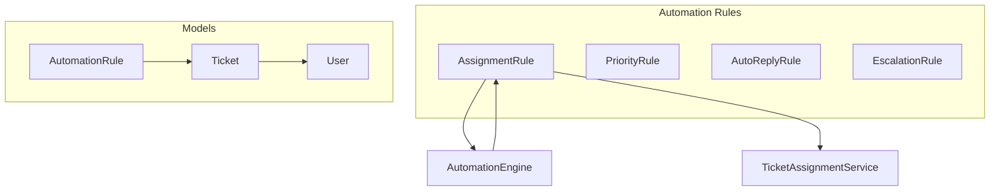
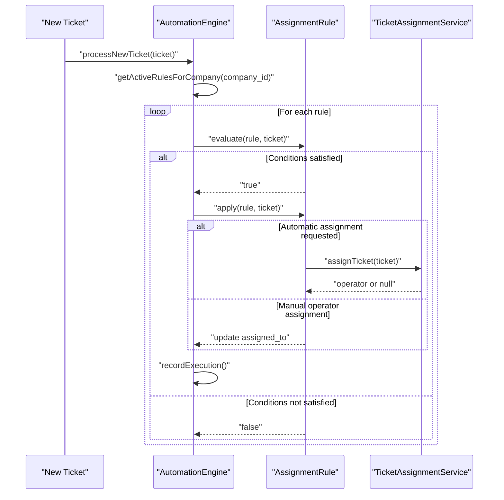
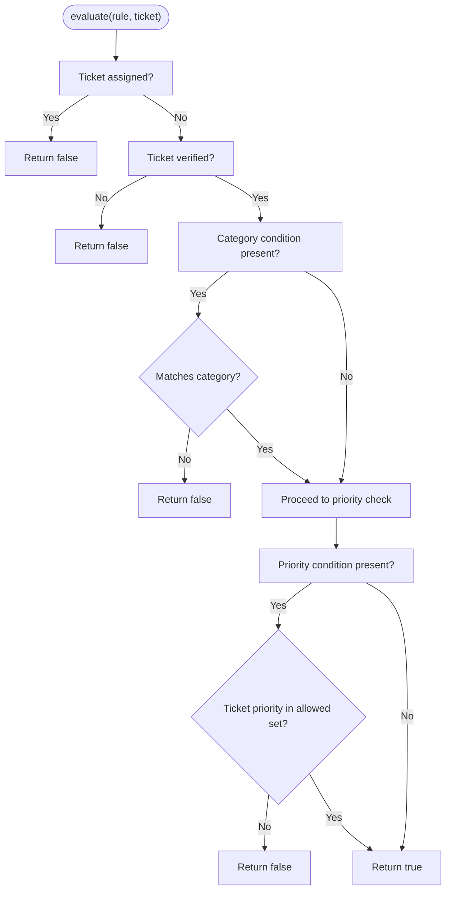
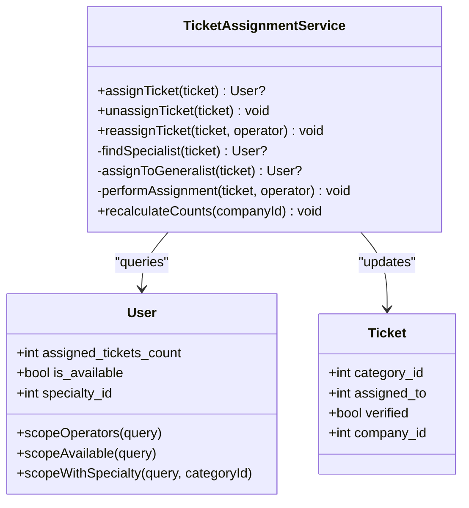
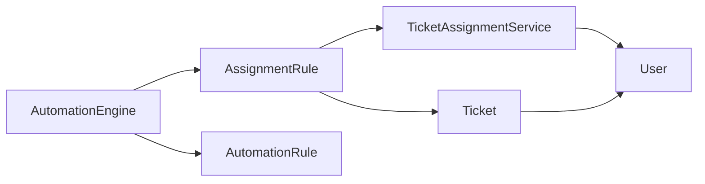

# Assignment Rule

<cite>
**Referenced Files in This Document**
- [AssignmentRule.php](file://app/Services/Automation/Rules/AssignmentRule.php)
- [TicketAssignmentService.php](file://app/Services/TicketAssignmentService.php)
- [AutomationEngine.php](file://app/Services/Automation/AutomationEngine.php)
- [AutomationRule.php](file://app/Models/AutomationRule.php)
- [Ticket.php](file://app/Models/Ticket.php)
- [User.php](file://app/Models/User.php)
- [2026_02_01_224222_create_tickets_table.php](file://database/migrations/2026_02_01_224222_create_tickets_table.php)
- [2026_03_08_171157_add_specialty_and_availability_to_users_table.php](file://database/migrations/2026_03_08_171157_add_specialty_and_availability_to_users_table.php)
- [2026_03_09_104729_create_automation_rules_table.php](file://database/migrations/2026_03_09_104729_create_automation_rules_table.php)
- [TicketAssignmentServiceTest.php](file://tests/Feature/Services/TicketAssignmentServiceTest.php)
- [AutomationEngineTest.php](file://tests/Feature/Services/AutomationEngineTest.php)
- [AutomationRuleFactory.php](file://database/factories/AutomationRuleFactory.php)
</cite>

## Table of Contents
1. [Introduction](#introduction)
2. [Project Structure](#project-structure)
3. [Core Components](#core-components)
4. [Architecture Overview](#architecture-overview)
5. [Detailed Component Analysis](#detailed-component-analysis)
6. [Dependency Analysis](#dependency-analysis)
7. [Performance Considerations](#performance-considerations)
8. [Troubleshooting Guide](#troubleshooting-guide)
9. [Conclusion](#conclusion)
10. [Appendices](#appendices)

## Introduction
This document explains the AssignmentRule automation component that automatically assigns tickets to agents based on configurable conditions. It covers evaluation logic that prevents re-assignment of already assigned tickets and handles unverified tickets, assignment mechanisms (automatic specialist assignment via TicketAssignmentService and manual operator assignment by ID), configuration examples, and integration with the AutomationEngine and broader system.

## Project Structure
The AssignmentRule lives within the automation rules subsystem and integrates with the AutomationEngine and TicketAssignmentService. Data models define the persisted rule configuration and ticket state.



**Diagram sources**
- [AssignmentRule.php:1-67](file://app/Services/Automation/Rules/AssignmentRule.php#L1-L67)
- [AutomationEngine.php:15-142](file://app/Services/Automation/AutomationEngine.php#L15-L142)
- [TicketAssignmentService.php:12-179](file://app/Services/TicketAssignmentService.php#L12-L179)
- [AutomationRule.php:22-117](file://app/Models/AutomationRule.php#L22-L117)
- [Ticket.php:9-64](file://app/Models/Ticket.php#L9-L64)
- [User.php:13-137](file://app/Models/User.php#L13-L137)

**Section sources**
- [AssignmentRule.php:1-67](file://app/Services/Automation/Rules/AssignmentRule.php#L1-L67)
- [AutomationEngine.php:15-142](file://app/Services/Automation/AutomationEngine.php#L15-L142)
- [TicketAssignmentService.php:12-179](file://app/Services/TicketAssignmentService.php#L12-L179)
- [AutomationRule.php:22-117](file://app/Models/AutomationRule.php#L22-L117)
- [Ticket.php:9-64](file://app/Models/Ticket.php#L9-L64)
- [User.php:13-137](file://app/Models/User.php#L13-L137)

## Core Components
- AssignmentRule: Implements RuleInterface and evaluates conditions against a ticket, then applies either automatic assignment or manual operator assignment.
- TicketAssignmentService: Provides automatic assignment logic, finding specialists/generalists and managing assignment state and notifications.
- AutomationEngine: Orchestrates rule processing for new tickets and escalations, invoking the appropriate rule handlers.
- AutomationRule: Stores rule configuration (conditions/actions) as arrays and tracks execution metadata.
- Ticket and User: Persisted models carrying ticket state and operator availability/specialties.

**Section sources**
- [AssignmentRule.php:9-67](file://app/Services/Automation/Rules/AssignmentRule.php#L9-L67)
- [TicketAssignmentService.php:12-179](file://app/Services/TicketAssignmentService.php#L12-L179)
- [AutomationEngine.php:15-142](file://app/Services/Automation/AutomationEngine.php#L15-L142)
- [AutomationRule.php:22-117](file://app/Models/AutomationRule.php#L22-L117)
- [Ticket.php:9-64](file://app/Models/Ticket.php#L9-L64)
- [User.php:13-137](file://app/Models/User.php#L13-L137)

## Architecture Overview
The AssignmentRule participates in the AutomationEngine’s rule processing pipeline. On new ticket creation, the engine fetches active rules for the company, evaluates each rule, and applies actions if conditions match. For assignment rules, the rule evaluates conditions and delegates assignment to TicketAssignmentService or performs a manual operator assignment.



**Diagram sources**
- [AutomationEngine.php:27-96](file://app/Services/Automation/AutomationEngine.php#L27-L96)
- [AssignmentRule.php:15-65](file://app/Services/Automation/Rules/AssignmentRule.php#L15-L65)
- [TicketAssignmentService.php:22-94](file://app/Services/TicketAssignmentService.php#L22-L94)

## Detailed Component Analysis

### AssignmentRule Evaluation and Application
- Evaluation logic:
  - Prevents re-assignment if the ticket is already assigned.
  - Skips assignment for unverified tickets.
  - Validates category condition when configured.
  - Validates priority condition supporting single value or array of priorities.
- Application logic:
  - Automatic specialist assignment via TicketAssignmentService when enabled.
  - Manual operator assignment by ID when configured.



**Diagram sources**
- [AssignmentRule.php:15-48](file://app/Services/Automation/Rules/AssignmentRule.php#L15-L48)

**Section sources**
- [AssignmentRule.php:15-65](file://app/Services/Automation/Rules/AssignmentRule.php#L15-L65)

### Automatic Specialist Assignment via TicketAssignmentService
- Assignment strategy:
  - Prefer available operator with matching specialty and lowest workload.
  - Else prefer available operator without specialty (generalist) and lowest workload.
  - If none available, notify admins and leave unassigned.
- Transactional updates:
  - Safely update ticket assignment and increment operator’s assigned_tickets_count.
  - Notify the assigned operator.
- Unassignment and reassignment:
  - Decrement counters and notify previous operator when reassigned.



**Diagram sources**
- [TicketAssignmentService.php:12-179](file://app/Services/TicketAssignmentService.php#L12-L179)
- [User.php:13-137](file://app/Models/User.php#L13-L137)
- [Ticket.php:9-64](file://app/Models/Ticket.php#L9-L64)

**Section sources**
- [TicketAssignmentService.php:22-94](file://app/Services/TicketAssignmentService.php#L22-L94)
- [TicketAssignmentService.php:99-108](file://app/Services/TicketAssignmentService.php#L99-L108)
- [TicketAssignmentService.php:113-160](file://app/Services/TicketAssignmentService.php#L113-L160)

### Manual Operator Assignment by ID
- When actions specify assigning to a particular operator ID, the rule updates the ticket’s assigned_to field directly.

**Section sources**
- [AssignmentRule.php:62-64](file://app/Services/Automation/Rules/AssignmentRule.php#L62-L64)

### Integration with AutomationEngine
- The engine registers AssignmentRule under the assignment type and executes it during processNewTicket for applicable rules.
- Execution results in either automatic or manual assignment and records rule execution metrics.

**Section sources**
- [AutomationEngine.php:18-25](file://app/Services/Automation/AutomationEngine.php#L18-L25)
- [AutomationEngine.php:27-96](file://app/Services/Automation/AutomationEngine.php#L27-L96)

### Configuration Examples
Below are typical configuration structures stored in AutomationRule.conditions and AutomationRule.actions. These are derived from factory defaults and tests.

- Conditions (assignment):
  - category_id: integer|null — optional category filter
  - priority: string|array|null — optional priority filter (single value or array)
- Actions (assignment):
  - assign_to_specialist: boolean — enable automatic specialist assignment
  - fallback_to_generalist: boolean — enable fallback to generalist if no specialist available

Expected outcomes:
- Verified tickets meeting category/priority criteria are assigned automatically to the best available operator.
- Already assigned or unverified tickets are skipped by the rule.
- Manual operator assignment overrides automatic assignment when configured.

**Section sources**
- [AutomationRuleFactory.php:47-94](file://database/factories/AutomationRuleFactory.php#L47-L94)
- [AutomationEngineTest.php:29-47](file://tests/Feature/Services/AutomationEngineTest.php#L29-L47)

## Dependency Analysis
- AssignmentRule depends on:
  - Ticket model for state checks (assigned_to, verified, category_id, priority).
  - TicketAssignmentService for automatic assignment.
- TicketAssignmentService depends on:
  - User scopes for operators, availability, specialties.
  - Ticket model for updates.
- AutomationEngine depends on:
  - Rule handlers registry mapping rule types to classes.
  - AutomationRule persistence for conditions/actions and execution tracking.



**Diagram sources**
- [AssignmentRule.php:5-13](file://app/Services/Automation/Rules/AssignmentRule.php#L5-L13)
- [AutomationEngine.php:7-11](file://app/Services/Automation/AutomationEngine.php#L7-L11)
- [TicketAssignmentService.php:5-10](file://app/Services/TicketAssignmentService.php#L5-L10)
- [Ticket.php:16-28](file://app/Models/Ticket.php#L16-L28)
- [User.php:74-121](file://app/Models/User.php#L74-L121)

**Section sources**
- [AssignmentRule.php:5-13](file://app/Services/Automation/Rules/AssignmentRule.php#L5-L13)
- [AutomationEngine.php:18-25](file://app/Services/Automation/AutomationEngine.php#L18-L25)
- [TicketAssignmentService.php:5-10](file://app/Services/TicketAssignmentService.php#L5-L10)
- [Ticket.php:16-28](file://app/Models/Ticket.php#L16-L28)
- [User.php:74-121](file://app/Models/User.php#L74-L121)

## Performance Considerations
- Indexes on tickets (status, priority, assigned_to, verified) and users (specialty_id, is_available) support efficient rule evaluation and assignment queries.
- Automatic assignment uses ordered queries by assigned_tickets_count to select the lightest workload operator, minimizing contention.
- Transactions ensure atomicity for assignment/unassignment operations.

**Section sources**
- [2026_02_01_224222_create_tickets_table.php:46-54](file://database/migrations/2026_02_01_224222_create_tickets_table.php#L46-L54)
- [2026_03_08_171157_add_specialty_and_availability_to_users_table.php:29](file://database/migrations/2026_03_08_171157_add_specialty_and_availability_to_users_table.php#L29)
- [TicketAssignmentService.php:44-52](file://app/Services/TicketAssignmentService.php#L44-L52)
- [TicketAssignmentService.php:58-82](file://app/Services/TicketAssignmentService.php#L58-L82)

## Troubleshooting Guide
Common scenarios and resolutions:
- Ticket remains unassigned:
  - Verify ticket is marked verified; unverified tickets are skipped.
  - Confirm category_id matches if category condition is set.
  - Ensure priority matches the allowed set if configured.
  - Check that no existing assignment exists (assigned_to must be null).
- No operators available:
  - Automatic assignment returns null and notifies admins; verify operator availability and specialties.
- Manual assignment overridden:
  - If a ticket is already assigned, the rule will not re-assign automatically.
- Incorrect operator selection:
  - Confirm operator availability and specialty alignment; assignment prefers matching specialty and lowest workload.

**Section sources**
- [AssignmentRule.php:17-25](file://app/Services/Automation/Rules/AssignmentRule.php#L17-L25)
- [AssignmentRule.php:29-45](file://app/Services/Automation/Rules/AssignmentRule.php#L29-L45)
- [TicketAssignmentService.php:84-94](file://app/Services/TicketAssignmentService.php#L84-L94)
- [TicketAssignmentServiceTest.php:181-204](file://tests/Feature/Services/TicketAssignmentServiceTest.php#L181-L204)
- [TicketAssignmentServiceTest.php:226-250](file://tests/Feature/Services/TicketAssignmentServiceTest.php#L226-L250)

## Conclusion
The AssignmentRule provides robust, configurable automatic ticket assignment integrated with the AutomationEngine and TicketAssignmentService. It enforces safety checks to avoid re-assigning verified tickets and respects operator availability and specialties, while also supporting manual operator assignments when needed.

## Appendices

### Data Model Relationships
```mermaid
erDiagram
AUTOMATION_RULE {
int id PK
int company_id FK
string name
string type
json conditions
json actions
boolean is_active
int priority
int executions_count
datetime last_executed_at
}
TICKET {
int id PK
int company_id FK
string ticket_number UK
string subject
text description
enum status
enum priority
int assigned_to FK
int category_id FK
boolean verified
timestamps
}
USER {
int id PK
int company_id FK
string role
int specialty_id FK
boolean is_available
int assigned_tickets_count
}
AUTOMATION_RULE ||--o{ TICKET : "scoped by company"
TICKET }o--|| USER : "assigned_to"
TICKET }o--|| TICKET_CATEGORY : "category_id"
```

**Diagram sources**
- [2026_03_09_104729_create_automation_rules_table.php:14-42](file://database/migrations/2026_03_09_104729_create_automation_rules_table.php#L14-L42)
- [2026_02_01_224222_create_tickets_table.php:11-54](file://database/migrations/2026_02_01_224222_create_tickets_table.php#L11-L54)
- [2026_03_08_171157_add_specialty_and_availability_to_users_table.php:11-31](file://database/migrations/2026_03_08_171157_add_specialty_and_availability_to_users_table.php#L11-L31)