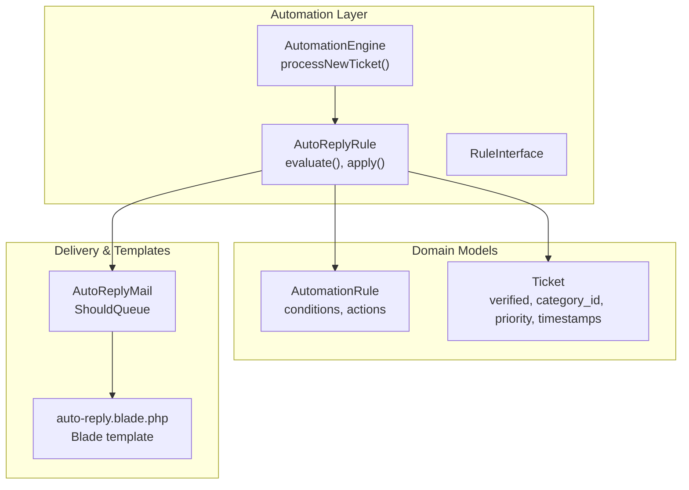
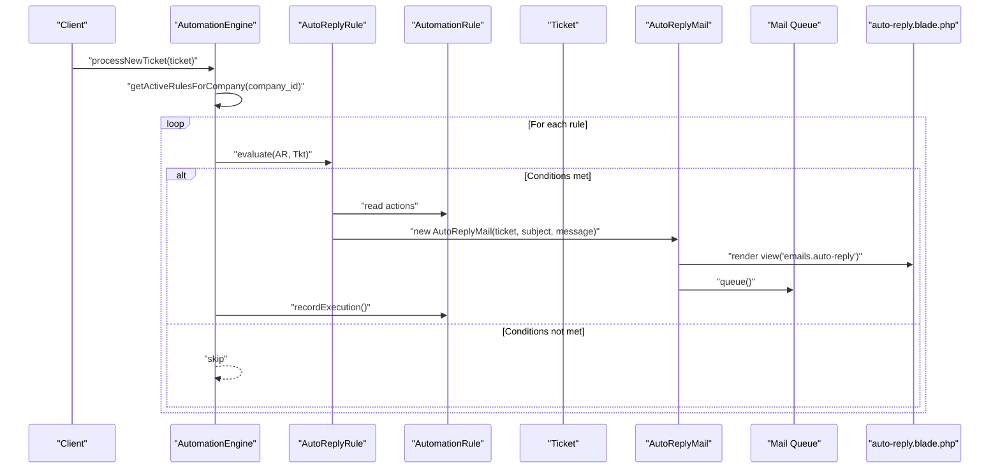
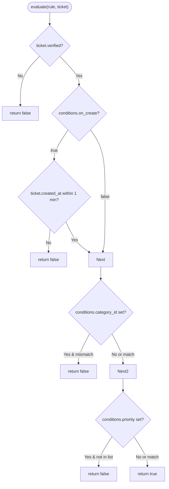
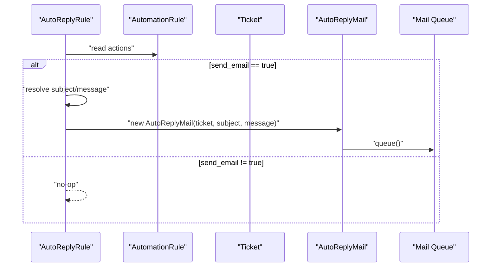
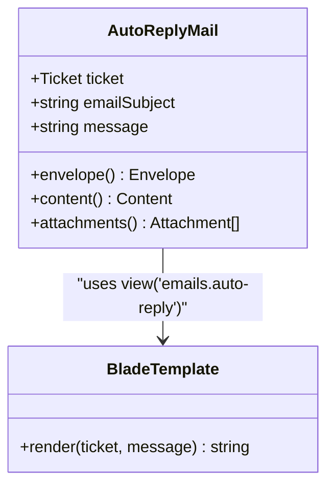
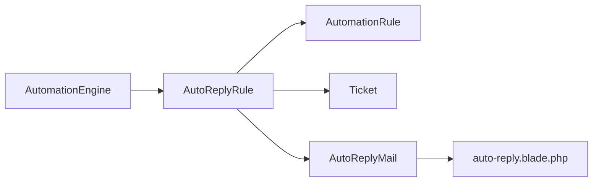
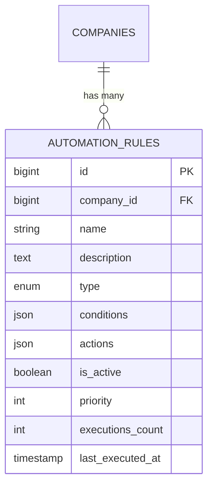

# Auto-reply Rule

<cite>
**Referenced Files in This Document**
- [AutoReplyRule.php](file://app/Services/Automation/Rules/AutoReplyRule.php)
- [AutomationEngine.php](file://app/Services/Automation/AutomationEngine.php)
- [RuleInterface.php](file://app/Services/Automation/Rules/RuleInterface.php)
- [AutomationRule.php](file://app/Models/AutomationRule.php)
- [Ticket.php](file://app/Models/Ticket.php)
- [AutoReplyMail.php](file://app/Mail/AutoReplyMail.php)
- [auto-reply.blade.php](file://resources/views/emails/auto-reply.blade.php)
- [SupportReplyAgent.php](file://app/Ai/Agents/SupportReplyAgent.php)
- [2026_03_09_104729_create_automation_rules_table.php](file://database/migrations/2026_03_09_104729_create_automation_rules_table.php)
- [AutomationEngineTest.php](file://tests/Feature/Services/AutomationEngineTest.php)
- [automation.blade.php](file://resources/views/dashboard/automation.blade.php)
- [automation-rules-table.blade.php](file://resources/views/livewire/dashboard/automation-rules-table.blade.php)
- [ai.php](file://config/ai.php)
</cite>

## Table of Contents
1. [Introduction](#introduction)
2. [Project Structure](#project-structure)
3. [Core Components](#core-components)
4. [Architecture Overview](#architecture-overview)
5. [Detailed Component Analysis](#detailed-component-analysis)
6. [Dependency Analysis](#dependency-analysis)
7. [Performance Considerations](#performance-considerations)
8. [Troubleshooting Guide](#troubleshooting-guide)
9. [Conclusion](#conclusion)
10. [Appendices](#appendices)

## Introduction
This document explains the AutoReplyRule automation component responsible for generating and sending automated customer responses. It covers how the rule evaluates trigger conditions, constructs personalized email responses, integrates with the template system, and delivers messages via the queue. It also documents customization options, personalization capabilities, and compliance with communication standards.

## Project Structure
The AutoReplyRule lives within the automation service layer and interacts with the automation engine, models, mail system, and Blade templates. The UI enables administrators to configure rules and preview their effects.

**Diagram sources**
- [AutomationEngine.php:30-41](file://app/Services/Automation/AutomationEngine.php#L30-L41)
- [AutoReplyRule.php:12-48](file://app/Services/Automation/Rules/AutoReplyRule.php#L12-L48)
- [RuleInterface.php:8-19](file://app/Services/Automation/Rules/RuleInterface.php#L8-L19)
- [AutomationRule.php:15-16](file://app/Models/AutomationRule.php#L15-L16)
- [Ticket.php](file://app/Models/Ticket.php#L14)
- [AutoReplyMail.php:13-21](file://app/Mail/AutoReplyMail.php#L13-L21)
- [auto-reply.blade.php:1-92](file://resources/views/emails/auto-reply.blade.php#L1-L92)

**Section sources**
- [AutomationEngine.php:15-41](file://app/Services/Automation/AutomationEngine.php#L15-L41)
- [AutoReplyRule.php:10-65](file://app/Services/Automation/Rules/AutoReplyRule.php#L10-L65)
- [AutomationRule.php:22-117](file://app/Models/AutomationRule.php#L22-L117)
- [Ticket.php:9-64](file://app/Models/Ticket.php#L9-L64)
- [AutoReplyMail.php:13-47](file://app/Mail/AutoReplyMail.php#L13-L47)
- [auto-reply.blade.php:1-92](file://resources/views/emails/auto-reply.blade.php#L1-L92)

## Core Components
- AutoReplyRule: Implements evaluation and application logic for auto-reply automation.
- AutomationEngine: Orchestrates rule processing for newly created tickets.
- AutomationRule: Stores rule conditions and actions as JSON arrays.
- Ticket: Provides context (verification, category, priority, timestamps) used by rules.
- AutoReplyMail: Queued mailable that renders the auto-reply email.
- auto-reply.blade.php: Blade template for the auto-reply email content.

**Section sources**
- [AutoReplyRule.php:10-65](file://app/Services/Automation/Rules/AutoReplyRule.php#L10-L65)
- [AutomationEngine.php:15-96](file://app/Services/Automation/AutomationEngine.php#L15-L96)
- [AutomationRule.php:22-117](file://app/Models/AutomationRule.php#L22-L117)
- [Ticket.php:9-64](file://app/Models/Ticket.php#L9-L64)
- [AutoReplyMail.php:13-47](file://app/Mail/AutoReplyMail.php#L13-L47)
- [auto-reply.blade.php:1-92](file://resources/views/emails/auto-reply.blade.php#L1-L92)

## Architecture Overview
The automation engine fetches active rules for a company, orders them by priority, and executes each rule against a newly created ticket. The AutoReplyRule evaluates conditions and, if satisfied, queues an AutoReplyMail using a Blade template.

**Diagram sources**
- [AutomationEngine.php:30-96](file://app/Services/Automation/AutomationEngine.php#L30-L96)
- [AutoReplyRule.php:12-63](file://app/Services/Automation/Rules/AutoReplyRule.php#L12-L63)
- [AutoReplyMail.php:17-21](file://app/Mail/AutoReplyMail.php#L17-L21)
- [auto-reply.blade.php:33-34](file://resources/views/emails/auto-reply.blade.php#L33-L34)

## Detailed Component Analysis

### AutoReplyRule Evaluation Logic
The rule evaluates multiple conditions before deciding whether to send an auto-reply:
- Verified ticket requirement: auto-reply only fires for verified tickets.
- Creation-time constraint: optional trigger on ticket creation within a short window.
- Category matching: optional category filter.
- Priority filtering: supports single or multiple priorities.

**Diagram sources**
- [AutoReplyRule.php:12-47](file://app/Services/Automation/Rules/AutoReplyRule.php#L12-L47)

**Section sources**
- [AutoReplyRule.php:12-47](file://app/Services/Automation/Rules/AutoReplyRule.php#L12-L47)

### AutoReplyRule Application Logic
When conditions are met, the rule applies actions:
- Requires send_email action enabled.
- Uses a configurable subject and message; defaults are applied otherwise.
- Queues an AutoReplyMail to the customer’s email address.

**Diagram sources**
- [AutoReplyRule.php:50-63](file://app/Services/Automation/Rules/AutoReplyRule.php#L50-L63)
- [AutoReplyMail.php:17-21](file://app/Mail/AutoReplyMail.php#L17-L21)

**Section sources**
- [AutoReplyRule.php:50-63](file://app/Services/Automation/Rules/AutoReplyRule.php#L50-L63)

### Template System Integration
- AutoReplyMail defines the email subject and binds the ticket and message variables.
- The Blade view renders a responsive HTML email with placeholders for customer name, ticket number, subject, priority, and status.
- Attachments are supported but not used by default.

**Diagram sources**
- [AutoReplyMail.php:17-35](file://app/Mail/AutoReplyMail.php#L17-L35)
- [auto-reply.blade.php:64-91](file://resources/views/emails/auto-reply.blade.php#L64-L91)

**Section sources**
- [AutoReplyMail.php:13-47](file://app/Mail/AutoReplyMail.php#L13-L47)
- [auto-reply.blade.php:1-92](file://resources/views/emails/auto-reply.blade.php#L1-L92)

### Delivery Mechanisms
- AutoReplyMail implements the ShouldQueue interface, ensuring asynchronous delivery.
- The mail is queued for background processing, improving responsiveness during ticket creation.

**Section sources**
- [AutoReplyMail.php:7-11](file://app/Mail/AutoReplyMail.php#L7-L11)
- [AutoReplyRule.php:61-62](file://app/Services/Automation/Rules/AutoReplyRule.php#L61-L62)

### Trigger Conditions and Examples
- Verified tickets: auto-reply requires the ticket to be marked verified.
- Creation-time trigger: optional, checks if the ticket was created within a short timeframe.
- Category filter: optional category ID matching.
- Priority filter: accepts a single priority or an array of priorities.

Example configurations (from factory and UI):
- Conditions for auto-reply: on_create enabled.
- Actions for auto-reply: send_email enabled, with a default or custom message.

**Section sources**
- [AutoReplyRule.php:19-45](file://app/Services/Automation/Rules/AutoReplyRule.php#L19-L45)
- [AutomationEngineTest.php:97-123](file://tests/Feature/Services/AutomationEngineTest.php#L97-L123)
- [automation-rules-table.blade.php:293-298](file://resources/views/livewire/dashboard/automation-rules-table.blade.php#L293-L298)
- [automation-rules-table.blade.php:341-358](file://resources/views/livewire/dashboard/automation-rules-table.blade.php#L341-L358)

### Response Generation Logic
- Predefined templates: The rule uses a fixed message and subject from actions, with sensible defaults.
- Personalization: The template includes customer name, ticket number, subject, priority, and status.
- AI integration: The SupportReplyAgent exists for generating AI-powered replies elsewhere in the system; AutoReplyRule currently uses configured text rather than AI generation.

Note: While an AI agent exists, AutoReplyRule does not invoke it for auto-reply generation.

**Section sources**
- [AutoReplyRule.php:58-59](file://app/Services/Automation/Rules/AutoReplyRule.php#L58-L59)
- [auto-reply.blade.php:70-79](file://resources/views/emails/auto-reply.blade.php#L70-L79)
- [SupportReplyAgent.php:16-28](file://app/Ai/Agents/SupportReplyAgent.php#L16-L28)

### Customization Options
Administrators can customize auto-reply rules via the UI:
- Rule name, description, type, priority, and activation status.
- Conditions: category selection and creation-time trigger.
- Actions: toggle email sending, optional subject override, and message editing.

These settings are persisted as JSON in the automation_rules table.

**Section sources**
- [automation.blade.php:1-20](file://resources/views/dashboard/automation.blade.php#L1-L20)
- [automation-rules-table.blade.php:191-400](file://resources/views/livewire/dashboard/automation-rules-table.blade.php#L191-L400)
- [2026_03_09_104729_create_automation_rules_table.php:14-42](file://database/migrations/2026_03_09_104729_create_automation_rules_table.php#L14-L42)

### Compliance with Communication Standards
- Automated messaging notice: The template includes a footer indicating the message is automated and advising against replying directly.
- Personalization: Includes customer name and ticket details to avoid generic, unprofessional communications.
- Accessibility: The template uses semantic markup and readable styles suitable for common email clients.

**Section sources**
- [auto-reply.blade.php:86-88](file://resources/views/emails/auto-reply.blade.php#L86-L88)

## Dependency Analysis
The AutoReplyRule depends on the automation engine, rule model, ticket model, and mail system. The engine maps rule types to handlers and executes them in priority order.

**Diagram sources**
- [AutomationEngine.php:18-25](file://app/Services/Automation/AutomationEngine.php#L18-L25)
- [AutoReplyRule.php:10-11](file://app/Services/Automation/Rules/AutoReplyRule.php#L10-L11)
- [AutomationRule.php:22-50](file://app/Models/AutomationRule.php#L22-L50)
- [Ticket.php:9-24](file://app/Models/Ticket.php#L9-L24)
- [AutoReplyMail.php:13-21](file://app/Mail/AutoReplyMail.php#L13-L21)

**Section sources**
- [AutomationEngine.php:15-142](file://app/Services/Automation/AutomationEngine.php#L15-L142)
- [AutoReplyRule.php:10-65](file://app/Services/Automation/Rules/AutoReplyRule.php#L10-L65)

## Performance Considerations
- Asynchronous delivery: AutoReplyMail is queued, preventing blocking the ticket creation flow.
- Minimal computation: Evaluation logic is lightweight, focusing on simple comparisons and time windows.
- Scalability: Rules are ordered by priority and filtered by company, reducing unnecessary evaluations.

## Troubleshooting Guide
Common issues and resolutions:
- Auto-reply not sent:
  - Verify the ticket is marked verified.
  - Confirm the rule’s conditions match the ticket’s category and priority.
  - Ensure the send_email action is enabled and the rule is active.
- Incorrect timing:
  - Creation-time triggers only activate for tickets created within a short timeframe.
- Template rendering problems:
  - Check that the Blade view exists and variables are present in the bound data.
- Queue failures:
  - Inspect logs for mail queue errors; ensure mail driver configuration is valid.

**Section sources**
- [AutoReplyRule.php:14-17](file://app/Services/Automation/Rules/AutoReplyRule.php#L14-L17)
- [AutoReplyRule.php:22-27](file://app/Services/Automation/Rules/AutoReplyRule.php#L22-L27)
- [AutoReplyMail.php:30-35](file://app/Mail/AutoReplyMail.php#L30-L35)
- [AutomationEngine.php:87-95](file://app/Services/Automation/AutomationEngine.php#L87-L95)

## Conclusion
The AutoReplyRule provides a robust, configurable mechanism for automatically acknowledging customer tickets. It enforces verification and optional creation-time triggers, supports category and priority filters, and delivers personalized HTML emails via a queued mailable. Administrators can tailor messages and conditions through the UI, while the underlying architecture ensures scalability and reliability.

## Appendices

### Data Model Overview
Automation rules are stored with JSON-encoded conditions and actions, enabling flexible configuration per company and type.

**Diagram sources**
- [2026_03_09_104729_create_automation_rules_table.php:14-42](file://database/migrations/2026_03_09_104729_create_automation_rules_table.php#L14-L42)

**Section sources**
- [2026_03_09_104729_create_automation_rules_table.php:14-42](file://database/migrations/2026_03_09_104729_create_automation_rules_table.php#L14-L42)
- [AutomationRule.php:22-117](file://app/Models/AutomationRule.php#L22-L117)

### AI Agent Integration Notes
While an AI agent exists for generating support replies, AutoReplyRule does not integrate with it for auto-reply generation. AI generation could be considered as an enhancement to the message field in future iterations.

**Section sources**
- [SupportReplyAgent.php:16-28](file://app/Ai/Agents/SupportReplyAgent.php#L16-L28)
- [ai.php:1-130](file://config/ai.php#L1-L130)