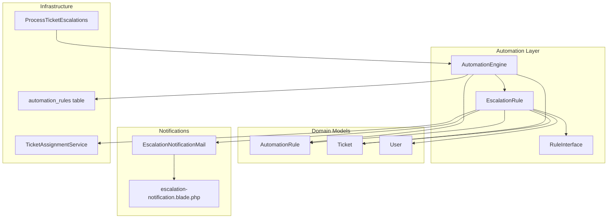
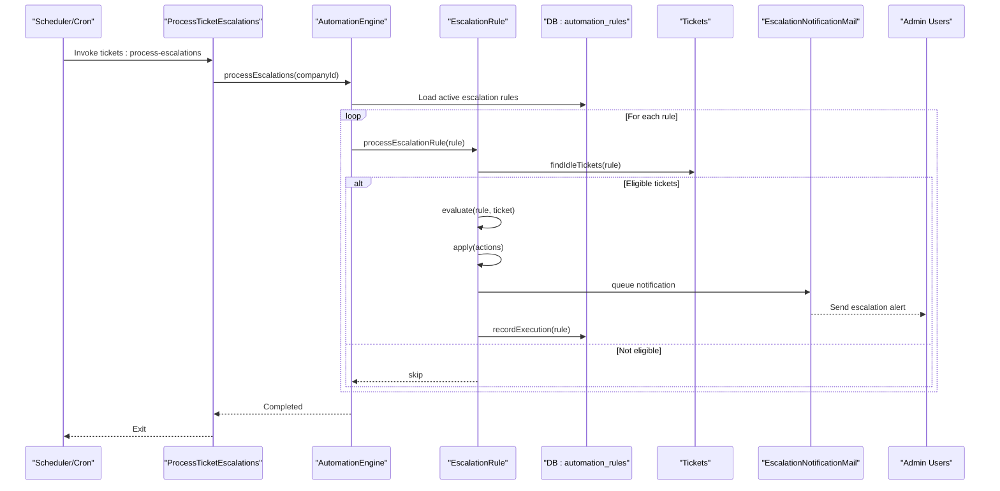
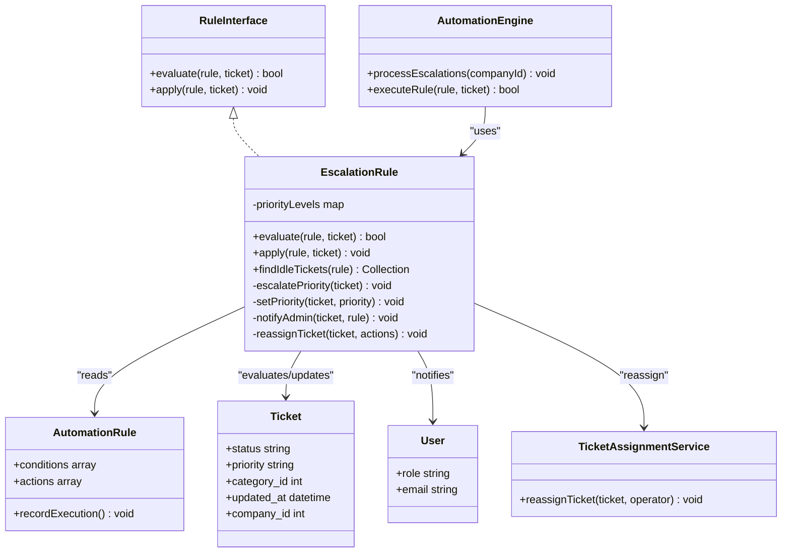
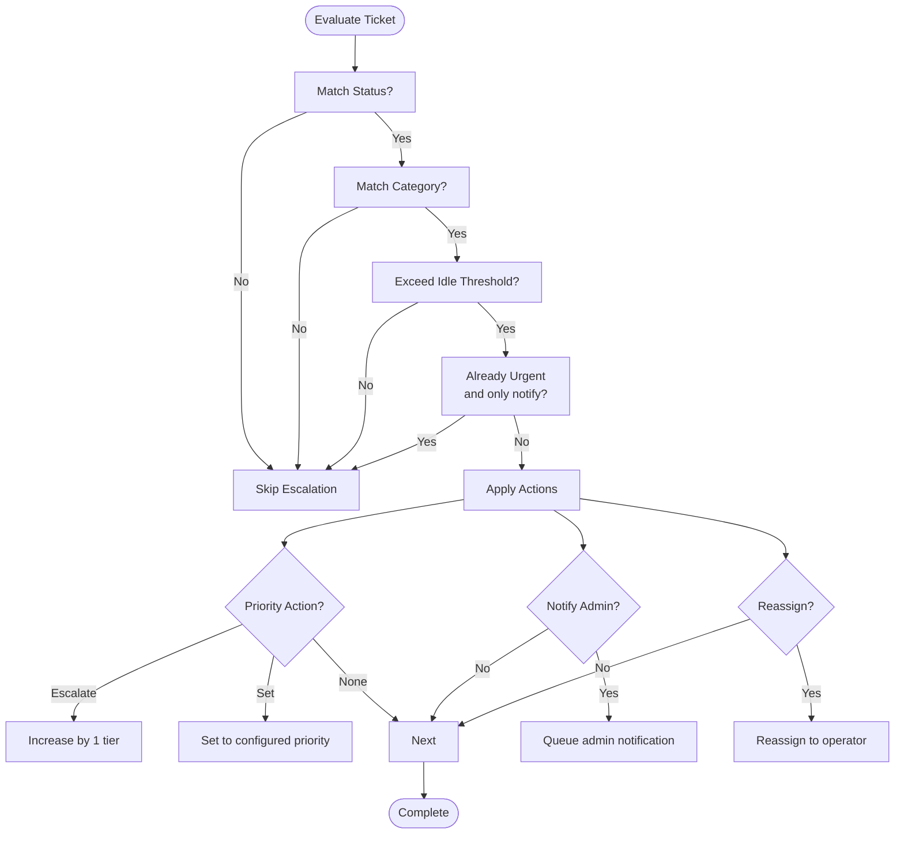
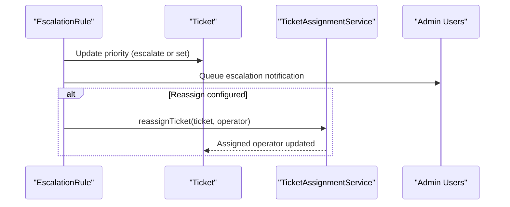
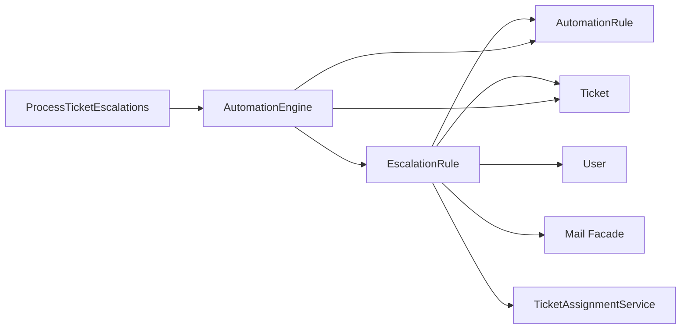

# Escalation Rule

<cite>
**Referenced Files in This Document**
- [EscalationRule.php](file://app/Services/Automation/Rules/EscalationRule.php)
- [AutomationEngine.php](file://app/Services/Automation/AutomationEngine.php)
- [ProcessTicketEscalations.php](file://app/Console/Commands/ProcessTicketEscalations.php)
- [AutomationRule.php](file://app/Models/AutomationRule.php)
- [TicketAssignmentService.php](file://app/Services/TicketAssignmentService.php)
- [EscalationNotificationMail.php](file://app/Mail/EscalationNotificationMail.php)
- [escalation-notification.blade.php](file://resources/views/emails/escalation-notification.blade.php)
- [2026_03_09_104729_create_automation_rules_table.php](file://database/migrations/2026_03_09_104729_create_automation_rules_table.php)
- [AutomationEngineTest.php](file://tests/Feature/Services/AutomationEngineTest.php)
- [RuleInterface.php](file://app/Services/Automation/Rules/RuleInterface.php)
</cite>

## Table of Contents
1. [Introduction](#introduction)
2. [Project Structure](#project-structure)
3. [Core Components](#core-components)
4. [Architecture Overview](#architecture-overview)
5. [Detailed Component Analysis](#detailed-component-analysis)
6. [Dependency Analysis](#dependency-analysis)
7. [Performance Considerations](#performance-considerations)
8. [Troubleshooting Guide](#troubleshooting-guide)
9. [Conclusion](#conclusion)
10. [Appendices](#appendices)

## Introduction
This document explains the EscalationRule automation component responsible for identifying overdue or unresponsive tickets and applying configurable escalation actions. It covers timing conditions, escalation thresholds, notification mechanisms, and action sequences. It also describes how escalations integrate with the broader automation system, interact with other automation rules, and support human intervention processes.

## Project Structure
The escalation feature spans several layers:
- Rule definition and evaluation logic
- Automation engine orchestration
- Console command to trigger periodic escalation processing
- Email notification delivery
- Database schema for storing rule conditions and actions
- Tests validating behavior

**Diagram sources**
- [AutomationEngine.php:15-142](file://app/Services/Automation/AutomationEngine.php#L15-L142)
- [EscalationRule.php:12-157](file://app/Services/Automation/Rules/EscalationRule.php#L12-L157)
- [ProcessTicketEscalations.php:9-55](file://app/Console/Commands/ProcessTicketEscalations.php#L9-L55)
- [EscalationNotificationMail.php:14-47](file://app/Mail/EscalationNotificationMail.php#L14-L47)
- [escalation-notification.blade.php:1-149](file://resources/views/emails/escalation-notification.blade.php#L1-L149)
- [2026_03_09_104729_create_automation_rules_table.php:14-42](file://database/migrations/2026_03_09_104729_create_automation_rules_table.php#L14-L42)
- [TicketAssignmentService.php:12-179](file://app/Services/TicketAssignmentService.php#L12-L179)

**Section sources**
- [AutomationEngine.php:15-142](file://app/Services/Automation/AutomationEngine.php#L15-L142)
- [EscalationRule.php:12-157](file://app/Services/Automation/Rules/EscalationRule.php#L12-L157)
- [ProcessTicketEscalations.php:9-55](file://app/Console/Commands/ProcessTicketEscalations.php#L9-L55)
- [EscalationNotificationMail.php:14-47](file://app/Mail/EscalationNotificationMail.php#L14-L47)
- [escalation-notification.blade.php:1-149](file://resources/views/emails/escalation-notification.blade.php#L1-L149)
- [2026_03_09_104729_create_automation_rules_table.php:14-42](file://database/migrations/2026_03_09_104729_create_automation_rules_table.php#L14-L42)
- [TicketAssignmentService.php:12-179](file://app/Services/TicketAssignmentService.php#L12-L179)

## Core Components
- EscalationRule: Implements the evaluation and application of escalation logic against tickets.
- AutomationEngine: Orchestrates rule processing, including escalation scanning and execution.
- ProcessTicketEscalations: Console command to run escalation processing for companies.
- AutomationRule: Domain model representing rule definitions with conditions and actions.
- EscalationNotificationMail and escalation-notification.blade.php: Email notification for escalation events.
- TicketAssignmentService: Handles reassignment of tickets during escalation.
- automation_rules table: Stores rule definitions with JSON conditions/actions.

Key capabilities:
- Evaluate eligibility based on status, category, and idle time thresholds.
- Increase priority or set a specific priority level.
- Notify administrators via queued emails.
- Reassign tickets to operators when configured.
- Integrate with the broader automation pipeline and execution tracking.

**Section sources**
- [EscalationRule.php:24-85](file://app/Services/Automation/Rules/EscalationRule.php#L24-L85)
- [AutomationEngine.php:46-111](file://app/Services/Automation/AutomationEngine.php#L46-L111)
- [ProcessTicketEscalations.php:29-53](file://app/Console/Commands/ProcessTicketEscalations.php#L29-L53)
- [AutomationRule.php:22-117](file://app/Models/AutomationRule.php#L22-L117)
- [EscalationNotificationMail.php:14-47](file://app/Mail/EscalationNotificationMail.php#L14-L47)
- [escalation-notification.blade.php:108-146](file://resources/views/emails/escalation-notification.blade.php#L108-L146)
- [TicketAssignmentService.php:134-160](file://app/Services/TicketAssignmentService.php#L134-L160)
- [2026_03_09_104729_create_automation_rules_table.php:14-42](file://database/migrations/2026_03_09_104729_create_automation_rules_table.php#L14-L42)

## Architecture Overview
The escalation lifecycle:
- A scheduled or manual trigger invokes the console command.
- The command delegates to the AutomationEngine to process escalation rules for a company.
- The engine filters active escalation rules and executes them.
- For each rule, EscalationRule identifies idle tickets meeting conditions.
- If conditions pass, EscalationRule applies configured actions (priority change, notification, reassignment).
- Execution counts and timestamps are recorded per rule.

**Diagram sources**
- [ProcessTicketEscalations.php:29-53](file://app/Console/Commands/ProcessTicketEscalations.php#L29-L53)
- [AutomationEngine.php:46-111](file://app/Services/Automation/AutomationEngine.php#L46-L111)
- [EscalationRule.php:92-113](file://app/Services/Automation/Rules/EscalationRule.php#L92-L113)
- [EscalationRule.php:24-85](file://app/Services/Automation/Rules/EscalationRule.php#L24-L85)
- [EscalationNotificationMail.php:14-47](file://app/Mail/EscalationNotificationMail.php#L14-L47)
- [AutomationRule.php:96-100](file://app/Models/AutomationRule.php#L96-L100)

## Detailed Component Analysis

### EscalationRule Evaluation and Application
EscalationRule implements the RuleInterface contract and encapsulates:
- Priority levels mapping and transitions.
- Condition evaluation: status inclusion, category match, idle threshold, and special handling for urgent tickets.
- Action application: priority escalation or explicit priority setting, admin notification, and optional reassignment.

**Diagram sources**
- [RuleInterface.php:8-20](file://app/Services/Automation/Rules/RuleInterface.php#L8-L20)
- [EscalationRule.php:12-157](file://app/Services/Automation/Rules/EscalationRule.php#L12-L157)
- [AutomationEngine.php:15-142](file://app/Services/Automation/AutomationEngine.php#L15-L142)
- [AutomationRule.php:22-117](file://app/Models/AutomationRule.php#L22-L117)
- [TicketAssignmentService.php:12-179](file://app/Services/TicketAssignmentService.php#L12-L179)

**Section sources**
- [EscalationRule.php:12-157](file://app/Services/Automation/Rules/EscalationRule.php#L12-L157)
- [RuleInterface.php:8-20](file://app/Services/Automation/Rules/RuleInterface.php#L8-L20)

### Timing Conditions and Thresholds
- Idle threshold: Defined by the rule’s conditions as idle_hours. Tickets older than this threshold are considered idle.
- Status filter: The rule matches tickets whose status is included in the configured statuses (defaults to pending and open).
- Category filter: Optional category_id restricts escalation to specific categories.
- Urgent ticket guard: If a ticket is already urgent and the only configured action is notifying admins, the rule skips escalation to prevent redundant notifications.

These conditions collectively define when a ticket becomes eligible for escalation.

**Section sources**
- [EscalationRule.php:24-60](file://app/Services/Automation/Rules/EscalationRule.php#L24-L60)
- [AutomationEngineTest.php:209-241](file://tests/Feature/Services/AutomationEngineTest.php#L209-L241)

### Escalation Thresholds and Priority Transitions
- Priority levels: low, medium, high, urgent mapped to numeric tiers.
- Automatic escalation: Increases the current priority by one tier (e.g., low → medium).
- Explicit priority setting: Allows setting a specific target priority regardless of current level.
- Urgency guard: Prevents escalating an already urgent ticket solely for admin notification.

**Diagram sources**
- [EscalationRule.php:24-85](file://app/Services/Automation/Rules/EscalationRule.php#L24-L85)
- [EscalationRule.php:115-132](file://app/Services/Automation/Rules/EscalationRule.php#L115-L132)
- [EscalationRule.php:134-145](file://app/Services/Automation/Rules/EscalationRule.php#L134-L145)
- [EscalationRule.php:147-155](file://app/Services/Automation/Rules/EscalationRule.php#L147-L155)

**Section sources**
- [EscalationRule.php:17-22](file://app/Services/Automation/Rules/EscalationRule.php#L17-L22)
- [EscalationRule.php:115-132](file://app/Services/Automation/Rules/EscalationRule.php#L115-L132)
- [EscalationRule.php:54-57](file://app/Services/Automation/Rules/EscalationRule.php#L54-L57)

### Notification Mechanisms
- Admin recipients: All users with role admin (and company match) receive escalation notifications.
- Email transport: Uses a mailable that queues messages for background delivery.
- Email template: Provides a styled HTML email with ticket details and urgency indicators.

Integration points:
- EscalationRule.notifyAdmin triggers EscalationNotificationMail.
- The mailer uses a Blade view for rendering.

**Section sources**
- [EscalationRule.php:134-145](file://app/Services/Automation/Rules/EscalationRule.php#L134-L145)
- [EscalationNotificationMail.php:14-47](file://app/Mail/EscalationNotificationMail.php#L14-L47)
- [escalation-notification.blade.php:108-146](file://resources/views/emails/escalation-notification.blade.php#L108-L146)

### Action Sequences and Reassignment
- Priority actions: Either escalate by one tier or set a specific priority.
- Notification: Queues an email to all admins for the ticket’s company.
- Reassignment: Optionally reassigns the ticket to a specified operator using the assignment service.

**Diagram sources**
- [EscalationRule.php:62-85](file://app/Services/Automation/Rules/EscalationRule.php#L62-L85)
- [EscalationRule.php:147-155](file://app/Services/Automation/Rules/EscalationRule.php#L147-L155)
- [TicketAssignmentService.php:134-160](file://app/Services/TicketAssignmentService.php#L134-L160)

**Section sources**
- [EscalationRule.php:62-85](file://app/Services/Automation/Rules/EscalationRule.php#L62-L85)
- [TicketAssignmentService.php:134-160](file://app/Services/TicketAssignmentService.php#L134-L160)

### Escalation Hierarchies and Timeout Configurations
Escalation hierarchies are defined by multiple active escalation rules per company. Rules are ordered by priority (ascending), so lower numbers execute first. Each rule defines:
- idle_hours: Threshold for considering a ticket idle.
- status: List of statuses to match.
- category_id: Optional category filter.
- actions: Combinations of escalate_priority, set_priority, notify_admin, and reassign options.

Timeout configurations:
- idle_hours defaults to 24 if unspecified.
- Status defaults to pending and open if unspecified.
- Category filter is optional.

**Section sources**
- [AutomationRule.php:22-117](file://app/Models/AutomationRule.php#L22-L117)
- [EscalationRule.php:92-113](file://app/Services/Automation/Rules/EscalationRule.php#L92-L113)
- [AutomationEngine.php:118-125](file://app/Services/Automation/AutomationEngine.php#L118-L125)
- [AutomationEngineTest.php:209-241](file://tests/Feature/Services/AutomationEngineTest.php#L209-L241)

### Integration with the Notification System
- EscalationNotificationMail implements ShouldQueue and uses a Blade view for content.
- The mailer is invoked from EscalationRule.notifyAdmin, which retrieves all admin users for the ticket’s company.
- Emails are queued for asynchronous delivery.

**Section sources**
- [EscalationNotificationMail.php:14-47](file://app/Mail/EscalationNotificationMail.php#L14-L47)
- [escalation-notification.blade.php:108-146](file://resources/views/emails/escalation-notification.blade.php#L108-L146)
- [EscalationRule.php:134-145](file://app/Services/Automation/Rules/EscalationRule.php#L134-L145)

### Interaction with Other Automation Rules and Human Intervention
- New ticket rules (assignment, priority, auto-reply) are processed synchronously upon creation and excluded from escalation processing.
- Escalation rules are processed separately via the console command and operate on idle tickets.
- Human intervention: EscalationRule can notify admins and optionally reassign tickets to operators, allowing human operators to take action.

**Section sources**
- [AutomationEngine.php:28-41](file://app/Services/Automation/AutomationEngine.php#L28-L41)
- [AutomationEngine.php:46-54](file://app/Services/Automation/AutomationEngine.php#L46-L54)
- [EscalationRule.php:76-84](file://app/Services/Automation/Rules/EscalationRule.php#L76-L84)

## Dependency Analysis
- EscalationRule depends on:
  - AutomationRule for conditions and actions.
  - Ticket for status, priority, category, and timestamps.
  - User for admin recipients.
  - Mail facade for queued notifications.
  - TicketAssignmentService for reassignment.
- AutomationEngine coordinates rule selection and execution, orders rules by priority, and records executions.
- Console command orchestrates company-wide escalation processing.

**Diagram sources**
- [EscalationRule.php:5-10](file://app/Services/Automation/Rules/EscalationRule.php#L5-L10)
- [AutomationEngine.php:5-11](file://app/Services/Automation/AutomationEngine.php#L5-L11)
- [ProcessTicketEscalations.php:5-7](file://app/Console/Commands/ProcessTicketEscalations.php#L5-L7)

**Section sources**
- [EscalationRule.php:5-10](file://app/Services/Automation/Rules/EscalationRule.php#L5-L10)
- [AutomationEngine.php:5-11](file://app/Services/Automation/AutomationEngine.php#L5-L11)
- [ProcessTicketEscalations.php:5-7](file://app/Console/Commands/ProcessTicketEscalations.php#L5-L7)

## Performance Considerations
- Query efficiency: findIdleTickets uses company_id, status in-list, verified flag, and updated_at threshold to minimize scans.
- Action batching: Notifications are queued; reassignment uses transactions to keep state consistent.
- Execution tracking: AutomationRule.recordExecution increments counters and updates timestamps for observability.

Recommendations:
- Monitor queue throughput for escalation notifications.
- Tune idle_hours thresholds to balance responsiveness and noise.
- Ensure indexes on automation_rules.company_id, is_active, type, and priority for efficient filtering.

**Section sources**
- [EscalationRule.php:92-113](file://app/Services/Automation/Rules/EscalationRule.php#L92-L113)
- [AutomationEngine.php:118-125](file://app/Services/Automation/AutomationEngine.php#L118-L125)
- [AutomationRule.php:96-100](file://app/Models/AutomationRule.php#L96-L100)
- [2026_03_09_104729_create_automation_rules_table.php:39-41](file://database/migrations/2026_03_09_104729_create_automation_rules_table.php#L39-L41)

## Troubleshooting Guide
Common scenarios and checks:
- No escalation occurs:
  - Verify the rule is active and of type escalation.
  - Confirm ticket status matches configured statuses and category matches if set.
  - Ensure idle_hours threshold is appropriate for your workload.
- Priority did not change:
  - Check if the ticket is already urgent and only admin notification is configured.
  - Verify actions include escalate_priority or set_priority.
- Admins not notified:
  - Confirm users with role admin exist for the ticket’s company.
  - Check queue worker health and mail configuration.
- Reassignment not applied:
  - Ensure reassign_to_operator_id is set and the operator exists.
  - Verify TicketAssignmentService is reachable and functional.

Validation references:
- Test coverage demonstrates idle ticket detection and admin notification flow.

**Section sources**
- [AutomationEngineTest.php:209-277](file://tests/Feature/Services/AutomationEngineTest.php#L209-L277)
- [EscalationRule.php:54-57](file://app/Services/Automation/Rules/EscalationRule.php#L54-L57)
- [EscalationRule.php:134-145](file://app/Services/Automation/Rules/EscalationRule.php#L134-L145)
- [EscalationRule.php:147-155](file://app/Services/Automation/Rules/EscalationRule.php#L147-L155)

## Conclusion
The EscalationRule component provides a robust, configurable mechanism to handle overdue tickets by combining status and category filters with idle-time thresholds. It supports priority escalation, explicit priority setting, admin notifications, and optional reassignment. Its integration with the AutomationEngine and console command enables scalable, scheduled processing across companies, while maintaining clear execution tracking and human intervention pathways.

## Appendices

### Rule Definition Schema
- Conditions and actions are stored as JSON arrays on AutomationRule.
- Conditions include: idle_hours, status, category_id.
- Actions include: escalate_priority, set_priority, notify_admin, reassign_to_operator_id.

**Section sources**
- [2026_03_09_104729_create_automation_rules_table.php:25-27](file://database/migrations/2026_03_09_104729_create_automation_rules_table.php#L25-L27)
- [AutomationRule.php:10-21](file://app/Models/AutomationRule.php#L10-L21)