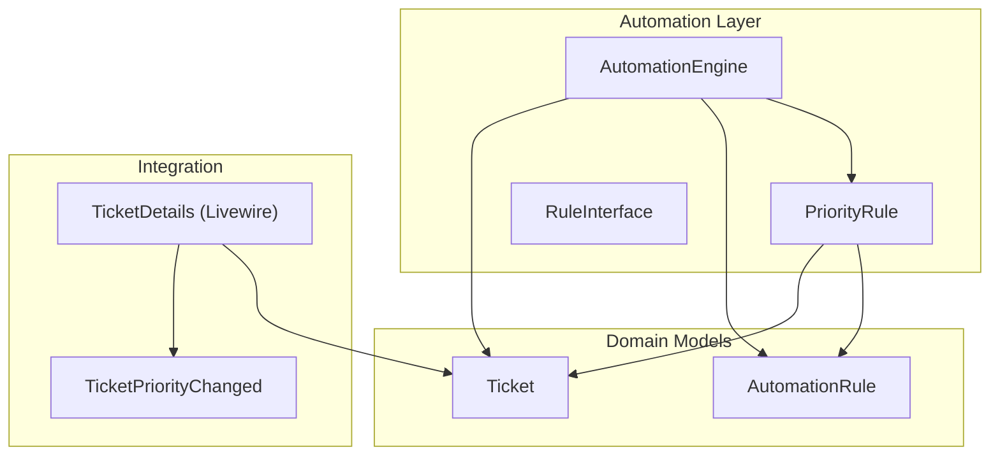
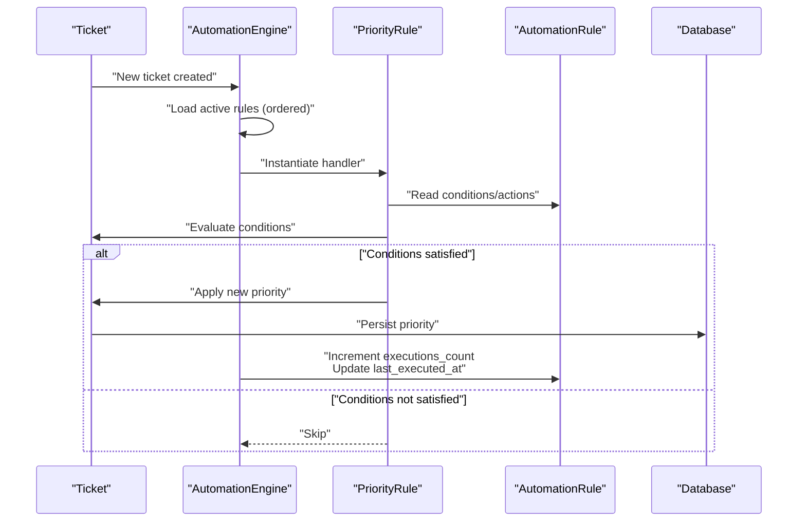
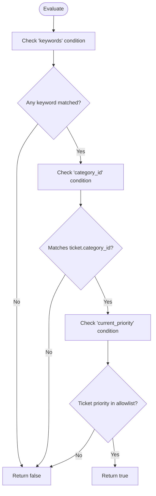
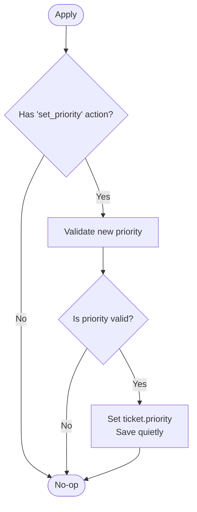
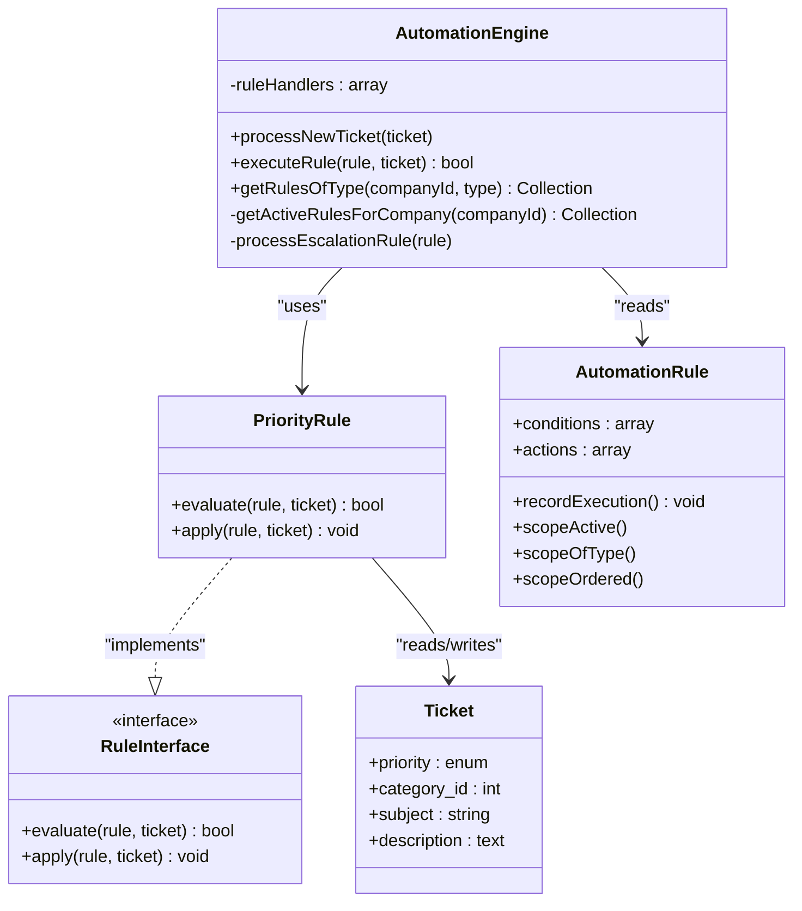
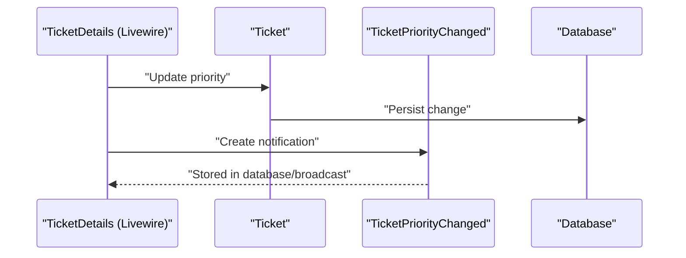
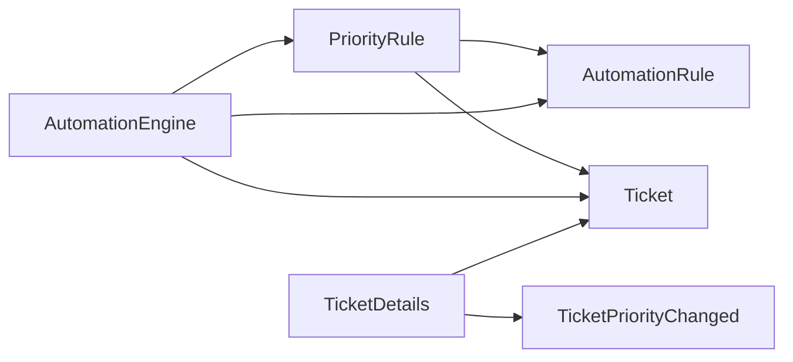

# Priority Rule

<cite>
**Referenced Files in This Document**
- [PriorityRule.php](file://app/Services/Automation/Rules/PriorityRule.php)
- [RuleInterface.php](file://app/Services/Automation/Rules/RuleInterface.php)
- [AutomationEngine.php](file://app/Services/Automation/AutomationEngine.php)
- [AutomationRule.php](file://app/Models/AutomationRule.php)
- [Ticket.php](file://app/Models/Ticket.php)
- [TicketPriorityChanged.php](file://app/Notifications/TicketPriorityChanged.php)
- [TicketDetails.php](file://app/Livewire/Dashboard/TicketDetails.php)
- [2026_03_09_104729_create_automation_rules_table.php](file://database/migrations/2026_03_09_104729_create_automation_rules_table.php)
- [2026_02_01_224222_create_tickets_table.php](file://database/migrations/2026_02_01_224222_create_tickets_table.php)
- [AutomationEngineTest.php](file://tests/Feature/Services/AutomationEngineTest.php)
</cite>

## Table of Contents
1. [Introduction](#introduction)
2. [Project Structure](#project-structure)
3. [Core Components](#core-components)
4. [Architecture Overview](#architecture-overview)
5. [Detailed Component Analysis](#detailed-component-analysis)
6. [Dependency Analysis](#dependency-analysis)
7. [Performance Considerations](#performance-considerations)
8. [Troubleshooting Guide](#troubleshooting-guide)
9. [Conclusion](#conclusion)

## Introduction
This document explains the PriorityRule automation component that dynamically adjusts ticket priorities based on configurable conditions. It covers how the rule evaluates conditions such as keywords in ticket content, category matching, and current priority thresholds, how it calculates and applies priority changes, and how these changes integrate with the broader ticket management system and downstream notifications.

## Project Structure
The PriorityRule is part of the Automation service, which orchestrates rule evaluation and execution. The relevant components include:
- Rule implementation: PriorityRule
- Rule contract: RuleInterface
- Automation engine: AutomationEngine
- Rule and ticket models: AutomationRule, Ticket
- Notifications: TicketPriorityChanged
- Database migrations for tickets and automation rules
- Livewire UI that also triggers priority changes and notifications



**Diagram sources**
- [AutomationEngine.php:15-96](file://app/Services/Automation/AutomationEngine.php#L15-L96)
- [PriorityRule.php:9-68](file://app/Services/Automation/Rules/PriorityRule.php#L9-L68)
- [RuleInterface.php:8-19](file://app/Services/Automation/Rules/RuleInterface.php#L8-L19)
- [AutomationRule.php:22-116](file://app/Models/AutomationRule.php#L22-L116)
- [Ticket.php:9-64](file://app/Models/Ticket.php#L9-L64)
- [TicketPriorityChanged.php:9-54](file://app/Notifications/TicketPriorityChanged.php#L9-L54)
- [TicketDetails.php:190-203](file://app/Livewire/Dashboard/TicketDetails.php#L190-L203)

**Section sources**
- [AutomationEngine.php:15-96](file://app/Services/Automation/AutomationEngine.php#L15-L96)
- [PriorityRule.php:9-68](file://app/Services/Automation/Rules/PriorityRule.php#L9-L68)
- [AutomationRule.php:22-116](file://app/Models/AutomationRule.php#L22-L116)
- [Ticket.php:9-64](file://app/Models/Ticket.php#L9-L64)
- [TicketPriorityChanged.php:9-54](file://app/Notifications/TicketPriorityChanged.php#L9-L54)
- [TicketDetails.php:190-203](file://app/Livewire/Dashboard/TicketDetails.php#L190-L203)

## Core Components
- PriorityRule: Implements evaluation and application of priority change rules.
- RuleInterface: Defines the contract for all automation rules.
- AutomationEngine: Coordinates rule discovery, evaluation, and execution.
- AutomationRule: Stores rule metadata, conditions, and actions; persists execution metrics.
- Ticket: Represents tickets with priority, category, and other attributes.
- TicketPriorityChanged: Notification payload for priority changes.
- TicketDetails (Livewire): UI component that can change priority and trigger notifications.

Key behaviors:
- Evaluation checks keywords in subject/description, category match, and current priority constraints.
- Application sets a new priority if valid and persists the change.
- Downstream effects include notifications and execution logging.

**Section sources**
- [PriorityRule.php:11-67](file://app/Services/Automation/Rules/PriorityRule.php#L11-L67)
- [RuleInterface.php:10-18](file://app/Services/Automation/Rules/RuleInterface.php#L10-L18)
- [AutomationEngine.php:59-96](file://app/Services/Automation/AutomationEngine.php#L59-L96)
- [AutomationRule.php:94-100](file://app/Models/AutomationRule.php#L94-L100)
- [Ticket.php:25-29](file://app/Models/Ticket.php#L25-L29)
- [TicketPriorityChanged.php:22-27](file://app/Notifications/TicketPriorityChanged.php#L22-L27)

## Architecture Overview
The PriorityRule participates in the AutomationEngine lifecycle:
- Discovery: Engine loads active rules for a company and orders by priority.
- Evaluation: Rule.evaluate(...) returns true only if all configured conditions match.
- Application: Rule.apply(...) updates the ticket priority if allowed by actions.
- Logging: Engine increments execution counters and timestamps.



**Diagram sources**
- [AutomationEngine.php:27-96](file://app/Services/Automation/AutomationEngine.php#L27-L96)
- [PriorityRule.php:11-67](file://app/Services/Automation/Rules/PriorityRule.php#L11-L67)
- [AutomationRule.php:94-100](file://app/Models/AutomationRule.php#L94-L100)
- [2026_03_09_104729_create_automation_rules_table.php:14-42](file://database/migrations/2026_03_09_104729_create_automation_rules_table.php#L14-L42)

## Detailed Component Analysis

### PriorityRule Evaluation Logic
The evaluator checks three primary conditions:
- Keywords: Case-insensitive substring match against combined subject and description.
- Category: Exact match against ticket.category_id.
- Current priority: Only applies if the ticket's current priority is within a configured allowlist.



**Diagram sources**
- [PriorityRule.php:15-49](file://app/Services/Automation/Rules/PriorityRule.php#L15-L49)

**Section sources**
- [PriorityRule.php:11-52](file://app/Services/Automation/Rules/PriorityRule.php#L11-L52)

### PriorityRule Action Execution
The action sets a new priority if:
- The rule defines an action to set priority.
- The target priority is one of the allowed values.

The change is persisted quietly to avoid triggering additional observers.



**Diagram sources**
- [PriorityRule.php:54-67](file://app/Services/Automation/Rules/PriorityRule.php#L54-L67)

**Section sources**
- [PriorityRule.php:54-67](file://app/Services/Automation/Rules/PriorityRule.php#L54-L67)

### AutomationEngine Orchestration
The engine:
- Loads active rules for a company and orders by priority.
- Skips escalation rules for immediate processing (handled separately).
- Instantiates the appropriate handler per rule type.
- Executes evaluation and application, logs failures, and records successful executions.



**Diagram sources**
- [AutomationEngine.php:15-141](file://app/Services/Automation/AutomationEngine.php#L15-L141)
- [PriorityRule.php:9-68](file://app/Services/Automation/Rules/PriorityRule.php#L9-L68)
- [RuleInterface.php:8-19](file://app/Services/Automation/Rules/RuleInterface.php#L8-L19)
- [AutomationRule.php:22-116](file://app/Models/AutomationRule.php#L22-L116)
- [Ticket.php:9-64](file://app/Models/Ticket.php#L9-L64)

**Section sources**
- [AutomationEngine.php:27-96](file://app/Services/Automation/AutomationEngine.php#L27-L96)
- [AutomationRule.php:94-100](file://app/Models/AutomationRule.php#L94-L100)

### Data Model and Persistence
- Tickets store priority as an enum with values low, medium, high, urgent.
- Automation rules persist conditions and actions as JSON, enabling flexible rule configuration.
- Execution metrics (count and last execution timestamp) are tracked per rule.

```mermaid
erDiagram
TICKETS {
bigint id PK
bigint company_id FK
string ticket_number UK
string subject
text description
enum status
enum priority
bigint assigned_to FK
bigint category_id FK
boolean verified
timestamps
}
AUTOMATION_RULES {
bigint id PK
bigint company_id FK
string name
text description
enum type
json conditions
json actions
boolean is_active
int priority
bigint executions_count
timestamp last_executed_at
timestamps
}
TICKETS ||--o{ AUTOMATION_RULES : "evaluated_by"
```

**Diagram sources**
- [2026_02_01_224222_create_tickets_table.php:11-54](file://database/migrations/2026_02_01_224222_create_tickets_table.php#L11-L54)
- [2026_03_09_104729_create_automation_rules_table.php:14-42](file://database/migrations/2026_03_09_104729_create_automation_rules_table.php#L14-L42)

**Section sources**
- [2026_02_01_224222_create_tickets_table.php:25-29](file://database/migrations/2026_02_01_224222_create_tickets_table.php#L25-L29)
- [2026_03_09_104729_create_automation_rules_table.php:25-36](file://database/migrations/2026_03_09_104729_create_automation_rules_table.php#L25-L36)

### Integration Patterns and Downstream Effects
- UI-driven priority changes: The Livewire TicketDetails component updates priority and emits a notification when the ticket owner is not the current operator.
- Automation-driven priority changes: The AutomationEngine applies PriorityRule actions and persists execution statistics.
- Notifications: The TicketPriorityChanged notification carries ticket metadata and a human-readable message for real-time and broadcast channels.



**Diagram sources**
- [TicketDetails.php:190-203](file://app/Livewire/Dashboard/TicketDetails.php#L190-L203)
- [TicketPriorityChanged.php:22-27](file://app/Notifications/TicketPriorityChanged.php#L22-L27)

**Section sources**
- [TicketDetails.php:190-203](file://app/Livewire/Dashboard/TicketDetails.php#L190-L203)
- [TicketPriorityChanged.php:22-27](file://app/Notifications/TicketPriorityChanged.php#L22-L27)

## Dependency Analysis
- PriorityRule depends on:
  - AutomationRule for conditions and actions.
  - Ticket for reading and writing priority and related attributes.
- AutomationEngine depends on:
  - RuleInterface implementations (including PriorityRule).
  - AutomationRule for rule discovery and execution metrics.
  - Database for persistence and indexing.
- Notifications depend on:
  - Ticket model for context and user association.



**Diagram sources**
- [PriorityRule.php:5-7](file://app/Services/Automation/Rules/PriorityRule.php#L5-L7)
- [AutomationEngine.php:5-11](file://app/Services/Automation/AutomationEngine.php#L5-L11)
- [TicketDetails.php:190-203](file://app/Livewire/Dashboard/TicketDetails.php#L190-L203)
- [TicketPriorityChanged.php:5-7](file://app/Notifications/TicketPriorityChanged.php#L5-L7)

**Section sources**
- [PriorityRule.php:5-7](file://app/Services/Automation/Rules/PriorityRule.php#L5-L7)
- [AutomationEngine.php:5-11](file://app/Services/Automation/AutomationEngine.php#L5-L11)
- [TicketDetails.php:190-203](file://app/Livewire/Dashboard/TicketDetails.php#L190-L203)
- [TicketPriorityChanged.php:5-7](file://app/Notifications/TicketPriorityChanged.php#L5-L7)

## Performance Considerations
- Rule ordering: Rules are ordered by priority ascending, ensuring deterministic application order.
- Indexing: Tickets and automation rules have indexes on frequently filtered columns (company_id, type, priority, status).
- Evaluation cost: Keyword matching is linear in the number of keywords and content length; keep keyword lists concise.
- Execution logging: Execution counts and timestamps are updated per rule to support monitoring and debugging.

[No sources needed since this section provides general guidance]

## Troubleshooting Guide
Common issues and resolutions:
- Rule not applying:
  - Verify the rule is active and belongs to the correct company.
  - Confirm conditions match: keywords found, category_id matches, current_priority allowlist includes existing priority.
- Invalid priority value:
  - Ensure the action specifies a valid priority among low, medium, high, urgent.
- No execution recorded:
  - Check that evaluation returns true and that the engine executes the rule successfully.
- Notifications not appearing:
  - Ensure the ticket owner exists and is not the current operator for UI-triggered changes.
  - Confirm notification channels (database, broadcast) are configured.

**Section sources**
- [AutomationEngine.php:76-95](file://app/Services/Automation/AutomationEngine.php#L76-L95)
- [AutomationEngineTest.php:182-207](file://tests/Feature/Services/AutomationEngineTest.php#L182-L207)

## Conclusion
The PriorityRule provides a flexible, data-driven mechanism to adjust ticket priorities based on keywords, categories, and current priority constraints. Its integration with the AutomationEngine ensures consistent evaluation and application, while execution metrics and notifications support observability and downstream automation.