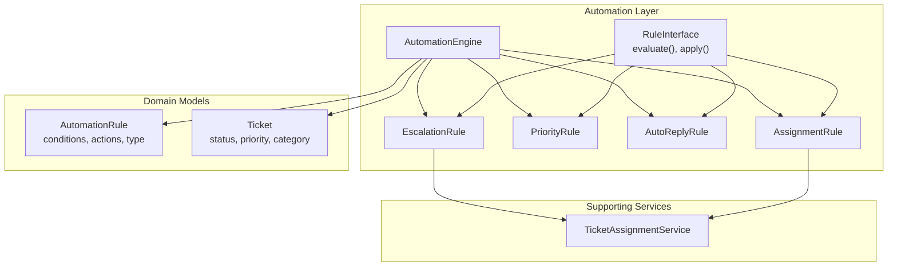
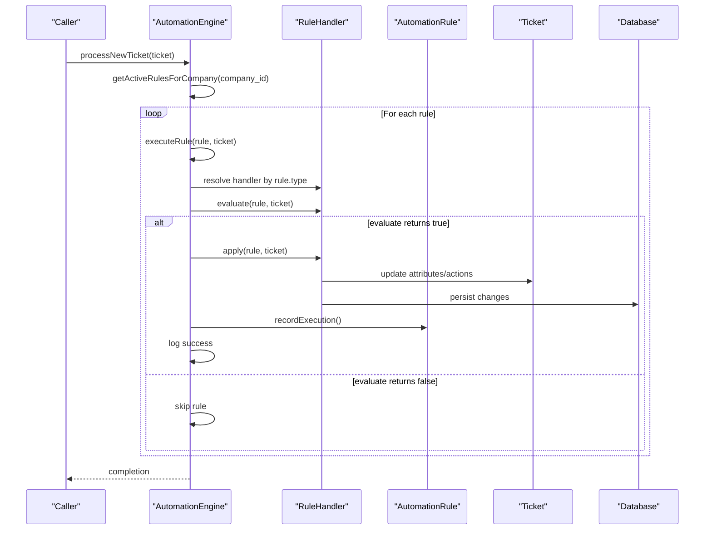
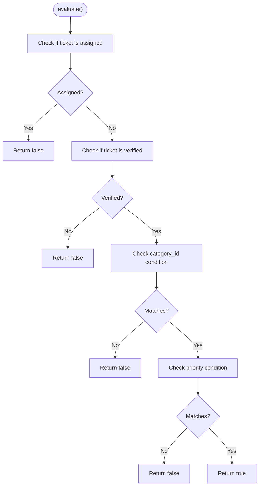
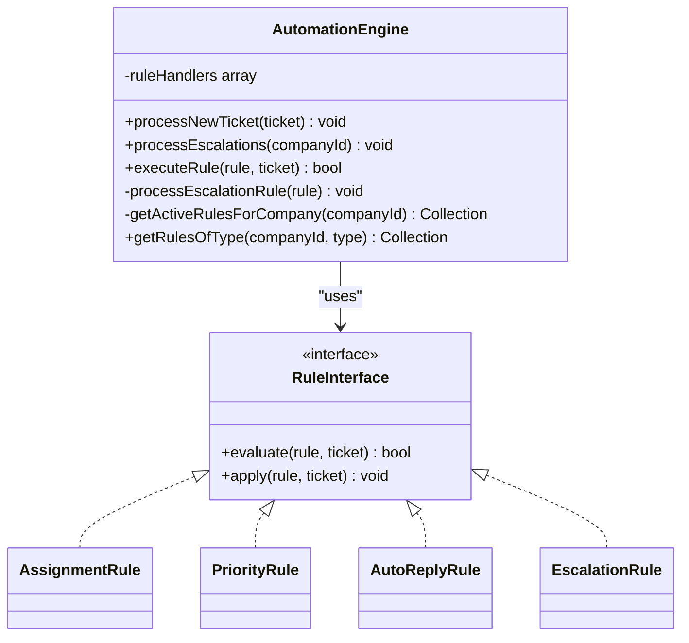
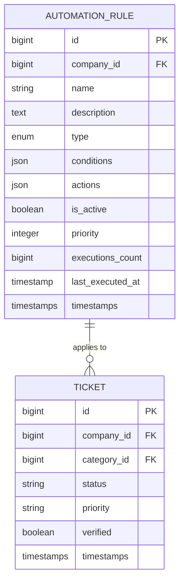
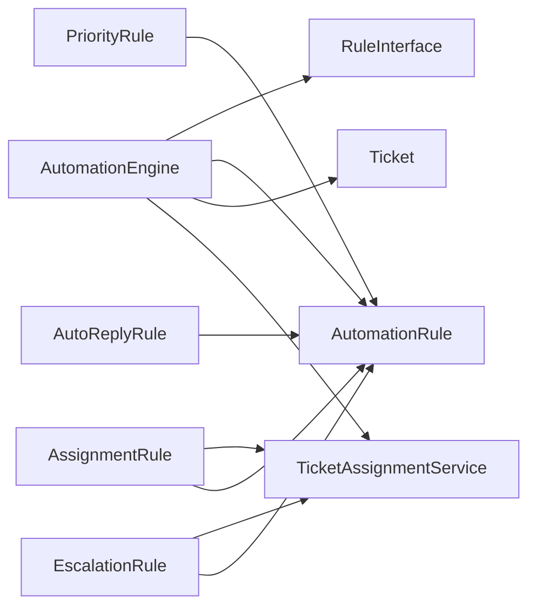

# Rule Interface & Base Architecture

<cite>
**Referenced Files in This Document**
- [RuleInterface.php](file://app/Services/Automation/Rules/RuleInterface.php)
- [AssignmentRule.php](file://app/Services/Automation/Rules/AssignmentRule.php)
- [AutoReplyRule.php](file://app/Services/Automation/Rules/AutoReplyRule.php)
- [EscalationRule.php](file://app/Services/Automation/Rules/EscalationRule.php)
- [PriorityRule.php](file://app/Services/Automation/Rules/PriorityRule.php)
- [AutomationEngine.php](file://app/Services/Automation/AutomationEngine.php)
- [AutomationRule.php](file://app/Models/AutomationRule.php)
- [Ticket.php](file://app/Models/Ticket.php)
- [TicketAssignmentService.php](file://app/Services/TicketAssignmentService.php)
- [2026_03_09_104729_create_automation_rules_table.php](file://database/migrations/2026_03_09_104729_create_automation_rules_table.php)
- [AutomationEngineTest.php](file://tests/Feature/Services/AutomationEngineTest.php)
- [AutomationRulesTable.php](file://app/Livewire/Dashboard/AutomationRulesTable.php)
</cite>

## Table of Contents
1. [Introduction](#introduction)
2. [Project Structure](#project-structure)
3. [Core Components](#core-components)
4. [Architecture Overview](#architecture-overview)
5. [Detailed Component Analysis](#detailed-component-analysis)
6. [Dependency Analysis](#dependency-analysis)
7. [Performance Considerations](#performance-considerations)
8. [Troubleshooting Guide](#troubleshooting-guide)
9. [Conclusion](#conclusion)

## Introduction
This document explains the RuleInterface and the overall automation rule system design. It covers the common interface contract that all rules must implement, the rule evaluation lifecycle, condition parsing, action execution patterns, error handling mechanisms, base architecture principles, extensibility patterns, and how new rule types can be implemented. It also documents the relationship between rules and the AutomationEngine, configuration management, and rule execution order.

## Project Structure
The automation system is organized around a central interface and multiple rule handlers, with a dedicated engine orchestrating rule evaluation and execution. Configuration is persisted as JSON in the database and managed through a Livewire UI component.

**Diagram sources**
- [RuleInterface.php:8-19](file://app/Services/Automation/Rules/RuleInterface.php#L8-L19)
- [AssignmentRule.php:9-66](file://app/Services/Automation/Rules/AssignmentRule.php#L9-L66)
- [PriorityRule.php:9-68](file://app/Services/Automation/Rules/PriorityRule.php#L9-L68)
- [AutoReplyRule.php:10-64](file://app/Services/Automation/Rules/AutoReplyRule.php#L10-L64)
- [EscalationRule.php:12-156](file://app/Services/Automation/Rules/EscalationRule.php#L12-L156)
- [AutomationEngine.php:15-141](file://app/Services/Automation/AutomationEngine.php#L15-L141)
- [AutomationRule.php:22-116](file://app/Models/AutomationRule.php#L22-L116)
- [Ticket.php:9-63](file://app/Models/Ticket.php#L9-L63)
- [TicketAssignmentService.php:12-178](file://app/Services/TicketAssignmentService.php#L12-L178)

**Section sources**
- [RuleInterface.php:8-19](file://app/Services/Automation/Rules/RuleInterface.php#L8-L19)
- [AutomationEngine.php:15-141](file://app/Services/Automation/AutomationEngine.php#L15-L141)
- [AutomationRule.php:22-116](file://app/Models/AutomationRule.php#L22-L116)
- [Ticket.php:9-63](file://app/Models/Ticket.php#L9-L63)

## Core Components
- RuleInterface: Defines the contract that all rule handlers must implement, including evaluate() for condition checks and apply() for action execution.
- Rule Handlers: Concrete implementations for assignment, priority change, auto-reply, and escalation rules.
- AutomationEngine: Central orchestrator that loads active rules, orders them by priority, evaluates conditions, executes actions, and records executions.
- Domain Models: AutomationRule stores rule metadata, conditions, and actions; Ticket holds ticket attributes evaluated by rules.
- Supporting Services: TicketAssignmentService encapsulates assignment logic used by rules.

**Section sources**
- [RuleInterface.php:8-19](file://app/Services/Automation/Rules/RuleInterface.php#L8-L19)
- [AssignmentRule.php:9-66](file://app/Services/Automation/Rules/AssignmentRule.php#L9-L66)
- [PriorityRule.php:9-68](file://app/Services/Automation/Rules/PriorityRule.php#L9-L68)
- [AutoReplyRule.php:10-64](file://app/Services/Automation/Rules/AutoReplyRule.php#L10-L64)
- [EscalationRule.php:12-156](file://app/Services/Automation/Rules/EscalationRule.php#L12-L156)
- [AutomationEngine.php:15-141](file://app/Services/Automation/AutomationEngine.php#L15-L141)
- [AutomationRule.php:22-116](file://app/Models/AutomationRule.php#L22-L116)
- [Ticket.php:9-63](file://app/Models/Ticket.php#L9-L63)
- [TicketAssignmentService.php:12-178](file://app/Services/TicketAssignmentService.php#L12-L178)

## Architecture Overview
The system follows a strategy-like pattern where each rule type implements a shared interface. The AutomationEngine selects the appropriate handler based on rule type, evaluates conditions against the target ticket, and applies actions if conditions pass. Execution results are recorded and logged.

**Diagram sources**
- [AutomationEngine.php:28-96](file://app/Services/Automation/AutomationEngine.php#L28-L96)
- [AssignmentRule.php:15-48](file://app/Services/Automation/Rules/AssignmentRule.php#L15-L48)
- [PriorityRule.php:11-52](file://app/Services/Automation/Rules/PriorityRule.php#L11-L52)
- [AutoReplyRule.php:12-48](file://app/Services/Automation/Rules/AutoReplyRule.php#L12-L48)
- [EscalationRule.php:24-60](file://app/Services/Automation/Rules/EscalationRule.php#L24-L60)
- [AutomationRule.php:94-100](file://app/Models/AutomationRule.php#L94-L100)

## Detailed Component Analysis

### RuleInterface Contract
- evaluate(AutomationRule $rule, Ticket $ticket): Returns true if the rule’s conditions are satisfied for the given ticket.
- apply(AutomationRule $rule, Ticket $ticket): Executes the rule’s actions against the ticket.

Implementation pattern:
- Each handler receives the rule configuration and the ticket instance.
- Conditions are parsed from the rule’s conditions array.
- Actions are parsed from the rule’s actions array.
- Changes are persisted to the ticket model.

**Section sources**
- [RuleInterface.php:8-19](file://app/Services/Automation/Rules/RuleInterface.php#L8-L19)

### AssignmentRule
Purpose: Auto-assign tickets to specialists or operators based on category and priority conditions.

Evaluation logic:
- Skips if ticket is already assigned.
- Skips if ticket is not verified.
- Checks category_id condition.
- Checks priority condition (supports single or multiple priorities).

Action execution:
- Assigns to a specialist via TicketAssignmentService if configured.
- Optionally assigns to a specific operator ID.

**Diagram sources**
- [AssignmentRule.php:15-48](file://app/Services/Automation/Rules/AssignmentRule.php#L15-L48)

**Section sources**
- [AssignmentRule.php:9-66](file://app/Services/Automation/Rules/AssignmentRule.php#L9-L66)

### PriorityRule
Purpose: Adjust ticket priority based on keywords, category, and current priority thresholds.

Evaluation logic:
- Requires keywords to be present in subject or description.
- Optionally filters by category_id.
- Optionally restricts application to tickets with lower priority than allowed.

Action execution:
- Sets the ticket priority to a configured value if valid.

**Section sources**
- [PriorityRule.php:9-68](file://app/Services/Automation/Rules/PriorityRule.php#L9-L68)

### AutoReplyRule
Purpose: Send automated replies to customers upon ticket creation or based on conditions.

Evaluation logic:
- Requires verified ticket.
- Supports on-create timing check (within a short window).
- Filters by category_id and priority.

Action execution:
- Sends an email using AutoReplyMail with configurable subject and message.

**Section sources**
- [AutoReplyRule.php:10-64](file://app/Services/Automation/Rules/AutoReplyRule.php#L10-L64)

### EscalationRule
Purpose: Increase priority, notify administrators, or reassign tickets for idle cases.

Evaluation logic:
- Filters by status (supports single or multiple statuses).
- Checks idle threshold based on updated_at.
- Optionally filters by category_id.
- Prevents escalating already urgent tickets unless explicit notify action is configured.

Action execution:
- Escalates priority or sets a specific priority.
- Notifies administrators via EscalationNotificationMail.
- Optionally reassigns to a specific operator using TicketAssignmentService.

Additional capability:
- findIdleTickets(): Bulk discovery of idle tickets for scheduled processing.

**Section sources**
- [EscalationRule.php:12-156](file://app/Services/Automation/Rules/EscalationRule.php#L12-L156)

### AutomationEngine
Responsibilities:
- Maintains a registry mapping rule types to handler classes.
- Processes new tickets by evaluating all non-escalation rules.
- Processes escalation rules separately via scheduled jobs.
- Executes rules in priority order and records successful executions.
- Handles errors gracefully with logging.

Execution flow:
- resolve handler by rule type.
- evaluate(rule, ticket).
- apply(rule, ticket) inside a try/catch block.
- recordExecution() and log outcomes.

**Diagram sources**
- [AutomationEngine.php:15-141](file://app/Services/Automation/AutomationEngine.php#L15-L141)
- [RuleInterface.php:8-19](file://app/Services/Automation/Rules/RuleInterface.php#L8-L19)
- [AssignmentRule.php:9](file://app/Services/Automation/Rules/AssignmentRule.php#L9)
- [PriorityRule.php:9](file://app/Services/Automation/Rules/PriorityRule.php#L9)
- [AutoReplyRule.php:10](file://app/Services/Automation/Rules/AutoReplyRule.php#L10)
- [EscalationRule.php:12](file://app/Services/Automation/Rules/EscalationRule.php#L12)

**Section sources**
- [AutomationEngine.php:15-141](file://app/Services/Automation/AutomationEngine.php#L15-L141)

### Configuration Management and Persistence
AutomationRule persists:
- name, description, type, conditions, actions, is_active, priority, executions_count, last_executed_at.
- Uses JSON columns for conditions and actions, enabling flexible rule configurations.

Indexes:
- Composite indexes on (company_id, is_active, type) and (company_id, priority) optimize lookups.

**Diagram sources**
- [2026_03_09_104729_create_automation_rules_table.php:14-42](file://database/migrations/2026_03_09_104729_create_automation_rules_table.php#L14-L42)
- [AutomationRule.php:22-116](file://app/Models/AutomationRule.php#L22-L116)
- [Ticket.php:9-63](file://app/Models/Ticket.php#L9-L63)

**Section sources**
- [2026_03_09_104729_create_automation_rules_table.php:14-42](file://database/migrations/2026_03_09_104729_create_automation_rules_table.php#L14-L42)
- [AutomationRule.php:22-116](file://app/Models/AutomationRule.php#L22-L116)

### Rule Execution Order and Extensibility
- Active rules are fetched with ordered() scope, ascending by priority, ensuring deterministic execution order.
- New rule types can be added by:
  - Implementing RuleInterface.
  - Registering the handler in AutomationEngine::ruleHandlers.
  - Defining constants in AutomationRule for the new type.
  - Creating UI fields and builders in AutomationRulesTable to support configuration.

**Section sources**
- [AutomationEngine.php:18-25](file://app/Services/Automation/AutomationEngine.php#L18-L25)
- [AutomationRule.php:27-33](file://app/Models/AutomationRule.php#L27-L33)
- [AutomationRulesTable.php:292-341](file://app/Livewire/Dashboard/AutomationRulesTable.php#L292-L341)

## Dependency Analysis
- AutomationEngine depends on:
  - RuleInterface implementations.
  - AutomationRule model for configuration and execution tracking.
  - Ticket model for evaluation and persistence.
  - TicketAssignmentService for assignment-related actions.
- Rule handlers depend on:
  - AutomationRule for conditions and actions.
  - Ticket for evaluation and updates.
  - External services (Mail, DB) for side effects.

**Diagram sources**
- [AutomationEngine.php:15-141](file://app/Services/Automation/AutomationEngine.php#L15-L141)
- [AssignmentRule.php:9-66](file://app/Services/Automation/Rules/AssignmentRule.php#L9-L66)
- [PriorityRule.php:9-68](file://app/Services/Automation/Rules/PriorityRule.php#L9-L68)
- [AutoReplyRule.php:10-64](file://app/Services/Automation/Rules/AutoReplyRule.php#L10-L64)
- [EscalationRule.php:12-156](file://app/Services/Automation/Rules/EscalationRule.php#L12-L156)
- [TicketAssignmentService.php:12-178](file://app/Services/TicketAssignmentService.php#L12-L178)

**Section sources**
- [AutomationEngine.php:15-141](file://app/Services/Automation/AutomationEngine.php#L15-L141)
- [TicketAssignmentService.php:12-178](file://app/Services/TicketAssignmentService.php#L12-L178)

## Performance Considerations
- Rule evaluation is O(n) per ticket, where n is the number of active rules for the company.
- Indexes on (company_id, is_active, type) and (company_id, priority) improve query performance.
- EscalationRule.findIdleTickets() uses efficient Eloquent queries to limit to verified, idle tickets.
- Logging and database writes occur only on successful rule application.

[No sources needed since this section provides general guidance]

## Troubleshooting Guide
Common issues and resolutions:
- No handler found for rule type: The engine logs a warning and skips execution. Verify rule type constants and handler registration.
- Rule not applied despite meeting conditions: Check that the rule is active and that conditions match the ticket’s attributes.
- Escalation not triggered: Confirm the idle threshold and status filters; verify that the rule type is excluded from immediate processing and processed by the scheduler.
- Assignment failures: Ensure operators are available and have matching specialties; the assignment service notifies admins when auto-assignment fails.

**Section sources**
- [AutomationEngine.php:61-96](file://app/Services/Automation/AutomationEngine.php#L61-L96)
- [AutomationEngineTest.php:19-47](file://tests/Feature/Services/AutomationEngineTest.php#L19-L47)
- [AutomationEngineTest.php:209-241](file://tests/Feature/Services/AutomationEngineTest.php#L209-L241)
- [AutomationEngineTest.php:243-277](file://tests/Feature/Services/AutomationEngineTest.php#L243-L277)

## Conclusion
The automation rule system is designed around a clean interface and modular handlers, enabling straightforward extension and robust configuration. The AutomationEngine coordinates rule evaluation and execution with clear separation of concerns, while the AutomationRule model and database schema support flexible, JSON-based rule definitions. The system’s error handling and logging facilitate reliable operation, and the UI component streamlines rule authoring and maintenance.