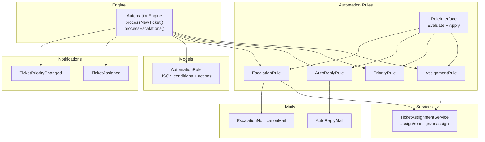
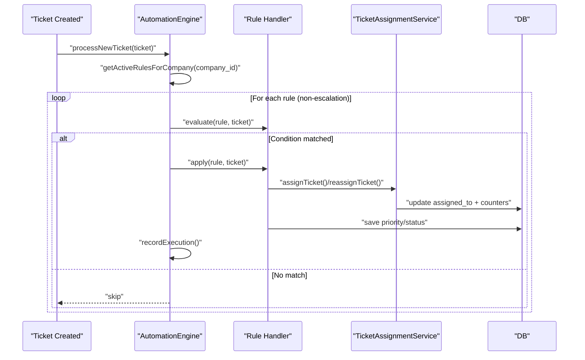
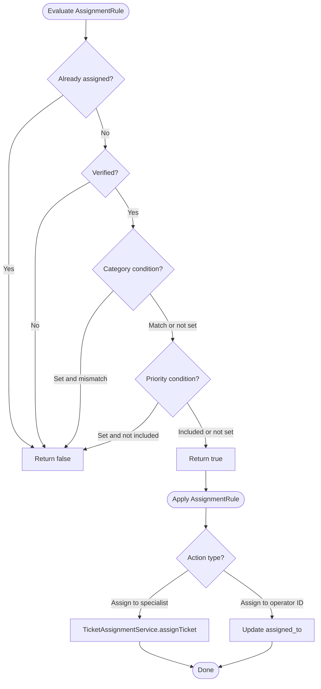
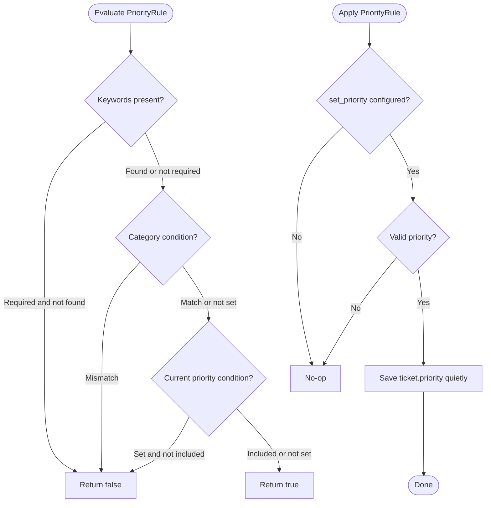
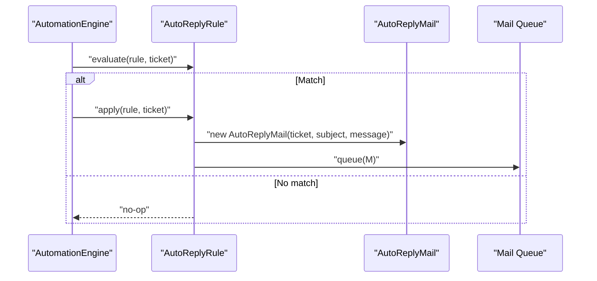
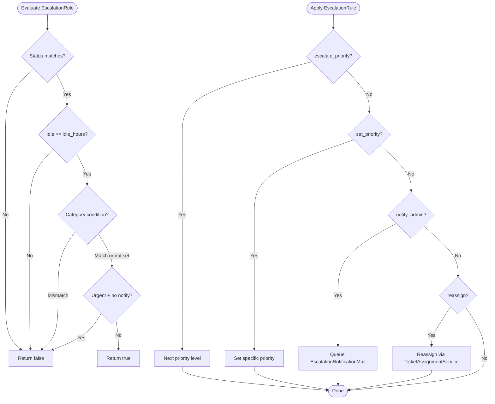
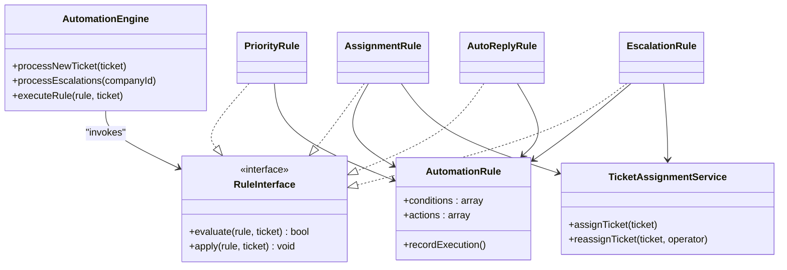

# Rule Types & Implementations

<cite>
**Referenced Files in This Document**
- [RuleInterface.php](file://app/Services/Automation/Rules/RuleInterface.php)
- [AssignmentRule.php](file://app/Services/Automation/Rules/AssignmentRule.php)
- [PriorityRule.php](file://app/Services/Automation/Rules/PriorityRule.php)
- [AutoReplyRule.php](file://app/Services/Automation/Rules/AutoReplyRule.php)
- [EscalationRule.php](file://app/Services/Automation/Rules/EscalationRule.php)
- [AutomationEngine.php](file://app/Services/Automation/AutomationEngine.php)
- [AutomationRule.php](file://app/Models/AutomationRule.php)
- [TicketAssignmentService.php](file://app/Services/TicketAssignmentService.php)
- [TicketAssigned.php](file://app/Notifications/TicketAssigned.php)
- [TicketPriorityChanged.php](file://app/Notifications/TicketPriorityChanged.php)
- [AutoReplyMail.php](file://app/Mail/AutoReplyMail.php)
- [EscalationNotificationMail.php](file://app/Mail/EscalationNotificationMail.php)
- [auto-reply.blade.php](file://resources/views/emails/auto-reply.blade.php)
- [escalation-notification.blade.php](file://resources/views/emails/escalation-notification.blade.php)
- [2026_03_09_104729_create_automation_rules_table.php](file://database/migrations/2026_03_09_104729_create_automation_rules_table.php)
- [AutomationRuleFactory.php](file://database/factories/AutomationRuleFactory.php)
</cite>

## Table of Contents
1. [Introduction](#introduction)
2. [Project Structure](#project-structure)
3. [Core Components](#core-components)
4. [Architecture Overview](#architecture-overview)
5. [Detailed Component Analysis](#detailed-component-analysis)
6. [Dependency Analysis](#dependency-analysis)
7. [Performance Considerations](#performance-considerations)
8. [Troubleshooting Guide](#troubleshooting-guide)
9. [Conclusion](#conclusion)
10. [Appendices](#appendices)

## Introduction
This document explains the automation rule types and their implementations in the Helpdesk System. It covers how rules are evaluated and applied, how they integrate with the broader automation system, and provides practical configuration examples with expected outcomes. The rule types documented here are:
- AssignmentRule: Automatic agent assignment based on category, workload, and availability
- PriorityRule: Dynamic priority adjustment based on keywords, category, and current priority
- AutoReplyRule: Instant customer response via email templates
- EscalationRule: Handling overdue tickets through priority changes, notifications, and reassignment

## Project Structure
The automation subsystem is organized around a shared interface, per-rule handlers, an engine that orchestrates rule execution, and supporting services and notifications.

**Diagram sources**
- [RuleInterface.php:8-19](file://app/Services/Automation/Rules/RuleInterface.php#L8-L19)
- [AssignmentRule.php:9-67](file://app/Services/Automation/Rules/AssignmentRule.php#L9-L67)
- [PriorityRule.php:9-69](file://app/Services/Automation/Rules/PriorityRule.php#L9-L69)
- [AutoReplyRule.php:10-65](file://app/Services/Automation/Rules/AutoReplyRule.php#L10-L65)
- [EscalationRule.php:12-157](file://app/Services/Automation/Rules/EscalationRule.php#L12-L157)
- [AutomationEngine.php:15-142](file://app/Services/Automation/AutomationEngine.php#L15-L142)
- [AutomationRule.php:22-117](file://app/Models/AutomationRule.php#L22-L117)
- [TicketAssignmentService.php:12-179](file://app/Services/TicketAssignmentService.php#L12-L179)
- [TicketAssigned.php:9-49](file://app/Notifications/TicketAssigned.php#L9-L49)
- [TicketPriorityChanged.php:9-55](file://app/Notifications/TicketPriorityChanged.php#L9-L55)
- [AutoReplyMail.php:13-47](file://app/Mail/AutoReplyMail.php#L13-L47)
- [EscalationNotificationMail.php:14-47](file://app/Mail/EscalationNotificationMail.php#L14-L47)

**Section sources**
- [AutomationEngine.php:15-142](file://app/Services/Automation/AutomationEngine.php#L15-L142)
- [AutomationRule.php:22-117](file://app/Models/AutomationRule.php#L22-L117)

## Core Components
- RuleInterface defines the contract for all rule handlers: evaluate(rule, ticket) and apply(rule, ticket).
- AutomationEngine selects the appropriate handler per rule type, evaluates conditions, applies actions, records executions, and handles scheduling for escalations.
- AutomationRule stores rule metadata, conditions, and actions as JSON arrays and provides scopes for filtering and ordering.
- TicketAssignmentService encapsulates assignment logic, including finding specialists/generalists and managing counters and notifications.
- Notifications and Mailables deliver outcomes to users and administrators.

**Section sources**
- [RuleInterface.php:8-19](file://app/Services/Automation/Rules/RuleInterface.php#L8-L19)
- [AutomationEngine.php:15-142](file://app/Services/Automation/AutomationEngine.php#L15-L142)
- [AutomationRule.php:22-117](file://app/Models/AutomationRule.php#L22-L117)
- [TicketAssignmentService.php:12-179](file://app/Services/TicketAssignmentService.php#L12-L179)

## Architecture Overview
The automation engine coordinates rule processing:
- New tickets trigger immediate evaluation of non-escalation rules.
- Escalation rules are scheduled separately and scan idle tickets to apply actions.

**Diagram sources**
- [AutomationEngine.php:28-96](file://app/Services/Automation/AutomationEngine.php#L28-L96)
- [AssignmentRule.php:50-65](file://app/Services/Automation/Rules/AssignmentRule.php#L50-L65)
- [PriorityRule.php:54-67](file://app/Services/Automation/Rules/PriorityRule.php#L54-L67)
- [AutoReplyRule.php:50-63](file://app/Services/Automation/Rules/AutoReplyRule.php#L50-L63)
- [EscalationRule.php:62-85](file://app/Services/Automation/Rules/EscalationRule.php#L62-L85)
- [TicketAssignmentService.php:22-108](file://app/Services/TicketAssignmentService.php#L22-L108)

## Detailed Component Analysis

### AssignmentRule
Purpose: Automatically assign tickets to available specialists or generalists based on category, workload, and availability. Prevents re-assignment if already assigned and ignores unverified tickets.

Evaluation logic:
- Skip if ticket is already assigned.
- Skip if ticket is not verified.
- Optional category match.
- Optional priority inclusion (single or array).

Action execution:
- Default assignment: delegate to TicketAssignmentService.assignTicket.
- Specific operator: update assigned_to directly.

Integration:
- Uses TicketAssignmentService for intelligent assignment.
- Updates ticket and increments operator counters atomically.
- Triggers TicketAssigned notification.

**Diagram sources**
- [AssignmentRule.php:15-48](file://app/Services/Automation/Rules/AssignmentRule.php#L15-L48)
- [AssignmentRule.php:50-65](file://app/Services/Automation/Rules/AssignmentRule.php#L50-L65)
- [TicketAssignmentService.php:22-94](file://app/Services/TicketAssignmentService.php#L22-L94)

**Section sources**
- [AssignmentRule.php:9-67](file://app/Services/Automation/Rules/AssignmentRule.php#L9-L67)
- [TicketAssignmentService.php:12-179](file://app/Services/TicketAssignmentService.php#L12-L179)
- [TicketAssigned.php:9-49](file://app/Notifications/TicketAssigned.php#L9-L49)

Practical configuration examples:
- Auto-assign specialists for a category with fallback to generalists.
- Assign to a specific operator ID when priority exceeds threshold.

Expected outcomes:
- Ticket assigned to best available operator; counters updated; notification sent.

### PriorityRule
Purpose: Dynamically adjust ticket priority based on keywords, category, and current priority thresholds.

Evaluation logic:
- Keywords found in subject/description (case-insensitive).
- Optional category match.
- Optional current priority restriction (only apply if priority is lower than configured).

Action execution:
- Set priority to a valid level (low, medium, high, urgent) if configured.

**Diagram sources**
- [PriorityRule.php:11-52](file://app/Services/Automation/Rules/PriorityRule.php#L11-L52)
- [PriorityRule.php:54-67](file://app/Services/Automation/Rules/PriorityRule.php#L54-L67)

**Section sources**
- [PriorityRule.php:9-69](file://app/Services/Automation/Rules/PriorityRule.php#L9-L69)
- [TicketPriorityChanged.php:9-55](file://app/Notifications/TicketPriorityChanged.php#L9-L55)

Practical configuration examples:
- Increase priority to urgent when keywords like "urgent", "critical", or "asap" appear.
- Raise priority only if currently below a given threshold.

Expected outcomes:
- Ticket priority updated and persisted; counters unchanged.

### AutoReplyRule
Purpose: Send instant customer auto-reply emails upon ticket creation or based on category/priority filters.

Evaluation logic:
- Only for verified tickets.
- Optional on-create window (e.g., within 1 minute).
- Optional category and priority filters.

Action execution:
- Queue AutoReplyMail with configurable subject/message.

**Diagram sources**
- [AutoReplyRule.php:12-48](file://app/Services/Automation/Rules/AutoReplyRule.php#L12-L48)
- [AutoReplyRule.php:50-63](file://app/Services/Automation/Rules/AutoReplyRule.php#L50-L63)
- [AutoReplyMail.php:13-47](file://app/Mail/AutoReplyMail.php#L13-L47)

**Section sources**
- [AutoReplyRule.php:10-65](file://app/Services/Automation/Rules/AutoReplyRule.php#L10-L65)
- [AutoReplyMail.php:13-47](file://app/Mail/AutoReplyMail.php#L13-L47)
- [auto-reply.blade.php:1-92](file://resources/views/emails/auto-reply.blade.php#L1-L92)

Practical configuration examples:
- Immediate auto-reply on ticket creation for support category.
- Auto-reply for high-priority tickets with a custom message.

Expected outcomes:
- Customer receives an auto-reply email with ticket details.

### EscalationRule
Purpose: Detect idle tickets and apply escalation actions such as priority increases, status changes, admin notifications, and reassignment.

Evaluation logic:
- Status must match configured statuses.
- Idle threshold in hours compared to last activity.
- Optional category filter.
- Guard against escalating already urgent tickets unless admin notification is requested.

Action execution:
- Escalate priority to next level or set to a specific priority.
- Notify admins via EscalationNotificationMail.
- Reassign to a specific operator using TicketAssignmentService.

**Diagram sources**
- [EscalationRule.php:24-60](file://app/Services/Automation/Rules/EscalationRule.php#L24-L60)
- [EscalationRule.php:62-85](file://app/Services/Automation/Rules/EscalationRule.php#L62-L85)
- [EscalationRule.php:92-155](file://app/Services/Automation/Rules/EscalationRule.php#L92-L155)
- [EscalationNotificationMail.php:14-47](file://app/Mail/EscalationNotificationMail.php#L14-L47)

**Section sources**
- [EscalationRule.php:12-157](file://app/Services/Automation/Rules/EscalationRule.php#L12-L157)
- [EscalationNotificationMail.php:14-47](file://app/Mail/EscalationNotificationMail.php#L14-L47)
- [escalation-notification.blade.php:1-149](file://resources/views/emails/escalation-notification.blade.php#L1-L149)

Practical configuration examples:
- Escalate pending/open tickets after 24 hours of inactivity.
- Immediately raise priority to urgent and notify admins.

Expected outcomes:
- Ticket priority increased; admins notified; optional reassignment performed.

## Dependency Analysis
- AutomationEngine maps rule types to handlers and manages execution lifecycle.
- Rule handlers depend on AutomationRule for conditions/actions and on TicketAssignmentService for assignment-related actions.
- Notifications and Mailables are decoupled from rule logic and invoked by handlers or services.

**Diagram sources**
- [AutomationEngine.php:15-142](file://app/Services/Automation/AutomationEngine.php#L15-L142)
- [RuleInterface.php:8-19](file://app/Services/Automation/Rules/RuleInterface.php#L8-L19)
- [AssignmentRule.php:9-67](file://app/Services/Automation/Rules/AssignmentRule.php#L9-L67)
- [PriorityRule.php:9-69](file://app/Services/Automation/Rules/PriorityRule.php#L9-L69)
- [AutoReplyRule.php:10-65](file://app/Services/Automation/Rules/AutoReplyRule.php#L10-L65)
- [EscalationRule.php:12-157](file://app/Services/Automation/Rules/EscalationRule.php#L12-L157)
- [AutomationRule.php:22-117](file://app/Models/AutomationRule.php#L22-L117)
- [TicketAssignmentService.php:12-179](file://app/Services/TicketAssignmentService.php#L12-L179)

**Section sources**
- [AutomationEngine.php:15-142](file://app/Services/Automation/AutomationEngine.php#L15-L142)
- [AutomationRule.php:22-117](file://app/Models/AutomationRule.php#L22-L117)

## Performance Considerations
- Rule evaluation short-circuits on early mismatches to minimize work.
- Escalation scanning uses efficient database queries with indexed columns.
- Actions are queued (mail, notifications) to avoid blocking request threads.
- Assignment uses atomic transactions to maintain consistency of counters and assignments.

[No sources needed since this section provides general guidance]

## Troubleshooting Guide
Common issues and resolutions:
- Rule not triggering:
  - Verify AutomationRule.is_active and priority ordering.
  - Confirm conditions match ticket attributes (category, priority, status).
- Assignment failures:
  - Ensure operators are available and have matching specialties.
  - Check that tickets have a category or allow generalist fallback.
- Priority changes not saved:
  - Ensure actions specify a valid priority level.
- Escalation notifications not sent:
  - Confirm notify_admin is enabled and admins exist for the company.
- Auto-reply not sent:
  - Verify ticket is marked as verified and on_create timing aligns with creation time.

**Section sources**
- [AutomationEngine.php:64-95](file://app/Services/Automation/AutomationEngine.php#L64-L95)
- [AutomationRule.php:66-91](file://app/Models/AutomationRule.php#L66-L91)
- [TicketAssignmentService.php:84-94](file://app/Services/TicketAssignmentService.php#L84-L94)

## Conclusion
The automation subsystem cleanly separates concerns between rule evaluation, action execution, and orchestration. Each rule type is self-contained yet integrates seamlessly with shared services for assignment, notifications, and mail delivery. Proper configuration of conditions and actions yields predictable outcomes for assignment, priority management, customer communication, and escalation handling.

[No sources needed since this section summarizes without analyzing specific files]

## Appendices

### Rule Configuration Reference
- Rule storage schema supports JSON conditions and actions with indexing for company, activation, and priority.
- Rule types and labels are defined centrally for UI and processing.

**Section sources**
- [2026_03_09_104729_create_automation_rules_table.php:14-42](file://database/migrations/2026_03_09_104729_create_automation_rules_table.php#L14-L42)
- [AutomationRule.php:27-115](file://app/Models/AutomationRule.php#L27-L115)

### Practical Examples (from factory states)
- Assignment rule defaults to assigning specialists with generalist fallback.
- Priority rule targets urgent/critical keywords and sets priority to urgent.
- Auto Reply rule sends an immediate reply on creation.
- Escalation rule escalates priority and notifies admins after 24 hours of inactivity.

**Section sources**
- [AutomationRuleFactory.php:74-146](file://database/factories/AutomationRuleFactory.php#L74-L146)