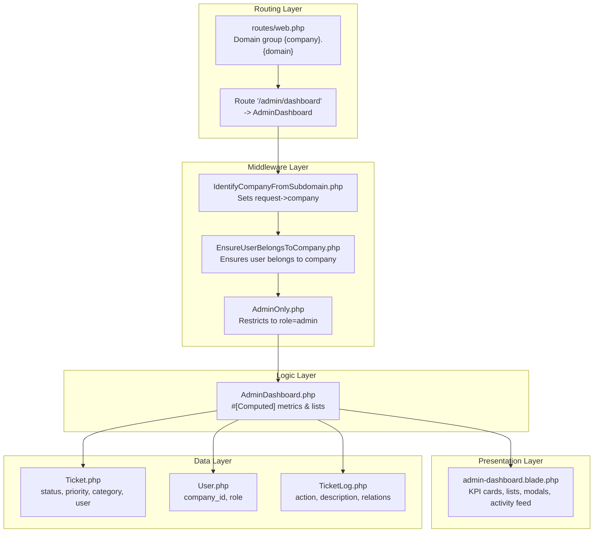
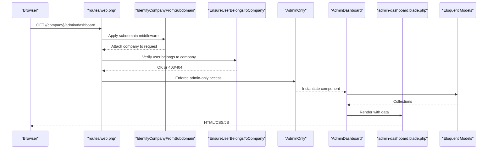
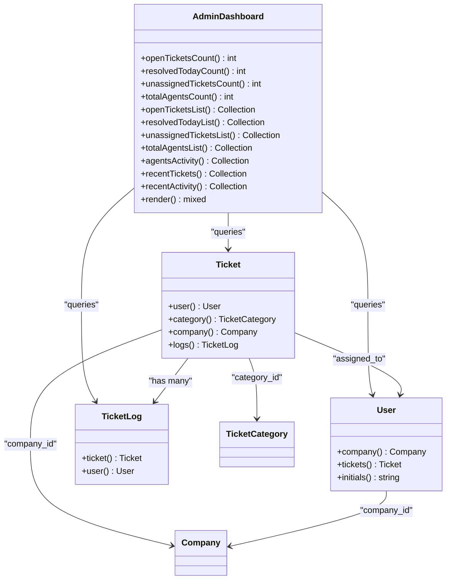
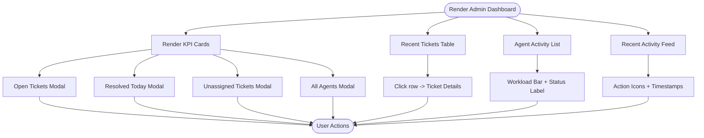
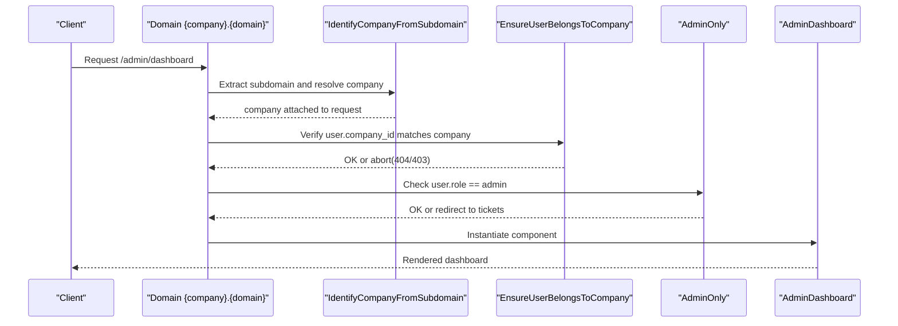
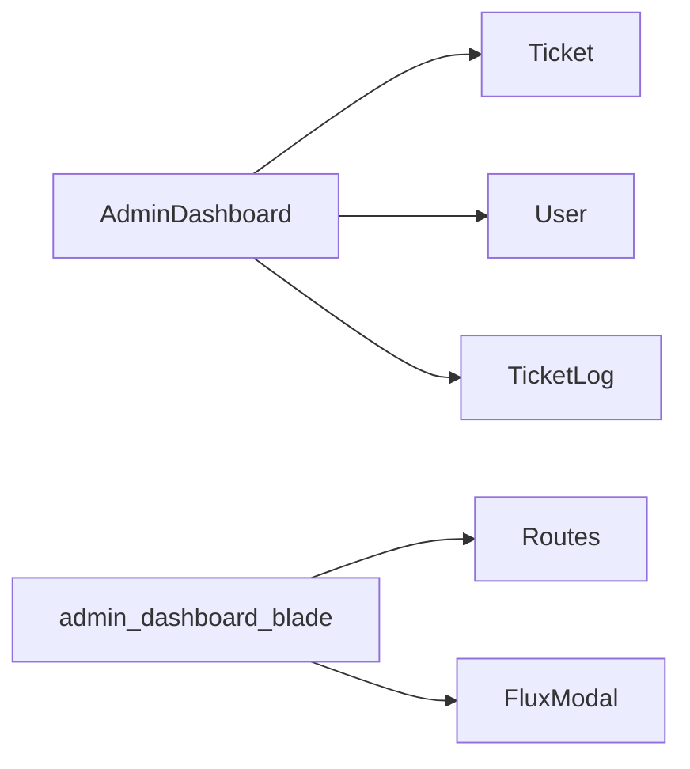

# Admin Dashboard

<cite>
**Referenced Files in This Document**
- [AdminDashboard.php](file://app/Livewire/Dashboard/AdminDashboard.php)
- [admin-dashboard.blade.php](file://resources/views/livewire/dashboard/admin-dashboard.blade.php)
- [web.php](file://routes/web.php)
- [AdminOnly.php](file://app/Http/Middleware/AdminOnly.php)
- [EnsureUserBelongsToCompany.php](file://app/Http/Middleware/EnsureUserBelongsToCompany.php)
- [IdentifyCompanyFromSubdomain.php](file://app/Http/Middleware/IdentifyCompanyFromSubdomain.php)
- [Ticket.php](file://app/Models/Ticket.php)
- [User.php](file://app/Models/User.php)
- [TicketLog.php](file://app/Models/TicketLog.php)
</cite>

## Table of Contents
1. [Introduction](#introduction)
2. [Project Structure](#project-structure)
3. [Core Components](#core-components)
4. [Architecture Overview](#architecture-overview)
5. [Detailed Component Analysis](#detailed-component-analysis)
6. [Dependency Analysis](#dependency-analysis)
7. [Performance Considerations](#performance-considerations)
8. [Troubleshooting Guide](#troubleshooting-guide)
9. [Conclusion](#conclusion)

## Introduction
The Admin Dashboard is a comprehensive administrative interface designed for system-wide oversight and management. It provides key metrics, real-time ticket lists, agents activity tracking, and a recent activity feed. The dashboard operates within a multi-tenant context using subdomain-based company identification and enforces strict access controls to ensure administrators see only their company’s data.

## Project Structure
The Admin Dashboard is implemented as a Livewire component with a Blade view. Routing is configured under a subdomain domain group to establish the multi-tenant context. Access is restricted to administrators via middleware.

**Diagram sources**
- [web.php:70-114](file://routes/web.php#L70-L114)
- [IdentifyCompanyFromSubdomain.php:10-36](file://app/Http/Middleware/IdentifyCompanyFromSubdomain.php#L10-L36)
- [EnsureUserBelongsToCompany.php:9-38](file://app/Http/Middleware/EnsureUserBelongsToCompany.php#L9-L38)
- [AdminOnly.php:9-24](file://app/Http/Middleware/AdminOnly.php#L9-L24)
- [AdminDashboard.php:14-127](file://app/Livewire/Dashboard/AdminDashboard.php#L14-L127)
- [admin-dashboard.blade.php:1-406](file://resources/views/livewire/dashboard/admin-dashboard.blade.php#L1-L406)
- [Ticket.php:9-63](file://app/Models/Ticket.php#L9-L63)
- [User.php:13-137](file://app/Models/User.php#L13-L137)
- [TicketLog.php:7-25](file://app/Models/TicketLog.php#L7-L25)

**Section sources**
- [web.php:70-114](file://routes/web.php#L70-L114)
- [AdminDashboard.php:14-127](file://app/Livewire/Dashboard/AdminDashboard.php#L14-L127)
- [admin-dashboard.blade.php:1-406](file://resources/views/livewire/dashboard/admin-dashboard.blade.php#L1-L406)

## Core Components
- Metrics cards: Open tickets, Resolved today, Unassigned, Total agents, SLA Breaches (placeholder).
- Real-time lists: Open/in-progress tickets, Recently resolved tickets, Unassigned tickets with categories and users.
- Agents activity: Per-agent workload distribution and status indicators.
- Recent activity feed: Ticket log updates and system events.

**Section sources**
- [AdminDashboard.php:16-120](file://app/Livewire/Dashboard/AdminDashboard.php#L16-L120)
- [admin-dashboard.blade.php:8-298](file://resources/views/livewire/dashboard/admin-dashboard.blade.php#L8-L298)

## Architecture Overview
The Admin Dashboard composes data using Livewire #[Computed] properties that query Eloquent models scoped to the current company context. The view renders interactive modals for each metric list and a scrollable recent activity feed.

**Diagram sources**
- [web.php:70-114](file://routes/web.php#L70-L114)
- [IdentifyCompanyFromSubdomain.php:10-36](file://app/Http/Middleware/IdentifyCompanyFromSubdomain.php#L10-L36)
- [EnsureUserBelongsToCompany.php:9-38](file://app/Http/Middleware/EnsureUserBelongsToCompany.php#L9-L38)
- [AdminOnly.php:9-24](file://app/Http/Middleware/AdminOnly.php#L9-L24)
- [AdminDashboard.php:14-127](file://app/Livewire/Dashboard/AdminDashboard.php#L14-L127)
- [admin-dashboard.blade.php:1-406](file://resources/views/livewire/dashboard/admin-dashboard.blade.php#L1-L406)

## Detailed Component Analysis

### AdminDashboard Component
- Metrics:
  - Open tickets count: Sum of open and in_progress tickets.
  - Resolved today: Count of resolved tickets updated today.
  - Unassigned tickets: Count of tickets without assignee and not closed.
  - Total agents: Count of agents/administrators/operators excluding self.
- Lists:
  - Open tickets list: Latest open and in_progress with user and category.
  - Resolved today list: Latest resolved tickets updated today.
  - Unassigned tickets list: Latest unassigned tickets with category.
  - Total agents list: Agents with open ticket counts.
- Agents activity:
  - Filters users by company and roles, counts active tickets (open, in_progress, pending).
- Recent activity:
  - Latest ticket logs with user and ticket relations.

**Diagram sources**
- [AdminDashboard.php:14-127](file://app/Livewire/Dashboard/AdminDashboard.php#L14-L127)
- [Ticket.php:9-63](file://app/Models/Ticket.php#L9-L63)
- [User.php:13-137](file://app/Models/User.php#L13-L137)
- [TicketLog.php:7-25](file://app/Models/TicketLog.php#L7-L25)

**Section sources**
- [AdminDashboard.php:16-120](file://app/Livewire/Dashboard/AdminDashboard.php#L16-L120)

### View Rendering and Interactions
- KPI cards trigger flyout modals for detailed lists.
- Recent tickets table shows clickable rows linking to ticket details.
- Agent activity bars visualize workload percentage and status label.
- Recent activity feed displays icons and timestamps for actions like assignment and priority change.

**Diagram sources**
- [admin-dashboard.blade.php:8-298](file://resources/views/livewire/dashboard/admin-dashboard.blade.php#L8-L298)

**Section sources**
- [admin-dashboard.blade.php:8-298](file://resources/views/livewire/dashboard/admin-dashboard.blade.php#L8-L298)

### Multi-Tenant Context and Access Control
- Subdomain identification sets the company context on the request.
- Access control ensures the authenticated user belongs to the requested company.
- Role-based restriction allows only admins to access the admin dashboard.

**Diagram sources**
- [web.php:70-114](file://routes/web.php#L70-L114)
- [IdentifyCompanyFromSubdomain.php:10-36](file://app/Http/Middleware/IdentifyCompanyFromSubdomain.php#L10-L36)
- [EnsureUserBelongsToCompany.php:9-38](file://app/Http/Middleware/EnsureUserBelongsToCompany.php#L9-L38)
- [AdminOnly.php:9-24](file://app/Http/Middleware/AdminOnly.php#L9-L24)

**Section sources**
- [web.php:70-114](file://routes/web.php#L70-L114)
- [IdentifyCompanyFromSubdomain.php:10-36](file://app/Http/Middleware/IdentifyCompanyFromSubdomain.php#L10-L36)
- [EnsureUserBelongsToCompany.php:9-38](file://app/Http/Middleware/EnsureUserBelongsToCompany.php#L9-L38)
- [AdminOnly.php:9-24](file://app/Http/Middleware/AdminOnly.php#L9-L24)

## Dependency Analysis
- The component depends on:
  - Ticket model for status/priority/category/user relations and date-scoped queries.
  - User model for company scoping and role filtering.
  - TicketLog model for recent activity entries.
- The view depends on:
  - Route helpers to build links to tickets and operators.
  - Tailwind classes and Flux modal components for rendering.

**Diagram sources**
- [AdminDashboard.php:5-12](file://app/Livewire/Dashboard/AdminDashboard.php#L5-L12)
- [Ticket.php:16-54](file://app/Models/Ticket.php#L16-L54)
- [User.php:74-97](file://app/Models/User.php#L74-L97)
- [TicketLog.php:16-24](file://app/Models/TicketLog.php#L16-L24)
- [admin-dashboard.blade.php:78-95](file://resources/views/livewire/dashboard/admin-dashboard.blade.php#L78-L95)

**Section sources**
- [AdminDashboard.php:5-12](file://app/Livewire/Dashboard/AdminDashboard.php#L5-L12)
- [Ticket.php:16-54](file://app/Models/Ticket.php#L16-L54)
- [User.php:74-97](file://app/Models/User.php#L74-L97)
- [TicketLog.php:16-24](file://app/Models/TicketLog.php#L16-L24)
- [admin-dashboard.blade.php:78-95](file://resources/views/livewire/dashboard/admin-dashboard.blade.php#L78-L95)

## Performance Considerations
- #[Computed] properties are cached per request lifecycle, reducing repeated database work.
- Queries use latest() and take() limits to cap list sizes (e.g., recent tickets capped at 8, open/resolved/unassigned at 50).
- Eager loading with relations (user, category) minimizes N+1 queries for lists.
- Consider adding pagination for larger datasets if list sizes grow beyond acceptable thresholds.

[No sources needed since this section provides general guidance]

## Troubleshooting Guide
- No data shown:
  - Verify the authenticated user belongs to the company context; otherwise, access is denied.
  - Confirm the subdomain resolves to a valid company slug.
- Unauthorized access:
  - Ensure the user has role admin; non-admins are redirected to the tickets page.
- Missing recent activity:
  - Recent activity relies on TicketLog entries; ensure logs are being created for ticket actions.
- Incorrect counts:
  - Open tickets include open, in_progress, and pending statuses; verify status values align with expectations.

**Section sources**
- [EnsureUserBelongsToCompany.php:9-38](file://app/Http/Middleware/EnsureUserBelongsToCompany.php#L9-L38)
- [AdminOnly.php:9-24](file://app/Http/Middleware/AdminOnly.php#L9-L24)
- [web.php:70-114](file://routes/web.php#L70-L114)
- [Ticket.php:59-62](file://app/Models/Ticket.php#L59-L62)

## Conclusion
The Admin Dashboard delivers a focused, multi-tenant view of helpdesk operations. It consolidates key metrics, actionable lists, agent workload insights, and recent system activity into a single interface. Its middleware-driven access control and company-scoped queries ensure secure and accurate reporting for administrators.