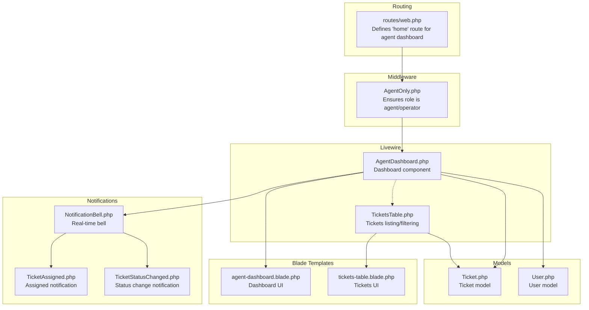
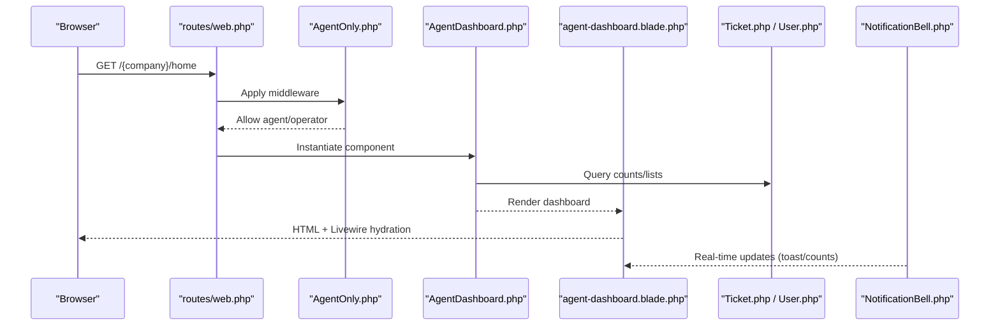
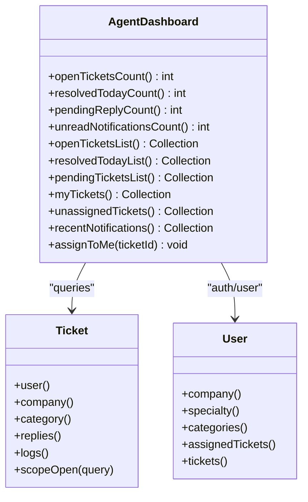
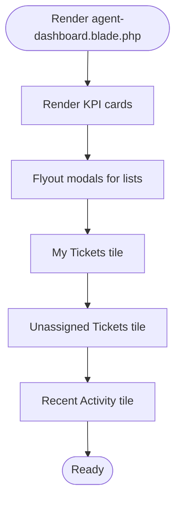
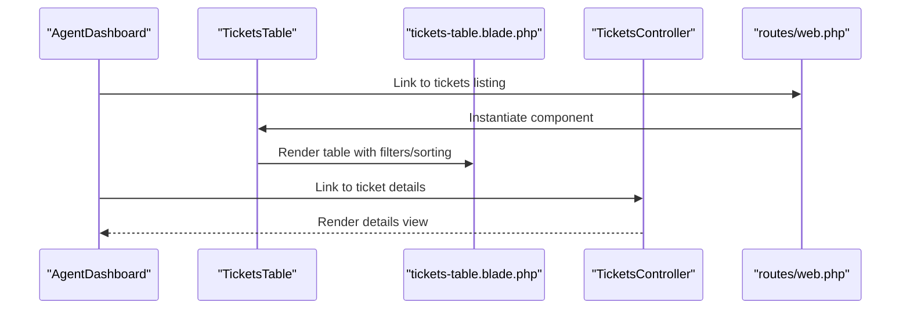
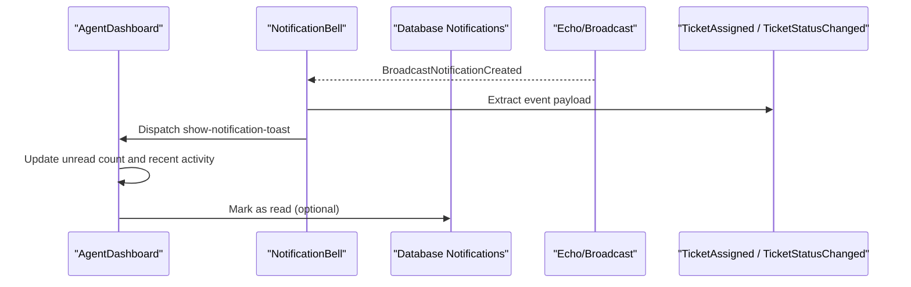
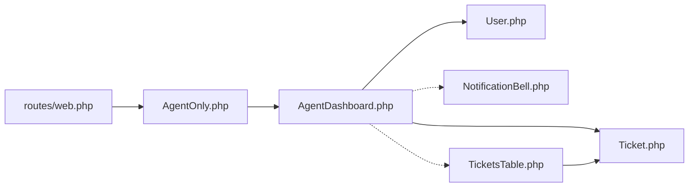

# Agent Dashboard

<cite>
**Referenced Files in This Document**
- [AgentDashboard.php](file://app/Livewire/Dashboard/AgentDashboard.php)
- [agent-dashboard.blade.php](file://resources/views/livewire/dashboard/agent-dashboard.blade.php)
- [AgentOnly.php](file://app/Http/Middleware/AgentOnly.php)
- [web.php](file://routes/web.php)
- [TicketsTable.php](file://app/Livewire/Dashboard/TicketsTable.php)
- [tickets-table.blade.php](file://resources/views/livewire/dashboard/tickets-table.blade.php)
- [Ticket.php](file://app/Models/Ticket.php)
- [User.php](file://app/Models/User.php)
- [NotificationBell.php](file://app/Livewire/NotificationBell.php)
- [TicketAssigned.php](file://app/Notifications/TicketAssigned.php)
- [TicketStatusChanged.php](file://app/Notifications/TicketStatusChanged.php)
- [TicketsController.php](file://app/Http/Controllers/TicketsController.php)
</cite>

## Table of Contents
1. [Introduction](#introduction)
2. [Project Structure](#project-structure)
3. [Core Components](#core-components)
4. [Architecture Overview](#architecture-overview)
5. [Detailed Component Analysis](#detailed-component-analysis)
6. [Dependency Analysis](#dependency-analysis)
7. [Performance Considerations](#performance-considerations)
8. [Troubleshooting Guide](#troubleshooting-guide)
9. [Conclusion](#conclusion)

## Introduction
The agent dashboard is a personalized interface tailored for individual support team members. It centralizes their workflow by presenting:
- Personalized ticket management: assigned tickets overview with priority, due date indicators, and status badges
- Productivity insights: counts for open/resolved/pending tickets and unread notifications
- Quick actions: self-assignment of unassigned tickets, navigation to notifications, and access to detailed views
- Integration with the tickets table for advanced filtering, sorting, and bulk operations
- Real-time updates and notification integration to keep agents informed of changes and new assignments

This document explains how the dashboard is structured, how data flows through Livewire components and Blade templates, and how it integrates with the broader system for notifications and ticket management.

## Project Structure
The agent dashboard is implemented as a Livewire component rendered by a Blade view. It is wired into the routing system under the subdomain-based company namespace and guarded by middleware ensuring only agents/operators can access it.

**Diagram sources**
- [web.php:88-90](file://routes/web.php#L88-L90)
- [AgentOnly.php:16-23](file://app/Http/Middleware/AgentOnly.php#L16-L23)
- [AgentDashboard.php:16-141](file://app/Livewire/Dashboard/AgentDashboard.php#L16-L141)
- [agent-dashboard.blade.php:1-268](file://resources/views/livewire/dashboard/agent-dashboard.blade.php#L1-L268)
- [TicketsTable.php:14-523](file://app/Livewire/Dashboard/TicketsTable.php#L14-L523)
- [tickets-table.blade.php:1-841](file://resources/views/livewire/dashboard/tickets-table.blade.php#L1-L841)
- [Ticket.php:9-64](file://app/Models/Ticket.php#L9-L64)
- [User.php:13-137](file://app/Models/User.php#L13-L137)
- [NotificationBell.php:10-96](file://app/Livewire/NotificationBell.php#L10-L96)
- [TicketAssigned.php:9-49](file://app/Notifications/TicketAssigned.php#L9-L49)
- [TicketStatusChanged.php:9-55](file://app/Notifications/TicketStatusChanged.php#L9-L55)

**Section sources**
- [web.php:88-90](file://routes/web.php#L88-L90)
- [AgentOnly.php:16-23](file://app/Http/Middleware/AgentOnly.php#L16-L23)
- [AgentDashboard.php:16-141](file://app/Livewire/Dashboard/AgentDashboard.php#L16-L141)
- [agent-dashboard.blade.php:1-268](file://resources/views/livewire/dashboard/agent-dashboard.blade.php#L1-L268)

## Core Components
- AgentDashboard (Livewire): Computes and exposes:
  - KPI counts: open tickets, resolved today, pending reply, unread notifications
  - Lists: open tickets, resolved today, pending tickets, my tickets (top N), unassigned tickets (company-wide)
  - Action: self-assign unassigned tickets with logging and toast feedback
- agent-dashboard.blade.php (Blade): Renders:
  - KPI cards with flyout modals for lists
  - “My Tickets” tile with priority/status badges and timestamps
  - “Unassigned Tickets” tile with quick self-assignment button
  - “Recent Activity” tile with notification previews
- TicketsTable (Livewire): Provides the tickets listing used across the system with:
  - Filtering/sorting/searching
  - Bulk operations (status, priority, assignment)
  - Pagination and saved filter views
- NotificationBell (Livewire): Handles real-time notifications via Echo and database broadcasts:
  - Listens for broadcast events and dispatches UI updates
  - Marks notifications as read and navigates to ticket details when clicked

**Section sources**
- [AgentDashboard.php:18-141](file://app/Livewire/Dashboard/AgentDashboard.php#L18-L141)
- [agent-dashboard.blade.php:8-268](file://resources/views/livewire/dashboard/agent-dashboard.blade.php#L8-L268)
- [TicketsTable.php:14-523](file://app/Livewire/Dashboard/TicketsTable.php#L14-L523)
- [NotificationBell.php:10-96](file://app/Livewire/NotificationBell.php#L10-L96)

## Architecture Overview
The agent dashboard orchestrates data retrieval and presentation through Livewire components backed by Eloquent models. Navigation to ticket details leverages named routes bound to the subdomain company slug. Real-time updates are delivered via database and broadcast notifications.

**Diagram sources**
- [web.php:88-90](file://routes/web.php#L88-L90)
- [AgentOnly.php:16-23](file://app/Http/Middleware/AgentOnly.php#L16-L23)
- [AgentDashboard.php:18-141](file://app/Livewire/Dashboard/AgentDashboard.php#L18-L141)
- [agent-dashboard.blade.php:1-268](file://resources/views/livewire/dashboard/agent-dashboard.blade.php#L1-L268)
- [Ticket.php:9-64](file://app/Models/Ticket.php#L9-L64)
- [User.php:13-137](file://app/Models/User.php#L13-L137)
- [NotificationBell.php:10-96](file://app/Livewire/NotificationBell.php#L10-L96)

## Detailed Component Analysis

### AgentDashboard Component
Responsibilities:
- Compute KPIs and lists for the agent’s personal view
- Provide quick self-assignment of unassigned tickets
- Dispatch UI feedback and log actions

Key computed properties:
- openTicketsCount, resolvedTodayCount, pendingReplyCount, unreadNotificationsCount
- openTicketsList, resolvedTodayList, pendingTicketsList, myTickets (limited), unassignedTickets (company-wide)
- recentNotifications

Action:
- assignToMe(ticketId): validates unassigned ticket in the agent’s company, assigns it to the current user, sets status to in_progress, logs the action, and emits a toast

Rendering:
- The Blade view binds these properties to cards, tiles, and modals

**Diagram sources**
- [AgentDashboard.php:18-141](file://app/Livewire/Dashboard/AgentDashboard.php#L18-L141)
- [Ticket.php:16-63](file://app/Models/Ticket.php#L16-L63)
- [User.php:74-97](file://app/Models/User.php#L74-L97)

**Section sources**
- [AgentDashboard.php:18-141](file://app/Livewire/Dashboard/AgentDashboard.php#L18-L141)
- [Ticket.php:16-63](file://app/Models/Ticket.php#L16-L63)
- [User.php:74-97](file://app/Models/User.php#L74-L97)

### Dashboard UI (agent-dashboard.blade.php)
Highlights:
- KPI cards: click to open flyout modals for open/resolved/pending tickets
- My Tickets tile: shows subject, customer, priority badge, status badge, and relative timestamp
- Unassigned Tickets tile: shows priority and quick “Assign to me” buttons per ticket
- Recent Activity tile: previews notifications with read/unread indicator and relative time
- Navigation: links to tickets listing and notifications page

**Diagram sources**
- [agent-dashboard.blade.php:8-268](file://resources/views/livewire/dashboard/agent-dashboard.blade.php#L8-L268)

**Section sources**
- [agent-dashboard.blade.php:8-268](file://resources/views/livewire/dashboard/agent-dashboard.blade.php#L8-L268)

### Integration with Tickets Table (Filtering, Sorting, Bulk Operations)
While the agent dashboard focuses on personal KPIs and quick actions, the tickets table component provides the full-featured listing used across the system:
- Filtering: search, date range, status, priority, category (admin), assigned (admin), show deleted only
- Sorting: by ticket_number, subject, customer_name, priority, status
- Bulk actions: set status, set priority, assign agent, delete selected
- Saved filter views and pagination

The agent dashboard links to the tickets listing and details pages using named routes bound to the company slug.

**Diagram sources**
- [TicketsTable.php:14-523](file://app/Livewire/Dashboard/TicketsTable.php#L14-L523)
- [tickets-table.blade.php:1-841](file://resources/views/livewire/dashboard/tickets-table.blade.php#L1-L841)
- [TicketsController.php:12-18](file://app/Http/Controllers/TicketsController.php#L12-L18)
- [web.php:94-96](file://routes/web.php#L94-L96)

**Section sources**
- [TicketsTable.php:14-523](file://app/Livewire/Dashboard/TicketsTable.php#L14-L523)
- [tickets-table.blade.php:1-841](file://resources/views/livewire/dashboard/tickets-table.blade.php#L1-L841)
- [TicketsController.php:12-18](file://app/Http/Controllers/TicketsController.php#L12-L18)
- [web.php:94-96](file://routes/web.php#L94-L96)

### Real-Time Updates and Notification Integration
Real-time updates are handled by the NotificationBell component:
- Subscribes to private user notifications via Echo
- Receives broadcast events for ticket-related changes
- Dispatches UI notifications and refreshes unread counts
- Supports marking notifications as read and navigating to ticket details

Notifications used:
- TicketAssigned: broadcast when a ticket is assigned to the agent
- TicketStatusChanged: broadcast when a ticket’s status changes

**Diagram sources**
- [NotificationBell.php:19-53](file://app/Livewire/NotificationBell.php#L19-L53)
- [TicketAssigned.php:28-47](file://app/Notifications/TicketAssigned.php#L28-L47)
- [TicketStatusChanged.php:34-53](file://app/Notifications/TicketStatusChanged.php#L34-L53)

**Section sources**
- [NotificationBell.php:19-53](file://app/Livewire/NotificationBell.php#L19-L53)
- [TicketAssigned.php:28-47](file://app/Notifications/TicketAssigned.php#L28-L47)
- [TicketStatusChanged.php:34-53](file://app/Notifications/TicketStatusChanged.php#L34-L53)

## Dependency Analysis
- Routing and access control:
  - The agent dashboard route is defined under the company subdomain and requires the agent/operator role via middleware.
- Component dependencies:
  - AgentDashboard depends on Ticket and User models for queries and on the NotificationBell for real-time updates.
  - The tickets table component is shared across the system and provides the filtering/sorting/bulk capabilities referenced by the dashboard.
- Data models:
  - Ticket model defines relationships to user/company/category and scopes for open tickets.
  - User model defines roles, specialties, and relations to tickets and categories.

**Diagram sources**
- [web.php:88-90](file://routes/web.php#L88-L90)
- [AgentOnly.php:16-23](file://app/Http/Middleware/AgentOnly.php#L16-L23)
- [AgentDashboard.php:18-141](file://app/Livewire/Dashboard/AgentDashboard.php#L18-L141)
- [Ticket.php:16-63](file://app/Models/Ticket.php#L16-L63)
- [User.php:74-97](file://app/Models/User.php#L74-L97)
- [NotificationBell.php:10-96](file://app/Livewire/NotificationBell.php#L10-L96)
- [TicketsTable.php:14-523](file://app/Livewire/Dashboard/TicketsTable.php#L14-L523)

**Section sources**
- [web.php:88-90](file://routes/web.php#L88-L90)
- [AgentOnly.php:16-23](file://app/Http/Middleware/AgentOnly.php#L16-L23)
- [AgentDashboard.php:18-141](file://app/Livewire/Dashboard/AgentDashboard.php#L18-L141)
- [Ticket.php:16-63](file://app/Models/Ticket.php#L16-L63)
- [User.php:74-97](file://app/Models/User.php#L74-L97)
- [NotificationBell.php:10-96](file://app/Livewire/NotificationBell.php#L10-L96)
- [TicketsTable.php:14-523](file://app/Livewire/Dashboard/TicketsTable.php#L14-L523)

## Performance Considerations
- Queries are scoped to the authenticated user’s company and assigned tickets to minimize dataset size.
- Priority ordering uses a CASE statement to visually prioritize urgent/high/medium/low tickets.
- Pagination is used in the tickets table to limit rendering overhead.
- Caching of categories and agents is implemented in the tickets table to reduce repeated lookups.
- Livewire lazy loading and targeted updates (e.g., assignToMe) avoid full-page reloads.

[No sources needed since this section provides general guidance]

## Troubleshooting Guide
Common scenarios and checks:
- Access denied: Ensure the user role is agent or operator; the AgentOnly middleware redirects non-eligible users to the tickets listing.
- No tickets shown in “My Tickets”: Confirm the agent is assigned to tickets and that the status is not resolved/closed.
- Self-assignment fails: Verify the ticket exists, belongs to the same company, and is currently unassigned.
- Notifications not updating: Confirm Echo is configured and the NotificationBell component is listening for broadcast events; check unread counts and recent activity tiles.
- Links to details fail: Ensure the route is bound to the company slug and the ticket route resolves correctly.

**Section sources**
- [AgentOnly.php:18-20](file://app/Http/Middleware/AgentOnly.php#L18-L20)
- [AgentDashboard.php:115-135](file://app/Livewire/Dashboard/AgentDashboard.php#L115-L135)
- [NotificationBell.php:19-53](file://app/Livewire/NotificationBell.php#L19-L53)
- [web.php:94-96](file://routes/web.php#L94-L96)

## Conclusion
The agent dashboard delivers a focused, efficient interface for individual support agents. It combines personal KPIs, quick self-assignment, and real-time notifications with robust integration to the tickets table for advanced filtering and bulk operations. The design emphasizes clarity of priority and status, streamlined navigation, and responsive feedback to optimize daily workflow and ticket handling efficiency.