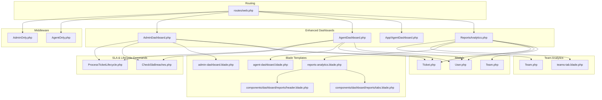
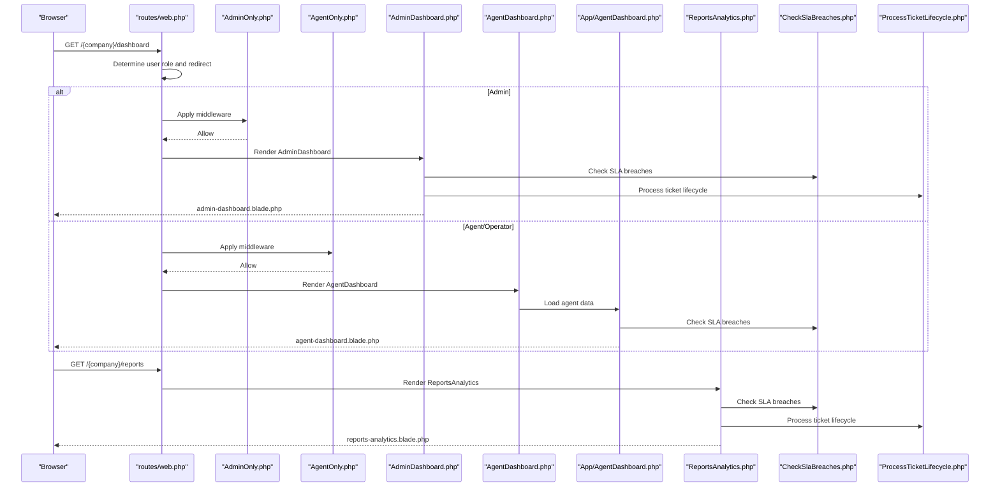
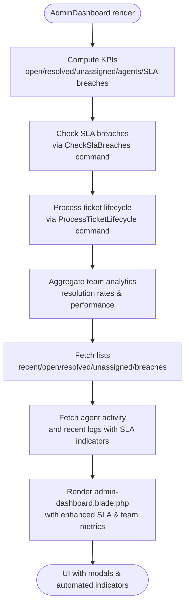
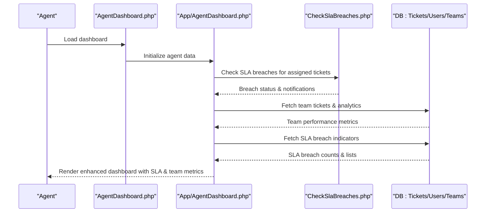
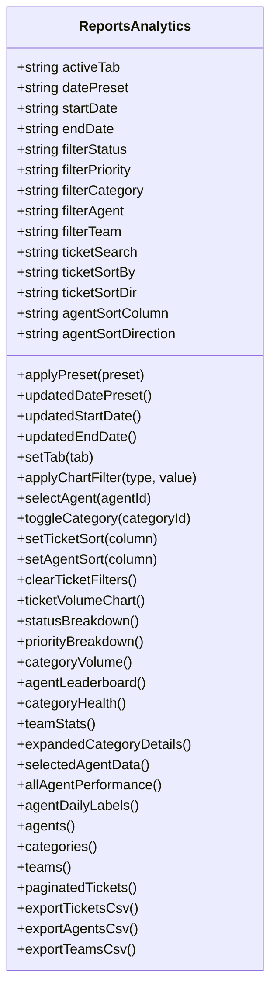
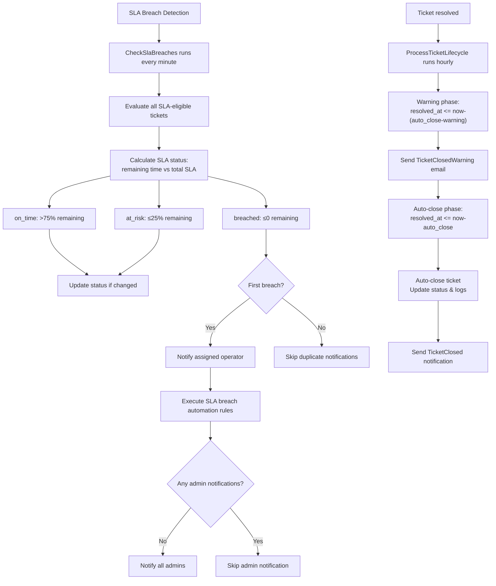
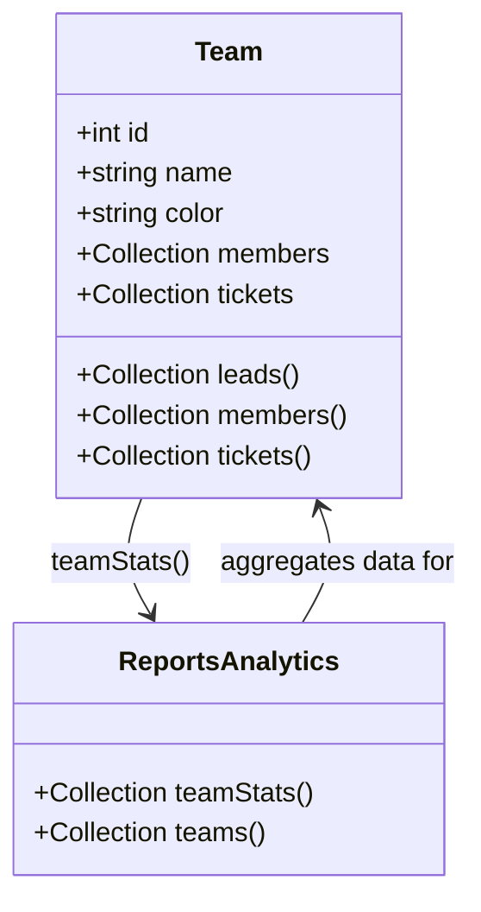
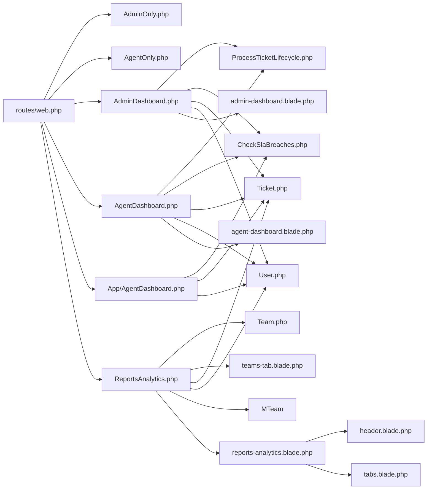

# Dashboard & Analytics

<cite>
**Referenced Files in This Document**
- [AdminDashboard.php](file://app/Livewire/Dashboard/AdminDashboard.php)
- [AgentDashboard.php](file://app/Livewire/Dashboard/AgentDashboard.php)
- [App/AgentDashboard.php](file://app/Livewire/App/AgentDashboard.php)
- [ReportsAnalytics.php](file://app/Livewire/Dashboard/ReportsAnalytics.php)
- [ProcessTicketLifecycle.php](file://app/Console/Commands/ProcessTicketLifecycle.php)
- [CheckSlaBreaches.php](file://app/Console/Commands/CheckSlaBreaches.php)
- [SlaBreached.php](file://app/Notifications/SlaBreached.php)
- [Team.php](file://app/Models/Team.php)
- [SLA_SYSTEM_FLOW.md](file://SLA_SYSTEM_FLOW.md)
- [admin-dashboard.blade.php](file://resources/views/livewire/tickets/admin-dashboard.blade.php)
- [agent-dashboard.blade.php](file://resources/views/livewire/tickets/agent-dashboard.blade.php)
- [reports-analytics.blade.php](file://resources/views/livewire/dashboard/reports-analytics.blade.php)
- [teams-tab.blade.php](file://resources/views/livewire/reports/teams-tab.blade.php)
- [web.php](file://routes/web.php)
- [AdminOnly.php](file://app/Http/Middleware/AdminOnly.php)
- [AgentOnly.php](file://app/Http/Middleware/AgentOnly.php)
- [Ticket.php](file://app/Models/Ticket.php)
- [User.php](file://app/Models/User.php)
- [header.blade.php](file://resources/views/components/dashboard/reports/header.blade.php)
- [tabs.blade.php](file://resources/views/components/dashboard/reports/tabs.blade.php)
</cite>

## Update Summary
**Changes Made**
- Added SLA breach monitoring system with automated ticket lifecycle processing
- Enhanced agent dashboard with team-based analytics and SLA breach indicators
- Integrated ProcessTicketLifecycle command for automated ticket processing
- Added team-based reporting capabilities with resolution rate tracking
- Updated SLA system documentation with new automation flows

## Table of Contents
1. [Introduction](#introduction)
2. [Project Structure](#project-structure)
3. [Core Components](#core-components)
4. [Architecture Overview](#architecture-overview)
5. [Detailed Component Analysis](#detailed-component-analysis)
6. [SLA System & Ticket Lifecycle Management](#sla-system--ticket-lifecycle-management)
7. [Enhanced Team-Based Analytics](#enhanced-team-based-analytics)
8. [Dependency Analysis](#dependency-analysis)
9. [Performance Considerations](#performance-considerations)
10. [Troubleshooting Guide](#troubleshooting-guide)
11. [Conclusion](#conclusion)
12. [Appendices](#appendices)

## Introduction
This document explains the enhanced dual dashboard architecture that serves both administrators and agents, featuring comprehensive SLA breach monitoring, automated ticket lifecycle management, and team-based analytics. The system now includes:
- Role-specific dashboards: admin overview with SLA breach monitoring and agent workflow with team analytics
- SLA breach detection and automated ticket lifecycle processing
- Team-based analytics with resolution rates and performance metrics
- Enhanced reporting capabilities with KPI dashboards and automated workflows
- Automated ticket processing with warning emails and auto-closure
- Interactive charts, export functionality, and customizable report views

## Project Structure
The enhanced dashboards and analytics are implemented as Livewire components with Blade templates, featuring new SLA monitoring and team analytics capabilities. Middleware enforces role-based access with automated ticket lifecycle processing.

**Diagram sources**
- [web.php:78-112](file://routes/web.php#L78-L112)
- [AdminOnly.php:16-23](file://app/Http/Middleware/AdminOnly.php#L16-L23)
- [AgentOnly.php:16-23](file://app/Http/Middleware/AgentOnly.php#L16-L23)
- [AdminDashboard.php:14-127](file://app/Livewire/Dashboard/AdminDashboard.php#L14-L127)
- [AgentDashboard.php:16-141](file://app/Livewire/Dashboard/AgentDashboard.php#L16-L141)
- [App/AgentDashboard.php:18-268](file://app/Livewire/App/AgentDashboard.php#L18-L268)
- [ReportsAnalytics.php:21-1012](file://app/Livewire/Dashboard/ReportsAnalytics.php#L21-L1012)
- [ProcessTicketLifecycle.php:16-113](file://app/Console/Commands/ProcessTicketLifecycle.php#L16-L113)
- [CheckSlaBreaches.php:13-141](file://app/Console/Commands/CheckSlaBreaches.php#L13-L141)
- [Team.php:9-40](file://app/Models/Team.php#L9-L40)
- [teams-tab.blade.php:1-52](file://resources/views/livewire/reports/teams-tab.blade.php#L1-L52)
- [admin-dashboard.blade.php:1-406](file://resources/views/livewire/tickets/admin-dashboard.blade.php#L1-L406)
- [agent-dashboard.blade.php:1-268](file://resources/views/livewire/tickets/agent-dashboard.blade.php#L1-L268)
- [reports-analytics.blade.php:1-32](file://resources/views/livewire/dashboard/reports-analytics.blade.php#L1-L32)
- [Ticket.php:9-64](file://app/Models/Ticket.php#L9-L64)
- [User.php:13-137](file://app/Models/User.php#L13-L137)

**Section sources**
- [web.php:78-112](file://routes/web.php#L78-L112)
- [AdminOnly.php:16-23](file://app/Http/Middleware/AdminOnly.php#L16-L23)
- [AgentOnly.php:16-23](file://app/Http/Middleware/AgentOnly.php#L16-L23)

## Core Components
- **AdminDashboard**: Provides system-wide KPIs with SLA breach monitoring, automated ticket lifecycle management, and team analytics integration.
- **AgentDashboard**: Enhanced with SLA breach indicators, team-based ticket assignments, and automated workflow notifications.
- **App/AgentDashboard**: Core agent dashboard logic with team analytics, SLA breach tracking, and self-assignment capabilities.
- **ReportsAnalytics**: Central analytics hub with enhanced team performance metrics, SLA breach reporting, and automated workflow insights.
- **ProcessTicketLifecycle**: Automated command for sending closure warnings and auto-closing resolved tickets based on SLA policies.
- **CheckSlaBreaches**: Scheduled command for detecting SLA status changes and triggering automation rules.

**Section sources**
- [AdminDashboard.php:14-127](file://app/Livewire/Dashboard/AdminDashboard.php#L14-L127)
- [AgentDashboard.php:16-141](file://app/Livewire/Dashboard/AgentDashboard.php#L16-L141)
- [App/AgentDashboard.php:18-268](file://app/Livewire/App/AgentDashboard.php#L18-L268)
- [ReportsAnalytics.php:21-1012](file://app/Livewire/Dashboard/ReportsAnalytics.php#L21-L1012)
- [ProcessTicketLifecycle.php:16-113](file://app/Console/Commands/ProcessTicketLifecycle.php#L16-L113)
- [CheckSlaBreaches.php:13-141](file://app/Console/Commands/CheckSlaBreaches.php#L13-L141)

## Architecture Overview
The enhanced dashboards feature automated SLA monitoring, team-based analytics, and automated ticket lifecycle management. The system uses scheduled commands for SLA breach detection and ticket lifecycle processing, with real-time notifications and automated workflows.

**Diagram sources**
- [web.php:78-112](file://routes/web.php#L78-L112)
- [AdminOnly.php:16-23](file://app/Http/Middleware/AdminOnly.php#L16-L23)
- [AgentOnly.php:16-23](file://app/Http/Middleware/AgentOnly.php#L16-L23)
- [AdminDashboard.php:122-127](file://app/Livewire/Dashboard/AdminDashboard.php#L122-L127)
- [AgentDashboard.php:137-141](file://app/Livewire/Dashboard/AgentDashboard.php#L137-L141)
- [App/AgentDashboard.php:263-268](file://app/Livewire/App/AgentDashboard.php#L263-L268)
- [ReportsAnalytics.php:1007-1012](file://app/Livewire/Dashboard/ReportsAnalytics.php#L1007-L1012)
- [CheckSlaBreaches.php:32-102](file://app/Console/Commands/CheckSlaBreaches.php#L32-L102)
- [ProcessTicketLifecycle.php:22-41](file://app/Console/Commands/ProcessTicketLifecycle.php#L22-L41)

## Detailed Component Analysis

### Enhanced Admin Dashboard
- **Purpose**: Provide comprehensive system overview with SLA breach monitoring and automated ticket lifecycle management.
- **Key metrics**:
  - SLA breaches count with real-time breach indicators
  - Automated ticket lifecycle processing status
  - Team performance analytics and resolution rates
  - Total agents count and per-agent open ticket distributions
  - Recent tickets feed with SLA status indicators
  - Agent activity charts with SLA breach tracking
  - Recent system activity logs with automated workflow events
- **Enhanced features**: SLA breach monitoring dashboard, automated ticket processing indicators, team analytics integration.

**Diagram sources**
- [AdminDashboard.php:16-120](file://app/Livewire/Dashboard/AdminDashboard.php#L16-L120)
- [admin-dashboard.blade.php:79-100](file://resources/views/livewire/tickets/admin-dashboard.blade.php#L79-L100)
- [CheckSlaBreaches.php:32-102](file://app/Console/Commands/CheckSlaBreaches.php#L32-L102)
- [ProcessTicketLifecycle.php:22-41](file://app/Console/Commands/ProcessTicketLifecycle.php#L22-L41)

**Section sources**
- [AdminDashboard.php:16-120](file://app/Livewire/Dashboard/AdminDashboard.php#L16-L120)
- [admin-dashboard.blade.php:79-100](file://resources/views/livewire/tickets/admin-dashboard.blade.php#L79-L100)

### Enhanced Agent Dashboard
- **Purpose**: Enable agents/operators to manage workload with SLA breach monitoring and team-based analytics.
- **Key metrics**:
  - SLA breach count with real-time breach indicators
  - Team-based ticket assignments and performance tracking
  - Open tickets count and list with SLA status
  - Resolved today count and list
  - Pending reply count and list
  - Unread notifications count with SLA breach alerts
  - My tickets with SLA breach prioritization
  - Team tickets from assigned teams (excluding personal assignments)
  - Unassigned tickets with "Assign to me" action
  - Recent notifications with SLA breach status
- **Enhanced features**: SLA breach indicators, team-based analytics, automated workflow notifications.

**Diagram sources**
- [AgentDashboard.php:16-141](file://app/Livewire/Dashboard/AgentDashboard.php#L16-L141)
- [App/AgentDashboard.php:66-200](file://app/Livewire/App/AgentDashboard.php#L66-L200)
- [agent-dashboard.blade.php:84-102](file://resources/views/livewire/tickets/agent-dashboard.blade.php#L84-L102)
- [CheckSlaBreaches.php:32-102](file://app/Console/Commands/CheckSlaBreaches.php#L32-L102)

**Section sources**
- [AgentDashboard.php:18-141](file://app/Livewire/Dashboard/AgentDashboard.php#L18-L141)
- [App/AgentDashboard.php:66-200](file://app/Livewire/App/AgentDashboard.php#L66-L200)
- [agent-dashboard.blade.php:84-102](file://resources/views/livewire/tickets/agent-dashboard.blade.php#L84-L102)

### Enhanced Reports & Analytics
- **Tabs**: Overview, Agent Performance, Tickets, Categories, Teams.
- **Enhanced team analytics**: Team cards with resolution rates, average resolution times, and member counts.
- **SLA breach reporting**: Dedicated SLA breach metrics and automated workflow tracking.
- **Date range controls**: Presets (today, this week, this month, last 3 months) and custom date pickers.
- **Filters**: Status, priority, category, agent, and team filters; plus free-text ticket search.
- **Sorting**: Tickets, agents, and teams by various columns.
- **Charts**: Enhanced with team performance indicators and SLA breach visualizations.
- **Exports**: CSV for tickets, agents, and teams; PDF export overlay present in template.

**Diagram sources**
- [ReportsAnalytics.php:21-1012](file://app/Livewire/Dashboard/ReportsAnalytics.php#L21-L1012)
- [ReportsAnalytics.php:833-862](file://app/Livewire/Dashboard/ReportsAnalytics.php#L833-L862)

**Section sources**
- [ReportsAnalytics.php:25-187](file://app/Livewire/Dashboard/ReportsAnalytics.php#L25-L187)
- [ReportsAnalytics.php:277-381](file://app/Livewire/Dashboard/ReportsAnalytics.php#L277-L381)
- [ReportsAnalytics.php:383-482](file://app/Livewire/Dashboard/ReportsAnalytics.php#L383-L482)
- [ReportsAnalytics.php:489-574](file://app/Livewire/Dashboard/ReportsAnalytics.php#L489-L574)
- [ReportsAnalytics.php:576-721](file://app/Livewire/Dashboard/ReportsAnalytics.php#L576-L721)
- [ReportsAnalytics.php:724-807](file://app/Livewire/Dashboard/ReportsAnalytics.php#L724-L807)
- [ReportsAnalytics.php:839-868](file://app/Livewire/Dashboard/ReportsAnalytics.php#L839-L868)
- [ReportsAnalytics.php:875-946](file://app/Livewire/Dashboard/ReportsAnalytics.php#L875-L946)
- [ReportsAnalytics.php:948-973](file://app/Livewire/Dashboard/ReportsAnalytics.php#L948-L973)
- [teams-tab.blade.php:1-52](file://resources/views/livewire/reports/teams-tab.blade.php#L1-L52)

## SLA System & Ticket Lifecycle Management

### SLA Breach Monitoring
The system now features comprehensive SLA breach monitoring with automated detection and response mechanisms:

- **Scheduled Detection**: `CheckSlaBreaches` command runs every minute to detect SLA status changes
- **Status States**: `on_time`, `at_risk`, `breached` with automatic state transitions
- **Real-time Notifications**: In-app notifications via `SlaBreached` notification system
- **Automation Integration**: SLA breach triggers automation rules for escalation and reassignment

### Automated Ticket Lifecycle Processing
The `ProcessTicketLifecycle` command manages post-resolution ticket handling:

- **Warning Phase**: Sends closure warnings 24 hours before auto-closure (configurable)
- **Auto-Closure**: Automatically closes tickets after configured closure period
- **Customer Communication**: Email notifications for both warning and auto-closure events
- **Audit Trail**: Comprehensive logging of all lifecycle events

**Diagram sources**
- [CheckSlaBreaches.php:32-102](file://app/Console/Commands/CheckSlaBreaches.php#L32-L102)
- [ProcessTicketLifecycle.php:22-113](file://app/Console/Commands/ProcessTicketLifecycle.php#L22-L113)
- [SLA_SYSTEM_FLOW.md:80-175](file://SLA_SYSTEM_FLOW.md#L80-L175)

**Section sources**
- [CheckSlaBreaches.php:32-102](file://app/Console/Commands/CheckSlaBreaches.php#L32-L102)
- [ProcessTicketLifecycle.php:22-113](file://app/Console/Commands/ProcessTicketLifecycle.php#L22-L113)
- [SlaBreached.php:11-59](file://app/Notifications/SlaBreached.php#L11-L59)
- [SLA_SYSTEM_FLOW.md:80-175](file://SLA_SYSTEM_FLOW.md#L80-L175)

## Enhanced Team-Based Analytics

### Team Performance Metrics
The enhanced reporting system now includes comprehensive team analytics:

- **Team Cards**: Visual cards displaying team name, member count, and key metrics
- **Performance Indicators**: Total tickets, open/resolved counts, and resolution rates
- **Average Resolution Time**: Team-level average resolution times with trend indicators
- **Color Coding**: Visual indicators for performance levels (excellent, good, needs improvement)

### Team Statistics Calculation
Team analytics are calculated using sophisticated SQL queries that aggregate ticket data by team assignment:

- **Resolution Rate**: `(resolved tickets / total tickets) * 100`
- **Average Resolution Time**: Average time from ticket creation to resolution
- **Performance Classification**: Color-coded based on predefined thresholds
- **Member Distribution**: Team member counts with lead designation

**Diagram sources**
- [Team.php:9-40](file://app/Models/Team.php#L9-L40)
- [ReportsAnalytics.php:833-862](file://app/Livewire/Dashboard/ReportsAnalytics.php#L833-L862)

**Section sources**
- [Team.php:9-40](file://app/Models/Team.php#L9-L40)
- [ReportsAnalytics.php:833-862](file://app/Livewire/Dashboard/ReportsAnalytics.php#L833-L862)
- [teams-tab.blade.php:1-52](file://resources/views/livewire/reports/teams-tab.blade.php#L1-L52)

## Dependency Analysis
The enhanced system maintains the same routing and middleware structure while adding new SLA monitoring and team analytics dependencies.

**Diagram sources**
- [web.php:78-112](file://routes/web.php#L78-L112)
- [AdminOnly.php:16-23](file://app/Http/Middleware/AdminOnly.php#L16-L23)
- [AgentOnly.php:16-23](file://app/Http/Middleware/AgentOnly.php#L16-L23)
- [AdminDashboard.php:14-127](file://app/Livewire/Dashboard/AdminDashboard.php#L14-L127)
- [AgentDashboard.php:16-141](file://app/Livewire/Dashboard/AgentDashboard.php#L16-L141)
- [App/AgentDashboard.php:18-268](file://app/Livewire/App/AgentDashboard.php#L18-L268)
- [ReportsAnalytics.php:21-1012](file://app/Livewire/Dashboard/ReportsAnalytics.php#L21-L1012)
- [ProcessTicketLifecycle.php:16-113](file://app/Console/Commands/ProcessTicketLifecycle.php#L16-L113)
- [CheckSlaBreaches.php:13-141](file://app/Console/Commands/CheckSlaBreaches.php#L13-L141)
- [Team.php:9-40](file://app/Models/Team.php#L9-L40)
- [Ticket.php:9-64](file://app/Models/Ticket.php#L9-L64)
- [User.php:13-137](file://app/Models/User.php#L13-L137)
- [admin-dashboard.blade.php:1-406](file://resources/views/livewire/tickets/admin-dashboard.blade.php#L1-L406)
- [agent-dashboard.blade.php:1-268](file://resources/views/livewire/tickets/agent-dashboard.blade.php#L1-L268)
- [reports-analytics.blade.php:1-32](file://resources/views/livewire/dashboard/reports-analytics.blade.php#L1-L32)
- [header.blade.php:1-24](file://resources/views/components/dashboard/reports/header.blade.php#L1-L24)
- [tabs.blade.php:1-38](file://resources/views/components/dashboard/reports/tabs.blade.php#L1-L38)

**Section sources**
- [web.php:78-112](file://routes/web.php#L78-L112)
- [Ticket.php:16-54](file://app/Models/Ticket.php#L16-L54)
- [User.php:74-97](file://app/Models/User.php#L74-L97)

## Performance Considerations
- **Aggregation efficiency**: ReportsAnalytics consolidates multiple KPIs into single queries with memoized previous period calculations.
- **SLA monitoring optimization**: CheckSlaBreaches uses efficient batch processing with minimal database queries.
- **Team analytics performance**: Team statistics are calculated using optimized SQL with proper indexing strategies.
- **Automated lifecycle processing**: ProcessTicketLifecycle uses efficient batch operations with email queuing.
- **Chart data optimization**: Enhanced with grouped date series and precomputed arrays for better performance.
- **Pagination and streaming**: Maintains efficient pagination and chunked processing for large datasets.

## Troubleshooting Guide
- **Access denied**:
  - Ensure the user's role matches the dashboard middleware. Admins go to admin/dashboard; agents/operators go to home.
- **SLA breach detection issues**:
  - Verify CheckSlaBreaches command is running in scheduler with proper minute intervals.
  - Check SLA policy configuration and timezone settings.
  - Ensure tickets have proper due_time calculations.
- **Ticket lifecycle processing problems**:
  - Verify ProcessTicketLifecycle command schedule and email configuration.
  - Check SLA policy warning and auto-close hour settings.
  - Review email delivery logs for failed notifications.
- **Team analytics not updating**:
  - Ensure team assignments are properly configured in user profiles.
  - Verify ticket team_id fields are populated correctly.
  - Check database indexes for team analytics queries.
- **No tickets displayed**:
  - Verify date range filters and applied filters (status, priority, category, agent, team).
  - Confirm company context and that the user belongs to the correct company.
- **Export issues**:
  - Large datasets should use chunked exports; ensure sufficient memory limits and streaming support.
- **Real-time updates**:
  - Some UI updates rely on Livewire events and WebSocket connections; ensure proper broadcasting configuration.

**Section sources**
- [web.php:78-112](file://routes/web.php#L78-L112)
- [CheckSlaBreaches.php:32-102](file://app/Console/Commands/CheckSlaBreaches.php#L32-L102)
- [ProcessTicketLifecycle.php:22-41](file://app/Console/Commands/ProcessTicketLifecycle.php#L22-L41)
- [ReportsAnalytics.php:875-946](file://app/Livewire/Dashboard/ReportsAnalytics.php#L875-L946)
- [ReportsAnalytics.php:948-973](file://app/Livewire/Dashboard/ReportsAnalytics.php#L948-L973)

## Conclusion
The enhanced system provides a comprehensive, role-aware dashboard and analytics platform with advanced SLA monitoring, automated ticket lifecycle management, and team-based analytics. Administrators gain real-time visibility into SLA breaches and automated workflows, while agents benefit from SLA breach indicators and team-based performance tracking. The system's automated ticket processing ensures compliance with service level agreements while maintaining operational efficiency and providing rich business intelligence through customizable reporting capabilities.

## Appendices

### Creating Custom Dashboard Widgets with SLA Integration
- **Widget pattern**:
  - Create a new Livewire component extending the shared layout.
  - Define computed properties for SLA breach detection and automated workflow data.
  - Integrate with CheckSlaBreaches and ProcessTicketLifecycle commands for real-time data.
  - Render the widget in a Blade template with SLA breach indicators and team analytics.
- **Integration tips**:
  - Use existing filters and date range props from ReportsAnalytics to align widget data.
  - Leverage SLA breach notifications and team analytics for enhanced insights.
  - Consider automated workflow triggers and audit trail integration.
  - Utilize model relationships (Ticket, User, Team, SlaPolicy) for comprehensive data access.

### SLA System Configuration and Management
- **SLA Policy Configuration**:
  - Configure SLA minutes for different priority levels (urgent, high, medium, low)
  - Set warning hours and auto-close hours for ticket lifecycle management
  - Enable/disable SLA monitoring per company
  - Recalculate due_times for existing tickets when SLA settings change
- **Automation Rule Integration**:
  - Configure SLA breach automation rules for escalation and reassignment
  - Set up fallback notifications for unhandled breaches
  - Monitor automation rule effectiveness through reporting
- **Monitoring and Alerts**:
  - Track SLA breach rates and trends over time
  - Monitor automated workflow performance and success rates
  - Generate reports on SLA compliance and customer satisfaction metrics