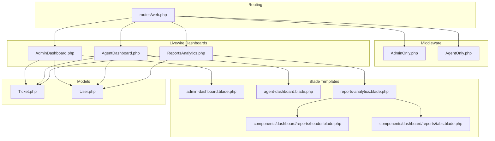
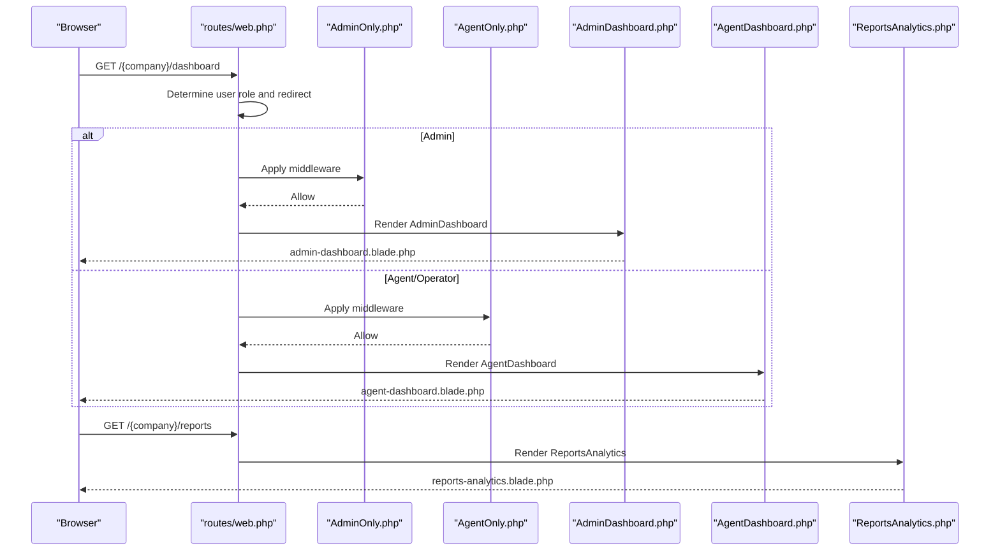
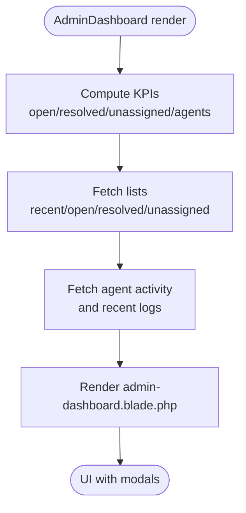
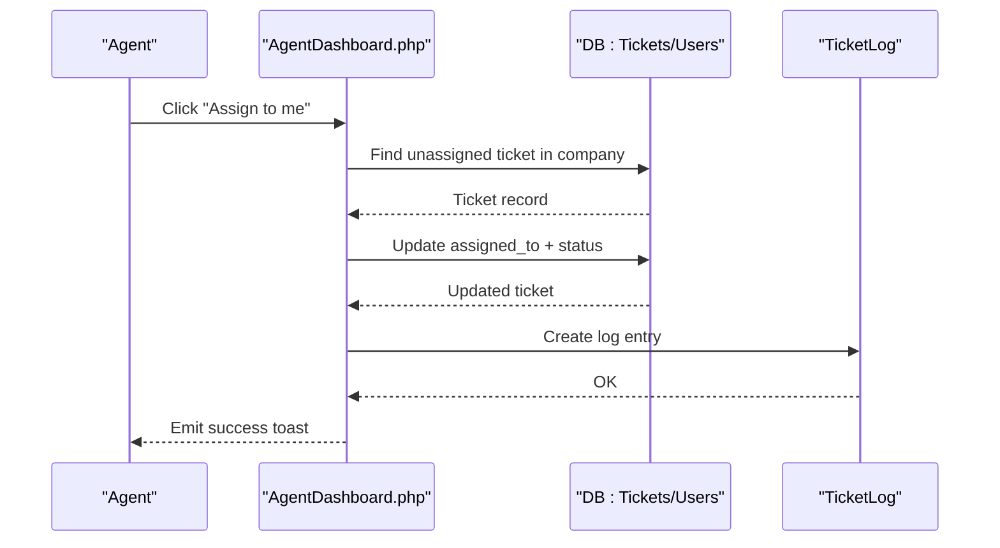
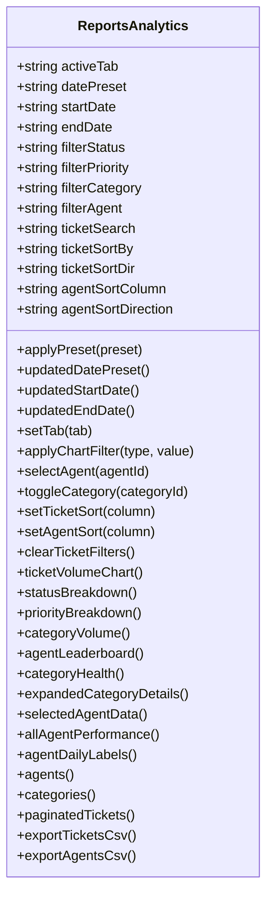
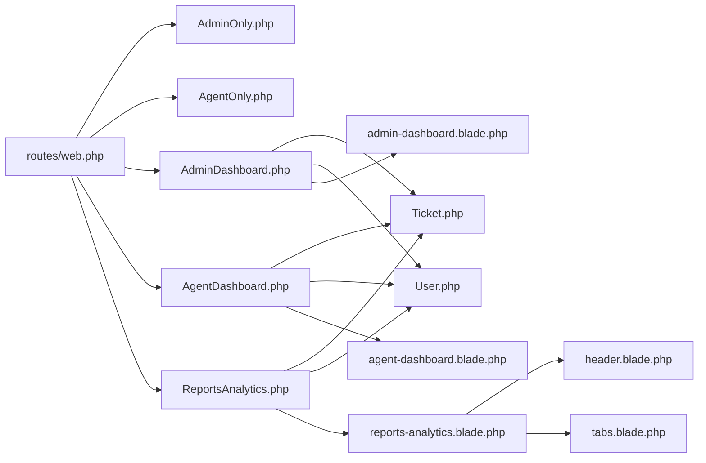

# Dashboard & Analytics

<cite>
**Referenced Files in This Document**
- [AdminDashboard.php](file://app/Livewire/Dashboard/AdminDashboard.php)
- [AgentDashboard.php](file://app/Livewire/Dashboard/AgentDashboard.php)
- [ReportsAnalytics.php](file://app/Livewire/Dashboard/ReportsAnalytics.php)
- [admin-dashboard.blade.php](file://resources/views/livewire/dashboard/admin-dashboard.blade.php)
- [agent-dashboard.blade.php](file://resources/views/livewire/dashboard/agent-dashboard.blade.php)
- [reports-analytics.blade.php](file://resources/views/livewire/dashboard/reports-analytics.blade.php)
- [web.php](file://routes/web.php)
- [AdminOnly.php](file://app/Http/Middleware/AdminOnly.php)
- [AgentOnly.php](file://app/Http/Middleware/AgentOnly.php)
- [Ticket.php](file://app/Models/Ticket.php)
- [User.php](file://app/Models/User.php)
- [header.blade.php](file://resources/views/components/dashboard/reports/header.blade.php)
- [tabs.blade.php](file://resources/views/components/dashboard/reports/tabs.blade.php)
</cite>

## Table of Contents
1. [Introduction](#introduction)
2. [Project Structure](#project-structure)
3. [Core Components](#core-components)
4. [Architecture Overview](#architecture-overview)
5. [Detailed Component Analysis](#detailed-component-analysis)
6. [Dependency Analysis](#dependency-analysis)
7. [Performance Considerations](#performance-considerations)
8. [Troubleshooting Guide](#troubleshooting-guide)
9. [Conclusion](#conclusion)
10. [Appendices](#appendices)

## Introduction
This document explains the dual dashboard architecture that serves both administrators and agents, along with comprehensive reporting and analytics capabilities. It covers:
- Role-specific dashboards: admin overview and agent workflow
- Metrics and KPIs: open/resolved/unassigned tickets, agent activity, recent system activity
- Reporting and analytics: ticket volume trends, resolution times, agent productivity, category performance
- Interactive charts, export functionality, and customizable report views
- Guidance for creating custom dashboard widgets and integrating additional business intelligence metrics

## Project Structure
The dashboards and analytics are implemented as Livewire components with Blade templates and routed under company subdomains. Middleware enforces role-based access.

**Diagram sources**
- [web.php:78-112](file://routes/web.php#L78-L112)
- [AdminOnly.php:16-23](file://app/Http/Middleware/AdminOnly.php#L16-L23)
- [AgentOnly.php:16-23](file://app/Http/Middleware/AgentOnly.php#L16-L23)
- [AdminDashboard.php:14-127](file://app/Livewire/Dashboard/AdminDashboard.php#L14-L127)
- [AgentDashboard.php:16-141](file://app/Livewire/Dashboard/AgentDashboard.php#L16-L141)
- [ReportsAnalytics.php:21-1012](file://app/Livewire/Dashboard/ReportsAnalytics.php#L21-L1012)
- [admin-dashboard.blade.php:1-406](file://resources/views/livewire/dashboard/admin-dashboard.blade.php#L1-L406)
- [agent-dashboard.blade.php:1-268](file://resources/views/livewire/dashboard/agent-dashboard.blade.php#L1-L268)
- [reports-analytics.blade.php:1-32](file://resources/views/livewire/dashboard/reports-analytics.blade.php#L1-L32)
- [Ticket.php:9-64](file://app/Models/Ticket.php#L9-L64)
- [User.php:13-137](file://app/Models/User.php#L13-L137)

**Section sources**
- [web.php:78-112](file://routes/web.php#L78-L112)
- [AdminOnly.php:16-23](file://app/Http/Middleware/AdminOnly.php#L16-L23)
- [AgentOnly.php:16-23](file://app/Http/Middleware/AgentOnly.php#L16-L23)

## Core Components
- AdminDashboard: Provides system-wide KPIs, lists of open/resolved/unassigned tickets, agent workload, and recent activity.
- AgentDashboard: Focuses on personal KPIs (open/resolved/pending), quick access to unassigned tickets, and recent notifications.
- ReportsAnalytics: Central analytics hub with tabs for Overview, Agent Performance, Tickets, and Categories; supports date presets, filters, sorting, and exports.

**Section sources**
- [AdminDashboard.php:14-127](file://app/Livewire/Dashboard/AdminDashboard.php#L14-L127)
- [AgentDashboard.php:16-141](file://app/Livewire/Dashboard/AgentDashboard.php#L16-L141)
- [ReportsAnalytics.php:21-1012](file://app/Livewire/Dashboard/ReportsAnalytics.php#L21-L1012)

## Architecture Overview
The dashboards are rendered server-side via Livewire components and templates. Routing detects the user’s role and company subdomain to direct them to the appropriate dashboard. Middleware ensures only authorized roles access specific dashboards.

**Diagram sources**
- [web.php:78-112](file://routes/web.php#L78-L112)
- [AdminOnly.php:16-23](file://app/Http/Middleware/AdminOnly.php#L16-L23)
- [AgentOnly.php:16-23](file://app/Http/Middleware/AgentOnly.php#L16-L23)
- [AdminDashboard.php:122-127](file://app/Livewire/Dashboard/AdminDashboard.php#L122-L127)
- [AgentDashboard.php:137-141](file://app/Livewire/Dashboard/AgentDashboard.php#L137-L141)
- [ReportsAnalytics.php:1007-1012](file://app/Livewire/Dashboard/ReportsAnalytics.php#L1007-L1012)

## Detailed Component Analysis

### Admin Dashboard
- Purpose: Provide company/system overview for administrators.
- Key metrics:
  - Open tickets count and list
  - Resolved today count and list
  - Unassigned tickets count and list
  - Total agents count and per-agent open ticket counts
  - Recent tickets feed
  - Agent activity bar chart (workload vs capacity)
  - Recent system activity log
- Views: Blade template renders KPI cards, tables, and modals for drill-down.

**Diagram sources**
- [AdminDashboard.php:16-120](file://app/Livewire/Dashboard/AdminDashboard.php#L16-L120)
- [admin-dashboard.blade.php:8-298](file://resources/views/livewire/dashboard/admin-dashboard.blade.php#L8-L298)

**Section sources**
- [AdminDashboard.php:16-120](file://app/Livewire/Dashboard/AdminDashboard.php#L16-L120)
- [admin-dashboard.blade.php:8-298](file://resources/views/livewire/dashboard/admin-dashboard.blade.php#L8-L298)

### Agent Dashboard
- Purpose: Enable agents/operators to manage their workload and stay informed.
- Key metrics:
  - Open tickets count and list
  - Resolved today count and list
  - Pending reply count and list
  - Unread notifications count
  - My tickets (ordered by priority and age)
  - Unassigned tickets with “Assign to me” action
  - Recent notifications
- Interactions: Self-assignment of unassigned tickets updates logs and emits toast feedback.

**Diagram sources**
- [AgentDashboard.php:115-135](file://app/Livewire/Dashboard/AgentDashboard.php#L115-L135)

**Section sources**
- [AgentDashboard.php:18-141](file://app/Livewire/Dashboard/AgentDashboard.php#L18-L141)
- [agent-dashboard.blade.php:8-268](file://resources/views/livewire/dashboard/agent-dashboard.blade.php#L8-L268)

### Reports & Analytics
- Tabs: Overview, Agent Performance, Tickets, Categories.
- Date range controls: presets (today, this week, this month, last 3 months) and custom date pickers.
- Filters: status, priority, category, agent; plus free-text ticket search.
- Sorting: tickets and agents by various columns.
- Charts: ticket volume trend, status breakdown, priority breakdown, category volume, agent leaderboards, category health.
- Exports: CSV for tickets and agents; PDF export overlay present in template.
- Data aggregation: optimized with single-query aggregations and memoized previous period dates.

**Diagram sources**
- [ReportsAnalytics.php:21-1012](file://app/Livewire/Dashboard/ReportsAnalytics.php#L21-L1012)

**Section sources**
- [ReportsAnalytics.php:25-187](file://app/Livewire/Dashboard/ReportsAnalytics.php#L25-L187)
- [ReportsAnalytics.php:277-381](file://app/Livewire/Dashboard/ReportsAnalytics.php#L277-L381)
- [ReportsAnalytics.php:383-482](file://app/Livewire/Dashboard/ReportsAnalytics.php#L383-L482)
- [ReportsAnalytics.php:489-574](file://app/Livewire/Dashboard/ReportsAnalytics.php#L489-L574)
- [ReportsAnalytics.php:576-721](file://app/Livewire/Dashboard/ReportsAnalytics.php#L576-L721)
- [ReportsAnalytics.php:724-807](file://app/Livewire/Dashboard/ReportsAnalytics.php#L724-L807)
- [ReportsAnalytics.php:839-868](file://app/Livewire/Dashboard/ReportsAnalytics.php#L839-L868)
- [ReportsAnalytics.php:875-946](file://app/Livewire/Dashboard/ReportsAnalytics.php#L875-L946)
- [ReportsAnalytics.php:948-973](file://app/Livewire/Dashboard/ReportsAnalytics.php#L948-L973)
- [reports-analytics.blade.php:1-32](file://resources/views/livewire/dashboard/reports-analytics.blade.php#L1-L32)
- [header.blade.php:1-24](file://resources/views/components/dashboard/reports/header.blade.php#L1-L24)
- [tabs.blade.php:1-38](file://resources/views/components/dashboard/reports/tabs.blade.php#L1-L38)

## Dependency Analysis
- Routing depends on user role and company subdomain to choose the correct dashboard.
- Middleware restricts access to AdminDashboard and AgentDashboard.
- Dashboards depend on models for data retrieval and Eloquent relationships.
- ReportsAnalytics coordinates multiple data sources and presents them via Blade components.

**Diagram sources**
- [web.php:78-112](file://routes/web.php#L78-L112)
- [AdminOnly.php:16-23](file://app/Http/Middleware/AdminOnly.php#L16-L23)
- [AgentOnly.php:16-23](file://app/Http/Middleware/AgentOnly.php#L16-L23)
- [AdminDashboard.php:14-127](file://app/Livewire/Dashboard/AdminDashboard.php#L14-L127)
- [AgentDashboard.php:16-141](file://app/Livewire/Dashboard/AgentDashboard.php#L16-L141)
- [ReportsAnalytics.php:21-1012](file://app/Livewire/Dashboard/ReportsAnalytics.php#L21-L1012)
- [Ticket.php:9-64](file://app/Models/Ticket.php#L9-L64)
- [User.php:13-137](file://app/Models/User.php#L13-L137)
- [admin-dashboard.blade.php:1-406](file://resources/views/livewire/dashboard/admin-dashboard.blade.php#L1-L406)
- [agent-dashboard.blade.php:1-268](file://resources/views/livewire/dashboard/agent-dashboard.blade.php#L1-L268)
- [reports-analytics.blade.php:1-32](file://resources/views/livewire/dashboard/reports-analytics.blade.php#L1-L32)
- [header.blade.php:1-24](file://resources/views/components/dashboard/reports/header.blade.php#L1-L24)
- [tabs.blade.php:1-38](file://resources/views/components/dashboard/reports/tabs.blade.php#L1-L38)

**Section sources**
- [web.php:78-112](file://routes/web.php#L78-L112)
- [Ticket.php:16-54](file://app/Models/Ticket.php#L16-L54)
- [User.php:74-97](file://app/Models/User.php#L74-L97)

## Performance Considerations
- Aggregation efficiency: ReportsAnalytics consolidates multiple KPIs into single queries and memoizes previous period calculations to avoid repeated computations.
- Chart data: Uses grouped date series and precomputed arrays to minimize client-side processing.
- Pagination: Paginates ticket listings to limit payload sizes.
- Streaming exports: Uses chunked processing for CSV exports to reduce memory usage.

[No sources needed since this section provides general guidance]

## Troubleshooting Guide
- Access denied:
  - Ensure the user’s role matches the dashboard middleware. Admins go to admin/dashboard; agents/operators go to home.
- No tickets displayed:
  - Verify date range filters and applied filters (status, priority, category, agent).
  - Confirm company context and that the user belongs to the correct company.
- Export issues:
  - Large datasets should use chunked exports; ensure sufficient memory limits and streaming support.
- Real-time updates:
  - Some UI updates rely on Livewire events; ensure browser supports event dispatching and that the page reloads when changing date presets.

**Section sources**
- [web.php:78-112](file://routes/web.php#L78-L112)
- [ReportsAnalytics.php:875-946](file://app/Livewire/Dashboard/ReportsAnalytics.php#L875-L946)
- [ReportsAnalytics.php:948-973](file://app/Livewire/Dashboard/ReportsAnalytics.php#L948-L973)

## Conclusion
The system provides a robust, role-aware dashboard and analytics platform. Administrators gain system-wide visibility, while agents focus on personal productivity and workflow. The analytics module offers flexible filtering, insightful charts, and efficient exports suitable for operational review and business intelligence.

[No sources needed since this section summarizes without analyzing specific files]

## Appendices

### Creating Custom Dashboard Widgets
- Widget pattern:
  - Create a new Livewire component extending the shared layout.
  - Define computed properties for data fetching and caching.
  - Render the widget in a Blade template and include it in the desired dashboard layout.
- Integration tips:
  - Use existing filters and date range props from ReportsAnalytics to align widget data.
  - Leverage model relationships (Ticket, User, Category) to keep queries efficient.
  - Consider pagination or chunking for large datasets.

[No sources needed since this section provides general guidance]