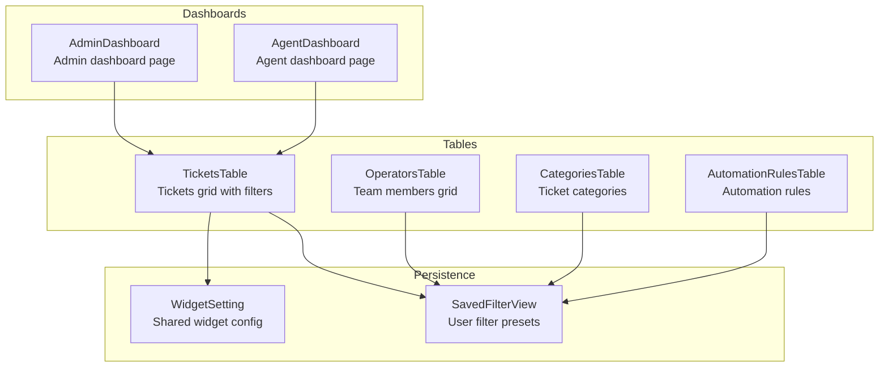
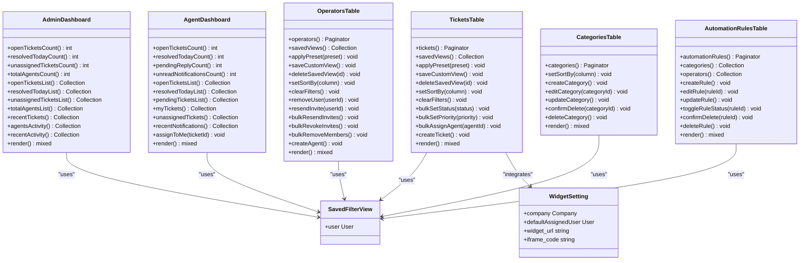
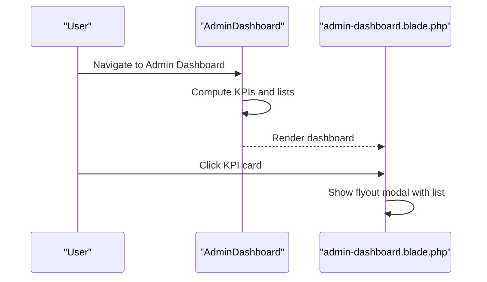
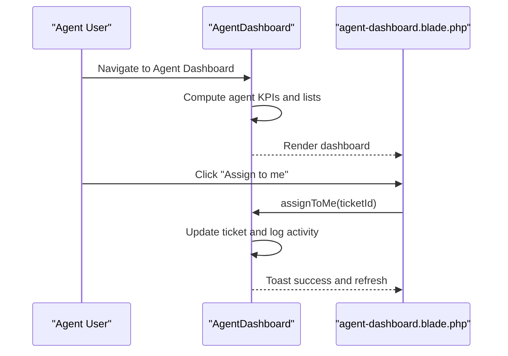
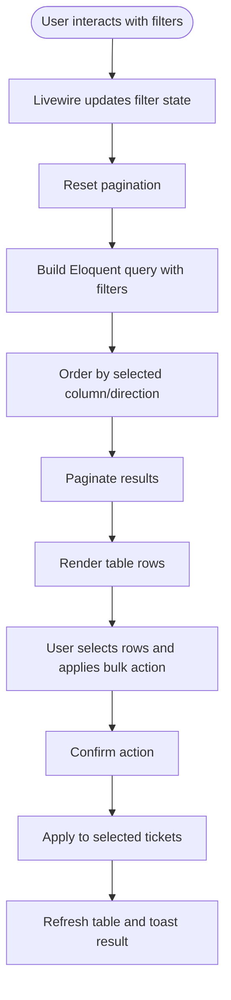
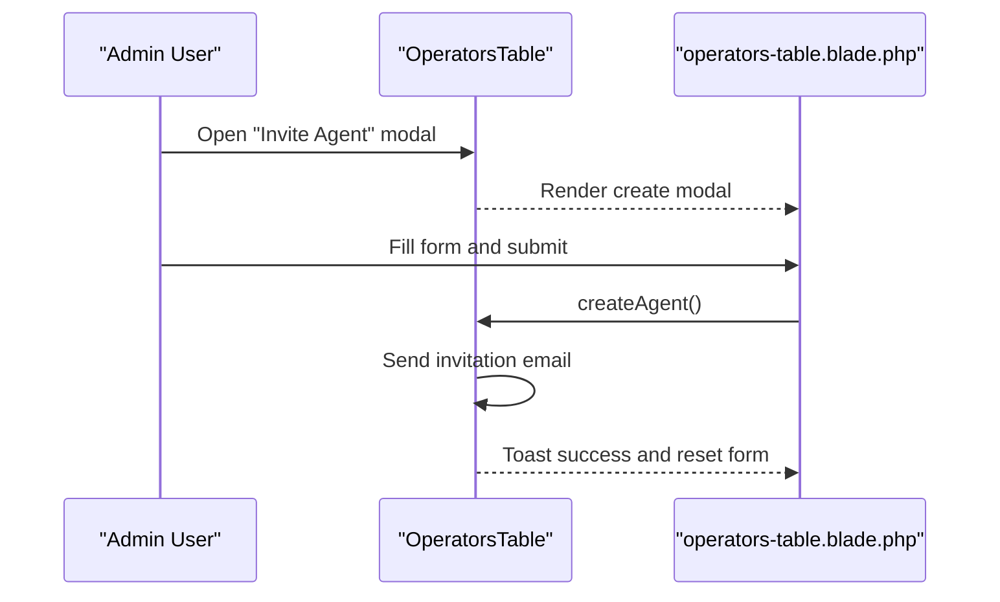
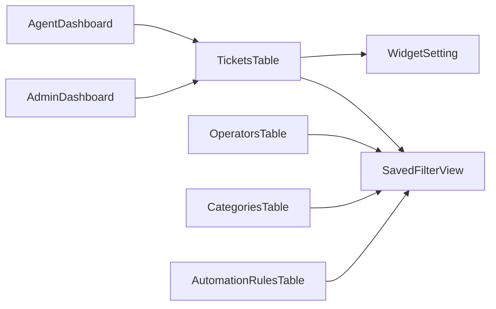

# Dashboard Customization

<cite>
**Referenced Files in This Document**
- [AdminDashboard.php](file://app/Livewire/Dashboard/AdminDashboard.php)
- [AgentDashboard.php](file://app/Livewire/Dashboard/AgentDashboard.php)
- [admin-dashboard.blade.php](file://resources/views/livewire/dashboard/admin-dashboard.blade.php)
- [agent-dashboard.blade.php](file://resources/views/livewire/dashboard/agent-dashboard.blade.php)
- [TicketsTable.php](file://app/Livewire/Dashboard/TicketsTable.php)
- [OperatorsTable.php](file://app/Livewire/Dashboard/OperatorsTable.php)
- [CategoriesTable.php](file://app/Livewire/Dashboard/CategoriesTable.php)
- [AutomationRulesTable.php](file://app/Livewire/Dashboard/AutomationRulesTable.php)
- [tickets-table.blade.php](file://resources/views/livewire/dashboard/tickets-table.blade.php)
- [operators-table.blade.php](file://resources/views/livewire/dashboard/operators-table.blade.php)
- [SavedFilterView.php](file://app/Models/SavedFilterView.php)
- [WidgetSetting.php](file://app/Models/WidgetSetting.php)
</cite>

## Table of Contents
1. [Introduction](#introduction)
2. [Project Structure](#project-structure)
3. [Core Components](#core-components)
4. [Architecture Overview](#architecture-overview)
5. [Detailed Component Analysis](#detailed-component-analysis)
6. [Dependency Analysis](#dependency-analysis)
7. [Performance Considerations](#performance-considerations)
8. [Troubleshooting Guide](#troubleshooting-guide)
9. [Conclusion](#conclusion)

## Introduction
This document explains the flexible dashboard customization and configuration options available in the helpdesk system. It covers:
- Personalized dashboards for Admin and Agent roles
- Table components with robust filtering, sorting, and bulk actions
- Saved filter views for sharing and reusing custom configurations
- Permission-based controls for default views and role-specific templates
- Responsive design and accessibility considerations
- Examples for creating custom layouts, automating report delivery, and configuring role-specific templates

## Project Structure
The dashboard system is built with Laravel Livewire components and Blade views:
- Dashboard pages: Admin and Agent dashboards define KPI cards, lists, and modals
- Table components: Tickets, Operators, Categories, and Automation Rules provide filtering, sorting, pagination, and bulk operations
- Saved filter views: Persist user-defined filters for reuse
- Widget settings: Provide shared configuration for embedded widgets

**Diagram sources**
- [AdminDashboard.php:14-126](file://app/Livewire/Dashboard/AdminDashboard.php#L14-L126)
- [AgentDashboard.php:16-140](file://app/Livewire/Dashboard/AgentDashboard.php#L16-L140)
- [TicketsTable.php:14-522](file://app/Livewire/Dashboard/TicketsTable.php#L14-L522)
- [OperatorsTable.php:11-487](file://app/Livewire/Dashboard/OperatorsTable.php#L11-L487)
- [CategoriesTable.php:12-202](file://app/Livewire/Dashboard/CategoriesTable.php#L12-L202)
- [AutomationRulesTable.php:14-396](file://app/Livewire/Dashboard/AutomationRulesTable.php#L14-L396)
- [SavedFilterView.php:9-31](file://app/Models/SavedFilterView.php#L9-L31)
- [WidgetSetting.php:9-70](file://app/Models/WidgetSetting.php#L9-L70)

**Section sources**
- [AdminDashboard.php:14-126](file://app/Livewire/Dashboard/AdminDashboard.php#L14-L126)
- [AgentDashboard.php:16-140](file://app/Livewire/Dashboard/AgentDashboard.php#L16-L140)
- [TicketsTable.php:14-522](file://app/Livewire/Dashboard/TicketsTable.php#L14-L522)
- [OperatorsTable.php:11-487](file://app/Livewire/Dashboard/OperatorsTable.php#L11-L487)
- [CategoriesTable.php:12-202](file://app/Livewire/Dashboard/CategoriesTable.php#L12-L202)
- [AutomationRulesTable.php:14-396](file://app/Livewire/Dashboard/AutomationRulesTable.php#L14-L396)
- [SavedFilterView.php:9-31](file://app/Models/SavedFilterView.php#L9-L31)
- [WidgetSetting.php:9-70](file://app/Models/WidgetSetting.php#L9-L70)

## Core Components
- AdminDashboard: Aggregates KPIs, recent tickets, agent activity, and recent system activity. Provides flyout modals for drill-down lists.
- AgentDashboard: Presents agent-specific KPIs, personal tickets, unassigned tickets, and recent notifications. Includes self-assignment flow.
- TicketsTable: Central table for tickets with search, date range, status/priority/category filters, sorting, pagination, and bulk actions.
- OperatorsTable: Manages team members with role/status filters, bulk operations, and invitation workflows.
- CategoriesTable: Maintains ticket categories with CRUD and sorting.
- AutomationRulesTable: Defines automation rules with conditions/actions and supports saving rule configurations.
- SavedFilterView: Stores user filter presets as JSON arrays for reuse across tables.
- WidgetSetting: Provides shared configuration for widgets and generates embeddable URLs.

**Section sources**
- [AdminDashboard.php:16-120](file://app/Livewire/Dashboard/AdminDashboard.php#L16-L120)
- [AgentDashboard.php:18-135](file://app/Livewire/Dashboard/AgentDashboard.php#L18-L135)
- [TicketsTable.php:18-317](file://app/Livewire/Dashboard/TicketsTable.php#L18-L317)
- [OperatorsTable.php:15-182](file://app/Livewire/Dashboard/OperatorsTable.php#L15-L182)
- [CategoriesTable.php:16-90](file://app/Livewire/Dashboard/CategoriesTable.php#L16-L90)
- [AutomationRulesTable.php:18-141](file://app/Livewire/Dashboard/AutomationRulesTable.php#L18-L141)
- [SavedFilterView.php:14-25](file://app/Models/SavedFilterView.php#L14-L25)
- [WidgetSetting.php:13-45](file://app/Models/WidgetSetting.php#L13-L45)

## Architecture Overview
The dashboard architecture follows a component-driven pattern:
- Livewire components encapsulate state and server-side logic
- Blade templates render UI and bind Livewire directives
- Eloquent models provide persistence and relationships
- SavedFilterView persists user preferences for reuse
- WidgetSetting centralizes shared widget configuration

**Diagram sources**
- [AdminDashboard.php:16-120](file://app/Livewire/Dashboard/AdminDashboard.php#L16-L120)
- [AgentDashboard.php:18-135](file://app/Livewire/Dashboard/AgentDashboard.php#L18-L135)
- [TicketsTable.php:127-257](file://app/Livewire/Dashboard/TicketsTable.php#L127-L257)
- [OperatorsTable.php:132-182](file://app/Livewire/Dashboard/OperatorsTable.php#L132-L182)
- [CategoriesTable.php:78-90](file://app/Livewire/Dashboard/CategoriesTable.php#L78-L90)
- [AutomationRulesTable.php:120-141](file://app/Livewire/Dashboard/AutomationRulesTable.php#L120-L141)
- [SavedFilterView.php:27-30](file://app/Models/SavedFilterView.php#L27-L30)
- [WidgetSetting.php:37-69](file://app/Models/WidgetSetting.php#L37-L69)

## Detailed Component Analysis

### Admin Dashboard
- Purpose: Executive overview with KPIs, recent tickets, agent workload, and recent activity.
- Features:
  - KPI cards with modal drill-downs
  - Recent tickets table with clickable rows
  - Agent activity bar chart visualization
  - Recent activity timeline
- Personalization: Flyout modals allow focusing on specific subsets (open/resolved/unassigned/all agents).

**Diagram sources**
- [AdminDashboard.php:16-120](file://app/Livewire/Dashboard/AdminDashboard.php#L16-L120)
- [admin-dashboard.blade.php:1-406](file://resources/views/livewire/dashboard/admin-dashboard.blade.php#L1-L406)

**Section sources**
- [AdminDashboard.php:16-120](file://app/Livewire/Dashboard/AdminDashboard.php#L16-L120)
- [admin-dashboard.blade.php:1-406](file://resources/views/livewire/dashboard/admin-dashboard.blade.php#L1-L406)

### Agent Dashboard
- Purpose: Agent-centric workspace highlighting personal workload and pending replies.
- Features:
  - KPIs for open/resolved/pending/unread notifications
  - My tickets list with priority/status badges
  - Unassigned tickets with quick-assign action
  - Recent notifications panel
- Personalization: Self-assignment flow updates agent activity and logs actions.

**Diagram sources**
- [AgentDashboard.php:115-135](file://app/Livewire/Dashboard/AgentDashboard.php#L115-L135)
- [agent-dashboard.blade.php:1-268](file://resources/views/livewire/dashboard/agent-dashboard.blade.php#L1-L268)

**Section sources**
- [AgentDashboard.php:18-135](file://app/Livewire/Dashboard/AgentDashboard.php#L18-L135)
- [agent-dashboard.blade.php:1-268](file://resources/views/livewire/dashboard/agent-dashboard.blade.php#L1-L268)

### Tickets Table
- Purpose: Comprehensive ticket management with advanced filtering and bulk operations.
- Filtering:
  - Text search across subject/customer/description
  - Date range filters
  - Status, priority, category, and assigned-to filters
  - Toggle to show deleted-only tickets
- Sorting: Column-based sort with direction toggles
- Bulk Actions: Set status/priority, assign agents, delete selected
- Saved Views: Apply preset filters or save current view for later reuse
- Pagination: Server-side pagination for large datasets

**Diagram sources**
- [TicketsTable.php:121-317](file://app/Livewire/Dashboard/TicketsTable.php#L121-L317)
- [tickets-table.blade.php:1-800](file://resources/views/livewire/dashboard/tickets-table.blade.php#L1-L800)

**Section sources**
- [TicketsTable.php:18-317](file://app/Livewire/Dashboard/TicketsTable.php#L18-L317)
- [tickets-table.blade.php:1-800](file://resources/views/livewire/dashboard/tickets-table.blade.php#L1-L800)

### Operators Table
- Purpose: Manage team members, roles, specialties, and invitations.
- Filtering:
  - Search by name/email
  - Role filter (admin/operator)
  - Status filter (active/pending invites)
- Sorting: By name
- Bulk Operations: Resend/revoke invites, remove members
- Saved Views: Persist operator-specific filter presets
- Invitation Workflows: Single or bulk invitations with secure signed links

**Diagram sources**
- [OperatorsTable.php:327-350](file://app/Livewire/Dashboard/OperatorsTable.php#L327-L350)
- [operators-table.blade.php:409-545](file://resources/views/livewire/dashboard/operators-table.blade.php#L409-L545)

**Section sources**
- [OperatorsTable.php:15-182](file://app/Livewire/Dashboard/OperatorsTable.php#L15-L182)
- [operators-table.blade.php:1-664](file://resources/views/livewire/dashboard/operators-table.blade.php#L1-L664)

### Categories Table
- Purpose: Maintain ticket categories with color coding and default priorities.
- Features: Create, edit, delete categories; sort by name; validation ensures uniqueness per company.

**Section sources**
- [CategoriesTable.php:16-90](file://app/Livewire/Dashboard/CategoriesTable.php#L16-L90)
- [operators-table.blade.php:1-664](file://resources/views/livewire/dashboard/operators-table.blade.php#L1-L664)

### Automation Rules Table
- Purpose: Define automation rules with conditions and actions; supports saving rule configurations.
- Conditions: Category, priority, keywords, idle hours, status
- Actions: Assign specialists, escalate priority, send email, notify admin
- Persistence: Save/load rule configurations via Livewire forms

**Section sources**
- [AutomationRulesTable.php:18-141](file://app/Livewire/Dashboard/AutomationRulesTable.php#L18-L141)
- [operators-table.blade.php:1-664](file://resources/views/livewire/dashboard/operators-table.blade.php#L1-L664)

### Saved Filter Views
- Purpose: Persist user-defined filters as reusable presets.
- Schema: Stores user_id, name, and filters (JSON array)
- Usage: Apply preset to OperatorsTable, TicketsTable, CategoriesTable, and AutomationRulesTable

**Section sources**
- [SavedFilterView.php:14-25](file://app/Models/SavedFilterView.php#L14-L25)
- [OperatorsTable.php:138-145](file://app/Livewire/Dashboard/OperatorsTable.php#L138-L145)
- [TicketsTable.php:126-130](file://app/Livewire/Dashboard/TicketsTable.php#L126-L130)
- [CategoriesTable.php:78-90](file://app/Livewire/Dashboard/CategoriesTable.php#L78-L90)
- [AutomationRulesTable.php:120-141](file://app/Livewire/Dashboard/AutomationRulesTable.php#L120-L141)

### Widget Settings
- Purpose: Provide shared configuration for widgets and generate embeddable URLs.
- Features: Unique widget keys, company association, default assigned user, iframe code generation

**Section sources**
- [WidgetSetting.php:13-45](file://app/Models/WidgetSetting.php#L13-L45)
- [WidgetSetting.php:47-69](file://app/Models/WidgetSetting.php#L47-L69)

## Dependency Analysis
- Dashboards depend on computed properties to fetch aggregated data efficiently
- Tables depend on SavedFilterView for persisted filters and on Eloquent relationships for joins
- OperatorsTable integrates with invitation workflows and email sending
- WidgetSetting integrates with company scoping and domain configuration

**Diagram sources**
- [AdminDashboard.php:16-120](file://app/Livewire/Dashboard/AdminDashboard.php#L16-L120)
- [AgentDashboard.php:18-135](file://app/Livewire/Dashboard/AgentDashboard.php#L18-L135)
- [TicketsTable.php:126-257](file://app/Livewire/Dashboard/TicketsTable.php#L126-L257)
- [OperatorsTable.php:132-182](file://app/Livewire/Dashboard/OperatorsTable.php#L132-L182)
- [CategoriesTable.php:78-90](file://app/Livewire/Dashboard/CategoriesTable.php#L78-L90)
- [AutomationRulesTable.php:120-141](file://app/Livewire/Dashboard/AutomationRulesTable.php#L120-L141)
- [SavedFilterView.php:27-30](file://app/Models/SavedFilterView.php#L27-L30)
- [WidgetSetting.php:37-69](file://app/Models/WidgetSetting.php#L37-L69)

**Section sources**
- [AdminDashboard.php:16-120](file://app/Livewire/Dashboard/AdminDashboard.php#L16-L120)
- [AgentDashboard.php:18-135](file://app/Livewire/Dashboard/AgentDashboard.php#L18-L135)
- [TicketsTable.php:126-257](file://app/Livewire/Dashboard/TicketsTable.php#L126-L257)
- [OperatorsTable.php:132-182](file://app/Livewire/Dashboard/OperatorsTable.php#L132-L182)
- [CategoriesTable.php:78-90](file://app/Livewire/Dashboard/CategoriesTable.php#L78-L90)
- [AutomationRulesTable.php:120-141](file://app/Livewire/Dashboard/AutomationRulesTable.php#L120-L141)
- [SavedFilterView.php:27-30](file://app/Models/SavedFilterView.php#L27-L30)
- [WidgetSetting.php:37-69](file://app/Models/WidgetSetting.php#L37-L69)

## Performance Considerations
- Efficient queries:
  - Use whereIn and whereDate constraints to limit result sets
  - Apply pagination to avoid loading large datasets
  - Cache categories and agents for admin views
- Rendering optimizations:
  - Limit visible rows per page
  - Use computed properties to memoize expensive queries
  - Debounce live search inputs to reduce server requests
- Data locality:
  - Scope queries by company_id to prevent cross-company data leakage
  - Use with() eager loading to reduce N+1 queries

[No sources needed since this section provides general guidance]

## Troubleshooting Guide
- Filters not applying:
  - Ensure updating* methods trigger pagination resets
  - Verify filter property names match Livewire state
- Bulk actions failing:
  - Confirm selected IDs are present and valid
  - Check authorization for admin-only operations
- Saved views not persisting:
  - Validate filter serialization and user ownership
  - Confirm database permissions for SavedFilterView
- Invitation issues:
  - Verify signed route generation and email delivery
  - Check for duplicate emails and existing user conflicts

**Section sources**
- [TicketsTable.php:132-171](file://app/Livewire/Dashboard/TicketsTable.php#L132-L171)
- [OperatorsTable.php:197-204](file://app/Livewire/Dashboard/OperatorsTable.php#L197-L204)
- [SavedFilterView.php:14-25](file://app/Models/SavedFilterView.php#L14-L25)

## Conclusion
The dashboard customization system offers a flexible, permission-aware foundation for personalizing workspaces. Users can tailor dashboards with saved filter views, manage teams and categories, automate workflows, and integrate shared widgets. The architecture balances responsiveness with scalability, enabling efficient navigation and operation across large datasets.