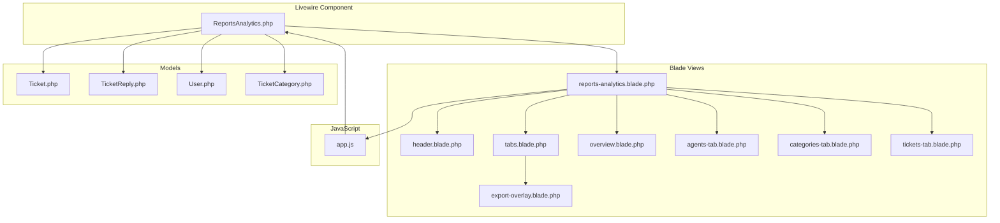
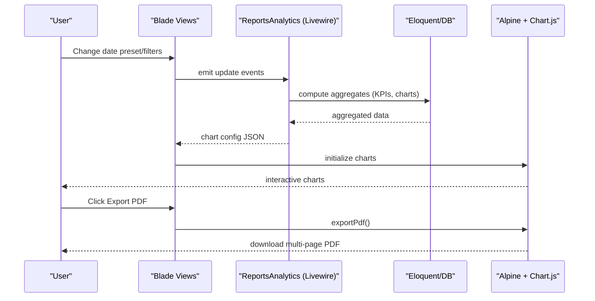
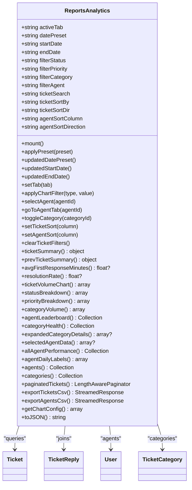
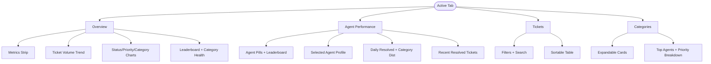
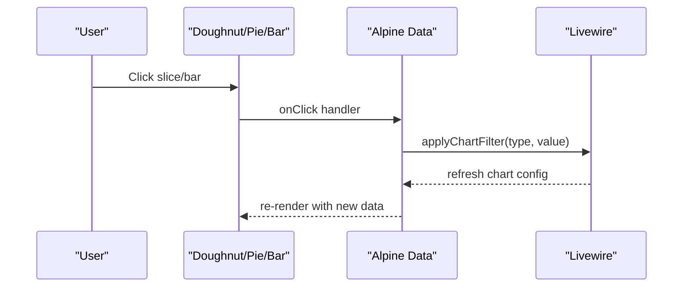
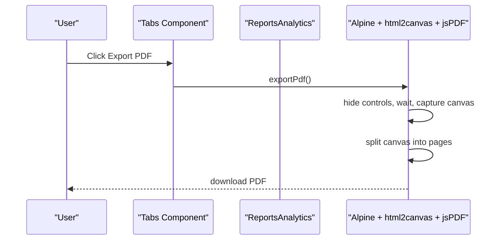
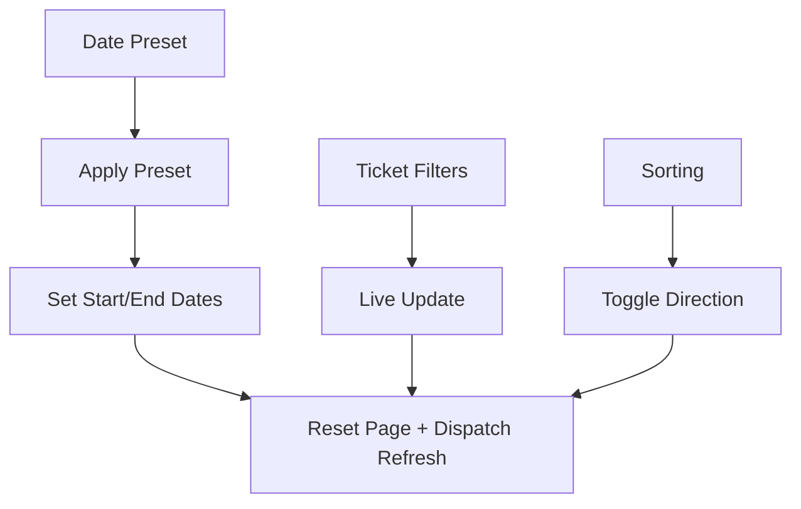
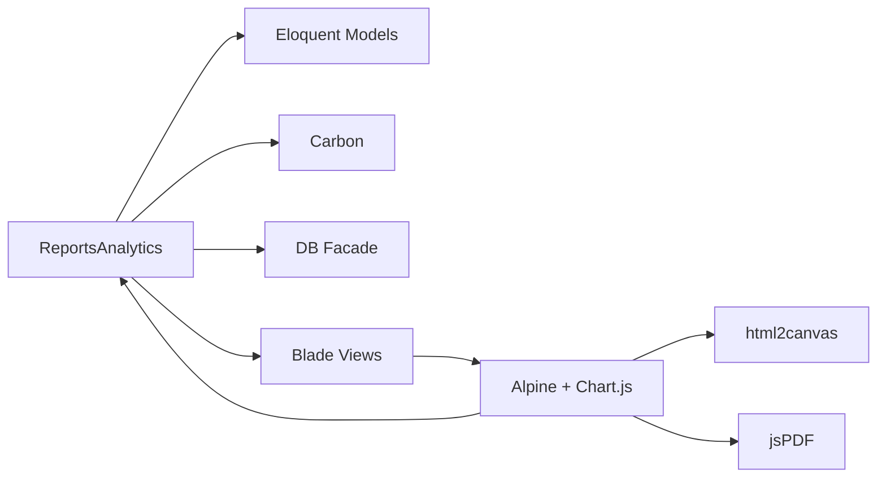

# Reports & Analytics

<cite>
**Referenced Files in This Document**
- [ReportsAnalytics.php](file://app/Livewire/Dashboard/ReportsAnalytics.php)
- [reports-analytics.blade.php](file://resources/views/livewire/dashboard/reports-analytics.blade.php)
- [header.blade.php](file://resources/views/components/dashboard/reports/header.blade.php)
- [tabs.blade.php](file://resources/views/components/dashboard/reports/tabs.blade.php)
- [export-overlay.blade.php](file://resources/views/components/dashboard/reports/export-overlay.blade.php)
- [overview.blade.php](file://resources/views/livewire/dashboard/reports/overview.blade.php)
- [agents-tab.blade.php](file://resources/views/livewire/dashboard/reports/agents-tab.blade.php)
- [categories-tab.blade.php](file://resources/views/livewire/dashboard/reports/categories-tab.blade.php)
- [tickets-tab.blade.php](file://resources/views/livewire/dashboard/reports/tickets-tab.blade.php)
- [app.js](file://resources/js/app.js)
- [Ticket.php](file://app/Models/Ticket.php)
- [TicketReply.php](file://app/Models/TicketReply.php)
- [User.php](file://app/Models/User.php)
- [TicketCategory.php](file://app/Models/TicketCategory.php)
</cite>

## Table of Contents
1. [Introduction](#introduction)
2. [Project Structure](#project-structure)
3. [Core Components](#core-components)
4. [Architecture Overview](#architecture-overview)
5. [Detailed Component Analysis](#detailed-component-analysis)
6. [Dependency Analysis](#dependency-analysis)
7. [Performance Considerations](#performance-considerations)
8. [Troubleshooting Guide](#troubleshooting-guide)
9. [Conclusion](#conclusion)

## Introduction
This document explains the comprehensive reporting and analytics system powering business intelligence and performance insights across the helpdesk. It covers the multi-tab interface (Overview, Agent Performance, Tickets, Categories), interactive charts and graphs, export capabilities (CSV and PDF), customizable filters, and backend query optimizations for large datasets.

## Project Structure
The reporting module is implemented as a Livewire component with Blade templates and Alpine.js-driven charts. The backend aggregates metrics via Eloquent and raw SQL, and the frontend renders interactive charts and supports PDF export.

**Diagram sources**
- [ReportsAnalytics.php:1-1015](file://app/Livewire/Dashboard/ReportsAnalytics.php#L1-L1015)
- [reports-analytics.blade.php:1-32](file://resources/views/livewire/dashboard/reports-analytics.blade.php#L1-L32)
- [header.blade.php:1-24](file://resources/views/components/dashboard/reports/header.blade.php#L1-L24)
- [tabs.blade.php:1-38](file://resources/views/components/dashboard/reports/tabs.blade.php#L1-L38)
- [export-overlay.blade.php:1-15](file://resources/views/components/dashboard/reports/export-overlay.blade.php#L1-L15)
- [overview.blade.php:1-151](file://resources/views/livewire/dashboard/reports/overview.blade.php#L1-L151)
- [agents-tab.blade.php:1-178](file://resources/views/livewire/dashboard/reports/agents-tab.blade.php#L1-L178)
- [categories-tab.blade.php:1-96](file://resources/views/livewire/dashboard/reports/categories-tab.blade.php#L1-L96)
- [tickets-tab.blade.php:1-103](file://resources/views/livewire/dashboard/reports/tickets-tab.blade.php#L1-L103)
- [app.js:1-310](file://resources/js/app.js#L1-L310)

**Section sources**
- [ReportsAnalytics.php:1-1015](file://app/Livewire/Dashboard/ReportsAnalytics.php#L1-L1015)
- [reports-analytics.blade.php:1-32](file://resources/views/livewire/dashboard/reports-analytics.blade.php#L1-L32)

## Core Components
- ReportsAnalytics (Livewire Component)
  - Manages active tab, date range presets, and filters.
  - Computes KPIs, charts, leaderboards, and paginated tickets.
  - Provides CSV export for tickets and agents.
  - Exposes JSON for chart configuration to the frontend.
- Blade Templates
  - Header: date range selector and preset toggles.
  - Tabs: navigation and export actions (CSV/PDF).
  - Tab views: Overview, Agent Performance, Tickets, Categories.
  - Export overlay: visual feedback during PDF generation.
- JavaScript (Alpine + Chart.js + html2canvas + jsPDF)
  - Initializes and refreshes charts based on component state.
  - Generates PDFs by capturing rendered DOM and stitching pages.

**Section sources**
- [ReportsAnalytics.php:21-176](file://app/Livewire/Dashboard/ReportsAnalytics.php#L21-L176)
- [header.blade.php:1-24](file://resources/views/components/dashboard/reports/header.blade.php#L1-L24)
- [tabs.blade.php:1-38](file://resources/views/components/dashboard/reports/tabs.blade.php#L1-L38)
- [overview.blade.php:1-151](file://resources/views/livewire/dashboard/reports/overview.blade.php#L1-L151)
- [agents-tab.blade.php:1-178](file://resources/views/livewire/dashboard/reports/agents-tab.blade.php#L1-L178)
- [categories-tab.blade.php:1-96](file://resources/views/livewire/dashboard/reports/categories-tab.blade.php#L1-L96)
- [tickets-tab.blade.php:1-103](file://resources/views/livewire/dashboard/reports/tickets-tab.blade.php#L1-L103)
- [export-overlay.blade.php:1-15](file://resources/views/components/dashboard/reports/export-overlay.blade.php#L1-L15)
- [app.js:21-231](file://resources/js/app.js#L21-L231)

## Architecture Overview
The system follows a reactive Livewire architecture:
- UI emits Livewire actions (filters, tab changes, exports).
- Backend computes aggregated metrics and returns chart configs.
- Frontend initializes Chart.js instances and handles PDF export via html2canvas and jsPDF.

**Diagram sources**
- [ReportsAnalytics.php:120-123](file://app/Livewire/Dashboard/ReportsAnalytics.php#L120-L123)
- [app.js:167-230](file://resources/js/app.js#L167-L230)

## Detailed Component Analysis

### ReportsAnalytics (Livewire Component)
Responsibilities:
- State management: active tab, date presets, URL-backed filters, sorting.
- Base queries scoped to company and date range.
- Computed metrics: totals, resolved/open counts, resolution rates, first response minutes.
- Chart data: ticket volume trend, status/priority/category breakdowns.
- Agent performance: leaderboards, daily resolved, category distribution, recent resolved.
- Category health: resolution rates, sparklines, top agents, priority breakdowns.
- Tickets table: searchable, filterable, sortable, paginated.
- Export: streamed CSV for tickets and agents; PDF via frontend capture.

Key implementation patterns:
- Memoization for previous period dates to avoid repeated computations.
- Subqueries for first reply timestamps to compute response/resolution minutes efficiently.
- SQL-based aggregation for averages and counts to minimize PHP iteration.
- Streaming CSV export with chunked processing to handle large datasets.

**Diagram sources**
- [ReportsAnalytics.php:21-1015](file://app/Livewire/Dashboard/ReportsAnalytics.php#L21-L1015)
- [Ticket.php](file://app/Models/Ticket.php)
- [TicketReply.php](file://app/Models/TicketReply.php)
- [User.php](file://app/Models/User.php)
- [TicketCategory.php](file://app/Models/TicketCategory.php)

**Section sources**
- [ReportsAnalytics.php:67-123](file://app/Livewire/Dashboard/ReportsAnalytics.php#L67-L123)
- [ReportsAnalytics.php:277-380](file://app/Livewire/Dashboard/ReportsAnalytics.php#L277-L380)
- [ReportsAnalytics.php:383-482](file://app/Livewire/Dashboard/ReportsAnalytics.php#L383-L482)
- [ReportsAnalytics.php:489-574](file://app/Livewire/Dashboard/ReportsAnalytics.php#L489-L574)
- [ReportsAnalytics.php:577-721](file://app/Livewire/Dashboard/ReportsAnalytics.php#L577-L721)
- [ReportsAnalytics.php:724-807](file://app/Livewire/Dashboard/ReportsAnalytics.php#L724-L807)
- [ReportsAnalytics.php:840-868](file://app/Livewire/Dashboard/ReportsAnalytics.php#L840-L868)
- [ReportsAnalytics.php:875-946](file://app/Livewire/Dashboard/ReportsAnalytics.php#L875-L946)
- [ReportsAnalytics.php:948-973](file://app/Livewire/Dashboard/ReportsAnalytics.php#L948-L973)
- [ReportsAnalytics.php:975-1007](file://app/Livewire/Dashboard/ReportsAnalytics.php#L975-L1007)

### Multi-Tab Reporting Interface
- Overview
  - Metrics strip: total tickets, resolved, open, average first response, resolution rate.
  - Ticket volume trend (line chart).
  - Status, priority, and category volume distributions (pie/bar).
  - Agent leaderboard and category health cards.
- Agent Performance
  - Agent pills and leaderboard; selected agent profile with stats.
  - Daily resolved chart and category distribution bar chart.
  - Recent resolved tickets table.
- Tickets
  - Filters: status, priority, category, agent assignment, search.
  - Sortable table with badges for priority/status.
- Categories
  - Expandable category cards with resolution rate, sparkline, top agents, and priority breakdown.

**Diagram sources**
- [overview.blade.php:1-151](file://resources/views/livewire/dashboard/reports/overview.blade.php#L1-L151)
- [agents-tab.blade.php:1-178](file://resources/views/livewire/dashboard/reports/agents-tab.blade.php#L1-L178)
- [tickets-tab.blade.php:1-103](file://resources/views/livewire/dashboard/reports/tickets-tab.blade.php#L1-L103)
- [categories-tab.blade.php:1-96](file://resources/views/livewire/dashboard/reports/categories-tab.blade.php#L1-L96)

**Section sources**
- [overview.blade.php:1-151](file://resources/views/livewire/dashboard/reports/overview.blade.php#L1-L151)
- [agents-tab.blade.php:1-178](file://resources/views/livewire/dashboard/reports/agents-tab.blade.php#L1-L178)
- [tickets-tab.blade.php:1-103](file://resources/views/livewire/dashboard/reports/tickets-tab.blade.php#L1-L103)
- [categories-tab.blade.php:1-96](file://resources/views/livewire/dashboard/reports/categories-tab.blade.php#L1-L96)

### Interactive Charts and Graphs
- Overview charts
  - Ticket volume: line chart with created/resolved series.
  - Status distribution: doughnut chart clickable to filter by status.
  - Priority distribution: horizontal bar chart clickable to filter by priority.
  - Category volume: horizontal bar chart clickable to filter by category.
- Agent charts
  - Selected agent daily resolved: line chart.
  - Selected agent category distribution: horizontal bar chart.
- Chart interactions
  - Clicking a pie segment or bar triggers a Livewire filter application and resets pagination.

**Diagram sources**
- [app.js:108-137](file://resources/js/app.js#L108-L137)
- [app.js:147-161](file://resources/js/app.js#L147-L161)
- [ReportsAnalytics.php:131-140](file://app/Livewire/Dashboard/ReportsAnalytics.php#L131-L140)

**Section sources**
- [app.js:77-164](file://resources/js/app.js#L77-L164)
- [overview.blade.php:58-94](file://resources/views/livewire/dashboard/reports/overview.blade.php#L58-L94)
- [agents-tab.blade.php:52-65](file://resources/views/livewire/dashboard/reports/agents-tab.blade.php#L52-L65)

### Export Functionality
- CSV Export
  - Tickets CSV: streamed export with first response and resolution minutes computed per row.
  - Agents CSV: streamed export of performance metrics.
- PDF Export
  - Frontend captures the rendered reports page using html2canvas and splits into pages with jsPDF.
  - Includes visual overlay feedback and preserves date range and active tab in filename.

**Diagram sources**
- [tabs.blade.php:30-34](file://resources/views/components/dashboard/reports/tabs.blade.php#L30-L34)
- [app.js:167-230](file://resources/js/app.js#L167-L230)
- [ReportsAnalytics.php:875-946](file://app/Livewire/Dashboard/ReportsAnalytics.php#L875-L946)
- [ReportsAnalytics.php:948-973](file://app/Livewire/Dashboard/ReportsAnalytics.php#L948-L973)

**Section sources**
- [tabs.blade.php:14-29](file://resources/views/components/dashboard/reports/tabs.blade.php#L14-L29)
- [app.js:167-230](file://resources/js/app.js#L167-L230)
- [ReportsAnalytics.php:875-946](file://app/Livewire/Dashboard/ReportsAnalytics.php#L875-L946)
- [ReportsAnalytics.php:948-973](file://app/Livewire/Dashboard/ReportsAnalytics.php#L948-L973)

### Customizable Report Filters
- Date Range
  - Presets: Today, This Week, This Month, Last 3 Months, Custom.
  - Custom mode enables start/end date pickers.
- Ticket Filters
  - Status, Priority, Category, Agent Assignment, Search by subject/customer.
- Sorting
  - Tickets: sort by any column; toggles asc/desc.
  - Agents: sort by assigned/resolved/avg response/avg resolution/resolution rate.
- URL-backed state
  - Filters persist in the URL for sharing and bookmarking.

**Diagram sources**
- [ReportsAnalytics.php:72-123](file://app/Livewire/Dashboard/ReportsAnalytics.php#L72-L123)
- [ReportsAnalytics.php:158-176](file://app/Livewire/Dashboard/ReportsAnalytics.php#L158-L176)
- [tickets-tab.blade.php:12-40](file://resources/views/livewire/dashboard/reports/tickets-tab.blade.php#L12-L40)
- [header.blade.php:9-21](file://resources/views/components/dashboard/reports/header.blade.php#L9-L21)

**Section sources**
- [ReportsAnalytics.php:25-57](file://app/Livewire/Dashboard/ReportsAnalytics.php#L25-L57)
- [ReportsAnalytics.php:72-123](file://app/Livewire/Dashboard/ReportsAnalytics.php#L72-L123)
- [tickets-tab.blade.php:12-40](file://resources/views/livewire/dashboard/reports/tickets-tab.blade.php#L12-L40)
- [header.blade.php:9-21](file://resources/views/components/dashboard/reports/header.blade.php#L9-L21)

### Creating Custom Reports and Interpreting Insights
- Creating a custom report
  - Select a date range (preset or custom).
  - Apply filters (status, priority, category, agent).
  - Navigate to the desired tab (Overview, Agent Performance, Tickets, Categories).
  - Export CSV for deep analysis or PDF for sharing.
- Interpreting analytics
  - Overview: compare created vs resolved trends, identify priority spikes, and monitor resolution rate changes.
  - Agent Performance: assess response and resolution times, top performers, and category specializations.
  - Tickets: drill down into unresolved tickets, filter by priority, and track resolution durations.
  - Categories: monitor category health, recent trends, and top contributing agents.

[No sources needed since this section provides general guidance]

## Dependency Analysis
- Livewire component depends on:
  - Eloquent models for tickets, replies, users, and categories.
  - Carbon for date calculations and memoization.
  - DB facade for optimized SQL aggregations.
- Frontend depends on:
  - Chart.js for rendering.
  - html2canvas and jsPDF for PDF export.
  - Alpine.js for reactive state and lifecycle hooks.

**Diagram sources**
- [ReportsAnalytics.php:5-18](file://app/Livewire/Dashboard/ReportsAnalytics.php#L5-L18)
- [app.js:5-8](file://resources/js/app.js#L5-L8)

**Section sources**
- [ReportsAnalytics.php:5-18](file://app/Livewire/Dashboard/ReportsAnalytics.php#L5-L18)
- [app.js:5-8](file://resources/js/app.js#L5-L8)

## Performance Considerations
- Aggregation efficiency
  - Single-query aggregates for totals/resolved/open counts.
  - Subqueries for first reply timestamps to compute response/resolution minutes server-side.
  - SQL-based averages to avoid loading large result sets into memory.
- Pagination and streaming
  - Paginated tickets table for fast rendering.
  - Chunked CSV export with streaming to handle large datasets without memory spikes.
- Memoization
  - Previous period date calculation memoized per request to avoid recomputation.
- Frontend responsiveness
  - Debounced live updates for search and filter inputs.
  - Chart refresh lifecycle coordinated via custom events.

**Section sources**
- [ReportsAnalytics.php:277-302](file://app/Livewire/Dashboard/ReportsAnalytics.php#L277-L302)
- [ReportsAnalytics.php:261-267](file://app/Livewire/Dashboard/ReportsAnalytics.php#L261-L267)
- [ReportsAnalytics.php:346-358](file://app/Livewire/Dashboard/ReportsAnalytics.php#L346-L358)
- [ReportsAnalytics.php:875-946](file://app/Livewire/Dashboard/ReportsAnalytics.php#L875-L946)
- [ReportsAnalytics.php:232-246](file://app/Livewire/Dashboard/ReportsAnalytics.php#L232-L246)
- [tickets-tab.blade.php:8](file://resources/views/livewire/dashboard/reports/tickets-tab.blade.php#L8)

## Troubleshooting Guide
- Charts not rendering
  - Ensure Chart.js is loaded and the container elements exist.
  - Verify the component dispatches refresh events on filter changes.
- PDF export fails
  - Confirm html2canvas and jsPDF are imported.
  - Check browser console for errors; ensure the target element is visible and styled appropriately.
- Large CSV export timeouts
  - Use chunked streaming; verify server timeout settings and memory limits.
- Filters not applying
  - Confirm URL-backed filter properties are set and pagination is reset after changes.

**Section sources**
- [app.js:167-230](file://resources/js/app.js#L167-L230)
- [ReportsAnalytics.php:120-123](file://app/Livewire/Dashboard/ReportsAnalytics.php#L120-L123)
- [tickets-tab.blade.php:8](file://resources/views/livewire/dashboard/reports/tickets-tab.blade.php#L8)

## Conclusion
The reporting and analytics system delivers a comprehensive, interactive, and performant solution for helpdesk insights. Its Livewire-driven architecture, efficient backend aggregations, and frontend charting stack enable users to explore trends, evaluate agent performance, and export actionable data in multiple formats.