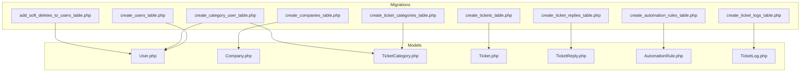
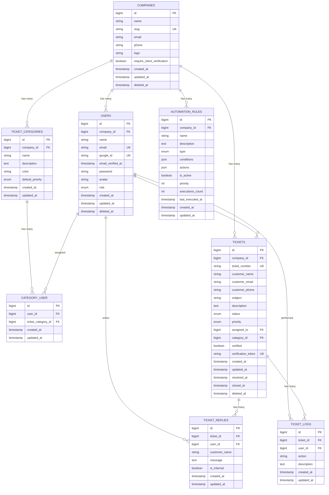
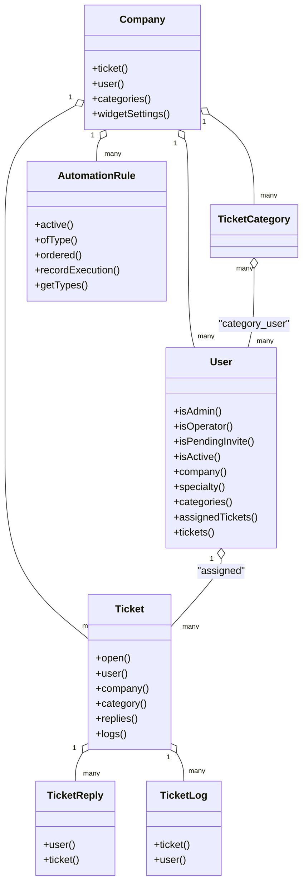

# Database Schema & Models

<cite>
**Referenced Files in This Document**
- [create_users_table.php](file://database/migrations/0001_01_01_000000_create_users_table.php)
- [create_companies_table.php](file://database/migrations/2026_02_01_224200_create_companies_table.php)
- [create_ticket_categories_table.php](file://database/migrations/2026_02_01_224218_create_ticket_categories_table.php)
- [create_tickets_table.php](file://database/migrations/2026_02_01_224222_create_tickets_table.php)
- [create_ticket_replies_table.php](file://database/migrations/2026_02_01_224225_create_ticket_replies_table.php)
- [create_automation_rules_table.php](file://database/migrations/2026_03_09_104729_create_automation_rules_table.php)
- [create_ticket_logs_table.php](file://database/migrations/2026_03_10_230354_create_ticket_logs_table.php)
- [create_category_user_table.php](file://database/migrations/2026_03_14_073653_create_category_user_table.php)
- [add_soft_deletes_to_users_table.php](file://database/migrations/2026_03_08_182155_add_soft_deletes_to_users_table.php)
- [Company.php](file://app/Models/Company.php)
- [User.php](file://app/Models/User.php)
- [Ticket.php](file://app/Models/Ticket.php)
- [TicketCategory.php](file://app/Models/TicketCategory.php)
- [TicketReply.php](file://app/Models/TicketReply.php)
- [AutomationRule.php](file://app/Models/AutomationRule.php)
- [TicketLog.php](file://app/Models/TicketLog.php)
</cite>

## Table of Contents
1. [Introduction](#introduction)
2. [Project Structure](#project-structure)
3. [Core Components](#core-components)
4. [Architecture Overview](#architecture-overview)
5. [Detailed Component Analysis](#detailed-component-analysis)
6. [Dependency Analysis](#dependency-analysis)
7. [Performance Considerations](#performance-considerations)
8. [Troubleshooting Guide](#troubleshooting-guide)
9. [Conclusion](#conclusion)
10. [Appendices](#appendices)

## Introduction
This document provides comprehensive data model documentation for the Helpdesk System database schema. It details entity relationships among Companies, Users, Tickets, Categories, Replies, and Automation Rules, along with primary and foreign keys, indexes, and constraints. It also explains ticket lifecycle tables (status tracking, priority management, and assignment history), the user role system with company associations and permission inheritance, and the automation rule storage format and serialization of complex rule conditions. Finally, it covers migration strategies, data seeding approaches, schema evolution patterns, data integrity constraints, soft deletes for audit trails, and performance optimization via proper indexing.

## Project Structure
The database schema is defined through Laravel migrations and represented in Eloquent models. Migrations define tables, columns, indexes, and constraints. Models encapsulate relationships, scopes, and attribute casting.

**Diagram sources**
- [create_users_table.php:1-59](file://database/migrations/0001_01_01_000000_create_users_table.php#L1-L59)
- [create_companies_table.php:1-41](file://database/migrations/2026_02_01_224200_create_companies_table.php#L1-L41)
- [create_ticket_categories_table.php:1-33](file://database/migrations/2026_02_01_224218_create_ticket_categories_table.php#L1-L33)
- [create_tickets_table.php:1-62](file://database/migrations/2026_02_01_224222_create_tickets_table.php#L1-L62)
- [create_ticket_replies_table.php:1-35](file://database/migrations/2026_02_01_224225_create_ticket_replies_table.php#L1-L35)
- [create_automation_rules_table.php:1-53](file://database/migrations/2026_03_09_104729_create_automation_rules_table.php#L1-L53)
- [create_ticket_logs_table.php:1-32](file://database/migrations/2026_03_10_230354_create_ticket_logs_table.php#L1-L32)
- [create_category_user_table.php:1-32](file://database/migrations/2026_03_14_073653_create_category_user_table.php#L1-L32)
- [add_soft_deletes_to_users_table.php:1-29](file://database/migrations/2026_03_08_182155_add_soft_deletes_to_users_table.php#L1-L29)
- [User.php:1-137](file://app/Models/User.php#L1-L137)
- [Company.php:1-47](file://app/Models/Company.php#L1-L47)
- [TicketCategory.php:1-14](file://app/Models/TicketCategory.php#L1-L14)
- [Ticket.php:1-64](file://app/Models/Ticket.php#L1-L64)
- [TicketReply.php:1-39](file://app/Models/TicketReply.php#L1-L39)
- [AutomationRule.php:1-117](file://app/Models/AutomationRule.php#L1-L117)
- [TicketLog.php:1-26](file://app/Models/TicketLog.php#L1-L26)

**Section sources**
- [create_users_table.php:1-59](file://database/migrations/0001_01_01_000000_create_users_table.php#L1-L59)
- [create_companies_table.php:1-41](file://database/migrations/2026_02_01_224200_create_companies_table.php#L1-L41)
- [create_ticket_categories_table.php:1-33](file://database/migrations/2026_02_01_224218_create_ticket_categories_table.php#L1-L33)
- [create_tickets_table.php:1-62](file://database/migrations/2026_02_01_224222_create_tickets_table.php#L1-L62)
- [create_ticket_replies_table.php:1-35](file://database/migrations/2026_02_01_224225_create_ticket_replies_table.php#L1-L35)
- [create_automation_rules_table.php:1-53](file://database/migrations/2026_03_09_104729_create_automation_rules_table.php#L1-L53)
- [create_ticket_logs_table.php:1-32](file://database/migrations/2026_03_10_230354_create_ticket_logs_table.php#L1-L32)
- [create_category_user_table.php:1-32](file://database/migrations/2026_03_14_073653_create_category_user_table.php#L1-L32)
- [add_soft_deletes_to_users_table.php:1-29](file://database/migrations/2026_03_08_182155_add_soft_deletes_to_users_table.php#L1-L29)

## Core Components
This section outlines the core entities and their relationships, focusing on primary and foreign keys, indexes, and constraints.

- Companies
  - Primary key: id
  - Attributes: name, slug (unique), email, phone, logo, require_client_verification, timestamps, soft deletes
  - Indexes: slug, email, created_at; composite index on (require_client_verification, created_at)
  - Constraints: unique(slug), unique(email), soft deletes enabled
  - Relationships: one-to-many with Users and Tickets; one-to-one with WidgetSetting

- Users
  - Primary key: id
  - Foreign key: company_id → companies.id (ON DELETE CASCADE)
  - Attributes: name, email (unique), email_verified_at, password (nullable), google_id (unique), avatar, role, rememberToken, timestamps, soft deletes
  - Indexes: company_id, email, google_id
  - Constraints: unique(email), unique(google_id), soft deletes enabled
  - Relationships: belongs-to Company; belongs-to-many TicketCategory via category_user; has-many AssignedTickets; has-many Tickets via assigned_to

- Ticket Categories
  - Primary key: id
  - Foreign key: company_id → companies.id (ON DELETE CASCADE)
  - Attributes: name, description, color, default_priority (enum), timestamps
  - Indexes: company_id
  - Constraints: unique(company_id, name)
  - Relationships: belongs-to Company; belongs-to-many Users via category_user

- Tickets
  - Primary key: id
  - Foreign keys: company_id → companies.id (ON DELETE CASCADE), assigned_to → users.id (ON DELETE SET NULL), category_id → ticket_categories.id (ON DELETE SET NULL)
  - Attributes: ticket_number (unique), customer_name, customer_email, customer_phone, subject, description, status (enum), priority (enum), verified, verification_token (unique), timestamps, resolved_at, closed_at, soft deletes
  - Indexes: company_id, ticket_number, customer_email, status, priority, assigned_to, verified, created_at
  - Constraints: unique(ticket_number), unique(verification_token), soft deletes enabled
  - Relationships: belongs-to Company, User (assigned_to), TicketCategory; has-many Replies; has-many Logs

- Ticket Replies
  - Primary key: id
  - Foreign keys: ticket_id → tickets.id (ON DELETE CASCADE), user_id → users.id (ON DELETE SET NULL)
  - Attributes: message, is_internal, timestamps
  - Indexes: ticket_id, user_id, created_at
  - Relationships: belongs-to Ticket; belongs-to User

- Automation Rules
  - Primary key: id
  - Foreign key: company_id → companies.id (ON DELETE CASCADE)
  - Attributes: name, description, type (enum), conditions (JSON), actions (JSON), is_active, priority, executions_count, last_executed_at, timestamps
  - Indexes: (company_id, is_active, type), (company_id, priority)
  - Relationships: belongs-to Company

- Ticket Logs
  - Primary key: id
  - Foreign keys: ticket_id → tickets.id (CASCADE ON DELETE), user_id → users.id (NULL ON DELETE)
  - Attributes: action, description, timestamps
  - Relationships: belongs-to Ticket; belongs-to User

- Category-User Association (pivot)
  - Primary key: id
  - Foreign keys: user_id → users.id (ON DELETE CASCADE), ticket_category_id → ticket_categories.id (ON DELETE CASCADE)
  - Attributes: timestamps
  - Constraints: unique(user_id, ticket_category_id)

**Section sources**
- [create_companies_table.php:14-30](file://database/migrations/2026_02_01_224200_create_companies_table.php#L14-L30)
- [create_users_table.php:14-31](file://database/migrations/0001_01_01_000000_create_users_table.php#L14-L31)
- [create_ticket_categories_table.php:11-25](file://database/migrations/2026_02_01_224218_create_ticket_categories_table.php#L11-L25)
- [create_tickets_table.php:11-54](file://database/migrations/2026_02_01_224222_create_tickets_table.php#L11-L54)
- [create_ticket_replies_table.php:11-27](file://database/migrations/2026_02_01_224225_create_ticket_replies_table.php#L11-L27)
- [create_automation_rules_table.php:14-42](file://database/migrations/2026_03_09_104729_create_automation_rules_table.php#L14-L42)
- [create_ticket_logs_table.php:14-21](file://database/migrations/2026_03_10_230354_create_ticket_logs_table.php#L14-L21)
- [create_category_user_table.php:14-21](file://database/migrations/2026_03_14_073653_create_category_user_table.php#L14-L21)
- [add_soft_deletes_to_users_table.php:14-16](file://database/migrations/2026_03_08_182155_add_soft_deletes_to_users_table.php#L14-L16)

## Architecture Overview
The Helpdesk System follows a multi-tenant architecture centered around Companies. Users belong to a Company and operate with roles (admin/operator). Tickets are associated with a Company, optionally categorized, assigned to Users, and tracked via Replies and Logs. Automation Rules apply per Company and store conditions/actions as JSON for flexible rule evaluation.

**Diagram sources**
- [create_companies_table.php:14-30](file://database/migrations/2026_02_01_224200_create_companies_table.php#L14-L30)
- [create_users_table.php:14-31](file://database/migrations/0001_01_01_000000_create_users_table.php#L14-L31)
- [create_ticket_categories_table.php:11-25](file://database/migrations/2026_02_01_224218_create_ticket_categories_table.php#L11-L25)
- [create_category_user_table.php:14-21](file://database/migrations/2026_03_14_073653_create_category_user_table.php#L14-L21)
- [create_tickets_table.php:11-54](file://database/migrations/2026_02_01_224222_create_tickets_table.php#L11-L54)
- [create_ticket_replies_table.php:11-27](file://database/migrations/2026_02_01_224225_create_ticket_replies_table.php#L11-L27)
- [create_automation_rules_table.php:14-42](file://database/migrations/2026_03_09_104729_create_automation_rules_table.php#L14-L42)
- [create_ticket_logs_table.php:14-21](file://database/migrations/2026_03_10_230354_create_ticket_logs_table.php#L14-L21)

## Detailed Component Analysis

### Companies
- Purpose: Multi-tenant container for Users, Tickets, Categories, and Automation Rules.
- Keys and constraints: unique(slug), unique(email), soft deletes; indexes on slug, email, created_at, and (require_client_verification, created_at).
- Relationships: one-to-many with Users and Tickets; one-to-one with WidgetSetting via model.

**Section sources**
- [create_companies_table.php:14-30](file://database/migrations/2026_02_01_224200_create_companies_table.php#L14-L30)
- [Company.php:19-37](file://app/Models/Company.php#L19-L37)

### Users
- Roles: admin and operator; used for permission inheritance and scoping.
- Company association: belongs-to Company; supports soft deletes.
- Specialties: belongs-to TicketCategory via specialty_id; belongs-to-many TicketCategory via category_user.
- Scopes: available, withSpecialty, operators; helpers: isAdmin, isOperator, isPendingInvite, isActive.
- Indexes: company_id, email, google_id; soft deletes enabled.

**Section sources**
- [create_users_table.php:14-31](file://database/migrations/0001_01_01_000000_create_users_table.php#L14-L31)
- [add_soft_deletes_to_users_table.php:14-16](file://database/migrations/2026_03_08_182155_add_soft_deletes_to_users_table.php#L14-L16)
- [User.php:74-121](file://app/Models/User.php#L74-L121)

### Ticket Categories
- Purpose: classify Tickets and define default priority.
- Uniqueness: (company_id, name) ensures unique category names per company.
- Indexes: company_id.

**Section sources**
- [create_ticket_categories_table.php:11-25](file://database/migrations/2026_02_01_224218_create_ticket_categories_table.php#L11-L25)
- [TicketCategory.php:12-12](file://app/Models/TicketCategory.php#L12-L12)

### Tickets
- Lifecycle: status (pending, open, in_progress, resolved, closed) and priority (low, medium, high, urgent).
- Assignment: optional assigned_to → users.id; category: optional category_id → ticket_categories.id.
- Verification: customer verification via verified and verification_token.
- Timestamps: created_at, resolved_at, closed_at; soft deletes enabled.
- Indexes: company_id, ticket_number, customer_email, status, priority, assigned_to, verified, created_at.
- Scopes: open; route model binding uses ticket_number.

**Section sources**
- [create_tickets_table.php:11-54](file://database/migrations/2026_02_01_224222_create_tickets_table.php#L11-L54)
- [Ticket.php:16-62](file://app/Models/Ticket.php#L16-L62)

### Ticket Replies
- Purpose: capture staff replies and client messages; internal notes supported via is_internal.
- Identity: either user_id (staff) or customer_name (client) is populated.
- Indexes: ticket_id, user_id, created_at.

**Section sources**
- [create_ticket_replies_table.php:11-27](file://database/migrations/2026_02_01_224225_create_ticket_replies_table.php#L11-L27)
- [TicketReply.php:10-37](file://app/Models/TicketReply.php#L10-L37)

### Automation Rules
- Storage: conditions and actions stored as JSON arrays; type enumerates rule kinds.
- Execution tracking: executions_count and last_executed_at.
- Indexes: (company_id, is_active, type), (company_id, priority).
- Scopes: active, ofType, ordered; helper: getTypes.

**Section sources**
- [create_automation_rules_table.php:14-42](file://database/migrations/2026_03_09_104729_create_automation_rules_table.php#L14-L42)
- [AutomationRule.php:27-115](file://app/Models/AutomationRule.php#L27-L115)

### Ticket Logs
- Purpose: audit trail for ticket actions performed by users.
- Null-on-delete: user_id can be null when user is deleted.

**Section sources**
- [create_ticket_logs_table.php:14-21](file://database/migrations/2026_03_10_230354_create_ticket_logs_table.php#L14-L21)
- [TicketLog.php:16-24](file://app/Models/TicketLog.php#L16-L24)

### Category-User Association
- Purpose: associate operators with specific categories (specialties).
- Uniqueness: unique(user_id, ticket_category_id).

**Section sources**
- [create_category_user_table.php:14-21](file://database/migrations/2026_03_14_073653_create_category_user_table.php#L14-L21)
- [User.php:84-87](file://app/Models/User.php#L84-L87)

## Dependency Analysis
This section maps dependencies between models and migrations to clarify coupling and cohesion.

**Diagram sources**
- [Company.php:19-37](file://app/Models/Company.php#L19-L37)
- [User.php:74-97](file://app/Models/User.php#L74-L97)
- [Ticket.php:16-54](file://app/Models/Ticket.php#L16-L54)
- [TicketReply.php:29-37](file://app/Models/TicketReply.php#L29-L37)
- [AutomationRule.php:66-91](file://app/Models/AutomationRule.php#L66-L91)
- [TicketLog.php:16-24](file://app/Models/TicketLog.php#L16-L24)

**Section sources**
- [Company.php:19-37](file://app/Models/Company.php#L19-L37)
- [User.php:74-97](file://app/Models/User.php#L74-L97)
- [Ticket.php:16-54](file://app/Models/Ticket.php#L16-L54)
- [TicketReply.php:29-37](file://app/Models/TicketReply.php#L29-L37)
- [AutomationRule.php:66-91](file://app/Models/AutomationRule.php#L66-L91)
- [TicketLog.php:16-24](file://app/Models/TicketLog.php#L16-L24)

## Performance Considerations
- Indexes
  - Companies: slug, email, created_at; composite (require_client_verification, created_at)
  - Users: company_id, email, google_id
  - Tickets: company_id, ticket_number, customer_email, status, priority, assigned_to, verified, created_at
  - Ticket Replies: ticket_id, user_id, created_at
  - Automation Rules: (company_id, is_active, type), (company_id, priority)
  - Ticket Logs: implicit primary key; foreign keys indexed via constraints
- Soft Deletes
  - Enabled on Users and Tickets for audit trails and safe archival.
- JSON Columns
  - conditions and actions in Automation Rules should be kept concise; consider validating structure at write-time to avoid expensive parsing during reads.
- Scopes and Casting
  - Use scopes (e.g., open, active, ofType, ordered) to minimize application-side filtering.
  - Attribute casting (dates, booleans, integers) reduces type coercion overhead.
- Composite Queries
  - Prefer filtered indexes and targeted joins; avoid SELECT * on large tables.

[No sources needed since this section provides general guidance]

## Troubleshooting Guide
- Duplicate Category Names
  - Symptom: unique constraint violation on (company_id, name) in ticket_categories.
  - Resolution: Ensure category names are unique per company before insert/update.
- Orphaned Records After Deletion
  - Tickets with assigned_to or category_id set to null after cascade; replies/logs retain referential integrity.
  - Resolution: Confirm cascade onDelete behavior aligns with expectations; use soft deletes for reversible operations.
- Automation Rule Evaluation Failures
  - Symptom: malformed JSON in conditions/actions.
  - Resolution: Validate JSON structure before persisting; use model casting and defensive parsing.
- Audit Trail Gaps
  - Symptom: missing user context in logs after user deletion.
  - Resolution: TicketLogs allows null user_id; ensure fallbacks or denormalized user info if needed.

**Section sources**
- [create_ticket_categories_table.php:23-24](file://database/migrations/2026_02_01_224218_create_ticket_categories_table.php#L23-L24)
- [create_tickets_table.php:32-33](file://database/migrations/2026_02_01_224222_create_tickets_table.php#L32-L33)
- [create_ticket_logs_table.php:16-17](file://database/migrations/2026_03_10_230354_create_ticket_logs_table.php#L16-L17)
- [AutomationRule.php:40-49](file://app/Models/AutomationRule.php#L40-L49)

## Conclusion
The Helpdesk System schema is designed for multi-tenancy with strong referential integrity, clear indexes for common queries, and flexible automation via JSON-serialized rule conditions. Soft deletes enable audit-friendly data retention. The model-layer scopes and casts streamline common operations and improve maintainability. Adhering to the documented constraints and indexes ensures predictable performance and reliable data integrity.

[No sources needed since this section summarizes without analyzing specific files]

## Appendices

### Ticket Lifecycle Tables and Tracking
- Status Tracking
  - Enumerated statuses: pending, open, in_progress, resolved, closed.
  - Timestamps: resolved_at, closed_at support lifecycle analytics.
- Priority Management
  - Enumerated priorities: low, medium, high, urgent.
  - Default priority per category supports automatic assignment of baseline priority.
- Assignment History
  - Use TicketLogs to capture assignments, reassignments, and ownership changes.
  - Replies distinguish internal notes via is_internal for contextual clarity.

**Section sources**
- [create_tickets_table.php:26-42](file://database/migrations/2026_02_01_224222_create_tickets_table.php#L26-L42)
- [create_ticket_replies_table.php:20-20](file://database/migrations/2026_02_01_224225_create_ticket_replies_table.php#L20-L20)
- [create_ticket_logs_table.php:16-20](file://database/migrations/2026_03_10_230354_create_ticket_logs_table.php#L16-L20)

### User Role System and Permission Inheritance
- Roles
  - admin and operator roles drive permission checks and scoping.
- Company Associations
  - Users belong to a single Company; cascading deletes remove dependent records.
- Specialty and Availability
  - Specialty ties users to TicketCategory; availability flag scopes assignable operators.
- Permission Inference
  - Admins typically inherit broader permissions; operators act within assigned categories and tickets.

**Section sources**
- [create_users_table.php:23-23](file://database/migrations/0001_01_01_000000_create_users_table.php#L23-L23)
- [User.php:54-72](file://app/Models/User.php#L54-L72)
- [User.php:84-87](file://app/Models/User.php#L84-L87)
- [User.php:102-121](file://app/Models/User.php#L102-L121)

### Automation Rule Storage Format and Serialization
- Conditions and Actions
  - Stored as JSON arrays; validated and parsed by the Automation Engine.
- Types
  - assignment, priority, auto_reply, escalation.
- Execution Metrics
  - executions_count and last_executed_at support monitoring and scheduling.

**Section sources**
- [create_automation_rules_table.php:25-35](file://database/migrations/2026_03_09_104729_create_automation_rules_table.php#L25-L35)
- [AutomationRule.php:27-50](file://app/Models/AutomationRule.php#L27-L50)

### Database Migration Strategies and Schema Evolution
- Migration Order
  - Base tables first (users, companies), followed by related entities (categories, tickets, replies, logs, rules).
- Soft Deletes
  - Applied to Users and Tickets post-creation to preserve audit trails.
- Pivot Tables
  - category_user created separately to manage many-to-many between Users and Categories.
- Indexing Strategy
  - Add indexes incrementally; ensure unique constraints precede secondary indexes for performance.
- Seeding
  - Factories and seeders populate initial data for Companies, Users, Categories, Tickets, and Automation Rules.

**Section sources**
- [create_users_table.php:1-59](file://database/migrations/0001_01_01_000000_create_users_table.php#L1-L59)
- [create_companies_table.php:1-41](file://database/migrations/2026_02_01_224200_create_companies_table.php#L1-L41)
- [create_ticket_categories_table.php:1-33](file://database/migrations/2026_02_01_224218_create_ticket_categories_table.php#L1-L33)
- [create_tickets_table.php:1-62](file://database/migrations/2026_02_01_224222_create_tickets_table.php#L1-L62)
- [create_ticket_replies_table.php:1-35](file://database/migrations/2026_02_01_224225_create_ticket_replies_table.php#L1-L35)
- [create_ticket_logs_table.php:1-32](file://database/migrations/2026_03_10_230354_create_ticket_logs_table.php#L1-L32)
- [create_automation_rules_table.php:1-53](file://database/migrations/2026_03_09_104729_create_automation_rules_table.php#L1-L53)
- [add_soft_deletes_to_users_table.php:1-29](file://database/migrations/2026_03_08_182155_add_soft_deletes_to_users_table.php#L1-L29)
- [create_category_user_table.php:1-32](file://database/migrations/2026_03_14_073653_create_category_user_table.php#L1-L32)