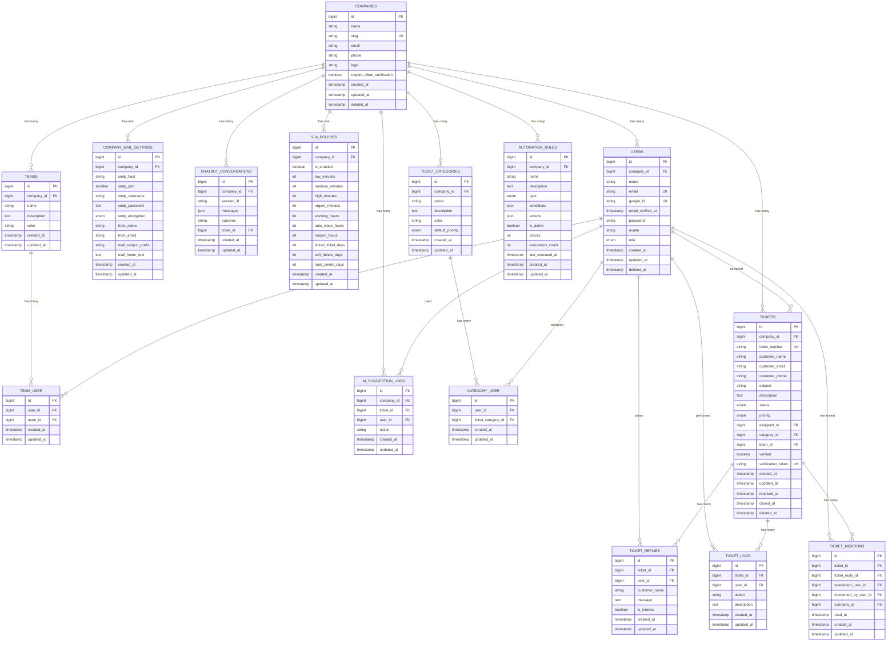
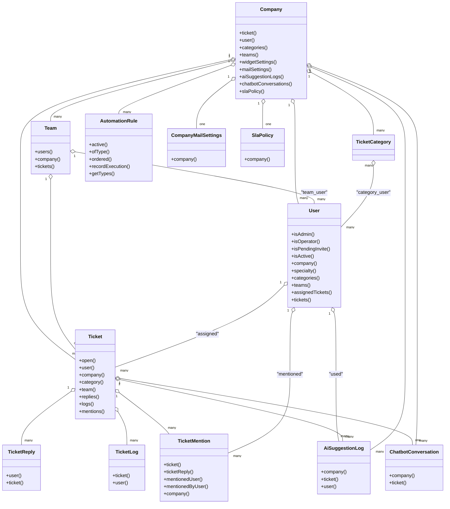

# Database Schema & Models

<cite>
**Referenced Files in This Document**
- [create_users_table.php](file://database/migrations/0001_01_01_000000_create_users_table.php)
- [create_companies_table.php](file://database/migrations/2026_02_01_224200_create_companies_table.php)
- [create_ticket_categories_table.php](file://database/migrations/2026_02_01_224218_create_ticket_categories_table.php)
- [create_tickets_table.php](file://database/migrations/2026_02_01_224222_create_tickets_table.php)
- [create_ticket_replies_table.php](file://database/migrations/2026_02_01_224225_create_ticket_replies_table.php)
- [create_automation_rules_table.php](file://database/migrations/2026_03_09_104729_create_automation_rules_table.php)
- [create_ticket_logs_table.php](file://database/migrations/2026_03_10_230354_create_ticket_logs_table.php)
- [create_category_user_table.php](file://database/migrations/2026_03_14_073653_create_category_user_table.php)
- [add_soft_deletes_to_users_table.php](file://database/migrations/2026_03_08_182155_add_soft_deletes_to_users_table.php)
- [create_teams_table.php](file://database/migrations/2026_03_20_110002_create_teams_table.php)
- [create_team_user_table.php](file://database/migrations/2026_03_20_110003_create_team_user_table.php)
- [create_ticket_mentions_table.php](file://database/migrations/2026_03_22_144439_create_ticket_mentions_table.php)
- [create_company_mail_settings_table.php](file://database/migrations/2026_03_18_072809_create_company_mail_settings_table.php)
- [create_ai_suggestion_logs_table.php](file://database/migrations/2026_03_20_000003_create_ai_suggestion_logs_table.php)
- [create_chatbot_conversations_table.php](file://database/migrations/2026_03_20_000004_create_chatbot_conversations_table.php)
- [create_sla_policies_table.php](file://database/migrations/2026_03_10_224411_create_sla_policies_table.php)
- [add_lifecycle_settings_to_sla_policies_table.php](file://database/migrations/2026_03_19_162222_add_lifecycle_settings_to_sla_policies_table.php)
- [Company.php](file://app/Models/Company.php)
- [User.php](file://app/Models/User.php)
- [Ticket.php](file://app/Models/Ticket.php)
- [TicketCategory.php](file://app/Models/TicketCategory.php)
- [TicketReply.php](file://app/Models/TicketReply.php)
- [AutomationRule.php](file://app/Models/AutomationRule.php)
- [TicketLog.php](file://app/Models/TicketLog.php)
- [Team.php](file://app/Models/Team.php)
- [TicketMention.php](file://app/Models/TicketMention.php)
- [CompanyMailSettings.php](file://app/Models/CompanyMailSettings.php)
- [AiSuggestionLog.php](file://app/Models/AiSuggestionLog.php)
- [ChatbotConversation.php](file://app/Models/ChatbotConversation.php)
- [SlaPolicy.php](file://app/Models/SlaPolicy.php)
</cite>

## Update Summary
**Changes Made**
- Added new Teams entity with team-user relationships and team assignment capabilities
- Implemented ticket mention system for user notifications and collaboration
- Integrated company mail settings for SMTP configuration and email customization
- Added AI suggestion logging for tracking AI-powered assistance usage
- Introduced chatbot conversation tracking for automated customer service
- Enhanced SLA policy configurations with lifecycle management settings
- Updated ticket assignment system to support team-based workflows

## Table of Contents
1. [Introduction](#introduction)
2. [Project Structure](#project-structure)
3. [Core Components](#core-components)
4. [Architecture Overview](#architecture-overview)
5. [Detailed Component Analysis](#detailed-component-analysis)
6. [Dependency Analysis](#dependency-analysis)
7. [Performance Considerations](#performance-considerations)
8. [Troubleshooting Guide](#troubleshooting-guide)
9. [Conclusion](#conclusion)
10. [Appendices](#appendices)

## Introduction
This document provides comprehensive data model documentation for the Helpdesk System database schema. It details entity relationships among Companies, Users, Tickets, Categories, Replies, Automation Rules, Teams, Mentions, Mail Settings, AI Logs, Chatbot Conversations, and SLA Policies, along with primary and foreign keys, indexes, and constraints. It also explains ticket lifecycle tables (status tracking, priority management, and assignment history), the user role system with company associations and permission inheritance, and the automation rule storage format and serialization of complex rule conditions. Finally, it covers migration strategies, data seeding approaches, schema evolution patterns, data integrity constraints, soft deletes for audit trails, and performance optimization via proper indexing.

## Project Structure
The database schema is defined through Laravel migrations and represented in Eloquent models. Migrations define tables, columns, indexes, and constraints. Models encapsulate relationships, scopes, and attribute casting.

```mermaid
graph TB
subgraph "Migrations"
MU["create_users_table.php"]
MC["create_companies_table.php"]
MTC["create_ticket_categories_table.php"]
MT["create_tickets_table.php"]
MTR["create_ticket_replies_table.php"]
MAR["create_automation_rules_table.php"]
MTL["create_ticket_logs_table.php"]
CMU["create_category_user_table.php"]
SDU["add_soft_deletes_to_users_table.php"]
MTM["create_teams_table.php"]
MTUM["create_team_user_table.php"]
CTM["create_ticket_mentions_table.php"]
CMS["create_company_mail_settings_table.php"]
MAISL["create_ai_suggestion_logs_table.php"]
MCBC["create_chatbot_conversations_table.php"]
MSLP["create_sla_policies_table.php"]
ASL["add_lifecycle_settings_to_sla_policies_table.php"]
end
subgraph "Models"
U["User.php"]
C["Company.php"]
TCat["TicketCategory.php"]
T["Ticket.php"]
TR["TicketReply.php"]
AR["AutomationRule.php"]
TL["TicketLog.php"]
TM["Team.php"]
TMent["TicketMention.php"]
CMS["CompanyMailSettings.php"]
AISL["AiSuggestionLog.php"]
CBC["ChatbotConversation.php"]
SLP["SlaPolicy.php"]
end
MU --> U
MC --> C
MTC --> TCat
MT --> T
MTR --> TR
MAR --> AR
MTL --> TL
CMU --> U
CMU --> TCat
SDU --> U
MTM --> TM
MTUM --> TM
CTM --> TMent
CMS --> CMS
MAISL --> AISL
MCBC --> CBC
MSLP --> SLP
ASL --> SLP
```

**Diagram sources**
- [create_users_table.php:1-59](file://database/migrations/0001_01_01_000000_create_users_table.php#L1-L59)
- [create_companies_table.php:1-41](file://database/migrations/2026_02_01_224200_create_companies_table.php#L1-L41)
- [create_ticket_categories_table.php:1-33](file://database/migrations/2026_02_01_224218_create_ticket_categories_table.php#L1-L33)
- [create_tickets_table.php:1-62](file://database/migrations/2026_02_01_224222_create_tickets_table.php#L1-L62)
- [create_ticket_replies_table.php:1-35](file://database/migrations/2026_02_01_224225_create_ticket_replies_table.php#L1-L35)
- [create_automation_rules_table.php:1-53](file://database/migrations/2026_03_09_104729_create_automation_rules_table.php#L1-L53)
- [create_ticket_logs_table.php:1-32](file://database/migrations/2026_03_10_230354_create_ticket_logs_table.php#L1-L32)
- [create_category_user_table.php:1-32](file://database/migrations/2026_03_14_073653_create_category_user_table.php#L1-L32)
- [add_soft_deletes_to_users_table.php:1-29](file://database/migrations/2026_03_08_182155_add_soft_deletes_to_users_table.php#L1-L29)
- [create_teams_table.php:1-34](file://database/migrations/2026_03_20_110002_create_teams_table.php#L1-L34)
- [create_team_user_table.php:1-32](file://database/migrations/2026_03_20_110003_create_team_user_table.php#L1-L32)
- [create_ticket_mentions_table.php:1-37](file://database/migrations/2026_03_22_144439_create_ticket_mentions_table.php#L1-L37)
- [create_company_mail_settings_table.php:1-38](file://database/migrations/2026_03_18_072809_create_company_mail_settings_table.php#L1-L38)
- [create_ai_suggestion_logs_table.php:1-35](file://database/migrations/2026_03_20_000003_create_ai_suggestion_logs_table.php#L1-L35)
- [create_chatbot_conversations_table.php:1-36](file://database/migrations/2026_03_20_000004_create_chatbot_conversations_table.php#L1-L36)
- [create_sla_policies_table.php:1-34](file://database/migrations/2026_03_10_224411_create_sla_policies_table.php#L1-L34)
- [add_lifecycle_settings_to_sla_policies_table.php:1-37](file://database/migrations/2026_03_19_162222_add_lifecycle_settings_to_sla_policies_table.php#L1-L37)

**Section sources**
- [create_users_table.php:1-59](file://database/migrations/0001_01_01_000000_create_users_table.php#L1-L59)
- [create_companies_table.php:1-41](file://database/migrations/2026_02_01_224200_create_companies_table.php#L1-L41)
- [create_ticket_categories_table.php:1-33](file://database/migrations/2026_02_01_224218_create_ticket_categories_table.php#L1-L33)
- [create_tickets_table.php:1-62](file://database/migrations/2026_02_01_224222_create_tickets_table.php#L1-L62)
- [create_ticket_replies_table.php:1-35](file://database/migrations/2026_02_01_224225_create_ticket_replies_table.php#L1-L35)
- [create_automation_rules_table.php:1-53](file://database/migrations/2026_03_09_104729_create_automation_rules_table.php#L1-L53)
- [create_ticket_logs_table.php:1-32](file://database/migrations/2026_03_10_230354_create_ticket_logs_table.php#L1-L32)
- [create_category_user_table.php:1-32](file://database/migrations/2026_03_14_073653_create_category_user_table.php#L1-L32)
- [add_soft_deletes_to_users_table.php:1-29](file://database/migrations/2026_03_08_182155_add_soft_deletes_to_users_table.php#L1-L29)
- [create_teams_table.php:1-34](file://database/migrations/2026_03_20_110002_create_teams_table.php#L1-L34)
- [create_team_user_table.php:1-32](file://database/migrations/2026_03_20_110003_create_team_user_table.php#L1-L32)
- [create_ticket_mentions_table.php:1-37](file://database/migrations/2026_03_22_144439_create_ticket_mentions_table.php#L1-L37)
- [create_company_mail_settings_table.php:1-38](file://database/migrations/2026_03_18_072809_create_company_mail_settings_table.php#L1-L38)
- [create_ai_suggestion_logs_table.php:1-35](file://database/migrations/2026_03_20_000003_create_ai_suggestion_logs_table.php#L1-L35)
- [create_chatbot_conversations_table.php:1-36](file://database/migrations/2026_03_20_000004_create_chatbot_conversations_table.php#L1-L36)
- [create_sla_policies_table.php:1-34](file://database/migrations/2026_03_10_224411_create_sla_policies_table.php#L1-L34)
- [add_lifecycle_settings_to_sla_policies_table.php:1-37](file://database/migrations/2026_03_19_162222_add_lifecycle_settings_to_sla_policies_table.php#L1-L37)

## Core Components
This section outlines the core entities and their relationships, focusing on primary and foreign keys, indexes, and constraints.

- Companies
  - Primary key: id
  - Attributes: name, slug (unique), email, phone, logo, require_client_verification, timestamps, soft deletes
  - Indexes: slug, email, created_at; composite index on (require_client_verification, created_at)
  - Constraints: unique(slug), unique(email), soft deletes enabled
  - Relationships: one-to-many with Users, Tickets, Teams, and CompanyMailSettings; one-to-one with WidgetSetting

- Users
  - Primary key: id
  - Foreign key: company_id → companies.id (ON DELETE CASCADE)
  - Attributes: name, email (unique), email_verified_at, password (nullable), google_id (unique), avatar, role, rememberToken, timestamps, soft deletes
  - Indexes: company_id, email, google_id
  - Constraints: unique(email), unique(google_id), soft deletes enabled
  - Relationships: belongs-to Company; belongs-to-many TicketCategory via category_user; belongs-to-many Teams via team_user; has-many AssignedTickets; has-many Tickets via assigned_to

- Teams
  - Primary key: id
  - Foreign key: company_id → companies.id (ON DELETE CASCADE)
  - Attributes: name, description, color, timestamps
  - Indexes: company_id
  - Relationships: belongs-to Company; belongs-to-many Users via team_user; has-many Tickets via team_id

- Team-User Association (pivot)
  - Primary key: id
  - Foreign keys: user_id → users.id (ON DELETE CASCADE), team_id → teams.id (ON DELETE CASCADE)
  - Attributes: timestamps
  - Constraints: unique(user_id, team_id)

- Ticket Categories
  - Primary key: id
  - Foreign key: company_id → companies.id (ON DELETE CASCADE)
  - Attributes: name, description, color, default_priority (enum), timestamps
  - Indexes: company_id
  - Constraints: unique(company_id, name)
  - Relationships: belongs-to Company; belongs-to-many Users via category_user

- Tickets
  - Primary key: id
  - Foreign keys: company_id → companies.id (ON DELETE CASCADE), assigned_to → users.id (ON DELETE SET NULL), category_id → ticket_categories.id (ON DELETE SET NULL), team_id → teams.id (ON DELETE SET NULL)
  - Attributes: ticket_number (unique), customer_name, customer_email, customer_phone, subject, description, status (enum), priority (enum), verified, verification_token (unique), timestamps, resolved_at, closed_at, soft deletes
  - Indexes: company_id, ticket_number, customer_email, status, priority, assigned_to, verified, created_at, team_id
  - Constraints: unique(ticket_number), unique(verification_token), soft deletes enabled
  - Relationships: belongs-to Company, User (assigned_to), Team (team_id), TicketCategory; has-many Replies; has-many Logs; has-many Mentions

- Ticket Replies
  - Primary key: id
  - Foreign keys: ticket_id → tickets.id (ON DELETE CASCADE), user_id → users.id (ON DELETE SET NULL)
  - Attributes: message, is_internal, timestamps
  - Indexes: ticket_id, user_id, created_at
  - Relationships: belongs-to Ticket; belongs-to User

- Ticket Mentions
  - Primary key: id
  - Foreign keys: ticket_id → tickets.id (ON DELETE CASCADE), ticket_reply_id → ticket_replies.id (ON DELETE CASCADE), mentioned_user_id → users.id (ON DELETE SET NULL), mentioned_by_user_id → users.id (ON DELETE SET NULL), company_id → companies.id (ON DELETE CASCADE)
  - Attributes: read_at, timestamps
  - Indexes: mentioned_user_id, ticket_id
  - Relationships: belongs-to Ticket; belongs-to TicketReply; belongs-to User (mentioned_user); belongs-to User (mentioned_by_user); belongs-to Company

- Automation Rules
  - Primary key: id
  - Foreign key: company_id → companies.id (ON DELETE CASCADE)
  - Attributes: name, description, type (enum), conditions (JSON), actions (JSON), is_active, priority, executions_count, last_executed_at, timestamps
  - Indexes: (company_id, is_active, type), (company_id, priority)
  - Relationships: belongs-to Company

- Ticket Logs
  - Primary key: id
  - Foreign keys: ticket_id → tickets.id (CASCADE ON DELETE), user_id → users.id (NULL ON DELETE)
  - Attributes: action, description, timestamps
  - Relationships: belongs-to Ticket; belongs-to User

- Company Mail Settings
  - Primary key: id
  - Foreign key: company_id → companies.id (ON DELETE CASCADE)
  - Attributes: smtp_host, smtp_port, smtp_username, smtp_password (encrypted), smtp_encryption (enum: tls, ssl, starttls, none), from_name, from_email, mail_subject_prefix, mail_footer_text, timestamps
  - Relationships: belongs-to Company

- AI Suggestion Logs
  - Primary key: id
  - Foreign keys: company_id → companies.id (ON DELETE CASCADE), ticket_id → tickets.id (ON DELETE CASCADE), user_id → users.id (ON DELETE SET NULL)
  - Attributes: action (enum: generate, regenerate, use, dismiss), timestamps
  - Indexes: (company_id, created_at)
  - Relationships: belongs-to Company; belongs-to Ticket; belongs-to User

- Chatbot Conversations
  - Primary key: id
  - Foreign keys: company_id → companies.id (ON DELETE CASCADE), ticket_id → tickets.id (ON DELETE SET NULL)
  - Attributes: session_id (indexed), messages (JSON), outcome (enum: resolved, escalated, abandoned), timestamps
  - Indexes: (company_id, created_at), session_id
  - Relationships: belongs-to Company; belongs-to Ticket

- SLA Policies
  - Primary key: id
  - Foreign key: company_id → companies.id (ON DELETE CASCADE)
  - Attributes: is_enabled, low_minutes, medium_minutes, high_minutes, urgent_minutes, warning_hours, auto_close_hours, reopen_hours, linked_ticket_days, soft_delete_days, hard_delete_days, timestamps
  - Relationships: belongs-to Company

- Category-User Association (pivot)
  - Primary key: id
  - Foreign keys: user_id → users.id (ON DELETE CASCADE), ticket_category_id → ticket_categories.id (ON DELETE CASCADE)
  - Attributes: timestamps
  - Constraints: unique(user_id, ticket_category_id)

**Section sources**
- [create_companies_table.php:14-30](file://database/migrations/2026_02_01_224200_create_companies_table.php#L14-L30)
- [create_users_table.php:14-31](file://database/migrations/0001_01_01_000000_create_users_table.php#L14-L31)
- [create_teams_table.php:14-23](file://database/migrations/2026_03_20_110002_create_teams_table.php#L14-L23)
- [create_team_user_table.php:14-21](file://database/migrations/2026_03_20_110003_create_team_user_table.php#L14-L21)
- [create_ticket_categories_table.php:11-25](file://database/migrations/2026_02_01_224218_create_ticket_categories_table.php#L11-L25)
- [create_tickets_table.php:11-54](file://database/migrations/2026_02_01_224222_create_tickets_table.php#L11-L54)
- [create_ticket_replies_table.php:11-27](file://database/migrations/2026_02_01_224225_create_ticket_replies_table.php#L11-L27)
- [create_ticket_mentions_table.php:14-26](file://database/migrations/2026_03_22_144439_create_ticket_mentions_table.php#L14-L26)
- [create_automation_rules_table.php:14-42](file://database/migrations/2026_03_09_104729_create_automation_rules_table.php#L14-L42)
- [create_ticket_logs_table.php:14-21](file://database/migrations/2026_03_10_230354_create_ticket_logs_table.php#L14-L21)
- [create_company_mail_settings_table.php:14-26](file://database/migrations/2026_03_18_072809_create_company_mail_settings_table.php#L14-L26)
- [create_ai_suggestion_logs_table.php:14-23](file://database/migrations/2026_03_20_000003_create_ai_suggestion_logs_table.php#L14-L23)
- [create_chatbot_conversations_table.php:14-24](file://database/migrations/2026_03_20_000004_create_chatbot_conversations_table.php#L14-L24)
- [create_sla_policies_table.php:14-22](file://database/migrations/2026_03_10_224411_create_sla_policies_table.php#L14-L22)
- [add_lifecycle_settings_to_sla_policies_table.php:14-21](file://database/migrations/2026_03_19_162222_add_lifecycle_settings_to_sla_policies_table.php#L14-L21)
- [create_category_user_table.php:14-21](file://database/migrations/2026_03_14_073653_create_category_user_table.php#L14-L21)
- [add_soft_deletes_to_users_table.php:14-16](file://database/migrations/2026_03_08_182155_add_soft_deletes_to_users_table.php#L14-L16)

## Architecture Overview
The Helpdesk System follows a multi-tenant architecture centered around Companies. Users belong to a Company and operate with roles (admin/operator). Tickets are associated with a Company, optionally categorized, assigned to Users or Teams, and tracked via Replies, Mentions, Logs, and SLA policies. Automation Rules apply per Company and store conditions/actions as JSON for flexible rule evaluation. The system now includes comprehensive team-based workflows, AI assistance tracking, chatbot conversation management, and enhanced email configuration capabilities.

**Diagram sources**
- [create_companies_table.php:14-30](file://database/migrations/2026_02_01_224200_create_companies_table.php#L14-L30)
- [create_teams_table.php:14-23](file://database/migrations/2026_03_20_110002_create_teams_table.php#L14-L23)
- [create_team_user_table.php:14-21](file://database/migrations/2026_03_20_110003_create_team_user_table.php#L14-L21)
- [create_company_mail_settings_table.php:14-26](file://database/migrations/2026_03_18_072809_create_company_mail_settings_table.php#L14-L26)
- [create_ai_suggestion_logs_table.php:14-23](file://database/migrations/2026_03_20_000003_create_ai_suggestion_logs_table.php#L14-L23)
- [create_chatbot_conversations_table.php:14-24](file://database/migrations/2026_03_20_000004_create_chatbot_conversations_table.php#L14-L24)
- [create_sla_policies_table.php:14-22](file://database/migrations/2026_03_10_224411_create_sla_policies_table.php#L14-L22)
- [add_lifecycle_settings_to_sla_policies_table.php:14-21](file://database/migrations/2026_03_19_162222_add_lifecycle_settings_to_sla_policies_table.php#L14-L21)
- [create_users_table.php:14-31](file://database/migrations/0001_01_01_000000_create_users_table.php#L14-L31)
- [create_ticket_categories_table.php:11-25](file://database/migrations/2026_02_01_224218_create_ticket_categories_table.php#L11-L25)
- [create_category_user_table.php:14-21](file://database/migrations/2026_03_14_073653_create_category_user_table.php#L14-L21)
- [create_tickets_table.php:11-54](file://database/migrations/2026_02_01_224222_create_tickets_table.php#L11-L54)
- [create_ticket_replies_table.php:11-27](file://database/migrations/2026_02_01_224225_create_ticket_replies_table.php#L11-L27)
- [create_ticket_mentions_table.php:14-26](file://database/migrations/2026_03_22_144439_create_ticket_mentions_table.php#L14-L26)
- [create_automation_rules_table.php:14-42](file://database/migrations/2026_03_09_104729_create_automation_rules_table.php#L14-L42)
- [create_ticket_logs_table.php:14-21](file://database/migrations/2026_03_10_230354_create_ticket_logs_table.php#L14-L21)

## Detailed Component Analysis

### Companies
- Purpose: Multi-tenant container for Users, Tickets, Teams, Categories, Automation Rules, Mail Settings, AI Logs, Chatbot Conversations, and SLA Policies.
- Keys and constraints: unique(slug), unique(email), soft deletes; indexes on slug, email, created_at, and (require_client_verification, created_at).
- Relationships: one-to-many with Users, Tickets, Teams, and CompanyMailSettings; one-to-one with WidgetSetting via model.

**Section sources**
- [create_companies_table.php:14-30](file://database/migrations/2026_02_01_224200_create_companies_table.php#L14-L30)
- [Company.php:19-37](file://app/Models/Company.php#L19-L37)

### Teams
- Purpose: Organizational units for grouping users and managing ticket assignments at a team level.
- Attributes: name, description, color, timestamps.
- Indexes: company_id.
- Relationships: belongs-to Company; belongs-to-many Users via team_user; has-many Tickets via team_id.

**Section sources**
- [create_teams_table.php:14-23](file://database/migrations/2026_03_20_110002_create_teams_table.php#L14-L23)
- [Team.php:12-12](file://app/Models/Team.php#L12-L12)

### Team-User Association
- Purpose: Many-to-many relationship between Teams and Users for team-based access control and ticket assignments.
- Uniqueness: unique(user_id, team_id).

**Section sources**
- [create_team_user_table.php:14-21](file://database/migrations/2026_03_20_110003_create_team_user_table.php#L14-L21)
- [User.php:96-99](file://app/Models/User.php#L96-L99)

### Users
- Roles: admin and operator; used for permission inheritance and scoping.
- Company association: belongs-to Company; supports soft deletes.
- Specialty: belongs-to TicketCategory via specialty_id; belongs-to-many TicketCategory via category_user.
- Team membership: belongs-to-many Teams via team_user.
- Scopes: available, withSpecialty, operators; helpers: isAdmin, isOperator, isPendingInvite, isActive.
- Indexes: company_id, email, google_id; soft deletes enabled.

**Section sources**
- [create_users_table.php:14-31](file://database/migrations/0001_01_01_000000_create_users_table.php#L14-L31)
- [add_soft_deletes_to_users_table.php:14-16](file://database/migrations/2026_03_08_182155_add_soft_deletes_to_users_table.php#L14-L16)
- [User.php:74-121](file://app/Models/User.php#L74-L121)

### Ticket Categories
- Purpose: Classify Tickets and define default priority.
- Uniqueness: (company_id, name) ensures unique category names per company.
- Indexes: company_id.

**Section sources**
- [create_ticket_categories_table.php:11-25](file://database/migrations/2026_02_01_224218_create_ticket_categories_table.php#L11-L25)
- [TicketCategory.php:12-12](file://app/Models/TicketCategory.php#L12-L12)

### Tickets
- Lifecycle: status (pending, open, in_progress, resolved, closed) and priority (low, medium, high, urgent).
- Assignment: optional assigned_to → users.id; optional team_id → teams.id; category: optional category_id → ticket_categories.id.
- Verification: customer verification via verified and verification_token.
- Timestamps: created_at, resolved_at, closed_at; soft deletes enabled.
- Indexes: company_id, ticket_number, customer_email, status, priority, assigned_to, verified, created_at, team_id.
- Scopes: open; route model binding uses ticket_number.

**Section sources**
- [create_tickets_table.php:11-54](file://database/migrations/2026_02_01_224222_create_tickets_table.php#L11-L54)
- [Ticket.php:16-62](file://app/Models/Ticket.php#L16-L62)

### Ticket Replies
- Purpose: Capture staff replies and client messages; internal notes supported via is_internal.
- Identity: either user_id (staff) or customer_name (client) is populated.
- Indexes: ticket_id, user_id, created_at.

**Section sources**
- [create_ticket_replies_table.php:11-27](file://database/migrations/2026_02_01_224225_create_ticket_replies_table.php#L11-L27)
- [TicketReply.php:10-37](file://app/Models/TicketReply.php#L10-L37)

### Ticket Mentions
- Purpose: Track user mentions within ticket conversations for notifications and collaboration.
- Attributes: read_at timestamp for tracking mention read status.
- Indexes: mentioned_user_id, ticket_id.
- Relationships: belongs-to Ticket; belongs-to TicketReply; belongs-to User (mentioned_user); belongs-to User (mentioned_by_user); belongs-to Company.

**Section sources**
- [create_ticket_mentions_table.php:14-26](file://database/migrations/2026_03_22_144439_create_ticket_mentions_table.php#L14-L26)
- [TicketMention.php:12-12](file://app/Models/TicketMention.php#L12-L12)

### Automation Rules
- Storage: conditions and actions stored as JSON arrays; type enumerates rule kinds.
- Execution tracking: executions_count and last_executed_at.
- Indexes: (company_id, is_active, type), (company_id, priority).
- Scopes: active, ofType, ordered; helper: getTypes.

**Section sources**
- [create_automation_rules_table.php:14-42](file://database/migrations/2026_03_09_104729_create_automation_rules_table.php#L14-L42)
- [AutomationRule.php:27-115](file://app/Models/AutomationRule.php#L27-L115)

### Ticket Logs
- Purpose: Audit trail for ticket actions performed by users.
- Null-on-delete: user_id can be null when user is deleted.

**Section sources**
- [create_ticket_logs_table.php:14-21](file://database/migrations/2026_03_10_230354_create_ticket_logs_table.php#L14-L21)
- [TicketLog.php:16-24](file://app/Models/TicketLog.php#L16-L24)

### Company Mail Settings
- Purpose: Store SMTP configuration and email branding settings per company.
- Attributes: SMTP host, port, username, encrypted password, encryption type, sender name and email, subject prefix, and footer text.
- Relationships: belongs-to Company.

**Section sources**
- [create_company_mail_settings_table.php:14-26](file://database/migrations/2026_03_18_072809_create_company_mail_settings_table.php#L14-L26)
- [CompanyMailSettings.php:12-12](file://app/Models/CompanyMailSettings.php#L12-L12)

### AI Suggestion Logs
- Purpose: Track AI-powered suggestion generation, regeneration, usage, and dismissal actions.
- Attributes: action enum (generate, regenerate, use, dismiss), timestamps.
- Indexes: (company_id, created_at).
- Relationships: belongs-to Company; belongs-to Ticket; belongs-to User.

**Section sources**
- [create_ai_suggestion_logs_table.php:14-23](file://database/migrations/2026_03_20_000003_create_ai_suggestion_logs_table.php#L14-L23)
- [AiSuggestionLog.php:12-12](file://app/Models/AiSuggestionLog.php#L12-L12)

### Chatbot Conversations
- Purpose: Track automated customer service conversations with outcomes and ticket linking.
- Attributes: session_id (indexed), messages (JSON), outcome (resolved, escalated, abandoned), optional ticket_id linking.
- Indexes: (company_id, created_at), session_id.
- Relationships: belongs-to Company; belongs-to Ticket.

**Section sources**
- [create_chatbot_conversations_table.php:14-24](file://database/migrations/2026_03_20_000004_create_chatbot_conversations_table.php#L14-L24)
- [ChatbotConversation.php:12-12](file://app/Models/ChatbotConversation.php#L12-L12)

### SLA Policies
- Purpose: Define service level agreements with different response time targets for various priority levels.
- Attributes: is_enabled flag, minutes for each priority level (low, medium, high, urgent), and lifecycle management settings (warning_hours, auto_close_hours, reopen_hours, linked_ticket_days, soft_delete_days, hard_delete_days).
- Relationships: belongs-to Company.

**Section sources**
- [create_sla_policies_table.php:14-22](file://database/migrations/2026_03_10_224411_create_sla_policies_table.php#L14-L22)
- [add_lifecycle_settings_to_sla_policies_table.php:14-21](file://database/migrations/2026_03_19_162222_add_lifecycle_settings_to_sla_policies_table.php#L14-L21)
- [SlaPolicy.php:12-12](file://app/Models/SlaPolicy.php#L12-L12)

### Category-User Association
- Purpose: Associate operators with specific categories (specialties).
- Uniqueness: unique(user_id, ticket_category_id).

**Section sources**
- [create_category_user_table.php:14-21](file://database/migrations/2026_03_14_073653_create_category_user_table.php#L14-L21)
- [User.php:84-87](file://app/Models/User.php#L84-L87)

## Dependency Analysis
This section maps dependencies between models and migrations to clarify coupling and cohesion.

**Diagram sources**
- [Company.php:19-37](file://app/Models/Company.php#L19-L37)
- [Team.php:12-12](file://app/Models/Team.php#L12-L12)
- [User.php:74-121](file://app/Models/User.php#L74-L121)
- [Ticket.php:16-62](file://app/Models/Ticket.php#L16-L62)
- [TicketReply.php:29-37](file://app/Models/TicketReply.php#L29-L37)
- [TicketMention.php:12-12](file://app/Models/TicketMention.php#L12-L12)
- [AutomationRule.php:66-115](file://app/Models/AutomationRule.php#L66-L115)
- [TicketLog.php:16-24](file://app/Models/TicketLog.php#L16-L24)
- [CompanyMailSettings.php:12-12](file://app/Models/CompanyMailSettings.php#L12-L12)
- [AiSuggestionLog.php:12-12](file://app/Models/AiSuggestionLog.php#L12-L12)
- [ChatbotConversation.php:12-12](file://app/Models/ChatbotConversation.php#L12-L12)
- [SlaPolicy.php:12-12](file://app/Models/SlaPolicy.php#L12-L12)

**Section sources**
- [Company.php:19-37](file://app/Models/Company.php#L19-L37)
- [Team.php:12-12](file://app/Models/Team.php#L12-L12)
- [User.php:74-121](file://app/Models/User.php#L74-L121)
- [Ticket.php:16-62](file://app/Models/Ticket.php#L16-L62)
- [TicketReply.php:29-37](file://app/Models/TicketReply.php#L29-L37)
- [TicketMention.php:12-12](file://app/Models/TicketMention.php#L12-L12)
- [AutomationRule.php:66-115](file://app/Models/AutomationRule.php#L66-L115)
- [TicketLog.php:16-24](file://app/Models/TicketLog.php#L16-L24)
- [CompanyMailSettings.php:12-12](file://app/Models/CompanyMailSettings.php#L12-L12)
- [AiSuggestionLog.php:12-12](file://app/Models/AiSuggestionLog.php#L12-L12)
- [ChatbotConversation.php:12-12](file://app/Models/ChatbotConversation.php#L12-L12)
- [SlaPolicy.php:12-12](file://app/Models/SlaPolicy.php#L12-L12)

## Performance Considerations
- Indexes
  - Companies: slug, email, created_at; composite (require_client_verification, created_at)
  - Users: company_id, email, google_id
  - Teams: company_id
  - Team-User: unique(user_id, team_id)
  - Ticket Categories: company_id
  - Tickets: company_id, ticket_number, customer_email, status, priority, assigned_to, verified, created_at, team_id
  - Ticket Replies: ticket_id, user_id, created_at
  - Ticket Mentions: mentioned_user_id, ticket_id
  - Automation Rules: (company_id, is_active, type), (company_id, priority)
  - Ticket Logs: implicit primary key; foreign keys indexed via constraints
  - Company Mail Settings: none (company_id FK indexed via constraint)
  - AI Suggestion Logs: (company_id, created_at)
  - Chatbot Conversations: (company_id, created_at), session_id
  - SLA Policies: none (company_id FK indexed via constraint)
- Soft Deletes
  - Enabled on Users and Tickets for audit trails and safe archival.
- JSON Columns
  - conditions and actions in Automation Rules should be kept concise; consider validating structure at write-time to avoid expensive parsing during reads.
  - messages in Chatbot Conversations and ticket mentions contain JSON data that should be efficiently queried.
- Scopes and Casting
  - Use scopes (e.g., open, active, ofType, ordered) to minimize application-side filtering.
  - Attribute casting (dates, booleans, integers) reduces type coercion overhead.
- Composite Queries
  - Prefer filtered indexes and targeted joins; avoid SELECT * on large tables.
  - Team-based queries should leverage team_user pivot table for efficient filtering.

## Troubleshooting Guide
- Duplicate Category Names
  - Symptom: unique constraint violation on (company_id, name) in ticket_categories.
  - Resolution: Ensure category names are unique per company before insert/update.
- Orphaned Records After Deletion
  - Tickets with assigned_to or category_id set to null after cascade; replies/logs retain referential integrity.
  - Resolution: Confirm cascade onDelete behavior aligns with expectations; use soft deletes for reversible operations.
- Automation Rule Evaluation Failures
  - Symptom: malformed JSON in conditions/actions.
  - Resolution: Validate JSON structure before persisting; use model casting and defensive parsing.
- Audit Trail Gaps
  - Symptom: missing user context in logs after user deletion.
  - Resolution: TicketLogs allows null user_id; ensure fallbacks or denormalized user info if needed.
- Team Assignment Issues
  - Symptom: users cannot see tickets assigned to their teams.
  - Resolution: Verify team_user relationships exist and team_id is properly set on tickets.
- Mention Notification Problems
  - Symptom: users not receiving mention notifications.
  - Resolution: Check ticket_mentions table entries and ensure mentioned_user_id references valid users.
- Email Configuration Errors
  - Symptom: email delivery failures.
  - Resolution: Verify company_mail_settings values and test SMTP connectivity.
- AI Suggestion Tracking Issues
  - Symptom: missing AI suggestion logs.
  - Resolution: Ensure proper user context and ticket association when logging actions.
- Chatbot Conversation Problems
  - Symptom: chatbot conversations not being tracked.
  - Resolution: Verify session_id uniqueness and proper outcome tracking.

**Section sources**
- [create_ticket_categories_table.php:23-24](file://database/migrations/2026_02_01_224218_create_ticket_categories_table.php#L23-L24)
- [create_tickets_table.php:32-33](file://database/migrations/2026_02_01_224222_create_tickets_table.php#L32-L33)
- [create_ticket_logs_table.php:16-17](file://database/migrations/2026_03_10_230354_create_ticket_logs_table.php#L16-L17)
- [create_teams_table.php:14-23](file://database/migrations/2026_03_20_110002_create_teams_table.php#L14-L23)
- [create_ticket_mentions_table.php:14-26](file://database/migrations/2026_03_22_144439_create_ticket_mentions_table.php#L14-L26)
- [create_company_mail_settings_table.php:14-26](file://database/migrations/2026_03_18_072809_create_company_mail_settings_table.php#L14-L26)
- [create_ai_suggestion_logs_table.php:14-23](file://database/migrations/2026_03_20_000003_create_ai_suggestion_logs_table.php#L14-L23)
- [create_chatbot_conversations_table.php:14-24](file://database/migrations/2026_03_20_000004_create_chatbot_conversations_table.php#L14-L24)

## Conclusion
The Helpdesk System schema is designed for multi-tenancy with strong referential integrity, clear indexes for common queries, and flexible automation via JSON-serialized rule conditions. The addition of teams enables hierarchical organization and team-based ticket assignment workflows. The mention system enhances collaboration and user engagement. Comprehensive email configuration, AI suggestion tracking, and chatbot conversation management provide modern customer service capabilities. Enhanced SLA policies with lifecycle management ensure proper ticket handling and data retention. Soft deletes enable audit-friendly data retention across all entities. The model-layer scopes and casts streamline common operations and improve maintainability. Adhering to the documented constraints and indexes ensures predictable performance and reliable data integrity.

## Appendices

### Ticket Lifecycle Tables and Tracking
- Status Tracking
  - Enumerated statuses: pending, open, in_progress, resolved, closed.
  - Timestamps: resolved_at, closed_at support lifecycle analytics.
- Priority Management
  - Enumerated priorities: low, medium, high, urgent.
  - Default priority per category supports automatic assignment of baseline priority.
- Assignment History
  - Use TicketLogs to capture assignments, reassignments, and ownership changes.
  - Replies distinguish internal notes via is_internal for contextual clarity.
- Team-Based Assignment
  - Tickets can be assigned to teams via team_id for group-based workflows.
  - Team visibility controls ensure proper access to team-associated tickets.

**Section sources**
- [create_tickets_table.php:26-42](file://database/migrations/2026_02_01_224222_create_tickets_table.php#L26-L42)
- [create_ticket_replies_table.php:20-20](file://database/migrations/2026_02_01_224225_create_ticket_replies_table.php#L20-L20)
- [create_ticket_logs_table.php:16-20](file://database/migrations/2026_03_10_230354_create_ticket_logs_table.php#L16-L20)
- [create_teams_table.php:14-23](file://database/migrations/2026_03_20_110002_create_teams_table.php#L14-L23)

### User Role System and Permission Inheritance
- Roles
  - admin and operator roles drive permission checks and scoping.
- Company Associations
  - Users belong to a single Company; cascading deletes remove dependent records.
- Specialty and Availability
  - Specialty ties users to TicketCategory; availability flag scopes assignable operators.
- Team Membership
  - Users can belong to multiple teams via team_user pivot table.
  - Team-based visibility controls tickets based on team membership.
- Permission Inference
  - Admins typically inherit broader permissions; operators act within assigned categories, teams, and tickets.

**Section sources**
- [create_users_table.php:23-23](file://database/migrations/0001_01_01_000000_create_users_table.php#L23-L23)
- [User.php:54-72](file://app/Models/User.php#L54-L72)
- [User.php:84-87](file://app/Models/User.php#L84-L87)
- [User.php:96-99](file://app/Models/User.php#L96-L99)
- [User.php:102-121](file://app/Models/User.php#L102-L121)

### Automation Rule Storage Format and Serialization
- Conditions and Actions
  - Stored as JSON arrays; validated and parsed by the Automation Engine.
- Types
  - assignment, priority, auto_reply, escalation.
- Execution Metrics
  - executions_count and last_executed_at support monitoring and scheduling.
- Team Assignment Rules
  - New rule types support team-based ticket assignment and routing.

**Section sources**
- [create_automation_rules_table.php:25-35](file://database/migrations/2026_03_09_104729_create_automation_rules_table.php#L25-L35)
- [AutomationRule.php:27-50](file://app/Models/AutomationRule.php#L27-L50)

### Database Migration Strategies and Schema Evolution
- Migration Order
  - Base tables first (users, companies), followed by related entities (categories, teams, tickets, replies, logs, mentions, rules).
- Soft Deletes
  - Applied to Users and Tickets post-creation to preserve audit trails.
- Pivot Tables
  - category_user and team_user created separately to manage many-to-many relationships.
- Indexing Strategy
  - Add indexes incrementally; ensure unique constraints precede secondary indexes for performance.
- Seeding
  - Factories and seeders populate initial data for Companies, Users, Categories, Teams, Tickets, Mentions, Automation Rules, Mail Settings, AI Logs, Chatbot Conversations, and SLA Policies.
- Team-Based Workflows
  - New team entities and relationships enable hierarchical organization and team-based ticket management.
- Enhanced Monitoring
  - AI suggestion logs and chatbot conversations provide insights into system usage and customer interactions.

**Section sources**
- [create_users_table.php:1-59](file://database/migrations/0001_01_01_000000_create_users_table.php#L1-L59)
- [create_companies_table.php:1-41](file://database/migrations/2026_02_01_224200_create_companies_table.php#L1-L41)
- [create_ticket_categories_table.php:1-33](file://database/migrations/2026_02_01_224218_create_ticket_categories_table.php#L1-L33)
- [create_teams_table.php:1-34](file://database/migrations/2026_03_20_110002_create_teams_table.php#L1-L34)
- [create_team_user_table.php:1-32](file://database/migrations/2026_03_20_110003_create_team_user_table.php#L1-L32)
- [create_tickets_table.php:1-62](file://database/migrations/2026_02_01_224222_create_tickets_table.php#L1-L62)
- [create_ticket_replies_table.php:1-35](file://database/migrations/2026_02_01_224225_create_ticket_replies_table.php#L1-L35)
- [create_ticket_logs_table.php:1-32](file://database/migrations/2026_03_10_230354_create_ticket_logs_table.php#L1-L32)
- [create_ticket_mentions_table.php:1-37](file://database/migrations/2026_03_22_144439_create_ticket_mentions_table.php#L1-L37)
- [create_automation_rules_table.php:1-53](file://database/migrations/2026_03_09_104729_create_automation_rules_table.php#L1-L53)
- [add_soft_deletes_to_users_table.php:1-29](file://database/migrations/2026_03_08_182155_add_soft_deletes_to_users_table.php#L1-L29)
- [create_category_user_table.php:1-32](file://database/migrations/2026_03_14_073653_create_category_user_table.php#L1-L32)
- [create_company_mail_settings_table.php:1-38](file://database/migrations/2026_03_18_072809_create_company_mail_settings_table.php#L1-L38)
- [create_ai_suggestion_logs_table.php:1-35](file://database/migrations/2026_03_20_000003_create_ai_suggestion_logs_table.php#L1-L35)
- [create_chatbot_conversations_table.php:1-36](file://database/migrations/2026_03_20_000004_create_chatbot_conversations_table.php#L1-L36)
- [create_sla_policies_table.php:1-34](file://database/migrations/2026_03_10_224411_create_sla_policies_table.php#L1-L34)
- [add_lifecycle_settings_to_sla_policies_table.php:1-37](file://database/migrations/2026_03_19_162222_add_lifecycle_settings_to_sla_policies_table.php#L1-L37)

### Enhanced Email Configuration and Communication Features
- Company Mail Settings
  - Comprehensive SMTP configuration including host, port, username, encrypted password, and encryption type.
  - Customizable email branding with from_name, from_email, subject_prefix, and footer_text.
- Ticket Mention System
  - Real-time user notifications within ticket conversations.
  - Read status tracking via read_at timestamp.
  - Context-aware mentions with company-level scoping.
- AI Assistance Tracking
  - Detailed logging of AI suggestion generation, regeneration, usage, and dismissal actions.
  - User and ticket association for usage analytics.
- Chatbot Conversation Management
  - Session-based conversation tracking with outcome categorization.
  - Optional ticket linking for seamless handoff to human agents.
  - Indexed session_id for efficient conversation retrieval.

**Section sources**
- [create_company_mail_settings_table.php:14-26](file://database/migrations/2026_03_18_072809_create_company_mail_settings_table.php#L14-L26)
- [create_ticket_mentions_table.php:14-26](file://database/migrations/2026_03_22_144439_create_ticket_mentions_table.php#L14-L26)
- [create_ai_suggestion_logs_table.php:14-23](file://database/migrations/2026_03_20_000003_create_ai_suggestion_logs_table.php#L14-L23)
- [create_chatbot_conversations_table.php:14-24](file://database/migrations/2026_03_20_000004_create_chatbot_conversations_table.php#L14-L24)

### Team-Based Organization and Workflow Enhancement
- Team Entity Design
  - Color-coded teams for visual identification and organization.
  - Description field for team purpose and scope definition.
  - Company-scoped teams ensure proper isolation between organizations.
- Team-User Relationships
  - Flexible many-to-many relationship enabling users to belong to multiple teams.
  - Unique constraints prevent duplicate team memberships.
  - Efficient querying through team_user pivot table.
- Ticket Team Assignment
  - Optional team_id on tickets enables team-based routing and visibility.
  - Team-based access control restricts ticket visibility to team members.
  - Integration with existing user assignment system for hybrid workflows.
- Automation Rule Enhancements
  - New rule types support team-based ticket assignment and routing.
  - Team-specific conditions and actions for granular automation control.

**Section sources**
- [create_teams_table.php:14-23](file://database/migrations/2026_03_20_110002_create_teams_table.php#L14-L23)
- [create_team_user_table.php:14-21](file://database/migrations/2026_03_20_110003_create_team_user_table.php#L14-L21)
- [create_tickets_table.php:45-45](file://database/migrations/2026_02_01_224222_create_tickets_table.php#L45-L45)
- [create_automation_rules_table.php:25-35](file://database/migrations/2026_03_09_104729_create_automation_rules_table.php#L25-L35)