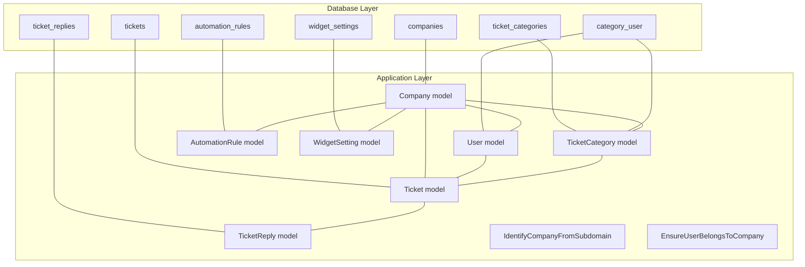
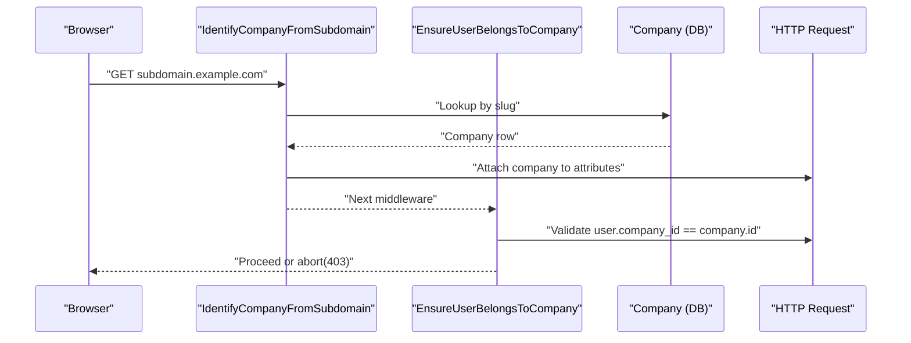
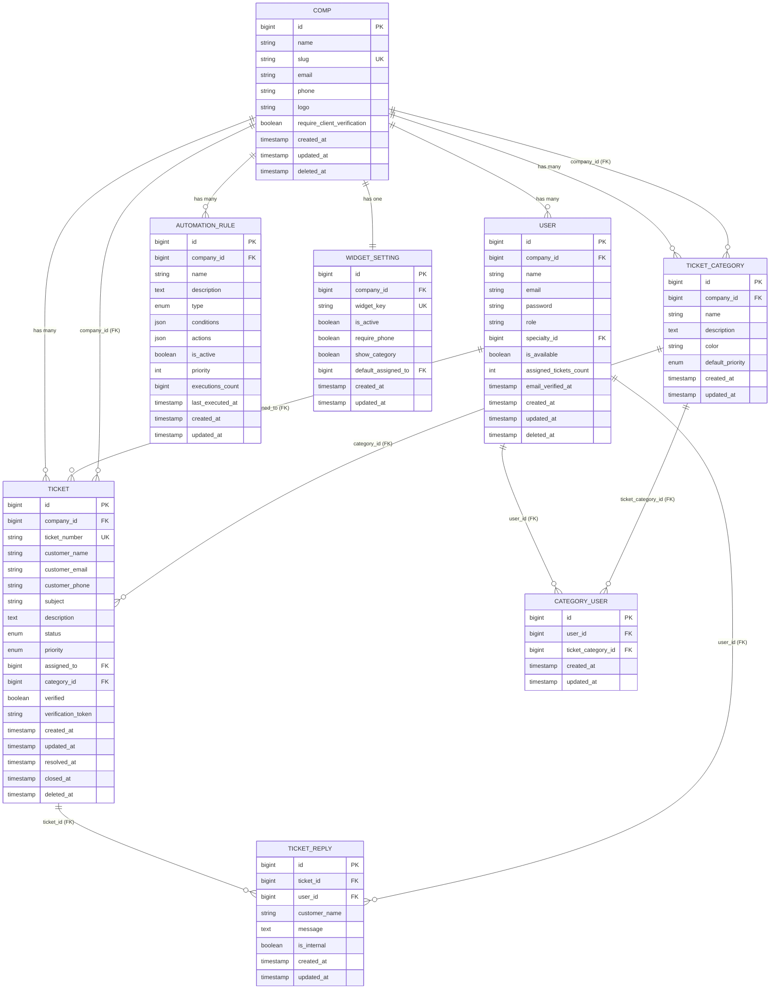
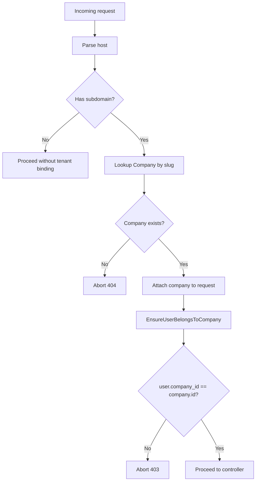
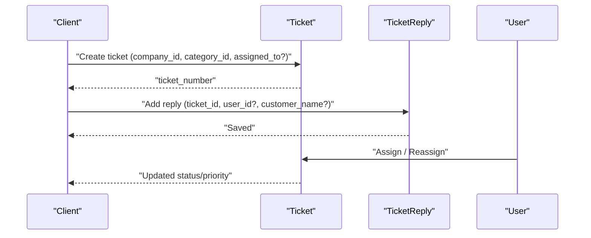
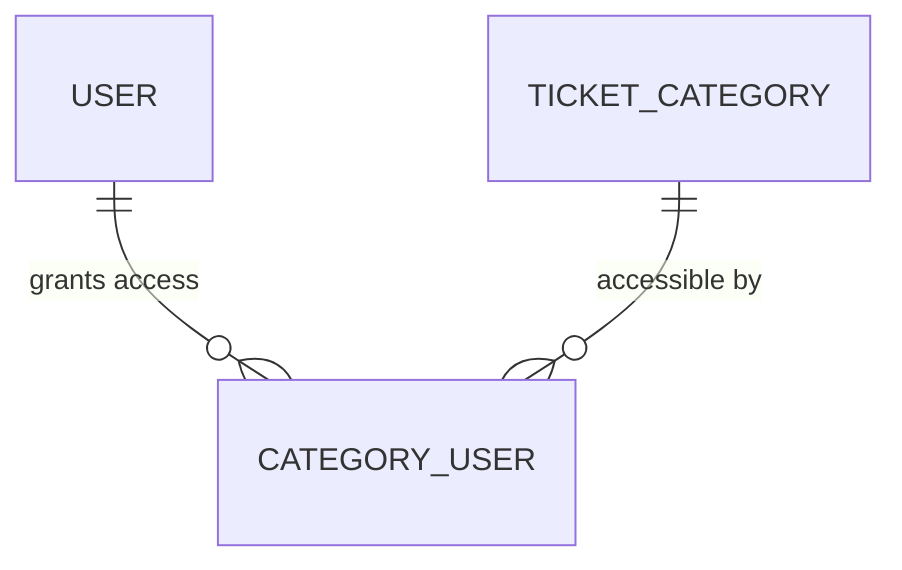
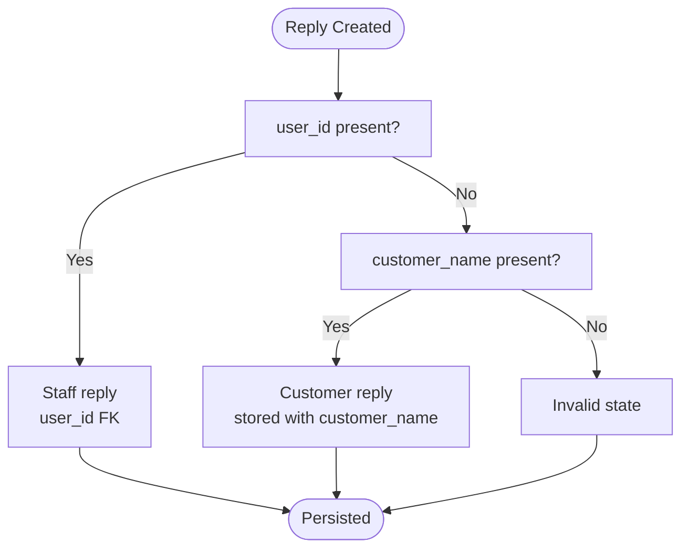
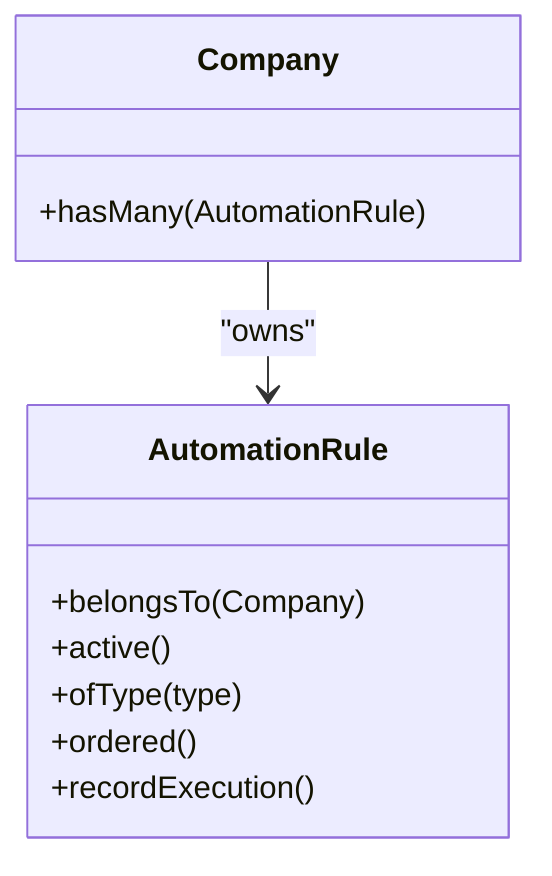
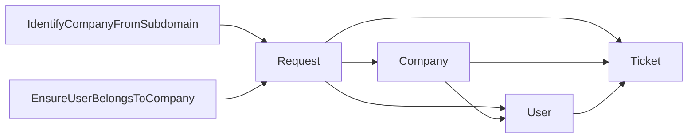

# Entity Relationships & Associations

<cite>
**Referenced Files in This Document**
- [2026_02_01_224200_create_companies_table.php](file://database/migrations/2026_02_01_224200_create_companies_table.php)
- [2026_02_01_224218_create_ticket_categories_table.php](file://database/migrations/2026_02_01_224218_create_ticket_categories_table.php)
- [2026_02_01_224222_create_tickets_table.php](file://database/migrations/2026_02_01_224222_create_tickets_table.php)
- [2026_02_01_224225_create_ticket_replies_table.php](file://database/migrations/2026_02_01_224225_create_ticket_replies_table.php)
- [2026_03_14_073653_create_category_user_table.php](file://database/migrations/2026_03_14_073653_create_category_user_table.php)
- [2026_03_09_104729_create_automation_rules_table.php](file://database/migrations/2026_03_09_104729_create_automation_rules_table.php)
- [Company.php](file://app/Models/Company.php)
- [User.php](file://app/Models/User.php)
- [Ticket.php](file://app/Models/Ticket.php)
- [TicketCategory.php](file://app/Models/TicketCategory.php)
- [TicketReply.php](file://app/Models/TicketReply.php)
- [AutomationRule.php](file://app/Models/AutomationRule.php)
- [WidgetSetting.php](file://app/Models/WidgetSetting.php)
- [IdentifyCompanyFromSubdomain.php](file://app/Http/Middleware/IdentifyCompanyFromSubdomain.php)
- [EnsureUserBelongsToCompany.php](file://app/Http/Middleware/EnsureUserBelongsToCompany.php)
</cite>

## Table of Contents
1. [Introduction](#introduction)
2. [Project Structure](#project-structure)
3. [Core Components](#core-components)
4. [Architecture Overview](#architecture-overview)
5. [Detailed Component Analysis](#detailed-component-analysis)
6. [Dependency Analysis](#dependency-analysis)
7. [Performance Considerations](#performance-considerations)
8. [Troubleshooting Guide](#troubleshooting-guide)
9. [Conclusion](#conclusion)

## Introduction
This document describes the entity relationship model for the Helpdesk System, focusing on multi-tenancy via subdomains, and the relationships among Companies, Users, Tickets, Categories, Replies, and Automation Rules. It documents foreign keys, cascading behaviors, referential integrity, many-to-many associations, and how the schema enforces tenant isolation. It also explains the ticket lifecycle, assignment, replies, and status changes, and highlights polymorphic-like patterns for customer replies.

## Project Structure
The relationships are defined by:
- Migrations that create tables and enforce foreign keys and uniqueness
- Eloquent models that declare relationships and scopes
- Middleware that implements subdomain-based multi-tenancy and per-request company binding

**Diagram sources**
- [2026_02_01_224200_create_companies_table.php:14-30](file://database/migrations/2026_02_01_224200_create_companies_table.php#L14-L30)
- [2026_02_01_224218_create_ticket_categories_table.php:11-25](file://database/migrations/2026_02_01_224218_create_ticket_categories_table.php#L11-L25)
- [2026_02_01_224222_create_tickets_table.php:11-54](file://database/migrations/2026_02_01_224222_create_tickets_table.php#L11-L54)
- [2026_02_01_224225_create_ticket_replies_table.php:11-27](file://database/migrations/2026_02_01_224225_create_ticket_replies_table.php#L11-L27)
- [2026_03_14_073653_create_category_user_table.php:14-21](file://database/migrations/2026_03_14_073653_create_category_user_table.php#L14-L21)
- [2026_03_09_104729_create_automation_rules_table.php:14-42](file://database/migrations/2026_03_09_104729_create_automation_rules_table.php#L14-L42)
- [Company.php:19-37](file://app/Models/Company.php#L19-L37)
- [User.php:74-97](file://app/Models/User.php#L74-L97)
- [Ticket.php:16-39](file://app/Models/Ticket.php#L16-L39)
- [TicketCategory.php:8-13](file://app/Models/TicketCategory.php#L8-L13)
- [TicketReply.php:29-37](file://app/Models/TicketReply.php#L29-L37)
- [AutomationRule.php:54-58](file://app/Models/AutomationRule.php#L54-L58)
- [WidgetSetting.php:37-45](file://app/Models/WidgetSetting.php#L37-L45)

**Section sources**
- [2026_02_01_224200_create_companies_table.php:14-30](file://database/migrations/2026_02_01_224200_create_companies_table.php#L14-L30)
- [2026_02_01_224218_create_ticket_categories_table.php:11-25](file://database/migrations/2026_02_01_224218_create_ticket_categories_table.php#L11-L25)
- [2026_02_01_224222_create_tickets_table.php:11-54](file://database/migrations/2026_02_01_224222_create_tickets_table.php#L11-L54)
- [2026_02_01_224225_create_ticket_replies_table.php:11-27](file://database/migrations/2026_02_01_224225_create_ticket_replies_table.php#L11-L27)
- [2026_03_14_073653_create_category_user_table.php:14-21](file://database/migrations/2026_03_14_073653_create_category_user_table.php#L14-L21)
- [2026_03_09_104729_create_automation_rules_table.php:14-42](file://database/migrations/2026_03_09_104729_create_automation_rules_table.php#L14-L42)

## Core Components
- Company: Tenant container with slug-based routing and soft deletes.
- User: Belongs to a Company; can be assigned to Tickets; can be scoped by availability and specialty; many-to-many with Categories via category_user.
- Ticket: Belongs to a Company; optionally assigned to a User; optionally categorized; tracks status/priority and timestamps; has Replies and Logs.
- TicketCategory: Belongs to a Company; defines default priority and color; unique per company.
- TicketReply: Belongs to a Ticket; belongs to a User (optional) or stores customer_name for client replies; internal/public distinction.
- AutomationRule: Belongs to a Company; encapsulates conditions/actions for assignment, priority, auto-reply, escalation.
- WidgetSetting: Belongs to a Company; generates subdomain-based widget URLs.

**Section sources**
- [Company.php:19-37](file://app/Models/Company.php#L19-L37)
- [User.php:74-97](file://app/Models/User.php#L74-L97)
- [Ticket.php:16-39](file://app/Models/Ticket.php#L16-L39)
- [TicketCategory.php:8-13](file://app/Models/TicketCategory.php#L8-L13)
- [TicketReply.php:29-37](file://app/Models/TicketReply.php#L29-L37)
- [AutomationRule.php:54-58](file://app/Models/AutomationRule.php#L54-L58)
- [WidgetSetting.php:37-45](file://app/Models/WidgetSetting.php#L37-L45)

## Architecture Overview
The system uses subdomain-based multi-tenancy:
- Subdomain parsing resolves to a Company slug.
- Middleware binds the Company to the request and shares it with views.
- Additional middleware ensures the authenticated User belongs to the resolved Company.

**Diagram sources**
- [IdentifyCompanyFromSubdomain.php:12-36](file://app/Http/Middleware/IdentifyCompanyFromSubdomain.php#L12-L36)
- [EnsureUserBelongsToCompany.php:11-37](file://app/Http/Middleware/EnsureUserBelongsToCompany.php#L11-L37)

**Section sources**
- [IdentifyCompanyFromSubdomain.php:12-36](file://app/Http/Middleware/IdentifyCompanyFromSubdomain.php#L12-L36)
- [EnsureUserBelongsToCompany.php:11-37](file://app/Http/Middleware/EnsureUserBelongsToCompany.php#L11-L37)

## Detailed Component Analysis

### ER Diagram: Core Entities and Relationships

**Diagram sources**
- [2026_02_01_224200_create_companies_table.php:14-30](file://database/migrations/2026_02_01_224200_create_companies_table.php#L14-L30)
- [2026_02_01_224218_create_ticket_categories_table.php:11-25](file://database/migrations/2026_02_01_224218_create_ticket_categories_table.php#L11-L25)
- [2026_02_01_224222_create_tickets_table.php:11-54](file://database/migrations/2026_02_01_224222_create_tickets_table.php#L11-L54)
- [2026_02_01_224225_create_ticket_replies_table.php:11-27](file://database/migrations/2026_02_01_224225_create_ticket_replies_table.php#L11-L27)
- [2026_03_14_073653_create_category_user_table.php:14-21](file://database/migrations/2026_03_14_073653_create_category_user_table.php#L14-L21)
- [2026_03_09_104729_create_automation_rules_table.php:14-42](file://database/migrations/2026_03_09_104729_create_automation_rules_table.php#L14-L42)
- [Company.php:19-37](file://app/Models/Company.php#L19-L37)
- [User.php:74-97](file://app/Models/User.php#L74-L97)
- [Ticket.php:16-39](file://app/Models/Ticket.php#L16-L39)
- [TicketCategory.php:8-13](file://app/Models/TicketCategory.php#L8-L13)
- [TicketReply.php:29-37](file://app/Models/TicketReply.php#L29-L37)
- [AutomationRule.php:54-58](file://app/Models/AutomationRule.php#L54-L58)
- [WidgetSetting.php:37-45](file://app/Models/WidgetSetting.php#L37-L45)

### Foreign Keys, Cascades, and Referential Integrity
- companies.id
  - References in tickets.company_id, ticket_categories.company_id, automation_rules.company_id, widget_settings.company_id
  - Cascade delete enabled on company references
- users.company_id
  - References companies.id
  - No explicit cascade on company_id; user retention on company deletion depends on application policy
- users.id
  - References category_user.user_id (cascade delete)
  - References ticket.assigned_to (set null on delete)
- ticket_categories.company_id
  - References companies.id
  - Cascade delete enabled
- ticket_categories.id
  - References tickets.category_id (set null on delete)
- tickets.id
  - References ticket_replies.ticket_id
  - Cascade delete enabled
- ticket_replies.user_id
  - References users.id
  - Set null on delete
- category_user.user_id
  - References users.id
  - Cascade delete
- category_user.ticket_category_id
  - References ticket_categories.id
  - Cascade delete
- widget_settings.default_assigned_to
  - References users.id
  - Set null on delete

**Section sources**
- [2026_02_01_224222_create_tickets_table.php:13-33](file://database/migrations/2026_02_01_224222_create_tickets_table.php#L13-L33)
- [2026_02_01_224225_create_ticket_replies_table.php:13-16](file://database/migrations/2026_02_01_224225_create_ticket_replies_table.php#L13-L16)
- [2026_03_14_073653_create_category_user_table.php:16-17](file://database/migrations/2026_03_14_073653_create_category_user_table.php#L16-L17)
- [2026_02_01_224218_create_ticket_categories_table.php](file://database/migrations/2026_02_01_224218_create_ticket_categories_table.php#L13)
- [2026_03_09_104729_create_automation_rules_table.php](file://database/migrations/2026_03_09_104729_create_automation_rules_table.php#L16)
- [WidgetSetting.php:42-44](file://app/Models/WidgetSetting.php#L42-L44)

### Multi-Tenant Isolation and Subdomain Pattern
- Subdomain resolution maps to Company.slug; request-scoped binding ensures subsequent operations target the correct tenant.
- Access control middleware validates that the authenticated user belongs to the resolved company.

**Diagram sources**
- [IdentifyCompanyFromSubdomain.php:12-36](file://app/Http/Middleware/IdentifyCompanyFromSubdomain.php#L12-L36)
- [EnsureUserBelongsToCompany.php:11-37](file://app/Http/Middleware/EnsureUserBelongsToCompany.php#L11-L37)

**Section sources**
- [IdentifyCompanyFromSubdomain.php:12-36](file://app/Http/Middleware/IdentifyCompanyFromSubdomain.php#L12-L36)
- [EnsureUserBelongsToCompany.php:11-37](file://app/Http/Middleware/EnsureUserBelongsToCompany.php#L11-L37)

### Ticket Lifecycle Relationships
- Creation: Tickets belong to a Company, optionally pre-assigned to a User, optionally categorized.
- Assignment: Assigned User is optional; setting null allows unassigned tickets.
- Replies: Public vs internal distinction; replies can originate from Users or anonymous customers.
- Status/Priority: Enumerations define lifecycle states and priority levels; timestamps capture resolution/closure.
- Deletion: Soft deletes preserve audit trails; cascades apply to child records.

**Diagram sources**
- [2026_02_01_224222_create_tickets_table.php:13-44](file://database/migrations/2026_02_01_224222_create_tickets_table.php#L13-L44)
- [2026_02_01_224225_create_ticket_replies_table.php:13-21](file://database/migrations/2026_02_01_224225_create_ticket_replies_table.php#L13-L21)
- [Ticket.php:16-39](file://app/Models/Ticket.php#L16-L39)
- [TicketReply.php:29-37](file://app/Models/TicketReply.php#L29-L37)

**Section sources**
- [Ticket.php:16-39](file://app/Models/Ticket.php#L16-L39)
- [TicketReply.php:29-37](file://app/Models/TicketReply.php#L29-L37)
- [2026_02_01_224222_create_tickets_table.php:13-44](file://database/migrations/2026_02_01_224222_create_tickets_table.php#L13-L44)
- [2026_02_01_224225_create_ticket_replies_table.php:13-21](file://database/migrations/2026_02_01_224225_create_ticket_replies_table.php#L13-L21)

### Many-to-Many: User Permissions to Categories
- category_user bridges users and ticket_categories.
- Uniqueness constraint prevents duplicate permission rows.
- Cascade delete maintains referential integrity when either side is removed.

**Diagram sources**
- [2026_03_14_073653_create_category_user_table.php:14-21](file://database/migrations/2026_03_14_073653_create_category_user_table.php#L14-L21)
- [User.php:84-87](file://app/Models/User.php#L84-L87)

**Section sources**
- [2026_03_14_073653_create_category_user_table.php:14-21](file://database/migrations/2026_03_14_073653_create_category_user_table.php#L14-L21)
- [User.php:84-87](file://app/Models/User.php#L84-L87)

### Polymorphic-Like Pattern for Customer Replies
- ticket_replies supports both staff (user_id) and customer (customer_name) participation.
- Application logic ensures mutual exclusivity of identifiers for a single reply.

**Diagram sources**
- [2026_02_01_224225_create_ticket_replies_table.php:15-17](file://database/migrations/2026_02_01_224225_create_ticket_replies_table.php#L15-L17)
- [TicketReply.php:29-37](file://app/Models/TicketReply.php#L29-L37)

**Section sources**
- [2026_02_01_224225_create_ticket_replies_table.php:15-17](file://database/migrations/2026_02_01_224225_create_ticket_replies_table.php#L15-L17)
- [TicketReply.php:29-37](file://app/Models/TicketReply.php#L29-L37)

### Automation Rules and Company Scope
- AutomationRule belongs to a Company and is indexed by company_id for efficient filtering.
- Rules are typed (assignment, priority, auto_reply, escalation) and support activation and ordering.

**Diagram sources**
- [Company.php:34-37](file://app/Models/Company.php#L34-L37)
- [AutomationRule.php:54-116](file://app/Models/AutomationRule.php#L54-L116)

**Section sources**
- [AutomationRule.php:54-116](file://app/Models/AutomationRule.php#L54-L116)
- [2026_03_09_104729_create_automation_rules_table.php:14-42](file://database/migrations/2026_03_09_104729_create_automation_rules_table.php#L14-L42)

## Dependency Analysis
- Cohesion: Each model encapsulates relationships and scopes relevant to its domain.
- Coupling: Strong foreign-key constraints reduce ambiguity; middleware enforces cross-cutting tenant boundaries.
- Potential circular dependencies: None observed among models; middleware is orthogonal to models.

**Diagram sources**
- [IdentifyCompanyFromSubdomain.php:12-36](file://app/Http/Middleware/IdentifyCompanyFromSubdomain.php#L12-L36)
- [EnsureUserBelongsToCompany.php:11-37](file://app/Http/Middleware/EnsureUserBelongsToCompany.php#L11-L37)
- [Ticket.php:16-39](file://app/Models/Ticket.php#L16-L39)
- [User.php:74-97](file://app/Models/User.php#L74-L97)
- [Company.php:19-37](file://app/Models/Company.php#L19-L37)

**Section sources**
- [IdentifyCompanyFromSubdomain.php:12-36](file://app/Http/Middleware/IdentifyCompanyFromSubdomain.php#L12-L36)
- [EnsureUserBelongsToCompany.php:11-37](file://app/Http/Middleware/EnsureUserBelongsToCompany.php#L11-L37)
- [Ticket.php:16-39](file://app/Models/Ticket.php#L16-L39)
- [User.php:74-97](file://app/Models/User.php#L74-L97)
- [Company.php:19-37](file://app/Models/Company.php#L19-L37)

## Performance Considerations
- Indexes on foreign keys and frequently queried columns (e.g., tickets.company_id, tickets.status, tickets.priority, ticket_replies.ticket_id) improve join and filter performance.
- Unique constraints (e.g., tickets.ticket_number, ticket_categories.name per company) prevent duplicates and support fast lookups.
- Soft deletes enable historical reporting without expensive archival processes.

[No sources needed since this section provides general guidance]

## Troubleshooting Guide
- 404 on subdomain: Ensure the Company slug matches the subdomain and exists in companies.
- 403 access denied: Confirm the authenticated user’s company_id equals the resolved company.
- Orphaned replies: Verify that either user_id or customer_name is set for each reply; both should not be set simultaneously.
- Category permissions: Check category_user uniqueness and cascade behavior when deleting users or categories.

**Section sources**
- [IdentifyCompanyFromSubdomain.php:24-33](file://app/Http/Middleware/IdentifyCompanyFromSubdomain.php#L24-L33)
- [EnsureUserBelongsToCompany.php:32-34](file://app/Http/Middleware/EnsureUserBelongsToCompany.php#L32-L34)
- [2026_02_01_224225_create_ticket_replies_table.php:15-17](file://database/migrations/2026_02_01_224225_create_ticket_replies_table.php#L15-L17)
- [2026_03_14_073653_create_category_user_table.php](file://database/migrations/2026_03_14_073653_create_category_user_table.php#L20)

## Conclusion
The Helpdesk System enforces strong multi-tenant isolation via subdomain-to-company mapping and middleware-driven access checks. Its relational schema cleanly models the ticketing lifecycle, user-company associations, category permissions, and automation rules, with explicit foreign keys, cascading behaviors, and indexing strategies supporting operational efficiency and data integrity.