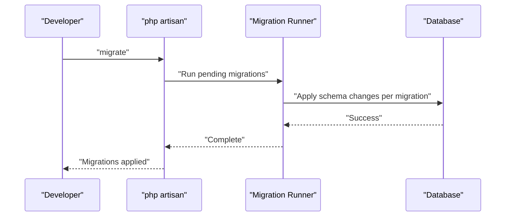
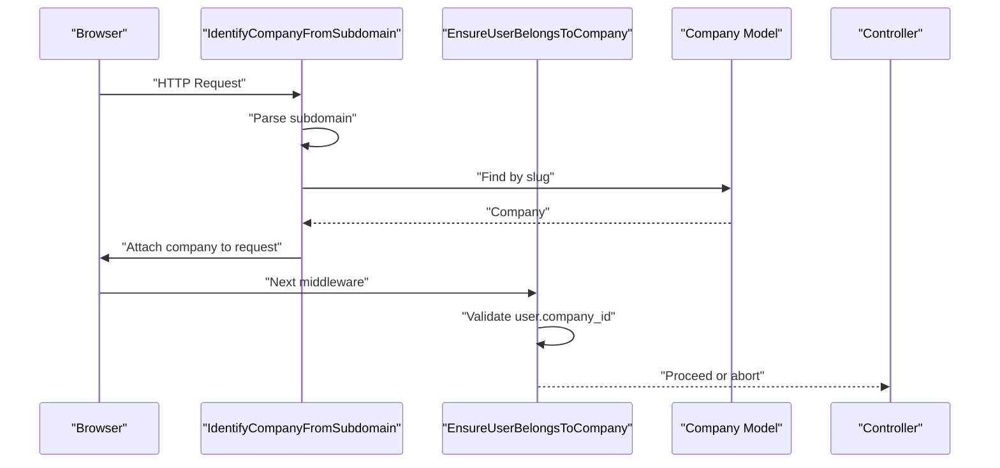
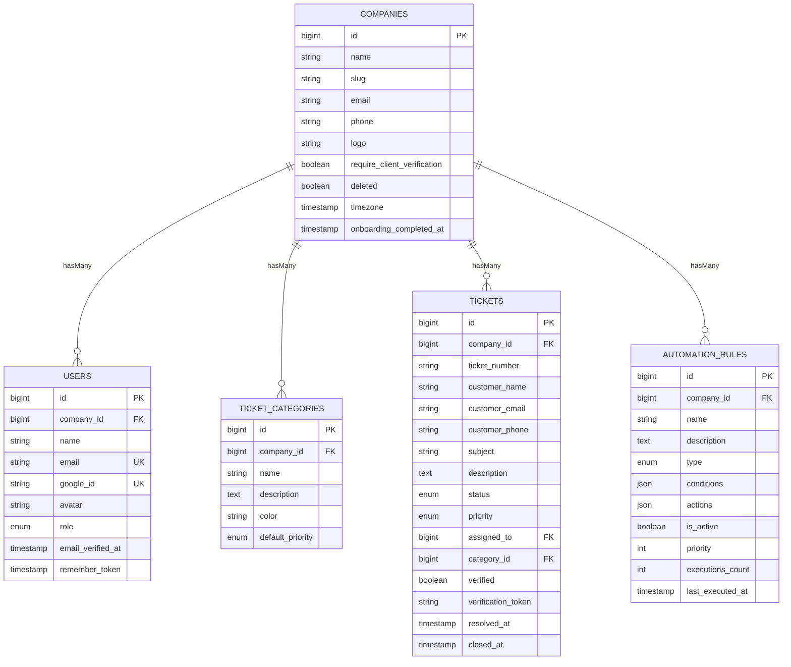
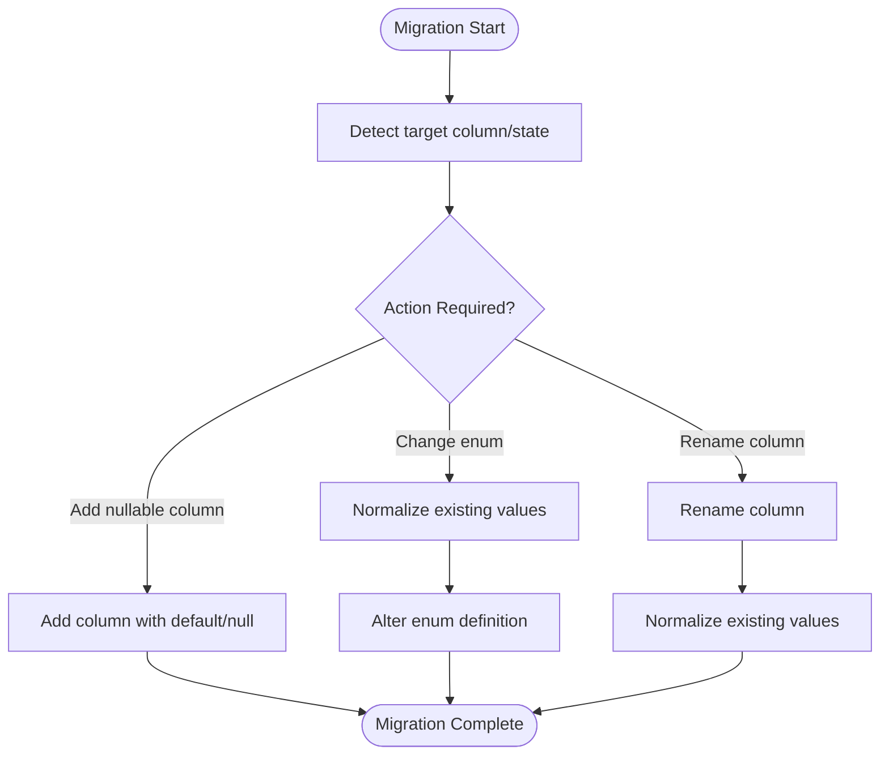
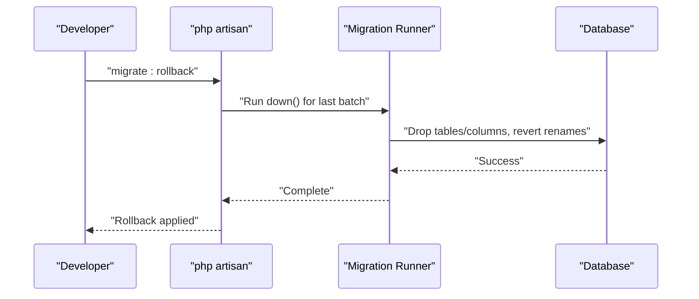
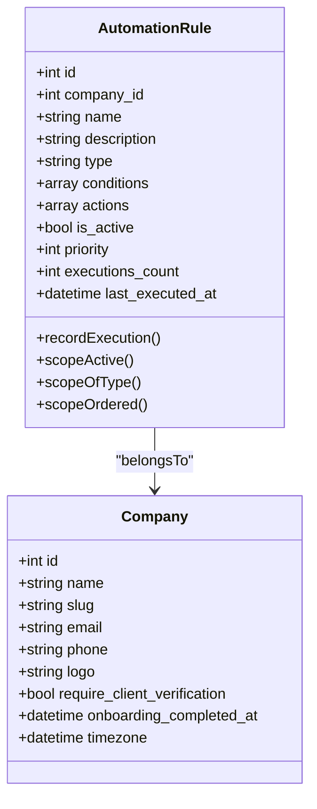
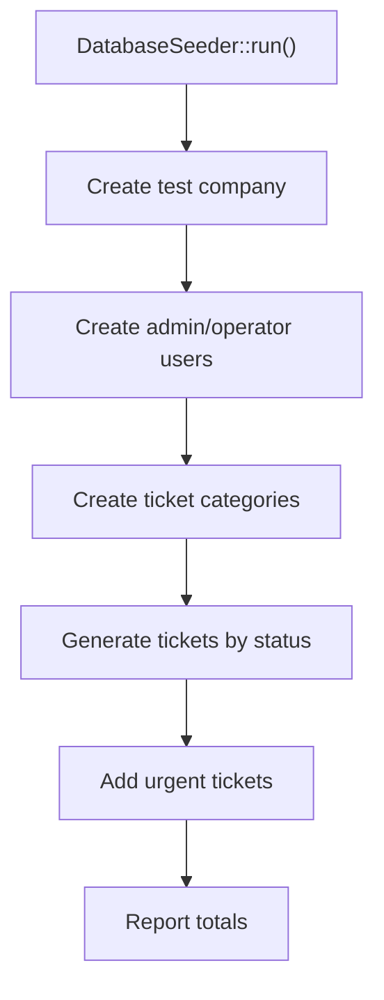
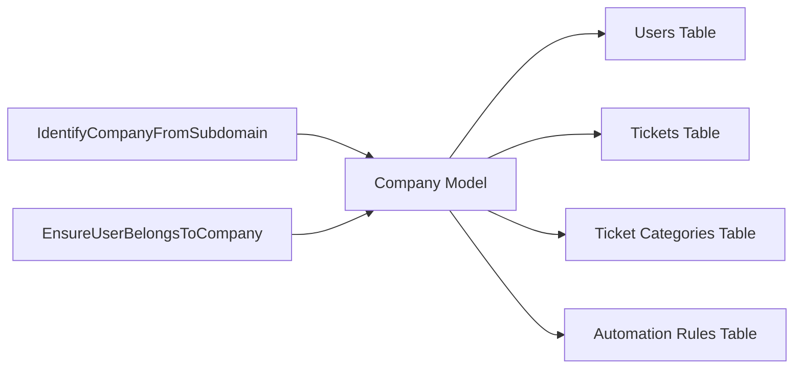

# Migration Strategies & Data Evolution

<cite>
**Referenced Files in This Document**
- [0001_01_01_000000_create_users_table.php](file://database/migrations/0001_01_01_000000_create_users_table.php)
- [2026_02_01_224200_create_companies_table.php](file://database/migrations/2026_02_01_224200_create_companies_table.php)
- [2026_02_01_224218_create_ticket_categories_table.php](file://database/migrations/2026_02_01_224218_create_ticket_categories_table.php)
- [2026_02_01_224222_create_tickets_table.php](file://database/migrations/2026_02_01_224222_create_tickets_table.php)
- [2026_03_07_080820_add_onboarding_completed_at_to_companies_table.php](file://database/migrations/2026_03_07_080820_add_onboarding_completed_at_to_companies_table.php)
- [2026_03_07_151242_update_user_role_to_operator.php](file://database/migrations/2026_03_07_151242_update_user_role_to_operator.php)
- [2026_03_07_173715_rename_primary_color_to_theme_mode_in_widget_settings.php](file://database/migrations/2026_03_07_173715_rename_primary_color_to_theme_mode_in_widget_settings.php)
- [2026_03_09_104729_create_automation_rules_table.php](file://database/migrations/2026_03_09_104729_create_automation_rules_table.php)
- [Company.php](file://app/Models/Company.php)
- [AutomationRule.php](file://app/Models/AutomationRule.php)
- [IdentifyCompanyFromSubdomain.php](file://app/Http/Middleware/IdentifyCompanyFromSubdomain.php)
- [EnsureUserBelongsToCompany.php](file://app/Http/Middleware/EnsureUserBelongsToCompany.php)
- [DatabaseSeeder.php](file://database/seeders/DatabaseSeeder.php)
- [CompanyFactory.php](file://database/factories/CompanyFactory.php)
</cite>

## Table of Contents
1. [Introduction](#introduction)
2. [Project Structure](#project-structure)
3. [Core Components](#core-components)
4. [Architecture Overview](#architecture-overview)
5. [Detailed Component Analysis](#detailed-component-analysis)
6. [Dependency Analysis](#dependency-analysis)
7. [Performance Considerations](#performance-considerations)
8. [Troubleshooting Guide](#troubleshooting-guide)
9. [Conclusion](#conclusion)
10. [Appendices](#appendices)

## Introduction
This document defines a comprehensive migration strategy for the Helpdesk System, covering the lifecycle from initial schema creation through ongoing modifications. It documents multi-tenant patterns using subdomain-based company isolation, data seeding strategies for development and testing, and approaches to schema changes such as column additions, type changes, and constraint updates. It also outlines rollback strategies, data preservation techniques, handling of breaking changes and backward compatibility, zero-downtime deployment considerations, and automation rule migration patterns. Guidance is included for production safety, testing, and rollback procedures.

## Project Structure
The migration system follows Laravel’s convention of placing timestamped migration files under database/migrations. The application enforces multi-tenancy via subdomain routing and middleware that bind requests to a company context. Models define relationships and casting for typed fields. Seeders and factories populate test data for local and CI environments.

```mermaid
graph TB
subgraph "Migrations"
M1["Initial Users<br/>0001_01_01_000000_create_users_table.php"]
M2["Companies<br/>2026_02_01_224200_create_companies_table.php"]
M3["Ticket Categories<br/>2026_02_01_224218_create_ticket_categories_table.php"]
M4["Tickets<br/>2026_02_01_224222_create_tickets_table.php"]
M5["Automation Rules<br/>2026_03_09_104729_create_automation_rules_table.php"]
M6["Add onboarding_completed_at<br/>2026_03_07_080820_add_onboarding_completed_at_to_companies_table.php"]
M7["Update role enum<br/>2026_03_07_151242_update_user_role_to_operator.php"]
M8["Rename theme column<br/>2026_03_07_173715_rename_primary_color_to_theme_mode_in_widget_settings.php"]
end
subgraph "Models"
C["Company"]
AR["AutomationRule"]
end
subgraph "Middleware"
ID["IdentifyCompanyFromSubdomain"]
UC["EnsureUserBelongsToCompany"]
end
subgraph "Seeders/Factories"
DS["DatabaseSeeder"]
CF["CompanyFactory"]
end
M1 --> C
M2 --> C
M3 --> C
M4 --> C
M5 --> AR
ID --> C
UC --> C
DS --> C
DS --> AR
CF --> C
```

**Diagram sources**
- [0001_01_01_000000_create_users_table.php:1-59](file://database/migrations/0001_01_01_000000_create_users_table.php#L1-L59)
- [2026_02_01_224200_create_companies_table.php:1-41](file://database/migrations/2026_02_01_224200_create_companies_table.php#L1-L41)
- [2026_02_01_224218_create_ticket_categories_table.php:1-33](file://database/migrations/2026_02_01_224218_create_ticket_categories_table.php#L1-L33)
- [2026_02_01_224222_create_tickets_table.php:1-62](file://database/migrations/2026_02_01_224222_create_tickets_table.php#L1-L62)
- [2026_03_09_104729_create_automation_rules_table.php:1-53](file://database/migrations/2026_03_09_104729_create_automation_rules_table.php#L1-L53)
- [Company.php:1-47](file://app/Models/Company.php#L1-L47)
- [AutomationRule.php:1-117](file://app/Models/AutomationRule.php#L1-L117)
- [IdentifyCompanyFromSubdomain.php:1-54](file://app/Http/Middleware/IdentifyCompanyFromSubdomain.php#L1-L54)
- [EnsureUserBelongsToCompany.php:1-39](file://app/Http/Middleware/EnsureUserBelongsToCompany.php#L1-L39)
- [DatabaseSeeder.php:1-151](file://database/seeders/DatabaseSeeder.php#L1-L151)
- [CompanyFactory.php:1-30](file://database/factories/CompanyFactory.php#L1-L30)

**Section sources**
- [0001_01_01_000000_create_users_table.php:1-59](file://database/migrations/0001_01_01_000000_create_users_table.php#L1-L59)
- [2026_02_01_224200_create_companies_table.php:1-41](file://database/migrations/2026_02_01_224200_create_companies_table.php#L1-L41)
- [2026_02_01_224218_create_ticket_categories_table.php:1-33](file://database/migrations/2026_02_01_224218_create_ticket_categories_table.php#L1-L33)
- [2026_02_01_224222_create_tickets_table.php:1-62](file://database/migrations/2026_02_01_224222_create_tickets_table.php#L1-L62)
- [2026_03_09_104729_create_automation_rules_table.php:1-53](file://database/migrations/2026_03_09_104729_create_automation_rules_table.php#L1-L53)
- [Company.php:1-47](file://app/Models/Company.php#L1-L47)
- [AutomationRule.php:1-117](file://app/Models/AutomationRule.php#L1-L117)
- [IdentifyCompanyFromSubdomain.php:1-54](file://app/Http/Middleware/IdentifyCompanyFromSubdomain.php#L1-L54)
- [EnsureUserBelongsToCompany.php:1-39](file://app/Http/Middleware/EnsureUserBelongsToCompany.php#L1-L39)
- [DatabaseSeeder.php:1-151](file://database/seeders/DatabaseSeeder.php#L1-L151)
- [CompanyFactory.php:1-30](file://database/factories/CompanyFactory.php#L1-L30)

## Core Components
- Multi-tenant isolation via subdomain: Requests are bound to a Company instance using middleware that extracts the subdomain and attaches the company to the request.
- Company-centric schema: Core entities (users, tickets, categories, automation rules) include company_id foreign keys to enforce tenant boundaries.
- Typed JSON for automation rules: Conditions and actions are stored as JSON with model casting to arrays for safe handling.
- Seeding for development: A seeder creates a representative dataset including companies, users, categories, and tickets.

**Section sources**
- [IdentifyCompanyFromSubdomain.php:1-54](file://app/Http/Middleware/IdentifyCompanyFromSubdomain.php#L1-L54)
- [EnsureUserBelongsToCompany.php:1-39](file://app/Http/Middleware/EnsureUserBelongsToCompany.php#L1-L39)
- [Company.php:1-47](file://app/Models/Company.php#L1-L47)
- [AutomationRule.php:1-117](file://app/Models/AutomationRule.php#L1-L117)
- [DatabaseSeeder.php:1-151](file://database/seeders/DatabaseSeeder.php#L1-L151)

## Architecture Overview
The migration lifecycle is centered around timestamped migrations that evolve the schema while preserving tenant boundaries. Middleware ensures that all requests operate within a company context, and models encapsulate relationships and data typing.

[No sources needed since this diagram shows conceptual workflow, not actual code structure]

## Detailed Component Analysis

### Multi-Tenant Subdomain Isolation
- Subdomain extraction: The middleware parses the host to extract the subdomain and resolves it to a Company record via slug.
- Request binding: The resolved Company is merged into the request and shared with views.
- Access control: A second middleware validates that authenticated users belong to the same company as the request-bound company.

**Diagram sources**
- [IdentifyCompanyFromSubdomain.php:1-54](file://app/Http/Middleware/IdentifyCompanyFromSubdomain.php#L1-L54)
- [EnsureUserBelongsToCompany.php:1-39](file://app/Http/Middleware/EnsureUserBelongsToCompany.php#L1-L39)
- [Company.php:1-47](file://app/Models/Company.php#L1-L47)

**Section sources**
- [IdentifyCompanyFromSubdomain.php:1-54](file://app/Http/Middleware/IdentifyCompanyFromSubdomain.php#L1-L54)
- [EnsureUserBelongsToCompany.php:1-39](file://app/Http/Middleware/EnsureUserBelongsToCompany.php#L1-L39)
- [Company.php:1-47](file://app/Models/Company.php#L1-L47)

### Initial Schema Creation
- Users table: Includes company_id, OAuth-friendly nullable password, and indexes for performance.
- Companies table: Contains company metadata, soft deletes, and composite indexing for filtered queries.
- Ticket categories and tickets: Enforce company isolation via foreign keys and include extensive indexes for common filters.
- Automation rules: JSON-backed conditions/actions with typed casting and multi-column indexes for efficient filtering.

**Diagram sources**
- [0001_01_01_000000_create_users_table.php:1-59](file://database/migrations/0001_01_01_000000_create_users_table.php#L1-L59)
- [2026_02_01_224200_create_companies_table.php:1-41](file://database/migrations/2026_02_01_224200_create_companies_table.php#L1-L41)
- [2026_02_01_224218_create_ticket_categories_table.php:1-33](file://database/migrations/2026_02_01_224218_create_ticket_categories_table.php#L1-L33)
- [2026_02_01_224222_create_tickets_table.php:1-62](file://database/migrations/2026_02_01_224222_create_tickets_table.php#L1-L62)
- [2026_03_09_104729_create_automation_rules_table.php:1-53](file://database/migrations/2026_03_09_104729_create_automation_rules_table.php#L1-L53)

**Section sources**
- [0001_01_01_000000_create_users_table.php:1-59](file://database/migrations/0001_01_01_000000_create_users_table.php#L1-L59)
- [2026_02_01_224200_create_companies_table.php:1-41](file://database/migrations/2026_02_01_224200_create_companies_table.php#L1-L41)
- [2026_02_01_224218_create_ticket_categories_table.php:1-33](file://database/migrations/2026_02_01_224218_create_ticket_categories_table.php#L1-L33)
- [2026_02_01_224222_create_tickets_table.php:1-62](file://database/migrations/2026_02_01_224222_create_tickets_table.php#L1-L62)
- [2026_03_09_104729_create_automation_rules_table.php:1-53](file://database/migrations/2026_03_09_104729_create_automation_rules_table.php#L1-L53)

### Schema Modifications: Column Additions, Type Changes, Constraints
- Adding nullable columns with defaults: New optional fields are introduced with after() placement and nullable() to preserve existing rows.
- Enum updates with data normalization: Existing values are migrated before altering the enum definition to avoid constraint violations.
- Column renaming with value normalization: A legacy column is renamed and existing values are normalized to the new semantic.

**Diagram sources**
- [2026_03_07_080820_add_onboarding_completed_at_to_companies_table.php:1-35](file://database/migrations/2026_03_07_080820_add_onboarding_completed_at_to_companies_table.php#L1-L35)
- [2026_03_07_151242_update_user_role_to_operator.php:1-36](file://database/migrations/2026_03_07_151242_update_user_role_to_operator.php#L1-L36)
- [2026_03_07_173715_rename_primary_color_to_theme_mode_in_widget_settings.php:1-28](file://database/migrations/2026_03_07_173715_rename_primary_color_to_theme_mode_in_widget_settings.php#L1-L28)

**Section sources**
- [2026_03_07_080820_add_onboarding_completed_at_to_companies_table.php:1-35](file://database/migrations/2026_03_07_080820_add_onboarding_completed_at_to_companies_table.php#L1-L35)
- [2026_03_07_151242_update_user_role_to_operator.php:1-36](file://database/migrations/2026_03_07_151242_update_user_role_to_operator.php#L1-L36)
- [2026_03_07_173715_rename_primary_color_to_theme_mode_in_widget_settings.php:1-28](file://database/migrations/2026_03_07_173715_rename_primary_color_to_theme_mode_in_widget_settings.php#L1-L28)

### Rollback Strategies and Data Preservation
- Rollbacks remove tables or drop/rename columns as appropriate.
- Data normalization is reversed in down() to restore previous semantics.
- Soft deletes and timestamps enable selective restoration of records when needed.

**Diagram sources**
- [2026_03_07_080820_add_onboarding_completed_at_to_companies_table.php:24-34](file://database/migrations/2026_03_07_080820_add_onboarding_completed_at_to_companies_table.php#L24-L34)
- [2026_03_07_151242_update_user_role_to_operator.php:27-35](file://database/migrations/2026_03_07_151242_update_user_role_to_operator.php#L27-L35)
- [2026_03_07_173715_rename_primary_color_to_theme_mode_in_widget_settings.php:19-27](file://database/migrations/2026_03_07_173715_rename_primary_color_to_theme_mode_in_widget_settings.php#L19-L27)

**Section sources**
- [2026_03_07_080820_add_onboarding_completed_at_to_companies_table.php:24-34](file://database/migrations/2026_03_07_080820_add_onboarding_completed_at_to_companies_table.php#L24-L34)
- [2026_03_07_151242_update_user_role_to_operator.php:27-35](file://database/migrations/2026_03_07_151242_update_user_role_to_operator.php#L27-L35)
- [2026_03_07_173715_rename_primary_color_to_theme_mode_in_widget_settings.php:19-27](file://database/migrations/2026_03_07_173715_rename_primary_color_to_theme_mode_in_widget_settings.php#L19-L27)

### Automation Rule Migration Patterns
- JSON-backed conditions/actions: Stored as JSON with model casting to arrays, enabling flexible rule definitions.
- Multi-column indexes: Composite indexes on company_id, is_active, type and priority support efficient filtering and ordering.
- Execution tracking: Separate counters and timestamps allow auditing and performance monitoring.

**Diagram sources**
- [2026_03_09_104729_create_automation_rules_table.php:1-53](file://database/migrations/2026_03_09_104729_create_automation_rules_table.php#L1-L53)
- [AutomationRule.php:1-117](file://app/Models/AutomationRule.php#L1-L117)
- [Company.php:1-47](file://app/Models/Company.php#L1-L47)

**Section sources**
- [2026_03_09_104729_create_automation_rules_table.php:1-53](file://database/migrations/2026_03_09_104729_create_automation_rules_table.php#L1-L53)
- [AutomationRule.php:1-117](file://app/Models/AutomationRule.php#L1-L117)
- [Company.php:1-47](file://app/Models/Company.php#L1-L47)

### Data Seeding Strategies
- Development/testing datasets: A seeder creates a realistic mix of companies, users, categories, and tickets with varied statuses and priorities.
- Factories: Factories provide default attributes and states for scalable, repeatable test data generation.
- Representative distributions: The seeder generates tickets across statuses and adds urgent tickets to simulate real-world workloads.

**Diagram sources**
- [DatabaseSeeder.php:1-151](file://database/seeders/DatabaseSeeder.php#L1-L151)
- [CompanyFactory.php:1-30](file://database/factories/CompanyFactory.php#L1-L30)

**Section sources**
- [DatabaseSeeder.php:1-151](file://database/seeders/DatabaseSeeder.php#L1-L151)
- [CompanyFactory.php:1-30](file://database/factories/CompanyFactory.php#L1-L30)

## Dependency Analysis
- Middleware depends on the Company model to resolve tenant context.
- Models depend on Eloquent relationships and casting to maintain data integrity.
- Migrations depend on each other via foreign keys and shared tenant columns.

**Diagram sources**
- [IdentifyCompanyFromSubdomain.php:1-54](file://app/Http/Middleware/IdentifyCompanyFromSubdomain.php#L1-L54)
- [EnsureUserBelongsToCompany.php:1-39](file://app/Http/Middleware/EnsureUserBelongsToCompany.php#L1-L39)
- [Company.php:1-47](file://app/Models/Company.php#L1-L47)
- [0001_01_01_000000_create_users_table.php:1-59](file://database/migrations/0001_01_01_000000_create_users_table.php#L1-L59)
- [2026_02_01_224222_create_tickets_table.php:1-62](file://database/migrations/2026_02_01_224222_create_tickets_table.php#L1-L62)
- [2026_02_01_224218_create_ticket_categories_table.php:1-33](file://database/migrations/2026_02_01_224218_create_ticket_categories_table.php#L1-L33)
- [2026_03_09_104729_create_automation_rules_table.php:1-53](file://database/migrations/2026_03_09_104729_create_automation_rules_table.php#L1-L53)

**Section sources**
- [IdentifyCompanyFromSubdomain.php:1-54](file://app/Http/Middleware/IdentifyCompanyFromSubdomain.php#L1-L54)
- [EnsureUserBelongsToCompany.php:1-39](file://app/Http/Middleware/EnsureUserBelongsToCompany.php#L1-L39)
- [Company.php:1-47](file://app/Models/Company.php#L1-L47)
- [0001_01_01_000000_create_users_table.php:1-59](file://database/migrations/0001_01_01_000000_create_users_table.php#L1-L59)
- [2026_02_01_224222_create_tickets_table.php:1-62](file://database/migrations/2026_02_01_224222_create_tickets_table.php#L1-L62)
- [2026_02_01_224218_create_ticket_categories_table.php:1-33](file://database/migrations/2026_02_01_224218_create_ticket_categories_table.php#L1-L33)
- [2026_03_09_104729_create_automation_rules_table.php:1-53](file://database/migrations/2026_03_09_104729_create_automation_rules_table.php#L1-L53)

## Performance Considerations
- Indexes on foreign keys and frequently queried columns improve join and filter performance.
- Composite indexes on company_id with booleans and enums optimize rule and ticket filtering.
- JSON fields for automation rules enable flexible schemas while maintaining typed casting for safe access.

[No sources needed since this section provides general guidance]

## Troubleshooting Guide
- Subdomain resolution failures: Ensure the subdomain matches the company slug and that middleware runs before route resolution.
- Access denied errors: Confirm the authenticated user belongs to the same company as the request-bound company.
- Migration failures on enum changes: Normalize existing values before altering the enum definition.
- Rollback issues: Verify that down() removes added columns and restores renames; ensure data normalization reversals are applied.

**Section sources**
- [IdentifyCompanyFromSubdomain.php:1-54](file://app/Http/Middleware/IdentifyCompanyFromSubdomain.php#L1-L54)
- [EnsureUserBelongsToCompany.php:1-39](file://app/Http/Middleware/EnsureUserBelongsToCompany.php#L1-L39)
- [2026_03_07_151242_update_user_role_to_operator.php:1-36](file://database/migrations/2026_03_07_151242_update_user_role_to_operator.php#L1-L36)
- [2026_03_07_173715_rename_primary_color_to_theme_mode_in_widget_settings.php:1-28](file://database/migrations/2026_03_07_173715_rename_primary_color_to_theme_mode_in_widget_settings.php#L1-L28)

## Conclusion
The Helpdesk System employs a robust, multi-tenant migration strategy centered on subdomain isolation and company-scoped schemas. Migrations evolve incrementally with careful attention to data preservation, backward compatibility, and typed JSON for complex rule definitions. Middleware enforces tenant boundaries, while seeders and factories provide reliable test data. The documented patterns and procedures support safe, repeatable deployments and effective rollbacks.

## Appendices
- Best practices for zero-downtime deployments:
  - Use additive-only schema changes where possible.
  - Normalize data before altering constraints or enums.
  - Test rollbacks locally and in staging before production.
  - Prefer JSON-backed fields for evolving rule structures.
- Production safety checklist:
  - Review migration order and dependencies.
  - Validate subdomain-to-company mapping in production DNS.
  - Confirm middleware precedence and user-company alignment.
  - Back up databases before running migrations in production.

[No sources needed since this section summarizes without analyzing specific files]