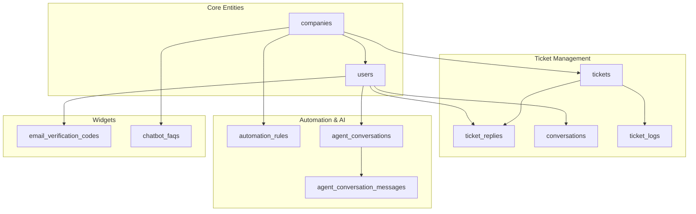
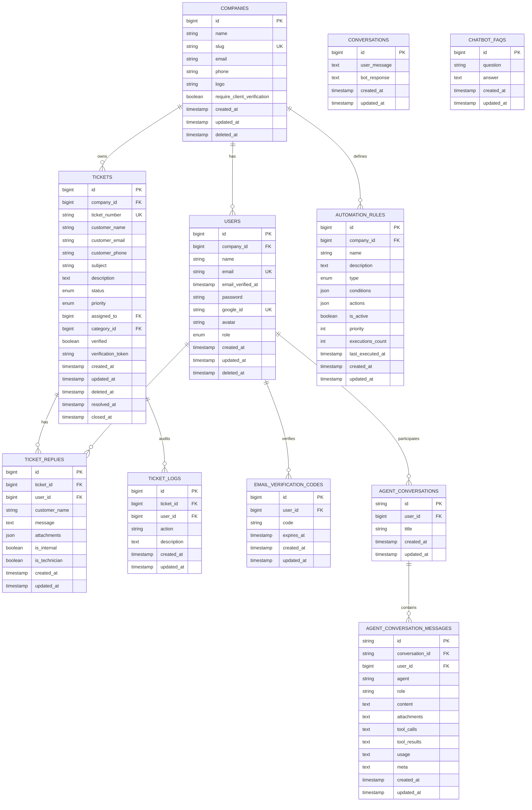
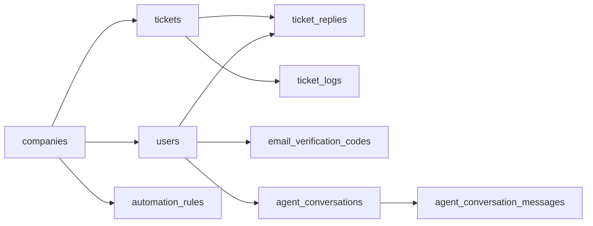

# Table Structures & Schema Design

<cite>
**Referenced Files in This Document**
- [2026_02_01_224200_create_companies_table.php](file://database/migrations/2026_02_01_224200_create_companies_table.php)
- [0001_01_01_000000_create_users_table.php](file://database/migrations/0001_01_01_000000_create_users_table.php)
- [2026_03_07_080820_add_onboarding_completed_at_to_companies_table.php](file://database/migrations/2026_03_07_080820_add_onboarding_completed_at_to_companies_table.php)
- [2026_03_08_182155_add_soft_deletes_to_users_table.php](file://database/migrations/2026_03_08_182155_add_soft_deletes_to_users_table.php)
- [2026_02_01_224222_create_tickets_table.php](file://database/migrations/2026_02_01_224222_create_tickets_table.php)
- [2026_02_01_224225_create_ticket_replies_table.php](file://database/migrations/2026_02_01_224225_create_ticket_replies_table.php)
- [2026_03_10_045512_add_attachments_to_ticket_replies_table.php](file://database/migrations/2026_03_10_045512_add_attachments_to_ticket_replies_table.php)
- [2026_03_08_041644_create_conversations_table.php](file://database/migrations/2026_03_08_041644_create_conversations_table.php)
- [2026_03_10_230354_create_ticket_logs_table.php](file://database/migrations/2026_03_10_230354_create_ticket_logs_table.php)
- [2026_03_07_022013_create_email_verification_codes_table.php](file://database/migrations/2026_03_07_022013_create_email_verification_codes_table.php)
- [2026_03_08_034518_create_chatbot_faqs_table.php](file://database/migrations/2026_03_08_034518_create_chatbot_faqs_table.php)
- [2026_03_09_104729_create_automation_rules_table.php](file://database/migrations/2026_03_09_104729_create_automation_rules_table.php)
- [2026_03_10_065534_create_agent_conversations_table.php](file://database/migrations/2026_03_10_065534_create_agent_conversations_table.php)
</cite>

## Table of Contents
1. [Introduction](#introduction)
2. [Project Structure](#project-structure)
3. [Core Components](#core-components)
4. [Architecture Overview](#architecture-overview)
5. [Detailed Component Analysis](#detailed-component-analysis)
6. [Dependency Analysis](#dependency-analysis)
7. [Performance Considerations](#performance-considerations)
8. [Troubleshooting Guide](#troubleshooting-guide)
9. [Conclusion](#conclusion)

## Introduction
This document provides a comprehensive overview of the Helpdesk System database schema. It focuses on the core tables involved in ticket management, user/company relationships, automation rules, and widget-related features such as email verification and chatbot FAQs. For each table, we describe column definitions, data types, constraints, indexes, and the rationale behind indexing choices. We also outline soft deletes, audit trails, and considerations for partitioning and data retention.

## Project Structure
The schema is primarily defined in Laravel migration files under the database/migrations directory. Each migration creates or modifies a table and defines indexes tailored to common query patterns (filtering, sorting, joins).

**Diagram sources**
- [2026_02_01_224200_create_companies_table.php:14-30](file://database/migrations/2026_02_01_224200_create_companies_table.php#L14-L30)
- [0001_01_01_000000_create_users_table.php:14-46](file://database/migrations/0001_01_01_000000_create_users_table.php#L14-L46)
- [2026_02_01_224222_create_tickets_table.php:11-54](file://database/migrations/2026_02_01_224222_create_tickets_table.php#L11-L54)
- [2026_02_01_224225_create_ticket_replies_table.php:11-27](file://database/migrations/2026_02_01_224225_create_ticket_replies_table.php#L11-L27)
- [2026_03_08_041644_create_conversations_table.php:14-19](file://database/migrations/2026_03_08_041644_create_conversations_table.php#L14-L19)
- [2026_03_10_230354_create_ticket_logs_table.php:14-21](file://database/migrations/2026_03_10_230354_create_ticket_logs_table.php#L14-L21)
- [2026_03_09_104729_create_automation_rules_table.php:14-42](file://database/migrations/2026_03_09_104729_create_automation_rules_table.php#L14-L42)
- [2026_03_10_065534_create_agent_conversations_table.php:14-39](file://database/migrations/2026_03_10_065534_create_agent_conversations_table.php#L14-L39)
- [2026_03_07_022013_create_email_verification_codes_table.php:14-19](file://database/migrations/2026_03_07_022013_create_email_verification_codes_table.php#L14-L19)
- [2026_03_08_034518_create_chatbot_faqs_table.php:14-18](file://database/migrations/2026_03_08_034518_create_chatbot_faqs_table.php#L14-L18)

**Section sources**
- [2026_02_01_224200_create_companies_table.php:14-30](file://database/migrations/2026_02_01_224200_create_companies_table.php#L14-L30)
- [0001_01_01_000000_create_users_table.php:14-46](file://database/migrations/0001_01_01_000000_create_users_table.php#L14-L46)

## Core Components
This section documents the primary tables and their roles in the helpdesk system.

- Companies
  - Purpose: Stores client organizations and onboarding metadata.
  - Soft delete: Yes.
  - Audit trail: Created and updated timestamps.
  - Indexes: slug (unique), email, created_at, composite (require_client_verification, created_at).
  - Notes: Additional timestamp column added later via a separate migration.

- Users
  - Purpose: Operators and admins scoped to a company; supports OAuth and sessions.
  - Soft delete: Yes.
  - Audit trail: Created and updated timestamps.
  - Indexes: company_id, email (unique), google_id.
  - Constraints: Unique combinations enforced by indexes; foreign key to companies.

- Tickets
  - Purpose: Core ticket entity with customer info, status, priority, assignment, and verification.
  - Soft delete: Yes.
  - Audit trail: Created and updated timestamps; resolved_at, closed_at for lifecycle tracking.
  - Indexes: company_id, ticket_number (unique), customer_email, status, priority, assigned_to, verified, created_at.
  - Constraints: Unique ticket_number; enums for status and priority; foreign keys to users and categories.

- Ticket Replies
  - Purpose: Messages and internal notes associated with tickets; supports attachments and technician flag.
  - Audit trail: Created and updated timestamps.
  - Indexes: ticket_id, user_id, created_at.
  - Constraints: Foreign key to tickets; either user_id or customer_name populated.

- Conversations
  - Purpose: Simple chat history between user and bot.
  - Audit trail: Created and updated timestamps.
  - Indexes: None defined.

- Ticket Logs
  - Purpose: Audit trail for ticket events (assign, reply, status change).
  - Audit trail: Created and updated timestamps.
  - Indexes: None defined.

- Email Verification Codes
  - Purpose: One-time codes for email verification linked to users.
  - Audit trail: Created and updated timestamps.
  - Indexes: None defined.

- Chatbot FAQs
  - Purpose: Static Q&A for the chatbot.
  - Audit trail: Created and updated timestamps.
  - Indexes: None defined.

- Automation Rules
  - Purpose: Dynamic rules with JSON conditions/actions for assignment, priority, auto-reply, escalation.
  - Audit trail: Created and updated timestamps; execution counters and last execution timestamp.
  - Indexes: composite (company_id, is_active, type), composite (company_id, priority).
  - Constraints: Enum type; JSON fields for conditions and actions.

- Agent Conversations (AI)
  - Purpose: AI-assisted conversations with messages and tooling metadata.
  - Audit trail: Created and updated timestamps.
  - Indexes: composite (user_id, updated_at) on conversations; composite (conversation_id, user_id, updated_at) and user_id on messages.
  - Constraints: UUID-style IDs; foreign keys to users.

**Section sources**
- [2026_02_01_224200_create_companies_table.php:14-30](file://database/migrations/2026_02_01_224200_create_companies_table.php#L14-L30)
- [0001_01_01_000000_create_users_table.php:14-46](file://database/migrations/0001_01_01_000000_create_users_table.php#L14-L46)
- [2026_03_08_182155_add_soft_deletes_to_users_table.php:14-16](file://database/migrations/2026_03_08_182155_add_soft_deletes_to_users_table.php#L14-L16)
- [2026_02_01_224222_create_tickets_table.php:11-54](file://database/migrations/2026_02_01_224222_create_tickets_table.php#L11-L54)
- [2026_02_01_224225_create_ticket_replies_table.php:11-27](file://database/migrations/2026_02_01_224225_create_ticket_replies_table.php#L11-L27)
- [2026_03_10_045512_add_attachments_to_ticket_replies_table.php:14-17](file://database/migrations/2026_03_10_045512_add_attachments_to_ticket_replies_table.php#L14-L17)
- [2026_03_08_041644_create_conversations_table.php:14-19](file://database/migrations/2026_03_08_041644_create_conversations_table.php#L14-L19)
- [2026_03_10_230354_create_ticket_logs_table.php:14-21](file://database/migrations/2026_03_10_230354_create_ticket_logs_table.php#L14-L21)
- [2026_03_07_022013_create_email_verification_codes_table.php:14-19](file://database/migrations/2026_03_07_022013_create_email_verification_codes_table.php#L14-L19)
- [2026_03_08_034518_create_chatbot_faqs_table.php:14-18](file://database/migrations/2026_03_08_034518_create_chatbot_faqs_table.php#L14-L18)
- [2026_03_09_104729_create_automation_rules_table.php:14-42](file://database/migrations/2026_03_09_104729_create_automation_rules_table.php#L14-L42)
- [2026_03_10_065534_create_agent_conversations_table.php:14-39](file://database/migrations/2026_03_10_065534_create_agent_conversations_table.php#L14-L39)

## Architecture Overview
The schema centers around companies and users, with tickets as the core business object. Replies and logs provide auditability. Automation rules encapsulate dynamic behavior. Widgets integrate external flows (email verification, chatbot).

**Diagram sources**
- [2026_02_01_224200_create_companies_table.php:14-30](file://database/migrations/2026_02_01_224200_create_companies_table.php#L14-L30)
- [0001_01_01_000000_create_users_table.php:14-46](file://database/migrations/0001_01_01_000000_create_users_table.php#L14-L46)
- [2026_02_01_224222_create_tickets_table.php:11-54](file://database/migrations/2026_02_01_224222_create_tickets_table.php#L11-L54)
- [2026_02_01_224225_create_ticket_replies_table.php:11-27](file://database/migrations/2026_02_01_224225_create_ticket_replies_table.php#L11-L27)
- [2026_03_08_041644_create_conversations_table.php:14-19](file://database/migrations/2026_03_08_041644_create_conversations_table.php#L14-L19)
- [2026_03_10_230354_create_ticket_logs_table.php:14-21](file://database/migrations/2026_03_10_230354_create_ticket_logs_table.php#L14-L21)
- [2026_03_07_022013_create_email_verification_codes_table.php:14-19](file://database/migrations/2026_03_07_022013_create_email_verification_codes_table.php#L14-L19)
- [2026_03_08_034518_create_chatbot_faqs_table.php:14-18](file://database/migrations/2026_03_08_034518_create_chatbot_faqs_table.php#L14-L18)
- [2026_03_09_104729_create_automation_rules_table.php:14-42](file://database/migrations/2026_03_09_104729_create_automation_rules_table.php#L14-L42)
- [2026_03_10_065534_create_agent_conversations_table.php:14-39](file://database/migrations/2026_03_10_065534_create_agent_conversations_table.php#L14-L39)

## Detailed Component Analysis

### Companies
- Columns
  - id: Primary key.
  - name: Non-null string.
  - slug: Unique string.
  - email: String.
  - phone: String.
  - logo: String.
  - require_client_verification: Boolean.
  - created_at, updated_at, deleted_at: Timestamps (soft delete).
- Constraints
  - Unique index on slug.
  - Composite index on (require_client_verification, created_at).
- Indexes
  - slug: Unique, explicit index for clarity.
  - email: For lookup by email.
  - created_at: For sorting by creation date.
  - (require_client_verification, created_at): For filtered queries.
- Notes
  - Additional timestamp column added later via a separate migration.

**Section sources**
- [2026_02_01_224200_create_companies_table.php:14-30](file://database/migrations/2026_02_01_224200_create_companies_table.php#L14-L30)
- [2026_03_07_080820_add_onboarding_completed_at_to_companies_table.php](file://database/migrations/2026_03_07_080820_add_onboarding_completed_at_to_companies_table.php)

### Users
- Columns
  - id: Primary key.
  - company_id: Foreign key to companies; nullable initially, then constrained.
  - name: Non-null string.
  - email: Unique string.
  - email_verified_at: Timestamp.
  - password: String (nullable for OAuth).
  - google_id: Unique string.
  - avatar: String.
  - role: Enum with default.
  - remember_token: Token for sessions.
  - created_at, updated_at: Timestamps.
  - deleted_at: Soft delete.
- Constraints
  - Unique indexes on email and google_id.
  - Foreign key to companies.
- Indexes
  - company_id, email, google_id.
- Notes
  - Soft delete added via a dedicated migration.

**Section sources**
- [0001_01_01_000000_create_users_table.php:14-46](file://database/migrations/0001_01_01_000000_create_users_table.php#L14-L46)
- [2026_03_08_182155_add_soft_deletes_to_users_table.php:14-16](file://database/migrations/2026_03_08_182155_add_soft_deletes_to_users_table.php#L14-L16)

### Tickets
- Columns
  - id: Primary key.
  - company_id: Foreign key to companies (cascade delete).
  - ticket_number: Unique string.
  - customer_name, customer_email, customer_phone: Customer contact (no account).
  - subject: String.
  - description: Text.
  - status: Enum with default.
  - priority: Enum with default.
  - assigned_to: Foreign key to users (set null on delete).
  - category_id: Foreign key to ticket_categories (set null on delete).
  - verified: Boolean.
  - verification_token: Unique string.
  - created_at, updated_at: Timestamps.
  - deleted_at: Soft delete.
  - resolved_at, closed_at: Lifecycle timestamps.
- Constraints
  - Unique ticket_number.
  - Enums for status and priority.
  - Foreign keys to users and categories.
- Indexes
  - company_id, ticket_number, customer_email, status, priority, assigned_to, verified, created_at.

**Section sources**
- [2026_02_01_224222_create_tickets_table.php:11-54](file://database/migrations/2026_02_01_224222_create_tickets_table.php#L11-L54)

### Ticket Replies
- Columns
  - id: Primary key.
  - ticket_id: Foreign key to tickets (cascade delete).
  - user_id: Foreign key to users (set null on delete).
  - customer_name: String (when replying as guest).
  - message: Text.
  - attachments: JSON array/object (nullable).
  - is_internal: Boolean (internal notes vs public replies).
  - is_technician: Boolean (technician flag).
  - created_at, updated_at: Timestamps.
- Constraints
  - Foreign keys to tickets and users.
  - Mutually exclusive identity: either user_id or customer_name.
- Indexes
  - ticket_id, user_id, created_at.

**Section sources**
- [2026_02_01_224225_create_ticket_replies_table.php:11-27](file://database/migrations/2026_02_01_224225_create_ticket_replies_table.php#L11-L27)
- [2026_03_10_045512_add_attachments_to_ticket_replies_table.php:14-17](file://database/migrations/2026_03_10_045512_add_attachments_to_ticket_replies_table.php#L14-L17)

### Conversations
- Columns
  - id: Primary key.
  - user_message: Text.
  - bot_response: Text.
  - created_at, updated_at: Timestamps.
- Notes
  - No indexes defined.

**Section sources**
- [2026_03_08_041644_create_conversations_table.php:14-19](file://database/migrations/2026_03_08_041644_create_conversations_table.php#L14-L19)

### Ticket Logs
- Columns
  - id: Primary key.
  - ticket_id: Foreign key to tickets (cascade delete).
  - user_id: Foreign key to users (null on delete).
  - action: String.
  - description: Text.
  - created_at, updated_at: Timestamps.
- Notes
  - No indexes defined.

**Section sources**
- [2026_03_10_230354_create_ticket_logs_table.php:14-21](file://database/migrations/2026_03_10_230354_create_ticket_logs_table.php#L14-L21)

### Email Verification Codes
- Columns
  - id: Primary key.
  - user_id: Foreign key to users (cascade delete).
  - code: String (fixed length).
  - expires_at: Timestamp.
  - created_at, updated_at: Timestamps.
- Notes
  - No indexes defined.

**Section sources**
- [2026_03_07_022013_create_email_verification_codes_table.php:14-19](file://database/migrations/2026_03_07_022013_create_email_verification_codes_table.php#L14-L19)

### Chatbot FAQs
- Columns
  - id: Primary key.
  - question: String.
  - answer: Text.
  - created_at, updated_at: Timestamps.
- Notes
  - No indexes defined.

**Section sources**
- [2026_03_08_034518_create_chatbot_faqs_table.php:14-18](file://database/migrations/2026_03_08_034518_create_chatbot_faqs_table.php#L14-L18)

### Automation Rules
- Columns
  - id: Primary key.
  - company_id: Foreign key to companies (cascade delete).
  - name: String.
  - description: Text.
  - type: Enum (assignment, priority, auto_reply, escalation).
  - conditions: JSON.
  - actions: JSON.
  - is_active: Boolean.
  - priority: Integer.
  - executions_count: Integer.
  - last_executed_at: Timestamp.
  - created_at, updated_at: Timestamps.
- Constraints
  - Enum type.
  - JSON fields for conditions and actions.
- Indexes
  - (company_id, is_active, type): For filtering rules by company and activity/type.
  - (company_id, priority): For ordered execution per company.

**Section sources**
- [2026_03_09_104729_create_automation_rules_table.php:14-42](file://database/migrations/2026_03_09_104729_create_automation_rules_table.php#L14-L42)

### Agent Conversations (AI)
- Columns
  - agent_conversations.id: Primary key (string).
  - agent_conversations.user_id: Foreign key to users.
  - agent_conversations.title: String.
  - agent_conversations.created_at, updated_at: Timestamps.
  - agent_conversation_messages.id: Primary key (string).
  - agent_conversation_messages.conversation_id: Foreign key to agent_conversations.
  - agent_conversation_messages.user_id: Foreign key to users.
  - agent_conversation_messages.agent: String.
  - agent_conversation_messages.role: String.
  - agent_conversation_messages.content: Text.
  - agent_conversation_messages.attachments: Text.
  - agent_conversation_messages.tool_calls: Text.
  - agent_conversation_messages.tool_results: Text.
  - agent_conversation_messages.usage: Text.
  - agent_conversation_messages.meta: Text.
  - agent_conversation_messages.created_at, updated_at: Timestamps.
- Indexes
  - agent_conversations: (user_id, updated_at).
  - agent_conversation_messages: (conversation_id, user_id, updated_at), user_id.

**Section sources**
- [2026_03_10_065534_create_agent_conversations_table.php:14-39](file://database/migrations/2026_03_10_065534_create_agent_conversations_table.php#L14-L39)

## Dependency Analysis
The following diagram shows foreign key relationships among core tables.

**Diagram sources**
- [2026_02_01_224200_create_companies_table.php:14-30](file://database/migrations/2026_02_01_224200_create_companies_table.php#L14-L30)
- [0001_01_01_01_000000_create_users_table.php:14-46](file://database/migrations/0001_01_01_000000_create_users_table.php#L14-L46)
- [2026_02_01_224222_create_tickets_table.php:11-54](file://database/migrations/2026_02_01_224222_create_tickets_table.php#L11-L54)
- [2026_02_01_224225_create_ticket_replies_table.php:11-27](file://database/migrations/2026_02_01_224225_create_ticket_replies_table.php#L11-L27)
- [2026_03_10_230354_create_ticket_logs_table.php:14-21](file://database/migrations/2026_03_10_230354_create_ticket_logs_table.php#L14-L21)
- [2026_03_07_022013_create_email_verification_codes_table.php:14-19](file://database/migrations/2026_03_07_022013_create_email_verification_codes_table.php#L14-L19)
- [2026_03_09_104729_create_automation_rules_table.php:14-42](file://database/migrations/2026_03_09_104729_create_automation_rules_table.php#L14-L42)
- [2026_03_10_065534_create_agent_conversations_table.php:14-39](file://database/migrations/2026_03_10_065534_create_agent_conversations_table.php#L14-L39)

**Section sources**
- [2026_02_01_224200_create_companies_table.php:14-30](file://database/migrations/2026_02_01_224200_create_companies_table.php#L14-L30)
- [0001_01_01_000000_create_users_table.php:14-46](file://database/migrations/0001_01_01_000000_create_users_table.php#L14-L46)
- [2026_02_01_224222_create_tickets_table.php:11-54](file://database/migrations/2026_02_01_224222_create_tickets_table.php#L11-L54)
- [2026_02_01_224225_create_ticket_replies_table.php:11-27](file://database/migrations/2026_02_01_224225_create_ticket_replies_table.php#L11-L27)
- [2026_03_10_230354_create_ticket_logs_table.php:14-21](file://database/migrations/2026_03_10_230354_create_ticket_logs_table.php#L14-L21)
- [2026_03_07_022013_create_email_verification_codes_table.php:14-19](file://database/migrations/2026_03_07_022013_create_email_verification_codes_table.php#L14-L19)
- [2026_03_09_104729_create_automation_rules_table.php:14-42](file://database/migrations/2026_03_09_104729_create_automation_rules_table.php#L14-L42)
- [2026_03_10_065534_create_agent_conversations_table.php:14-39](file://database/migrations/2026_03_10_065534_create_agent_conversations_table.php#L14-L39)

## Performance Considerations
Indexing strategy rationale:
- Companies
  - slug: Unique index supports fast lookups by slug.
  - email: Supports email-based lookups.
  - created_at: Enables chronological sorting.
  - (require_client_verification, created_at): Efficient filtering and sorting for onboarding workflows.
- Users
  - company_id: Joins with companies and tickets.
  - email/google_id: Uniqueness and fast identity resolution.
- Tickets
  - company_id: Filters by company.
  - ticket_number: Unique lookup.
  - customer_email: Guest/customer queries.
  - status/priority: Filtering for dashboards and SLAs.
  - assigned_to: Assignment analytics.
  - verified: Verification state filtering.
  - created_at: Sorting by recency.
- Ticket Replies
  - ticket_id: Per-ticket queries.
  - user_id: Agent activity.
  - created_at: Recency sorting.
- Automation Rules
  - (company_id, is_active, type): Filter by company, activation, and rule type.
  - (company_id, priority): Ordered execution per company.
- Agent Conversations
  - (user_id, updated_at): Efficient listing of recent conversations per user.
  - (conversation_id, user_id, updated_at): Indexed grouping for message retrieval.
  - user_id: Agent message filtering.

Partitioning considerations:
- Not implemented in current migrations.
- Recommended partitioning strategies:
  - Tickets: Partition by created_at (monthly/quarterly) to archive old data and improve query performance on recent records.
  - Ticket Replies: Partition by ticket_id or created_at to isolate hot topics and manage growth.
  - Automation Rules: No partitioning needed; small, static-sized table.
  - Agent Conversation Messages: Partition by conversation_id or created_at for long-running chats and message volume.

Data retention policies:
- Soft deletes are enabled for companies, users, and tickets.
- Retention policy recommendations:
  - Tickets: Keep resolved/closed tickets for 6–12 months depending on compliance; purge older entries.
  - Ticket Replies: Align with ticket retention; consider archiving after closure.
  - Conversations: Short-term retention (e.g., 30 days) unless required for support.
  - Automation Rules: Indefinite retention; maintain historical execution counts.
  - Agent Conversations: Retain active conversations; archive completed ones after a grace period.

[No sources needed since this section provides general guidance]

## Troubleshooting Guide
Common issues and resolutions:
- Duplicate ticket_number
  - Symptom: Insert fails due to unique constraint.
  - Resolution: Ensure unique generation logic for ticket_number.
- Missing indexes causing slow queries
  - Symptom: Slow filters on status, priority, or created_at.
  - Resolution: Confirm presence of recommended indexes; add if missing.
- Orphaned data after cascade deletes
  - Symptom: Child rows persist unexpectedly.
  - Resolution: Verify foreign key constraints and cascade behavior.
- JSON conditions/actions parsing
  - Symptom: Automation rules fail to evaluate.
  - Resolution: Validate JSON structure and schema before saving; handle malformed JSON gracefully.
- Excessive growth in ticket_replies
  - Symptom: Query performance degrades.
  - Resolution: Consider partitioning by ticket_id or created_at; implement retention policies.

[No sources needed since this section provides general guidance]

## Conclusion
The Helpdesk System schema is designed around strong entity relationships, clear indexing for common queries, and audit-friendly timestamps. Soft deletes and JSON-based automation rules enable flexibility while maintaining data integrity. For large-scale deployments, consider partitioning and retention policies to sustain performance and compliance.