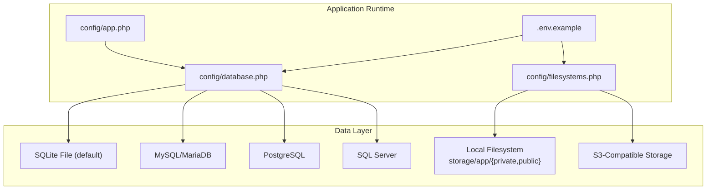
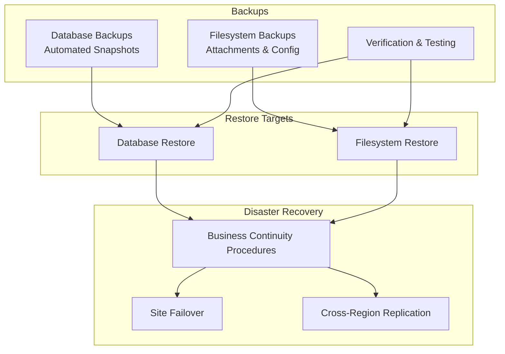
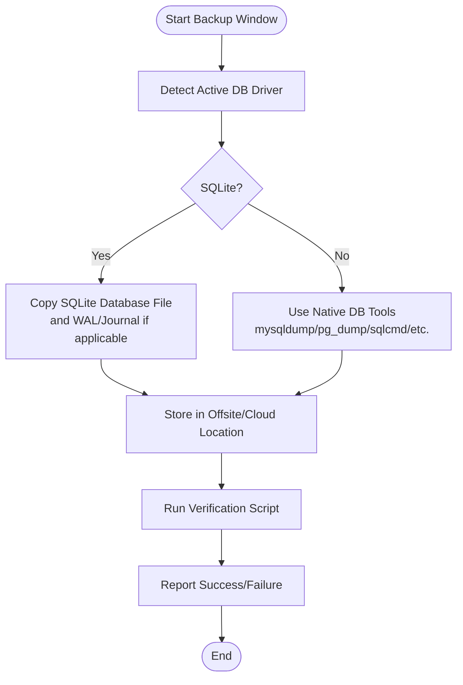
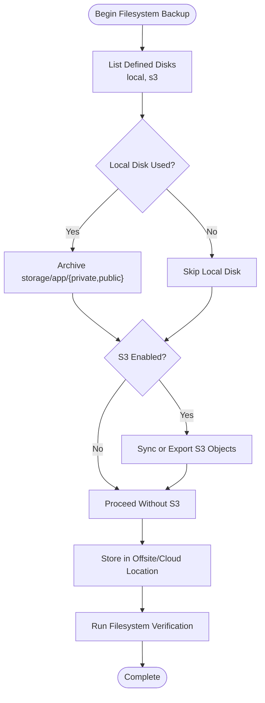
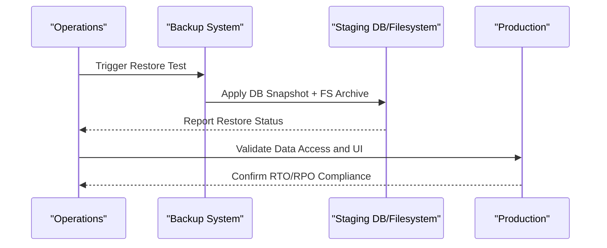
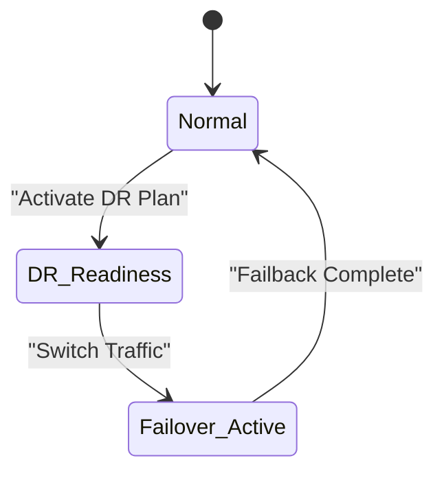
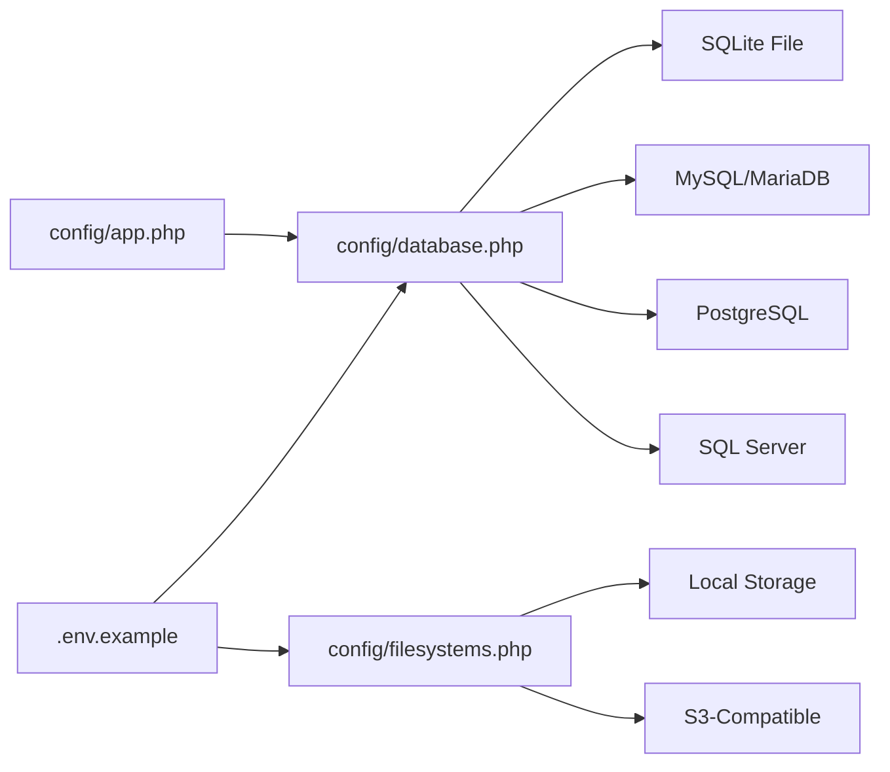

# Backup & Recovery

<cite>
**Referenced Files in This Document**
- [config/database.php](file://config/database.php)
- [config/filesystems.php](file://config/filesystems.php)
- [config/app.php](file://config/app.php)
- [.env.example](file://.env.example)
- [composer.json](file://composer.json)
- [routes/console.php](file://routes/console.php)
- [app/Console/Commands/ProcessTicketEscalations.php](file://app/Console/Commands/ProcessTicketEscalations.php)
- [app/Services/Automation/AutomationEngine.php](file://app/Services/Automation/AutomationEngine.php)
- [database/migrations/2026_02_01_224222_create_tickets_table.php](file://database/migrations/2026_02_01_224222_create_tickets_table.php)
- [database/migrations/2026_03_10_045512_add_attachments_to_ticket_replies_table.php](file://database/migrations/2026_03_10_045512_add_attachments_to_ticket_replies_table.php)
- [resources/views/livewire/dashboard/ticket-details.blade.php](file://resources/views/livewire/dashboard/ticket-details.blade.php)
- [resources/views/livewire/widget/ticket-conversation.blade.php](file://resources/views/livewire/widget/ticket-conversation.blade.php)
- [storage/framework/.gitignore](file://storage/framework/.gitignore)
</cite>

## Table of Contents
1. [Introduction](#introduction)
2. [Project Structure](#project-structure)
3. [Core Components](#core-components)
4. [Architecture Overview](#architecture-overview)
5. [Detailed Component Analysis](#detailed-component-analysis)
6. [Dependency Analysis](#dependency-analysis)
7. [Performance Considerations](#performance-considerations)
8. [Troubleshooting Guide](#troubleshooting-guide)
9. [Conclusion](#conclusion)
10. [Appendices](#appendices)

## Introduction
This document defines a comprehensive backup and disaster recovery plan for the Helpdesk System. It covers database backup strategies (automated backups, point-in-time recovery readiness, and cross-region replication), file system backup procedures for attachments and configuration data, verification and restoration testing, recovery time objectives, failover and redundancy planning, and security and compliance controls for protecting customer data.

## Project Structure
The Helpdesk System is a Laravel application with:
- Database connectivity via configurable drivers (SQLite, MySQL, MariaDB, PostgreSQL, SQL Server).
- File storage using local disks and optional S3-compatible storage.
- Queued and scheduled tasks for operational automation.
- Ticket and reply data with JSON-based attachment metadata and stored files under the local storage hierarchy.

**Diagram sources**
- [config/database.php:19-116](file://config/database.php#L19-L116)
- [config/filesystems.php:16-63](file://config/filesystems.php#L16-L63)
- [.env.example:27-42](file://.env.example#L27-L42)
- [config/app.php:16-106](file://config/app.php#L16-L106)

**Section sources**
- [config/database.php:19-116](file://config/database.php#L19-L116)
- [config/filesystems.php:16-63](file://config/filesystems.php#L16-L63)
- [.env.example:27-42](file://.env.example#L27-L42)
- [config/app.php:16-106](file://config/app.php#L16-L106)

## Core Components
- Database configuration supports SQLite (default), MySQL/MariaDB, PostgreSQL, and SQL Server. The default connection is SQLite unless overridden by environment variables.
- Filesystem configuration supports local disks and S3. The default disk is local; S3 credentials are provided via environment variables.
- Attachment handling stores file metadata in the database (JSON) and uploads files to the local public disk under a dedicated folder for ticket attachments.
- Scheduled automation runs ticket escalation processing every 15 minutes, indicating ongoing operational activity requiring reliable backups.

Key backup-relevant observations:
- Default runtime uses SQLite, which is file-based and requires file-level backup strategies.
- Attachments are stored on the local filesystem; S3 is available but not enabled by default.
- Operational automation depends on persistent state and schedules.

**Section sources**
- [config/database.php:19-116](file://config/database.php#L19-L116)
- [config/filesystems.php:16-63](file://config/filesystems.php#L16-L63)
- [.env.example:27-42](file://.env.example#L27-L42)
- [routes/console.php:17-21](file://routes/console.php#L17-L21)
- [app/Console/Commands/ProcessTicketEscalations.php:16-24](file://app/Console/Commands/ProcessTicketEscalations.php#L16-L24)
- [database/migrations/2026_02_01_224222_create_tickets_table.php:11-54](file://database/migrations/2026_02_01_224222_create_tickets_table.php#L11-L54)
- [database/migrations/2026_03_10_045512_add_attachments_to_ticket_replies_table.php:14-17](file://database/migrations/2026_03_10_045512_add_attachments_to_ticket_replies_table.php#L14-L17)
- [resources/views/livewire/dashboard/ticket-details.blade.php:406-408](file://resources/views/livewire/dashboard/ticket-details.blade.php#L406-L408)
- [resources/views/livewire/widget/ticket-conversation.blade.php:130-141](file://resources/views/livewire/widget/ticket-conversation.blade.php#L130-L141)

## Architecture Overview
The backup and recovery architecture integrates database and filesystem backups with verification and restoration testing aligned to Recovery Time and Objective (RTO/RPO) targets.

[No sources needed since this diagram shows conceptual workflow, not actual code structure]

## Detailed Component Analysis

### Database Backup Strategy
- Current default: SQLite file-based database. Requires file-level backup of the SQLite file plus transaction log considerations.
- Alternative databases: MySQL/MariaDB, PostgreSQL, SQL Server are supported via configuration. Each offers native backup tools and point-in-time recovery capabilities.
- Operational context: The system runs scheduled automation tasks; database integrity and availability are essential for continuous operation.

Recommended approach:
- Automated backups: Schedule regular snapshots of the SQLite file or use native database tools for other drivers.
- Point-in-time recovery: Enable and test database-native binary logs or write-ahead logs depending on the selected driver.
- Cross-region replication: Configure cross-region replicas for the selected database engine; maintain sync and test failover regularly.

**Section sources**
- [config/database.php:19-116](file://config/database.php#L19-L116)
- [routes/console.php:17-21](file://routes/console.php#L17-L21)
- [app/Console/Commands/ProcessTicketEscalations.php:16-24](file://app/Console/Commands/ProcessTicketEscalations.php#L16-L24)

### Filesystem Backup Procedures
- Default storage: Local disks for private and public content.
- Attachments: Stored under the public disk; the UI references storage URLs for attachments.
- Optional S3: Credentials and endpoint are configurable; enabling S3 would offload attachments to remote storage.

Backup scope:
- Private disk: Contains temporary and private content; include in backups as needed.
- Public disk: Contains attachments; include in backups or enable S3 for remote durability.
- Configuration data: Environment files (.env) and application configuration files; protect with appropriate access controls.

**Section sources**
- [config/filesystems.php:16-63](file://config/filesystems.php#L16-L63)
- [resources/views/livewire/dashboard/ticket-details.blade.php:406-408](file://resources/views/livewire/dashboard/ticket-details.blade.php#L406-L408)
- [resources/views/livewire/widget/ticket-conversation.blade.php:130-141](file://resources/views/livewire/widget/ticket-conversation.blade.php#L130-L141)
- [.env.example:65-69](file://.env.example#L65-L69)

### Backup Verification and Restoration Testing
Verification checklist:
- Database: Restore to a staging environment, run schema migrations, and validate data integrity.
- Filesystem: Restore attachments and verify UI accessibility via storage URLs.
- End-to-end: Simulate failure scenarios and measure RTO/RPO against targets.

Testing cadence:
- Weekly restore drills for database and filesystem.
- Monthly cross-region failover tests for database and file storage.

[No sources needed since this diagram shows conceptual workflow, not actual code structure]

### Disaster Recovery Planning
- Site failover: Maintain a secondary environment with synchronized database and filesystem. Switch DNS or traffic routing upon incident.
- Data center redundancy: Use cross-region database replicas and S3 buckets for attachments.
- Business continuity: Ensure scheduled tasks and queues continue after failover; validate automation rules post-failover.

[No sources needed since this diagram shows conceptual workflow, not actual code structure]

### Security, Encryption, and Compliance
- Encryption at rest: Encrypt the SQLite file or enable transparent data encryption on the database server. For S3, enable server-side encryption.
- Transport encryption: Enforce TLS for database connections and S3 access.
- Access controls: Restrict backup storage permissions; rotate credentials; apply principle of least privilege.
- Compliance: Align backup retention and deletion policies with regulatory requirements; maintain audit logs for backups and restores.

[No sources needed since this section provides general guidance]

## Dependency Analysis
The backup and recovery process depends on configuration and operational components.

**Diagram sources**
- [.env.example:27-42](file://.env.example#L27-L42)
- [config/database.php:19-116](file://config/database.php#L19-L116)
- [config/filesystems.php:16-63](file://config/filesystems.php#L16-L63)
- [config/app.php:16-106](file://config/app.php#L16-L106)

**Section sources**
- [.env.example:27-42](file://.env.example#L27-L42)
- [config/database.php:19-116](file://config/database.php#L19-L116)
- [config/filesystems.php:16-63](file://config/filesystems.php#L16-L63)
- [config/app.php:16-106](file://config/app.php#L16-L106)

## Performance Considerations
- Backup window sizing: Schedule backups during low-traffic periods; consider incremental backups for large datasets.
- Compression and deduplication: Reduce storage costs and improve transfer speeds.
- Parallelism: Back up database and filesystem concurrently where feasible.

[No sources needed since this section provides general guidance]

## Troubleshooting Guide
Common issues and resolutions:
- Backup failures: Validate credentials, network connectivity, and storage permissions. Re-run verification scripts.
- Restore inconsistencies: Confirm WAL/Journal presence for SQLite; ensure full transaction logs for other databases; verify filesystem checksums.
- Attachment access errors: Confirm storage URL generation and symlink integrity; validate S3 bucket policies if enabled.

Operational indicators:
- Scheduled automation relies on persistent state; ensure database and filesystem are restored before enabling services.

**Section sources**
- [routes/console.php:17-21](file://routes/console.php#L17-L21)
- [app/Console/Commands/ProcessTicketEscalations.php:16-24](file://app/Console/Commands/ProcessTicketEscalations.php#L16-L24)
- [storage/framework/.gitignore:1-9](file://storage/framework/.gitignore#L1-L9)

## Conclusion
A robust backup and disaster recovery plan for the Helpdesk System should integrate file-level database backups, filesystem archival, and verification/testing procedures. Choose a database driver aligned with your RPO/RTO needs, enable cross-region replication, and harden security and compliance controls. Regular testing ensures readiness for real incidents.

[No sources needed since this section summarizes without analyzing specific files]

## Appendices
- Recovery Time Objectives (RTO): Target maximum acceptable downtime per system component.
- Recovery Point Objectives (RPO): Target maximum acceptable data loss measured in time.
- Backup Retention: Define lifecycle policies for backups and archives.

[No sources needed since this section provides general guidance]