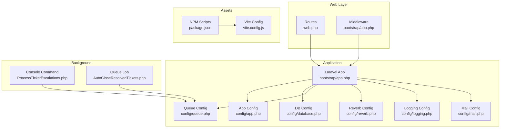
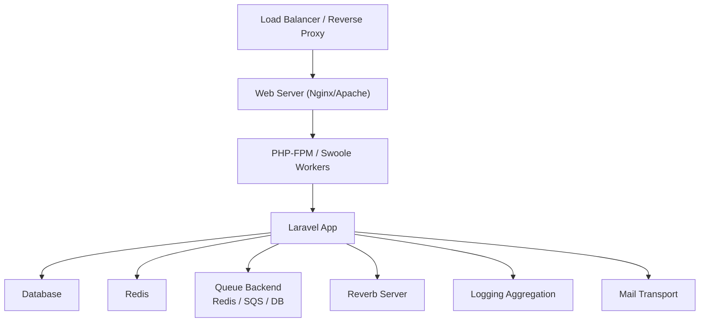
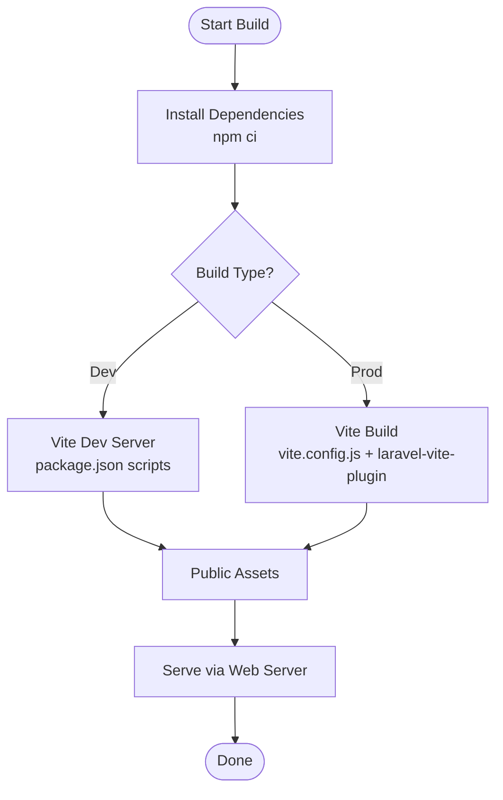
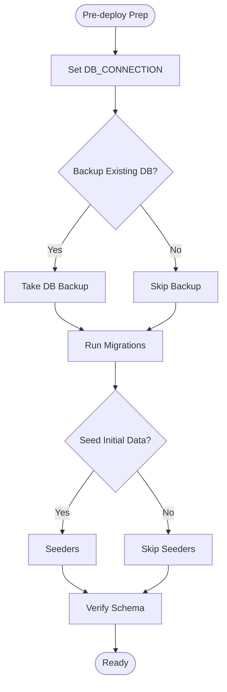
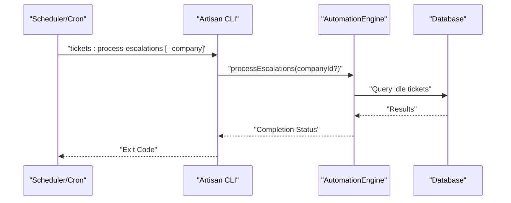
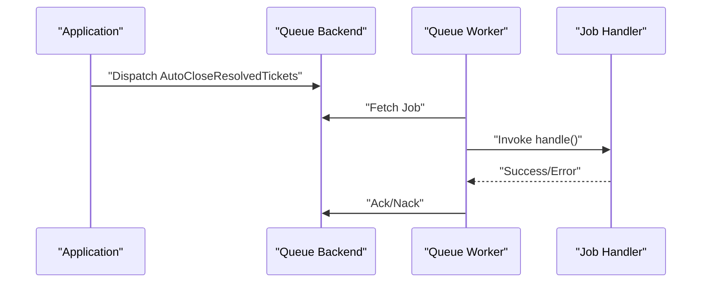
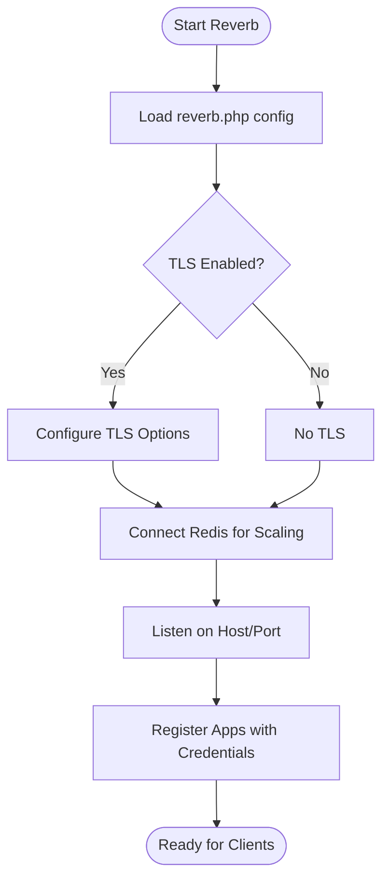
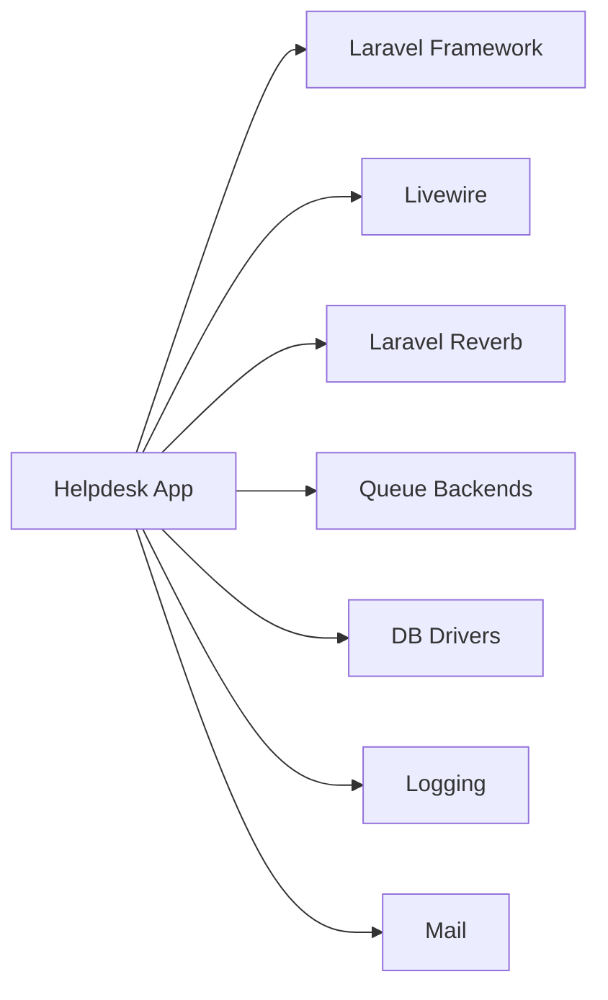

# Deployment & Operations

<cite>
**Referenced Files in This Document**
- [composer.json](file://composer.json)
- [package.json](file://package.json)
- [vite.config.js](file://vite.config.js)
- [config/app.php](file://config/app.php)
- [config/database.php](file://config/database.php)
- [config/queue.php](file://config/queue.php)
- [config/reverb.php](file://config/reverb.php)
- [config/logging.php](file://config/logging.php)
- [config/mail.php](file://config/mail.php)
- [bootstrap/app.php](file://bootstrap/app.php)
- [routes/web.php](file://routes/web.php)
- [routes/channels.php](file://routes/channels.php)
- [app/Console/Commands/ProcessTicketEscalations.php](file://app/Console/Commands/ProcessTicketEscalations.php)
- [app/Jobs/AutoCloseResolvedTickets.php](file://app/Jobs/AutoCloseResolvedTickets.php)
- [database/migrations](file://database/migrations)
</cite>

## Table of Contents
1. [Introduction](#introduction)
2. [Project Structure](#project-structure)
3. [Core Components](#core-components)
4. [Architecture Overview](#architecture-overview)
5. [Detailed Component Analysis](#detailed-component-analysis)
6. [Dependency Analysis](#dependency-analysis)
7. [Performance Considerations](#performance-considerations)
8. [Troubleshooting Guide](#troubleshooting-guide)
9. [Conclusion](#conclusion)
10. [Appendices](#appendices)

## Introduction
This document provides comprehensive deployment and operations guidance for the Helpdesk System. It covers production deployment strategies, environment configuration, asset compilation, database migrations, queue processing for background jobs, WebSocket server configuration using Laravel Reverb, monitoring and logging, CI/CD automation, rollback procedures, zero-downtime techniques, backup and disaster recovery, scaling, security hardening, SSL/TLS, and load balancing.

## Project Structure
The Helpdesk System is a Laravel 12 application with Livewire 4 front-end components and Vite-based asset pipeline. Key runtime services include:
- Web server and routing via Laravel’s router and middleware
- Queue processing for background tasks and automation
- Real-time messaging via Laravel Reverb
- Logging and mail delivery
- Database connectivity and migrations

**Diagram sources**
- [routes/web.php:1-117](file://routes/web.php#L1-L117)
- [bootstrap/app.php:1-34](file://bootstrap/app.php#L1-L34)
- [config/app.php:1-129](file://config/app.php#L1-L129)
- [config/database.php:1-184](file://config/database.php#L1-L184)
- [config/queue.php:1-130](file://config/queue.php#L1-L130)
- [config/reverb.php:1-97](file://config/reverb.php#L1-L97)
- [config/logging.php:1-133](file://config/logging.php#L1-L133)
- [config/mail.php:1-119](file://config/mail.php#L1-L119)
- [app/Console/Commands/ProcessTicketEscalations.php:1-55](file://app/Console/Commands/ProcessTicketEscalations.php#L1-L55)
- [app/Jobs/AutoCloseResolvedTickets.php:1-28](file://app/Jobs/AutoCloseResolvedTickets.php#L1-L28)
- [package.json:1-37](file://package.json#L1-L37)
- [vite.config.js:1-22](file://vite.config.js#L1-L22)

**Section sources**
- [routes/web.php:1-117](file://routes/web.php#L1-L117)
- [bootstrap/app.php:1-34](file://bootstrap/app.php#L1-L34)
- [config/app.php:1-129](file://config/app.php#L1-L129)
- [config/database.php:1-184](file://config/database.php#L1-L184)
- [config/queue.php:1-130](file://config/queue.php#L1-L130)
- [config/reverb.php:1-97](file://config/reverb.php#L1-L97)
- [config/logging.php:1-133](file://config/logging.php#L1-L133)
- [config/mail.php:1-119](file://config/mail.php#L1-L119)
- [app/Console/Commands/ProcessTicketEscalations.php:1-55](file://app/Console/Commands/ProcessTicketEscalations.php#L1-L55)
- [app/Jobs/AutoCloseResolvedTickets.php:1-28](file://app/Jobs/AutoCloseResolvedTickets.php#L1-L28)
- [package.json:1-37](file://package.json#L1-L37)
- [vite.config.js:1-22](file://vite.config.js#L1-L22)

## Core Components
- Environment and domain configuration: application name, environment, debug, URL, timezone, locale, encryption key, maintenance driver, and custom domain helpers.
- Database connectivity: SQLite by default, with MySQL/MariaDB/Postgres/SQLServer options and Redis client configuration.
- Queue backends: sync, database, beanstalkd, SQS, redis, deferred, background, failover; failed job storage.
- Real-time messaging: Reverb server host/port/path, TLS options, scaling via Redis, Pulse/Telescope ingest intervals, app credentials and limits.
- Logging: stack/single/daily/slack/syslog/stderr/papertrail channels; deprecation logging.
- Mail delivery: SMTP, SES, Postmark, Resend, Sendmail, log/array, failover, roundrobin; global From address.
- Asset pipeline: Vite with Laravel plugin and TailwindCSS; NPM scripts for dev/build.

**Section sources**
- [config/app.php:1-129](file://config/app.php#L1-L129)
- [config/database.php:1-184](file://config/database.php#L1-L184)
- [config/queue.php:1-130](file://config/queue.php#L1-L130)
- [config/reverb.php:1-97](file://config/reverb.php#L1-L97)
- [config/logging.php:1-133](file://config/logging.php#L1-L133)
- [config/mail.php:1-119](file://config/mail.php#L1-L119)
- [package.json:1-37](file://package.json#L1-L37)
- [vite.config.js:1-22](file://vite.config.js#L1-L22)

## Architecture Overview
Production deployment typically involves:
- Web server (e.g., Nginx/Apache) proxying to PHP-FPM or Swoole workers
- Laravel application serving HTTP requests and broadcasting via Reverb
- Queue workers consuming jobs from the selected backend
- Database and Redis for persistence and pub/sub
- Reverse proxy/load balancer for SSL termination and horizontal scaling

[No sources needed since this diagram shows conceptual workflow, not actual code structure]

## Detailed Component Analysis

### Production Deployment Strategies
- Environment configuration
  - Set APP_ENV to production, APP_DEBUG to false, APP_URL to HTTPS origin, and APP_KEY generated securely.
  - Configure APP_DOMAIN and APP_URL_WITHOUT_PROTOCOL for subdomain-based routing.
- Asset compilation
  - Build assets in production using the NPM build script; ensure public assets are served by the web server.
- Database migrations
  - Run migrations during deployment against the target database; ensure DB_CONNECTION matches the environment.
- Queue workers
  - Start queue workers for the chosen backend; monitor failed jobs and retry policies.
- Reverb server
  - Start Reverb server and configure TLS; ensure scaling settings align with infrastructure.

**Section sources**
- [config/app.php:1-129](file://config/app.php#L1-L129)
- [package.json:1-37](file://package.json#L1-L37)
- [config/database.php:1-184](file://config/database.php#L1-L184)
- [config/queue.php:1-130](file://config/queue.php#L1-L130)
- [config/reverb.php:1-97](file://config/reverb.php#L1-L97)

### Environment Configuration
Key environment variables per configuration file:
- App
  - APP_ENV, APP_DEBUG, APP_URL, APP_NAME, APP_KEY, APP_MAINTENANCE_DRIVER, APP_MAINTENANCE_STORE, APP_DOMAIN, APP_URL_WITHOUT_PROTOCOL
- Database
  - DB_CONNECTION, DB_URL, DB_HOST, DB_PORT, DB_DATABASE, DB_USERNAME, DB_PASSWORD, DB_CHARSET, DB_COLLATION, DB_SSLMODE, MYSQL_ATTR_SSL_CA, REDIS_* variables
- Queue
  - QUEUE_CONNECTION, DB_QUEUE_CONNECTION, DB_QUEUE_TABLE, DB_QUEUE, DB_QUEUE_RETRY_AFTER, REDIS_QUEUE*, SQS_* variables
- Reverb
  - REVERB_SERVER, REVERB_SERVER_HOST, REVERB_SERVER_PORT, REVERB_SERVER_PATH, REVERB_HOST, REVERB_PORT, REVERB_SCHEME, REVERB_APP_KEY, REVERB_APP_SECRET, REVERB_APP_ID, REVERB_SCALING_ENABLED, REVERB_SCALING_CHANNEL, REVERB_MAX_REQUEST_SIZE, REVERB_PULSE_INGEST_INTERVAL, REVERB_TELESCOPE_INGEST_INTERVAL
- Logging
  - LOG_CHANNEL, LOG_STACK, LOG_LEVEL, LOG_DAILY_DAYS, LOG_SLACK_WEBHOOK_URL, PAPERTRAIL_URL, PAPERTRAIL_PORT, LOG_STDERR_FORMATTER
- Mail
  - MAIL_MAILER, MAIL_URL, MAIL_HOST, MAIL_PORT, MAIL_USERNAME, MAIL_PASSWORD, MAIL_FROM_ADDRESS, MAIL_FROM_NAME, MAIL_SCHEME, MAIL_LOG_CHANNEL

**Section sources**
- [config/app.php:1-129](file://config/app.php#L1-L129)
- [config/database.php:1-184](file://config/database.php#L1-L184)
- [config/queue.php:1-130](file://config/queue.php#L1-L130)
- [config/reverb.php:1-97](file://config/reverb.php#L1-L97)
- [config/logging.php:1-133](file://config/logging.php#L1-L133)
- [config/mail.php:1-119](file://config/mail.php#L1-L119)

### Asset Compilation
- Local development uses Vite with Laravel plugin and TailwindCSS; dev/watch mode is enabled.
- Production builds use the NPM build script to compile assets for distribution.
- Ensure static assets are served by the web server and not routed through PHP in production.

**Diagram sources**
- [package.json:1-37](file://package.json#L1-L37)
- [vite.config.js:1-22](file://vite.config.js#L1-L22)

**Section sources**
- [package.json:1-37](file://package.json#L1-L37)
- [vite.config.js:1-22](file://vite.config.js#L1-L22)

### Database Migration Procedures
- Supported drivers: sqlite, mysql, mariadb, pgsql, sqlsrv.
- Migrations repository table is configurable.
- Redis options include client type, cluster, prefix, persistent connections, and retry/backoff settings.
- Recommended steps:
  - Set DB_CONNECTION to the target backend.
  - Run migrations during deployment.
  - For SQLite, ensure the database file permissions allow writes by the web server user.
  - For cloud databases, configure SSL/TLS and CA settings as needed.

**Diagram sources**
- [config/database.php:1-184](file://config/database.php#L1-L184)
- [database/migrations](file://database/migrations)

**Section sources**
- [config/database.php:1-184](file://config/database.php#L1-L184)
- [database/migrations](file://database/migrations)

### Queue Processing Setup
- Default queue connection is configurable; database, redis, sqs, beanstalkd, sync, and others are supported.
- Failed job storage is configurable with UUIDs and database table.
- Background jobs:
  - AutoCloseResolvedTickets implements ShouldQueue and is queueable.
  - ProcessTicketEscalations is a console command orchestrating escalation processing per company or across all companies.

**Diagram sources**
- [app/Console/Commands/ProcessTicketEscalations.php:1-55](file://app/Console/Commands/ProcessTicketEscalations.php#L1-L55)

**Diagram sources**
- [app/Jobs/AutoCloseResolvedTickets.php:1-28](file://app/Jobs/AutoCloseResolvedTickets.php#L1-L28)
- [config/queue.php:1-130](file://config/queue.php#L1-L130)

**Section sources**
- [config/queue.php:1-130](file://config/queue.php#L1-L130)
- [app/Jobs/AutoCloseResolvedTickets.php:1-28](file://app/Jobs/AutoCloseResolvedTickets.php#L1-L28)
- [app/Console/Commands/ProcessTicketEscalations.php:1-55](file://app/Console/Commands/ProcessTicketEscalations.php#L1-L55)

### WebSocket Server Configuration (Laravel Reverb)
- Default server is “reverb”; host, port, path, hostname, and TLS options are configurable.
- Scaling via Redis is supported; Pulse and Telescope ingest intervals can be tuned.
- Application credentials include key, secret, app_id, and transport options (host, port, scheme, TLS).
- Configure allowed origins, ping/activity timeouts, max connections, and message sizes.

**Diagram sources**
- [config/reverb.php:1-97](file://config/reverb.php#L1-L97)

**Section sources**
- [config/reverb.php:1-97](file://config/reverb.php#L1-L97)

### Monitoring and Logging
- Default channel is stack; single, daily rotation, slack, syslog, stderr, papertrail, and null are available.
- Deprecations logging can be configured with optional tracing.
- Recommended production logging:
  - Daily rotation with retention policy
  - Centralized aggregation (Papertrail or similar)
  - Slack alerts for critical events
  - Structured stderr logging for containerized deployments

**Section sources**
- [config/logging.php:1-133](file://config/logging.php#L1-L133)

### CI/CD Automation, Rollback, Zero-Downtime
- Composer scripts automate setup, dev orchestration, linting, and testing.
- Orchestration in development includes server, queue listener, Vite, and Reverb.
- Zero-downtime deployment strategies:
  - Blue/green or rolling updates behind a load balancer
  - Warm standby instances
  - Health checks via /up endpoint
- Rollback procedures:
  - Keep previous app keys for seamless decryption and cache invalidation
  - Maintain artifact and database migration history
  - Revert to last known good deployment and re-run targeted migrations if needed

**Section sources**
- [composer.json:1-108](file://composer.json#L1-L108)
- [bootstrap/app.php:1-34](file://bootstrap/app.php#L1-L34)

### Backup and Disaster Recovery
- Database backups: schedule regular dumps for the configured DB_CONNECTION; retain offsite copies.
- Application backups: package artifacts, public/uploads, and environment files (excluding secrets).
- Recovery plan:
  - Test restore procedures regularly
  - Automate restoration steps
  - Validate restored data and migrations

[No sources needed since this section provides general guidance]

### Security Hardening, SSL/TLS, and Load Balancing
- SSL/TLS:
  - Terminate TLS at the reverse proxy/load balancer
  - Use strong ciphers and modern protocols
  - Manage certificates via ACME automation or certificate manager
- Security:
  - Enforce HTTPS redirects
  - Restrict file permissions for storage/logs
  - Rotate APP_KEY and maintain previous keys
  - Harden database and Redis network access
- Load balancing:
  - Use sticky sessions if required by session driver
  - Scale Reverb horizontally with Redis-backed clustering
  - Scale queue workers independently per workload

[No sources needed since this section provides general guidance]

## Dependency Analysis
Runtime dependencies and integrations:
- Laravel framework and ecosystem (Livewire, Tinker, Socialite, AI SDK)
- Reverb for real-time features
- Queue backends (database, redis, sqs, beanstalkd)
- Database drivers (sqlite, mysql/mariadb, pgsql, sqlsrv)
- Logging and mail transports

**Diagram sources**
- [composer.json:1-108](file://composer.json#L1-L108)

**Section sources**
- [composer.json:1-108](file://composer.json#L1-L108)

## Performance Considerations
- Optimize queue backends for throughput and latency; tune retry and timeout settings.
- Use Redis for caching and pub/sub; configure connection pooling and timeouts.
- Enable database query logging and slow query detection in staging/production.
- Monitor Reverb connection counts and message sizes; scale Redis accordingly.
- Use daily log rotation and archive old logs; avoid excessive verbosity in production.

[No sources needed since this section provides general guidance]

## Troubleshooting Guide
- Queue failures
  - Inspect failed job storage and re-run failed jobs after resolving root causes.
  - Adjust retry_after and worker concurrency.
- Reverb connectivity
  - Verify server host/port/path and TLS settings; check Redis connectivity for scaling.
- Logging
  - Confirm default channel and stack composition; validate external sinks (Slack/Papertrail).
- Mail delivery
  - Test SMTP credentials and EHLO domain; verify fallback/roundrobin configurations.
- Subdomain routing
  - Ensure APP_DOMAIN matches the configured domain and routes resolve under company subdomains.

**Section sources**
- [config/queue.php:1-130](file://config/queue.php#L1-L130)
- [config/reverb.php:1-97](file://config/reverb.php#L1-L97)
- [config/logging.php:1-133](file://config/logging.php#L1-L133)
- [config/mail.php:1-119](file://config/mail.php#L1-L119)
- [routes/web.php:1-117](file://routes/web.php#L1-L117)

## Conclusion
This guide consolidates production-grade deployment and operations practices for the Helpdesk System. By aligning environment configuration, asset compilation, database migrations, queue processing, and Reverb setup with robust monitoring, logging, CI/CD automation, and security measures, teams can achieve reliable, scalable, and maintainable operations.

## Appendices
- Subdomain routing and broadcast channels
  - Routes define company-specific subdomains and dashboard endpoints.
  - Broadcast channel closure ensures per-user channel scoping.

**Section sources**
- [routes/web.php:1-117](file://routes/web.php#L1-L117)
- [routes/channels.php:1-8](file://routes/channels.php#L1-L8)