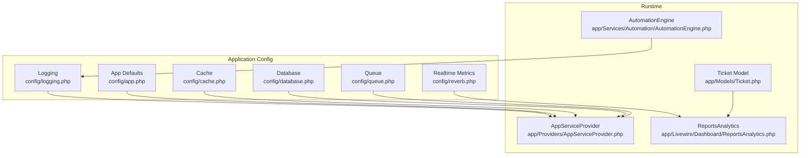
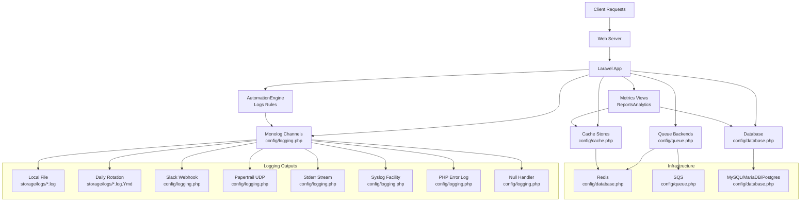
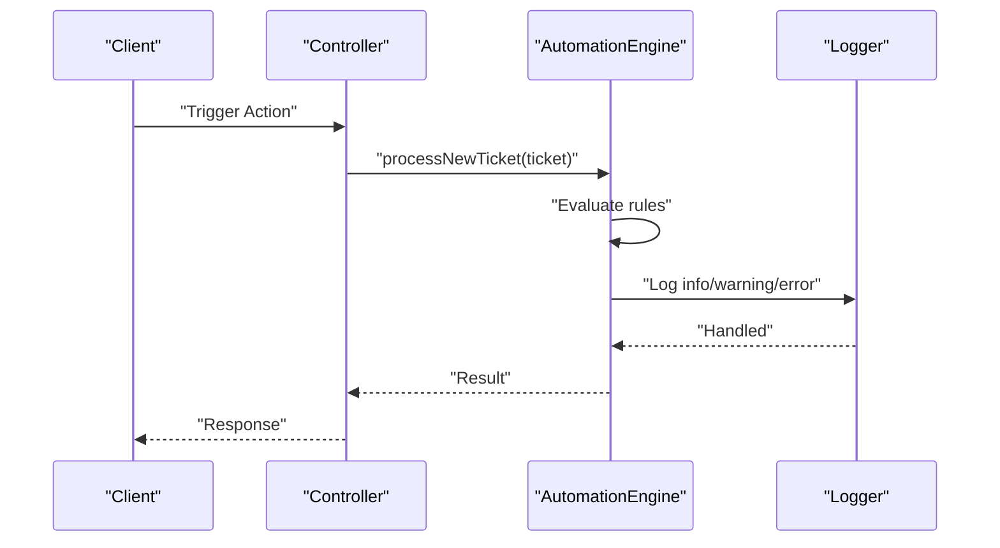
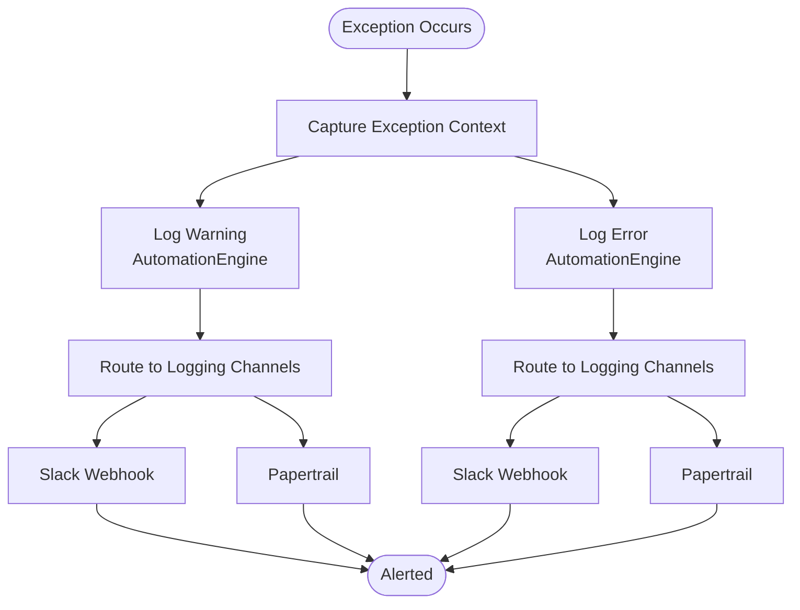
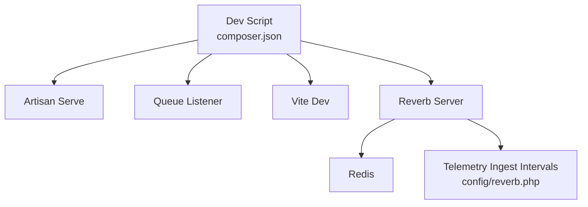
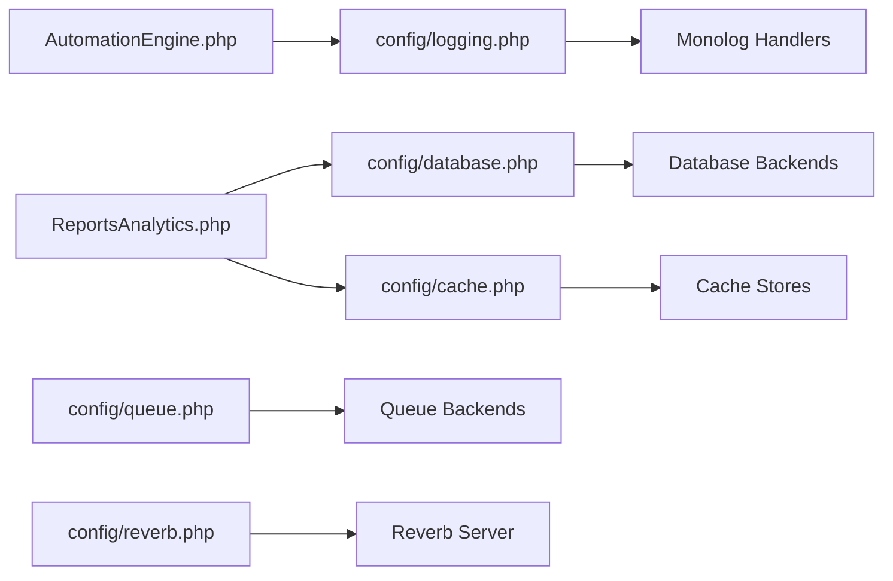

# Monitoring & Logging

<cite>
**Referenced Files in This Document**
- [logging.php](file://config/logging.php)
- [app.php](file://config/app.php)
- [cache.php](file://config/cache.php)
- [database.php](file://config/database.php)
- [queue.php](file://config/queue.php)
- [AppServiceProvider.php](file://app/Providers/AppServiceProvider.php)
- [AutomationEngine.php](file://app/Services/Automation/AutomationEngine.php)
- [Ticket.php](file://app/Models/Ticket.php)
- [ReportsAnalytics.php](file://app/Livewire/Dashboard/ReportsAnalytics.php)
- [composer.json](file://composer.json)
- [reverb.php](file://config/reverb.php)
</cite>

## Table of Contents
1. [Introduction](#introduction)
2. [Project Structure](#project-structure)
3. [Core Components](#core-components)
4. [Architecture Overview](#architecture-overview)
5. [Detailed Component Analysis](#detailed-component-analysis)
6. [Dependency Analysis](#dependency-analysis)
7. [Performance Considerations](#performance-considerations)
8. [Troubleshooting Guide](#troubleshooting-guide)
9. [Conclusion](#conclusion)
10. [Appendices](#appendices)

## Introduction
This document provides comprehensive monitoring and logging guidance for the Helpdesk System. It covers application logging configuration (channels, rotation, and storage), performance monitoring (application metrics, database query analysis, and queue performance tracking), error tracking and alerting (exception handling, error reporting, and notification mechanisms), and infrastructure monitoring (server health, resource utilization, and network performance). It also outlines log analysis tools, dashboard setup, and automated alerting configuration for critical system events.

## Project Structure
The Helpdesk System leverages Laravel’s modular configuration and runtime components:
- Logging is configured via config/logging.php with multiple channels (stack, single, daily, slack, papertrail, stderr, syslog, errorlog, null).
- Application behavior and defaults are set in config/app.php.
- Caching, database, and queue backends are configured in cache.php, database.php, and queue.php respectively.
- Application-wide service provider bootstrapping is handled in app/Providers/AppServiceProvider.php.
- Business logic integrates logging for automation via app/Services/Automation/AutomationEngine.php.
- Metrics and analytics are surfaced in app/Livewire/Dashboard/ReportsAnalytics.php.
- Real-time event ingestion for metrics is configured in config/reverb.php.
- Development and operational scripts are defined in composer.json.

**Diagram sources**
- [logging.php:1-133](file://config/logging.php#L1-L133)
- [app.php:1-129](file://config/app.php#L1-L129)
- [cache.php:1-118](file://config/cache.php#L1-L118)
- [database.php:1-184](file://config/database.php#L1-L184)
- [queue.php:1-130](file://config/queue.php#L1-L130)
- [AppServiceProvider.php:1-55](file://app/Providers/AppServiceProvider.php#L1-L55)
- [AutomationEngine.php:1-142](file://app/Services/Automation/AutomationEngine.php#L1-L142)
- [Ticket.php:1-64](file://app/Models/Ticket.php#L1-L64)
- [ReportsAnalytics.php:238-516](file://app/Livewire/Dashboard/ReportsAnalytics.php#L238-L516)
- [reverb.php:29-57](file://config/reverb.php#L29-L57)

**Section sources**
- [logging.php:1-133](file://config/logging.php#L1-L133)
- [app.php:1-129](file://config/app.php#L1-L129)
- [cache.php:1-118](file://config/cache.php#L1-L118)
- [database.php:1-184](file://config/database.php#L1-L184)
- [queue.php:1-130](file://config/queue.php#L1-L130)
- [AppServiceProvider.php:1-55](file://app/Providers/AppServiceProvider.php#L1-L55)
- [AutomationEngine.php:1-142](file://app/Services/Automation/AutomationEngine.php#L1-L142)
- [Ticket.php:1-64](file://app/Models/Ticket.php#L1-L64)
- [ReportsAnalytics.php:238-516](file://app/Livewire/Dashboard/ReportsAnalytics.php#L238-L516)
- [reverb.php:29-57](file://config/reverb.php#L29-L57)

## Core Components
- Logging configuration: Centralized in config/logging.php with channels supporting local files, daily rotation, Slack, Papertrail, stderr, syslog, errorlog, and null handlers. The default channel is stack, aggregating multiple channels.
- Application defaults: config/app.php sets environment, debug mode, timezone, and maintenance behavior.
- Cache stores: config/cache.php defines array, database, file, memcached, redis, dynamodb, octane, failover, and null stores.
- Database connections: config/database.php defines sqlite, mysql, mariadb, pgsql, sqlsrv with Redis options and key prefixes.
- Queue backends: config/queue.php defines sync, database, beanstalkd, sqs, redis, deferred, background, failover, and failed job storage.
- Service provider bootstrapping: app/Providers/AppServiceProvider.php configures defaults, disables lazy loading, and registers observers.
- Automation engine logging: app/Services/Automation/AutomationEngine.php logs rule execution outcomes and errors.
- Metrics and analytics: app/Livewire/Dashboard/ReportsAnalytics.php computes KPIs and aggregates via optimized database queries.
- Real-time metrics ingestion: config/reverb.php configures server scaling and ingest intervals for telemetry.

**Section sources**
- [logging.php:53-130](file://config/logging.php#L53-L130)
- [app.php:29-42](file://config/app.php#L29-L42)
- [cache.php:35-102](file://config/cache.php#L35-L102)
- [database.php:32-181](file://config/database.php#L32-L181)
- [queue.php:32-127](file://config/queue.php#L32-L127)
- [AppServiceProvider.php:29-53](file://app/Providers/AppServiceProvider.php#L29-L53)
- [AutomationEngine.php:59-96](file://app/Services/Automation/AutomationEngine.php#L59-L96)
- [ReportsAnalytics.php:273-302](file://app/Livewire/Dashboard/ReportsAnalytics.php#L273-L302)
- [reverb.php:29-57](file://config/reverb.php#L29-L57)

## Architecture Overview
The monitoring and logging architecture integrates application logging, queue-backed asynchronous tasks, database-backed metrics, and real-time ingestion for dashboards.

**Diagram sources**
- [logging.php:53-130](file://config/logging.php#L53-L130)
- [database.php:145-181](file://config/database.php#L145-L181)
- [cache.php:35-102](file://config/cache.php#L35-L102)
- [queue.php:32-92](file://config/queue.php#L32-L92)
- [AutomationEngine.php:59-96](file://app/Services/Automation/AutomationEngine.php#L59-L96)
- [ReportsAnalytics.php:273-302](file://app/Livewire/Dashboard/ReportsAnalytics.php#L273-L302)

## Detailed Component Analysis

### Application Logging Configuration
- Default channel: stack aggregates multiple channels defined by LOG_STACK (comma-separated).
- File-based logging: single writes to storage_path('logs/laravel.log') with level from LOG_LEVEL.
- Daily rotation: daily rotates logs by day with configurable retention via LOG_DAILY_DAYS.
- Slack alerts: slack channel posts critical events to a webhook URL.
- Papertrail: monolog handler with TLS UDP to PAPERTRAIL_URL:PAPERTRAIL_PORT.
- Stderr: streams logs to php://stderr with optional formatter.
- Syslog: writes to syslog facility with configurable LOG_SYSLOG_FACILITY.
- Errorlog: writes to PHP error log.
- Null: discards logs.
- Emergency: fallback file path for emergency logs.

Operational recommendations:
- Use daily channel in production for manageable log sizes.
- Configure LOG_LEVEL to info or warning for production; debug for development.
- Enable slack or papertrail for critical events.
- Ensure storage/logs is writable and monitored for disk usage.

**Section sources**
- [logging.php:21](file://config/logging.php#L21)
- [logging.php:55-74](file://config/logging.php#L55-L74)
- [logging.php:76-95](file://config/logging.php#L76-L95)
- [logging.php:97-119](file://config/logging.php#L97-L119)
- [logging.php:126-128](file://config/logging.php#L126-L128)

### Performance Monitoring Setup
- Application metrics: ReportsAnalytics computes KPIs (total, resolved, open) and leaderboards using optimized queries with caching and computed properties.
- Database query analysis: The model Ticket and ReportsAnalytics leverage Eloquent and raw SQL to minimize N+1 queries and reduce overhead.
- Queue performance tracking: Queue configurations define retry windows, block_for, and failed job storage. Use failed jobs table for visibility into failures.

**Diagram sources**
- [AutomationEngine.php:30-96](file://app/Services/Automation/AutomationEngine.php#L30-L96)

**Section sources**
- [ReportsAnalytics.php:273-302](file://app/Livewire/Dashboard/ReportsAnalytics.php#L273-L302)
- [ReportsAnalytics.php:489-501](file://app/Livewire/Dashboard/ReportsAnalytics.php#L489-L501)
- [queue.php:38-74](file://config/queue.php#L38-L74)
- [queue.php:123-127](file://config/queue.php#L123-L127)

### Error Tracking and Alerting Systems
- Exception rendering: The application uses laravel-exceptions-renderer components for rich error pages.
- Logging exceptions: AutomationEngine logs warnings for missing handlers and errors during rule execution with contextual data.
- Slack/Papertrail: Critical logs can be routed to Slack and Papertrail for immediate visibility.
- Failed jobs: Queue failed job storage persists failures for later inspection.

**Diagram sources**
- [AutomationEngine.php:64-92](file://app/Services/Automation/AutomationEngine.php#L64-L92)
- [logging.php:76-95](file://config/logging.php#L76-L95)

**Section sources**
- [AutomationEngine.php:64-92](file://app/Services/Automation/AutomationEngine.php#L64-L92)
- [logging.php:76-95](file://config/logging.php#L76-L95)

### Infrastructure Monitoring
- Server health: Composer script dev runs php artisan serve, queue listener, Vite, and Reverb concurrently for local development monitoring.
- Resource utilization: Monitor CPU, memory, and disk via OS-level tools; ensure storage/logs and cache directories are sized appropriately.
- Network performance: Reverb server scaling and Redis ingestion intervals are configurable for telemetry throughput.

**Diagram sources**
- [composer.json:57-60](file://composer.json#L57-L60)
- [reverb.php:29-57](file://config/reverb.php#L29-L57)

**Section sources**
- [composer.json:57-60](file://composer.json#L57-L60)
- [reverb.php:29-57](file://config/reverb.php#L29-L57)

## Dependency Analysis
- Logging depends on Monolog and Laravel’s logging facade; handlers are configured via environment variables.
- Cache and database configurations influence query performance and reliability.
- Queue configuration affects async task throughput and failure visibility.
- Real-time metrics rely on Redis and Reverb for ingestion.

**Diagram sources**
- [logging.php:53-130](file://config/logging.php#L53-L130)
- [database.php:32-181](file://config/database.php#L32-L181)
- [cache.php:35-102](file://config/cache.php#L35-L102)
- [queue.php:32-92](file://config/queue.php#L32-L92)
- [reverb.php:29-57](file://config/reverb.php#L29-L57)
- [AutomationEngine.php:59-96](file://app/Services/Automation/AutomationEngine.php#L59-L96)
- [ReportsAnalytics.php:273-302](file://app/Livewire/Dashboard/ReportsAnalytics.php#L273-L302)

**Section sources**
- [logging.php:53-130](file://config/logging.php#L53-L130)
- [database.php:32-181](file://config/database.php#L32-L181)
- [cache.php:35-102](file://config/cache.php#L35-L102)
- [queue.php:32-92](file://config/queue.php#L32-L92)
- [reverb.php:29-57](file://config/reverb.php#L29-L57)
- [AutomationEngine.php:59-96](file://app/Services/Automation/AutomationEngine.php#L59-L96)
- [ReportsAnalytics.php:273-302](file://app/Livewire/Dashboard/ReportsAnalytics.php#L273-L302)

## Performance Considerations
- Prefer daily rotation for production logs to balance readability and disk usage.
- Tune LOG_LEVEL to reduce noise; use stack to combine file and external channels.
- Optimize database queries in analytics (ReportsAnalytics) to minimize load; leverage caching stores for frequently accessed metrics.
- Configure queue retry windows and failed job storage to prevent backlog and enable remediation.
- Use Redis for cache and queue backends to improve throughput; monitor Redis memory and slowlog.

[No sources needed since this section provides general guidance]

## Troubleshooting Guide
- Logs not appearing: Verify LOG_CHANNEL and LOG_STACK; ensure storage/logs is writable.
- Slack/Papertrail alerts not received: Confirm webhook URL and credentials; check LOG_LEVEL thresholds.
- Queue jobs stuck: Inspect failed_jobs table; review retry_after and block_for settings.
- Excessive memory usage: Review cache stores and Redis usage; adjust cache TTL and prefix.
- Real-time metrics gaps: Check Reverb server host/port and Redis connectivity; verify ingest intervals.

**Section sources**
- [logging.php:21](file://config/logging.php#L21)
- [logging.php:76-95](file://config/logging.php#L76-L95)
- [queue.php:123-127](file://config/queue.php#L123-L127)
- [reverb.php:29-57](file://config/reverb.php#L29-L57)

## Conclusion
The Helpdesk System provides a robust foundation for monitoring and logging through configurable channels, optimized database analytics, queue-backed processing, and real-time ingestion. By aligning logging levels, enabling external channels (Slack/Papertrail), and leveraging cache and queue configurations, teams can achieve comprehensive observability, efficient error tracking, and scalable performance monitoring.

[No sources needed since this section summarizes without analyzing specific files]

## Appendices
- Log analysis tools: Use local log viewers or centralized platforms (e.g., ELK, Graylog) to parse and visualize logs.
- Dashboard setup: ReportsAnalytics provides KPIs; integrate with Reverb for live updates and Grafana/Prometheus for deeper metrics.
- Automated alerting: Route critical logs to Slack/Papertrail; configure threshold-based alerts on queue failures and database latency.

[No sources needed since this section provides general guidance]