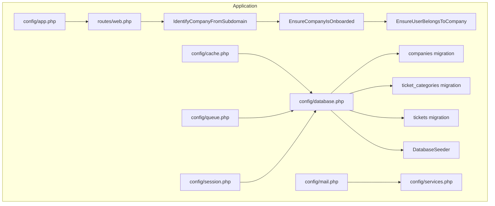
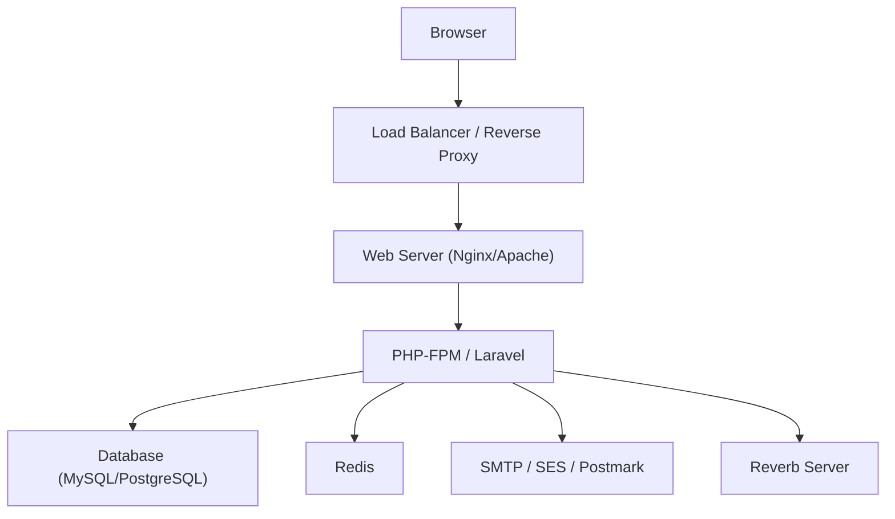
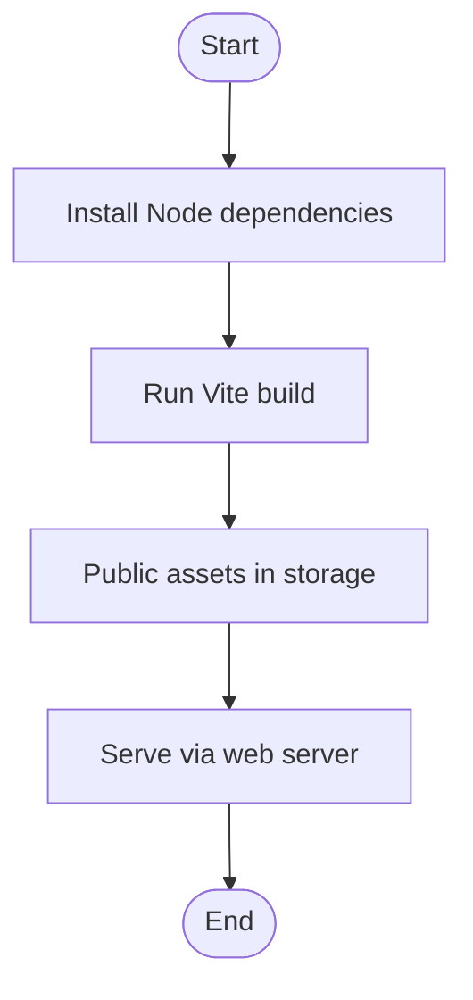
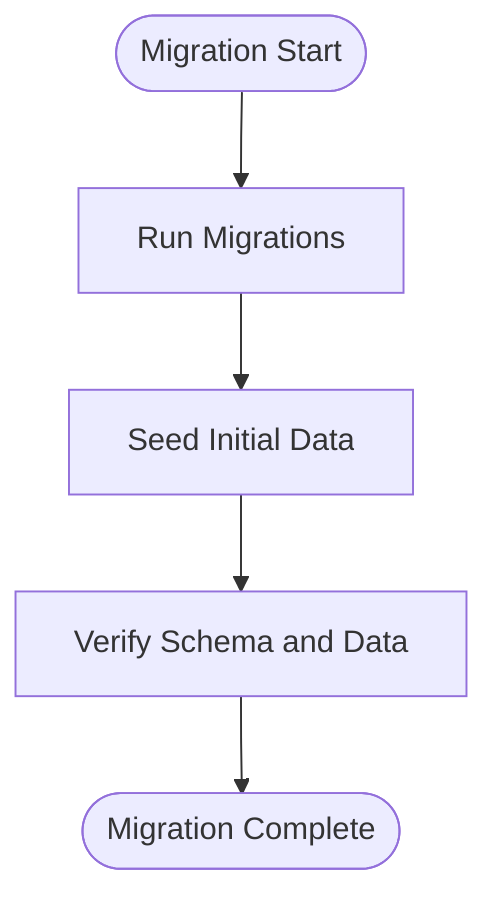
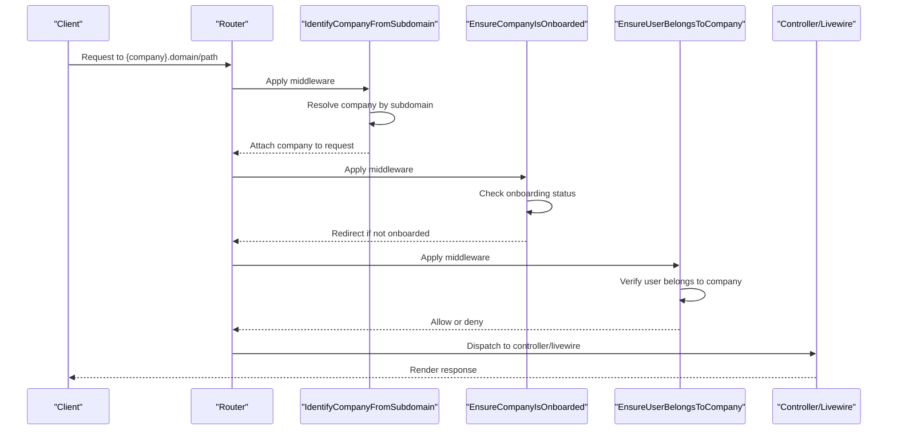
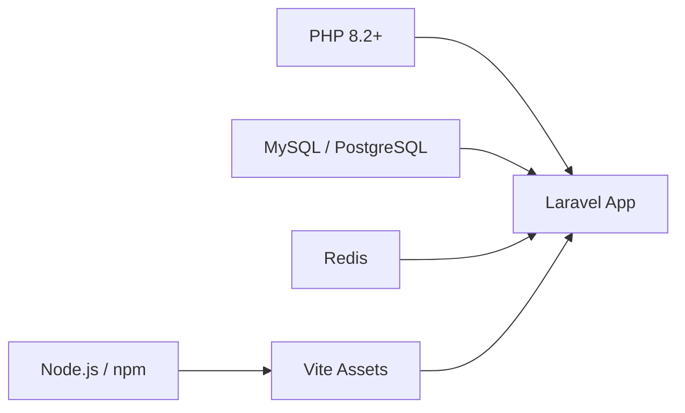

# Production Deployment

<cite>
**Referenced Files in This Document**
- [.env.example](file://.env.example)
- [composer.json](file://composer.json)
- [package.json](file://package.json)
- [vite.config.js](file://vite.config.js)
- [config/app.php](file://config/app.php)
- [config/database.php](file://config/database.php)
- [config/cache.php](file://config/cache.php)
- [config/queue.php](file://config/queue.php)
- [config/session.php](file://config/session.php)
- [config/mail.php](file://config/mail.php)
- [config/services.php](file://config/services.php)
- [routes/web.php](file://routes/web.php)
- [app/Http/Middleware/IdentifyCompanyFromSubdomain.php](file://app/Http/Middleware/IdentifyCompanyFromSubdomain.php)
- [app/Http/Middleware/EnsureCompanyIsOnboarded.php](file://app/Http/Middleware/EnsureCompanyIsOnboarded.php)
- [app/Http/Middleware/EnsureUserBelongsToCompany.php](file://app/Http/Middleware/EnsureUserBelongsToCompany.php)
- [database/migrations/2026_02_01_224200_create_companies_table.php](file://database/migrations/2026_02_01_224200_create_companies_table.php)
- [database/migrations/2026_02_01_224218_create_ticket_categories_table.php](file://database/migrations/2026_02_01_224218_create_ticket_categories_table.php)
- [database/migrations/2026_02_01_224222_create_tickets_table.php](file://database/migrations/2026_02_01_224222_create_tickets_table.php)
- [database/seeders/DatabaseSeeder.php](file://database/seeders/DatabaseSeeder.php)
</cite>

## Table of Contents
1. [Introduction](#introduction)
2. [Project Structure](#project-structure)
3. [Core Components](#core-components)
4. [Architecture Overview](#architecture-overview)
5. [Detailed Component Analysis](#detailed-component-analysis)
6. [Dependency Analysis](#dependency-analysis)
7. [Performance Considerations](#performance-considerations)
8. [Troubleshooting Guide](#troubleshooting-guide)
9. [Conclusion](#conclusion)
10. [Appendices](#appendices)

## Introduction
This document provides a comprehensive production deployment guide for the Helpdesk System. It covers environment configuration, database and Redis setup, asset compilation with Vite, database migration and seeding, server requirements, and a step-by-step deployment checklist. It also explains SSL certificate installation, domain configuration, and subdomain routing for multi-company architecture.

## Project Structure
The Helpdesk System is a Laravel 12 application with Livewire 4 and Vite-based assets. Key deployment-relevant areas:
- Configuration: config/*.php files define database, cache, queue, session, mail, and services.
- Routing: routes/web.php defines domain-scoped subdomain routes for multi-company isolation.
- Middleware: app/Http/Middleware/* enforces company identification, onboarding, and access checks.
- Migrations: database/migrations/* define the schema for companies, categories, tickets, and related tables.
- Seeders: database/seeders/* populate initial data for development and testing.

**Diagram sources**
- [config/app.php:125-128](file://config/app.php#L125-L128)
- [config/database.php:19-181](file://config/database.php#L19-L181)
- [config/cache.php:18-116](file://config/cache.php#L18-L116)
- [config/queue.php:16-128](file://config/queue.php#L16-L128)
- [config/session.php:21-216](file://config/session.php#L21-L216)
- [config/mail.php:17-116](file://config/mail.php#L17-L116)
- [config/services.php:38-42](file://config/services.php#L38-L42)
- [routes/web.php:70-114](file://routes/web.php#L70-L114)
- [app/Http/Middleware/IdentifyCompanyFromSubdomain.php:10-36](file://app/Http/Middleware/IdentifyCompanyFromSubdomain.php#L10-L36)
- [app/Http/Middleware/EnsureCompanyIsOnboarded.php:9-26](file://app/Http/Middleware/EnsureCompanyIsOnboarded.php#L9-L26)
- [app/Http/Middleware/EnsureUserBelongsToCompany.php:9-37](file://app/Http/Middleware/EnsureUserBelongsToCompany.php#L9-L37)
- [database/migrations/2026_02_01_224200_create_companies_table.php:14-30](file://database/migrations/2026_02_01_224200_create_companies_table.php#L14-L30)
- [database/migrations/2026_02_01_224218_create_ticket_categories_table.php:11-25](file://database/migrations/2026_02_01_224218_create_ticket_categories_table.php#L11-L25)
- [database/migrations/2026_02_01_224222_create_tickets_table.php:11-54](file://database/migrations/2026_02_01_224222_create_tickets_table.php#L11-L54)
- [database/seeders/DatabaseSeeder.php](file://database/seeders/DatabaseSeeder.php#L151)

**Section sources**
- [config/app.php:125-128](file://config/app.php#L125-L128)
- [routes/web.php:70-114](file://routes/web.php#L70-L114)

## Core Components
- Environment configuration
  - Application: APP_ENV, APP_DEBUG, APP_URL, APP_DOMAIN, APP_URL_WITHOUT_PROTOCOL, APP_KEY.
  - Database: DB_CONNECTION, DB_HOST, DB_PORT, DB_DATABASE, DB_USERNAME, DB_PASSWORD, DB_URL, DB_CHARSET, DB_COLLATION, DB_SSLMODE.
  - Cache: CACHE_STORE, CACHE_PREFIX.
  - Sessions: SESSION_DRIVER, SESSION_LIFETIME, SESSION_DOMAIN, SESSION_SECURE_COOKIE, SESSION_SAME_SITE.
  - Queue: QUEUE_CONNECTION, QUEUE_FAILED_DRIVER.
  - Redis: REDIS_CLIENT, REDIS_HOST, REDIS_PORT, REDIS_PASSWORD, REDIS_DB, REDIS_CACHE_DB, REDIS_PREFIX, REDIS_QUEUE_CONNECTION, REDIS_CACHE_CONNECTION.
  - Mail: MAIL_MAILER, MAIL_HOST, MAIL_PORT, MAIL_USERNAME, MAIL_PASSWORD, MAIL_ENCRYPTION, MAIL_FROM_ADDRESS, MAIL_FROM_NAME.
  - Services: GOOGLE_CLIENT_ID, GOOGLE_CLIENT_SECRET, GOOGLE_REDIRECT_URI.
  - Reverb: REVERB_APP_ID, REVERB_APP_KEY, REVERB_APP_SECRET, REVERB_HOST, REVERB_PORT, REVERB_SCHEME, VITE_REVERB_*.
  - AI APIs: OPENAI_API_KEY, GEMINI_API_KEY, etc.
- Asset pipeline
  - Vite build via npm scripts; Laravel Vite plugin configured for resources/css/app.css and resources/js/app.js.
- Multi-company subdomain routing
  - Routes scoped to {company}.domain; middleware identifies company by subdomain, ensures onboarding, and validates user-company membership.

**Section sources**
- [.env.example:1-100](file://.env.example#L1-L100)
- [config/app.php:29-128](file://config/app.php#L29-L128)
- [config/database.php:19-181](file://config/database.php#L19-L181)
- [config/cache.php:18-116](file://config/cache.php#L18-L116)
- [config/session.php:21-216](file://config/session.php#L21-L216)
- [config/queue.php:16-128](file://config/queue.php#L16-L128)
- [config/mail.php:17-116](file://config/mail.php#L17-L116)
- [config/services.php:38-42](file://config/services.php#L38-L42)
- [package.json:5-8](file://package.json#L5-L8)
- [vite.config.js:7-14](file://vite.config.js#L7-L14)
- [routes/web.php:70-114](file://routes/web.php#L70-L114)
- [app/Http/Middleware/IdentifyCompanyFromSubdomain.php:10-36](file://app/Http/Middleware/IdentifyCompanyFromSubdomain.php#L10-L36)
- [app/Http/Middleware/EnsureCompanyIsOnboarded.php:9-26](file://app/Http/Middleware/EnsureCompanyIsOnboarded.php#L9-L26)
- [app/Http/Middleware/EnsureUserBelongsToCompany.php:9-37](file://app/Http/Middleware/EnsureUserBelongsToCompany.php#L9-L37)

## Architecture Overview
The production runtime integrates:
- Web server (e.g., Nginx/Apache) proxying to PHP-FPM.
- Application server running Laravel routes and controllers.
- Database (MySQL or PostgreSQL) for persistent data.
- Redis for caching and queues.
- Optional external services (mail, AI providers, Reverb).
- Vite-built assets served by the web server.

[No sources needed since this diagram shows conceptual workflow, not actual code structure]

## Detailed Component Analysis

### Environment Configuration
- Application
  - APP_ENV: set to production for production deployments.
  - APP_DEBUG: disabled in production.
  - APP_URL: base URL without protocol for internal generation.
  - APP_DOMAIN and APP_URL_WITHOUT_PROTOCOL: used by subdomain routing and redirects.
  - APP_KEY: generated via key:generate during setup.
- Database
  - Choose DB_CONNECTION=mysql or pgsql; configure host, port, database, username, password.
  - For MySQL, DB_CHARSET and DB_COLLATION are configurable; for PostgreSQL, DB_SSLMODE is supported.
- Cache and Sessions
  - CACHE_STORE: database recommended for shared environments.
  - SESSION_DRIVER: database recommended for multi-node deployments.
  - SESSION_DOMAIN: ensure it matches your domain/subdomain pattern.
- Queue
  - QUEUE_CONNECTION: database recommended for simplicity; redis for scale.
  - QUEUE_FAILED_DRIVER: database-uuids recommended for audit.
- Redis
  - Configure client, host, port, password, databases for default/cache/queues.
  - Use separate DB indices for cache vs. default vs. queues.
- Mail
  - MAIL_MAILER: smtp, ses, postmark, resend, log.
  - Configure host, port, encryption, credentials, and sender address/name.
- Services
  - GOOGLE_*: OAuth client credentials and redirect URI.
- Reverb
  - REVERB_* and VITE_REVERB_*: pusher-compatible WebSocket server for real-time features.

**Section sources**
- [.env.example:1-100](file://.env.example#L1-L100)
- [config/app.php:29-128](file://config/app.php#L29-L128)
- [config/database.php:19-181](file://config/database.php#L19-L181)
- [config/cache.php:18-116](file://config/cache.php#L18-L116)
- [config/session.php:21-216](file://config/session.php#L21-L216)
- [config/queue.php:16-128](file://config/queue.php#L16-L128)
- [config/mail.php:17-116](file://config/mail.php#L17-L116)
- [config/services.php:38-42](file://config/services.php#L38-L42)

### Asset Compilation with Vite and npm
- Build assets
  - Install dependencies: npm install
  - Build production assets: npm run build
- Development
  - Local dev: npm run dev (runs Vite and optionally Reverb).
- Vite configuration
  - Inputs: resources/css/app.css, resources/js/app.js
  - Plugins: laravel-vite-plugin, tailwindcss
  - Server: CORS enabled, ignores compiled view files

**Diagram sources**
- [package.json:5-8](file://package.json#L5-L8)
- [vite.config.js:7-14](file://vite.config.js#L7-L14)

**Section sources**
- [package.json:5-8](file://package.json#L5-L8)
- [vite.config.js:7-14](file://vite.config.js#L7-L14)

### Database Migration and Seeding
- Supported databases
  - sqlite, mysql, mariadb, pgsql, sqlsrv
- Migration lifecycle
  - Create schema: php artisan migrate
  - Rollback: php artisan migrate:rollback
  - Refresh: php artisan migrate:fresh (with --seed in local setup)
- Seed data
  - Default seeder creates a test company, admin/operator users, categories, and tickets.
  - Use php artisan db:seed to run seeders after migrations.

**Diagram sources**
- [composer.json:48-56](file://composer.json#L48-L56)
- [database/migrations/2026_02_01_224200_create_companies_table.php:12-39](file://database/migrations/2026_02_01_224200_create_companies_table.php#L12-L39)
- [database/migrations/2026_02_01_224218_create_ticket_categories_table.php:9-30](file://database/migrations/2026_02_01_224218_create_ticket_categories_table.php#L9-L30)
- [database/migrations/2026_02_01_224222_create_tickets_table.php:9-58](file://database/migrations/2026_02_01_224222_create_tickets_table.php#L9-L58)
- [database/seeders/DatabaseSeeder.php:13-149](file://database/seeders/DatabaseSeeder.php#L13-L149)

**Section sources**
- [composer.json:48-56](file://composer.json#L48-L56)
- [database/migrations/2026_02_01_224200_create_companies_table.php:12-39](file://database/migrations/2026_02_01_224200_create_companies_table.php#L12-L39)
- [database/migrations/2026_02_01_224218_create_ticket_categories_table.php:9-30](file://database/migrations/2026_02_01_224218_create_ticket_categories_table.php#L9-L30)
- [database/migrations/2026_02_01_224222_create_tickets_table.php:9-58](file://database/migrations/2026_02_01_224222_create_tickets_table.php#L9-L58)
- [database/seeders/DatabaseSeeder.php:13-149](file://database/seeders/DatabaseSeeder.php#L13-L149)

### Subdomain Routing for Multi-Company
- Domain pattern
  - Base domain configured via APP_DOMAIN; subdomains map to company slugs.
- Route groups
  - Routes under {company}.domain are protected by auth, company access, and email verification.
- Middleware chain
  - IdentifyCompanyFromSubdomain: extracts subdomain and attaches company to request.
  - EnsureCompanyIsOnboarded: redirects unonboarded companies to onboarding.
  - EnsureUserBelongsToCompany: enforces user-company membership.

**Diagram sources**
- [routes/web.php:70-114](file://routes/web.php#L70-L114)
- [app/Http/Middleware/IdentifyCompanyFromSubdomain.php:10-36](file://app/Http/Middleware/IdentifyCompanyFromSubdomain.php#L10-L36)
- [app/Http/Middleware/EnsureCompanyIsOnboarded.php:9-26](file://app/Http/Middleware/EnsureCompanyIsOnboarded.php#L9-L26)
- [app/Http/Middleware/EnsureUserBelongsToCompany.php:9-37](file://app/Http/Middleware/EnsureUserBelongsToCompany.php#L9-L37)

**Section sources**
- [routes/web.php:70-114](file://routes/web.php#L70-L114)
- [app/Http/Middleware/IdentifyCompanyFromSubdomain.php:10-36](file://app/Http/Middleware/IdentifyCompanyFromSubdomain.php#L10-L36)
- [app/Http/Middleware/EnsureCompanyIsOnboarded.php:9-26](file://app/Http/Middleware/EnsureCompanyIsOnboarded.php#L9-L26)
- [app/Http/Middleware/EnsureUserBelongsToCompany.php:9-37](file://app/Http/Middleware/EnsureUserBelongsToCompany.php#L9-L37)

## Dependency Analysis
- Runtime requirements
  - PHP 8.2+ (composer.json)
  - Database: MySQL or PostgreSQL (config/database.php)
  - Redis (config/database.php redis options)
  - Node.js/npm for asset build (package.json)
- Laravel services
  - Database, Cache, Queue, Session, Mail configured via config/*.php
  - Reverb for real-time features (config/reverb.php referenced in .env)
- Middleware dependencies
  - Subdomain routing depends on APP_DOMAIN and routes/web.php domain grouping.

**Diagram sources**
- [composer.json:11-22](file://composer.json#L11-L22)
- [config/database.php:19-181](file://config/database.php#L19-L181)
- [package.json:9-35](file://package.json#L9-L35)

**Section sources**
- [composer.json:11-22](file://composer.json#L11-L22)
- [config/database.php:19-181](file://config/database.php#L19-L181)
- [package.json:9-35](file://package.json#L9-L35)

## Performance Considerations
- Database
  - Use MySQL or PostgreSQL in production; configure charset/collation appropriately.
  - Enable proper indexes as defined in migrations for performance.
- Cache and Sessions
  - Use database-backed cache and sessions for multi-node deployments.
  - Tune CACHE_PREFIX and SESSION_DOMAIN for isolation.
- Queue
  - Use database queues for simplicity; switch to Redis for high throughput.
  - Monitor failed jobs and retry policies.
- Redis
  - Separate DB indices for default/cache/queues; tune max retries and backoff.
- Assets
  - Build for production with Vite; ensure web server serves static assets efficiently.

[No sources needed since this section provides general guidance]

## Troubleshooting Guide
- Environment variables missing
  - Ensure APP_KEY is generated and APP_ENV is production.
  - Verify DB_CONNECTION and credentials; check DB_SSLMODE for PostgreSQL.
- Subdomain access denied
  - Confirm company slug exists and matches subdomain.
  - Ensure user belongs to the company; check middleware order.
- Session or cookie issues
  - Adjust SESSION_DOMAIN, SESSION_SECURE_COOKIE, SESSION_SAME_SITE.
- Queue or Redis problems
  - Verify REDIS_* variables and connectivity; check queue worker processes.
- Asset build failures
  - Clear node_modules and reinstall; ensure Vite plugins are installed.

**Section sources**
- [.env.example:1-100](file://.env.example#L1-L100)
- [config/session.php:130-216](file://config/session.php#L130-L216)
- [config/database.php:145-181](file://config/database.php#L145-L181)
- [config/queue.php:67-74](file://config/queue.php#L67-L74)
- [package.json:5-8](file://package.json#L5-L8)
- [vite.config.js:7-14](file://vite.config.js#L7-L14)

## Conclusion
This guide outlines production deployment for the Helpdesk System, covering environment variables, database and Redis setup, asset compilation, migrations and seeding, server requirements, and multi-company subdomain routing. Follow the step-by-step checklist below to deploy reliably.

## Appendices

### Step-by-Step Deployment Checklist
- Pre-deployment
  - Provision servers: web server, PHP-FPM, database, Redis.
  - Prepare DNS: wildcard or subdomain records pointing to load balancer/web server.
  - Install system dependencies: PHP 8.2+, Composer, Node.js/npm.
- Upload code
  - Copy application files to the target server.
  - Ensure correct ownership and permissions.
- Environment configuration
  - Create .env from .env.example; set APP_ENV=production, APP_DEBUG=false.
  - Generate APP_KEY: php artisan key:generate.
  - Configure DB_CONNECTION and credentials; set DB_SSLMODE for PostgreSQL.
  - Configure CACHE_STORE, SESSION_DRIVER, QUEUE_CONNECTION.
  - Configure Redis variables (host, port, password, DB indices).
  - Configure MAIL_MAILER and credentials; set MAIL_FROM_*.
  - Configure GOOGLE_* for OAuth; set GOOGLE_REDIRECT_URI.
  - Configure Reverb variables and VITE_REVERB_*.
- Install dependencies
  - Composer: composer install --no-dev --optimize-autoloader.
  - Node: npm ci (not npm install for production).
- Database setup
  - Create database and user; ensure privileges.
  - Run migrations: php artisan migrate --force.
  - Seed data (optional): php artisan db:seed.
- Asset compilation
  - Build assets: npm run build.
  - Ensure public assets are served by the web server.
- Services
  - Start queue workers: php artisan queue:work or supervisor configuration.
  - Start Reverb if enabled: php artisan reverb:start.
- SSL and domain
  - Install SSL certificates on the load balancer/web server.
  - Configure virtual hosts or server blocks to enforce HTTPS.
  - Point APP_URL to HTTPS base URL.
- Subdomain routing
  - Ensure APP_DOMAIN matches your base domain.
  - Verify wildcard subdomains resolve to the application.
- Verification
  - Test login and dashboard access per subdomain.
  - Verify email delivery and queue processing.
  - Confirm asset loading and WebSocket features (if enabled).
- Monitoring and maintenance
  - Set up log rotation and monitoring.
  - Plan backups for database and Redis.
  - Schedule periodic updates and security patches.

**Section sources**
- [.env.example:1-100](file://.env.example#L1-L100)
- [composer.json:48-56](file://composer.json#L48-L56)
- [package.json:5-8](file://package.json#L5-L8)
- [config/database.php:19-181](file://config/database.php#L19-L181)
- [config/cache.php:18-116](file://config/cache.php#L18-L116)
- [config/session.php:21-216](file://config/session.php#L21-L216)
- [config/queue.php:16-128](file://config/queue.php#L16-L128)
- [config/mail.php:17-116](file://config/mail.php#L17-L116)
- [config/services.php:38-42](file://config/services.php#L38-L42)
- [routes/web.php:70-114](file://routes/web.php#L70-L114)