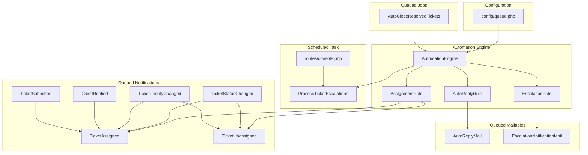
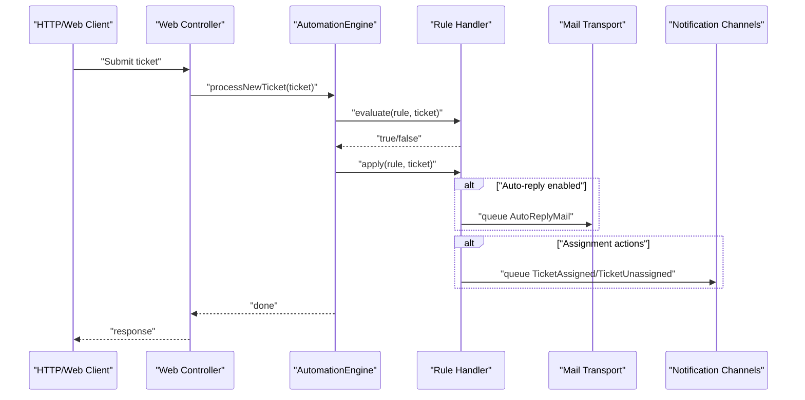
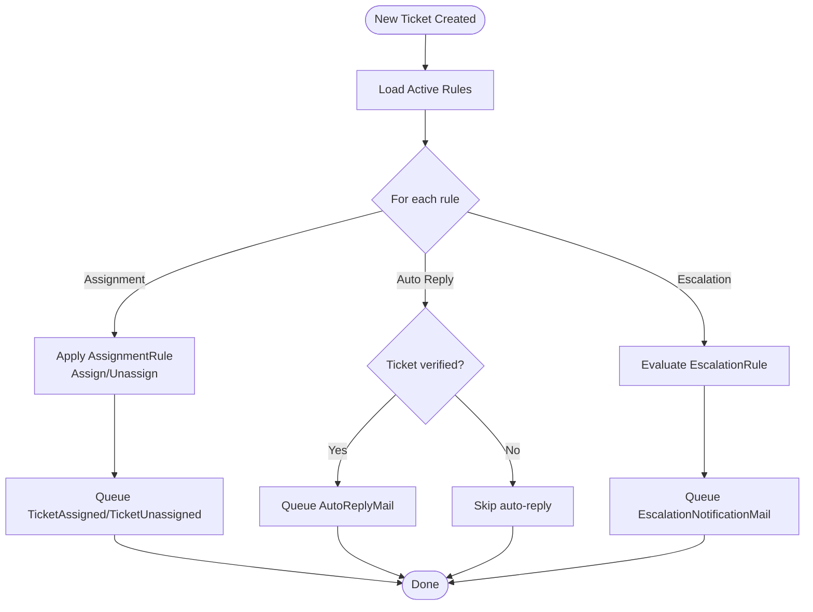
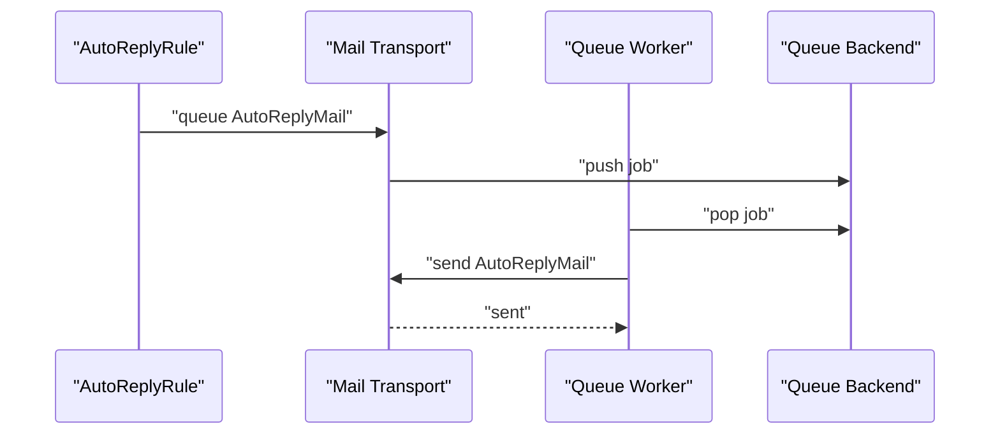
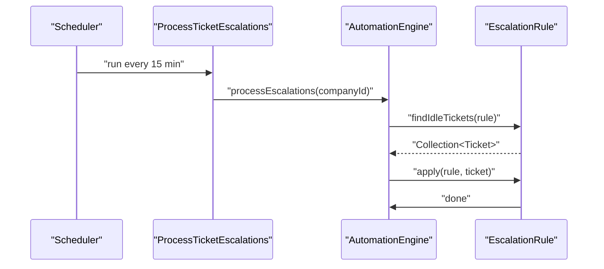
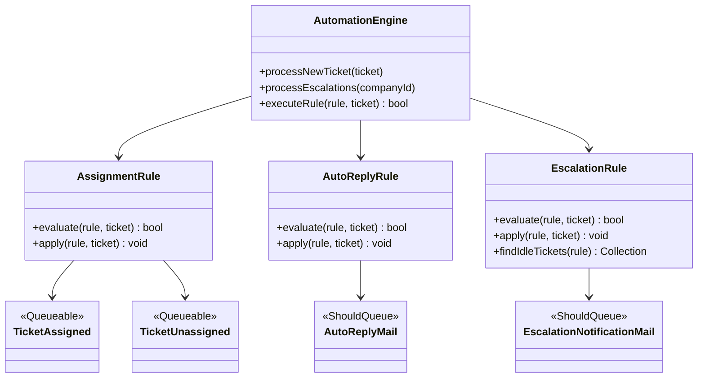

# Queue Processing

<cite>
**Referenced Files in This Document**
- [config/queue.php](file://config/queue.php)
- [app/Jobs/AutoCloseResolvedTickets.php](file://app/Jobs/AutoCloseResolvedTickets.php)
- [app/Console/Commands/ProcessTicketEscalations.php](file://app/Console/Commands/ProcessTicketEscalations.php)
- [routes/console.php](file://routes/console.php)
- [app/Services/Automation/AutomationEngine.php](file://app/Services/Automation/AutomationEngine.php)
- [app/Services/Automation/Rules/AssignmentRule.php](file://app/Services/Automation/Rules/AssignmentRule.php)
- [app/Services/Automation/Rules/AutoReplyRule.php](file://app/Services/Automation/Rules/AutoReplyRule.php)
- [app/Services/Automation/Rules/EscalationRule.php](file://app/Services/Automation/Rules/EscalationRule.php)
- [app/Mail/AutoReplyMail.php](file://app/Mail/AutoReplyMail.php)
- [app/Mail/EscalationNotificationMail.php](file://app/Mail/EscalationNotificationMail.php)
- [app/Notifications/TicketAssigned.php](file://app/Notifications/TicketAssigned.php)
- [app/Notifications/TicketUnassigned.php](file://app/Notifications/TicketUnassigned.php)
- [app/Notifications/TicketStatusChanged.php](file://app/Notifications/TicketStatusChanged.php)
- [app/Notifications/TicketPriorityChanged.php](file://app/Notifications/TicketPriorityChanged.php)
- [app/Notifications/ClientReplied.php](file://app/Notifications/ClientReplied.php)
- [app/Notifications/TicketSubmitted.php](file://app/Notifications/TicketSubmitted.php)
</cite>

## Table of Contents
1. [Introduction](#introduction)
2. [Project Structure](#project-structure)
3. [Core Components](#core-components)
4. [Architecture Overview](#architecture-overview)
5. [Detailed Component Analysis](#detailed-component-analysis)
6. [Dependency Analysis](#dependency-analysis)
7. [Performance Considerations](#performance-considerations)
8. [Troubleshooting Guide](#troubleshooting-guide)
9. [Conclusion](#conclusion)

## Introduction
This document explains queue processing in the Helpdesk System, focusing on Laravel queue configuration, background job processing for ticket automation, email sending, notification dispatching, and scheduled tasks. It covers driver options (database, Redis, SQS), worker setup, monitoring and scaling, retry and failure handling, dead letter queue configuration, performance optimization, memory management, worker supervision, and troubleshooting.

## Project Structure
The queue system spans configuration, automation services, rule handlers, queued mailables, queued notifications, and scheduled commands.

**Diagram sources**
- [config/queue.php:1-130](file://config/queue.php#L1-L130)
- [app/Services/Automation/AutomationEngine.php:1-142](file://app/Services/Automation/AutomationEngine.php#L1-L142)
- [app/Services/Automation/Rules/AssignmentRule.php:1-67](file://app/Services/Automation/Rules/AssignmentRule.php#L1-L67)
- [app/Services/Automation/Rules/AutoReplyRule.php:1-65](file://app/Services/Automation/Rules/AutoReplyRule.php#L1-L65)
- [app/Services/Automation/Rules/EscalationRule.php:1-157](file://app/Services/Automation/Rules/EscalationRule.php#L1-L157)
- [app/Jobs/AutoCloseResolvedTickets.php:1-28](file://app/Jobs/AutoCloseResolvedTickets.php#L1-L28)
- [app/Console/Commands/ProcessTicketEscalations.php:1-55](file://app/Console/Commands/ProcessTicketEscalations.php#L1-L55)
- [routes/console.php:17-21](file://routes/console.php#L17-L21)
- [app/Mail/AutoReplyMail.php:1-47](file://app/Mail/AutoReplyMail.php#L1-L47)
- [app/Mail/EscalationNotificationMail.php:1-47](file://app/Mail/EscalationNotificationMail.php#L1-L47)
- [app/Notifications/TicketAssigned.php:1-48](file://app/Notifications/TicketAssigned.php#L1-L48)
- [app/Notifications/TicketUnassigned.php:1-48](file://app/Notifications/TicketUnassigned.php#L1-L48)
- [app/Notifications/TicketStatusChanged.php:1-54](file://app/Notifications/TicketStatusChanged.php#L1-L54)
- [app/Notifications/TicketPriorityChanged.php:1-54](file://app/Notifications/TicketPriorityChanged.php#L1-L54)
- [app/Notifications/ClientReplied.php:1-48](file://app/Notifications/ClientReplied.php#L1-L48)
- [app/Notifications/TicketSubmitted.php:1-48](file://app/Notifications/TicketSubmitted.php#L1-L48)

**Section sources**
- [config/queue.php:1-130](file://config/queue.php#L1-L130)
- [routes/console.php:17-21](file://routes/console.php#L17-L21)

## Core Components
- Queue configuration defines the default driver and connection options for database, beanstalkd, SQS, and Redis. It also configures job batching and failed job storage.
- AutomationEngine orchestrates rule evaluation and application for new tickets and escalations.
- Rule handlers implement specific actions: AssignmentRule, AutoReplyRule, and EscalationRule.
- Queued jobs and mailables implement ShouldQueue and are processed asynchronously.
- Scheduled command runs escalation processing periodically.

Key queue-enabled artifacts:
- Jobs: [AutoCloseResolvedTickets:8-27](file://app/Jobs/AutoCloseResolvedTickets.php#L8-L27)
- Mailables: [AutoReplyMail:13-21](file://app/Mail/AutoReplyMail.php#L13-L21), [EscalationNotificationMail:14-21](file://app/Mail/EscalationNotificationMail.php#L14-L21)
- Notifications: [TicketAssigned:9-27](file://app/Notifications/TicketAssigned.php#L9-L27), [TicketUnassigned:9-27](file://app/Notifications/TicketUnassigned.php#L9-L27), [TicketStatusChanged:9-27](file://app/Notifications/TicketStatusChanged.php#L9-L27), [TicketPriorityChanged:9-27](file://app/Notifications/TicketPriorityChanged.php#L9-L27), [ClientReplied:9-27](file://app/Notifications/ClientReplied.php#L9-L27), [TicketSubmitted:9-27](file://app/Notifications/TicketSubmitted.php#L9-L27)
- Scheduler: [ProcessTicketEscalations:9-54](file://app/Console/Commands/ProcessTicketEscalations.php#L9-L54) scheduled via [routes/console.php:17-21](file://routes/console.php#L17-L21)

**Section sources**
- [config/queue.php:16-127](file://config/queue.php#L16-L127)
- [app/Services/Automation/AutomationEngine.php:15-141](file://app/Services/Automation/AutomationEngine.php#L15-L141)
- [app/Services/Automation/Rules/AssignmentRule.php:9-66](file://app/Services/Automation/Rules/AssignmentRule.php#L9-L66)
- [app/Services/Automation/Rules/AutoReplyRule.php:10-64](file://app/Services/Automation/Rules/AutoReplyRule.php#L10-L64)
- [app/Services/Automation/Rules/EscalationRule.php:12-156](file://app/Services/Automation/Rules/EscalationRule.php#L12-L156)
- [app/Jobs/AutoCloseResolvedTickets.php:8-27](file://app/Jobs/AutoCloseResolvedTickets.php#L8-L27)
- [app/Mail/AutoReplyMail.php:13-21](file://app/Mail/AutoReplyMail.php#L13-L21)
- [app/Mail/EscalationNotificationMail.php:14-21](file://app/Mail/EscalationNotificationMail.php#L14-L21)
- [routes/console.php:17-21](file://routes/console.php#L17-L21)

## Architecture Overview
The system uses a hybrid synchronous/asynchronous model:
- New ticket automation executes synchronously within the request lifecycle (except for queued mailables/notifications).
- Escalation processing runs on a schedule and may enqueue work depending on rule actions.
- Email sending and selected notifications are queued via ShouldQueue and Queueable traits.
- Worker processes consume queues according to the configured driver.

**Diagram sources**
- [app/Services/Automation/AutomationEngine.php:30-96](file://app/Services/Automation/AutomationEngine.php#L30-L96)
- [app/Services/Automation/Rules/AssignmentRule.php:50-65](file://app/Services/Automation/Rules/AssignmentRule.php#L50-L65)
- [app/Services/Automation/Rules/AutoReplyRule.php:50-63](file://app/Services/Automation/Rules/AutoReplyRule.php#L50-L63)
- [app/Mail/AutoReplyMail.php:13-21](file://app/Mail/AutoReplyMail.php#L13-L21)
- [app/Notifications/TicketAssigned.php:11-27](file://app/Notifications/TicketAssigned.php#L11-L27)
- [app/Notifications/TicketUnassigned.php:11-27](file://app/Notifications/TicketUnassigned.php#L11-L27)

## Detailed Component Analysis

### Queue Configuration and Drivers
- Default driver is configurable via environment and defaults to database.
- Available drivers include sync, database, beanstalkd, SQS, redis, deferred, background, failover, and null.
- Database driver supports table-backed queues with per-connection queue name and retry_after window.
- SQS driver supports key/secret/region/prefix/suffix and queue selection.
- Redis driver supports connection and queue selection with retry_after and block_for semantics.
- Failed job storage supports database-uuids, dynamodb, file, and null drivers.

Operational implications:
- Choose database for simplicity and local/dev environments.
- Use Redis for low-latency, high-throughput scenarios.
- Use SQS for cloud-native deployments with managed messaging.

**Section sources**
- [config/queue.php:16](file://config/queue.php#L16)
- [config/queue.php:32-92](file://config/queue.php#L32-L92)
- [config/queue.php:123-127](file://config/queue.php#L123-L127)

### Background Job Processing for Ticket Automation
- AutomationEngine processes rules for newly created tickets synchronously but delegates side effects (mailing, notifications) to queued components.
- AssignmentRule applies assignments and queues notifications.
- AutoReplyRule queues AutoReplyMail when conditions match.
- EscalationRule finds idle tickets and applies actions; it queues EscalationNotificationMail to admins.

**Diagram sources**
- [app/Services/Automation/AutomationEngine.php:30-96](file://app/Services/Automation/AutomationEngine.php#L30-L96)
- [app/Services/Automation/Rules/AssignmentRule.php:50-65](file://app/Services/Automation/Rules/AssignmentRule.php#L50-L65)
- [app/Services/Automation/Rules/AutoReplyRule.php:50-63](file://app/Services/Automation/Rules/AutoReplyRule.php#L50-L63)
- [app/Services/Automation/Rules/EscalationRule.php:101-144](file://app/Services/Automation/Rules/EscalationRule.php#L101-L144)
- [app/Mail/AutoReplyMail.php:13-21](file://app/Mail/AutoReplyMail.php#L13-L21)
- [app/Mail/EscalationNotificationMail.php:14-21](file://app/Mail/EscalationNotificationMail.php#L14-L21)
- [app/Notifications/TicketAssigned.php:11-27](file://app/Notifications/TicketAssigned.php#L11-L27)
- [app/Notifications/TicketUnassigned.php:11-27](file://app/Notifications/TicketUnassigned.php#L11-L27)

**Section sources**
- [app/Services/Automation/AutomationEngine.php:30-96](file://app/Services/Automation/AutomationEngine.php#L30-L96)
- [app/Services/Automation/Rules/AssignmentRule.php:50-65](file://app/Services/Automation/Rules/AssignmentRule.php#L50-L65)
- [app/Services/Automation/Rules/AutoReplyRule.php:50-63](file://app/Services/Automation/Rules/AutoReplyRule.php#L50-L63)
- [app/Services/Automation/Rules/EscalationRule.php:101-144](file://app/Services/Automation/Rules/EscalationRule.php#L101-L144)

### Email Sending and Notification Dispatching
- AutoReplyMail implements ShouldQueue and uses Queueable/SerializesModels to defer sending until workers process the queue.
- EscalationNotificationMail similarly implements ShouldQueue to notify admins asynchronously.
- Several notifications implement Queueable and target database/broadcast channels, enabling asynchronous delivery.

**Diagram sources**
- [app/Mail/AutoReplyMail.php:13-21](file://app/Mail/AutoReplyMail.php#L13-L21)
- [app/Mail/EscalationNotificationMail.php:14-21](file://app/Mail/EscalationNotificationMail.php#L14-L21)
- [config/queue.php:38-45](file://config/queue.php#L38-L45)

**Section sources**
- [app/Mail/AutoReplyMail.php:13-21](file://app/Mail/AutoReplyMail.php#L13-L21)
- [app/Mail/EscalationNotificationMail.php:14-21](file://app/Mail/EscalationNotificationMail.php#L14-L21)
- [app/Notifications/TicketAssigned.php:11-27](file://app/Notifications/TicketAssigned.php#L11-L27)
- [app/Notifications/TicketUnassigned.php:11-27](file://app/Notifications/TicketUnassigned.php#L11-L27)
- [app/Notifications/TicketStatusChanged.php:11-27](file://app/Notifications/TicketStatusChanged.php#L11-L27)
- [app/Notifications/TicketPriorityChanged.php:11-27](file://app/Notifications/TicketPriorityChanged.php#L11-L27)
- [app/Notifications/ClientReplied.php:11-27](file://app/Notifications/ClientReplied.php#L11-L27)
- [app/Notifications/TicketSubmitted.php:11-27](file://app/Notifications/TicketSubmitted.php#L11-L27)

### Scheduled Tasks and Escalation Processing
- The scheduler runs the tickets:process-escalations command every 15 minutes, without overlapping and in the background.
- The command iterates companies and invokes AutomationEngine::processEscalations for each.

**Diagram sources**
- [routes/console.php:17-21](file://routes/console.php#L17-L21)
- [app/Console/Commands/ProcessTicketEscalations.php:29-54](file://app/Console/Commands/ProcessTicketEscalations.php#L29-L54)
- [app/Services/Automation/AutomationEngine.php:46-54](file://app/Services/Automation/AutomationEngine.php#L46-L54)
- [app/Services/Automation/Rules/EscalationRule.php:101-113](file://app/Services/Automation/Rules/EscalationRule.php#L101-L113)

**Section sources**
- [routes/console.php:17-21](file://routes/console.php#L17-L21)
- [app/Console/Commands/ProcessTicketEscalations.php:29-54](file://app/Console/Commands/ProcessTicketEscalations.php#L29-L54)
- [app/Services/Automation/AutomationEngine.php:46-54](file://app/Services/Automation/AutomationEngine.php#L46-L54)
- [app/Services/Automation/Rules/EscalationRule.php:101-113](file://app/Services/Automation/Rules/EscalationRule.php#L101-L113)

### Job Retry Mechanisms and Failure Handling
- Retry behavior is governed by driver-specific retry_after settings in configuration.
- Failed jobs are stored according to the configured failed driver (default database-uuids) with a dedicated failed_jobs table.
- Laravel provides console commands to manage failed jobs (list, forget, retry, prune), which are registered in the framework.

Recommended practices:
- Tune retry_after per driver to match expected job runtime plus safety margin.
- Monitor failed_jobs and set up alerts.
- Use job-level exceptions to signal transient vs permanent failures.

**Section sources**
- [config/queue.php:43](file://config/queue.php#L43)
- [config/queue.php:71](file://config/queue.php#L71)
- [config/queue.php:123-127](file://config/queue.php#L123-L127)

### Dead Letter Queue (DLQ) Configuration
- The repository does not define a separate dead-letter queue binding in the queue configuration.
- To enable DLQ with SQS, configure a dead-letter queue policy externally and set the SQS driver’s maxDeliveryDelay or use a redrive policy pointing to a dead-letter queue. This is an external AWS configuration outside the repository files.
- For Redis, DLQ is not natively supported; consider offloading failed items to a separate queue or using a monitoring hook to route failures.

[No sources needed since this section provides general guidance]

### Worker Setup, Monitoring, and Scaling
- Workers consume queues based on the configured driver. Use the queue:work Artisan command to start workers.
- Use --sleep and --max-jobs options to tune responsiveness and longevity.
- Use supervisor or systemd to monitor and restart workers automatically.
- Scale horizontally by running multiple workers behind a load balancer or autoscaling groups.
- For Redis, consider sharding queues by name to distribute load.

[No sources needed since this section provides general guidance]

### Performance Optimization and Memory Management
- Use Redis or SQS for high throughput; database driver is simpler but can become a bottleneck under load.
- Keep jobs small and stateless; avoid heavy initialization in constructors.
- Use batch processing for bulk operations where appropriate.
- Monitor memory usage and restart workers periodically to prevent leaks.

[No sources needed since this section provides general guidance]

## Dependency Analysis
The automation subsystem composes loosely coupled rule handlers and delegates side effects to queued components.

**Diagram sources**
- [app/Services/Automation/AutomationEngine.php:15-141](file://app/Services/Automation/AutomationEngine.php#L15-L141)
- [app/Services/Automation/Rules/AssignmentRule.php:9-66](file://app/Services/Automation/Rules/AssignmentRule.php#L9-L66)
- [app/Services/Automation/Rules/AutoReplyRule.php:10-64](file://app/Services/Automation/Rules/AutoReplyRule.php#L10-L64)
- [app/Services/Automation/Rules/EscalationRule.php:12-156](file://app/Services/Automation/Rules/EscalationRule.php#L12-L156)
- [app/Mail/AutoReplyMail.php:13-21](file://app/Mail/AutoReplyMail.php#L13-L21)
- [app/Mail/EscalationNotificationMail.php:14-21](file://app/Mail/EscalationNotificationMail.php#L14-L21)
- [app/Notifications/TicketAssigned.php:9-27](file://app/Notifications/TicketAssigned.php#L9-L27)
- [app/Notifications/TicketUnassigned.php:9-27](file://app/Notifications/TicketUnassigned.php#L9-L27)

**Section sources**
- [app/Services/Automation/AutomationEngine.php:15-141](file://app/Services/Automation/AutomationEngine.php#L15-L141)
- [app/Services/Automation/Rules/AssignmentRule.php:9-66](file://app/Services/Automation/Rules/AssignmentRule.php#L9-L66)
- [app/Services/Automation/Rules/AutoReplyRule.php:10-64](file://app/Services/Automation/Rules/AutoReplyRule.php#L10-L64)
- [app/Services/Automation/Rules/EscalationRule.php:12-156](file://app/Services/Automation/Rules/EscalationRule.php#L12-L156)
- [app/Mail/AutoReplyMail.php:13-21](file://app/Mail/AutoReplyMail.php#L13-L21)
- [app/Mail/EscalationNotificationMail.php:14-21](file://app/Mail/EscalationNotificationMail.php#L14-L21)
- [app/Notifications/TicketAssigned.php:9-27](file://app/Notifications/TicketAssigned.php#L9-L27)
- [app/Notifications/TicketUnassigned.php:9-27](file://app/Notifications/TicketUnassigned.php#L9-L27)

## Performance Considerations
- Prefer Redis or SQS for production workloads to reduce database contention.
- Use separate queues per priority or workload type to avoid head-of-line blocking.
- Batch related operations when feasible to reduce overhead.
- Monitor queue latency and job throughput; scale workers proportionally.

[No sources needed since this section provides general guidance]

## Troubleshooting Guide
Common issues and remedies:
- Jobs not processed: Verify QUEUE_CONNECTION and driver credentials; check worker logs; ensure queue:work is running.
- Emails not sent: Confirm mail transport configuration and queue driver; inspect failed_jobs; test mail credentials.
- Escalations not applied: Validate scheduler setup and command permissions; review AutomationEngine logs for errors.
- High queue latency: Switch to Redis or SQS; increase worker count; reduce job payload sizes.

Operational commands (registered by Laravel):
- queue:work, queue:listen, queue:restart, queue:pause, queue:resume, queue:monitor
- queue:forget, queue:retry, queue:prune-failed, queue:prune-batches

**Section sources**
- [config/queue.php:16](file://config/queue.php#L16)
- [config/queue.php:123-127](file://config/queue.php#L123-L127)
- [routes/console.php:17-21](file://routes/console.php#L17-L21)
- [app/Services/Automation/AutomationEngine.php:87-95](file://app/Services/Automation/AutomationEngine.php#L87-L95)

## Conclusion
The Helpdesk System leverages Laravel’s queue abstraction to decouple ticket automation from request processing. AutomationEngine coordinates rule execution, while queued mailables and notifications ensure timely customer and admin communication. With configurable drivers, robust failed job handling, and scheduled escalation processing, the system supports scalable, resilient background processing suitable for production deployment.