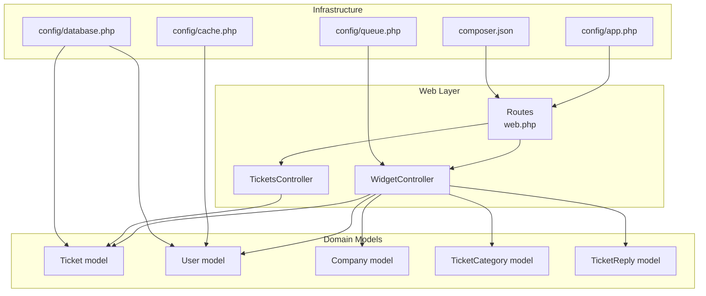
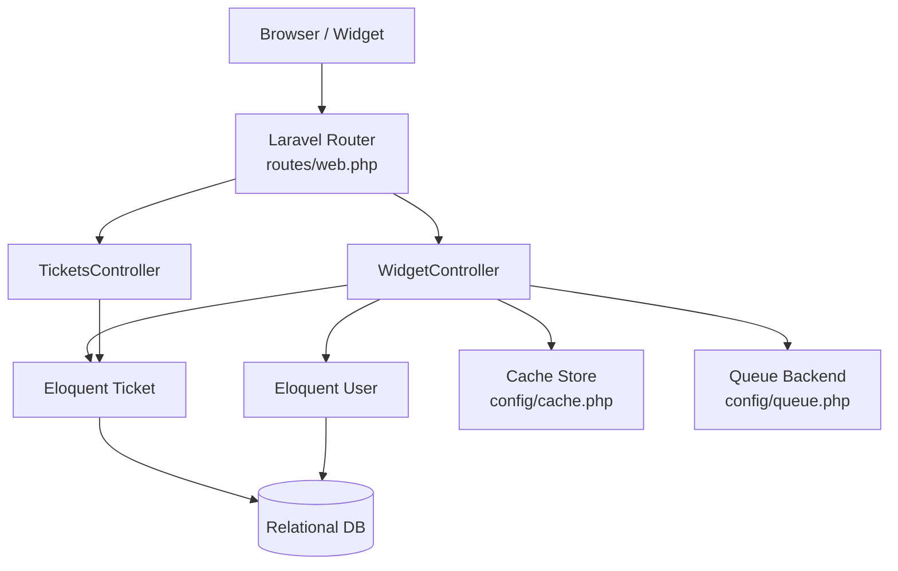
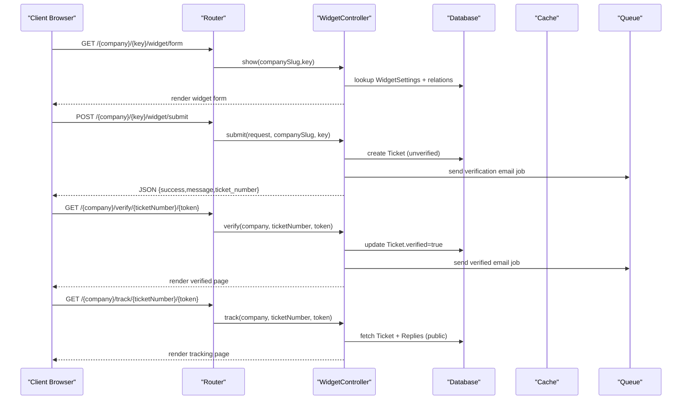
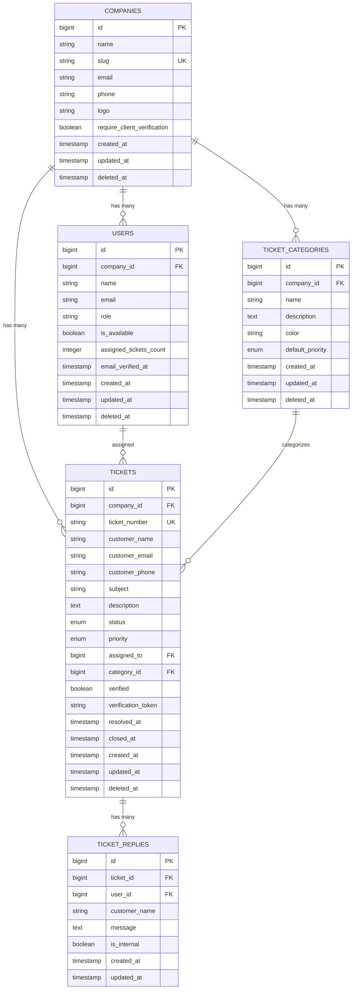
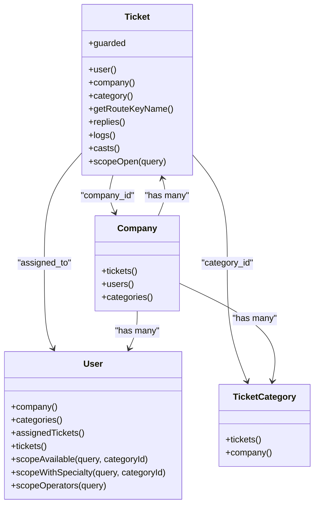
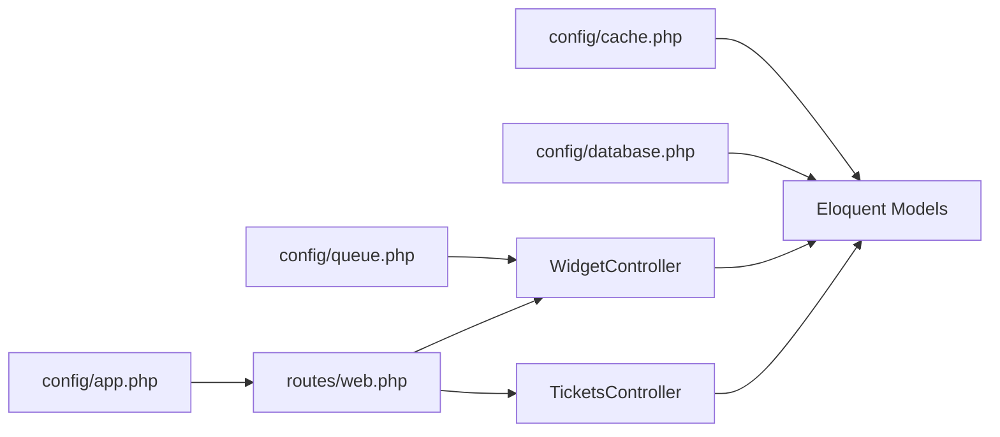

# Scaling & Performance

<cite>
**Referenced Files in This Document**
- [config/app.php](file://config/app.php)
- [config/cache.php](file://config/cache.php)
- [config/database.php](file://config/database.php)
- [config/queue.php](file://config/queue.php)
- [composer.json](file://composer.json)
- [routes/web.php](file://routes/web.php)
- [app/Http/Controllers/WidgetController.php](file://app/Http/Controllers/WidgetController.php)
- [app/Http/Controllers/TicketsController.php](file://app/Http/Controllers/TicketsController.php)
- [app/Models/Ticket.php](file://app/Models/Ticket.php)
- [app/Models/User.php](file://app/Models/User.php)
- [database/migrations/2026_02_01_224222_create_tickets_table.php](file://database/migrations/2026_02_01_224222_create_tickets_table.php)
- [database/migrations/2026_02_01_224225_create_ticket_replies_table.php](file://database/migrations/2026_02_01_224225_create_ticket_replies_table.php)
- [database/migrations/2026_02_01_224218_create_ticket_categories_table.php](file://database/migrations/2026_02_01_224218_create_ticket_categories_table.php)
- [database/migrations/2026_02_01_224200_create_companies_table.php](file://database/migrations/2026_02_01_224200_create_companies_table.php)
- [database/migrations/2026_03_08_041644_create_conversations_table.php](file://database/migrations/2026_03_08_041644_create_conversations_table.php)
</cite>

## Table of Contents
1. [Introduction](#introduction)
2. [Project Structure](#project-structure)
3. [Core Components](#core-components)
4. [Architecture Overview](#architecture-overview)
5. [Detailed Component Analysis](#detailed-component-analysis)
6. [Dependency Analysis](#dependency-analysis)
7. [Performance Considerations](#performance-considerations)
8. [Troubleshooting Guide](#troubleshooting-guide)
9. [Conclusion](#conclusion)

## Introduction
This document provides a comprehensive scaling and performance optimization guide for the Helpdesk System. It covers horizontal and vertical scaling strategies, database optimization (indexes, queries, read replicas), caching strategies (Redis, Memcached, application-level caching), CDN integration for static assets, performance monitoring, bottleneck identification, capacity planning, auto-scaling and load balancing, and microservices considerations for future growth.

## Project Structure
The Helpdesk System is a Laravel application with Livewire-powered UI components. Key runtime concerns for scaling include:
- Web routing and subdomain-based company isolation
- Controllers orchestrating ticket submission, verification, tracking, and replies
- Eloquent models with relationships and scopes
- Configuration for cache, database, and queues
- Composer scripts enabling local development with concurrent server, queue, and asset compilation

**Diagram sources**
- [routes/web.php:1-117](file://routes/web.php#L1-L117)
- [app/Http/Controllers/WidgetController.php:1-197](file://app/Http/Controllers/WidgetController.php#L1-L197)
- [app/Http/Controllers/TicketsController.php:1-19](file://app/Http/Controllers/TicketsController.php#L1-L19)
- [app/Models/Ticket.php:1-64](file://app/Models/Ticket.php#L1-L64)
- [app/Models/User.php:1-137](file://app/Models/User.php#L1-L137)
- [config/app.php:1-129](file://config/app.php#L1-L129)
- [config/cache.php:1-118](file://config/cache.php#L1-L118)
- [config/database.php:1-184](file://config/database.php#L1-L184)
- [config/queue.php:1-130](file://config/queue.php#L1-L130)
- [composer.json:1-108](file://composer.json#L1-L108)

**Section sources**
- [routes/web.php:1-117](file://routes/web.php#L1-L117)
- [composer.json:1-108](file://composer.json#L1-L108)

## Core Components
- Routing and Subdomain Isolation: Routes are grouped under a dynamic subdomain to isolate companies, reducing cross-company contention and simplifying per-company configuration.
- Controllers:
  - WidgetController handles external widget flows: form retrieval, ticket submission, verification, tracking, and customer replies.
  - TicketsController renders ticket details pages.
- Domain Models:
  - Ticket encapsulates lifecycle fields, status, priority, assignment, and relationships to Company, Category, and Replies.
  - User maintains availability and roles, with cache invalidation hooks on updates/deletes.
- Infrastructure Configurations:
  - Cache: supports database, file, memcached, redis, dynamodb, octane, failover, and null stores.
  - Database: supports sqlite, mysql, mariadb, pgsql, sqlsrv; includes Redis options and per-DB connection pools.
  - Queue: supports sync, database, beanstalkd, sqs, redis, failover, deferred, background.

**Section sources**
- [routes/web.php:70-114](file://routes/web.php#L70-L114)
- [app/Http/Controllers/WidgetController.php:19-197](file://app/Http/Controllers/WidgetController.php#L19-L197)
- [app/Http/Controllers/TicketsController.php:7-18](file://app/Http/Controllers/TicketsController.php#L7-L18)
- [app/Models/Ticket.php:9-64](file://app/Models/Ticket.php#L9-L64)
- [app/Models/User.php:13-137](file://app/Models/User.php#L13-L137)
- [config/cache.php:18-117](file://config/cache.php#L18-L117)
- [config/database.php:19-184](file://config/database.php#L19-L184)
- [config/queue.php:16-129](file://config/queue.php#L16-L129)

## Architecture Overview
The system follows a web-controller-model pattern with optional background processing via queues and caching for hot paths. External traffic enters via subdomain-scoped routes handled by controllers that interact with Eloquent models and persistence layers configured in config files.

**Diagram sources**
- [routes/web.php:1-117](file://routes/web.php#L1-L117)
- [app/Http/Controllers/WidgetController.php:1-197](file://app/Http/Controllers/WidgetController.php#L1-L197)
- [app/Http/Controllers/TicketsController.php:1-19](file://app/Http/Controllers/TicketsController.php#L1-L19)
- [app/Models/Ticket.php:1-64](file://app/Models/Ticket.php#L1-L64)
- [app/Models/User.php:1-137](file://app/Models/User.php#L1-L137)
- [config/cache.php:1-118](file://config/cache.php#L1-L118)
- [config/queue.php:1-130](file://config/queue.php#L1-L130)
- [config/database.php:1-184](file://config/database.php#L1-L184)

## Detailed Component Analysis

### Widget Submission and Tracking Workflow
This sequence illustrates the external widget submission, verification, and tracking flows, highlighting potential bottlenecks and optimization opportunities.

**Diagram sources**
- [routes/web.php:24-36](file://routes/web.php#L24-L36)
- [routes/web.php:41-109](file://routes/web.php#L41-L109)
- [routes/web.php:114-158](file://routes/web.php#L114-L158)
- [app/Http/Controllers/WidgetController.php:24-158](file://app/Http/Controllers/WidgetController.php#L24-L158)
- [config/queue.php:38-74](file://config/queue.php#L38-L74)
- [config/cache.php:35-102](file://config/cache.php#L35-L102)

**Section sources**
- [routes/web.php:24-158](file://routes/web.php#L24-L158)
- [app/Http/Controllers/WidgetController.php:24-158](file://app/Http/Controllers/WidgetController.php#L24-L158)
- [config/queue.php:38-74](file://config/queue.php#L38-L74)
- [config/cache.php:35-102](file://config/cache.php#L35-L102)

### Database Schema and Indexing Strategy
The schema defines core entities and indexes that influence query performance. Recommendations:
- Primary keys and foreign keys are indexed implicitly; explicit indexes are declared for frequent filters and joins.
- Composite indexes can further optimize filtered queries (e.g., Companies by require_client_verification and created_at).
- Consider adding selective indexes for high-cardinality enums and timestamps used in reporting.

**Diagram sources**
- [database/migrations/2026_02_01_224200_create_companies_table.php:14-30](file://database/migrations/2026_02_01_224200_create_companies_table.php#L14-L30)
- [database/migrations/2026_02_01_224218_create_ticket_categories_table.php:11-25](file://database/migrations/2026_02_01_224218_create_ticket_categories_table.php#L11-L25)
- [database/migrations/2026_02_01_224222_create_tickets_table.php:11-54](file://database/migrations/2026_02_01_224222_create_tickets_table.php#L11-L54)
- [database/migrations/2026_02_01_224225_create_ticket_replies_table.php:11-27](file://database/migrations/2026_02_01_224225_create_ticket_replies_table.php#L11-L27)

**Section sources**
- [database/migrations/2026_02_01_224200_create_companies_table.php:14-30](file://database/migrations/2026_02_01_224200_create_companies_table.php#L14-L30)
- [database/migrations/2026_02_01_224218_create_ticket_categories_table.php:11-25](file://database/migrations/2026_02_01_224218_create_ticket_categories_table.php#L11-L25)
- [database/migrations/2026_02_01_224222_create_tickets_table.php:11-54](file://database/migrations/2026_02_01_224222_create_tickets_table.php#L11-L54)
- [database/migrations/2026_02_01_224225_create_ticket_replies_table.php:11-27](file://database/migrations/2026_02_01_224225_create_ticket_replies_table.php#L11-L27)

### Ticket Model Relationships and Scopes
The Ticket model defines relationships and a scope for open tickets, which are commonly used in dashboards and reporting. This is a good candidate for caching frequently accessed aggregates.

**Diagram sources**
- [app/Models/Ticket.php:9-64](file://app/Models/Ticket.php#L9-L64)
- [app/Models/User.php:13-137](file://app/Models/User.php#L13-L137)

**Section sources**
- [app/Models/Ticket.php:9-64](file://app/Models/Ticket.php#L9-L64)
- [app/Models/User.php:13-137](file://app/Models/User.php#L13-L137)

## Dependency Analysis
- Routing depends on subdomain configuration and middleware to enforce company access and verification.
- Controllers depend on Eloquent models and configuration-driven infrastructure (cache, queue, database).
- Composer scripts orchestrate local development with concurrent server, queue listener, asset bundling, and real-time server.

**Diagram sources**
- [config/app.php:1-129](file://config/app.php#L1-L129)
- [config/cache.php:1-118](file://config/cache.php#L1-L118)
- [config/database.php:1-184](file://config/database.php#L1-L184)
- [config/queue.php:1-130](file://config/queue.php#L1-L130)
- [routes/web.php:1-117](file://routes/web.php#L1-L117)
- [app/Http/Controllers/WidgetController.php:1-197](file://app/Http/Controllers/WidgetController.php#L1-L197)
- [app/Http/Controllers/TicketsController.php:1-19](file://app/Http/Controllers/TicketsController.php#L1-L19)
- [app/Models/Ticket.php:1-64](file://app/Models/Ticket.php#L1-L64)
- [app/Models/User.php:1-137](file://app/Models/User.php#L1-L137)

**Section sources**
- [config/app.php:1-129](file://config/app.php#L1-L129)
- [config/cache.php:1-118](file://config/cache.php#L1-L118)
- [config/database.php:1-184](file://config/database.php#L1-L184)
- [config/queue.php:1-130](file://config/queue.php#L1-L130)
- [routes/web.php:1-117](file://routes/web.php#L1-L117)
- [composer.json:48-89](file://composer.json#L48-L89)

## Performance Considerations

### Horizontal Scaling Strategies
- Load Balancing: Place a reverse proxy/load balancer in front of multiple application instances. Use sticky sessions only if stateful sessions are required; otherwise prefer stateless sessions with shared cache/DB.
- Stateless Application: Ensure sessions are stored in Redis or database-backed cache to enable seamless scaling.
- Background Jobs: Offload email sending and heavy tasks to queue workers scaled independently from web instances.
- Static Assets: Serve CSS/JS/images via CDN to reduce origin load and improve global latency.

### Vertical Scaling Strategies
- CPU/RAM: Increase instance size for compute-heavy operations (AI summarization, PDF generation, image processing).
- Database: Tune MySQL/MariaDB/PostgreSQL for higher concurrency and buffer sizes; consider read replicas for reporting workloads.
- Cache: Scale Redis/Memcached vertically or horizontally with clustering to handle increased cache pressure.

### Database Optimization
- Indexing:
  - Tickets: existing indexes on company_id, ticket_number, customer_email, status, priority, assigned_to, verified, created_at are appropriate for common filters and joins.
  - Companies: composite index on (require_client_verification, created_at) supports filtered queries.
  - Consider adding selective indexes for enums and frequently filtered columns.
- Query Optimization:
  - Use eager loading (with) for related data to prevent N+1 queries in controllers.
  - Prefer pagination for lists (tickets, replies).
  - Use scopes (e.g., Ticket::scopeOpen) to encapsulate common filters.
- Read Replicas:
  - Route read-heavy queries (dashboards, analytics) to replicas.
  - Separate write and read connections in configuration.

**Section sources**
- [database/migrations/2026_02_01_224222_create_tickets_table.php:45-54](file://database/migrations/2026_02_01_224222_create_tickets_table.php#L45-L54)
- [database/migrations/2026_02_01_224200_create_companies_table.php:25-30](file://database/migrations/2026_02_01_224200_create_companies_table.php#L25-L30)
- [app/Http/Controllers/WidgetController.php:32-33](file://app/Http/Controllers/WidgetController.php#L32-L33)
- [app/Models/Ticket.php:59-62](file://app/Models/Ticket.php#L59-L62)

### Caching Strategies
- Redis:
  - Use Redis for session storage, cache store, and pub/sub for real-time features.
  - Configure separate databases for cache and queues to avoid contention.
- Memcached:
  - Suitable for high-throughput, low-latency caching; ensure consistent hashing and failover.
- Application-Level Caching:
  - Cache company-wide aggregates (agents, categories) invalidated on User updates/deletes.
  - Cache frequently accessed widgets and categories to reduce DB load.
- Cache Keys:
  - Use prefixed keys to avoid collisions across applications.

**Section sources**
- [config/cache.php:18-117](file://config/cache.php#L18-L117)
- [config/database.php:145-181](file://config/database.php#L145-L181)
- [app/Models/User.php:123-135](file://app/Models/User.php#L123-L135)

### CDN Integration and Static Assets
- Static Assets: Host CSS/JS on CDN; set long-lived cache headers; use versioned filenames or content hashes.
- Images: Optimize images (resize, compress, modern formats) and serve via CDN with automatic format selection.
- Content Delivery Networks: Choose CDNs with edge locations near your primary user base; enable compression and HTTPS termination.

### Performance Monitoring and Bottleneck Identification
- Metrics: Track requests per second, latency percentiles, error rates, queue backlog, cache hit ratios, and database query time.
- Tracing: Use distributed tracing for end-to-end visibility across web, queue, and cache layers.
- Capacity Planning: Monitor trends and plan for predictable growth and seasonal spikes.

### Auto-Scaling and Load Balancing
- Auto-Scaling Groups: Scale web nodes based on CPU, request count, or ALB target group health.
- Load Balancers: Use health checks and stickiness only when necessary; route traffic to multiple AZs.
- Microservices: As the system grows, extract domain boundaries (e.g., Notifications, Reporting) into dedicated services with APIs.

### Microservices Considerations
- Domain Boundaries: Identify bounded contexts (ticket lifecycle, user management, communications, reporting).
- API Contracts: Define stable APIs between services; version APIs explicitly.
- Data Partitioning: Keep per-company data partitioned; use company identifiers in service APIs.
- Observability: Centralized logging and metrics for cross-service tracing.

## Troubleshooting Guide
- Slow Dashboard Queries:
  - Verify indexes exist for filters used in dashboards.
  - Use pagination and limit result sets.
- High Cache Misses:
  - Review cache key prefixes and TTLs.
  - Ensure cache invalidation is triggered on model updates.
- Queue Backlog:
  - Scale queue workers; review retry policies and dead-letter handling.
- Subdomain Access Issues:
  - Confirm subdomain DNS and route model binding.
- Email Delivery Delays:
  - Offload to queue workers; monitor provider rate limits.

**Section sources**
- [app/Models/User.php:123-135](file://app/Models/User.php#L123-L135)
- [config/queue.php:67-74](file://config/queue.php#L67-L74)
- [routes/web.php:70-114](file://routes/web.php#L70-L114)

## Conclusion
By combining horizontal and vertical scaling, targeted database indexing, robust caching strategies, CDN optimization, and comprehensive monitoring, the Helpdesk System can achieve high throughput and low latency at scale. Plan for microservices as the product evolves, and continuously refine capacity planning based on observed usage patterns.