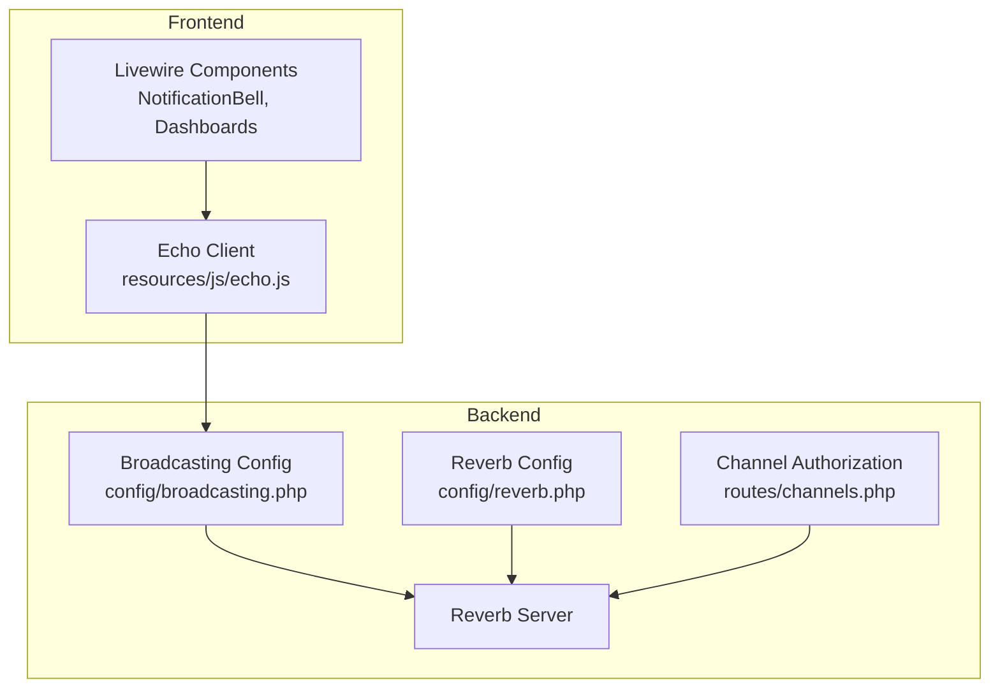
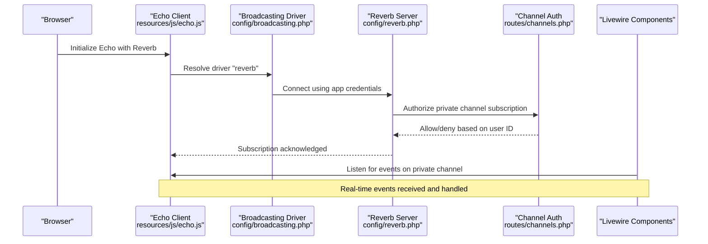
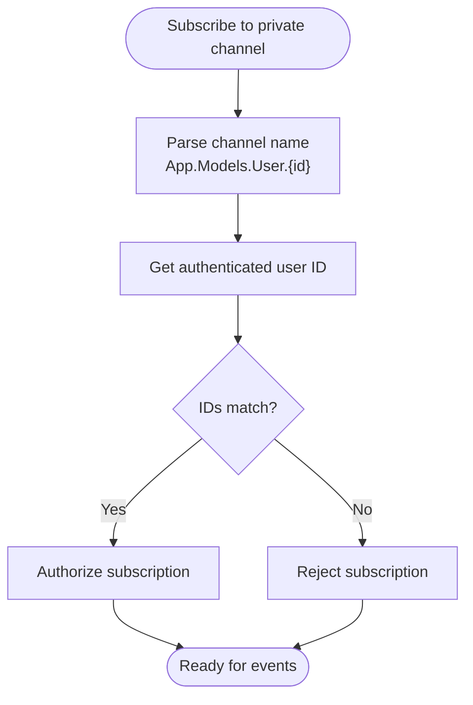
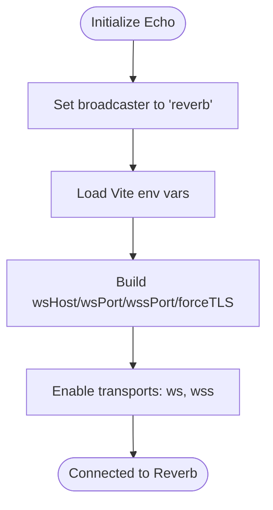
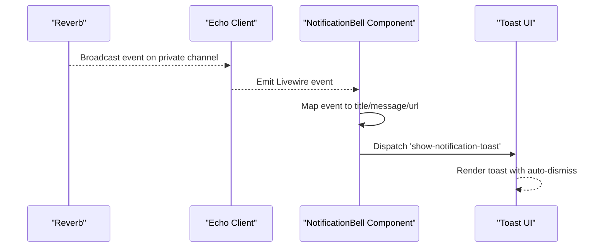
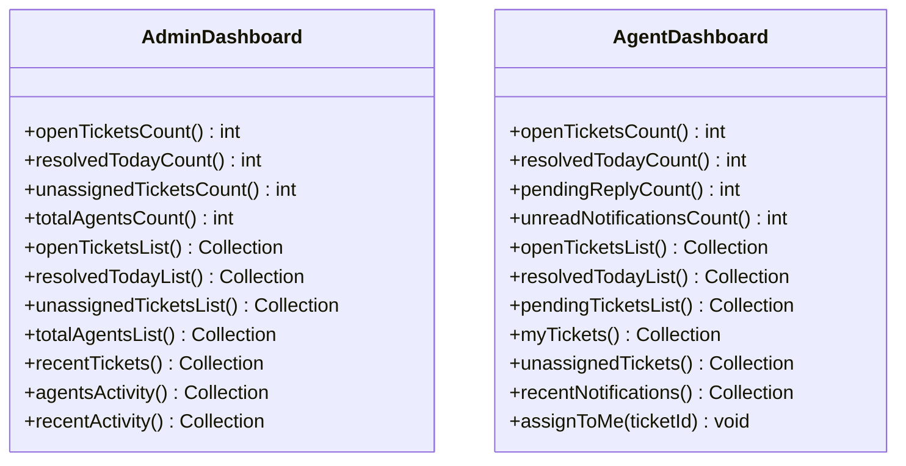
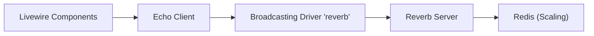

# WebSocket Configuration

<cite>
**Referenced Files in This Document**
- [config/reverb.php](file://config/reverb.php)
- [config/broadcasting.php](file://config/broadcasting.php)
- [routes/channels.php](file://routes/channels.php)
- [resources/js/echo.js](file://resources/js/echo.js)
- [.env.example](file://.env.example)
- [vite.config.js](file://vite.config.js)
- [composer.lock](file://composer.lock)
- [app/Livewire/NotificationBell.php](file://app/Livewire/NotificationBell.php)
- [resources/views/livewire/notification-bell.blade.php](file://resources/views/livewire/notification-bell.blade.php)
- [storage/framework/views/43a88f57469f00ff1e841a2055d15a88.php](file://storage/framework/views/43a88f57469f00ff1e841a2055d15a88.php)
- [app/Livewire/Dashboard/AdminDashboard.php](file://app/Livewire/Dashboard/AdminDashboard.php)
- [app/Livewire/Dashboard/AgentDashboard.php](file://app/Livewire/Dashboard/AgentDashboard.php)
</cite>

## Table of Contents
1. [Introduction](#introduction)
2. [Project Structure](#project-structure)
3. [Core Components](#core-components)
4. [Architecture Overview](#architecture-overview)
5. [Detailed Component Analysis](#detailed-component-analysis)
6. [Dependency Analysis](#dependency-analysis)
7. [Performance Considerations](#performance-considerations)
8. [Troubleshooting Guide](#troubleshooting-guide)
9. [Conclusion](#conclusion)
10. [Appendices](#appendices)

## Introduction
This document provides comprehensive guidance for configuring and operating WebSocket real-time communication in this Laravel application using Laravel Reverb. It covers server configuration, clustering and scaling via Redis, channel authorization, connection management, authentication, event-driven live updates for notifications and dashboards, monitoring and performance tuning, scaling considerations, common issues, debugging techniques, and fallback mechanisms for clients without native WebSocket support.

## Project Structure
The WebSocket stack integrates backend configuration, frontend initialization, and Livewire-driven UI updates:
- Backend configuration defines the Reverb server, application credentials, and scaling options.
- Frontend initializes Laravel Echo with the Reverb broadcaster and Pusher-compatible transport.
- Channel authorization secures per-user channels.
- Livewire components listen for real-time events and update the UI reactively.

**Diagram sources**
- [resources/js/echo.js:1-15](file://resources/js/echo.js#L1-L15)
- [config/broadcasting.php:33-47](file://config/broadcasting.php#L33-L47)
- [config/reverb.php:31-55](file://config/reverb.php#L31-L55)
- [routes/channels.php:5-7](file://routes/channels.php#L5-L7)

**Section sources**
- [config/reverb.php:1-97](file://config/reverb.php#L1-L97)
- [config/broadcasting.php:1-83](file://config/broadcasting.php#L1-L83)
- [routes/channels.php:1-8](file://routes/channels.php#L1-L8)
- [resources/js/echo.js:1-15](file://resources/js/echo.js#L1-L15)
- [.env.example:90-100](file://.env.example#L90-L100)

## Core Components
- Reverb server configuration: host, port, TLS options, scaling via Redis, and ingestion intervals.
- Broadcasting connection: driver “reverb” with application credentials and client options.
- Channel authorization: per-user private channels restricted to authenticated users.
- Frontend Echo client: Reverb broadcaster with Pusher-compatible transport settings.
- Livewire event listeners: real-time updates for notifications and dashboard widgets.

**Section sources**
- [config/reverb.php:31-55](file://config/reverb.php#L31-L55)
- [config/reverb.php:70-94](file://config/reverb.php#L70-L94)
- [config/broadcasting.php:33-47](file://config/broadcasting.php#L33-L47)
- [routes/channels.php:5-7](file://routes/channels.php#L5-L7)
- [resources/js/echo.js:6-14](file://resources/js/echo.js#L6-L14)
- [app/Livewire/NotificationBell.php:19-53](file://app/Livewire/NotificationBell.php#L19-L53)

## Architecture Overview
The system uses Laravel Reverb as the WebSocket server and broadcaster. Clients connect via the Echo Reverb broadcaster, subscribe to private channels, and receive real-time events. Livewire components react to these events to update UI elements such as notification toasts and dashboard metrics.

**Diagram sources**
- [resources/js/echo.js:6-14](file://resources/js/echo.js#L6-L14)
- [config/broadcasting.php:33-47](file://config/broadcasting.php#L33-L47)
- [config/reverb.php:31-55](file://config/reverb.php#L31-L55)
- [routes/channels.php:5-7](file://routes/channels.php#L5-L7)
- [app/Livewire/NotificationBell.php:19-53](file://app/Livewire/NotificationBell.php#L19-L53)

## Detailed Component Analysis

### Reverb Server Configuration
Key settings include:
- Host, port, optional path, hostname, and TLS options.
- Scaling configuration using Redis for inter-process coordination.
- Ingestion intervals for telemetry integrations.

Operational guidance:
- Bind the server to a non-loopback address in production and configure TLS appropriately.
- Enable scaling when running multiple Reverb instances behind a load balancer.
- Tune max request size and message limits according to payload sizes.

**Section sources**
- [config/reverb.php:31-55](file://config/reverb.php#L31-L55)
- [config/reverb.php:40-52](file://config/reverb.php#L40-L52)

### Reverb Application Configuration
Defines:
- Application credentials (key, secret, app_id).
- Connection options (host, port, scheme, TLS).
- Allowed origins, ping interval, activity timeout, max connections, and max message size.
- Client events policy.

Operational guidance:
- Keep application credentials secret and rotate regularly.
- Configure allowed origins to restrict cross-origin access.
- Adjust timeouts and limits to balance responsiveness and resource usage.

**Section sources**
- [config/reverb.php:74-94](file://config/reverb.php#L74-L94)
- [config/broadcasting.php:33-47](file://config/broadcasting.php#L33-L47)

### Channel Authorization
Private channel authorization ensures only the intended user can subscribe to their notifications channel. The authorization closure compares the authenticated user’s ID with the channel parameter.

**Diagram sources**
- [routes/channels.php:5-7](file://routes/channels.php#L5-L7)

**Section sources**
- [routes/channels.php:5-7](file://routes/channels.php#L5-L7)

### Frontend Echo Initialization
The Echo client is configured to use the Reverb broadcaster with Pusher-compatible transports. Environment variables drive host, port, scheme, and TLS enforcement.

**Diagram sources**
- [resources/js/echo.js:6-14](file://resources/js/echo.js#L6-L14)
- [.env.example:90-100](file://.env.example#L90-L100)

**Section sources**
- [resources/js/echo.js:1-15](file://resources/js/echo.js#L1-L15)
- [.env.example:90-100](file://.env.example#L90-L100)

### Event Handling for Live Notifications
Livewire components listen for real-time events and update the UI:
- The notification bell component listens for a named event and a private channel broadcast event.
- It constructs toast notifications with titles, messages, and optional links to ticket details.
- Additional Livewire events propagate updates across the UI.

**Diagram sources**
- [app/Livewire/NotificationBell.php:19-53](file://app/Livewire/NotificationBell.php#L19-L53)
- [resources/views/livewire/notification-bell.blade.php:150-160](file://resources/views/livewire/notification-bell.blade.php#L150-L160)
- [storage/framework/views/43a88f57469f00ff1e841a2055d15a88.php:211-221](file://storage/framework/views/43a88f57469f00ff1e841a2055d15a88.php#L211-L221)

**Section sources**
- [app/Livewire/NotificationBell.php:19-53](file://app/Livewire/NotificationBell.php#L19-L53)
- [resources/views/livewire/notification-bell.blade.php:150-160](file://resources/views/livewire/notification-bell.blade.php#L150-L160)
- [storage/framework/views/43a88f57469f00ff1e841a2055d15a88.php:183-221](file://storage/framework/views/43a88f57469f00ff1e841a2055d15a88.php#L183-L221)

### Dashboard Updates and Activity Streams
Dashboards compute metrics and lists via Livewire computed properties. While these are primarily server-rendered, the real-time layer complements them by keeping the UI responsive to live events (e.g., notifications, assignments).

**Diagram sources**
- [app/Livewire/Dashboard/AdminDashboard.php:14-127](file://app/Livewire/Dashboard/AdminDashboard.php#L14-L127)
- [app/Livewire/Dashboard/AgentDashboard.php:16-141](file://app/Livewire/Dashboard/AgentDashboard.php#L16-L141)

**Section sources**
- [app/Livewire/Dashboard/AdminDashboard.php:14-127](file://app/Livewire/Dashboard/AdminDashboard.php#L14-L127)
- [app/Livewire/Dashboard/AgentDashboard.php:16-141](file://app/Livewire/Dashboard/AgentDashboard.php#L16-L141)

### Connection Management and Authentication
- Connection lifecycle: Echo connects to Reverb using the configured app credentials and transport settings.
- Authentication: Channel authorization enforces per-user subscriptions.
- Security: Restrict allowed origins and enable TLS in production.

**Section sources**
- [config/broadcasting.php:33-47](file://config/broadcasting.php#L33-L47)
- [routes/channels.php:5-7](file://routes/channels.php#L5-L7)
- [resources/js/echo.js:6-14](file://resources/js/echo.js#L6-L14)

## Dependency Analysis
The WebSocket stack depends on:
- Laravel Reverb server and broadcaster.
- Laravel Echo with Pusher-compatible transport.
- Redis for Reverb scaling.
- Livewire for reactive UI updates.

**Diagram sources**
- [resources/js/echo.js:6-14](file://resources/js/echo.js#L6-L14)
- [config/broadcasting.php:33-47](file://config/broadcasting.php#L33-L47)
- [config/reverb.php:40-52](file://config/reverb.php#L40-L52)
- [composer.lock:1992-1996](file://composer.lock#L1992-L1996)

**Section sources**
- [composer.lock:1992-1996](file://composer.lock#L1992-L1996)
- [config/reverb.php:40-52](file://config/reverb.php#L40-L52)

## Performance Considerations
- Tune Reverb server options: adjust max request size and message limits to accommodate payload sizes.
- Enable scaling with Redis to distribute load across multiple Reverb instances.
- Monitor ingestion intervals for telemetry integrations to avoid overhead.
- Optimize Livewire component rendering and limit frequent re-computation of heavy datasets.
- Use appropriate timeouts and ping intervals to maintain healthy connections under load.

[No sources needed since this section provides general guidance]

## Troubleshooting Guide
Common issues and resolutions:
- Connection failures:
  - Verify environment variables for host, port, and scheme.
  - Ensure TLS settings match deployment (scheme and forceTLS).
- CORS and origin errors:
  - Confirm allowed origins and correct hostnames.
- Channel authorization failures:
  - Validate that the authenticated user ID matches the channel pattern.
- Frontend not receiving events:
  - Check Echo initialization and enabled transports.
  - Confirm Livewire event handlers are attached.
- Monitoring and observability:
  - Use Pulse and Telescope ingest intervals configured in Reverb settings.
- Fallback mechanisms:
  - The current setup uses the Echo Reverb broadcaster with Pusher-compatible transports. If WebSocket transport fails, Echo/Pusher fallbacks may apply depending on client capabilities and network conditions.

**Section sources**
- [.env.example:90-100](file://.env.example#L90-L100)
- [resources/js/echo.js:6-14](file://resources/js/echo.js#L6-L14)
- [routes/channels.php:5-7](file://routes/channels.php#L5-L7)
- [config/reverb.php:53-54](file://config/reverb.php#L53-L54)

## Conclusion
This project integrates Laravel Reverb for real-time WebSocket communication, secured by channel authorization and configurable application credentials. The Echo client and Livewire components deliver live notifications and dynamic dashboard updates. Proper configuration of the Reverb server, scaling with Redis, and careful tuning of timeouts and limits are essential for reliable operation. Monitoring and fallback strategies further improve resilience and user experience.

[No sources needed since this section summarizes without analyzing specific files]

## Appendices

### Environment Variables Reference
- Reverb application identifiers and connection settings.
- Vite environment variables consumed by the Echo client.

**Section sources**
- [.env.example:90-100](file://.env.example#L90-L100)

### Vite and Dev Server Notes
- The dev server configuration enables hot reload and CORS, which can affect local WebSocket behavior during development.

**Section sources**
- [vite.config.js:15-21](file://vite.config.js#L15-L21)