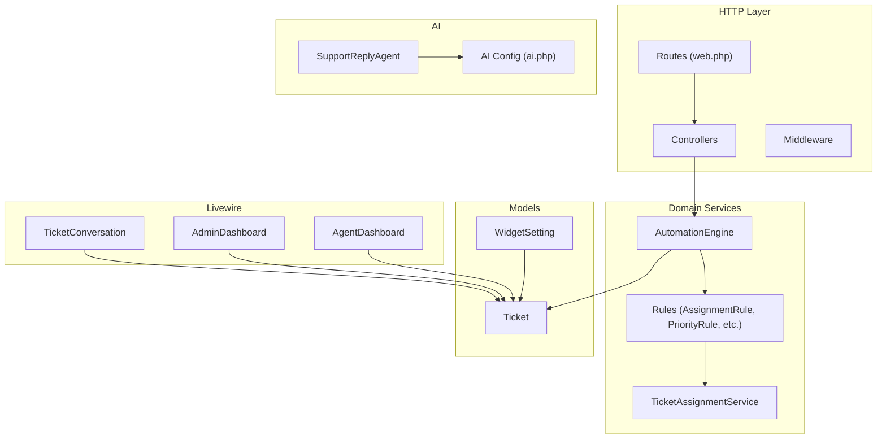
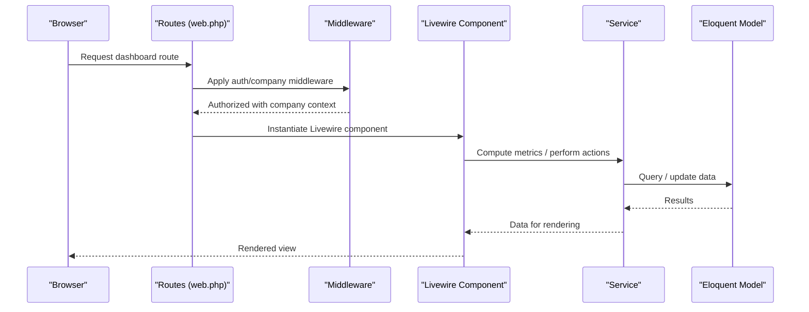
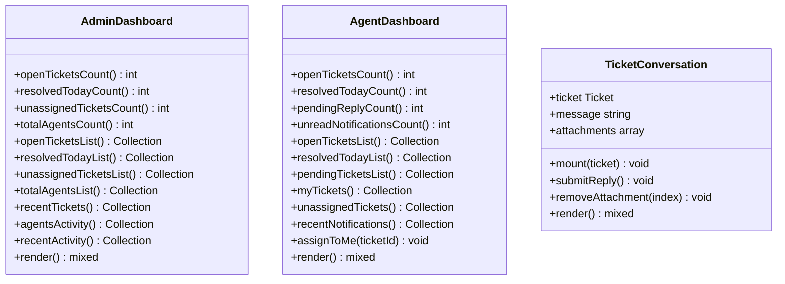
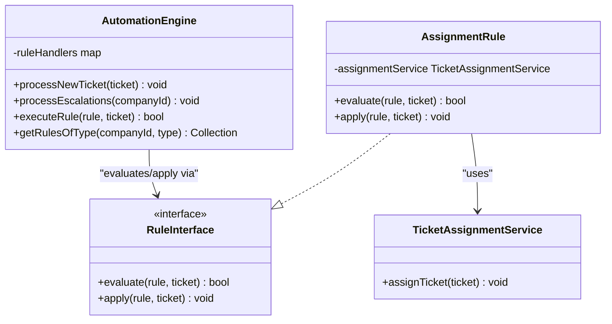
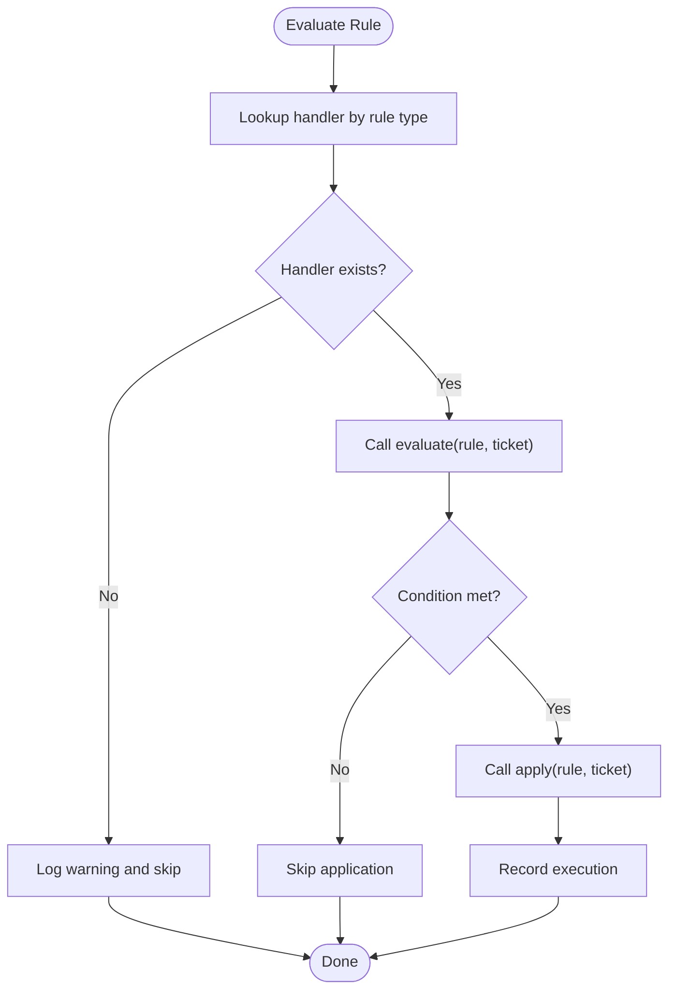
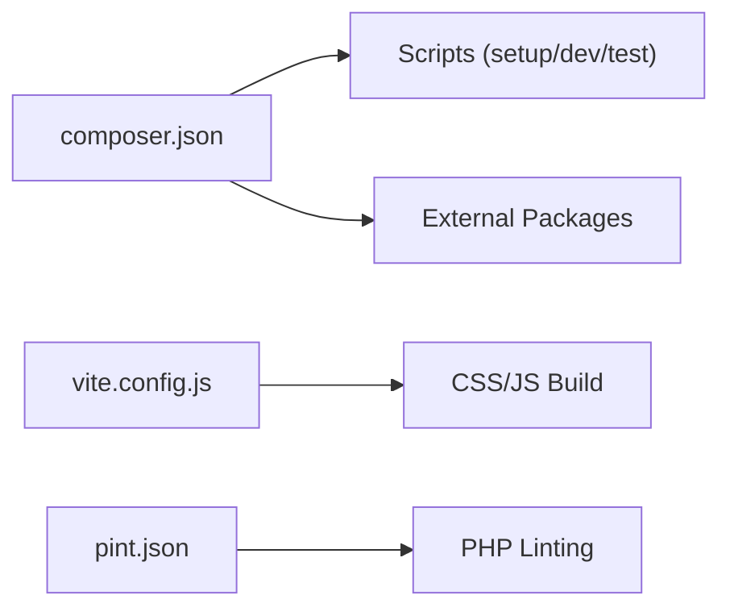

# Developer Guide

<cite>
**Referenced Files in This Document**
- [composer.json](file://composer.json)
- [routes/web.php](file://routes/web.php)
- [config/app.php](file://config/app.php)
- [vite.config.js](file://vite.config.js)
- [pint.json](file://pint.json)
- [app/Services/Automation/AutomationEngine.php](file://app/Services/Automation/AutomationEngine.php)
- [app/Services/Automation/Rules/RuleInterface.php](file://app/Services/Automation/Rules/RuleInterface.php)
- [app/Services/Automation/Rules/AssignmentRule.php](file://app/Services/Automation/Rules/AssignmentRule.php)
- [app/Console/Commands/ProcessTicketEscalations.php](file://app/Console/Commands/ProcessTicketEscalations.php)
- [app/Livewire/Dashboard/AdminDashboard.php](file://app/Livewire/Dashboard/AdminDashboard.php)
- [app/Livewire/Dashboard/AgentDashboard.php](file://app/Livewire/Dashboard/AgentDashboard.php)
- [app/Livewire/Widget/TicketConversation.php](file://app/Livewire/Widget/TicketConversation.php)
- [app/Models/Ticket.php](file://app/Models/Ticket.php)
- [app/Models/WidgetSetting.php](file://app/Models/WidgetSetting.php)
- [app/Ai/Agents/SupportReplyAgent.php](file://app/Ai/Agents/SupportReplyAgent.php)
- [config/ai.php](file://config/ai.php)
- [tests/Feature/DashboardTest.php](file://tests/Feature/DashboardTest.php)
- [tests/TestCase.php](file://tests/TestCase.php)
</cite>

## Table of Contents
1. [Introduction](#introduction)
2. [Project Structure](#project-structure)
3. [Core Components](#core-components)
4. [Architecture Overview](#architecture-overview)
5. [Detailed Component Analysis](#detailed-component-analysis)
6. [Dependency Analysis](#dependency-analysis)
7. [Performance Considerations](#performance-considerations)
8. [Troubleshooting Guide](#troubleshooting-guide)
9. [Conclusion](#conclusion)
10. [Appendices](#appendices)

## Introduction
This guide explains how to contribute to and extend the Helpdesk System. It covers code organization, naming conventions, architectural patterns, Livewire component development, the service layer, testing culture, debugging and profiling, development workflow optimization, and extension points for automation rules, AI agents, and widget integrations. The goal is to help you understand how things work and how to add new features safely and consistently.

## Project Structure
The application follows a layered architecture with clear separation of concerns:
- HTTP layer: Controllers and middleware orchestrate requests and enforce access policies.
- Domain services: Services encapsulate business logic (e.g., automation engine, assignment service).
- Models: Eloquent models represent domain entities and relationships.
- Livewire components: Interactive UI components with computed properties and actions.
- AI agents: Pluggable agents for conversational assistance.
- Widgets: Reusable front-end integrations for external sites.
- Configuration: Application and AI provider configuration.

**Diagram sources**
- [routes/web.php:1-117](file://routes/web.php#L1-L117)
- [app/Services/Automation/AutomationEngine.php:1-142](file://app/Services/Automation/AutomationEngine.php#L1-L142)
- [app/Services/Automation/Rules/AssignmentRule.php:1-67](file://app/Services/Automation/Rules/AssignmentRule.php#L1-L67)
- [app/Livewire/Dashboard/AdminDashboard.php:1-128](file://app/Livewire/Dashboard/AdminDashboard.php#L1-L128)
- [app/Livewire/Dashboard/AgentDashboard.php:1-142](file://app/Livewire/Dashboard/AgentDashboard.php#L1-L142)
- [app/Livewire/Widget/TicketConversation.php:1-100](file://app/Livewire/Widget/TicketConversation.php#L1-L100)
- [app/Models/Ticket.php:1-64](file://app/Models/Ticket.php#L1-L64)
- [app/Models/WidgetSetting.php:1-71](file://app/Models/WidgetSetting.php#L1-L71)
- [app/Ai/Agents/SupportReplyAgent.php:1-50](file://app/Ai/Agents/SupportReplyAgent.php#L1-L50)
- [config/ai.php:1-130](file://config/ai.php#L1-L130)

**Section sources**
- [routes/web.php:1-117](file://routes/web.php#L1-L117)
- [config/app.php:1-129](file://config/app.php#L1-L129)

## Core Components
- AutomationEngine orchestrates rule evaluation and application for tickets, supports scheduled escalations, and records executions.
- RuleInterface defines the contract for rule handlers; AssignmentRule demonstrates evaluating conditions and applying actions.
- Livewire dashboards compute metrics and lists via #[Computed] properties and expose actions (e.g., self-assignment).
- Widget conversation component handles customer replies, attachments, and notifications.
- AI agent integrates with configurable providers for conversational assistance.
- Configuration files define app behavior and AI provider defaults.

**Section sources**
- [app/Services/Automation/AutomationEngine.php:1-142](file://app/Services/Automation/AutomationEngine.php#L1-L142)
- [app/Services/Automation/Rules/RuleInterface.php:1-20](file://app/Services/Automation/Rules/RuleInterface.php#L1-L20)
- [app/Services/Automation/Rules/AssignmentRule.php:1-67](file://app/Services/Automation/Rules/AssignmentRule.php#L1-L67)
- [app/Livewire/Dashboard/AdminDashboard.php:1-128](file://app/Livewire/Dashboard/AdminDashboard.php#L1-L128)
- [app/Livewire/Dashboard/AgentDashboard.php:1-142](file://app/Livewire/Dashboard/AgentDashboard.php#L1-L142)
- [app/Livewire/Widget/TicketConversation.php:1-100](file://app/Livewire/Widget/TicketConversation.php#L1-L100)
- [app/Ai/Agents/SupportReplyAgent.php:1-50](file://app/Ai/Agents/SupportReplyAgent.php#L1-L50)
- [config/ai.php:1-130](file://config/ai.php#L1-L130)

## Architecture Overview
The system uses a modular, service-oriented design:
- Routes bind subdomain-based company contexts and Livewire pages.
- Middleware enforces roles and company access.
- Services encapsulate business logic and are injected into Livewire components and commands.
- Models define relationships and scopes; widgets and AI agents integrate externally.

**Diagram sources**
- [routes/web.php:70-114](file://routes/web.php#L70-L114)
- [app/Livewire/Dashboard/AdminDashboard.php:122-126](file://app/Livewire/Dashboard/AdminDashboard.php#L122-L126)
- [app/Livewire/Dashboard/AgentDashboard.php:137-140](file://app/Livewire/Dashboard/AgentDashboard.php#L137-L140)

## Detailed Component Analysis

### Livewire Component Development Workflow
Livewire components are stateful UI units with:
- Properties: Typed public properties and validated attributes.
- Computed properties: #[Computed] memoized getters for derived data.
- Lifecycle: mount(), hydrate(), dehydrate(), render().
- Event handling: dispatch events to the frontend and handle validation.

**Diagram sources**
- [app/Livewire/Dashboard/AdminDashboard.php:14-127](file://app/Livewire/Dashboard/AdminDashboard.php#L14-L127)
- [app/Livewire/Dashboard/AgentDashboard.php:16-141](file://app/Livewire/Dashboard/AgentDashboard.php#L16-L141)
- [app/Livewire/Widget/TicketConversation.php:12-99](file://app/Livewire/Widget/TicketConversation.php#L12-L99)

Key patterns:
- Property binding: Public properties are bound to Blade slots and validated via #[Validate].
- Validation: Validation runs before state changes; errors propagate to the UI.
- Events: Components dispatch frontend events (e.g., toast notifications) and reset editor state.
- Rendering: render() returns a view with preloaded related data.

**Section sources**
- [app/Livewire/Dashboard/AdminDashboard.php:14-127](file://app/Livewire/Dashboard/AdminDashboard.php#L14-L127)
- [app/Livewire/Dashboard/AgentDashboard.php:16-141](file://app/Livewire/Dashboard/AgentDashboard.php#L16-L141)
- [app/Livewire/Widget/TicketConversation.php:12-99](file://app/Livewire/Widget/TicketConversation.php#L12-L99)

### Service Layer Architecture
The service layer encapsulates business logic and is injected into components and commands.

**Diagram sources**
- [app/Services/Automation/AutomationEngine.php:15-141](file://app/Services/Automation/AutomationEngine.php#L15-L141)
- [app/Services/Automation/Rules/RuleInterface.php:8-19](file://app/Services/Automation/Rules/RuleInterface.php#L8-L19)
- [app/Services/Automation/Rules/AssignmentRule.php:9-66](file://app/Services/Automation/Rules/AssignmentRule.php#L9-L66)

Guidelines for creating new services:
- Define a dedicated service class under app/Services/<Area>/.
- Keep methods focused and single-responsibility.
- Inject dependencies via constructor injection.
- Prefer returning explicit values and throwing exceptions for failures.
- Add unit tests under tests/Unit/ and feature tests under tests/Feature/.

**Section sources**
- [app/Services/Automation/AutomationEngine.php:15-141](file://app/Services/Automation/AutomationEngine.php#L15-L141)
- [app/Services/Automation/Rules/RuleInterface.php:8-19](file://app/Services/Automation/Rules/RuleInterface.php#L8-L19)
- [app/Services/Automation/Rules/AssignmentRule.php:9-66](file://app/Services/Automation/Rules/AssignmentRule.php#L9-L66)

### Testing Culture and Practices
The project uses Pest for testing with a clear structure:
- tests/Feature/ for end-to-end and integration tests.
- tests/Unit/ for isolated unit tests.
- tests/TestCase.php as the base class.

Example patterns:
- Feature tests assert redirects for guests and successful loads for authenticated users.
- Use factories to create realistic test data.
- Prefer expressive assertions and targeted scenarios.

**Section sources**
- [tests/Feature/DashboardTest.php:1-17](file://tests/Feature/DashboardTest.php#L1-L17)
- [tests/TestCase.php:1-11](file://tests/TestCase.php#L1-L11)

### Extension Points

#### Adding New Automation Rules
- Implement RuleInterface in a new class under app/Services/Automation/Rules/.
- Register the rule type in AutomationEngine::$ruleHandlers.
- Use conditions/actions stored on AutomationRule to evaluate and apply changes.
- Ensure robust error logging and guard against invalid states.

**Diagram sources**
- [app/Services/Automation/AutomationEngine.php:59-96](file://app/Services/Automation/AutomationEngine.php#L59-L96)
- [app/Services/Automation/Rules/RuleInterface.php:8-19](file://app/Services/Automation/Rules/RuleInterface.php#L8-L19)

**Section sources**
- [app/Services/Automation/AutomationEngine.php:18-25](file://app/Services/Automation/AutomationEngine.php#L18-L25)
- [app/Services/Automation/Rules/RuleInterface.php:8-19](file://app/Services/Automation/Rules/RuleInterface.php#L8-L19)

#### Creating AI Agents
- Implement Agent, Conversational, and/or HasTools contracts.
- Annotate with #[Provider] and model selection attributes.
- Configure providers in config/ai.php and environment variables.
- Use Laravel AI SDK features for messaging and tools.

**Section sources**
- [app/Ai/Agents/SupportReplyAgent.php:18-49](file://app/Ai/Agents/SupportReplyAgent.php#L18-L49)
- [config/ai.php:52-127](file://config/ai.php#L52-L127)

#### Widget Integrations
- Use WidgetSetting to generate unique keys and iframe embed codes.
- Build Livewire widgets under app/Livewire/Widget/.
- Ensure proper validation and sanitization for user inputs.
- Respect company scoping and permissions.

**Section sources**
- [app/Models/WidgetSetting.php:28-70](file://app/Models/WidgetSetting.php#L28-L70)
- [app/Livewire/Widget/TicketConversation.php:12-99](file://app/Livewire/Widget/TicketConversation.php#L12-L99)

## Dependency Analysis
External dependencies and scripts:
- Composer scripts automate setup, dev stack orchestration, linting, and testing.
- Vite handles asset building and hot reload.
- Pint enforces Laravel-style formatting.

**Diagram sources**
- [composer.json:48-89](file://composer.json#L48-L89)
- [vite.config.js:1-22](file://vite.config.js#L1-L22)
- [pint.json:1-4](file://pint.json#L1-L4)

**Section sources**
- [composer.json:48-89](file://composer.json#L48-L89)
- [vite.config.js:1-22](file://vite.config.js#L1-L22)
- [pint.json:1-4](file://pint.json#L1-L4)

## Performance Considerations
- Minimize N+1 queries by eager-loading relations in Livewire computed properties.
- Use database indexes on frequently filtered columns (e.g., status, created_at).
- Cache expensive computations via #[Computed] memoization where appropriate.
- Keep Livewire payload small; avoid loading large datasets unless needed.
- Use pagination for long lists in dashboards and tables.

## Troubleshooting Guide
Common areas to inspect:
- Routing and middleware: Ensure subdomain routing and company access checks are applied.
- Livewire validation: Confirm #[Validate] attributes match property names and constraints.
- Automation rule execution: Review logs for missing handlers and failed applications.
- AI provider configuration: Verify API keys and provider defaults in config/ai.php.

Debugging tips:
- Enable application debug mode locally and review logs.
- Use Laravel Debugbar for SQL queries and timing.
- Add targeted feature tests to reproduce issues quickly.

**Section sources**
- [routes/web.php:70-114](file://routes/web.php#L70-L114)
- [app/Services/Automation/AutomationEngine.php:64-95](file://app/Services/Automation/AutomationEngine.php#L64-L95)
- [config/ai.php:52-127](file://config/ai.php#L52-L127)

## Conclusion
By following the established patterns—service-layer encapsulation, Livewire component conventions, robust testing, and clear configuration—you can confidently extend the Helpdesk System. Use the automation engine for rule-driven behavior, leverage AI agents for intelligent assistance, and build widgets that integrate seamlessly with company domains.

## Appendices

### Naming Conventions
- Classes: PascalCase (e.g., AdminDashboard, AssignmentRule).
- Methods: camelCase (e.g., processNewTicket, evaluate).
- Properties: camelCase (e.g., ticketNumber, attachments).
- Files: PascalCase for classes, kebab-case for Blade views (e.g., ticket-conversation.blade.php).

### Contribution Guidelines
- Branch per feature; keep commits focused.
- Add or update tests for new features.
- Run linting and tests locally before opening a PR.
- Keep pull request descriptions clear and link related issues.

### Development Workflow Optimization
- Use the dev script to run server, queue, Vite, and Reverb concurrently.
- Format code with Pint and keep linting in CI strict.
- Use Pest’s expressive syntax for readable tests.

**Section sources**
- [composer.json:57-60](file://composer.json#L57-L60)
- [pint.json:1-4](file://pint.json#L1-L4)