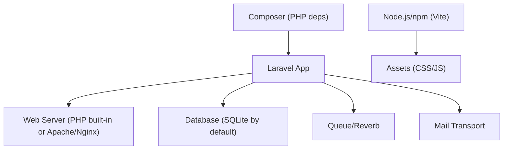
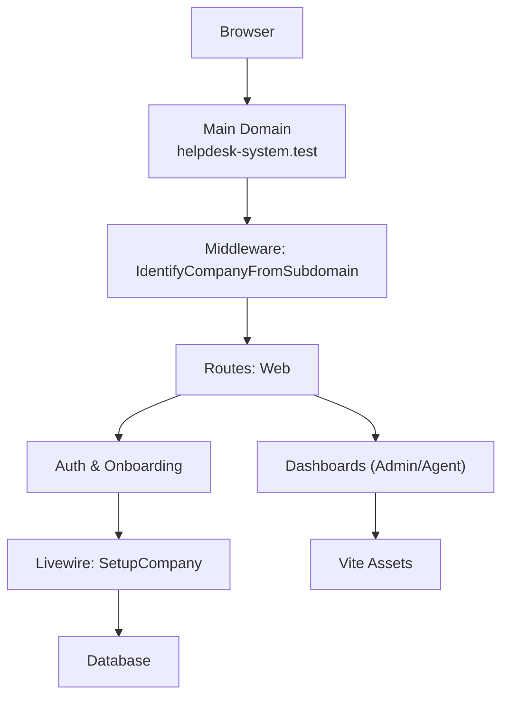
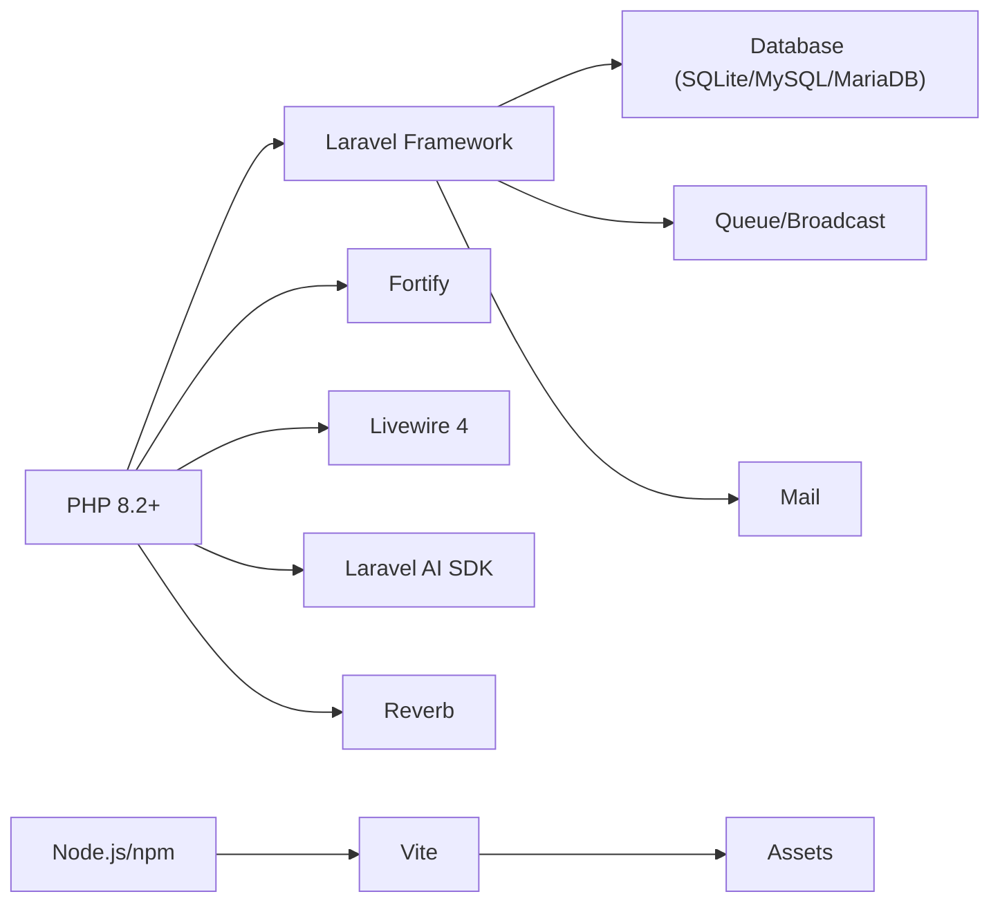
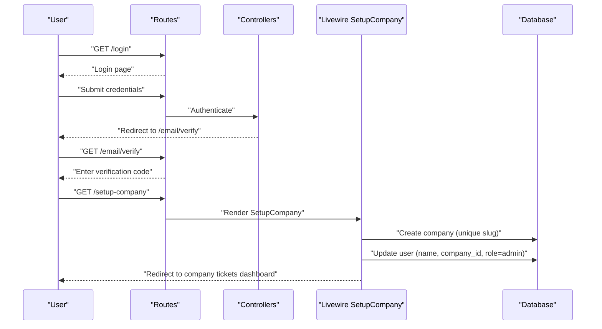

# Getting Started

<cite>
**Referenced Files in This Document**
- [composer.json](file://composer.json)
- [package.json](file://package.json)
- [.env.example](file://.env.example)
- [config/app.php](file://config/app.php)
- [config/database.php](file://config/database.php)
- [config/fortify.php](file://config/fortify.php)
- [config/mail.php](file://config/mail.php)
- [vite.config.js](file://vite.config.js)
- [artisan](file://artisan)
- [routes/web.php](file://routes/web.php)
- [app/Http/Middleware/IdentifyCompanyFromSubdomain.php](file://app/Http/Middleware/IdentifyCompanyFromSubdomain.php)
- [app/Http/Middleware/EnsureCompanyIsOnboarded.php](file://app/Http/Middleware/EnsureCompanyIsOnboarded.php)
- [app/Http/Controllers/Auth/InvitationController.php](file://app/Http/Controllers/Auth/InvitationController.php)
- [app/Livewire/Auth/SetupCompany.php](file://app/Livewire/Auth/SetupCompany.php)
- [database/migrations/0001_01_01_000000_create_users_table.php](file://database/migrations/0001_01_01_000000_create_users_table.php)
- [database/migrations/2026_02_01_224200_create_companies_table.php](file://database/migrations/2026_02_01_224200_create_companies_table.php)
</cite>

## Table of Contents
1. [Introduction](#introduction)
2. [Project Structure](#project-structure)
3. [Core Components](#core-components)
4. [Architecture Overview](#architecture-overview)
5. [Detailed Component Analysis](#detailed-component-analysis)
6. [Dependency Analysis](#dependency-analysis)
7. [Performance Considerations](#performance-considerations)
8. [Troubleshooting Guide](#troubleshooting-guide)
9. [Conclusion](#conclusion)
10. [Appendices](#appendices)

## Introduction
This guide helps you install and run the Helpdesk System locally. It covers prerequisites, step-by-step installation, environment configuration, database setup, asset compilation, initial application setup, and verification steps. It also includes troubleshooting tips and examples of registering a user and testing basic functionality.

## Project Structure
The Helpdesk System is a Laravel 12 application with Livewire components, Vue-like reactive UI, and a subdomain-per-company architecture. Key runtime elements include:
- PHP 8.2+ requirement enforced by Composer
- Laravel framework and Fortify for authentication
- Livewire v4 for interactive UI
- Vite for asset bundling and Tailwind CSS
- SQLite by default; MySQL/MariaDB supported via environment
- Reverb for real-time features
- Optional AI integrations via Laravel AI SDK

**Section sources**
- [composer.json:11-23](file://composer.json#L11-L23)
- [package.json:5-8](file://package.json#L5-L8)
- [config/database.php:19](file://config/database.php#L19)
- [config/app.php:16](file://config/app.php#L16)

## Core Components
- PHP and Laravel: Core application framework and HTTP routing.
- Composer scripts: Automated setup, migrations, and asset builds.
- Node.js and Vite: Asset pipeline for development and production builds.
- Database: SQLite by default; MySQL/MariaDB supported.
- Authentication: Fortify-based with email verification and optional Google OAuth.
- Real-time: Reverb for pusher-compatible WebSocket events.
- AI integrations: Optional via Laravel AI SDK.

**Section sources**
- [composer.json:48-56](file://composer.json#L48-L56)
- [package.json:5-8](file://package.json#L5-L8)
- [config/fortify.php:146-155](file://config/fortify.php#L146-L155)
- [config/mail.php:17](file://config/mail.php#L17)

## Architecture Overview
The system uses subdomains to isolate companies. Requests are routed through a central domain, with middleware extracting the company slug from the subdomain and attaching company context to the request. Authentication is handled centrally, followed by onboarding and role-based dashboards.

**Diagram sources**
- [routes/web.php:71-114](file://routes/web.php#L71-L114)
- [app/Http/Middleware/IdentifyCompanyFromSubdomain.php:12-36](file://app/Http/Middleware/IdentifyCompanyFromSubdomain.php#L12-L36)
- [app/Livewire/Auth/SetupCompany.php:40-82](file://app/Livewire/Auth/SetupCompany.php#L40-L82)

**Section sources**
- [routes/web.php:71-114](file://routes/web.php#L71-L114)
- [app/Http/Middleware/IdentifyCompanyFromSubdomain.php:12-36](file://app/Http/Middleware/IdentifyCompanyFromSubdomain.php#L12-L36)
- [app/Livewire/Auth/SetupCompany.php:40-82](file://app/Livewire/Auth/SetupCompany.php#L40-L82)

## Detailed Component Analysis

### Prerequisites
- PHP 8.2+ (enforced by Composer)
- Composer (PHP dependency manager)
- Node.js and npm (for Vite and assets)
- One of:
  - SQLite (default)
  - MySQL or MariaDB (via environment variables)

Notes:
- The project targets Laravel 12 and Livewire 4.
- Reverb is included for real-time features.

**Section sources**
- [composer.json:11-23](file://composer.json#L11-L23)
- [config/database.php:19](file://config/database.php#L19)

### Step-by-Step Installation

1) Clone and enter the repository
- Use your preferred Git client to clone the repository and navigate into the project directory.

2) Install PHP dependencies with Composer
- Run the Composer setup script to install dependencies, generate the application key, run migrations, install Node dependencies, and build assets.
- The Composer script performs:
  - Installing PHP packages
  - Copying .env.example to .env if missing
  - Generating APP_KEY
  - Running database migrations
  - Installing Node packages
  - Building assets with Vite

3) Configure the environment
- Copy the example environment file to .env if not created automatically by the Composer script.
- Set APP_KEY to a secure 32-character key.
- Choose a database:
  - SQLite (default): leave DB_CONNECTION=sqlite and SESSION_DRIVER=database
  - MySQL/MariaDB: set DB_CONNECTION=mysql, DB_HOST, DB_PORT, DB_DATABASE, DB_USERNAME, DB_PASSWORD
- Configure mail transport (MAIL_MAILER) and credentials as needed.
- Configure Reverb (REVERB_APP_ID, REVERB_APP_KEY, REVERB_APP_SECRET, REVERB_HOST, REVERB_PORT, REVERB_SCHEME) if enabling real-time features.
- Optionally configure Google OAuth (GOOGLE_CLIENT_ID, GOOGLE_CLIENT_SECRET, GOOGLE_REDIRECT_URI).

4) Prepare the database
- Run migrations to create tables for users, companies, tickets, conversations, automation rules, and others.
- The migrations include:
  - Users table with company relationship, email verification, and roles
  - Companies table with slug and metadata
  - Additional related tables for replies, conversations, logs, filters, etc.

5) Build assets
- Install Node dependencies with npm install.
- Build assets with npm run build or run the dev server with npm run dev.

6) Start the application
- Use the Laravel built-in development server or deploy behind Apache/Nginx.
- The Composer dev script runs the server, queue listener, Vite, and Reverb concurrently.

**Section sources**
- [composer.json:48-56](file://composer.json#L48-L56)
- [.env.example:1-100](file://.env.example#L1-L100)
- [config/database.php:34-84](file://config/database.php#L34-L84)
- [database/migrations/0001_01_01_000000_create_users_table.php:14-31](file://database/migrations/0001_01_01_000000_create_users_table.php#L14-L31)
- [database/migrations/2026_02_01_224200_create_companies_table.php:14-30](file://database/migrations/2026_02_01_224200_create_companies_table.php#L14-L30)
- [package.json:5-8](file://package.json#L5-L8)
- [vite.config.js:7-21](file://vite.config.js#L7-L21)
- [composer.json:57-60](file://composer.json#L57-L60)

### Initial Setup

1) Generate application key
- The Composer setup script generates the key automatically. Alternatively, run the Artisan command to generate a new key.

2) Create the first company and admin user
- After authenticating (email verification required), users land on the company setup flow.
- The SetupCompany Livewire component validates inputs, creates a unique company slug, assigns the user as admin, and redirects to the company’s ticket dashboard.

3) Configure subdomain routing
- The system expects subdomains like subdomain.helpdesk-system.test.
- The IdentifyCompanyFromSubdomain middleware extracts the slug and attaches company context to the request.

4) Verify onboarding
- New companies are required to complete onboarding before accessing dashboards.

**Section sources**
- [composer.json:52](file://composer.json#L52)
- [artisan:1-19](file://artisan#L1-L19)
- [app/Livewire/Auth/SetupCompany.php:40-82](file://app/Livewire/Auth/SetupCompany.php#L40-L82)
- [app/Http/Middleware/IdentifyCompanyFromSubdomain.php:12-36](file://app/Http/Middleware/IdentifyCompanyFromSubdomain.php#L12-L36)
- [app/Http/Middleware/EnsureCompanyIsOnboarded.php:16-26](file://app/Http/Middleware/EnsureCompanyIsOnboarded.php#L16-L26)

### Basic Functionality Testing

- Authentication flow
  - Visit the login page and sign in with an existing user or register quickly.
  - Email verification is enforced; after verification, users are directed to company setup or dashboard depending on onboarding state.

- Invitation acceptance
  - Accepting an invitation link sets the user as pending and redirects to set-password if needed.

- Company dashboard
  - After setup, users are redirected to their company’s subdomain dashboard (admin or agent).

- Real-time updates
  - Reverb can be started via the Composer dev script to enable live features.

**Section sources**
- [routes/web.php:21-68](file://routes/web.php#L21-L68)
- [app/Http/Controllers/Auth/InvitationController.php:14-29](file://app/Http/Controllers/Auth/InvitationController.php#L14-L29)
- [config/fortify.php:76](file://config/fortify.php#L76)

## Dependency Analysis

**Diagram sources**
- [composer.json:11-23](file://composer.json#L11-L23)
- [package.json:9-22](file://package.json#L9-L22)
- [config/database.php:34-84](file://config/database.php#L34-L84)
- [config/mail.php:17](file://config/mail.php#L17)

**Section sources**
- [composer.json:11-23](file://composer.json#L11-L23)
- [package.json:9-22](file://package.json#L9-L22)
- [config/database.php:34-84](file://config/database.php#L34-L84)
- [config/mail.php:17](file://config/mail.php#L17)

## Performance Considerations
- Use production-ready servers (Apache/Nginx) for performance.
- Enable opcode caching (OPcache) and optimize PHP-FPM settings.
- Use a persistent cache store (Redis) for sessions and cache.
- Prefer MySQL/MariaDB over SQLite for concurrent workloads.
- Minimize asset rebuilds; use Vite’s dev server during development and production builds for deployment.

[No sources needed since this section provides general guidance]

## Troubleshooting Guide

Common issues and resolutions:
- PHP version mismatch
  - Ensure PHP 8.2+ is installed. Composer enforces this requirement.

- Missing APP_KEY
  - Generate a new key using the Artisan command or rely on the Composer setup script.

- Database connection errors
  - Confirm DB_CONNECTION and credentials in .env.
  - For SQLite, ensure the database file exists and is writable.
  - For MySQL/MariaDB, verify host, port, database name, and credentials.

- Migrations fail
  - Run migrations again with the force flag if needed.
  - Check database permissions and collation settings.

- Assets not loading
  - Install Node dependencies and rebuild assets.
  - Ensure Vite is running in dev mode or build assets for production.

- Subdomain not recognized
  - Ensure your local DNS resolves subdomain.helpdesk-system.test.
  - The middleware extracts the subdomain from the host and attaches company context.

- Email verification or invitation issues
  - Verify mail transport settings.
  - Ensure signed URL routes are accessible and not blocked by middleware.

**Section sources**
- [composer.json:52](file://composer.json#L52)
- [artisan:1-19](file://artisan#L1-L19)
- [.env.example:27-32](file://.env.example#L27-L32)
- [config/database.php:34-84](file://config/database.php#L34-L84)
- [vite.config.js:7-21](file://vite.config.js#L7-L21)
- [app/Http/Middleware/IdentifyCompanyFromSubdomain.php:12-36](file://app/Http/Middleware/IdentifyCompanyFromSubdomain.php#L12-L36)
- [config/mail.php:17](file://config/mail.php#L17)

## Conclusion
You now have the prerequisites, installation steps, and operational guidance to run the Helpdesk System locally. Proceed with environment configuration, database setup, and asset compilation. Use the provided routes and middleware to verify subdomain routing and onboarding. Test authentication, invitations, and company setup to ensure the system is ready for use.

[No sources needed since this section summarizes without analyzing specific files]

## Appendices

### A. Environment Variables Reference
Key variables to review and configure:
- APP_KEY: Application encryption key
- DB_CONNECTION: sqlite, mysql, mariadb, pgsql, sqlsrv
- DB_HOST, DB_PORT, DB_DATABASE, DB_USERNAME, DB_PASSWORD
- MAIL_MAILER, MAIL_HOST, MAIL_PORT, MAIL_USERNAME, MAIL_PASSWORD
- REVERB_APP_ID, REVERB_APP_KEY, REVERB_APP_SECRET, REVERB_HOST, REVERB_PORT, REVERB_SCHEME
- GOOGLE_CLIENT_ID, GOOGLE_CLIENT_SECRET, GOOGLE_REDIRECT_URI

**Section sources**
- [.env.example:1-100](file://.env.example#L1-L100)
- [config/database.php:19](file://config/database.php#L19)
- [config/mail.php:17](file://config/mail.php#L17)

### B. Initial User Registration and First Company Creation

**Diagram sources**
- [routes/web.php:21-68](file://routes/web.php#L21-L68)
- [app/Livewire/Auth/SetupCompany.php:40-82](file://app/Livewire/Auth/SetupCompany.php#L40-L82)
- [database/migrations/0001_01_01_000000_create_users_table.php:14-31](file://database/migrations/0001_01_01_000000_create_users_table.php#L14-L31)
- [database/migrations/2026_02_01_224200_create_companies_table.php:14-30](file://database/migrations/2026_02_01_224200_create_companies_table.php#L14-L30)