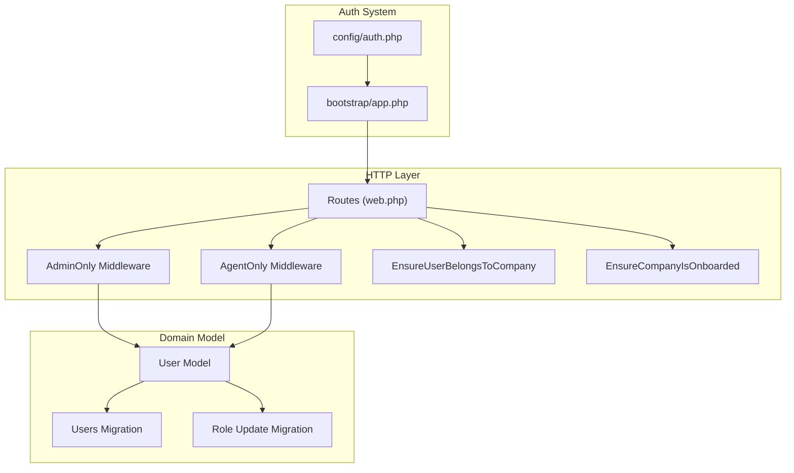
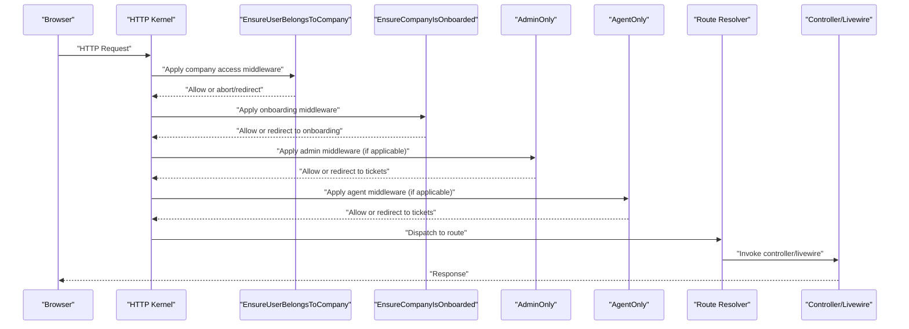
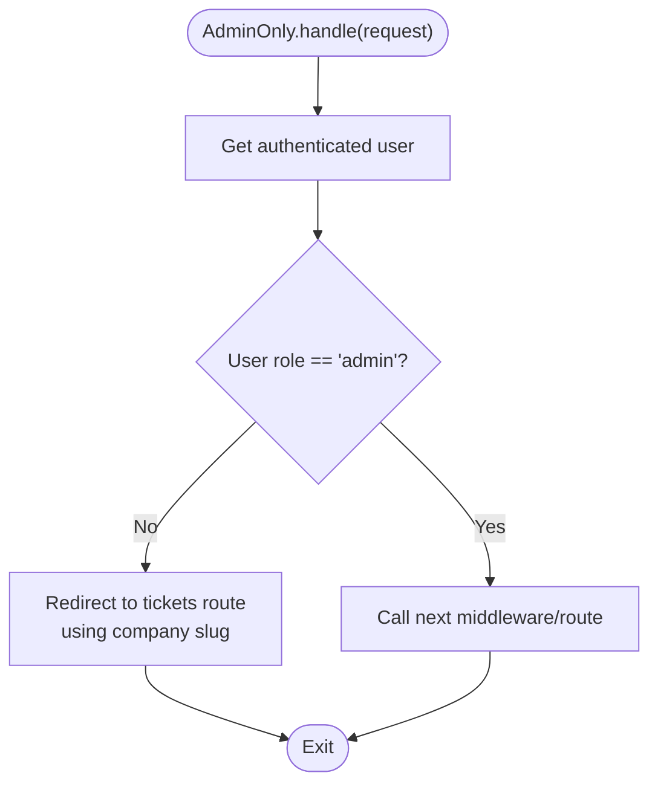
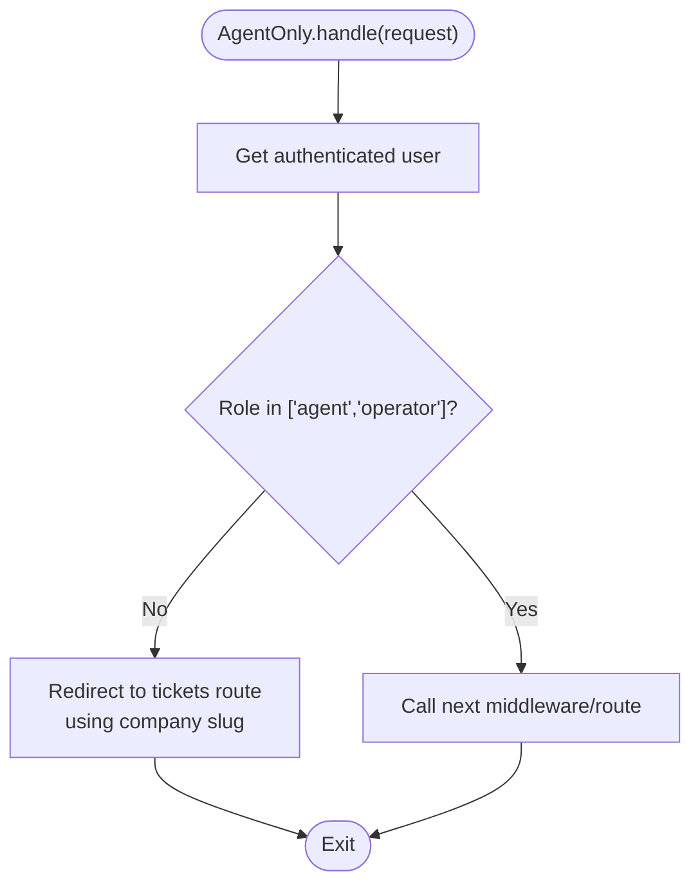
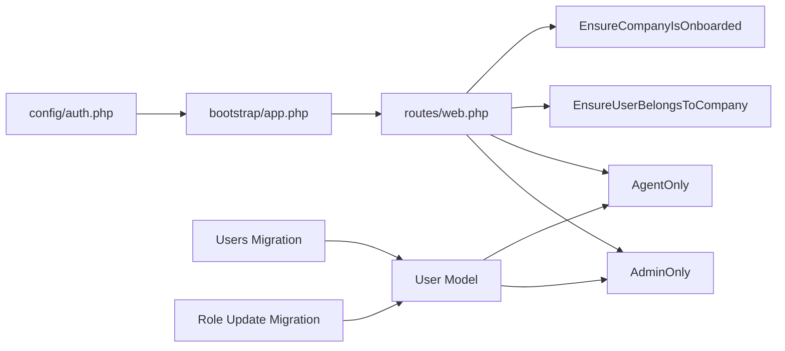

# Access Control Middleware

<cite>
**Referenced Files in This Document**
- [AdminOnly.php](file://app/Http/Middleware/AdminOnly.php)
- [AgentOnly.php](file://app/Http/Middleware/AgentOnly.php)
- [auth.php](file://config/auth.php)
- [web.php](file://routes/web.php)
- [User.php](file://app/Models/User.php)
- [0001_01_01_000000_create_users_table.php](file://database/migrations/0001_01_01_000000_create_users_table.php)
- [2026_03_07_151242_update_user_role_to_operator.php](file://database/migrations/2026_03_07_151242_update_user_role_to_operator.php)
- [EnsureUserBelongsToCompany.php](file://app/Http/Middleware/EnsureUserBelongsToCompany.php)
- [EnsureCompanyIsOnboarded.php](file://app/Http/Middleware/EnsureCompanyIsOnboarded.php)
- [app.php](file://bootstrap/app.php)
</cite>

## Table of Contents
1. [Introduction](#introduction)
2. [Project Structure](#project-structure)
3. [Core Components](#core-components)
4. [Architecture Overview](#architecture-overview)
5. [Detailed Component Analysis](#detailed-component-analysis)
6. [Dependency Analysis](#dependency-analysis)
7. [Performance Considerations](#performance-considerations)
8. [Troubleshooting Guide](#troubleshooting-guide)
9. [Conclusion](#conclusion)

## Introduction
This document explains the role-based access control middleware system used to protect administrative and agent-specific functionality. It covers how the AdminOnly and AgentOnly middleware enforce role-based restrictions, how authentication integrates with Laravel’s guard system, and how to apply middleware to routes. It also provides guidance on extending access control to hierarchical permissions, understanding middleware ordering, and debugging access control issues.

## Project Structure
The access control system spans middleware classes, routing configuration, authentication configuration, and the User model. Middleware classes are located under app/Http/Middleware and are registered via the application bootstrap configuration. Routes define where middleware is applied, and the User model exposes role-related properties and scopes.

**Diagram sources**
- [web.php:88-93](file://routes/web.php#L88-L93)
- [AdminOnly.php:16-23](file://app/Http/Middleware/AdminOnly.php#L16-L23)
- [AgentOnly.php:16-23](file://app/Http/Middleware/AgentOnly.php#L16-L23)
- [EnsureUserBelongsToCompany.php:11-36](file://app/Http/Middleware/EnsureUserBelongsToCompany.php#L11-L36)
- [EnsureCompanyIsOnboarded.php:16-25](file://app/Http/Middleware/EnsureCompanyIsOnboarded.php#L16-L25)
- [auth.php:38-43](file://config/auth.php#L38-L43)
- [app.php:20-29](file://bootstrap/app.php#L20-L29)
- [User.php:25](file://app/Models/User.php#L25)
- [0001_01_01_000000_create_users_table.php:23](file://database/migrations/0001_01_01_000000_create_users_table.php#L23)
- [2026_03_07_151242_update_user_role_to_operator.php:20](file://database/migrations/2026_03_07_151242_update_user_role_to_operator.php#L20)

**Section sources**
- [web.php:88-93](file://routes/web.php#L88-L93)
- [auth.php:38-43](file://config/auth.php#L38-L43)
- [app.php:20-29](file://bootstrap/app.php#L20-L29)
- [User.php:25](file://app/Models/User.php#L25)
- [0001_01_01_000000_create_users_table.php:23](file://database/migrations/0001_01_01_000000_create_users_table.php#L23)
- [2026_03_07_151242_update_user_role_to_operator.php:20](file://database/migrations/2026_03_07_151242_update_user_role_to_operator.php#L20)

## Core Components
- AdminOnly middleware: Restricts access to administrative routes to users whose role equals "admin". Unauthorized users are redirected to the company’s ticket list page.
- AgentOnly middleware: Grants access to agent/operator dashboards to users whose role is either "agent" or "operator". Unauthorized users are redirected similarly.
- Authentication guard configuration: Defines the default session-based guard and the Eloquent user provider used to resolve the current user.
- User model role property: Stores the user’s role and exposes helper methods and scopes for role checks and filtering.

Key implementation references:
- AdminOnly middleware handler and redirect behavior: [AdminOnly.php:16-23](file://app/Http/Middleware/AdminOnly.php#L16-L23)
- AgentOnly middleware handler and redirect behavior: [AgentOnly.php:16-23](file://app/Http/Middleware/AgentOnly.php#L16-L23)
- Authentication guards and providers: [auth.php:38-72](file://config/auth.php#L38-L72)
- User role field and scopes: [User.php:25](file://app/Models/User.php#L25), [User.php:54-62](file://app/Models/User.php#L54-L62), [User.php:118-121](file://app/Models/User.php#L118-L121)
- Role enum definition and migration: [0001_01_01_000000_create_users_table.php:23](file://database/migrations/0001_01_01_000000_create_users_table.php#L23)
- Role rename from "technician" to "operator": [2026_03_07_151242_update_user_role_to_operator.php:16-21](file://database/migrations/2026_03_07_151242_update_user_role_to_operator.php#L16-L21)

**Section sources**
- [AdminOnly.php:16-23](file://app/Http/Middleware/AdminOnly.php#L16-L23)
- [AgentOnly.php:16-23](file://app/Http/Middleware/AgentOnly.php#L16-L23)
- [auth.php:38-72](file://config/auth.php#L38-L72)
- [User.php:25](file://app/Models/User.php#L25)
- [User.php:54-62](file://app/Models/User.php#L54-L62)
- [User.php:118-121](file://app/Models/User.php#L118-L121)
- [0001_01_01_000000_create_users_table.php:23](file://database/migrations/0001_01_01_000000_create_users_table.php#L23)
- [2026_03_07_151242_update_user_role_to_operator.php:16-21](file://database/migrations/2026_03_07_151242_update_user_role_to_operator.php#L16-L21)

## Architecture Overview
The middleware system enforces role-based access control around route groups. Authentication is handled by the session-based guard, and middleware executes in the order defined by the application bootstrap and route grouping. Company-level middleware ensures the user belongs to the requested company and that onboarding is complete before allowing access to the dashboard.

**Diagram sources**
- [web.php:72-114](file://routes/web.php#L72-L114)
- [EnsureUserBelongsToCompany.php:11-36](file://app/Http/Middleware/EnsureUserBelongsToCompany.php#L11-L36)
- [EnsureCompanyIsOnboarded.php:16-25](file://app/Http/Middleware/EnsureCompanyIsOnboarded.php#L16-L25)
- [AdminOnly.php:16-23](file://app/Http/Middleware/AdminOnly.php#L16-L23)
- [AgentOnly.php:16-23](file://app/Http/Middleware/AgentOnly.php#L16-L23)

**Section sources**
- [web.php:72-114](file://routes/web.php#L72-L114)
- [EnsureUserBelongsToCompany.php:11-36](file://app/Http/Middleware/EnsureUserBelongsToCompany.php#L11-L36)
- [EnsureCompanyIsOnboarded.php:16-25](file://app/Http/Middleware/EnsureCompanyIsOnboarded.php#L16-L25)
- [AdminOnly.php:16-23](file://app/Http/Middleware/AdminOnly.php#L16-L23)
- [AgentOnly.php:16-23](file://app/Http/Middleware/AgentOnly.php#L16-L23)

## Detailed Component Analysis

### AdminOnly Middleware
Purpose:
- Restrict access to administrative routes to users with role "admin".
- Redirect unauthorized users to the company’s ticket list page.

Behavior:
- Checks the authenticated user’s role.
- If not "admin", redirects to the tickets route using the user’s company slug.
- Otherwise, passes the request to the next middleware/route.

**Diagram sources**
- [AdminOnly.php:16-23](file://app/Http/Middleware/AdminOnly.php#L16-L23)

**Section sources**
- [AdminOnly.php:16-23](file://app/Http/Middleware/AdminOnly.php#L16-L23)
- [web.php:91-93](file://routes/web.php#L91-L93)

### AgentOnly Middleware
Purpose:
- Allow access to agent/operator dashboards to users with role "agent" or "operator".
- Redirect unauthorized users to the company’s ticket list page.

Behavior:
- Validates that the user’s role is in the allowed set.
- If not allowed, redirects to the tickets route using the user’s company slug.
- Otherwise, proceeds to the next middleware/route.

**Diagram sources**
- [AgentOnly.php:16-23](file://app/Http/Middleware/AgentOnly.php#L16-L23)

**Section sources**
- [AgentOnly.php:16-23](file://app/Http/Middleware/AgentOnly.php#L16-L23)
- [web.php:88-90](file://routes/web.php#L88-L90)

### Authentication Guard Configuration
Configuration highlights:
- Default guard: "web" using the session driver.
- Provider: "users" backed by the Eloquent User model.
- Password broker: "users" with a configurable expiration and throttle.

Integration with middleware:
- Middleware relies on the authenticated user being available via the request’s user() method, which is populated by the configured guard.

**Section sources**
- [auth.php:16-19](file://config/auth.php#L16-L19)
- [auth.php:38-72](file://config/auth.php#L38-L72)

### Applying Middleware to Routes
Examples from routes/web.php:
- Admin dashboard requires AdminOnly middleware.
- Agent dashboard requires AgentOnly middleware.
- Company-level middleware ensures the user belongs to the requested company and that onboarding is complete.

References:
- Admin dashboard route with AdminOnly: [web.php:91-93](file://routes/web.php#L91-L93)
- Agent dashboard route with AgentOnly: [web.php:88-90](file://routes/web.php#L88-L90)
- Company access and onboarding middleware: [web.php:72-114](file://routes/web.php#L72-L114)

**Section sources**
- [web.php:72-114](file://routes/web.php#L72-L114)
- [web.php:88-93](file://routes/web.php#L88-L93)

### Creating Custom Access Control Rules
Approach:
- Extend the User model with additional role helpers or scopes to support hierarchical permissions.
- Use Laravel’s Authorize middleware with policies or gates for fine-grained checks.
- Combine middleware with route model binding and policy checks for robust access control.

References:
- User role helpers and scopes: [User.php:54-62](file://app/Models/User.php#L54-L62), [User.php:118-121](file://app/Models/User.php#L118-L121)
- Policy/gate usage in routes: [web.php:98-111](file://routes/web.php#L98-L111)

**Section sources**
- [User.php:54-62](file://app/Models/User.php#L54-L62)
- [User.php:118-121](file://app/Models/User.php#L118-L121)
- [web.php:98-111](file://routes/web.php#L98-L111)

### Middleware Ordering and Execution
Ordering:
- Company-level middleware runs before role-based middleware.
- Onboarding middleware ensures completion before allowing dashboard access.
- Role-based middleware (AdminOnly, AgentOnly) executes after authentication and company/onboarding checks.

References:
- Middleware alias registration and web stack append: [app.php:20-29](file://bootstrap/app.php#L20-L29)
- Route group ordering: [web.php:72-114](file://routes/web.php#L72-L114)

**Section sources**
- [app.php:20-29](file://bootstrap/app.php#L20-L29)
- [web.php:72-114](file://routes/web.php#L72-L114)

## Dependency Analysis
The access control system depends on:
- Authentication guard to populate the request user.
- User model role property and helpers.
- Company middleware to establish the current company context.
- Route configuration to attach middleware to specific routes.

**Diagram sources**
- [auth.php:38-72](file://config/auth.php#L38-L72)
- [app.php:20-29](file://bootstrap/app.php#L20-L29)
- [web.php:72-114](file://routes/web.php#L72-L114)
- [AdminOnly.php:16-23](file://app/Http/Middleware/AdminOnly.php#L16-L23)
- [AgentOnly.php:16-23](file://app/Http/Middleware/AgentOnly.php#L16-L23)
- [EnsureUserBelongsToCompany.php:11-36](file://app/Http/Middleware/EnsureUserBelongsToCompany.php#L11-L36)
- [EnsureCompanyIsOnboarded.php:16-25](file://app/Http/Middleware/EnsureCompanyIsOnboarded.php#L16-L25)
- [User.php:25](file://app/Models/User.php#L25)
- [0001_01_01_000000_create_users_table.php:23](file://database/migrations/0001_01_01_000000_create_users_table.php#L23)
- [2026_03_07_151242_update_user_role_to_operator.php:20](file://database/migrations/2026_03_07_151242_update_user_role_to_operator.php#L20)

**Section sources**
- [auth.php:38-72](file://config/auth.php#L38-L72)
- [app.php:20-29](file://bootstrap/app.php#L20-L29)
- [web.php:72-114](file://routes/web.php#L72-L114)
- [AdminOnly.php:16-23](file://app/Http/Middleware/AdminOnly.php#L16-L23)
- [AgentOnly.php:16-23](file://app/Http/Middleware/AgentOnly.php#L16-L23)
- [EnsureUserBelongsToCompany.php:11-36](file://app/Http/Middleware/EnsureUserBelongsToCompany.php#L11-L36)
- [EnsureCompanyIsOnboarded.php:16-25](file://app/Http/Middleware/EnsureCompanyIsOnboarded.php#L16-L25)
- [User.php:25](file://app/Models/User.php#L25)
- [0001_01_01_000000_create_users_table.php:23](file://database/migrations/0001_01_01_000000_create_users_table.php#L23)
- [2026_03_07_151242_update_user_role_to_operator.php:20](file://database/migrations/2026_03_07_151242_update_user_role_to_operator.php#L20)

## Performance Considerations
- Minimize redundant role checks: Cache user role and company membership when appropriate to reduce repeated lookups.
- Prefer early exits: Both AdminOnly and AgentOnly short-circuit on unauthorized access, avoiding unnecessary downstream processing.
- Keep middleware order efficient: Place cheaper checks earlier (e.g., authentication and company membership) before role checks.
- Avoid heavy computations inside middleware: Delegate complex permission logic to policies or dedicated services.

## Troubleshooting Guide
Common issues and resolutions:
- Unexpected redirects to tickets:
  - Verify the user’s role value and that the request is authenticated.
  - Confirm the route is correctly grouped with the intended middleware.
  - References: [AdminOnly.php:18-20](file://app/Http/Middleware/AdminOnly.php#L18-L20), [AgentOnly.php:18-20](file://app/Http/Middleware/AgentOnly.php#L18-L20), [web.php:88-93](file://routes/web.php#L88-L93)
- Company access denied:
  - Ensure the user belongs to the requested company and that the subdomain/company context is correctly resolved.
  - Reference: [EnsureUserBelongsToCompany.php:32-34](file://app/Http/Middleware/EnsureUserBelongsToCompany.php#L32-L34)
- Onboarding redirect loop:
  - Confirm onboarding routes are excluded from redirection logic.
  - Reference: [EnsureCompanyIsOnboarded.php:18-23](file://app/Http/Middleware/EnsureCompanyIsOnboarded.php#L18-L23)
- Authentication not resolving user:
  - Check the guard configuration and session state.
  - References: [auth.php:38-43](file://config/auth.php#L38-L43), [app.php:20-29](file://bootstrap/app.php#L20-L29)

**Section sources**
- [AdminOnly.php:18-20](file://app/Http/Middleware/AdminOnly.php#L18-L20)
- [AgentOnly.php:18-20](file://app/Http/Middleware/AgentOnly.php#L18-L20)
- [web.php:88-93](file://routes/web.php#L88-L93)
- [EnsureUserBelongsToCompany.php:32-34](file://app/Http/Middleware/EnsureUserBelongsToCompany.php#L32-L34)
- [EnsureCompanyIsOnboarded.php:18-23](file://app/Http/Middleware/EnsureCompanyIsOnboarded.php#L18-L23)
- [auth.php:38-43](file://config/auth.php#L38-L43)
- [app.php:20-29](file://bootstrap/app.php#L20-L29)

## Conclusion
The access control middleware system leverages a simple role-based model with AdminOnly and AgentOnly middleware to secure administrative and agent dashboards. Authentication is powered by Laravel’s session-based guard, while company-level middleware ensures proper context. The system is extensible: roles can be expanded, hierarchical permissions can be modeled with policies, and middleware ordering can be tuned for performance and correctness.