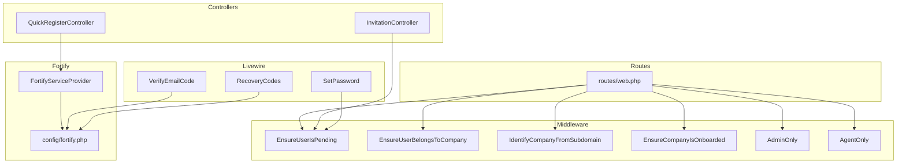
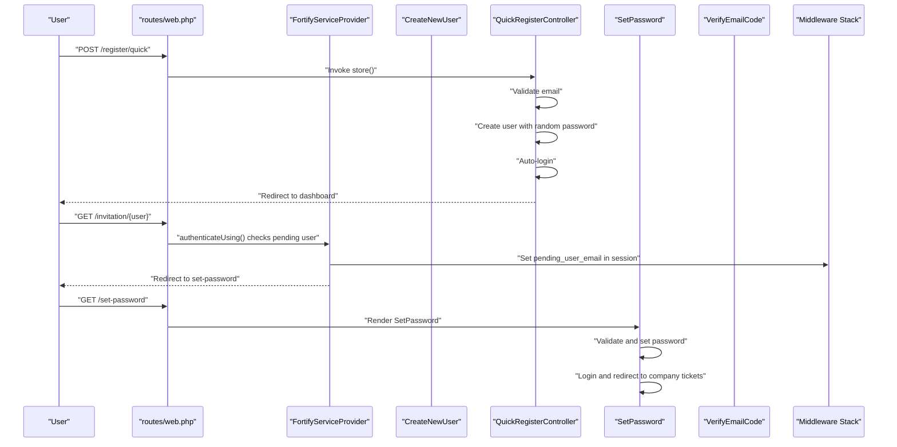
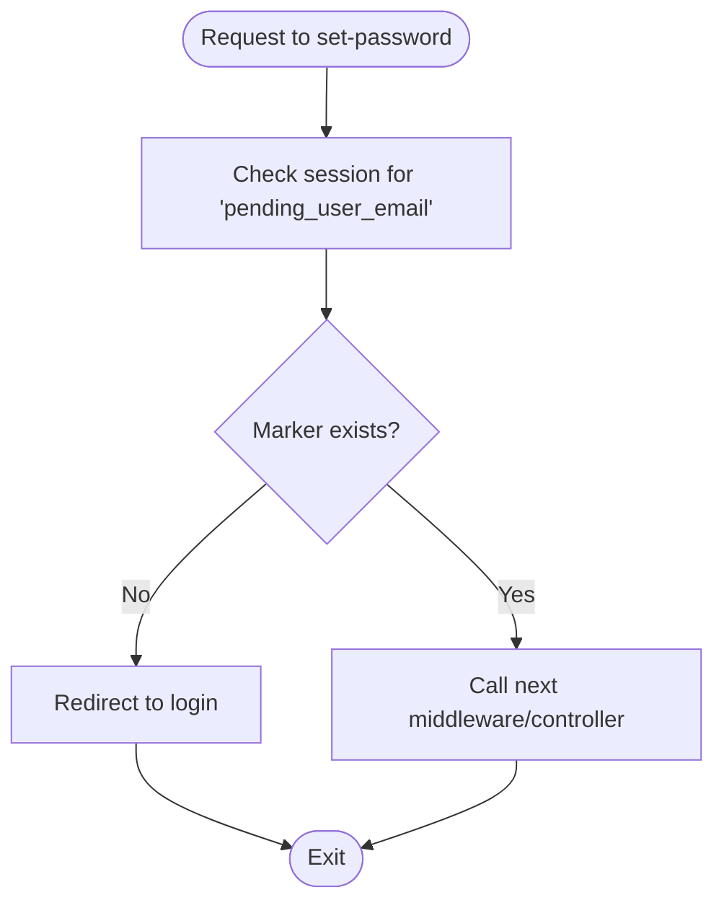
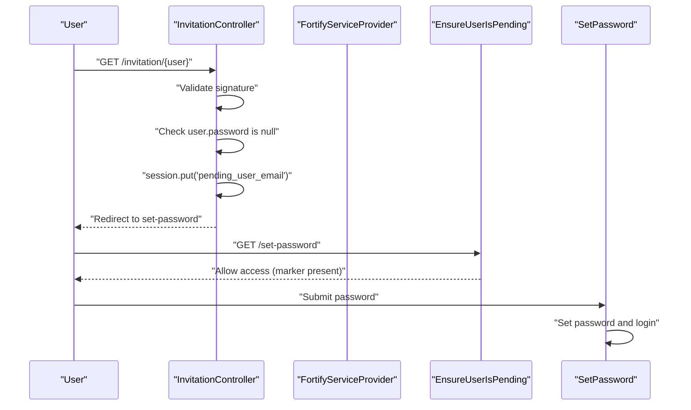
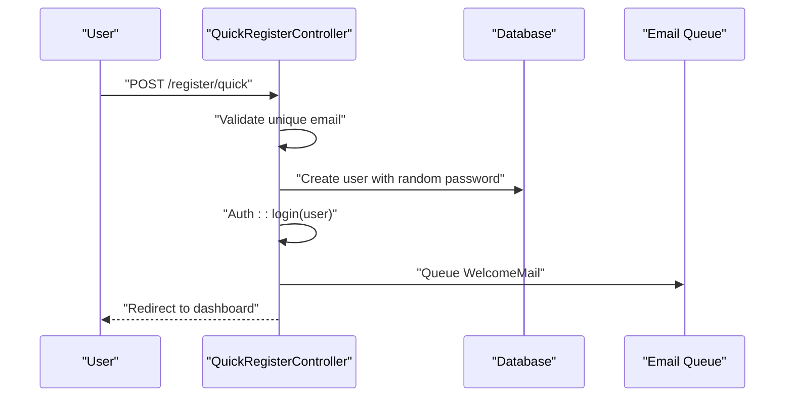
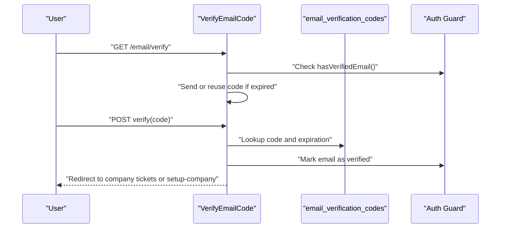
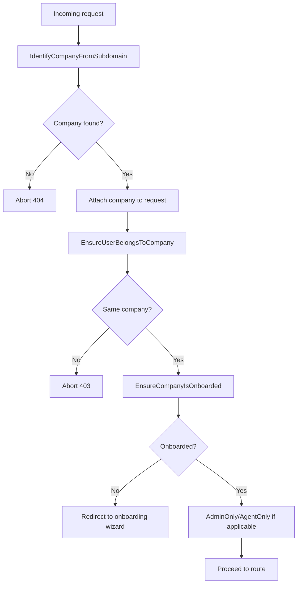
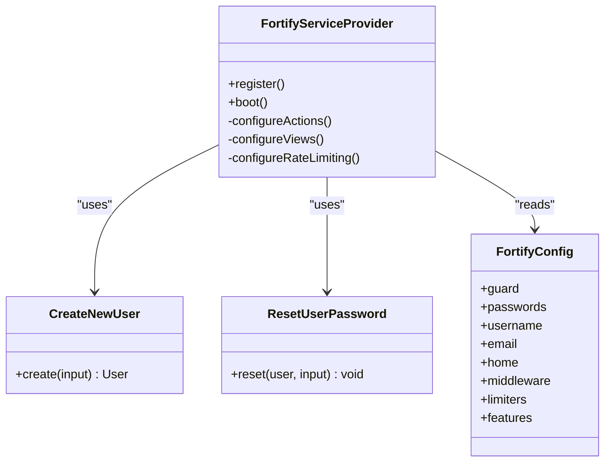
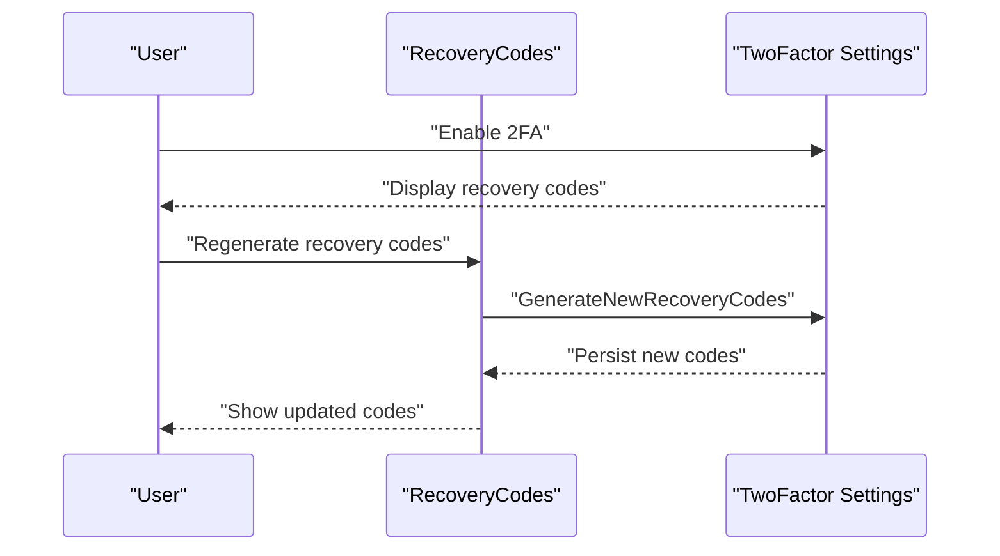
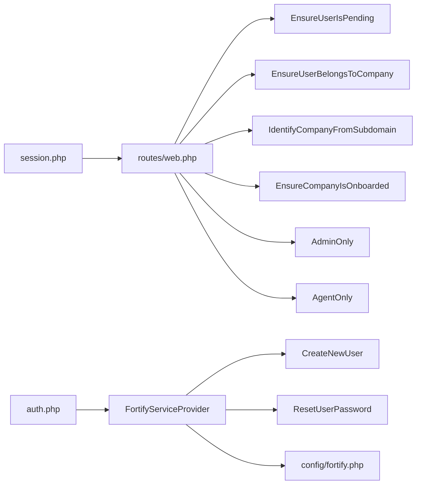

# Authentication Middleware

<cite>
**Referenced Files in This Document**
- [EnsureUserIsPending.php](file://app/Http/Middleware/EnsureUserIsPending.php)
- [AdminOnly.php](file://app/Http/Middleware/AdminOnly.php)
- [AgentOnly.php](file://app/Http/Middleware/AgentOnly.php)
- [EnsureCompanyIsOnboarded.php](file://app/Http/Middleware/EnsureCompanyIsOnboarded.php)
- [EnsureUserBelongsToCompany.php](file://app/Http/Middleware/EnsureUserBelongsToCompany.php)
- [IdentifyCompanyFromSubdomain.php](file://app/Http/Middleware/IdentifyCompanyFromSubdomain.php)
- [FortifyServiceProvider.php](file://app/Providers/FortifyServiceProvider.php)
- [CreateNewUser.php](file://app/Actions/Fortify/CreateNewUser.php)
- [ResetUserPassword.php](file://app/Actions/Fortify/ResetUserPassword.php)
- [InvitationController.php](file://app/Http/Controllers/Auth/InvitationController.php)
- [QuickRegisterController.php](file://app/Http/Controllers/QuickRegisterController.php)
- [SetPassword.php](file://app/Livewire/Auth/SetPassword.php)
- [VerifyEmailCode.php](file://app/Livewire/Auth/VerifyEmailCode.php)
- [RecoveryCodes.php](file://app/Livewire/Settings/TwoFactor/RecoveryCodes.php)
- [web.php](file://routes/web.php)
- [fortify.php](file://config/fortify.php)
- [session.php](file://config/session.php)
- [auth.php](file://config/auth.php)
</cite>

## Table of Contents
1. [Introduction](#introduction)
2. [Project Structure](#project-structure)
3. [Core Components](#core-components)
4. [Architecture Overview](#architecture-overview)
5. [Detailed Component Analysis](#detailed-component-analysis)
6. [Dependency Analysis](#dependency-analysis)
7. [Performance Considerations](#performance-considerations)
8. [Troubleshooting Guide](#troubleshooting-guide)
9. [Conclusion](#conclusion)

## Introduction
This document explains the authentication middleware stack and user verification processes in the system. It focuses on:
- The EnsureUserIsPending middleware for handling user registration and invitation workflows
- Integration between Laravel Fortify configuration and custom authentication middleware
- Session management, CSRF protection, and two-factor authentication middleware
- Examples of customizing authentication flows, adding verification steps, and handling failures
- Security best practices for authentication middleware, session security, and protection against common authentication attacks

## Project Structure
The authentication and middleware logic spans several areas:
- Middleware: request gating and access control
- Fortify integration: authentication actions, views, and rate limiting
- Controllers: invitation handling and quick registration
- Livewire components: password setup, email verification, and two-factor recovery
- Routes: middleware binding and subdomain-based company routing
- Configuration: Fortify, session, and auth guards

**Diagram sources**
- [web.php:1-117](file://routes/web.php#L1-L117)
- [EnsureUserIsPending.php:1-25](file://app/Http/Middleware/EnsureUserIsPending.php#L1-L25)
- [EnsureUserBelongsToCompany.php:1-39](file://app/Http/Middleware/EnsureUserBelongsToCompany.php#L1-L39)
- [IdentifyCompanyFromSubdomain.php:1-54](file://app/Http/Middleware/IdentifyCompanyFromSubdomain.php#L1-L54)
- [EnsureCompanyIsOnboarded.php:1-28](file://app/Http/Middleware/EnsureCompanyIsOnboarded.php#L1-L28)
- [AdminOnly.php:1-25](file://app/Http/Middleware/AdminOnly.php#L1-L25)
- [AgentOnly.php:1-25](file://app/Http/Middleware/AgentOnly.php#L1-L25)
- [FortifyServiceProvider.php:1-106](file://app/Providers/FortifyServiceProvider.php#L1-L106)
- [fortify.php:1-158](file://config/fortify.php#L1-L158)
- [InvitationController.php:1-31](file://app/Http/Controllers/Auth/InvitationController.php#L1-L31)
- [QuickRegisterController.php:1-61](file://app/Http/Controllers/QuickRegisterController.php#L1-L61)
- [SetPassword.php:1-104](file://app/Livewire/Auth/SetPassword.php#L1-L104)
- [VerifyEmailCode.php:1-119](file://app/Livewire/Auth/VerifyEmailCode.php#L1-L119)
- [RecoveryCodes.php:1-51](file://app/Livewire/Settings/TwoFactor/RecoveryCodes.php#L1-L51)

**Section sources**
- [web.php:1-117](file://routes/web.php#L1-L117)
- [FortifyServiceProvider.php:1-106](file://app/Providers/FortifyServiceProvider.php#L1-L106)
- [fortify.php:1-158](file://config/fortify.php#L1-L158)

## Core Components
- EnsureUserIsPending: unlocks password setup flow for invited/pending users by checking a volatile session marker.
- EnsureUserBelongsToCompany: enforces that authenticated users belong to the requested company context.
- IdentifyCompanyFromSubdomain: resolves company context from subdomain and attaches it to the request.
- EnsureCompanyIsOnboarded: redirects unonboarded companies to the onboarding wizard.
- AdminOnly and AgentOnly: role-based access to admin/agent dashboards.
- Fortify integration: custom authentication actions, views, rate limiting, and middleware assignment.
- Session and CSRF: managed via session configuration and default web middleware stack.
- Two-factor authentication: enabled via Fortify features and supported by recovery codes UI.

**Section sources**
- [EnsureUserIsPending.php:16-23](file://app/Http/Middleware/EnsureUserIsPending.php#L16-L23)
- [EnsureUserBelongsToCompany.php:11-36](file://app/Http/Middleware/EnsureUserBelongsToCompany.php#L11-L36)
- [IdentifyCompanyFromSubdomain.php:12-35](file://app/Http/Middleware/IdentifyCompanyFromSubdomain.php#L12-L35)
- [EnsureCompanyIsOnboarded.php:16-25](file://app/Http/Middleware/EnsureCompanyIsOnboarded.php#L16-L25)
- [AdminOnly.php:16-23](file://app/Http/Middleware/AdminOnly.php#L16-L23)
- [AgentOnly.php:16-23](file://app/Http/Middleware/AgentOnly.php#L16-L23)
- [FortifyServiceProvider.php:56-74](file://app/Providers/FortifyServiceProvider.php#L56-L74)
- [fortify.php:104](file://config/fortify.php#L104)
- [session.php:21](file://config/session.php#L21)

## Architecture Overview
The authentication flow integrates Fortify with custom middleware and Livewire components. Key flows:
- Invitation acceptance sets a pending session and redirects to password setup.
- Quick registration auto-logs in new users and continues to dashboard.
- Email verification uses a code-based flow with database-backed codes.
- Subdomain routing attaches company context and gates access with middleware.
- Two-factor authentication is enabled and recovery codes are exposed in settings.

**Diagram sources**
- [web.php:23-33](file://routes/web.php#L23-L33)
- [FortifyServiceProvider.php:56-74](file://app/Providers/FortifyServiceProvider.php#L56-L74)
- [CreateNewUser.php:23-59](file://app/Actions/Fortify/CreateNewUser.php#L23-L59)
- [QuickRegisterController.php:23-59](file://app/Http/Controllers/QuickRegisterController.php#L23-L59)
- [SetPassword.php:62-97](file://app/Livewire/Auth/SetPassword.php#L62-L97)
- [VerifyEmailCode.php:16-55](file://app/Livewire/Auth/VerifyEmailCode.php#L16-L55)

## Detailed Component Analysis

### EnsureUserIsPending Middleware
Purpose: Allow access to the password setup route only for users whose registration is pending (invited or quick sign-up without initial password).

Behavior:
- Checks for a volatile session marker indicating a pending user.
- Redirects to login if the marker is absent.
- Otherwise, passes the request forward.

**Diagram sources**
- [EnsureUserIsPending.php:16-23](file://app/Http/Middleware/EnsureUserIsPending.php#L16-L23)

**Section sources**
- [EnsureUserIsPending.php:16-23](file://app/Http/Middleware/EnsureUserIsPending.php#L16-L23)
- [web.php:23-25](file://routes/web.php#L23-L25)

### Invitation Acceptance and Pending User Handling
- InvitationController validates the signed link and ensures the user is still pending; it drops the pending marker into session and redirects to set-password.
- Fortify’s authenticateUsing detects a pending user (no password set) and similarly sets the pending marker and redirects to set-password.

**Diagram sources**
- [InvitationController.php:14-29](file://app/Http/Controllers/Auth/InvitationController.php#L14-L29)
- [FortifyServiceProvider.php:56-74](file://app/Providers/FortifyServiceProvider.php#L56-L74)
- [EnsureUserIsPending.php:16-23](file://app/Http/Middleware/EnsureUserIsPending.php#L16-L23)
- [SetPassword.php:62-97](file://app/Livewire/Auth/SetPassword.php#L62-L97)

**Section sources**
- [InvitationController.php:14-29](file://app/Http/Controllers/Auth/InvitationController.php#L14-L29)
- [FortifyServiceProvider.php:56-74](file://app/Providers/FortifyServiceProvider.php#L56-L74)

### Quick Registration Flow
- Validates unique email, creates a user with a random password, auto-logins, queues a welcome email, and redirects to dashboard.

**Diagram sources**
- [QuickRegisterController.php:23-59](file://app/Http/Controllers/QuickRegisterController.php#L23-L59)

**Section sources**
- [QuickRegisterController.php:23-59](file://app/Http/Controllers/QuickRegisterController.php#L23-L59)

### Email Verification with Code
- VerifyEmailCode handles code submission, validates against the database table, marks the email as verified, and redirects to the appropriate next step based on company context.

**Diagram sources**
- [VerifyEmailCode.php:16-112](file://app/Livewire/Auth/VerifyEmailCode.php#L16-L112)

**Section sources**
- [VerifyEmailCode.php:16-112](file://app/Livewire/Auth/VerifyEmailCode.php#L16-L112)

### Subdomain-Based Company Context and Access Control
- IdentifyCompanyFromSubdomain extracts the subdomain, resolves the company, merges it into the request, and shares it with views.
- EnsureUserBelongsToCompany verifies the authenticated user belongs to the resolved company and enforces access.
- EnsureCompanyIsOnboarded redirects unonboarded companies to the onboarding wizard.
- AdminOnly and AgentOnly gate admin/agent dashboards by role.

**Diagram sources**
- [IdentifyCompanyFromSubdomain.php:12-35](file://app/Http/Middleware/IdentifyCompanyFromSubdomain.php#L12-L35)
- [EnsureUserBelongsToCompany.php:11-36](file://app/Http/Middleware/EnsureUserBelongsToCompany.php#L11-L36)
- [EnsureCompanyIsOnboarded.php:16-25](file://app/Http/Middleware/EnsureCompanyIsOnboarded.php#L16-L25)
- [AdminOnly.php:16-23](file://app/Http/Middleware/AdminOnly.php#L16-L23)
- [AgentOnly.php:16-23](file://app/Http/Middleware/AgentOnly.php#L16-L23)

**Section sources**
- [IdentifyCompanyFromSubdomain.php:12-35](file://app/Http/Middleware/IdentifyCompanyFromSubdomain.php#L12-L35)
- [EnsureUserBelongsToCompany.php:11-36](file://app/Http/Middleware/EnsureUserBelongsToCompany.php#L11-L36)
- [EnsureCompanyIsOnboarded.php:16-25](file://app/Http/Middleware/EnsureCompanyIsOnboarded.php#L16-L25)
- [AdminOnly.php:16-23](file://app/Http/Middleware/AdminOnly.php#L16-L23)
- [AgentOnly.php:16-23](file://app/Http/Middleware/AgentOnly.php#L16-L23)

### Fortify Integration and Customization
- FortifyServiceProvider configures:
  - Custom actions: CreateNewUser and ResetUserPassword
  - Views for login, email verification, 2FA challenge, password confirmation, registration, reset, and forgot-password
  - Rate limiters for login and two-factor challenges
  - Logout response to redirect to the main domain
- Fortify configuration:
  - Guard and passwords broker
  - Username/email fields
  - Lowercase usernames
  - Home path after authentication
  - Middleware applied to Fortify routes
  - Rate limiters
  - Enabled features including registration, password reset, email verification, and two-factor authentication

**Diagram sources**
- [FortifyServiceProvider.php:23-104](file://app/Providers/FortifyServiceProvider.php#L23-L104)
- [CreateNewUser.php:14-61](file://app/Actions/Fortify/CreateNewUser.php#L14-L61)
- [ResetUserPassword.php:10-29](file://app/Actions/Fortify/ResetUserPassword.php#L10-L29)
- [fortify.php:5-158](file://config/fortify.php#L5-L158)

**Section sources**
- [FortifyServiceProvider.php:23-104](file://app/Providers/FortifyServiceProvider.php#L23-L104)
- [CreateNewUser.php:14-61](file://app/Actions/Fortify/CreateNewUser.php#L14-L61)
- [ResetUserPassword.php:10-29](file://app/Actions/Fortify/ResetUserPassword.php#L10-L29)
- [fortify.php:5-158](file://config/fortify.php#L5-L158)

### Two-Factor Authentication and Recovery Codes
- Fortify enables two-factor authentication with confirmation options.
- RecoveryCodes component loads and regenerates recovery codes for the authenticated user.

**Diagram sources**
- [RecoveryCodes.php:18-49](file://app/Livewire/Settings/TwoFactor/RecoveryCodes.php#L18-L49)
- [fortify.php:150-154](file://config/fortify.php#L150-L154)

**Section sources**
- [RecoveryCodes.php:18-49](file://app/Livewire/Settings/TwoFactor/RecoveryCodes.php#L18-L49)
- [fortify.php:150-154](file://config/fortify.php#L150-L154)

## Dependency Analysis
- Routes bind middleware stacks to groups and individual endpoints.
- Middleware depend on request attributes (e.g., attached company) and session markers (e.g., pending user).
- Fortify depends on auth guards and session configuration.
- Controllers and Livewire components rely on middleware for access control and on Fortify for authentication actions.

**Diagram sources**
- [web.php:1-117](file://routes/web.php#L1-L117)
- [EnsureUserIsPending.php:1-25](file://app/Http/Middleware/EnsureUserIsPending.php#L1-L25)
- [EnsureUserBelongsToCompany.php:1-39](file://app/Http/Middleware/EnsureUserBelongsToCompany.php#L1-L39)
- [IdentifyCompanyFromSubdomain.php:1-54](file://app/Http/Middleware/IdentifyCompanyFromSubdomain.php#L1-L54)
- [EnsureCompanyIsOnboarded.php:1-28](file://app/Http/Middleware/EnsureCompanyIsOnboarded.php#L1-L28)
- [AdminOnly.php:1-25](file://app/Http/Middleware/AdminOnly.php#L1-L25)
- [AgentOnly.php:1-25](file://app/Http/Middleware/AgentOnly.php#L1-L25)
- [FortifyServiceProvider.php:1-106](file://app/Providers/FortifyServiceProvider.php#L1-L106)
- [CreateNewUser.php:1-62](file://app/Actions/Fortify/CreateNewUser.php#L1-L62)
- [ResetUserPassword.php:1-30](file://app/Actions/Fortify/ResetUserPassword.php#L1-L30)
- [session.php:1-218](file://config/session.php#L1-L218)
- [auth.php:1-116](file://config/auth.php#L1-L116)

**Section sources**
- [web.php:1-117](file://routes/web.php#L1-L117)
- [FortifyServiceProvider.php:1-106](file://app/Providers/FortifyServiceProvider.php#L1-L106)
- [session.php:1-218](file://config/session.php#L1-L218)
- [auth.php:1-116](file://config/auth.php#L1-L116)

## Performance Considerations
- Session driver selection impacts scalability; database sessions are durable but require indexing and maintenance.
- Rate limiting for login and two-factor attempts reduces brute-force risk and protects backend resources.
- Minimizing middleware overhead by keeping checks early and avoiding redundant queries improves throughput.
- Email verification code generation and persistence should leverage efficient database operations and TTL-based cleanup.

[No sources needed since this section provides general guidance]

## Troubleshooting Guide
Common issues and remedies:
- Pending user flow not unlocking:
  - Ensure the pending session marker is set during authentication or invitation acceptance.
  - Confirm the set-password route is bound to the user.pending middleware.
- Company access denied:
  - Verify IdentifyCompanyFromSubdomain attaches the company to the request.
  - Confirm EnsureUserBelongsToCompany compares user.company_id with the resolved company.
- Onboarding redirect loop:
  - Ensure EnsureCompanyIsOnboarded excludes onboarding routes from redirection.
- Two-factor challenges failing:
  - Check rate limiter keys and session identifiers used for throttling.
  - Validate recovery codes decryption and regeneration process.
- Session and CSRF concerns:
  - Review session cookie configuration (secure, http_only, same_site).
  - Confirm default web middleware stack is applied to routes requiring CSRF protection.

**Section sources**
- [EnsureUserIsPending.php:16-23](file://app/Http/Middleware/EnsureUserIsPending.php#L16-L23)
- [web.php:23-25](file://routes/web.php#L23-L25)
- [EnsureUserBelongsToCompany.php:11-36](file://app/Http/Middleware/EnsureUserBelongsToCompany.php#L11-L36)
- [EnsureCompanyIsOnboarded.php:16-25](file://app/Http/Middleware/EnsureCompanyIsOnboarded.php#L16-L25)
- [FortifyServiceProvider.php:95-103](file://app/Providers/FortifyServiceProvider.php#L95-L103)
- [session.php:172-202](file://config/session.php#L172-L202)

## Conclusion
The system combines Laravel Fortify with custom middleware and Livewire components to deliver a robust, layered authentication experience. The EnsureUserIsPending middleware anchors the invitation and quick-registration flows, while subdomain-aware middleware ensures proper company scoping and access control. Fortify’s configuration and rate limiting protect the system from abuse, and two-factor authentication with recovery codes strengthens security. Adhering to the best practices outlined here will help maintain a secure and reliable authentication pipeline.